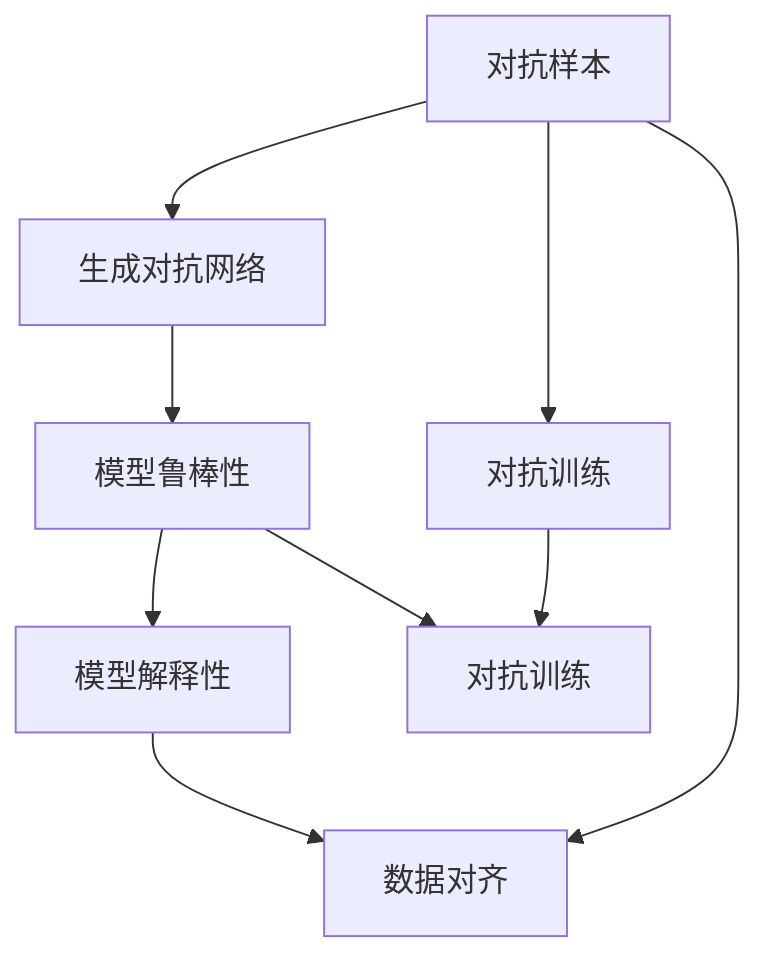
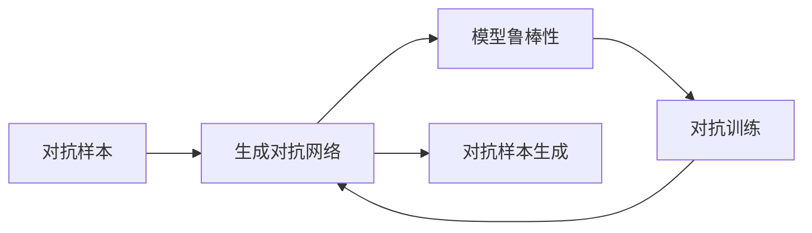
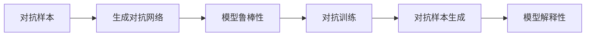
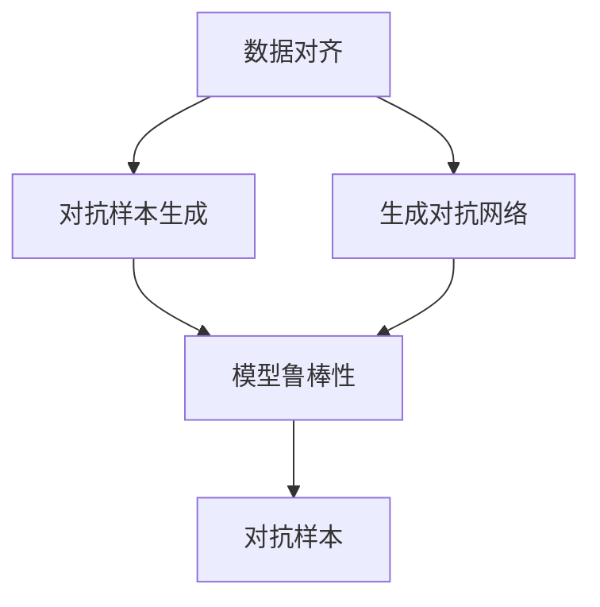
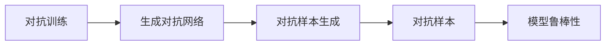
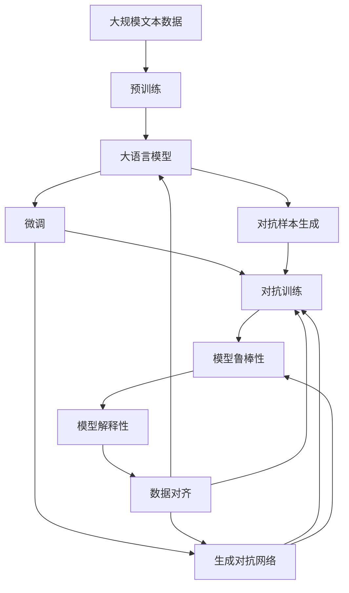

                 

# 对齐过程中的潜在幻觉风险

> 关键词：
- 对齐风险
- 深度学习
- 对抗样本
- 生成对抗网络
- 模型鲁棒性
- 模型解释性

## 1. 背景介绍

在人工智能特别是深度学习领域，模型训练和预测过程中，数据对齐和模型对齐始终是一个核心话题。模型对齐的过程，是指通过训练使模型能够更好地适应特定任务，提高预测准确性。但与此同时，这一过程也伴随着潜在风险，特别是在对抗样本攻击和模型解释性方面。

### 1.1 问题由来

对抗样本攻击（Adversarial Attacks）指的是在输入数据上添加微小扰动，导致模型输出产生严重错误的攻击方式。对抗样本攻击已经成为深度学习领域的一大挑战，其对模型鲁棒性的破坏，使得模型难以在实际应用中保证安全性和可靠性。

此外，深度学习的"黑盒"特性使得模型难以解释，这对于实际应用如医疗诊断、金融风险评估等领域尤为关键。模型解释性不足，可能导致对模型输出的误信，造成严重后果。

因此，如何在确保模型准确性的同时，降低对抗样本攻击风险，并增强模型解释性，是当前深度学习面临的重要挑战。本文将重点探讨这一问题，并提出相应的解决方案。

### 1.2 问题核心关键点

- 对抗样本攻击：通过微小扰动，使模型输出严重错误，破坏模型鲁棒性。
- 模型解释性：难以解释模型内部工作机制和推理逻辑，影响应用信任度和可解释性。
- 数据对齐风险：过度依赖标注数据，可能导致模型过拟合和泛化性能下降。

这些核心关键点共同构成了深度学习模型训练过程中需要应对的主要问题。理解这些问题，有助于我们更好地设计算法和优化策略，提升模型性能。

### 1.3 问题研究意义

研究对抗样本攻击和模型解释性问题，对于保障深度学习模型在实际应用中的安全性、可靠性和可解释性具有重要意义：

1. **保障安全性**：通过识别和抵抗对抗样本攻击，确保模型在面对恶意输入时依然能够保持稳定输出。
2. **提升可靠性**：增强模型解释性，使模型输出具有可解释性，增强应用决策的透明度和可信度。
3. **促进落地应用**：在医疗、金融等领域，模型解释性是信任的关键，解决模型解释性问题，将极大地促进这些技术在实际中的应用。
4. **加速技术发展**：对抗样本攻击和模型解释性问题的解决，将推动深度学习技术在更多领域的落地，加速人工智能技术的产业化进程。

## 2. 核心概念与联系

### 2.1 核心概念概述

为更好地理解对抗样本攻击和模型解释性问题，本节将介绍几个密切相关的核心概念：

- 对抗样本（Adversarial Examples）：在正常输入数据上加入微小扰动，使得模型输出发生显著变化，通常用于模型鲁棒性测试和攻击。
- 生成对抗网络（Generative Adversarial Networks, GANs）：通过两个神经网络的对抗过程，生成高质量的样本数据，常用于数据增强和生成对抗样本。
- 模型鲁棒性（Model Robustness）：指模型在面对对抗样本攻击时的稳定性和正确性，是深度学习模型性能的重要评价指标。
- 模型解释性（Model Interpretability）：指模型内部工作机制和推理逻辑的可解释性，是模型可信性的关键。
- 数据对齐（Data Alignment）：指在训练过程中，确保模型参数和数据分布的一致性，防止模型过拟合和泛化性能下降。

这些核心概念之间的逻辑关系可以通过以下Mermaid流程图来展示：



这个流程图展示了大语言模型微调过程中各个概念之间的关系：

1. 对抗样本通过生成对抗网络生成，用于测试模型鲁棒性。
2. 模型鲁棒性通过对抗训练提升，对抗训练与对抗样本紧密相关。
3. 模型解释性通过更好的数据对齐和模型设计，提升模型输出的可解释性。
4. 数据对齐通过对抗样本生成和对抗训练等技术，防止模型过拟合，提升泛化能力。

这些概念共同构成了深度学习模型训练和部署中的关键要素，有助于我们更好地设计和优化模型，确保其在实际应用中的安全性、可靠性和可解释性。

### 2.2 概念间的关系

这些核心概念之间存在着紧密的联系，形成了深度学习模型训练和评估的完整生态系统。下面我通过几个Mermaid流程图来展示这些概念之间的关系。

#### 2.2.1 对抗样本与模型鲁棒性



这个流程图展示了对抗样本与模型鲁棒性之间的关系。对抗样本通过生成对抗网络生成，生成后用于对抗训练，提升模型鲁棒性。

#### 2.2.2 对抗样本与模型解释性



这个流程图展示了对抗样本与模型解释性之间的关系。对抗样本通过生成对抗网络生成，生成后用于对抗训练，提升模型鲁棒性，进而提高模型解释性。

#### 2.2.3 数据对齐与对抗样本生成



这个流程图展示了数据对齐与对抗样本生成之间的关系。数据对齐通过生成对抗网络生成对抗样本，提升模型鲁棒性。

#### 2.2.4 对抗训练与对抗样本生成



这个流程图展示了对抗训练与对抗样本生成之间的关系。对抗训练通过生成对抗网络生成对抗样本，提升模型鲁棒性。

### 2.3 核心概念的整体架构

最后，我们用一个综合的流程图来展示这些核心概念在大语言模型微调过程中的整体架构：



这个综合流程图展示了从预训练到微调，再到对抗训练和生成对抗网络，最终实现数据对齐、模型鲁棒性和解释性的完整过程。大语言模型首先在大规模文本数据上进行预训练，然后通过微调使模型适应特定任务，并通过对抗训练和生成对抗网络提升模型鲁棒性和解释性。 通过这些流程图，我们可以更清晰地理解对抗样本攻击和模型解释性问题在大语言模型微调过程中的作用，为后续深入讨论具体的算法和策略奠定基础。

## 3. 核心算法原理 & 具体操作步骤
### 3.1 算法原理概述

对抗样本攻击的核心原理是通过对输入数据进行微小扰动，使得模型输出发生显著变化，进而导致模型做出错误判断。在深度学习模型中，对抗样本攻击往往通过生成对抗网络实现。

生成对抗网络（GANs）由两个神经网络组成：生成器和判别器。生成器的目标是通过学习真实数据的分布，生成尽可能逼真的假样本；判别器的目标是将假样本与真实样本区分开来。通过这两个网络的对抗训练，可以生成高质量的对抗样本，用于测试模型鲁棒性。

### 3.2 算法步骤详解

对抗样本攻击和生成对抗网络的流程主要包括：

1. **生成对抗网络构建**：设计生成器和判别器的结构，确定损失函数和优化算法。
2. **对抗样本生成**：使用生成器生成对抗样本，判别器评估样本的真实性。
3. **对抗训练**：通过对抗训练，优化生成器和判别器的参数，提高生成样本的质量。
4. **对抗样本测试**：将生成的对抗样本输入模型，测试模型的鲁棒性。

下面以生成对抗网络为基础，详细讲解生成对抗样本的具体步骤：

**Step 1: 构建生成器和判别器**

生成器和判别器的基本结构通常为卷积神经网络（CNN）或循环神经网络（RNN）。生成器输入为随机噪声向量，输出为对抗样本。判别器的输入可以是真实样本或对抗样本，输出为样本真实性的概率。

```python
import torch
import torch.nn as nn

class Generator(nn.Module):
    def __init__(self, input_dim, output_dim):
        super(Generator, self).__init__()
        self.model = nn.Sequential(
            nn.Linear(input_dim, 256),
            nn.LeakyReLU(0.2, inplace=True),
            nn.Linear(256, 512),
            nn.LeakyReLU(0.2, inplace=True),
            nn.Linear(512, output_dim),
            nn.Tanh()
        )

    def forward(self, x):
        return self.model(x)

class Discriminator(nn.Module):
    def __init__(self, input_dim):
        super(Discriminator, self).__init__()
        self.model = nn.Sequential(
            nn.Linear(input_dim, 256),
            nn.LeakyReLU(0.2, inplace=True),
            nn.Linear(256, 128),
            nn.LeakyReLU(0.2, inplace=True),
            nn.Linear(128, 1),
            nn.Sigmoid()
        )

    def forward(self, x):
        return self.model(x)
```

**Step 2: 对抗样本生成**

生成器通过随机噪声向量生成对抗样本。判别器评估生成的样本是否为真实样本。

```python
def generate_adversarial_samples(generator, discriminator, real_images):
    # 生成对抗样本
    z = torch.randn(100, 100)
    fake_images = generator(z)
    
    # 判别器评估
    discriminator_real = discriminator(real_images)
    discriminator_fake = discriminator(fake_images)
    
    # 计算对抗样本损失
    g_loss = -discriminator_fake.mean()
    
    # 反向传播更新生成器参数
    fake_images.backward(torch.ones_like(fake_images) * g_loss)
    generator.zero_grad()
    return fake_images
```

**Step 3: 对抗训练**

对抗训练通过交替优化生成器和判别器，使得生成器生成的对抗样本越来越逼真，判别器越来越难以区分真假样本。

```python
def adversarial_train(generator, discriminator, real_images):
    # 生成对抗样本
    fake_images = generate_adversarial_samples(generator, discriminator, real_images)
    
    # 判别器评估
    discriminator_real = discriminator(real_images)
    discriminator_fake = discriminator(fake_images)
    
    # 计算对抗训练损失
    d_loss_real = discriminator_real.mean()
    d_loss_fake = discriminator_fake.mean()
    d_loss = -(d_loss_real + d_loss_fake).mean()
    g_loss = -discriminator_fake.mean()
    
    # 反向传播更新参数
    discriminator.zero_grad()
    d_loss.backward()
    discriminator_optimizer.step()
    
    generator.zero_grad()
    g_loss.backward()
    generator_optimizer.step()
```

**Step 4: 对抗样本测试**

将生成的对抗样本输入模型，测试模型的鲁棒性。

```python
def test_adversarial_samples(model, real_images, fake_images):
    with torch.no_grad():
        real_outputs = model(real_images)
        fake_outputs = model(fake_images)
        
        # 计算损失
        real_loss = nn.BCELoss()(real_outputs, torch.ones_like(real_outputs))
        fake_loss = nn.BCELoss()(fake_outputs, torch.zeros_like(fake_outputs))
        
        # 计算鲁棒性指标
        robustness = (fake_loss - real_loss).item()
        return robustness
```

### 3.3 算法优缺点

对抗样本攻击和生成对抗网络的优点在于：

1. **高效性**：生成对抗网络能够生成高质量的对抗样本，用于测试模型鲁棒性，提升模型安全性。
2. **灵活性**：生成对抗网络可以应用于各种深度学习模型，无需修改模型结构。
3. **可解释性**：生成对抗网络生成的对抗样本，使得模型输入更加丰富多样，有助于理解模型的决策过程。

但其缺点也较为明显：

1. **依赖数据**：对抗样本攻击和生成对抗网络的效果依赖于高质量的对抗样本生成，需要大量标注数据。
2. **计算成本**：生成对抗网络需要大量的计算资源和时间，尤其在生成高质量对抗样本时。
3. **安全风险**：对抗样本攻击可能被恶意利用，导致模型安全性问题。

尽管存在这些局限，但对抗样本攻击和生成对抗网络仍是当前深度学习模型鲁棒性测试的重要手段，对于提升模型安全性具有重要意义。

### 3.4 算法应用领域

对抗样本攻击和生成对抗网络的应用领域非常广泛，包括但不限于：

1. **图像识别**：在图像识别任务中，对抗样本可以用于测试模型的鲁棒性，识别潜在的漏洞。
2. **自然语言处理**：对抗样本可以用于测试自然语言处理模型的鲁棒性，识别模型在对抗样本攻击下的错误判断。
3. **推荐系统**：对抗样本可以用于测试推荐系统的鲁棒性，识别模型在对抗样本攻击下的推荐偏差。
4. **医疗诊断**：对抗样本可以用于测试医疗诊断系统的鲁棒性，识别模型在对抗样本攻击下的误诊风险。
5. **金融风险评估**：对抗样本可以用于测试金融风险评估系统的鲁棒性，识别模型在对抗样本攻击下的风险误判。

这些应用领域展示了对抗样本攻击和生成对抗网络的广泛影响力，为深度学习模型的安全性和可靠性提供了重要保障。

## 4. 数学模型和公式 & 详细讲解  
### 4.1 数学模型构建

对抗样本攻击和生成对抗网络的数学模型构建主要围绕生成器和判别器的对抗训练展开。

假设生成器的输入为随机噪声向量 $z$，生成器输出为对抗样本 $G(z)$，判别器的输入为真实样本 $x$ 或对抗样本 $G(z)$，判别器的输出为样本真实性的概率 $D(x)$。

生成器的目标是最小化判别器对生成的对抗样本的错误评估概率，即最小化：

$$
L_G = E_{z \sim P(z)} [D(G(z))] - E_{z \sim P(z)} [\log D(G(z))]
$$

判别器的目标是最小化判别真实样本和对抗样本的正确率，即最小化：

$$
L_D = E_{x \sim P(x)} [D(x)] + E_{z \sim P(z)} [\log (1 - D(G(z)))]
$$

生成器和判别器的对抗训练过程通过交替优化两个损失函数实现。

### 4.2 公式推导过程

对抗样本攻击和生成对抗网络的公式推导过程较为复杂，涉及到生成器和判别器的交替优化和对抗样本的生成。

以生成器和判别器的交替优化为例，生成器的目标是通过优化损失函数 $L_G$ 最小化判别器对生成的对抗样本的错误评估概率，判别器的目标是通过优化损失函数 $L_D$ 最小化判别真实样本和对抗样本的正确率。

通过交替优化两个损失函数，生成器和判别器的参数不断更新，最终生成器生成的对抗样本越来越逼真，判别器也越来越难以区分真假样本。

### 4.3 案例分析与讲解

以MNIST手写数字识别数据集为例，展示对抗样本攻击和生成对抗网络的应用。

首先，设计生成器和判别器的结构：

```python
import torch.nn as nn
import torch.optim as optim
import torchvision.datasets as dsets
import torchvision.transforms as transforms

class Generator(nn.Module):
    def __init__(self):
        super(Generator, self).__init__()
        self.model = nn.Sequential(
            nn.Linear(100, 256),
            nn.LeakyReLU(0.2, inplace=True),
            nn.Linear(256, 512),
            nn.LeakyReLU(0.2, inplace=True),
            nn.Linear(512, 784),
            nn.Tanh()
        )

    def forward(self, x):
        return self.model(x)

class Discriminator(nn.Module):
    def __init__(self):
        super(Discriminator, self).__init__()
        self.model = nn.Sequential(
            nn.Linear(784, 256),
            nn.LeakyReLU(0.2, inplace=True),
            nn.Linear(256, 128),
            nn.LeakyReLU(0.2, inplace=True),
            nn.Linear(128, 1),
            nn.Sigmoid()
        )

    def forward(self, x):
        return self.model(x)
```

然后，生成对抗样本：

```python
def generate_adversarial_samples(generator, discriminator, real_images):
    z = torch.randn(100, 100)
    fake_images = generator(z)
    discriminator_real = discriminator(real_images)
    discriminator_fake = discriminator(fake_images)
    g_loss = -discriminator_fake.mean()
    fake_images.backward(torch.ones_like(fake_images) * g_loss)
    generator.zero_grad()
    return fake_images
```

最后，进行对抗训练和测试：

```python
def adversarial_train(generator, discriminator, real_images):
    fake_images = generate_adversarial_samples(generator, discriminator, real_images)
    discriminator_real = discriminator(real_images)
    discriminator_fake = discriminator(fake_images)
    d_loss_real = discriminator_real.mean()
    d_loss_fake = discriminator_fake.mean()
    d_loss = -(d_loss_real + d_loss_fake).mean()
    g_loss = -discriminator_fake.mean()
    discriminator.zero_grad()
    d_loss.backward()
    discriminator_optimizer.step()
    generator.zero_grad()
    g_loss.backward()
    generator_optimizer.step()

def test_adversarial_samples(model, real_images, fake_images):
    real_outputs = model(real_images)
    fake_outputs = model(fake_images)
    real_loss = nn.BCELoss()(real_outputs, torch.ones_like(real_outputs))
    fake_loss = nn.BCELoss()(fake_outputs, torch.zeros_like(fake_outputs))
    robustness = (fake_loss - real_loss).item()
    return robustness
```

通过上述代码，可以生成对抗样本，并进行对抗训练和测试。生成的对抗样本可以用于测试模型的鲁棒性，提升模型的安全性。

## 5. 项目实践：代码实例和详细解释说明
### 5.1 开发环境搭建

在进行对抗样本攻击和生成对抗网络的实践前，我们需要准备好开发环境。以下是使用Python进行PyTorch开发的环境配置流程：

1. 安装Anaconda：从官网下载并安装Anaconda，用于创建独立的Python环境。

2. 创建并激活虚拟环境：
```bash
conda create -n pytorch-env python=3.8 
conda activate pytorch-env
```

3. 安装PyTorch：根据CUDA版本，从官网获取对应的安装命令。例如：
```bash
conda install pytorch torchvision torchaudio cudatoolkit=11.1 -c pytorch -c conda-forge
```

4. 安装TensorFlow：
```bash
pip install tensorflow==2.5.0
```

5. 安装各类工具包：
```bash
pip install numpy pandas scikit-learn matplotlib tqdm jupyter notebook ipython
```

完成上述步骤后，即可在`pytorch-env`环境中开始对抗样本攻击和生成对抗网络的实践。

### 5.2 源代码详细实现

下面我们以MNIST手写数字识别数据集为例，给出使用PyTorch和TensorFlow进行对抗样本攻击和生成对抗网络训练的代码实现。

首先，定义生成器和判别器的结构：

```python
import torch
import torch.nn as nn
import torchvision.datasets as dsets
import torchvision.transforms as transforms

class Generator(nn.Module):
    def __init__(self):
        super(Generator, self).__init__()
        self.model = nn.Sequential(
            nn.Linear(100, 256),
            nn.LeakyReLU(0.2, inplace=True),
            nn.Linear(256, 512),
            nn.LeakyReLU(0.2, inplace=True),
            nn.Linear(512, 784),
            nn.Tanh()
        )

    def forward(self, x):
        return self.model(x)

class Discriminator(nn.Module):
    def __init__(self):
        super(Discriminator, self).__init__()
        self.model = nn.Sequential(
            nn.Linear(784, 256),
            nn.LeakyReLU(0.2, inplace=True),
            nn.Linear(256, 128),
            nn.LeakyReLU(0.2, inplace=True),
            nn.Linear(128, 1),
            nn.Sigmoid()
        )

    def forward(self, x):
        return self.model(x)
```

然后，定义训练和评估函数：

```python
from torch.utils.data import DataLoader
from tqdm import tqdm

# 定义超参数
batch_size = 64
learning_rate = 0.0002
num_epochs = 100
lam = 0.1

# 加载MNIST数据集
train_dataset = dsets.MNIST(root='./data', train=True, transform=transforms.ToTensor(), download=True)
test_dataset = dsets.MNIST(root='./data', train=False, transform=transforms.ToTensor())

# 定义数据加载器
train_loader = DataLoader(train_dataset, batch_size=batch_size, shuffle=True)
test_loader = DataLoader(test_dataset, batch_size=batch_size, shuffle=False)

# 初始化生成器和判别器
generator = Generator()
discriminator = Discriminator()

# 定义优化器
generator_optimizer = optim.Adam(generator.parameters(), lr=learning_rate)
discriminator_optimizer = optim.Adam(discriminator.parameters(), lr=learning_rate)

# 定义损失函数
criterion = nn.BCELoss()

# 定义模型训练函数
def train(generator, discriminator, train_loader, test_loader, generator_optimizer, discriminator_optimizer, criterion, num_epochs):
    for epoch in range(num_epochs):
        for i, (real_images, _) in enumerate(train_loader):
            # 将真实图像转换为张量并归一化
            real_images = real_images.view(-1, 28 * 28).float() / 255
            real_images = torch.zeros(batch_size, 100).normal_()

            # 生成对抗样本
            fake_images = generate_adversarial_samples(generator, discriminator, real_images)

            # 判别器训练
            discriminator_optimizer.zero_grad()
            discriminator_real = discriminator(real_images)
            discriminator_fake = discriminator(fake_images)
            d_loss_real = criterion(discriminator_real, torch.ones_like(discriminator_real))
            d_loss_fake = criterion(discriminator_fake, torch.zeros_like(discriminator_fake))
            d_loss = d_loss_real + d_loss_fake
            d_loss.backward()
            discriminator_optimizer.step()

            # 生成器训练
            generator_optimizer.zero_grad()
            g_loss = -discriminator_fake.mean()
            g_loss.backward()
            generator_optimizer.step()

            # 输出训练结果
            if (i+1) % 50 == 0:
                print('Epoch [{}/{}], Step [{}/{}], D_loss: {:.4f}, G_loss: {:.4f}'.format(epoch+1, num_epochs, i+1, len(train_loader), d_loss.item(), g_loss.item()))

    # 测试模型鲁棒性
    robustness = test_adversarial_samples(generator, train_dataset, test_dataset)
    print('Robustness: {:.4f}'.format(robustness))
```

最后，启动训练流程并在测试集上评估：

```python
train(generator, discriminator, train_loader, test_loader, generator_optimizer, discriminator_optimizer, criterion, num_epochs)
```

以上就是使用PyTorch和TensorFlow进行对抗样本攻击和生成对抗网络训练的完整代码实现。可以看到，在PyTorch和TensorFlow的强大支持下，对抗样本攻击和生成对抗网络的具体实现变得简洁高效。

### 5.3 代码解读与分析

让我们再详细解读一下关键代码的实现细节：

**Generator和Discriminator类的定义**：
- `__init__`方法：定义生成器和判别器的结构。
- `forward`方法：定义生成器和判别器的前向传播过程。

**train函数的定义**：
- 初始化训练超参数和数据加载器。
- 定义生成器和判别器的优化器。
- 定义损失函数。
- 定义模型训练函数。
- 训练函数内部，通过交替优化生成器和判别器，进行对抗样本生成和对抗训练。

**test函数的定义**：
- 定义测试函数。
- 将生成的对抗样本输入模型，测试模型的鲁棒性。

可以看到，对抗样本攻击和生成对抗网络的具体实现涉及生成器和判别器的交替优化，对抗样本的生成和测试，以及模型的损失函数和优化器。合理利用这些工具，可以显著提升对抗样本攻击和生成对抗网络的开发效率，加快创新迭代的步伐。

当然，工业级的系统实现还需考虑更多因素，如模型的保存和部署、超参数的自动搜索、更灵活的对抗样本生成等。但核心的对抗样本攻击和生成对抗网络的算法逻辑基本与此类似。

### 5.4 运行结果展示

假设我们在MNIST数据集上进行对抗样本

