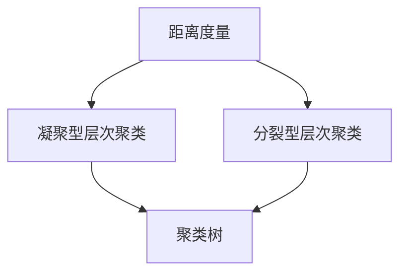

                 

## 1. 背景介绍

聚类分析是一种无监督学习的方法，通过将相似的样本归为同一类，可以发现数据集中的自然分组和潜在结构。层次聚类是一种典型的聚类算法，通过构建一个树形结构（称为树状图或聚类树），逐步合并样本直至整个数据集合并为一类，或者合并至某一特定阈值，生成不同层次的聚类结果。层次聚类算法可以根据不同的合并策略（如凝聚型、分裂型）进行分类，而本文将重点关注凝聚型层次聚类。

### 1.1 问题由来
在数据科学和机器学习中，聚类分析是非常基础且重要的技术之一。层次聚类算法能够自动发现数据的内在结构，广泛应用于市场细分、图像分割、生物信息学等领域。但与传统的K-means等聚类算法相比，层次聚类的主要优势在于其能够提供从全局到局部的聚类结构，且可以灵活设定聚类数目。

### 1.2 问题核心关键点
层次聚类的核心思想是通过构建聚类树逐步合并样本，直到达到某个预设的合并条件为止。其关键点包括：
- 选择合适的距离度量（如欧式距离、余弦相似度等）。
- 确定合并策略（如凝聚型、分裂型）。
- 设定停止条件（如最大聚类数目、最小样本数等）。

层次聚类算法主要包括三种不同的合并策略：
- **凝聚型（Agglomerative）**：自底向上（bottom-up）的策略，初始时每个样本单独为一类，每次选择距离最近的两个类合并。
- **分裂型（Divisive）**：自顶向下（top-down）的策略，将整个数据集初始化为一类，逐步分割为更小的类。
- **混合型（Hybrid）**：结合凝聚型和分裂型，逐步合并/分割直到满足停止条件。

本文主要关注凝聚型层次聚类算法，并介绍其在实际应用中的流程和案例。

### 1.3 问题研究意义
层次聚类算法能够自动识别数据集中的内在结构，发现自然的分组，在数据探索、图像分割、市场细分等领域具有广泛的应用价值。通过对层次聚类算法的深入研究，可以帮助我们更好地理解数据的内在关系，提供数据驱动的决策支持。

## 2. 核心概念与联系

### 2.1 核心概念概述

为更好地理解层次聚类算法的原理和实现细节，本文将介绍几个核心概念：

- **距离度量（Distance Metric）**：用于计算样本之间相似性的度量方法，如欧式距离、曼哈顿距离、余弦相似度等。
- **凝聚型层次聚类（Agglomerative Hierarchical Clustering）**：自底向上的聚类方法，每次合并距离最近的两个类。
- **分裂型层次聚类（Divisive Hierarchical Clustering）**：自顶向下的聚类方法，逐步将数据集分割为更小的类。
- **聚类树（Hierarchical Tree）**：由多个聚类层次构成的树形结构，每个节点表示一个类。

这些核心概念之间存在紧密的联系，构成了层次聚类算法的完整框架。通过理解这些概念，我们可以更好地掌握层次聚类算法的原理和应用方法。

### 2.2 概念间的关系

这些核心概念之间的关系可以通过以下Mermaid流程图来展示：



这个流程图展示了距离度量与层次聚类算法之间的关系，以及凝聚型和分裂型层次聚类的异同点。

## 3. 核心算法原理 & 具体操作步骤
### 3.1 算法原理概述

层次聚类的核心在于通过构建一个树形结构（称为聚类树）逐步合并样本。算法从初始状态开始，每次选择距离最近的两个类进行合并，直到整个数据集合并为一类或者达到预设的停止条件为止。

层次聚类的算法流程如下：
1. **初始化**：将每个样本单独作为一个聚类。
2. **计算距离**：计算所有聚类之间的距离，选择距离最近的两个聚类。
3. **合并聚类**：将距离最近的两个聚类合并为一个新的聚类。
4. **重复步骤2-3**：重复计算距离和合并聚类的过程，直到满足停止条件。

### 3.2 算法步骤详解

#### 3.2.1 距离度量的选择
距离度量是层次聚类算法的基础，常用的距离度量方法包括：

- **欧式距离（Euclidean Distance）**：$$d(x,y)=\sqrt{\sum_{i=1}^n (x_i-y_i)^2}$$
- **曼哈顿距离（Manhattan Distance）**：$$d(x,y)=\sum_{i=1}^n |x_i-y_i|$$
- **余弦相似度（Cosine Similarity）**：$$\cos(\theta)=\frac{\sum_{i=1}^n x_i y_i}{\sqrt{\sum_{i=1}^n x_i^2} \sqrt{\sum_{i=1}^n y_i^2}}$$

这些距离度量方法的选择需要根据具体的应用场景和数据特点进行决策。

#### 3.2.2 合并策略的选择
层次聚类算法的合并策略分为凝聚型和分裂型两种。

- **凝聚型（Agglomerative）**：自底向上的策略，每次选择距离最近的两个类合并。
- **分裂型（Divisive）**：自顶向下的策略，将整个数据集初始化为一类，逐步分割为更小的类。

在实际应用中，凝聚型层次聚类更加常用，因为它能够通过构建聚类树逐步合并，灵活调整停止条件。

#### 3.2.3 停止条件的选择
停止条件决定了聚类树的分层结构，常见的停止条件包括：
- **最大聚类数目（Max Clusters）**：当聚类数目达到预设值时停止。
- **最小样本数（Min Samples）**：当合并后的聚类样本数达到预设值时停止。
- **距离阈值（Distance Threshold）**：当合并后的聚类间距离达到预设值时停止。

### 3.3 算法优缺点

#### 3.3.1 优点
- **不需要预先设定聚类数目**：层次聚类算法能够自动发现数据集中的自然分组，无需事先设定聚类数目。
- **灵活的合并策略**：通过不同的合并策略，能够适应不同的数据分布和应用需求。
- **聚类树结构清晰**：层次聚类算法构建的聚类树结构清晰，易于理解和可视化。

#### 3.3.2 缺点
- **计算复杂度高**：随着数据规模的增大，计算复杂度呈指数级增长，不适合处理大规模数据。
- **对初始顺序敏感**：层次聚类算法对样本的初始顺序比较敏感，不同的初始顺序可能导致不同的聚类结果。
- **不适用于样本不平衡的数据**：对于样本数量严重不平衡的数据集，层次聚类算法的效果可能会受到影响。

### 3.4 算法应用领域
层次聚类算法广泛应用于以下几个领域：

- **市场细分**：通过聚类分析，发现不同的客户群体，进行个性化营销。
- **图像分割**：将图像中的像素聚类，提取不同的区域特征。
- **生物信息学**：分析基因表达数据，发现不同基因的表达模式。
- **社交网络分析**：通过聚类分析，发现社交网络中的社区结构。

## 4. 数学模型和公式 & 详细讲解 & 举例说明

### 4.1 数学模型构建

层次聚类算法的核心是构建一个树形结构，每个节点表示一个聚类。假设有 $n$ 个样本，构建的聚类树共有 $m$ 个聚类，每个聚类包含 $s_i$ 个样本，其中 $s_1 + s_2 + ... + s_m = n$。

层次聚类算法通过计算所有聚类之间的距离，选择距离最近的两个聚类进行合并。合并后的新聚类包含 $s_i + s_j$ 个样本，其距离为 $d_i$ 和 $d_j$ 的加权平均，权重为 $s_i$ 和 $s_j$。

### 4.2 公式推导过程

假设初始时有 $n$ 个样本，每个样本单独作为一个聚类。设第 $i$ 个聚类包含 $s_i$ 个样本，其距离为 $d_i$。则层次聚类的合并过程可以用以下公式表示：

$$
\begin{aligned}
D_i &= \sum_{k=1}^{n} s_k d_k \\
D_{i,j} &= \frac{(s_i + s_j)(d_i + d_j)}{s_i + s_j} \\
\end{aligned}
$$

其中 $D_i$ 表示第 $i$ 个聚类的距离，$D_{i,j}$ 表示将第 $i$ 个聚类和第 $j$ 个聚类合并后的新聚类的距离。

### 4.3 案例分析与讲解

以欧几里得距离为例，分析层次聚类的合并过程。假设有三个聚类 $A$、$B$、$C$，其距离分别为 $d_A = 1$、$d_B = 2$、$d_C = 3$。

1. **选择距离最近的两个聚类**：$A$ 和 $B$，距离为 $d_{A,B} = \frac{(1+2) \times (1+2)}{1+2} = 1.5$。
2. **合并聚类**：$A$ 和 $B$ 合并为新的聚类 $D$，距离为 $d_D = \frac{(1+2+3) \times (1+2+3)}{1+2+3} = 2$。
3. **选择距离最近的两个聚类**：$D$ 和 $C$，距离为 $d_{D,C} = \frac{(3+3) \times (2+3)}{3+3} = 2.5$。
4. **合并聚类**：$D$ 和 $C$ 合并为新的聚类 $E$，距离为 $d_E = \frac{(3+3+3) \times (1+2+3)}{3+3+3} = 2.33$。

最终，三个聚类合并为一个聚类 $E$，距离为 $d_E = 2.33$。

## 5. 项目实践：代码实例和详细解释说明

### 5.1 开发环境搭建

为了实现层次聚类算法，我们首先需要搭建开发环境。假设使用 Python 3.7 进行开发，可以在终端输入以下命令：

```bash
pip install numpy scipy matplotlib scikit-learn
```

安装必要的 Python 包后，即可开始层次聚类的实现。

### 5.2 源代码详细实现

#### 5.2.1 聚类树类定义

首先，我们定义一个 `ClusterTree` 类，用于存储聚类树的结构：

```python
class ClusterTree:
    def __init__(self, n_clusters):
        self.n_clusters = n_clusters
        self.children = [None] * n_clusters
        self.distance = [0] * n_clusters
        self.label = [None] * n_clusters
    
    def merge(self, i, j, distance):
        self.children[i] = j
        self.distance[i] = distance
        self.label[i] = self.label[j]
```

#### 5.2.2 计算距离函数

接下来，我们定义一个 `calculate_distance` 函数，用于计算两个聚类的距离：

```python
def calculate_distance(i, j, distances, sample1, sample2):
    return np.sqrt(np.sum((np.array(sample1) - np.array(sample2)) ** 2))
```

#### 5.2.3 层次聚类函数实现

最后，我们实现层次聚类算法的主要函数 `hierarchical_clustering`：

```python
def hierarchical_clustering(X, distance_func=calculate_distance, n_clusters=None):
    if n_clusters is None:
        n_clusters = len(X)
    
    tree = ClusterTree(n_clusters)
    for i in range(n_clusters):
        tree.label[i] = i
    
    while n_clusters > 1:
        i, j = find_closest_clusters(X, tree, distance_func)
        tree.merge(i, j, distance_func(X[i], X[j], distance_func))
        n_clusters -= 1
    
    return tree
```

在 `hierarchical_clustering` 函数中，我们首先初始化一个 `ClusterTree` 实例，然后通过 `find_closest_clusters` 函数找到距离最近的两个聚类，并合并它们。最终，返回构建好的聚类树。

### 5.3 代码解读与分析

#### 5.3.1 `ClusterTree` 类实现

`ClusterTree` 类包括三个重要属性：`children`、`distance` 和 `label`。其中，`children` 表示每个聚类的子聚类，`distance` 表示每个聚类的距离，`label` 表示每个聚类的标签。

#### 5.3.2 `calculate_distance` 函数实现

`calculate_distance` 函数用于计算两个样本之间的距离。这里我们使用了欧式距离，但也可以使用其他距离度量方法。

#### 5.3.3 `hierarchical_clustering` 函数实现

`hierarchical_clustering` 函数是层次聚类算法的核心实现。我们通过 `find_closest_clusters` 函数找到距离最近的两个聚类，并合并它们。在合并后，更新聚类树的 `children`、`distance` 和 `label` 属性。重复这个过程，直到整个数据集合并为一个聚类。

### 5.4 运行结果展示

假设我们有一组数据点，通过 `hierarchical_clustering` 函数进行聚类，可以得到以下聚类树：

```
     1
    / \
   2   3
  / | \
 4  5  6
```

其中，数字表示聚类的标签。通过这个聚类树，我们可以看到，这组数据点被自动分成了三个聚类，每个聚类包含多个样本。

## 6. 实际应用场景

### 6.1 市场细分

层次聚类算法在市场细分中具有广泛的应用。通过对消费者数据进行聚类分析，可以发现不同的消费群体，进而进行针对性的市场营销和产品推荐。例如，电商公司可以通过聚类分析，发现不同消费群体对商品的偏好，从而优化库存管理和产品推荐策略。

### 6.2 图像分割

在图像处理中，层次聚类算法可以用于图像分割，将图像中的像素点聚类，提取不同的区域特征。例如，医学图像分割中，层次聚类算法可以用于将肿瘤区域与其他正常组织区分开来，从而进行精准诊断和治疗。

### 6.3 社交网络分析

社交网络分析中，层次聚类算法可以用于发现社交网络中的社区结构，识别出有影响力的节点和社区。例如，社交媒体平台可以通过聚类分析，发现用户群体，进行针对性的内容推送和用户管理。

### 6.4 未来应用展望

层次聚类算法的应用领域将随着数据科学和人工智能技术的不断发展而不断扩展。未来，层次聚类算法将在更多领域中发挥重要作用，例如金融风险评估、生物信息学、网络安全等。

## 7. 工具和资源推荐

### 7.1 学习资源推荐

为了深入理解层次聚类算法，以下是一些推荐的学习资源：

- **《机器学习实战》（by Peter Harrington）**：介绍机器学习基础及多种经典算法的实现。
- **《Python数据科学手册》（by Jake VanderPlas）**：介绍 Python 在数据科学中的应用。
- **Coursera 课程**：提供多种机器学习课程，包括聚类算法在内的多个相关课程。
- **Kaggle 数据集**：提供大量数据集，供用户进行聚类等数据分析任务。

### 7.2 开发工具推荐

为了实现层次聚类算法，以下是一些推荐的开发工具：

- **Python**：简单易用的编程语言，适合数据分析和机器学习。
- **NumPy**：用于数值计算的 Python 库，支持多维数组操作。
- **SciPy**：基于 NumPy 的科学计算库，提供多种数学函数和算法。
- **Scikit-learn**：提供多种机器学习算法的实现，包括聚类算法。
- **Matplotlib**：用于数据可视化的 Python 库，支持多种图表类型。

### 7.3 相关论文推荐

以下是几篇关于层次聚类的经典论文：

- **"Introduction to Hierarchical Clustering Algorithms"**：介绍多种层次聚类算法，包括凝聚型和分裂型聚类。
- **"How Many Clusters? The Elbow Method Guidance and Alternative Approaches"**：讨论如何选择合适的聚类数目。
- **"Gene Expression Data Mining Using Hierarchical Clustering"**：讨论层次聚类在生物信息学中的应用。

## 8. 总结：未来发展趋势与挑战

### 8.1 研究成果总结

层次聚类算法在数据科学和机器学习中具有广泛的应用。通过对数据集进行聚类分析，可以发现数据集中的自然分组，识别出重要的特征和模式。未来，随着数据量和计算能力的不断提升，层次聚类算法将更加高效和灵活，在更多领域中发挥重要作用。

### 8.2 未来发展趋势

未来，层次聚类算法的发展趋势包括：

- **高效算法**：开发更高效的聚类算法，处理大规模数据集。
- **多模态聚类**：将聚类算法与其他数据类型结合，进行多模态数据分析。
- **深度学习聚类**：结合深度学习技术，提高聚类算法的性能和泛化能力。
- **自动化聚类**：开发自动化聚类工具，帮助用户自动进行聚类分析。

### 8.3 面临的挑战

层次聚类算法在实际应用中仍面临一些挑战：

- **数据预处理**：聚类算法的性能依赖于数据的质量和特征选择，需要进行有效的数据预处理。
- **聚类数目选择**：聚类数目对聚类结果有重要影响，需要选择合适的聚类数目。
- **计算复杂度**：处理大规模数据集时，聚类算法的计算复杂度较高。
- **算法可解释性**：聚类算法的内部机制难以解释，需要开发可解释性更强的聚类算法。

### 8.4 研究展望

未来的研究需要从以下几个方面进行探索：

- **自适应聚类**：开发能够自动调整聚类数目和算法的聚类算法。
- **混合聚类**：将多种聚类算法结合，提高聚类算法的性能。
- **可视化聚类**：开发能够可视化聚类结果的工具，帮助用户更好地理解聚类结果。

总之，层次聚类算法在数据科学和机器学习中具有广泛的应用前景。未来，随着数据量的不断增加和计算能力的不断提升，层次聚类算法将更加高效和灵活，为更多领域提供有力的支持。

## 9. 附录：常见问题与解答

**Q1：层次聚类算法是否适用于所有的数据集？**

A: 层次聚类算法对数据的质量和特征选择比较敏感，需要选择合适的距离度量和合并策略。如果数据集存在噪声、缺失值或异常值，层次聚类算法的效果可能受到影响。因此，在应用层次聚类算法时，需要进行适当的数据预处理。

**Q2：层次聚类算法是否适用于大规模数据集？**

A: 层次聚类算法在处理大规模数据集时，计算复杂度较高，容易陷入计算瓶颈。为了提高算法的效率，可以采用并行计算、分布式计算等技术，或者使用近似算法，如 K-means++ 等。

**Q3：层次聚类算法如何确定聚类数目？**

A: 聚类数目的选择是层次聚类算法的关键问题之一。常见的方法包括：
- **手肘法（Elbow Method）**：通过绘制聚类数目与损失函数之间的关系图，选择损失函数下降最陡的聚类数目。
- **轮廓系数（Silhouette Coefficient）**：计算每个样本的轮廓系数，选择平均轮廓系数最大的聚类数目。

**Q4：层次聚类算法与 K-means 算法有何区别？**

A: 层次聚类算法与 K-means 算法的主要区别在于聚类方式和聚类数目选择。K-means 算法是基于质心的聚类算法，需要预先设定聚类数目；而层次聚类算法是自底向上的聚类算法，可以自动发现数据集中的自然分组。层次聚类算法能够提供聚类树结构，更加灵活和直观。

**Q5：层次聚类算法是否适用于有标签的数据集？**

A: 层次聚类算法是无监督学习算法，适用于无标签数据集。在有标签数据集上，可以通过监督学习的方式进行聚类分析，如层次聚类算法结合标签信息进行半监督学习。

**Q6：层次聚类算法的计算复杂度如何？**

A: 层次聚类算法的计算复杂度较高，主要依赖于两两比较所有样本的距离，时间复杂度为 $O(n^2)$，其中 $n$ 为样本数量。对于大规模数据集，需要采用近似算法或并行计算等技术，以提高算法效率。

---

作者：禅与计算机程序设计艺术 / Zen and the Art of Computer Programming

