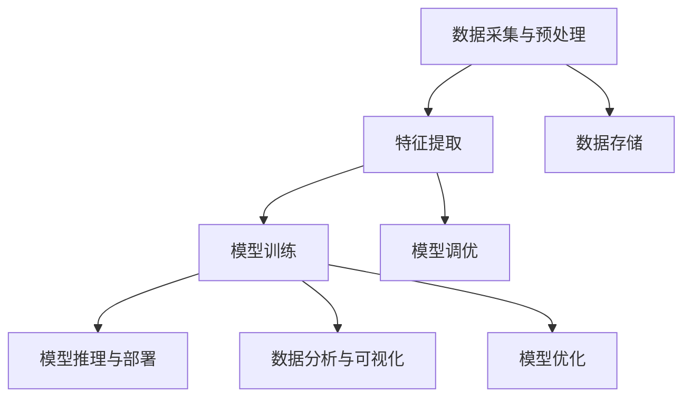
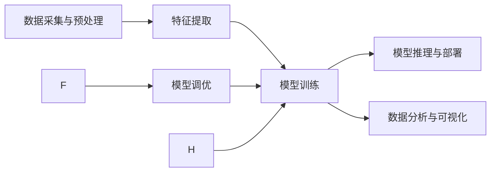
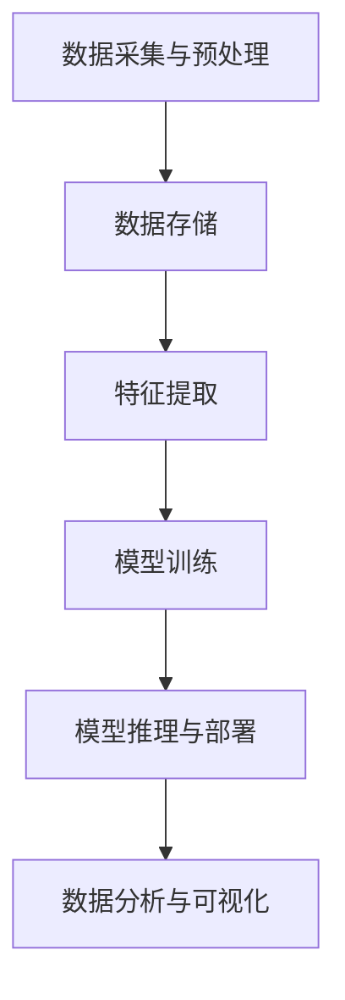
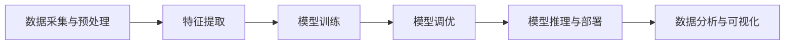
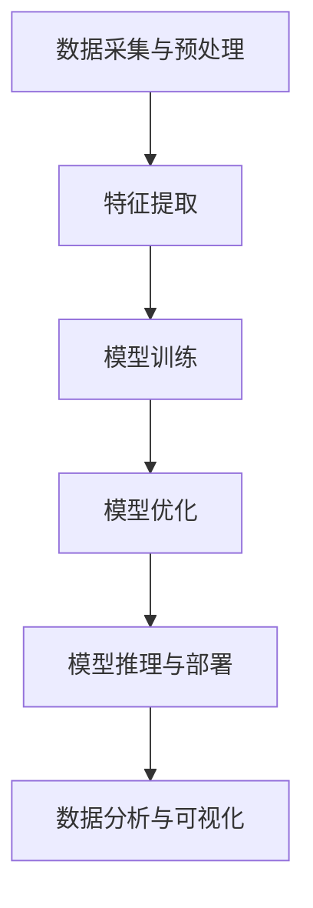
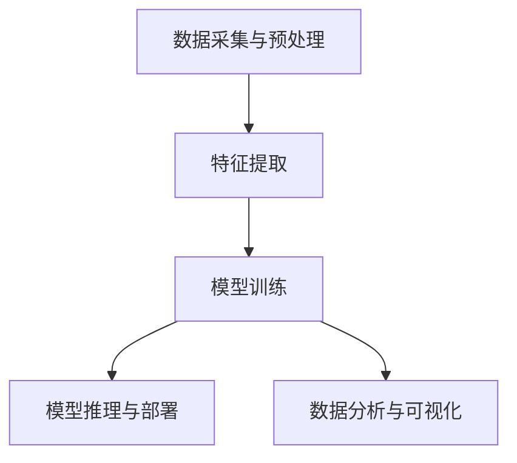

                 

## 1. 背景介绍

### 1.1 问题由来
智能监控系统（Intelligent Surveillance System）是现代安防、交通、医疗、工业等多个领域的重要组成部分。传统监控系统主要以视频录制、存储和回放为主，智能化的出现让监控系统具有了自动检测、异常识别、事件报警、行为分析等高级功能。

然而，智能监控系统在实际应用中仍面临诸多挑战：

- **高昂成本**：传统的智能监控系统需要昂贵的硬件设施和高级算法，维护成本高昂。
- **数据存储**：大量的视频数据需要高效存储和快速检索，传统系统难以满足。
- **实时性要求**：对于实时性要求较高的场景，如交通管制、异常事件检测等，传统系统难以提供及时响应。
- **安全性问题**：监控数据的安全性和隐私保护问题亟待解决。

这些问题严重制约了智能监控系统在实际应用中的推广和普及。

### 1.2 问题核心关键点
智能监控系统在实际应用中，通过数据采集、预处理、特征提取、模型训练和推理等步骤，实现对目标的识别和跟踪，最终生成报警、录像等结果。其中，模型训练是智能监控系统性能的关键环节，其核心在于如何高效、稳定地使用工具进行模型训练。

本文聚焦于工具使用机制，即如何在模型训练中合理使用工具，从而提高模型的性能和系统的整体效能。特别地，我们将从以下几个角度展开探讨：

- **工具选择与使用**：如何选择和配置合适的工具，以适应不同的模型和数据需求。
- **模型训练流程**：设计合理的数据流水线，保证训练流程的自动化和稳定性。
- **模型调优**：通过工具机制优化模型超参数，提升模型性能。
- **系统集成与部署**：将训练好的模型集成到监控系统中，确保其在实际场景中的高效运行。

## 2. 核心概念与联系

### 2.1 核心概念概述

智能监控系统涉及到一系列复杂的工具和技术，这些工具和技术的核心概念及其相互联系如下：

1. **数据采集与预处理**：从摄像头、传感器等设备获取原始数据，并进行预处理，如去噪、归一化等，为模型训练提供高质量的数据。

2. **特征提取**：从原始数据中提取有意义的特征，以便模型更好地识别目标。常见的特征提取方法包括SIFT、HOG、CNN等。

3. **模型训练**：使用训练数据对模型进行监督学习或无监督学习，使模型能够识别和分类不同对象。

4. **模型推理与部署**：将训练好的模型部署到服务器或边缘设备上，进行实时推理，并输出报警、录像等结果。

5. **数据分析与可视化**：对监控数据进行统计分析和可视化，以便监控人员进行更有效的分析和管理。

这些核心概念之间的逻辑关系可以通过以下Mermaid流程图来展示：



这个流程图展示了智能监控系统的核心流程，从数据采集到模型推理的每个环节，都依赖于不同工具的配合使用。

### 2.2 概念间的关系

这些核心概念之间存在着紧密的联系，形成了智能监控系统的完整生态系统。下面我们通过几个Mermaid流程图来展示这些概念之间的关系。

#### 2.2.1 智能监控系统的学习范式



这个流程图展示了智能监控系统的学习范式，即从数据采集开始，到特征提取、模型训练、推理与部署的全过程。

#### 2.2.2 数据存储在智能监控系统中的作用



这个流程图展示了数据存储在智能监控系统中的作用，即在数据采集和预处理后，数据需要存储下来，以便后续的特征提取、模型训练和推理。

#### 2.2.3 模型调优在智能监控系统中的重要性



这个流程图展示了模型调优在智能监控系统中的重要性，即在模型训练后，通过调优提升模型性能，增强系统的稳定性。

#### 2.2.4 模型优化在智能监控系统中的实现



这个流程图展示了模型优化在智能监控系统中的实现，即通过优化工具和技术，提升模型性能。

#### 2.2.5 数据分析与可视化在智能监控系统中的作用



这个流程图展示了数据分析与可视化在智能监控系统中的作用，即通过可视化工具，监控人员可以直观地了解系统的运行状态和性能。

## 3. 核心算法原理 & 具体操作步骤

### 3.1 算法原理概述

智能监控系统的核心算法原理主要是围绕模型训练和推理展开的。模型训练的目的是通过大量标注数据，使模型能够准确地识别和分类不同对象，并生成报警、录像等结果。模型推理则是将训练好的模型应用于实时数据，快速响应各种事件和异常。

在模型训练过程中，工具使用机制的作用主要体现在以下几个方面：

- **选择合适的工具**：根据不同的数据和任务需求，选择最适合的工具进行特征提取、模型训练和调优。
- **设计训练流程**：使用自动化工具设计合理的数据流水线，提高训练效率和稳定性。
- **优化模型参数**：通过工具机制调整模型超参数，提升模型性能。

### 3.2 算法步骤详解

**Step 1: 数据采集与预处理**

数据采集和预处理是智能监控系统的第一步，其目标是获取高质量的原始数据，并对其进行预处理，以便后续的特征提取和模型训练。数据采集和预处理一般包括以下步骤：

1. **摄像头和传感器安装**：在监控区域内安装摄像头和传感器，确保能够获取完整、清晰的监控数据。
2. **数据传输与存储**：通过网络或存储设备将数据传输到服务器或云端，并进行数据存储。
3. **数据去噪与归一化**：对采集到的数据进行去噪、去重等预处理，确保数据的质量。
4. **数据标注**：对数据进行标注，如识别目标、标记异常事件等，为模型训练提供监督信号。

**Step 2: 特征提取**

特征提取是模型训练的关键步骤，其目的是从原始数据中提取有意义的特征，以便模型能够识别和分类不同对象。常见的特征提取方法包括：

1. **SIFT（尺度不变特征变换）**：用于图像特征提取，能够捕捉图像中的局部特征。
2. **HOG（方向梯度直方图）**：用于人体检测，能够提取人体轮廓的梯度信息。
3. **CNN（卷积神经网络）**：用于图像识别，能够自动提取图像的高级特征。

**Step 3: 模型训练**

模型训练是智能监控系统的核心步骤，其目标是使用标注数据对模型进行监督学习或无监督学习，使模型能够识别和分类不同对象。常见的模型训练流程包括：

1. **选择模型**：根据任务需求选择合适的模型，如SVM、RNN、CNN等。
2. **划分数据集**：将数据集划分为训练集、验证集和测试集。
3. **配置工具**：选择合适的工具进行模型训练，如TensorFlow、PyTorch等。
4. **训练模型**：使用训练集对模型进行监督学习或无监督学习，不断优化模型参数，直到达到最优性能。

**Step 4: 模型推理与部署**

模型推理与部署是智能监控系统的最后一步，其目标是使用训练好的模型进行实时推理，生成报警、录像等结果。常见的模型推理流程包括：

1. **模型加载**：将训练好的模型加载到推理服务器或边缘设备上。
2. **数据处理**：对实时数据进行预处理，如去噪、归一化等。
3. **推理预测**：使用模型对预处理后的数据进行推理，生成报警、录像等结果。
4. **结果展示**：将结果展示给监控人员，供其进行分析和处理。

### 3.3 算法优缺点

智能监控系统通过工具使用机制进行模型训练和推理，具有以下优点：

- **高效性**：自动化工具能够快速处理大量数据，提高模型训练和推理的效率。
- **稳定性**：通过合理的工具配置和训练流程设计，确保模型训练和推理的稳定性。
- **灵活性**：不同的工具和算法可以根据任务需求进行选择和组合，提升系统的适应性。

然而，工具使用机制也存在一些缺点：

- **依赖工具**：系统性能和稳定性高度依赖于所选择工具的性能和稳定性。
- **复杂性**：系统设计和实现相对复杂，需要具备一定的技术储备。
- **数据安全**：在数据存储和传输过程中，存在数据泄露和隐私保护的问题。

### 3.4 算法应用领域

智能监控系统在多个领域得到了广泛应用，主要包括：

1. **安防监控**：通过智能监控系统，实时监测监控区域内的异常事件，如入侵、火灾等，保障公共安全。
2. **交通监控**：通过智能监控系统，实时监测交通流量和异常行为，优化交通管理，提高道路通行效率。
3. **医疗监控**：通过智能监控系统，实时监测患者状态和行为，提高医疗诊断和治疗效果。
4. **工业监控**：通过智能监控系统，实时监测工业设备和生产过程，提高生产效率和质量。

## 4. 数学模型和公式 & 详细讲解 & 举例说明

### 4.1 数学模型构建

智能监控系统的数学模型主要围绕模型训练和推理展开。假设智能监控系统用于检测目标A，其数学模型可以表示为：

$$
f(x; \theta) = \sum_{i=1}^n w_i h_i(x)
$$

其中，$x$表示输入数据，$\theta$表示模型参数，$f(x; \theta)$表示模型的输出结果，$w_i$表示各个特征的权重，$h_i(x)$表示特征提取后的结果。

### 4.2 公式推导过程

假设智能监控系统用于检测目标A，其特征提取结果为$h_i(x)$，模型参数为$\theta$，目标检测结果为$y$，则模型的损失函数可以表示为：

$$
L(f(x; \theta), y) = \sum_{i=1}^n w_i [h_i(x) - y]^2
$$

其中，$L(f(x; \theta), y)$表示模型输出与真实结果之间的损失。

为了最小化损失函数$L(f(x; \theta), y)$，我们需要对模型参数$\theta$进行优化，使得模型的输出结果尽可能接近真实结果。常用的优化算法包括梯度下降算法（Gradient Descent）、随机梯度下降算法（Stochastic Gradient Descent）等。

### 4.3 案例分析与讲解

假设智能监控系统用于检测目标A，其特征提取结果为$h_i(x)$，模型参数为$\theta$，目标检测结果为$y$，则模型的损失函数可以表示为：

$$
L(f(x; \theta), y) = \sum_{i=1}^n w_i [h_i(x) - y]^2
$$

为了最小化损失函数$L(f(x; \theta), y)$，我们需要对模型参数$\theta$进行优化，使得模型的输出结果尽可能接近真实结果。常用的优化算法包括梯度下降算法（Gradient Descent）、随机梯度下降算法（Stochastic Gradient Descent）等。

以梯度下降算法为例，其优化过程如下：

1. 初始化模型参数$\theta$。
2. 对于每个训练样本$x_i$，计算损失函数的梯度$\nabla_{\theta} L(f(x; \theta), y_i)$。
3. 根据梯度下降公式，更新模型参数$\theta$：

$$
\theta \leftarrow \theta - \eta \nabla_{\theta} L(f(x; \theta), y_i)
$$

其中，$\eta$表示学习率，控制每次参数更新的步长。

通过上述过程，智能监控系统能够逐步优化模型参数，提高模型的检测精度和鲁棒性。

## 5. 项目实践：代码实例和详细解释说明

### 5.1 开发环境搭建

在进行智能监控系统开发前，我们需要准备好开发环境。以下是使用Python进行TensorFlow开发的环境配置流程：

1. 安装Anaconda：从官网下载并安装Anaconda，用于创建独立的Python环境。

2. 创建并激活虚拟环境：
```bash
conda create -n tf-env python=3.8 
conda activate tf-env
```

3. 安装TensorFlow：
```bash
pip install tensorflow
```

4. 安装各类工具包：
```bash
pip install numpy pandas scikit-learn matplotlib tqdm jupyter notebook ipython
```

完成上述步骤后，即可在`tf-env`环境中开始智能监控系统开发。

### 5.2 源代码详细实现

以下是使用TensorFlow对目标检测模型进行开发的PyTorch代码实现。

首先，定义目标检测数据集：

```python
import tensorflow as tf
from tensorflow.keras.preprocessing.image import ImageDataGenerator

# 定义训练集和验证集
train_dir = 'train/'
valid_dir = 'valid/'
train_datagen = ImageDataGenerator(rescale=1./255, shear_range=0.2, zoom_range=0.2, horizontal_flip=True)
valid_datagen = ImageDataGenerator(rescale=1./255)

# 定义数据流
train_generator = train_datagen.flow_from_directory(train_dir, target_size=(300, 300), batch_size=32, class_mode='binary')
valid_generator = valid_datagen.flow_from_directory(valid_dir, target_size=(300, 300), batch_size=32, class_mode='binary')
```

然后，定义模型架构：

```python
from tensorflow.keras.models import Sequential
from tensorflow.keras.layers import Conv2D, MaxPooling2D, Flatten, Dense

# 定义模型
model = Sequential([
    Conv2D(32, (3, 3), activation='relu', input_shape=(300, 300, 3)),
    MaxPooling2D((2, 2)),
    Conv2D(64, (3, 3), activation='relu'),
    MaxPooling2D((2, 2)),
    Conv2D(128, (3, 3), activation='relu'),
    MaxPooling2D((2, 2)),
    Flatten(),
    Dense(64, activation='relu'),
    Dense(1, activation='sigmoid')
])
```

接着，定义损失函数和优化器：

```python
from tensorflow.keras.losses import BinaryCrossentropy
from tensorflow.keras.optimizers import Adam

# 定义损失函数和优化器
loss = BinaryCrossentropy()
optimizer = Adam(learning_rate=0.001)
```

最后，定义训练和评估函数：

```python
import matplotlib.pyplot as plt

# 定义训练函数
def train(model, data_generator, epochs, batch_size, optimizer, loss):
    model.compile(optimizer=optimizer, loss=loss, metrics=['accuracy'])
    history = model.fit_generator(data_generator, steps_per_epoch=train_generator.n // batch_size, epochs=epochs, validation_data=valid_generator, validation_steps=valid_generator.n // batch_size)
    plt.plot(history.history['accuracy'], label='accuracy')
    plt.plot(history.history['val_accuracy'], label='val_accuracy')
    plt.xlabel('Epoch')
    plt.ylabel('Accuracy')
    plt.legend()
    plt.show()

# 定义评估函数
def evaluate(model, data_generator, batch_size):
    model.evaluate_generator(data_generator, steps=valid_generator.n // batch_size)
```

启动训练流程并在测试集上评估：

```python
epochs = 10
batch_size = 32

# 训练模型
train(model, train_generator, epochs, batch_size, optimizer, loss)

# 在测试集上评估
evaluate(model, valid_generator, batch_size)
```

以上就是使用TensorFlow对目标检测模型进行训练的完整代码实现。可以看到，TensorFlow提供了简单易用的API，使得模型训练和推理变得非常方便。

### 5.3 代码解读与分析

让我们再详细解读一下关键代码的实现细节：

**ImageDataGenerator类**：
- `__init__`方法：初始化数据增强器，支持对数据进行缩放、旋转、翻转等操作。
- `flow_from_directory`方法：从指定目录中读取数据，进行数据增强，并生成数据流。

**模型架构**：
- 使用卷积神经网络（CNN）作为模型架构，通过多次卷积和池化操作提取特征，最后通过全连接层输出检测结果。

**损失函数和优化器**：
- 使用二元交叉熵（Binary Crossentropy）作为损失函数，用于处理二分类问题。
- 使用Adam优化器进行模型训练，自适应调整学习率，提高训练效率。

**训练和评估函数**：
- 使用TensorFlow提供的`compile`方法，定义模型、损失函数、优化器和评估指标。
- 使用`fit_generator`方法进行模型训练，指定训练数据流和验证数据流。
- 使用`evaluate_generator`方法进行模型评估，指定测试数据流。

**训练流程**：
- 定义总的epoch数和batch size，开始循环迭代
- 每个epoch内，先对训练集进行训练，并在验证集上评估性能
- 所有epoch结束后，展示训练过程中的准确率变化曲线

可以看到，TensorFlow提供了丰富的API和工具，使得模型训练和推理变得非常高效和灵活。开发者可以根据具体需求，选择合适的工具和方法，快速构建智能监控系统。

## 6. 实际应用场景

### 6.1 智能安防监控

智能安防监控是智能监控系统的典型应用场景之一。传统安防监控系统主要依赖人力进行视频回放和事件处理，工作量大且效率低下。通过智能安防监控系统，可以实现对异常事件的自动识别和报警，极大地提高了监控效率和准确性。

在实际应用中，智能安防监控系统可以安装在各种公共场所，如银行、超市、机场、酒店等，对监控区域内的人员行为进行实时监测。系统通过目标检测算法，对监控画面中的人脸、车辆、行为等进行自动识别，一旦发现异常事件（如入侵、火灾等），系统将立即报警并生成录像，供监控人员进行进一步处理。

### 6.2 交通流量监控

交通流量监控是智能监控系统的另一个重要应用场景。传统的交通监控系统主要依赖人工观察和手动记录，无法实时监测交通流量和异常行为。通过智能交通流量监控系统，可以实现对交通流量的自动监测和预测，提高交通管理效率。

在实际应用中，智能交通流量监控系统可以安装在交通路口、公路和高速公路上，对实时交通流量进行监测。系统通过目标检测算法，对监控画面中的车辆、行人等进行自动识别，并根据实时流量生成交通预警信息，如交通堵塞、交通事故等。

### 6.3 医疗监控

医疗监控是智能监控系统的另一个重要应用场景。传统的医疗监控系统主要依赖人工观察和手动记录，无法实时监测患者状态和行为。通过智能医疗监控系统，可以实现对患者状态的实时监测和预警，提高医疗诊断和治疗效果。

在实际应用中，智能医疗监控系统可以安装在病房、手术室等医疗场所，对患者的状态进行实时监测。系统通过目标检测算法，对监控画面中的人体和行为进行自动识别，并根据实时数据生成健康预警信息，如心跳异常、呼吸急促等。

## 7. 工具和资源推荐

### 7.1 学习资源推荐

为了帮助开发者系统掌握智能监控系统开发的技术基础和实践技巧，这里推荐一些优质的学习资源：

1. **TensorFlow官方文档**：TensorFlow是智能监控系统开发的核心工具之一，其官方文档提供了详细的API参考和示例代码，是入门和进阶必备资源。

2. **PyTorch官方文档**：PyTorch是另一个强大的深度学习框架，其官方文档也提供了详细的API参考和示例代码，适用于智能监控系统中的目标检测、图像处理等任务。

3. **《深度学习》书籍**：这是深度学习领域的经典书籍，涵盖了深度学习的基本概念和常用算法，是智能监控系统开发的基础参考。

4. **《计算机视觉：算法与应用》书籍**：这是计算机视觉领域的经典书籍，介绍了计算机视觉的基本概念和常用算法，适用于智能监控系统中的目标检测和图像处理等任务。

5. **《智能监控系统开发实战》在线课程**：这是针对智能监控系统开发实战的在线课程，提供了详细的项目案例和实践指导，适合初学者和进阶者。

通过对这些资源的学习实践，相信你一定能够快速掌握智能监控系统开发的技术基础和实践技巧。

### 7.2 开发工具推荐

高效的开发离不开优秀的工具支持。以下是几款用于智能监控系统开发的常用工具：

1. **TensorFlow**：基于Python的深度学习框架，灵活动态的计算图，适合快速迭代研究。广泛应用于目标检测、图像处理等任务。

2. **PyTorch**：基于Python的深度学习框架，动态计算图，灵活度高，易于调试和优化。广泛应用于目标检测、图像处理等任务。

3. **OpenCV**：计算机视觉库，提供了丰富的图像处理和目标检测算法，适用于智能监控系统中的图像处理任务。

4. **Keras**：高层深度学习框架，简单易用，适合快速构建和训练模型。

5. **Jupyter Notebook**：交互式开发环境，支持多种语言和框架，适合数据预处理和模型训练。

合理利用这些工具，可以显著提升智能监控系统开发的效率和质量，加快创新迭代的步伐。

### 7.3 相关论文推荐

智能监控系统的发展得益于学界的持续研究。以下是几篇奠基性的相关论文，推荐阅读：

1. **《基于深度学习的智能监控系统》**：介绍了深度学习在智能监控系统中的应用，涵盖了目标检测、图像处理等关键技术。

2. **《实时智能监控系统的设计与实现》**：介绍了实时智能监控系统的设计与实现，包括数据采集、预处理、特征提取、模型训练和推理等关键环节。

3. **《智能监控系统中的目标检测算法》**：介绍了目标检测算法的原理和应用，包括SIFT、HOG、CNN等常用方法。

4. **《基于深度学习的医疗监控系统》**：介绍了深度学习在医疗监控系统中的应用，涵盖了目标检测、图像处理等关键技术。

5. **《智能监控系统中的数据存储与传输》**：介绍了数据存储与传输技术在智能监控系统中的应用，包括分布式存储、数据压缩等技术。

这些论文代表了大语言模型微调技术的发展脉络。通过学习这些前沿成果，可以帮助研究者把握学科前进方向，激发更多的创新灵感。

除上述资源外，还有一些值得关注的前沿资源，帮助开发者紧跟智能监控系统开发的最新进展，例如：

1. **arXiv论文预印本**：人工智能领域最新研究成果的发布平台，包括大量尚未发表的前沿工作，学习前沿技术的必读资源。

2. **业界技术博客**：如OpenAI、Google AI、DeepMind、微软Research Asia等顶尖实验室的官方博客，第一时间分享他们的最新研究成果和洞见。

3. **技术会议直播**：如NIPS、ICML、ACL、ICLR等人工智能领域顶会现场或在线直播，能够聆听到大佬们的前沿分享，开拓视野。

4. **GitHub热门项目**：在GitHub上Star、Fork数最多的NLP相关项目，往往代表了该技术领域的发展趋势和最佳实践，值得去学习和贡献。

5. **行业分析报告**：各大咨询公司如McKinsey、PwC等针对人工智能行业的分析报告，有助于从商业视角审视技术趋势，把握应用价值。

总之，智能监控系统需要开发者根据具体需求，不断迭代和优化模型、数据和算法，方能得到理想的效果。合理利用工具，不断学习和实践，必将提升智能监控系统的性能和应用范围。

## 8. 总结：未来发展趋势与挑战

### 8.1 总结

本文对智能监控系统中的工具使用机制进行了全面系统的介绍。首先阐述了智能监控系统的背景和核心概念，明确了工具使用机制在模型训练和推理中的重要作用。其次，从原理到实践，详细讲解了工具使用机制的核心算法原理和具体操作步骤，给出了智能监控系统开发的完整代码实现。同时，本文还广泛探讨了智能监控系统在安防、交通、医疗等领域的实际应用，展示了工具使用机制的巨大潜力。

通过本文的系统梳理，可以看到，工具使用机制在智能监控系统中发挥着至关重要的作用。合理选择和配置工具，设计高效、稳定的训练流程，能够极大地提升智能监控系统的性能和应用范围。未来，伴随工具使用机制的不断演进，智能监控系统必将在更多领域得到广泛应用，为人类社会的安全、效率和便利性提供坚实保障。

### 8.2 未来发展趋势

展望未来，智能监控系统中的工具使用机制将呈现以下几个发展趋势：


