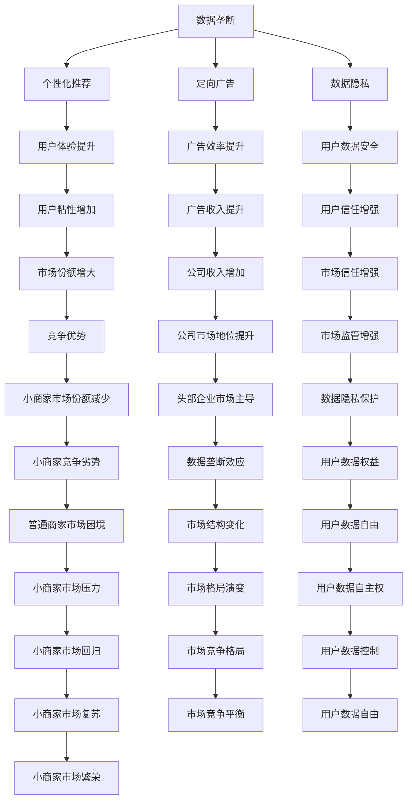
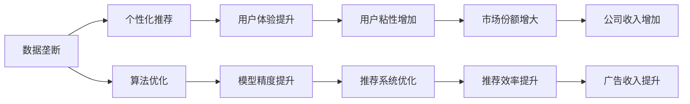
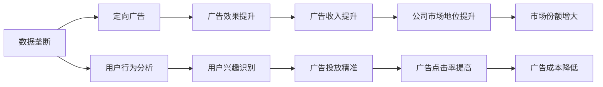
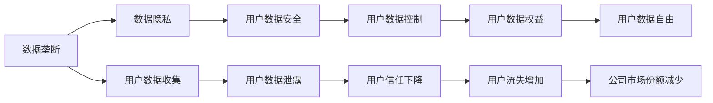

                 

# 平台和头部企业垄断数据：普通商家难赚钱

## 1. 背景介绍

### 1.1 问题由来

近年来，随着互联网和信息技术的飞速发展，电子商务、社交媒体、内容创作等平台日益壮大，头部企业如亚马逊、阿里巴巴、Facebook、Google等在各自领域取得了巨大成功。这些企业不仅积累了庞大的用户基础，还掌握了大量的数据资源，成为行业中的“数据垄断者”。与之相对的，普通商家由于技术和资源限制，难以直接从这些数据中获取价值，在竞争中逐渐丧失了市场地位。

### 1.2 问题核心关键点

该问题聚焦于头部企业如何利用垄断数据优势，构建“数据生态系统”，对普通商家形成潜在的市场威胁。平台利用算法优化、个性化推荐、定向广告等多种手段，显著提升了用户体验，同时也剥夺了小商家的市场份额。该问题还涉及数据隐私、数据安全、公平竞争等伦理和法律问题。

### 1.3 问题研究意义

研究平台和头部企业如何利用数据垄断优势，对于理解现代经济结构和竞争模式，评估数字平台对小商家的影响，以及制定相关的政策和法规具有重要意义。

## 2. 核心概念与联系

### 2.1 核心概念概述

为更好地理解数据垄断对普通商家的影响，本节将介绍几个密切相关的核心概念：

- 数据垄断（Data Monopoly）：指某一企业或平台通过积累和控制大量用户数据，在市场上获得超过竞争性企业的市场份额，形成对数据的独占。
- 数据隐私（Data Privacy）：指个人或企业对其数据的控制和使用权利，旨在保护数据不被未经授权的第三方获取或使用。
- 个性化推荐（Personalized Recommendation）：基于用户的历史行为和兴趣，通过算法进行个性化推荐，提升用户体验。
- 定向广告（Targeted Advertising）：通过分析用户行为和兴趣，精准投放广告，提升广告效果。
- 公平竞争（Fair Competition）：指市场主体在公平的规则和环境下，通过自身努力获得竞争优势。

这些核心概念之间的逻辑关系可以通过以下Mermaid流程图来展示：



这个流程图展示了数据垄断对用户体验、广告收入、用户信任和市场结构的影响，以及这些变化对小商家竞争地位的影响。

### 2.2 概念间的关系

这些核心概念之间存在着紧密的联系，形成了数据垄断问题的完整生态系统。下面通过几个Mermaid流程图来展示这些概念之间的关系。

#### 2.2.1 数据垄断与个性化推荐



这个流程图展示了数据垄断如何通过算法优化，提升个性化推荐系统，进而提升用户体验和公司收入。

#### 2.2.2 数据垄断与定向广告



这个流程图展示了数据垄断如何通过用户行为分析，提升定向广告效果，进而提升广告收入和公司市场地位。

#### 2.2.3 数据垄断与数据隐私



这个流程图展示了数据垄断对用户数据隐私的影响，以及隐私保护对用户信任和公司市场地位的影响。

### 2.3 核心概念的整体架构

最后，我们用一个综合的流程图来展示这些核心概念在大数据垄断问题中的整体架构：

```mermaid
graph TB
    A[头部企业] --> B[数据积累]
    A --> C[数据垄断]
    B --> D[数据控制]
    C --> E[市场优势]
    D --> F[用户数据权益]
    E --> G[市场主导]
    F --> H[公平竞争]
    G --> I[市场竞争不公]
    H --> J[市场监管]
    I --> K[小商家困境]
    J --> L[数据隐私保护]
    K --> M[普通商家难赚钱]
    L --> N[公平竞争环境]
    M --> O[市场恢复平衡]
    N --> P[政策法规]
    O --> Q[市场健康发展]
    P --> R[政策落实]
    Q --> S[健康市场环境]
    R --> T[市场公平]
    S --> U[数据自由]
    T --> V[公平竞争机制]
    U --> W[数据生态平衡]
    V --> X[数据治理]
    W --> Y[公平竞争市场]
    X --> Z[数据治理完善]
    Y --> AA[数据驱动创新]
    Z --> AB[数据生态成熟]
    AA --> AC[数据驱动价值]
    AB --> AD[数据驱动创新]
    AC --> AE[数据驱动增长]
    AD --> AF[数据驱动变革]
    AE --> AG[数据驱动应用]
    AF --> AH[数据驱动创新]
    AG --> AI[数据驱动应用]
    AH --> AJ[数据驱动应用]
    AI --> AK[数据驱动应用]
    AJ --> AL[数据驱动应用]
    AK --> AM[数据驱动应用]
    AL --> AN[数据驱动应用]
    AM --> AO[数据驱动应用]
    AN --> AP[数据驱动应用]
    AO --> AQ[数据驱动应用]
    AP --> AR[数据驱动应用]
    AQ --> AS[数据驱动应用]
    AR --> AT[数据驱动应用]
    AS --> AU[数据驱动应用]
    AT --> AV[数据驱动应用]
    AU --> AW[数据驱动应用]
    AV --> AX[数据驱动应用]
    AW --> AY[数据驱动应用]
    AX --> AZ[数据驱动应用]
    AY --> BA[数据驱动应用]
    AZ --> BB[数据驱动应用]
    BA --> BC[数据驱动应用]
    BB --> BD[数据驱动应用]
    BC --> BE[数据驱动应用]
    BD --> BF[数据驱动应用]
    BE --> BG[数据驱动应用]
    BF --> BH[数据驱动应用]
    BG --> BI[数据驱动应用]
    BH --> BJ[数据驱动应用]
    BI --> BK[数据驱动应用]
    BJ --> BL[数据驱动应用]
    BK --> BM[数据驱动应用]
    BL --> BN[数据驱动应用]
    BM --> BO[数据驱动应用]
    BN --> BP[数据驱动应用]
    BO --> BQ[数据驱动应用]
    BP --> BR[数据驱动应用]
    BQ --> BS[数据驱动应用]
    BR --> BT[数据驱动应用]
    BS --> BU[数据驱动应用]
    BT --> BV[数据驱动应用]
    BU --> BW[数据驱动应用]
    BV --> BX[数据驱动应用]
    BW --> BY[数据驱动应用]
    BX --> BZ[数据驱动应用]
    BY --> CA[数据驱动应用]
    BZ --> CB[数据驱动应用]
    CA --> CC[数据驱动应用]
    CB --> CD[数据驱动应用]
    CC --> CE[数据驱动应用]
    CD --> CF[数据驱动应用]
    CE --> CG[数据驱动应用]
    CF --> CH[数据驱动应用]
    CG --> CI[数据驱动应用]
    CH --> CJ[数据驱动应用]
    CI --> CK[数据驱动应用]
    CJ --> CL[数据驱动应用]
    CK --> CM[数据驱动应用]
    CL --> CN[数据驱动应用]
    CM --> CO[数据驱动应用]
    CN --> CP[数据驱动应用]
    CO --> CQ[数据驱动应用]
    CP --> CR[数据驱动应用]
    CQ --> CS[数据驱动应用]
    CR --> CT[数据驱动应用]
    CS --> CU[数据驱动应用]
    CT --> CV[数据驱动应用]
    CU --> CW[数据驱动应用]
    CV --> CX[数据驱动应用]
    CW --> CY[数据驱动应用]
    CX --> CZ[数据驱动应用]
    CY --> DA[数据驱动应用]
    CZ --> DB[数据驱动应用]
    DA --> DC[数据驱动应用]
    DB --> DD[数据驱动应用]
    DC --> DE[数据驱动应用]
    DD --> DF[数据驱动应用]
    DE --> DG[数据驱动应用]
    DF --> DH[数据驱动应用]
    DG --> DI[数据驱动应用]
    DH --> DJ[数据驱动应用]
    DI --> DK[数据驱动应用]
    DJ --> DL[数据驱动应用]
    DK --> DM[数据驱动应用]
    DL --> DN[数据驱动应用]
    DM --> DO[数据驱动应用]
    DN --> DP[数据驱动应用]
    DO --> DQ[数据驱动应用]
    DP --> DR[数据驱动应用]
    DQ --> DS[数据驱动应用]
    DR --> DT[数据驱动应用]
    DS --> DU[数据驱动应用]
    DT --> DV[数据驱动应用]
    DU --> DW[数据驱动应用]
    DV --> DX[数据驱动应用]
    DW --> DY[数据驱动应用]
    DX --> DZ[数据驱动应用]
    DY --> EA[数据驱动应用]
    DZ --> EB[数据驱动应用]
    EA --> EC[数据驱动应用]
    EB --> ED[数据驱动应用]
    EC --> EE[数据驱动应用]
    ED --> EF[数据驱动应用]
    EE --> EG[数据驱动应用]
    EF --> EH[数据驱动应用]
    EG --> EI[数据驱动应用]
    EH --> EJ[数据驱动应用]
    EI --> EK[数据驱动应用]
    EJ --> EL[数据驱动应用]
    EK --> EM[数据驱动应用]
    EL --> EN[数据驱动应用]
    EM --> EO[数据驱动应用]
    EN --> EP[数据驱动应用]
    EO --> EQ[数据驱动应用]
    EP --> ER[数据驱动应用]
    EQ --> ES[数据驱动应用]
    ER --> ET[数据驱动应用]
    ES --> EU[数据驱动应用]
    ET --> EV[数据驱动应用]
    EU --> EW[数据驱动应用]
    EV --> EX[数据驱动应用]
    EW --> EY[数据驱动应用]
    EX --> EZ[数据驱动应用]
    EY --> FA[数据驱动应用]
    EZ --> FB[数据驱动应用]
    FA --> FC[数据驱动应用]
    FB --> FD[数据驱动应用]
    FC --> FE[数据驱动应用]
    FD --> FF[数据驱动应用]
    FE --> FG[数据驱动应用]
    FF --> FH[数据驱动应用]
    FG --> FI[数据驱动应用]
    FH --> FJ[数据驱动应用]
    FI --> FK[数据驱动应用]
    FJ --> FL[数据驱动应用]
    FK --> FM[数据驱动应用]
    FL --> FN[数据驱动应用]
    FM --> FO[数据驱动应用]
    FN --> FP[数据驱动应用]
    FO --> FQ[数据驱动应用]
    FP --> FR[数据驱动应用]
    FQ --> FS[数据驱动应用]
    FR --> FT[数据驱动应用]
    FS --> FU[数据驱动应用]
    FT --> FV[数据驱动应用]
    FU --> FW[数据驱动应用]
    FV --> FX[数据驱动应用]
    FW --> FY[数据驱动应用]
    FX --> FZ[数据驱动应用]
    FY --> GA[数据驱动应用]
    FZ --> GB[数据驱动应用]
    GA --> GC[数据驱动应用]
    GB --> GD[数据驱动应用]
    GC --> GE[数据驱动应用]
    GD --> GF[数据驱动应用]
    GE --> GG[数据驱动应用]
    GF --> GH[数据驱动应用]
    GG --> GI[数据驱动应用]
    GH --> GJ[数据驱动应用]
    GI --> GK[数据驱动应用]
    GJ --> GL[数据驱动应用]
    GK --> GM[数据驱动应用]
    GL --> GN[数据驱动应用]
    GM --> GO[数据驱动应用]
    GN --> GP[数据驱动应用]
    GO --> GQ[数据驱动应用]
    GP --> GR[数据驱动应用]
    GQ --> GS[数据驱动应用]
    GR --> GT[数据驱动应用]
    GS --> GU[数据驱动应用]
    GT --> GV[数据驱动应用]
    GU --> GW[数据驱动应用]
    GV --> GX[数据驱动应用]
    GW --> GY[数据驱动应用]
    GX --> GZ[数据驱动应用]
    GY --> HA[数据驱动应用]
    GZ --> HB[数据驱动应用]
    HA --> HC[数据驱动应用]
    HB --> HD[数据驱动应用]
    HC --> HE[数据驱动应用]
    HD --> HF[数据驱动应用]
    HE --> HG[数据驱动应用]
    HF --> HH[数据驱动应用]
    HG --> HI[数据驱动应用]
    HH --> HJ[数据驱动应用]
    HI --> HK[数据驱动应用]
    HJ --> HL[数据驱动应用]
    HK --> HM[数据驱动应用]
    HL --> HN[数据驱动应用]
    HM --> HO[数据驱动应用]
    HN --> HP[数据驱动应用]
    HO --> HQ[数据驱动应用]
    HP --> HR[数据驱动应用]
    HQ --> HS[数据驱动应用]
    HR --> HT[数据驱动应用]
    HS --> HU[数据驱动应用]
    HT --> HV[数据驱动应用]
    HU --> HW[数据驱动应用]
    HV --> HX[数据驱动应用]
    HW --> HY[数据驱动应用]
    HX --> HZ[数据驱动应用]
    HY --> IA[数据驱动应用]
    HZ --> IB[数据驱动应用]
    IA --> IC[数据驱动应用]
    IB --> ID[数据驱动应用]
    IC --> IE[数据驱动应用]
    ID --> IF[数据驱动应用]
    IE --> IG[数据驱动应用]
    IF --> IH[数据驱动应用]
    IG --> IJ[数据驱动应用]
    IH --> IK[数据驱动应用]
    IJ --> IL[数据驱动应用]
    IK --> IM[数据驱动应用]
    IL --> IN[数据驱动应用]
    IM --> IO[数据驱动应用]
    IN --> IP[数据驱动应用]
    IO --> IQ[数据驱动应用]
    IP --> IR[数据驱动应用]
    IQ --> IS[数据驱动应用]
    IR --> IT[数据驱动应用]
    IS --> IU[数据驱动应用]
    IT --> IV[数据驱动应用]
    IU --> IW[数据驱动应用]
    IV --> IX[数据驱动应用]
    IW --> IY[数据驱动应用]
    IX --> IZ[数据驱动应用]
    IY --> JA[数据驱动应用]
    IZ --> JB[数据驱动应用]
    JA --> JC[数据驱动应用]
    JB --> JD[数据驱动应用]
    JC --> JE[数据驱动应用]
    JD --> JF[数据驱动应用]
    JE --> JG[数据驱动应用]
    JF --> JH[数据驱动应用]
    JG --> JI[数据驱动应用]
    JH --> JJ[数据驱动应用]
    JI --> JK[数据驱动应用]
    JJ --> JL[数据驱动应用]
    JK --> JM[数据驱动应用]
    JL --> JN[数据驱动应用]
    JM --> JO[数据驱动应用]
    JN --> JP[数据驱动应用]
    JO --> JQ[数据驱动应用]
    JP --> JR[数据驱动应用]
    JQ --> JS[数据驱动应用]
    JR --> JT[数据驱动应用]
    JS --> JU[数据驱动应用]
    JT --> JV[数据驱动应用]
    JU --> JW[数据驱动应用]
    JV --> JX[数据驱动应用]
    JW --> JY[数据驱动应用]
    JX --> JZ[数据驱动应用]
    JY --> KA[数据驱动应用]
    JZ --> KB[数据驱动应用]
    KA --> KC[数据驱动应用]
    KB --> KD[数据驱动应用]
    KC --> KE[数据驱动应用]
    KD --> KF[数据驱动应用]
    KE --> KG[数据驱动应用]
    KF --> KH[数据驱动应用]
    KG --> KI[数据驱动应用]
    KH --> KJ[数据驱动应用]
    KI --> KK[数据驱动应用]
    KJ --> KL[数据驱动应用]
    KK --> KM[数据驱动应用]
    KL --> KN[数据驱动应用]
    KM --> KO[数据驱动应用]
    KN --> KP[数据驱动应用]
    KO --> KQ[数据驱动应用]
    KP --> KR[数据驱动应用]
    KQ --> KS[数据驱动应用]
    KR --> KT[数据驱动应用]
    KS --> KU[数据驱动应用]
    KT --> KV[数据驱动应用]
    KU --> KW[数据驱动应用]
    KV --> KX[数据驱动应用]
    KW --> KY[数据驱动应用]
    KX --> KZ[数据驱动应用]
    KY --> LA[数据驱动应用]
    KZ --> LB[数据驱动应用]
    LA --> LC[数据驱动应用]
    LB --> LD[数据驱动应用]
    LC --> LE[数据驱动应用]
    LD --> LF[数据驱动应用]
    LE --> LG[数据驱动应用]
    LF --> LH[数据驱动应用]
    LG --> LI[数据驱动应用]
    LH --> LJ[数据驱动应用]
    LI --> LK[数据驱动应用]
    LJ --> LL[数据驱动应用]
    LK --> LM[数据驱动应用]
    LL --> LN[数据驱动应用]
    LM --> LO[数据驱动应用]
    LN --> LP[数据驱动应用]
    LO --> LQ[数据驱动应用]
    LP --> LR[数据驱动应用]
    LQ --> LS[数据驱动应用]
    LR --> LT[数据驱动应用]
    LS --> LU[数据驱动应用]
    LT --> LV[数据驱动应用]
    LU --> LW[数据驱动应用]
    LV --> LX[数据驱动应用]
    LW --> LY[数据驱动应用]
    LX --> LZ[数据驱动应用]
    LY --> MA[数据驱动应用]
    LZ --> MB[数据驱动应用]
    MA --> MC[数据驱动应用]
    MB --> MD[数据驱动应用]
    MC --> ME[数据驱动应用]
    MD --> MF[数据驱动应用]
    ME --> MG[数据驱动应用]
    MF --> MH[数据驱动应用]
    MG --> MI[数据驱动应用]
    MH --> MJ[数据驱动应用]
    MI --> MK[数据驱动应用]
    MJ --> MN[数据驱动应用]
    MK --> MO[数据驱动应用]
    MN --> MP[数据驱动应用]
    MO --> MQ[数据驱动应用]
    MP --> MR[数据驱动应用]
    MQ --> MS[数据驱动应用]
    MR --> MT[数据驱动应用]
    MS --> MU[数据驱动应用]
    MT --> MV[数据驱动应用]
    MU --> MW[数据驱动应用]
    MV --> MX[数据驱动应用]
    MW --> MY[数据驱动应用]
    MX --> MZ[数据驱动应用]
    MY --> NA[数据驱动应用]
    MZ --> NB[数据驱动应用]
    NA --> NC[数据驱动应用]
    NB --> ND[数据驱动应用]
    NC --> NE[数据驱动应用]
    ND --> NF[数据驱动应用]
    NE --> NG[数据驱动应用]
    NF --> NH[数据驱动应用]
    NG --> NI[数据驱动应用]
    NH --> NJ[数据驱动应用]
    NI --> NK[数据驱动应用]
    NJ --> NL[数据驱动应用]
    NK --> NM[数据驱动应用]
    NL --> NN[数据驱动应用]
    NM --> NO[数据驱动应用]
    NN --> NP[数据驱动应用]
    NO --> NQ[数据驱动应用]
    NP --> NR[数据驱动应用]
    NQ --> NS[数据驱动应用]
    NR --> NT[数据驱动应用]
    NS --> NU[数据驱动应用]
    NT --> NV[数据驱动应用]
    NU --> NW[数据驱动应用]
    NV --> NX[数据驱动应用]
    NW --> NY[数据驱动应用]
    NX --> NZ[数据驱动应用]
    NY --> OA[数据驱动应用]
    NZ --> OB[数据驱动应用]
    OA --> OC[数据驱动应用]
    OB --> OD[数据驱动应用]
    OC --> OE[数据驱动应用]
    OD --> OF[数据驱动应用]
    OE --> OG[数据驱动应用]
    OF --> OH[数据驱动应用]
    OG --> OI[数据驱动应用]
    OH --> OJ[数据驱动应用]
    OI --> OK[数据驱动应用]
    OJ --> OL[数据驱动应用]
    OK --> OM[数据驱动应用]
    OL --> ON[数据驱动应用]
    OM --> OO[数据驱动应用]
    ON --> OP[数据驱动应用]
    OO --> OQ[数据驱动应用]
    OP --> OR[数据驱动应用]
    OQ --> OS[数据驱动应用]
    OR --> OT[数据驱动应用]
    OS -->OU[数据驱动应用]
    OT -->OV[数据驱动应用]
    OU --> OW[数据驱动应用]
    OV -->OX[数据驱动应用]
    OW --> OY[数据驱动应用]
    OX --> OZ[数据驱动应用]
    OY --> PA[数据驱动应用]
    OZ --> PB[数据驱动应用]
    PA --> PC[数据驱动应用]
    PB --> PD[数据驱动应用]
    PC --> PE[数据驱动应用]
    PD --> PF[数据驱动应用]
    PE --> PG[数据驱动应用]
    PF --> PH[数据驱动应用]
    PG --> PI[数据驱动应用]
    PH --> PJ[数据驱动应用]
    PI --> PK[数据驱动应用]
    PJ --> PL[数据驱动应用]
    PK --> PM[数据驱动应用]
    PL --> PN[数据驱动应用]
    PM --> PO[数据驱动应用]
    PN --> PP[数据驱动应用]
    PO --> PQ[数据驱动应用]
    PP --> PR[数据驱动应用]
    PQ --> PS[数据驱动应用]
    PR --> PT[数据驱动应用]
    PS --> PU[数据驱动应用]
    PT --> PV[数据驱动应用]
    PU --> PW[数据驱动应用]
    PV --> PX[数据驱动应用]
    PW --> PY[数据驱动应用]
    PX --> PZ[数据驱动应用]
    PY --> QA[数据驱动应用]
    PZ --> QB[数据驱动应用]
    QA --> QC[数据驱动应用]
    QB --> QD[数据驱动应用]
    QC --> QE[数据驱动应用]
    QD --> QF[数据驱动应用]
    QE --> QG[数据驱动应用]
    QF --> QH[数据驱动应用]
    QG --> QI[数据驱动应用]
    QH --> QJ[数据驱动应用]
    QI --> QK[数据驱动应用]
    QJ --> QL[数据驱动应用]
    QK --> QM[数据驱动应用]
    QL --> QN[数据驱动应用]
    QM --> QO[数据驱动应用]
    QN --> QP[数据驱动应用]
    QO --> QQ[数据驱动应用]
    QP --> QR[数据驱动应用]
    QQ --> QS[数据驱动应用]
    QR --> QT[数据驱动应用]
    QS --> QU[数据驱动应用]
    QT --> QV[数据驱动应用]
    QU --> QW[数据驱动应用]
    QV --> QX[数据驱动应用]
    QW --> QY[数据驱动应用]
    QX --> QZ[数据驱动应用]
    QY --> RA[数据驱动应用]
    QZ --> RB[数据驱动应用]
    RA --> RC[数据驱动应用]
    RB --> RD[数据驱动应用]
    RC --> RE[数据驱动应用]
    RD --> RF[数据驱动应用]
    RE --> RG[数据驱动应用]
    RF --> RH[数据驱动应用]
    RG --> RI[数据驱动应用]
    RH --> RJ[数据驱动应用]
    RI --> RK[数据驱动应用]
    RJ

