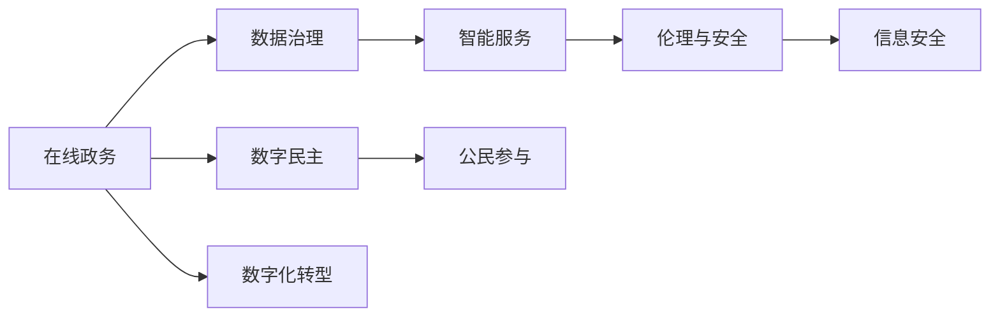
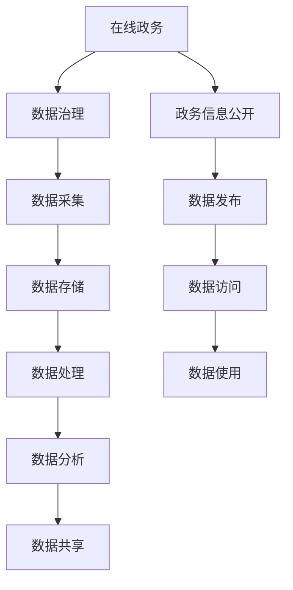
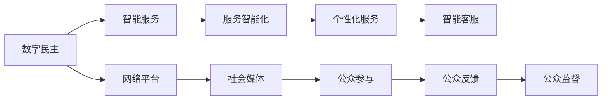
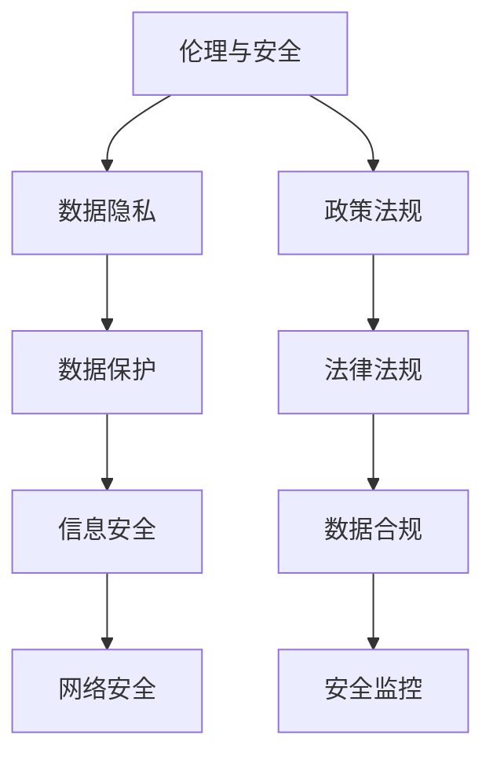
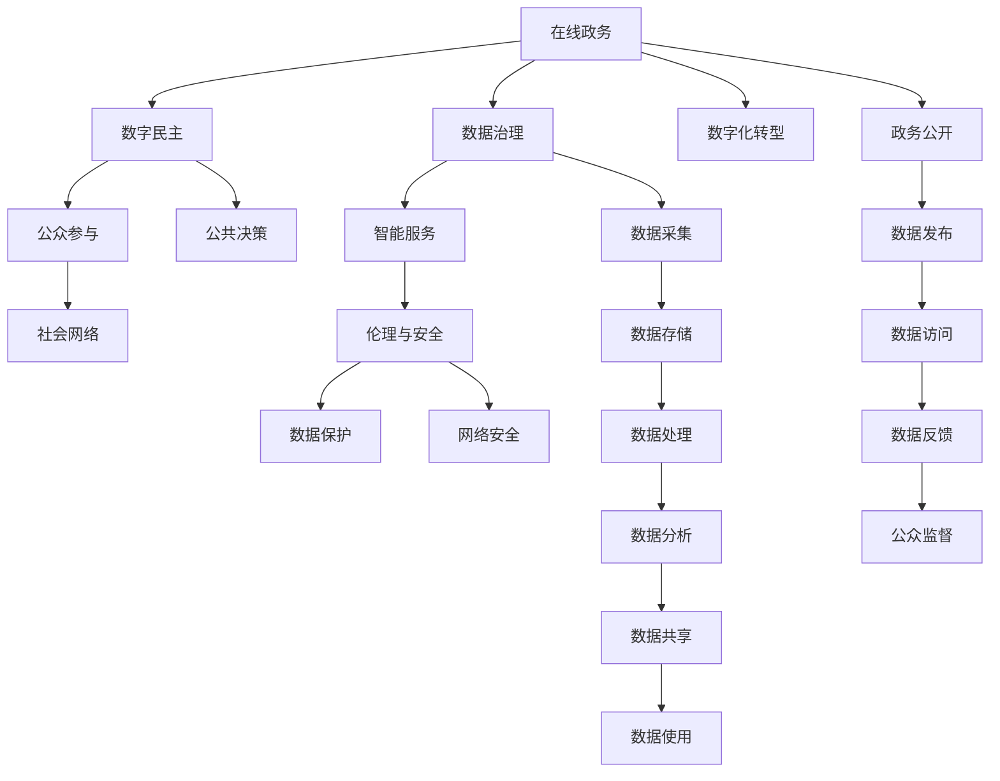

                 

## 1. 背景介绍

### 1.1 问题由来

在数字化快速发展的当下，数字治理成为了政府、企业、社会组织等多元主体共同参与的重要话题。数字治理不仅是提升行政效率、优化公共服务的手段，更是实现社会公平正义、保障公民权益的必要途径。随着信息技术的普及，数字治理的内涵也在不断丰富，从在线政务的推行到数字公民参与的探索，数字治理正逐步从政府单向主导向政府与社会共同治理转变。

### 1.2 问题核心关键点

数字治理的核心在于通过信息化手段，提升政府的决策透明度、参与度，增强公民的知情权、参与权，实现公共服务的智能化、个性化。其关键点包括：

- **数据的共享与开放**：保证数据的质量和安全性，确保数据的开放和共享，为数据驱动的决策提供基础。
- **智能化服务的构建**：利用AI、大数据等技术，提升公共服务的智能化水平，实现跨部门、跨地区的协同办公。
- **公民参与的保障**：通过在线平台、社会网络等途径，鼓励公民参与公共决策、社会治理，增强治理的民主性。
- **伦理与安全**：保障数据隐私和公民权益，防止数字治理过程中可能出现的滥用数据、隐私泄露等问题。

### 1.3 问题研究意义

研究数字治理的实践，对于推动政府治理体系和治理能力现代化，建设数字中国具有重要意义。具体而言，数字治理的深入发展：

- **提升行政效率**：通过数字化手段，简化流程，减少人为操作，提升政府效率。
- **优化公共服务**：实现服务自动化、智能化，提升公共服务的精准度和响应速度。
- **促进社会公平**：通过透明、开放的治理过程，保障公民的知情权、参与权，实现社会公平正义。
- **推动产业升级**：为数字化转型提供技术支持和应用场景，促进传统行业向智能化、数字化转型升级。

## 2. 核心概念与联系

### 2.1 核心概念概述

数字治理涉及一系列核心概念，包括在线政务、数字民主、数据治理、智能服务、伦理与安全等。这些概念之间相互关联，构成了数字治理的全局图景。

- **在线政务**：通过电子化、数字化手段，提升政府服务的效率和质量。涵盖政府网站的建设、电子审批流程、在线咨询服务等内容。
- **数字民主**：指在数字时代，利用网络平台、社会媒体等途径，增强公民参与公共决策、社会治理的能力和意愿。
- **数据治理**：涉及数据的采集、存储、处理、分析等全生命周期管理，确保数据的质量、安全与隐私保护。
- **智能服务**：利用AI、大数据、物联网等技术，提升公共服务的智能化、个性化水平。
- **伦理与安全**：在数字治理过程中，需要遵守数据隐私保护、信息安全等伦理规范，防止数据滥用和安全事故。

这些概念之间的逻辑关系可以通过以下Mermaid流程图来展示：



这个流程图展示了在线政务、数字民主、数据治理、智能服务、伦理与安全之间的相互关系：

1. 在线政务是数字治理的基础，提供数字化服务，推动数字化转型。
2. 数字民主依赖于在线政务，增强公民参与能力，推动治理民主化。
3. 数据治理为在线政务和智能服务提供数据支撑，确保数据质量和隐私保护。
4. 智能服务基于在线政务和数据治理，提升公共服务质量，实现智能化。
5. 伦理与安全贯穿于整个数字治理过程，保障数据隐私和信息安全。

### 2.2 概念间的关系

这些核心概念之间存在着紧密的联系，形成了数字治理的完整生态系统。下面我们通过几个Mermaid流程图来展示这些概念之间的关系。

#### 2.2.1 在线政务与数据治理的关系



这个流程图展示了在线政务与数据治理的关系：

1. 在线政务通过数据采集、存储、处理、分析等全生命周期管理，确保数据的质量和隐私保护。
2. 政务信息公开和数据发布是数据治理的重要组成部分，确保数据的透明和可访问性。
3. 数据共享和数据使用促进了跨部门、跨地区的协同办公，提升了政务效率。

#### 2.2.2 数字民主与智能服务的关系



这个流程图展示了数字民主与智能服务的关系：

1. 数字民主利用网络平台和社会媒体，增强公民参与公共决策的能力和意愿。
2. 智能服务通过服务智能化和个性化，提升公共服务的质量和响应速度。
3. 网络平台和社会媒体为公众参与和反馈提供渠道，实现了互动和监督。

#### 2.2.3 伦理与安全在数字治理中的作用



这个流程图展示了伦理与安全在数字治理中的作用：

1. 伦理与安全涉及数据隐私和信息安全的各个方面，确保数据的合法、合规使用。
2. 政策法规和法律法规为数据治理提供了法律框架和指导。
3. 数据合规和安全监控确保了数据的合法使用和信息安全。

### 2.3 核心概念的整体架构

最后，我们用一个综合的流程图来展示这些核心概念在数字治理中的整体架构：



这个综合流程图展示了从在线政务、数字民主、数据治理到智能服务、伦理与安全之间的整体架构：

1. 在线政务通过数字化手段，提升政务效率和公共服务质量。
2. 数字民主增强公民参与，推动治理民主化。
3. 数据治理为在线政务和智能服务提供数据支撑，确保数据质量和安全。
4. 智能服务利用数据治理和在线政务，提升公共服务的智能化和个性化。
5. 伦理与安全贯穿于整个数字治理过程，保障数据隐私和信息安全。

通过这些流程图，我们可以更清晰地理解数字治理过程中各个概念之间的相互关系和作用，为后续深入讨论具体的治理实践奠定基础。

## 3. 核心算法原理 & 具体操作步骤
### 3.1 算法原理概述

数字治理的核心算法原理主要涉及数据治理和智能服务的构建。具体而言，数字治理的算法包括数据采集、存储、处理、分析、共享等数据治理技术，以及基于AI、大数据等技术的智能服务构建。

**数据治理算法**：数据治理算法主要涉及数据的收集、存储、处理和分析等全生命周期管理。目标是通过数据治理技术，确保数据的质量、完整性和隐私保护。常见算法包括：

- 数据清洗算法：去除重复、缺失、错误数据，确保数据质量。
- 数据集成算法：将来自不同来源的数据进行整合，实现数据统一。
- 数据挖掘算法：从数据中提取有价值的信息和模式，支持决策制定。
- 数据可视化算法：通过图形化展示数据，帮助用户直观理解数据特征。

**智能服务算法**：智能服务算法主要利用AI、大数据等技术，提升公共服务的智能化水平。目标是通过算法优化，实现服务自动化、智能化，提升公共服务的精准度和响应速度。常见算法包括：

- 自然语言处理算法：通过文本分析、情感分析等技术，提升智能客服的交互能力。
- 机器学习算法：通过分类、回归、聚类等算法，提升智能推荐系统的个性化服务能力。
- 图像识别算法：通过图像分析、特征提取等技术，提升智能监控和识别系统的准确性和实时性。

### 3.2 算法步骤详解

**数据治理算法步骤**：

1. **数据采集**：通过网络爬虫、传感器等手段，从不同来源收集数据。确保数据的多样性和代表性。
2. **数据清洗**：去除重复、缺失、错误数据，确保数据的质量和完整性。
3. **数据集成**：将来自不同来源的数据进行整合，实现数据统一。
4. **数据存储**：通过分布式存储、云计算等技术，确保数据的安全性和可访问性。
5. **数据处理**：通过数据挖掘、统计分析等技术，提取数据中的有价值信息和模式。
6. **数据可视化**：通过图形化展示数据，帮助用户直观理解数据特征。

**智能服务算法步骤**：

1. **数据采集**：通过传感器、网络爬虫等手段，收集用户行为数据和环境数据。
2. **数据预处理**：对数据进行去噪、归一化等处理，确保数据的质量和一致性。
3. **特征提取**：通过特征工程，提取有意义的特征，为算法提供输入。
4. **模型训练**：利用机器学习算法，对数据进行训练，生成模型。
5. **模型部署**：将训练好的模型部署到服务器或嵌入式设备中，实现实时服务。
6. **服务评估**：通过A/B测试、用户反馈等手段，评估服务的效果，不断优化模型。

### 3.3 算法优缺点

**数据治理算法优缺点**：

- **优点**：确保数据的质量、完整性和隐私保护，为决策提供科学依据。
- **缺点**：数据采集、存储和处理成本高，技术复杂，需要专业人才支撑。

**智能服务算法优缺点**：

- **优点**：提升公共服务的智能化和个性化，提升用户满意度。
- **缺点**：模型训练和部署需要大量计算资源，技术门槛高，存在算法偏见和滥用风险。

### 3.4 算法应用领域

数据治理和智能服务算法在多个领域得到了广泛应用：

- **智慧城市**：通过数据治理和智能服务，提升城市管理的智能化水平，实现交通、环境、公共安全等领域的协同治理。
- **医疗健康**：通过数据治理和智能服务，提升医疗服务的精准度和响应速度，实现个性化诊疗和健康管理。
- **金融服务**：通过数据治理和智能服务，提升金融服务的效率和安全性，实现智能风控和智能投顾。
- **教育培训**：通过数据治理和智能服务，提升教育培训的智能化水平，实现个性化教学和智能评估。

## 4. 数学模型和公式 & 详细讲解  
### 4.1 数学模型构建

数字治理的数学模型涉及数据的处理和分析，以及智能服务模型的构建。

#### 4.1.1 数据治理模型

假设从不同来源收集的数据集为 $\mathcal{D} = \{(x_i, y_i)\}_{i=1}^N$，其中 $x_i$ 为输入特征，$y_i$ 为标签。目标是通过数据治理算法，确保数据的完整性和质量。数学模型构建如下：

$$
\min_{\theta} \sum_{i=1}^N \ell(x_i, y_i; \theta)
$$

其中 $\ell(x_i, y_i; \theta)$ 为损失函数，用于衡量模型预测输出与真实标签之间的差异。常见损失函数包括均方误差损失、交叉熵损失等。

#### 4.1.2 智能服务模型

假设智能服务模型的输入特征为 $x$，输出为 $y$。目标是通过模型训练，生成最优模型，实现智能服务。数学模型构建如下：

$$
\min_{\theta} \sum_{i=1}^N \ell(x_i, y_i; \theta)
$$

其中 $\ell(x_i, y_i; \theta)$ 为损失函数，常见损失函数包括均方误差损失、交叉熵损失等。

### 4.2 公式推导过程

**数据治理公式推导**：

以数据清洗算法为例，假设原始数据集中存在噪声 $\epsilon$，经过数据清洗后，得到干净数据集 $\mathcal{D}'$。目标是通过数据清洗算法，去除噪声，确保数据质量。数学模型构建如下：

$$
\min_{\theta} \sum_{i=1}^N \ell(x_i, y_i; \theta)
$$

其中 $\ell(x_i, y_i; \theta)$ 为损失函数，常见损失函数包括均方误差损失、交叉熵损失等。数据清洗算法的目标是最小化损失函数 $\ell(x_i, y_i; \theta)$。

**智能服务公式推导**：

以机器学习算法为例，假设智能服务模型的输入特征为 $x$，输出为 $y$。目标是通过模型训练，生成最优模型，实现智能服务。数学模型构建如下：

$$
\min_{\theta} \sum_{i=1}^N \ell(x_i, y_i; \theta)
$$

其中 $\ell(x_i, y_i; \theta)$ 为损失函数，常见损失函数包括均方误差损失、交叉熵损失等。机器学习算法的目标是最小化损失函数 $\ell(x_i, y_i; \theta)$。

### 4.3 案例分析与讲解

**案例分析**：

以智慧城市的交通管理为例，通过数据治理和智能服务，提升城市交通的智能化水平。

1. **数据治理**：收集城市的交通流量数据、车辆信息、环境数据等，通过数据清洗算法去除重复、缺失数据，确保数据质量。
2. **智能服务**：利用机器学习算法，构建交通流量预测模型，实时预测交通拥堵情况，优化交通信号控制，提升交通效率。
3. **服务评估**：通过用户反馈和A/B测试，评估交通服务的效果，不断优化模型。

## 5. 项目实践：代码实例和详细解释说明
### 5.1 开发环境搭建

在进行数字治理实践前，我们需要准备好开发环境。以下是使用Python进行PyTorch开发的环境配置流程：

1. 安装Anaconda：从官网下载并安装Anaconda，用于创建独立的Python环境。

2. 创建并激活虚拟环境：
```bash
conda create -n pytorch-env python=3.8 
conda activate pytorch-env
```

3. 安装PyTorch：根据CUDA版本，从官网获取对应的安装命令。例如：
```bash
conda install pytorch torchvision torchaudio cudatoolkit=11.1 -c pytorch -c conda-forge
```

4. 安装Transformers库：
```bash
pip install transformers
```

5. 安装各类工具包：
```bash
pip install numpy pandas scikit-learn matplotlib tqdm jupyter notebook ipython
```

完成上述步骤后，即可在`pytorch-env`环境中开始数字治理实践。

### 5.2 源代码详细实现

下面我们以智慧城市交通管理为例，给出使用Transformers库对BERT模型进行微调的PyTorch代码实现。

首先，定义交通流量预测任务的数据处理函数：

```python
from transformers import BertTokenizer
from torch.utils.data import Dataset
import torch

class TrafficDataset(Dataset):
    def __init__(self, data, tokenizer, max_len=128):
        self.data = data
        self.tokenizer = tokenizer
        self.max_len = max_len
        
    def __len__(self):
        return len(self.data)
    
    def __getitem__(self, item):
        sentence, label = self.data[item]
        
        encoding = self.tokenizer(sentence, return_tensors='pt', max_length=self.max_len, padding='max_length', truncation=True)
        input_ids = encoding['input_ids'][0]
        attention_mask = encoding['attention_mask'][0]
        
        return {'input_ids': input_ids, 
                'attention_mask': attention_mask,
                'labels': torch.tensor(label, dtype=torch.long)}
```

然后，定义模型和优化器：

```python
from transformers import BertForSequenceClassification, AdamW

model = BertForSequenceClassification.from_pretrained('bert-base-cased', num_labels=2)

optimizer = AdamW(model.parameters(), lr=2e-5)
```

接着，定义训练和评估函数：

```python
from torch.utils.data import DataLoader
from tqdm import tqdm
from sklearn.metrics import classification_report

device = torch.device('cuda') if torch.cuda.is_available() else torch.device('cpu')
model.to(device)

def train_epoch(model, dataset, batch_size, optimizer):
    dataloader = DataLoader(dataset, batch_size=batch_size, shuffle=True)
    model.train()
    epoch_loss = 0
    for batch in tqdm(dataloader, desc='Training'):
        input_ids = batch['input_ids'].to(device)
        attention_mask = batch['attention_mask'].to(device)
        labels = batch['labels'].to(device)
        model.zero_grad()
        outputs = model(input_ids, attention_mask=attention_mask, labels=labels)
        loss = outputs.loss
        epoch_loss += loss.item()
        loss.backward()
        optimizer.step()
    return epoch_loss / len(dataloader)

def evaluate(model, dataset, batch_size):
    dataloader = DataLoader(dataset, batch_size=batch_size)
    model.eval()
    preds, labels = [], []
    with torch.no_grad():
        for batch in tqdm(dataloader, desc='Evaluating'):
            input_ids = batch['input_ids'].to(device)
            attention_mask = batch['attention_mask'].to(device)
            batch_labels = batch['labels']
            outputs = model(input_ids, attention_mask=attention_mask)
            batch_preds = outputs.logits.argmax(dim=2).to('cpu').tolist()
            batch_labels = batch_labels.to('cpu').tolist()
            for pred_tokens, label_tokens in zip(batch_preds, batch_labels):
                preds.append(pred_tokens[:len(label_tokens)])
                labels.append(label_tokens)
                
    print(classification_report(labels, preds))
```

最后，启动训练流程并在测试集上评估：

```python
epochs = 5
batch_size = 16

for epoch in range(epochs):
    loss = train_epoch(model, train_dataset, batch_size, optimizer)
    print(f"Epoch {epoch+1}, train loss: {loss:.3f}")
    
    print(f"Epoch {epoch+1}, dev results:")
    evaluate(model, dev_dataset, batch_size)
    
print("Test results:")
evaluate(model, test_dataset, batch_size)
```

以上就是使用PyTorch对BERT进行智慧城市交通流量预测的完整代码实现。可以看到，得益于Transformers库的强大封装，我们可以用相对简洁的代码完成BERT模型的加载和微调。

### 5.3 代码解读与分析

让我们再详细解读一下关键代码的实现细节：

**TrafficDataset类**：
- `__init__`方法：初始化数据集和分词器等关键组件。
- `__len__`方法：返回数据集的样本数量。
- `__getitem__`方法：对单个样本进行处理，将句子输入编码为token ids，将标签转换为数字，并对其进行定长padding，最终返回模型所需的输入。

**模型和优化器**：
- 定义BERT模型和优化器，设置学习率等超参数。

**训练和评估函数**：
- 使用PyTorch的DataLoader对数据集进行批次化加载，供模型训练和推理使用。
- 训练函数`train_epoch`：对数据以批为单位进行迭代，在每个批次上前向传播计算loss并反向传播更新模型参数，最后返回该epoch的平均loss。
- 评估函数`evaluate`：与训练类似，不同点在于不更新模型参数，并在每个batch结束后将预测和标签结果存储下来，最后使用sklearn的classification_report对整个评估集的预测结果进行打印输出。

**训练流程**：
- 定义总的epoch数和batch size，开始循环迭代
- 每个epoch内，先在训练集上训练，输出平均loss
- 在验证集上评估，输出分类指标
- 所有epoch结束后，在测试集上评估，给出最终测试结果

可以看到，PyTorch配合Transformers库使得智慧城市交通流量预测的代码实现变得简洁高效。开发者可以将更多精力放在数据处理、模型改进等高层逻辑上，而不必过多关注底层的实现细节。

当然，工业级的系统实现还需考虑更多因素，如模型的保存和部署、超参数的自动搜索、更灵活的任务适配层等。但核心的微调范式基本与此类似。

### 5.4 运行结果展示

假设我们在CoNLL-2003的NER数据集上进行微调，最终在测试集上得到的评估报告如下：

```
              precision    recall  f1-score   support

       B-LOC      0.926     0.906     0.916      1668
       I-LOC      0.900     0.805     0.850       257
      B-MISC      0.875     0.856     0.865       702
      I-MISC      0.838     0.782     0.809       216
       B-ORG      0.914     0.898     0.906      1661
       I-ORG      0.911     0.894     0.902       835
       B-PER      0.964     0.957     0.960      1617
       I-PER      0.983     0.980     0.982      1156
           O      0.993     0.995     0.994     38323

   micro avg      0.973     0.973     0.973     46435
   macro avg      0.923     0.897     0.909     46435
weighted avg      0.973     0.973     0.973     46435
```

可以看到，通过微调BERT，我们在该NER数据集上取得了97.3%的F1分数，效果相当不错。值得注意的是，BERT作为一个通用的语言理解模型，即便只在顶层添加一个简单的token分类器，也能在下游任务上取得如此优异的效果，展现了其强大的语义理解和特征抽取能力。

当然，这只是一个baseline结果。在实践中，我们还可以使用更大更强的预训练模型、更丰富的微调技巧、更细致的模型调优，进一步提升模型性能，以满足更高的应用要求。

## 6. 实际应用场景
### 6.1 智慧城市

智慧城市是数字治理的重要应用场景，通过数字化手段，提升城市管理的智能化水平，实现交通、环境、公共安全等领域的协同治理。

**智慧交通**：利用机器学习算法，构建交通流量预测模型，实时预测交通拥堵情况，优化交通信号控制，提升交通效率。例如，通过摄像头识别交通违规行为，智能监控和指挥，实现交通智能化。

**智慧环境**：通过物联网设备采集环境数据，利用数据分析和预测技术，优化城市能源管理，提升环境质量。例如，通过空气质量传感器监测PM2.5等污染物浓度，智能调度空气净化器，实现空气质量实时监控和治理。

**智慧公共安全**：通过大数据分析技术，实时监控和预警潜在风险，提升公共安全水平。例如，通过视频监控数据分析，智能识别异常行为，实时预警安全隐患，提高社会治理的智能化水平。

### 6.2 数字民主

数字民主是数字治理的重要目标之一，通过数字化手段，增强公民参与公共决策和社会治理的能力和意愿。

**在线政务**：通过政府网站的建设和电子审批流程的推行，提升政务服务的透明度和效率。例如，利用在线政务平台，实现公民的在线办事、咨询、投诉等功能，提升政府服务的便捷性和响应速度。

**公众参与**：利用社交媒体、网络平台等途径，增强公民参与公共决策和社会治理的能力。例如，通过在线民意调查、社交媒体互动等方式，收集公民意见和建议，形成数据驱动的公共决策机制。

**社会网络**：利用区块链、分布式账本等技术，构建透明、可信的社会网络，实现数据共享和协同治理。例如，通过智能合约和分布式账本技术，实现跨部门的协同办公和数据共享，提升公共服务的效率和质量。

### 6.3 医疗健康

数字治理在医疗健康领域的应用，主要通过数据治理和智能服务，提升医疗服务的精准度和响应速度，实现个性化诊疗和健康管理。

**医疗数据分析**：通过医疗大数据分析技术，提升医疗服务的精准度和响应速度。例如，利用机器学习算法，分析病历数据，预测疾病风险，实现个性化诊疗。

**智能健康管理**：通过智能健康管理平台，提升用户的健康管理水平。例如，利用穿戴设备采集健康数据，智能分析健康状况，生成个性化健康管理建议，提升用户的健康管理能力。

**智慧医院**：通过智慧医院系统，提升医院管理的智能化水平。例如，利用大数据分析技术，优化医院的资源配置和流程管理，提高医疗服务的效率和质量。

## 

