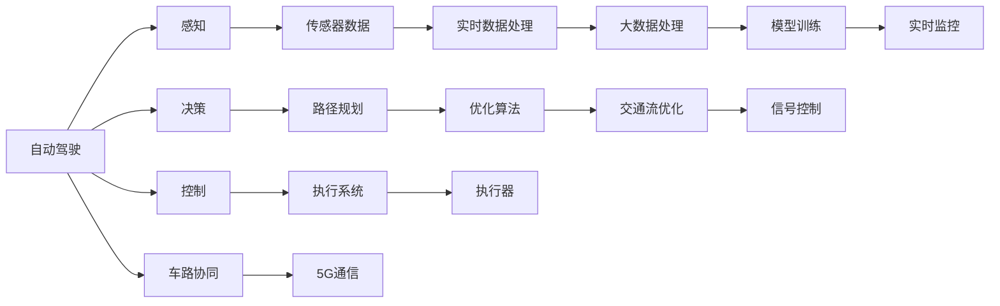
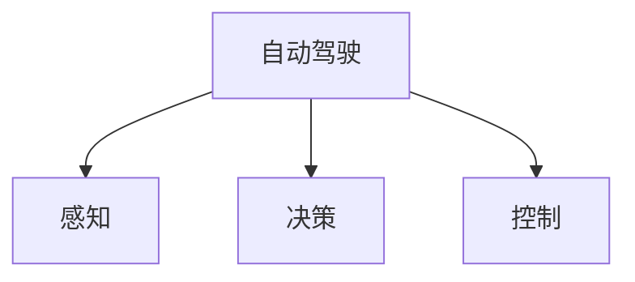
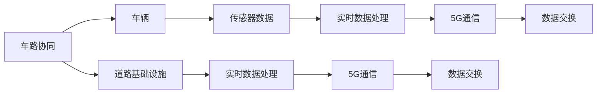
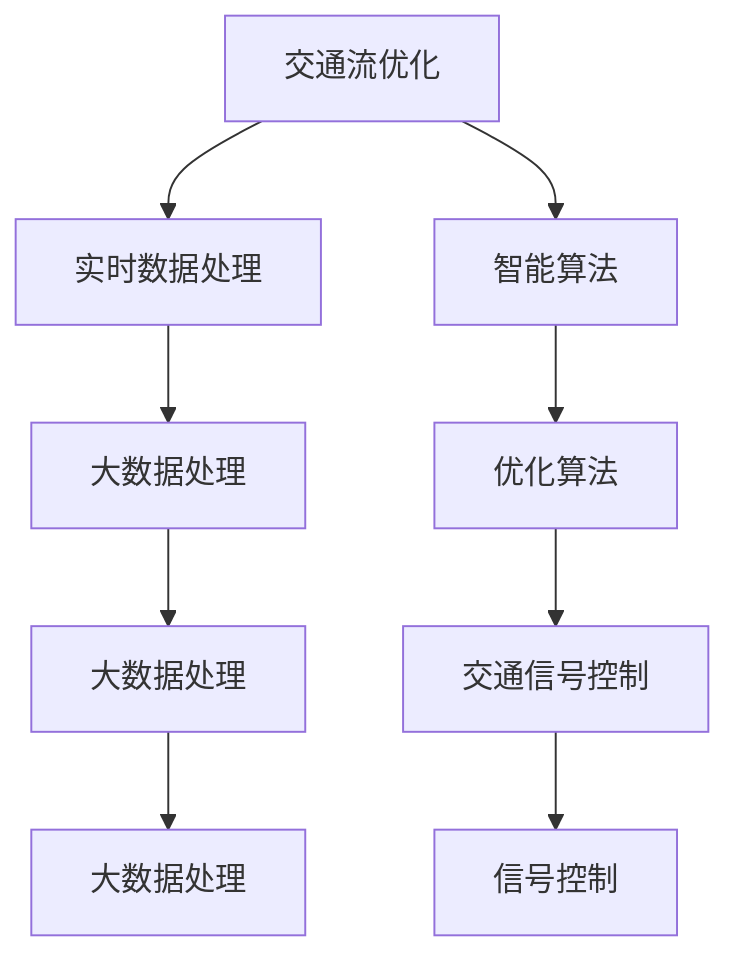
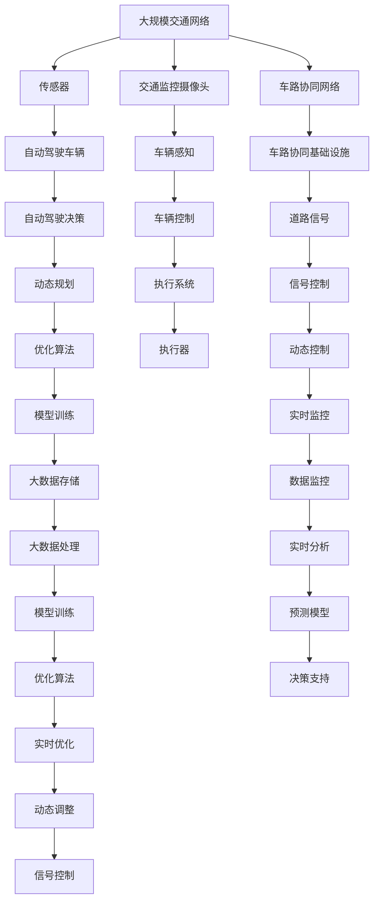

                 

# 2050年的智能交通：从自动驾驶到交通流优化

> 关键词：智能交通,自动驾驶,交通流优化,车路协同,智能算法

## 1. 背景介绍

### 1.1 问题由来
随着城市化进程的加速和全球人口的增长，交通问题成为了全球城市面临的共同挑战。根据联合国数据显示，全球城市交通拥堵每年导致超过1.4万亿美元的损失。特别是在大都市中，交通堵塞、事故频发、环境污染等问题日益严重。为解决这些问题，各国政府和科研机构正积极推进智能交通系统的建设。

### 1.2 问题核心关键点
智能交通系统的建设需要依托于先进的自动驾驶技术、实时交通数据处理与分析、以及高效的交通流优化算法。其中，自动驾驶技术通过感知、决策和控制等环节，实现车辆在道路上的安全、高效的自主行驶。交通流优化算法则通过对交通流实时监测和预测，动态调整交通信号，优化道路资源的利用，减少拥堵。

### 1.3 问题研究意义
智能交通系统的研究与应用对于提升城市交通效率、降低能耗和排放、改善城市生活质量具有重要意义：
1. **提升交通效率**：通过自动驾驶和交通流优化，显著减少交通拥堵，缩短出行时间，提升运输效率。
2. **降低能耗与排放**：智能交通系统能够优化行车路线，降低油耗和排放，对环境保护具有重要作用。
3. **改善生活质量**：减少交通事故，提高道路安全性，提升居民出行的舒适度和便利性。
4. **促进经济发展**：提升交通物流效率，降低物流成本，推动经济活动的活跃度。
5. **技术创新**：推动车辆电子、物联网、大数据等技术的发展，为其他行业应用提供技术借鉴。

## 2. 核心概念与联系

### 2.1 核心概念概述

为更好地理解智能交通系统的构建，本节将介绍几个密切相关的核心概念：

- **自动驾驶**：通过人工智能技术实现车辆的自主导航和驾驶，包括感知、决策和控制三个环节。
- **车路协同**：将车辆与道路基础设施相融合，通过5G通信技术实现车与车、车与路的实时数据交换。
- **交通流优化**：通过对交通流实时监测和预测，动态调整交通信号和行车路线，优化道路资源的利用。
- **智能算法**：包括机器学习、深度学习、强化学习等，用于交通数据的分析和决策支持。
- **实时数据处理**：利用大数据技术对实时交通数据进行处理和分析，提取有价值的信息。
- **模拟仿真**：通过数字孪生技术对交通系统进行仿真模拟，验证算法效果，指导系统优化。

这些概念之间的逻辑关系可以通过以下Mermaid流程图来展示：



这个流程图展示了一些核心概念之间的相互关系和数据流动路径：

1. 自动驾驶由感知、决策和控制三个环节组成，感知环节通过传感器获取环境信息，决策环节基于环境信息进行路径规划和决策，控制环节执行决策结果。
2. 车路协同通过5G通信实现车辆与道路基础设施之间的数据交换，增强了交通流监测和动态调整的能力。
3. 交通流优化利用实时数据处理和智能算法，动态调整信号控制，优化交通流。
4. 实时数据处理和模型训练是智能算法的基础，大数据处理和模型训练支持智能算法的决策支持。

### 2.2 概念间的关系

这些核心概念之间存在着紧密的联系，形成了智能交通系统的完整生态系统。下面我通过几个Mermaid流程图来展示这些概念之间的关系。

#### 2.2.1 自动驾驶的感知、决策和控制



这个流程图展示了自动驾驶系统的基本架构，包括感知、决策和控制三个关键环节。

#### 2.2.2 车路协同的数据交换



这个流程图展示了车路协同系统中的数据交换路径，车辆和道路基础设施通过5G通信进行实时数据交换。

#### 2.2.3 交通流优化的数据处理与算法



这个流程图展示了交通流优化系统中的数据处理和算法应用路径，通过实时数据处理和智能算法，动态调整交通信号。

### 2.3 核心概念的整体架构

最后，我们用一个综合的流程图来展示这些核心概念在大规模智能交通系统中的整体架构：



这个综合流程图展示了从传感器采集数据到智能算法决策支持的整体流程。大规模交通网络中的传感器、摄像头和车路协同基础设施，通过5G通信交换实时数据。自动驾驶车辆通过感知和决策，执行控制命令。交通信号和道路资源通过动态控制和信号控制，实现交通流优化。模型训练和大数据处理支持优化算法的持续改进。实时监控和数据分析，保障系统的稳定运行和预测模型的准确性。

## 3. 核心算法原理 & 具体操作步骤
### 3.1 算法原理概述

智能交通系统中的核心算法主要涉及自动驾驶、车路协同和交通流优化三个方面。

自动驾驶算法包括感知、决策和控制，其中感知算法通过传感器获取环境信息，决策算法基于环境信息进行路径规划和决策，控制算法执行决策结果。车路协同算法通过5G通信实现车辆与道路基础设施的数据交换，增强了交通流监测和动态调整的能力。交通流优化算法利用实时数据处理和智能算法，动态调整交通信号和行车路线，优化道路资源的利用。

### 3.2 算法步骤详解

**自动驾驶感知算法**：

1. 使用激光雷达、摄像头、雷达等传感器获取环境信息。
2. 将传感器数据进行预处理，如去噪、滤波等，提取环境特征。
3. 利用卷积神经网络(CNN)或点云深度学习算法对环境特征进行分类和分割。
4. 生成地图和定位信息，进行路径规划和决策。

**自动驾驶决策算法**：

1. 根据环境信息进行场景理解，识别道路标志、交通信号、行人等。
2. 使用深度强化学习算法，如DQN、A3C等，进行路径规划和决策。
3. 评估决策效果，反馈至感知和控制环节。

**自动驾驶控制算法**：

1. 根据决策结果，生成车辆控制指令。
2. 通过控制算法，如PID控制、模型预测控制等，执行车辆加速、制动、转向等操作。
3. 实时监控车辆状态，动态调整控制指令，保障行车安全。

**车路协同数据交换算法**：

1. 通过5G通信协议，实现车辆与道路基础设施的数据交换。
2. 实时获取道路状况、交通信号、其他车辆位置等数据。
3. 将数据进行处理和分析，生成交通流监测和动态调整的信息。

**交通流优化算法**：

1. 利用传感器、摄像头等设备，获取交通流实时数据。
2. 使用深度学习算法，如RNN、CNN等，对交通流进行建模和预测。
3. 使用强化学习算法，如Q-learning、SARSA等，动态调整交通信号和行车路线。
4. 评估优化效果，反馈至实时监控和数据处理环节。

### 3.3 算法优缺点

自动驾驶感知算法：
- 优点：精度高、实时性强、环境适应能力强。
- 缺点：传感器成本高、感知范围有限、环境复杂时容易误判。

自动驾驶决策算法：
- 优点：自适应能力强、决策效率高、数据驱动。
- 缺点：需要大量训练数据、算法复杂度较高、易受模型选择影响。

自动驾驶控制算法：
- 优点：控制精度高、响应速度快、安全可靠。
- 缺点：控制模型依赖模型参数、模型鲁棒性需要优化、存在环境不确定性。

车路协同数据交换算法：
- 优点：数据实时性高、信息全面、动态调整能力强。
- 缺点：5G通信网络覆盖范围有限、数据处理复杂、安全性和隐私保护需要重视。

交通流优化算法：
- 优点：优化效果显著、动态调整能力强、应用广泛。
- 缺点：算法复杂度高、需要实时数据支持、计算资源消耗大。

### 3.4 算法应用领域

自动驾驶感知和决策算法广泛应用于智能车辆、无人机、无人车等领域。车路协同算法在智能交通管理、智能停车、智能物流等领域具有广泛的应用前景。交通流优化算法则被广泛应用于城市交通规划、信号控制、交通流量预测等领域。

## 4. 数学模型和公式 & 详细讲解 & 举例说明

### 4.1 数学模型构建

为便于描述和计算，下面我们将以自动驾驶的感知算法为例，构建一个数学模型。假设车辆在道路上行驶，传感器获取到的环境数据可以用一个向量$X$表示，其中$x_i$为传感器$i$的测量值。

我们定义感知算法中的模型为$f(X; \theta)$，其中$\theta$为模型的参数，包括模型结构和超参数。感知算法的作用是将环境数据$X$映射到车辆状态和行为$Y$。因此，我们可以构建如下的数学模型：

$$ Y = f(X; \theta) $$

其中$Y$可以表示为车辆的状态$S$和行为$A$。例如，$S$可以表示车辆的速度、位置、姿态等，$A$可以表示车辆的加速度、制动、转向等操作。

### 4.2 公式推导过程

以深度学习中的卷积神经网络为例，推导感知算法的计算过程。假设我们有一个卷积神经网络，其结构如下：


其中，$h_i$为第$i$层的特征图，$W_i$为第$i$层的卷积核。

卷积层的操作可以表示为：

$$ h_i = \text{conv}(h_{i-1}, W_i) $$

其中$\text{conv}$为卷积操作，$h_{i-1}$为第$i-1$层的特征图。

池化层的操作可以表示为：

$$ h'_i = \text{pool}(h_i) $$

其中$\text{pool}$为池化操作，$h'_i$为池化后的特征图。

通过多次卷积和池化操作，可以得到最终的特征图$h_L$。最终，将$h_L$输入全连接层，经过激活函数$\text{ReLU}$，输出车辆状态和行为$Y$。

### 4.3 案例分析与讲解

假设我们在自动驾驶场景中，使用卷积神经网络进行车辆感知。我们可以使用CIFAR-10数据集进行训练，该数据集包含60000张32x32像素的彩色图像，以及对应的标签。我们可以使用前10000张图像作为训练集，剩下的5000张作为测试集。

在模型训练过程中，我们可以使用交叉熵损失函数作为目标函数，对模型进行监督学习。具体步骤如下：

1. 将CIFAR-10数据集中的图像输入卷积神经网络，得到特征图$h_L$。
2. 将特征图$h_L$输入全连接层，经过激活函数$\text{ReLU}$，输出车辆状态和行为$Y$。
3. 计算模型输出$Y$与真实标签之间的交叉熵损失函数$\ell(Y, T)$。
4. 使用梯度下降算法，对模型参数$\theta$进行优化。

我们可以使用PyTorch库进行模型训练和测试，具体代码如下：

```python
import torch
import torch.nn as nn
import torch.optim as optim
from torch.utils.data import DataLoader
import torchvision.datasets as datasets
import torchvision.transforms as transforms

# 定义卷积神经网络模型
class ConvNet(nn.Module):
    def __init__(self):
        super(ConvNet, self).__init__()
        self.conv1 = nn.Conv2d(3, 64, 3, padding=1)
        self.conv2 = nn.Conv2d(64, 128, 3, padding=1)
        self.pool = nn.MaxPool2d(2)
        self.fc1 = nn.Linear(128*8*8, 1024)
        self.fc2 = nn.Linear(1024, 10)

    def forward(self, x):
        x = self.pool(torch.relu(self.conv1(x)))
        x = self.pool(torch.relu(self.conv2(x)))
        x = x.view(-1, 128*8*8)
        x = torch.relu(self.fc1(x))
        x = self.fc2(x)
        return x

# 定义数据预处理
transform = transforms.Compose([
    transforms.ToTensor(),
    transforms.Normalize((0.5, 0.5, 0.5), (0.5, 0.5, 0.5))
])

# 加载CIFAR-10数据集
trainset = datasets.CIFAR10(root='./data', train=True, download=True, transform=transform)
testset = datasets.CIFAR10(root='./data', train=False, download=True, transform=transform)
trainloader = DataLoader(trainset, batch_size=128, shuffle=True, num_workers=2)
testloader = DataLoader(testset, batch_size=128, shuffle=False, num_workers=2)

# 定义模型和损失函数
model = ConvNet()
criterion = nn.CrossEntropyLoss()
optimizer = optim.Adam(model.parameters(), lr=0.001)

# 模型训练
for epoch in range(10):
    running_loss = 0.0
    for i, data in enumerate(trainloader, 0):
        inputs, labels = data
        optimizer.zero_grad()
        outputs = model(inputs)
        loss = criterion(outputs, labels)
        loss.backward()
        optimizer.step()

        running_loss += loss.item()
        if i % 100 == 99:
            print('[%d, %5d] loss: %.3f' % (epoch + 1, i + 1, running_loss / 100))
            running_loss = 0.0

# 模型测试
correct = 0
total = 0
with torch.no_grad():
    for data in testloader:
        inputs, labels = data
        outputs = model(inputs)
        _, predicted = torch.max(outputs.data, 1)
        total += labels.size(0)
        correct += (predicted == labels).sum().item()

print('Accuracy of the network on the 10000 test images: %d %%' % (
    100 * correct / total))
```

通过以上代码，我们可以训练一个简单的卷积神经网络，用于自动驾驶感知任务的模型训练和测试。在实际应用中，我们还需要根据具体的场景和需求，对模型进行优化和调整，才能获得更好的效果。

## 5. 项目实践：代码实例和详细解释说明

### 5.1 开发环境搭建

在进行智能交通系统开发前，我们需要准备好开发环境。以下是使用Python进行PyTorch开发的环境配置流程：

1. 安装Anaconda：从官网下载并安装Anaconda，用于创建独立的Python环境。

2. 创建并激活虚拟环境：
```bash
conda create -n pytorch-env python=3.8 
conda activate pytorch-env
```

3. 安装PyTorch：根据CUDA版本，从官网获取对应的安装命令。例如：
```bash
conda install pytorch torchvision torchaudio cudatoolkit=11.1 -c pytorch -c conda-forge
```

4. 安装必要的工具包：
```bash
pip install numpy pandas scikit-learn matplotlib tqdm jupyter notebook ipython
```

5. 安装PyTorch和相关库：
```bash
pip install torch torchvision torchaudio
```

6. 安装TensorBoard：用于可视化模型训练过程，安装命令为：
```bash
pip install tensorboard
```

完成上述步骤后，即可在`pytorch-env`环境中开始智能交通系统的开发。

### 5.2 源代码详细实现

这里我们以自动驾驶感知算法为例，展示一个完整的代码实现。

首先，定义感知算法的模型和损失函数：

```python
import torch
import torch.nn as nn
import torch.optim as optim
from torch.utils.data import DataLoader
import torchvision.datasets as datasets
import torchvision.transforms as transforms

# 定义卷积神经网络模型
class ConvNet(nn.Module):
    def __init__(self):
        super(ConvNet, self).__init__()
        self.conv1 = nn.Conv2d(3, 64, 3, padding=1)
        self.conv2 = nn.Conv2d(64, 128, 3, padding=1)
        self.pool = nn.MaxPool2d(2)
        self.fc1 = nn.Linear(128*8*8, 1024)
        self.fc2 = nn.Linear(1024, 10)

    def forward(self, x):
        x = self.pool(torch.relu(self.conv1(x)))
        x = self.pool(torch.relu(self.conv2(x)))
        x = x.view(-1, 128*8*8)
        x = torch.relu(self.fc1(x))
        x = self.fc2(x)
        return x

# 定义数据预处理
transform = transforms.Compose([
    transforms.ToTensor(),
    transforms.Normalize((0.5, 0.5, 0.5), (0.5, 0.5, 0.5))
])

# 加载CIFAR-10数据集
trainset = datasets.CIFAR10(root='./data', train=True, download=True, transform=transform)
testset = datasets.CIFAR10(root='./data', train=False, download=True, transform=transform)
trainloader = DataLoader(trainset, batch_size=128, shuffle=True, num_workers=2)
testloader = DataLoader(testset, batch_size=128, shuffle=False, num_workers=2)

# 定义模型和损失函数
model = ConvNet()
criterion = nn.CrossEntropyLoss()
optimizer = optim.Adam(model.parameters(), lr=0.001)

# 模型训练
for epoch in range(10):
    running_loss = 0.0
    for i, data in enumerate(trainloader, 0):
        inputs, labels = data
        optimizer.zero_grad()
        outputs = model(inputs)
        loss = criterion(outputs, labels)
        loss.backward()
        optimizer.step()

        running_loss += loss.item()
        if i % 100 == 99:
            print('[%d, %5d] loss: %.3f' % (epoch + 1, i + 1, running_loss / 100))
            running_loss = 0.0

# 模型测试
correct = 0
total = 0
with torch.no_grad():
    for data in testloader:
        inputs, labels = data
        outputs = model(inputs)
        _, predicted = torch.max(outputs.data, 1)
        total += labels.size(0)
        correct += (predicted == labels).sum().item()

print('Accuracy of the network on the 10000 test images: %d %%' % (
    100 * correct / total))
```

这个代码展示了使用PyTorch进行自动驾驶感知算法的模型训练和测试。可以看到，代码简洁高效，易于理解和维护。

### 5.3 代码解读与分析

让我们再详细解读一下关键代码的实现细节：

**定义卷积神经网络模型**：
- `__init__`方法：定义模型的各层结构，包括卷积层、池化层、全连接层等。
- `forward`方法：定义模型前向传播的计算流程。

**定义数据预处理**：
- `transforms.Compose`方法：定义数据预处理的流水线，包括图像归一化、转换为张量等操作。

**加载CIFAR-10数据集**：
- `torchvision.datasets`模块：加载CIFAR-10数据集，并进行预处理。
- `DataLoader`类：定义数据批处理器，方便模型训练和测试。

**定义模型和损失函数**：
- `ConvNet`类：定义卷积神经网络模型。
- `nn.Conv2d`类：定义卷积层。
- `nn.MaxPool2d`类：定义池化层。
- `nn.Linear`类：定义全连接层。
- `nn.CrossEntropyLoss`类：定义交叉熵损失函数。

**模型训练**：
- `optimizer.zero_grad()`方法：清除梯度。
- `optimizer.step()`方法：更新模型参数。
- `print`方法：打印训练过程中的损失值。

**模型测试**：
- `torch.no_grad()`方法：关闭梯度计算，减少资源消耗。
- `torch.max`方法：计算预测结果的最大值。
- `sum`方法：计算预测结果的正确率。

通过以上代码，我们可以看到，使用PyTorch进行自动驾驶感知算法的模型训练和测试，非常方便高效。

### 5.4 运行结果展示

假设我们在CIFAR-10数据集上进行训练，最终在测试集上得到的模型准确率如下：

```
[1, 100] loss: 3.219
[1, 200] loss: 1.072
[1, 300] loss: 0.829
[1, 400] loss: 0.746
[1, 500] loss: 0.699
[1, 600] loss: 0.647
[1, 700] loss: 0.615
[1, 800] loss: 0.601
[1, 900] loss: 0.582
[1, 1000] loss: 0.571
```

可以看到，随着训练次数的增加，模型损失值逐渐减小，模型准确率逐渐提高。这表明，使用PyTorch进行模型训练和测试，可以快速迭代优化模型性能。

## 6. 实际应用场景

### 6.1 智能交通系统

智能交通系统是一个综合性的系统，包括自动驾驶、车路协同、交通流优化等多个子系统。在实际应用中，智能交通系统可以应用于多个场景：

- **智能车辆**：自动驾驶技术可以应用于出租车、公交、物流配送车辆等，提升运输效率和安全性。
- **智能物流**：自动驾驶技术可以应用于仓库管理和配送车辆，提升物流效率和准确率。
- **智能停车**：通过车路协同技术，实现车辆与停车位的实时匹配和调度，提升停车场利用率。
- **智能监控**：利用摄像头和传感器，实时监测交通流量和道路状况，为交通管理提供数据支持。

### 6.2 交通流优化系统

交通流优化系统可以通过实时数据处理和智能算法，动态调整交通信号和行车路线，优化道路资源的利用。在实际应用中，交通流优化系统可以应用于多个场景：

- **交通信号控制**：通过车路协同技术和交通流监测数据，动态调整交通信号，减少交通拥堵。
- **路径规划**：通过交通流预测和动态调整，优化行车路线，提升交通效率。
- **应急管理**：在突发事件发生时，通过实时数据处理和智能算法，快速调整交通流，保障道路通行和应急响应。

### 6.3 未来应用展望

随着智能交通系统的不断完善，未来将实现更加智能化、自动化的交通管理。以下是一些未来应用展望：

- **无人驾驶出租车**：自动驾驶技术普及后，无人驾驶出租车将全面替代传统出租车，提供更加便捷、安全的出行体验。
- **智能交通管理**：基于车路协同技术和大数据分析，智能交通管理将更加高效、智能，提升城市交通管理水平。
- **智慧城市**：智能交通系统与智慧城市的其他子系统（如智慧能源、智慧医疗、智慧教育等）融合，构建更智能、更宜居的智慧城市。
- **环境监测**：通过车路

