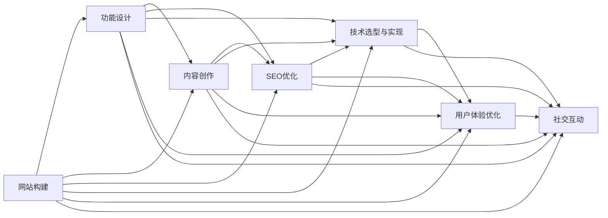

                 

# 建立个人网站：展示你的专业知识和成果

> 关键词：个人网站,专业展示,网站构建,内容创作,SEO优化

## 1. 背景介绍

### 1.1 问题由来
在信息化快速发展的今天，个人网站已不再是遥不可及的梦想，而成为展示个人专业知识和成果的重要平台。无论是计算机科学家、软件工程师、数据科学家，还是艺术设计师、作家、教育工作者，通过建立个人网站，不仅能记录自己的学习经历、技术积累、科研成果，还能分享心得、交流思想，构建专业社交网络，提升个人品牌价值。

### 1.2 问题核心关键点
建立个人网站的核心关键点包括：
- **网站功能设计**：根据个人职业、兴趣和目标，设计网站的功能模块，如博客、作品集、简历、在线课程等。
- **网站内容创作**：撰写高质量的文章、论文、案例分析等，展示个人专业知识和成果。
- **SEO优化**：通过SEO策略提升网站在搜索引擎中的排名，吸引更多访客。
- **技术选型与实现**：选择合适的技术和工具，实现网站的高效开发和维护。
- **用户体验优化**：注重网站的易用性、可访问性和交互性，提升用户体验。
- **社交互动**：通过评论区、社交媒体等渠道，与访客互动交流，构建社群。

### 1.3 问题研究意义
建立个人网站不仅是展示专业知识和成果的有效手段，还能帮助个人建立品牌、拓展人脉、获取更多职业机会。同时，在互联网时代，个人品牌成为个人竞争力的重要组成部分，良好的个人网站能显著提升个人在行业内的影响力。

## 2. 核心概念与联系

### 2.1 核心概念概述

- **网站构建（Website Development）**：指从需求分析、功能设计、页面布局到前端开发、后端开发、测试和部署的全过程，旨在构建一个功能完善、性能稳定、用户体验良好的网站。

- **内容创作（Content Creation）**：创作并管理网站上的文字、图片、视频等内容，确保内容的质量和原创性。

- **SEO优化（Search Engine Optimization）**：通过优化网站结构、内容、标签等，提高网站在搜索引擎中的排名，吸引更多流量。

- **技术选型与实现（Technology Selection and Implementation）**：选择适合的技术栈、框架、工具，进行网站的前端和后端开发。

- **用户体验优化（User Experience Optimization）**：通过页面布局、交互设计、加载速度等提升用户的访问体验。

- **社交互动（Social Interaction）**：通过评论、社交媒体等渠道，促进用户间的交流和互动，构建社群。

这些核心概念相互关联，共同构成了个人网站建设的完整框架。

### 2.2 概念间的关系

通过以下Mermaid流程图，我们展示这些核心概念之间的关系：



这个流程图展示了从网站构建到各个功能的详细关系，包括内容创作、SEO优化、技术选型与实现、用户体验优化和社交互动等环节，共同构成了一个完整的个人网站建设流程。

## 3. 核心算法原理 & 具体操作步骤

### 3.1 算法原理概述
个人网站建设的算法原理主要包括：

- **需求分析**：通过与用户沟通和调研，明确网站的目标、功能和用户体验要求。
- **功能设计**：根据需求设计网站的功能模块和页面布局。
- **前端开发**：使用HTML、CSS、JavaScript等技术实现网站的前端界面。
- **后端开发**：使用Python、Java、Node.js等语言开发网站的服务器端功能。
- **数据库设计**：设计数据库结构，存储和管理网站内容。
- **SEO优化**：优化网站内容、结构、标签等，提升搜索引擎排名。
- **用户体验优化**：通过A/B测试、用户反馈等方式，不断优化网站的用户体验。

### 3.2 算法步骤详解

#### 3.2.1 需求分析
1. **与用户沟通**：通过邮件、电话、面对面会议等方式，与目标用户进行详细沟通，明确网站的目标和功能需求。
2. **市场调研**：了解目标用户的行业背景、技术水平、职业需求等，确保网站设计符合用户期望。
3. **用户画像**：构建网站的目标用户画像，包括年龄、性别、职业、兴趣爱好等，指导网站设计。

#### 3.2.2 功能设计
1. **功能模块划分**：根据需求分析结果，将网站功能划分为首页、博客、作品集、简历、在线课程等模块。
2. **页面布局设计**：确定各页面的主要元素、布局和交互方式，确保网站直观易用。
3. **信息架构设计**：设计网站的信息架构，确保内容组织合理、结构清晰。

#### 3.2.3 前端开发
1. **界面设计**：使用设计工具如Sketch、Figma等进行界面设计，生成原型图。
2. **前端实现**：使用HTML、CSS、JavaScript等技术实现网站的前端界面，确保页面美观、响应迅速。
3. **UI组件开发**：开发自定义的UI组件，提升界面的一致性和易用性。

#### 3.2.4 后端开发
1. **服务器端开发**：使用Python、Java、Node.js等语言开发网站的服务器端功能，包括用户注册、登录、文章发布、评论管理等。
2. **API开发**：开发RESTful API，提供数据接口，方便前端调用。
3. **数据库开发**：设计数据库结构，存储和管理网站内容，包括用户信息、文章、评论等。

#### 3.2.5 SEO优化
1. **关键词分析**：通过关键词工具如Google Keyword Planner等，分析目标用户的搜索习惯，确定关键词。
2. **内容优化**：优化网站内容，包括标题、meta标签、关键词密度等，确保内容与关键词匹配。
3. **结构优化**：优化网站的HTML结构，确保URL合理、页面权重均衡。

#### 3.2.6 用户体验优化
1. **A/B测试**：通过A/B测试，比较不同页面设计的效果，选择最优方案。
2. **用户反馈**：收集用户反馈，持续改进网站的设计和功能。
3. **性能优化**：通过代码压缩、图片优化等方式，提升网站加载速度和稳定性。

### 3.3 算法优缺点

#### 3.3.1 优点
1. **展示效果好**：个人网站能集中展示个人专业知识和成果，提升专业形象。
2. **用户互动强**：通过评论区、社交媒体等渠道，与访客互动交流，构建社群。
3. **展示灵活性高**：可根据需求，灵活展示文字、图片、视频等多种形式的内容。
4. **SEO效果显著**：通过SEO优化，提高网站在搜索引擎中的排名，吸引更多流量。

#### 3.3.2 缺点
1. **技术门槛高**：网站开发涉及前端、后端、数据库等多个技术栈，对技术要求较高。
2. **维护成本高**：网站需要定期更新和维护，包括内容更新、性能优化等，工作量大。
3. **学习曲线陡**：网站开发和维护需要掌握多种工具和技术，初学者学习成本较高。

### 3.4 算法应用领域

个人网站建设的应用领域广泛，包括但不限于：

- **职业展示**：IT工程师、数据科学家、设计师等专业人士，展示技术成果、项目案例、个人简历等。
- **教育培训**：教师、讲师等专业人士，分享教学心得、课程讲义、实验项目等。
- **艺术创作**：作家、艺术家等，展示文学作品、艺术作品、创作过程等。
- **个人品牌**：自由职业者、创业者等，推广个人品牌、商业项目、客户案例等。

## 4. 数学模型和公式 & 详细讲解 & 举例说明

### 4.1 数学模型构建

个人网站建设的数学模型包括：

- **流量模型**：分析网站访问流量，优化用户体验。
- **推荐系统模型**：根据用户行为推荐相关内容，提升用户黏性。
- **SEO模型**：优化网站内容，提升搜索引擎排名。

### 4.2 公式推导过程

以SEO优化为例，其基本数学模型包括：

- **PageRank算法**：计算网页的PageRank值，提升网页在搜索引擎中的权重。
- **关键词密度优化**：计算关键词密度，确保内容与关键词匹配。
- **标题标签优化**：计算标题标签的权重，提升网页的搜索排名。

### 4.3 案例分析与讲解

以一个简单的博客网站为例，展示SEO优化的过程：

1. **关键词分析**：使用Google Keyword Planner等工具，确定博客的关键词，如“Python编程”、“数据科学”等。
2. **内容优化**：撰写高质量的文章，确保文章标题、meta标签、内容中包含关键词。
3. **结构优化**：优化网站的HTML结构，确保URL合理、页面权重均衡。
4. **技术优化**：使用懒加载、CDN加速等方式，提升网站的加载速度。

## 5. 项目实践：代码实例和详细解释说明

### 5.1 开发环境搭建

1. **选择合适的开发环境**：如Ubuntu、MacOS、Windows等，确保系统稳定、性能良好。
2. **安装开发工具**：如Git、Node.js、Maven、JDK等，确保开发环境完善。
3. **配置开发环境**：如配置环境变量、数据库连接等，确保开发工具能够顺利运行。

### 5.2 源代码详细实现

以下是一个简单的博客网站的前端代码示例，展示如何使用HTML、CSS、JavaScript等技术实现网站的前端界面：

```html
<!DOCTYPE html>
<html lang="en">
<head>
    <meta charset="UTF-8">
    <meta name="viewport" content="width=device-width, initial-scale=1.0">
    <title>博客首页</title>
    <link rel="stylesheet" href="styles.css">
</head>
<body>
    <header>
        <h1>我的博客</h1>
        <nav>
            <ul>
                <li><a href="#">首页</a></li>
                <li><a href="#">文章</a></li>
                <li><a href="#">联系</a></li>
            </ul>
        </nav>
    </header>
    <main>
        <section class="blog">
            <article>
                <h2>第一篇文章</h2>
                <p>这是我的第一篇文章。</p>
                <a href="#">阅读更多</a>
            </article>
            <article>
                <h2>第二篇文章</h2>
                <p>这是我的第二篇文章。</p>
                <a href="#">阅读更多</a>
            </article>
        </section>
    </main>
    <footer>
        <p>版权所有 &copy; 2023</p>
    </footer>
    <script src="scripts.js"></script>
</body>
</html>
```

### 5.3 代码解读与分析

- **HTML结构**：使用HTML标签定义网页结构，包括头部、导航栏、主要内容区域和底部。
- **CSS样式**：使用CSS定义网页样式，包括字体、颜色、布局等。
- **JavaScript功能**：使用JavaScript实现网页的交互功能，如动态加载文章、页面滚动等。

### 5.4 运行结果展示

运行上述代码，在浏览器中查看效果：


可以看到，通过HTML、CSS、JavaScript等技术，我们成功实现了博客网站的前端界面，能够展示文章列表和阅读链接。

## 6. 实际应用场景

### 6.1 职业展示

个人网站可以用于展示技术成果、项目案例、个人简历等。例如，IT工程师可以展示自己的编程项目、技术博客、开源代码等，吸引潜在雇主或合作伙伴。

### 6.2 教育培训

教师和讲师可以通过个人网站分享教学心得、课程讲义、实验项目等，提升教学质量，吸引学生和同行。

### 6.3 艺术创作

作家和艺术家可以通过个人网站展示文学作品、艺术作品、创作过程等，吸引粉丝和支持者。

### 6.4 个人品牌

自由职业者和创业者可以通过个人网站推广个人品牌、商业项目、客户案例等，提升品牌影响力。

## 7. 工具和资源推荐

### 7.1 学习资源推荐

1. **在线课程**：如Coursera、edX、Udemy等平台，提供丰富的编程、设计、SEO等课程。
2. **技术博客**：如TechCrunch、Medium、Wired等，了解最新的技术趋势和应用案例。
3. **开源项目**：如GitHub、GitLab等，参与开源项目，学习他人的代码和经验。

### 7.2 开发工具推荐

1. **开发环境**：如Ubuntu、MacOS、Windows等操作系统。
2. **开发工具**：如Git、Node.js、Maven、JDK等。
3. **设计工具**：如Sketch、Figma、Adobe XD等。
4. **测试工具**：如Selenium、JUnit、NUnit等。

### 7.3 相关论文推荐

1. **网站性能优化**：如《Web Performance Optimization》一书，提供实用的网站优化技巧。
2. **SEO优化**：如《SEO for Dummies》一书，全面介绍SEO策略和工具。
3. **用户体验设计**：如《Don't Make Me Think》一书，介绍用户体验设计的原则和方法。

## 8. 总结：未来发展趋势与挑战

### 8.1 研究成果总结

个人网站建设经历了从简单的个人博客到功能完善的职业展示平台的演变，逐渐成为展示个人专业知识和成果的重要手段。通过网站构建、内容创作、SEO优化、技术选型与实现、用户体验优化、社交互动等多个环节的紧密配合，个人网站能更好地展示个人品牌、提升专业形象、拓展人脉资源。

### 8.2 未来发展趋势

1. **移动优先**：随着移动设备的普及，个人网站将更加注重移动端体验，提升响应速度和互动性。
2. **内容多样化**：除了文字和图片，视频、音频、动画等多种形式的内容将成为个人网站的重要组成部分。
3. **交互性增强**：通过增强现实(AR)、虚拟现实(VR)等技术，提升用户的互动体验。
4. **社交网络整合**：个人网站将与社交网络平台深度整合，提供丰富的社交功能。
5. **数据分析应用**：通过数据分析，优化网站内容和推荐系统，提升用户体验和转化率。

### 8.3 面临的挑战

1. **技术门槛高**：网站开发涉及多种技术和工具，对初学者较为困难。
2. **内容创作难**：高质量内容的创作需要时间和精力，尤其是专业领域的知识更新较快。
3. **SEO竞争激烈**：搜索引擎中的排名竞争激烈，优化难度较高。
4. **用户体验优化复杂**：用户需求多样，提升用户体验需要不断迭代和优化。

### 8.4 研究展望

未来的个人网站建设将更加注重用户体验、内容创作和数据分析的应用。通过不断探索和创新，实现个人网站的技术化和智能化，提升网站的功能和价值。同时，随着AI技术的不断进步，个人网站建设将更多地融入AI元素，提供更加智能化、个性化的服务。

## 9. 附录：常见问题与解答

### 9.1 问题1：如何选择一个合适的域名？

**解答**：选择一个易记、简洁、与个人品牌相关的域名，如“example.com”。可以使用域名注册网站如Namecheap、GoDaddy等，进行域名注册和域名解析。

### 9.2 问题2：如何使用Git进行版本控制？

**解答**：使用Git进行版本控制的步骤包括：
1. 安装Git工具。
2. 在GitHub等平台上创建代码仓库。
3. 克隆代码仓库到本地。
4. 使用Git命令进行代码管理，如提交代码、合并分支、查看历史等。

### 9.3 问题3：如何进行网站性能优化？

**解答**：网站性能优化的方法包括：
1. 使用CDN加速静态资源。
2. 压缩图片、CSS、JavaScript等资源。
3. 优化代码，减少页面渲染时间。
4. 使用缓存技术，减少数据库访问。

### 9.4 问题4：如何进行SEO优化？

**解答**：SEO优化的步骤包括：
1. 确定关键词，并合理分布在标题、meta标签、内容中等。
2. 优化网站结构，确保URL合理、页面权重均衡。
3. 使用Google Analytics等工具，分析网站流量和用户行为。
4. 定期更新内容，保持网站的新鲜度。

### 9.5 问题5：如何进行用户体验优化？

**解答**：用户体验优化的步骤包括：
1. 通过A/B测试，比较不同页面设计的效果。
2. 收集用户反馈，持续改进网站的设计和功能。
3. 使用Google Analytics等工具，分析用户行为和页面性能。
4. 优化页面加载速度和交互性，提升用户体验。

---

作者：禅与计算机程序设计艺术 / Zen and the Art of Computer Programming

