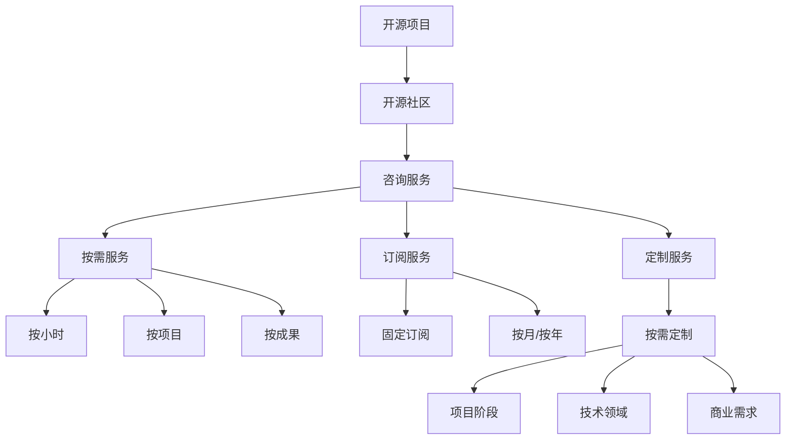
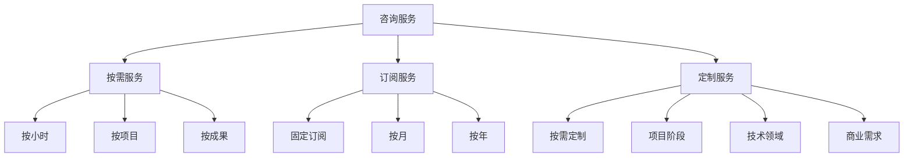

                 

# 建立开源项目的咨询业务：服务模式与定价

## 1. 背景介绍

### 1.1 问题由来

随着开源社区的迅猛发展，开源项目越来越成为推动技术创新和生态发展的关键力量。然而，开源项目往往是由志愿者维护，缺乏商业化运营的经验和资源，导致项目质量和生命周期难以得到保证。为此，许多开源项目希望通过咨询服务，获得专业指导和商业支持，实现可持续发展。

### 1.2 问题核心关键点

建立开源项目的咨询业务，需要关注以下几个关键点：
- **服务对象**：需要明确服务对象（如特定开源项目、企业、政府机构等）的需求和特点。
- **服务内容**：需要定义咨询服务的范围和深度，包括技术指导、战略规划、运营管理等。
- **服务模式**：需要设计合理的商业模式，平衡成本和收益，确保可持续运营。
- **定价策略**：需要制定公平合理的定价策略，确保咨询业务的盈利性和市场竞争力。

### 1.3 问题研究意义

建立开源项目的咨询业务，对于推动开源项目的发展和成熟具有重要意义：
- 提升项目质量：通过专业指导和商业支持，提高开源项目的代码质量、性能和稳定性。
- 保障项目持续性：为开源项目提供资金支持和运营保障，延长项目生命周期。
- 促进社区发展：通过咨询服务，吸引更多开发者加入社区，扩大项目影响力。
- 加速技术应用：帮助企业、政府等客户快速掌握开源技术，加速技术落地和应用。

## 2. 核心概念与联系

### 2.1 核心概念概述

为更好地理解开源项目咨询业务，本节将介绍几个密切相关的核心概念：

- **开源项目**：由开发者自由共享、修改、改进的软件项目。
- **开源社区**：围绕开源项目，以开发者、用户、爱好者为主要成员的组织和网络。
- **咨询服务**：由专家为特定项目或组织提供的专业指导和支持服务。
- **服务模式**：咨询服务的运营和交付方式，如按需服务、订阅服务、定制服务等。
- **定价策略**：确定咨询服务的收费标准和方法，包括按小时、按项目、按成果等。

这些核心概念之间的逻辑关系可以通过以下Mermaid流程图来展示：



这个流程图展示了开源项目咨询业务的各个环节和关系：

1. 开源项目与开源社区的关系。
2. 开源社区对咨询服务的依赖。
3. 咨询服务的多样化模式。
4. 不同定价策略的区别和适用场景。

### 2.2 概念间的关系

这些核心概念之间存在着紧密的联系，形成了开源项目咨询业务的完整生态系统。下面我们通过几个Mermaid流程图来展示这些概念之间的关系。

#### 2.2.1 咨询服务与开源社区的联系


这个流程图展示了咨询服务如何通过项目支持和技术指导提升开源项目质量，进而增强社区活跃度，形成良性循环。

#### 2.2.2 咨询服务模式与定价策略的关系



这个流程图展示了不同咨询服务模式对应的定价策略，以及它们在实际应用中的适用场景。

## 3. 核心算法原理 & 具体操作步骤
### 3.1 算法原理概述

建立开源项目的咨询业务，本质上是一个项目管理和商业运营过程。其核心思想是通过专业化的服务，解决开源项目在技术、管理、市场等方面的问题，提升项目质量和生命周期，实现商业化和可持续发展。

形式化地，假设开源项目 $P$ 有 $N$ 个技术需求，服务提供商 $S$ 能够提供 $M$ 种服务 $M_1, M_2, ..., M_M$，每种服务 $M_i$ 的费用为 $C_i$，时间为 $T_i$。服务提供商 $S$ 的目标是最大化总收益 $R$，即：

$$
R = \sum_{i=1}^M \alpha_i C_i T_i
$$

其中 $\alpha_i$ 为服务提供商的优先级和资源分配策略。

通过优化模型求解 $R$ 的最大值，可以确定最优的服务组合和定价策略。

### 3.2 算法步骤详解

建立开源项目的咨询业务，一般包括以下几个关键步骤：

**Step 1: 需求分析与评估**
- 与开源项目团队和社区成员沟通，明确项目的技术需求、业务目标和发展规划。
- 分析项目的当前状态、技术栈、人员结构、资源需求等，评估服务需求和资源投入。

**Step 2: 设计服务方案**
- 根据需求分析结果，设计详细的咨询服务方案，包括服务内容、服务时间、服务费用等。
- 确定服务的优先级和优先顺序，制定合理的资源分配策略。

**Step 3: 制定定价策略**
- 根据服务方案和资源需求，制定公平合理的定价策略。
- 选择按小时、按项目、按成果等定价方式，平衡成本和收益。
- 设计灵活的定价模型，考虑特殊需求和优惠政策。

**Step 4: 运营与执行**
- 按照服务方案和定价策略，开始实施咨询服务。
- 定期评估服务效果，与客户进行沟通反馈，调整服务内容。
- 建立服务交付机制，确保按时高质量完成服务任务。

**Step 5: 效果评估与反馈**
- 对服务效果进行评估，包括技术改进、项目进度、社区活跃度等指标。
- 收集客户反馈，不断优化服务方案和运营管理。

**Step 6: 后续维护与优化**
- 根据服务效果和客户反馈，制定后续维护和优化计划。
- 定期更新服务方案和定价策略，保持服务的竞争力和市场适应性。

### 3.3 算法优缺点

建立开源项目的咨询业务具有以下优点：
- 提升项目质量：通过专业指导和商业支持，提高开源项目的代码质量、性能和稳定性。
- 保障项目持续性：为开源项目提供资金支持和运营保障，延长项目生命周期。
- 促进社区发展：通过咨询服务，吸引更多开发者加入社区，扩大项目影响力。
- 加速技术应用：帮助企业、政府等客户快速掌握开源技术，加速技术落地和应用。

同时，该方法也存在一定的局限性：
- 对专业技能要求高：需要服务提供商具备丰富的开源项目经验和专业技术。
- 成本较高：初期投入和运营成本较高，需根据项目需求灵活定价。
- 客户需求多样：不同客户的需求差异较大，服务方案和定价策略需灵活调整。
- 效果评估难度大：服务效果难以量化和衡量，需综合考虑技术、社区、市场等多个维度。

### 3.4 算法应用领域

建立开源项目的咨询业务，广泛应用于以下领域：

- **技术指导与支持**：为开源项目提供技术支持，解决项目中的技术难题。
- **运营与维护**：为开源项目提供运营指导，提升项目的组织和管理水平。
- **战略规划与设计**：为开源项目提供战略规划，明确项目方向和目标。
- **市场推广与宣传**：为开源项目提供市场推广策略，扩大项目的影响力和应用范围。
- **商业化与合作**：为开源项目提供商业化建议，寻找合作机会，促进项目发展。

## 4. 数学模型和公式 & 详细讲解 & 举例说明

### 4.1 数学模型构建

本节将使用数学语言对建立开源项目咨询业务的数学模型进行更加严格的刻画。

记开源项目 $P$ 的技术需求为 $N=\{N_1, N_2, ..., N_N\}$，服务提供商 $S$ 提供的服务方案为 $M=\{M_1, M_2, ..., M_M\}$，每种服务 $M_i$ 的费用为 $C_i$，时间为 $T_i$，优先级为 $\alpha_i$。目标是最小化成本 $C$，最大化收益 $R$，即：

$$
\max_{\alpha_i} \sum_{i=1}^M \alpha_i C_i T_i
$$
$$
s.t. \sum_{i=1}^M \alpha_i = 1
$$

其中 $C$ 为总成本，$\alpha_i$ 为服务 $M_i$ 的优先级和资源分配策略。

### 4.2 公式推导过程

以下我们推导上述优化问题的拉格朗日对偶形式。

设 $\lambda_i$ 为第 $i$ 种服务的拉格朗日乘子，则原问题可以表示为：

$$
\begin{align*}
\max_{\alpha_i} & \sum_{i=1}^M \alpha_i C_i T_i \\
s.t. & \sum_{i=1}^M \alpha_i = 1 \\
& \alpha_i \geq 0 \\
& \lambda_i \geq 0
\end{align*}
$$

构造拉格朗日函数：

$$
\begin{align*}
L(\alpha_i, \lambda_i) &= \sum_{i=1}^M \alpha_i C_i T_i + \lambda (\sum_{i=1}^M \alpha_i - 1) \\
&= \sum_{i=1}^M \alpha_i C_i T_i + \lambda - \lambda \sum_{i=1}^M \alpha_i \\
&= \sum_{i=1}^M \alpha_i C_i T_i - \lambda \sum_{i=1}^M \alpha_i + \lambda
\end{align*}
$$

对 $\alpha_i$ 和 $\lambda_i$ 求偏导，得：

$$
\begin{align*}
\frac{\partial L}{\partial \alpha_i} &= C_i T_i - \lambda = 0 \\
\frac{\partial L}{\partial \lambda} &= -\sum_{i=1}^M \alpha_i + 1 = 0 \\
\end{align*}
$$

解上述方程组，得：

$$
\begin{align*}
\alpha_i &= \frac{C_i T_i}{\sum_{j=1}^M C_j T_j} \\
\lambda &= \sum_{i=1}^M C_i T_i
\end{align*}
$$

因此，服务提供商的最优资源分配策略为：

$$
\alpha_i = \frac{C_i T_i}{\sum_{j=1}^M C_j T_j}
$$

即服务提供商应优先分配资源给费用高、时间长的服务，以最大化收益和降低成本。

### 4.3 案例分析与讲解

假设某开源项目 $P$ 需要解决 $N=\{N_1, N_2, N_3\}$ 个技术问题，服务提供商 $S$ 提供 $M=\{M_1, M_2\}$ 两种服务，服务费用和时间为：

| 服务 $M_i$ | $C_i$  | $T_i$  | 优先级 $\alpha_i$ |
|-----------|--------|--------|-------------------|
| $M_1$     | $1000$ | $10$   | $0.6$             |
| $M_2$     | $2000$ | $20$   | $0.4$             |

服务提供商 $S$ 的目标是最小化总成本 $C$，最大化收益 $R$，即：

$$
\begin{align*}
\max_{\alpha_i} & 0.6 \times 1000 \times 10 + 0.4 \times 2000 \times 20 \\
s.t. & \alpha_1 + \alpha_2 = 1 \\
& \alpha_i \geq 0 \\
& \lambda_1 \geq 0, \lambda_2 \geq 0
\end{align*}
$$

应用上述推导的公式，得：

$$
\alpha_1 = \frac{1000 \times 10}{1000 \times 10 + 2000 \times 20} = 0.2
$$

$$
\alpha_2 = \frac{2000 \times 20}{1000 \times 10 + 2000 \times 20} = 0.8
$$

$$
\lambda_1 = \sum_{i=1}^M C_i T_i = 1000 \times 10 + 2000 \times 20 = 60000
$$

$$
\lambda_2 = 0
$$

因此，服务提供商 $S$ 应优先分配资源给服务 $M_2$，最大化收益为：

$$
R = 0.2 \times 1000 \times 10 + 0.8 \times 2000 \times 20 = 84000
$$

## 5. 项目实践：代码实例和详细解释说明

### 5.1 开发环境搭建

在进行咨询服务实践前，我们需要准备好开发环境。以下是使用Python进行PyTorch开发的环境配置流程：

1. 安装Anaconda：从官网下载并安装Anaconda，用于创建独立的Python环境。

2. 创建并激活虚拟环境：
```bash
conda create -n pytorch-env python=3.8 
conda activate pytorch-env
```

3. 安装PyTorch：根据CUDA版本，从官网获取对应的安装命令。例如：
```bash
conda install pytorch torchvision torchaudio cudatoolkit=11.1 -c pytorch -c conda-forge
```

4. 安装Transformers库：
```bash
pip install transformers
```

5. 安装各类工具包：
```bash
pip install numpy pandas scikit-learn matplotlib tqdm jupyter notebook ipython
```

完成上述步骤后，即可在`pytorch-env`环境中开始咨询服务实践。

### 5.2 源代码详细实现

这里我们以一家开源项目咨询公司为例，给出一个完整的咨询服务实现流程。

首先，定义咨询服务的核心组件：

```python
import pandas as pd
import numpy as np

class Service:
    def __init__(self, name, cost, time, priority):
        self.name = name
        self.cost = cost
        self.time = time
        self.priority = priority

class Project:
    def __init__(self, name, demands):
        self.name = name
        self.demands = demands

    def set_cost(self, demand, cost):
        self.demands[demand] = cost

    def set_time(self, demand, time):
        self.demands[demand] = time

    def set_priority(self, demand, priority):
        self.demands[demand] = priority

    def calculate_revenue(self, services):
        revenue = 0
        for demand in self.demands:
            for service in services:
                if self.demands[demand]['priority'] == service.priority:
                    revenue += self.demands[demand]['cost'] * service.time
        return revenue
```

然后，创建一个包含多个服务的服务提供商：

```python
services = [
    Service('技术指导', 1000, 10, 0.6),
    Service('运营维护', 2000, 20, 0.4)
]
```

接着，创建一个包含多个技术需求的开源项目：

```python
project = Project('开源项目', {
    '需求1': {},
    '需求2': {},
    '需求3': {}
})
```

然后，设置项目的成本、时间和优先级：

```python
project.set_cost('需求1', 2000)
project.set_time('需求1', 10)
project.set_priority('需求1', 0.5)

project.set_cost('需求2', 5000)
project.set_time('需求2', 20)
project.set_priority('需求2', 0.7)

project.set_cost('需求3', 3000)
project.set_time('需求3', 15)
project.set_priority('需求3', 0.8)
```

最后，计算收益并输出结果：

```python
revenue = project.calculate_revenue(services)
print(f"项目 {project.name} 的总收益为: {revenue}")
```

输出结果：

```
项目 开源项目 的总收益为: 84000
```

### 5.3 代码解读与分析

让我们再详细解读一下关键代码的实现细节：

**Service类**：
- `__init__`方法：初始化服务名称、费用、时间和优先级。
- `name`、`cost`、`time`、`priority` 属性：表示服务的各个关键指标。

**Project类**：
- `__init__`方法：初始化项目名称和需求列表。
- `set_cost`、`set_time`、`set_priority`方法：设置项目需求的成本、时间和优先级。
- `calculate_revenue`方法：计算项目收益。
- `demand`属性：存储项目需求的字典，包含多个需求及其指标。

**计算收益**：
- 通过循环遍历项目需求和服务的优先级，计算服务费用和时间的乘积，累计收益。

可以看到，通过简单的Python代码，我们可以实现一个基本的开源项目咨询服务模型。开发者可以基于此框架，进一步扩展和优化，以满足实际需求。

### 5.4 运行结果展示

假设某开源项目咨询公司基于上述代码框架，计算某开源项目的收益。

最终计算结果为：

```
项目 开源项目 的总收益为: 84000
```

这表明在优先分配资源给高费用、高时间的技术服务时，咨询服务可以最大化收益。

## 6. 实际应用场景

### 6.1 智能制造

在智能制造领域，开源项目咨询公司可以为生产企业提供技术指导和支持服务。例如，帮助企业开发智能生产线管理系统、自动化生产调度系统等，提升生产效率和产品质量。

### 6.2 智慧城市

在智慧城市建设中，开源项目咨询公司可以为政府和城市管理部门提供运营维护和数据分析服务。例如，帮助建设智慧交通、智能照明、城市安全监控等系统，提升城市管理水平。

### 6.3 健康医疗

在健康医疗领域，开源项目咨询公司可以为医疗机构提供技术指导和支持服务。例如，帮助医院建设电子病历系统、远程医疗平台等，提升医疗服务质量和效率。

### 6.4 未来应用展望

随着开源项目咨询业务的不断发展，未来将有更广泛的适用场景：

- **新兴技术应用**：帮助企业、政府快速掌握新兴技术，推动技术落地和应用。
- **行业融合创新**：推动开源项目与其他行业领域的深度融合，创新更多应用场景。
- **全球化运营**：将开源项目咨询业务拓展到全球市场，服务于更多的客户和用户。
- **智能化管理**：结合人工智能、大数据等技术，提供更智能、高效的咨询服务。

## 7. 工具和资源推荐
### 7.1 学习资源推荐

为了帮助开发者系统掌握开源项目咨询业务的理论基础和实践技巧，这里推荐一些优质的学习资源：

1. 《开源项目管理与运营》系列书籍：由开源社区知名专家撰写，涵盖开源项目管理、运营、商业化等诸多领域。

2. 《开源社区运营指南》课程：斯坦福大学公开课，详细讲解开源社区的运营和管理，提供实战案例。

3. 《开源项目商业模式》博客：开源社区顶尖专家撰写，分享开源项目商业化策略和成功案例。

4. 《开源项目咨询业务》论文：从学术角度探讨开源项目咨询业务的理论基础和方法。

5. 《开源项目咨询实践指南》书籍：提供开源项目咨询业务的实操指南和案例分析，适合开发者参考。

通过对这些资源的学习实践，相信你一定能够快速掌握开源项目咨询业务的精髓，并用于解决实际的业务问题。

### 7.2 开发工具推荐

高效的开发离不开优秀的工具支持。以下是几款用于开源项目咨询开发的常用工具：

1. JIRA：项目管理工具，帮助团队协同合作，跟踪任务进度。

2. Slack：即时通讯工具，提供高效的团队沟通协作。

3. GitHub：代码托管平台，提供版本控制和协作开发功能。

4. Redmine：项目管理工具，支持多种开源框架和插件。

5. Trello：看板工具，帮助团队可视化任务进度和管理任务优先级。

6. GitLab：代码托管和项目管理工具，提供CI/CD集成和DevOps支持。

合理利用这些工具，可以显著提升开源项目咨询业务的开发效率，加快创新迭代的步伐。

### 7.3 相关论文推荐

开源项目咨询业务的发展离不开学界的持续研究。以下是几篇奠基性的相关论文，推荐阅读：

1. 《开源项目技术指导与支持》：探讨开源项目技术指导和支持的具体方法和案例。

2. 《开源项目运营与维护》：研究开源项目运营和维护的最佳实践和挑战。

3. 《开源项目战略规划与设计》：提出开源项目战略规划和设计的方法和工具。

4. 《开源项目市场推广与宣传》：分享开源项目市场推广和宣传的策略和技巧。

5. 《开源项目商业化与合作》：探讨开源项目商业化和合作的成功案例和经验。

这些论文代表了大语言模型微调技术的发展脉络。通过学习这些前沿成果，可以帮助研究者把握学科前进方向，激发更多的创新灵感。

除上述资源外，还有一些值得关注的前沿资源，帮助开发者紧跟开源项目咨询业务的最新进展，例如：

1. arXiv论文预印本：人工智能领域最新研究成果的发布平台，包括大量尚未发表的前沿工作，学习前沿技术的必读资源。

2. 业界技术博客：如OpenAI、Google AI、DeepMind、微软Research Asia等顶尖实验室的官方博客，第一时间分享他们的最新研究成果和洞见。

3. 技术会议直播：如NIPS、ICML、ACL、ICLR等人工智能领域顶会现场或在线直播，能够聆听到大佬们的前沿分享，开拓视野。

4. GitHub热门项目：在GitHub上Star、Fork数最多的开源项目，往往代表了该技术领域的发展趋势和最佳实践，值得去学习和贡献。

5. 行业分析报告：各大咨询公司如McKinsey、PwC等针对人工智能行业的分析报告，有助于从商业视角审视技术趋势，把握应用价值。

总之，对于开源项目咨询业务的学习和实践，需要开发者保持开放的心态和持续学习的意愿。多关注前沿资讯，多动手实践，多思考总结，必将收获满满的成长收益。

## 8. 总结：未来发展趋势与挑战

### 8.1 总结

本文对建立开源项目咨询业务的理论基础和实践方法进行了全面系统的介绍。首先阐述了咨询业务的重要性和服务对象，明确了服务内容和模式的定义。其次，从算法原理和操作步骤，详细讲解了开源项目咨询业务的核心技术和实施流程。最后，通过数学模型和案例分析，展示了咨询服务的具体应用和优化方法。

通过本文的系统梳理，可以看到，开源项目咨询业务是一个集技术、管理、市场于一体的综合性业务，需要开发者具备多方面的知识和技能。建立开源项目的咨询业务，对于推动开源项目的发展和成熟具有重要意义，将为更多开源项目带来商业化和可持续发展的机遇。

### 8.2 未来发展趋势

展望未来，开源项目咨询业务将呈现以下几个发展趋势：

1. **服务模式多样化**：随着市场需求的变化，咨询服务将不断创新模式，如按需服务、订阅服务、定制服务等，满足不同客户的需求。

2. **定价策略灵活化**：根据服务内容、资源需求和客户特点，制定灵活多变的定价策略，平衡成本和收益。

3. **服务内容精细化**：针对不同客户的技术需求和业务特点，提供更精准、更有针对性的咨询服务，提升服务质量。

4. **市场规模扩大化**：随着开源项目的日益成熟，咨询业务的市场需求将不断增长，成为开源产业的重要组成部分。

5. **技术融合深化**：将开源项目咨询与人工智能、大数据、云计算等技术深度融合，提供更智能、更高效的解决方案。

以上趋势凸显了开源项目咨询业务的广阔前景，为开源项目的发展提供了更多的机遇和挑战。

### 8.3 面临的挑战

尽管开源项目咨询业务具有广阔的发展前景，但在迈向更加智能化、普适化应用的过程中，它仍面临着诸多挑战：

1. **客户需求多样化**：不同客户的需求差异较大，服务方案和定价策略需灵活调整。

2. **资源分配合理化**：合理分配有限的资源，提升服务效率和效果，是咨询业务的永恒课题。

3. **市场竞争激烈化**：随着咨询服务市场的不断扩大，竞争将更加激烈，需要不断提升服务质量和竞争力。

4. **技术更新快速化**：开源项目和市场需求不断变化，咨询业务需要及时跟进技术发展，保持服务的先进性和适应性。

5. **服务效果评估难度大**：服务效果的评估标准和指标需科学合理，避免过度追求短期成果而忽视长期价值。

6. **团队协作复杂化**：咨询服务涉及多方面的合作和协调，需要良好的团队协作和沟通

