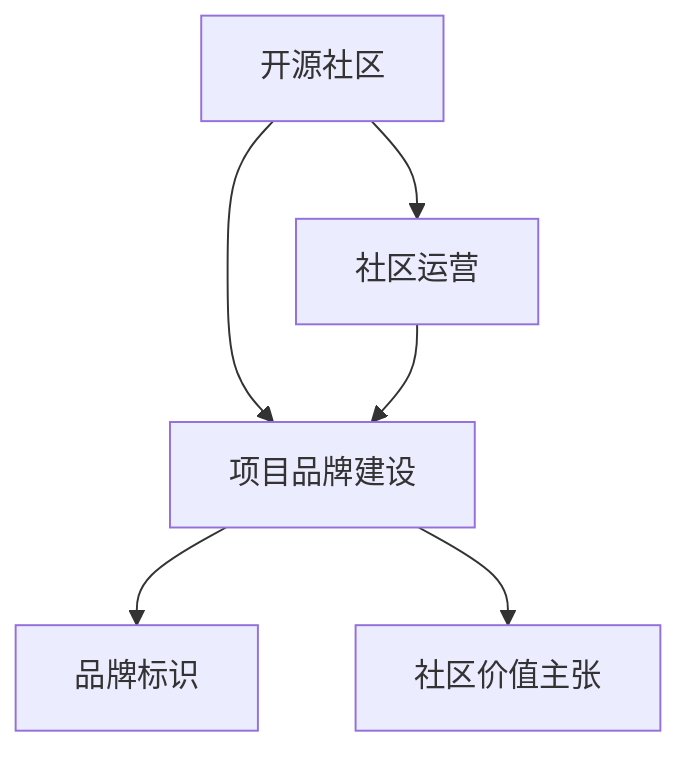
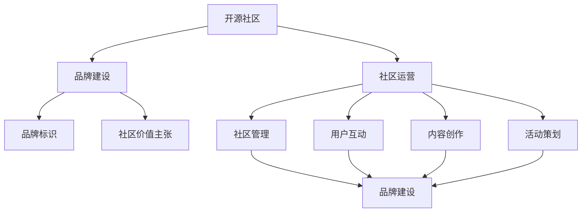

                 

# 建立开源项目的在线社区：社区运营和品牌建设

> 关键词：开源社区, 项目品牌建设, 社区运营, 用户互动, 社区治理

## 1. 背景介绍

随着开源软件在IT行业中的普及和重要性日益增加，开源项目的社区建设和管理成为了开发者的关注焦点。开源社区不仅是代码共享的平台，更是文化和价值观的传播场所。建立健康、活跃、有影响力的开源社区，对提升项目影响力、加速技术迭代、吸引和保留贡献者至关重要。然而，如何高效运营一个开源社区，建设项目的品牌，实现社区成员之间的良好互动，是目前开源项目面临的重要挑战。本文将从社区运营和品牌建设两个角度，探讨建立开源项目在线社区的策略和实践。

## 2. 核心概念与联系

### 2.1 核心概念概述

在讨论具体的社区运营和品牌建设策略之前，首先明确以下几个关键概念：

- **开源社区（Open Source Community）**：基于开源理念（Open Source）构建的软件项目社区，致力于代码共享、交流、合作，同时维护开放透明、协作共赢的社区文化。
- **品牌建设（Brand Building）**：通过一系列活动和策略，塑造项目在用户心中的良好形象，提升项目知名度、美誉度和忠诚度，构建独特的品牌标识和社区价值主张。
- **社区运营（Community Operations）**：包括社区管理、用户互动、内容创作、活动策划等，旨在提升社区活跃度、促进知识共享和社区协作，建立稳定的社区生态。

这些概念之间相互联系，共同构成开源项目在线社区的核心支撑体系。项目品牌建设是社区运营的最终目标，而社区运营则是品牌建设的具体实践。社区运营的好坏直接决定了品牌建设的成效和项目的影响力。

### 2.2 概念间的关系

以下通过两个Mermaid流程图，展示开源社区、品牌建设和社区运营三者之间的关系：





这些流程图清晰地展示了开源社区、品牌建设和社区运营之间的关系。开源社区是基础，品牌建设是最终目标，而社区运营则是实现这一目标的日常实践。通过有效的社区运营，品牌建设才能落地，社区文化才能形成，最终在用户心中建立起项目的独特形象和价值。

## 3. 核心算法原理 & 具体操作步骤

### 3.1 算法原理概述

开源社区和品牌建设涉及的算法和理论较为复杂，通常采用混合方法（Hybrid Method），结合数据分析、社交网络分析（Social Network Analysis, SNA）、用户行为分析等技术，以提升社区管理、用户互动和品牌塑造的效率和效果。

具体而言，开源社区的运营和管理涉及以下几个方面：

- **社区治理**：通过制定社区规则、治理机制和权限体系，确保社区的健康发展和良性互动。
- **用户互动**：通过激励机制、互动工具和平台支持，提升用户参与度和贡献质量。
- **内容创作**：通过社区文化引导、激励机制和技术支持，促进高质量内容的产生和传播。

品牌建设则主要涉及：

- **品牌定位**：通过市场调研、用户反馈和竞争分析，确定项目品牌的核心价值和独特卖点。
- **品牌传播**：通过社交媒体、博客、视频等多种渠道，传播品牌故事和价值观，提升品牌知名度和影响力。
- **品牌维护**：通过持续的品牌活动、社区互动和用户反馈，维护品牌的长期形象和用户忠诚度。

### 3.2 算法步骤详解

以下是开源社区建设和品牌建设的关键步骤：

**Step 1: 明确社区目标和治理结构**

- 定义社区的目标和愿景，包括技术目标、文化目标和用户目标。
- 设计社区的治理结构，包括决策委员会、管理层和普通成员的权限和职责。

**Step 2: 制定社区规则和激励机制**

- 制定社区的规则和行为准则，确保社区的健康和有序。
- 设计激励机制，如徽章、奖励、晋升等，鼓励用户积极参与和贡献。

**Step 3: 建设社区平台和互动工具**

- 选择合适的社区平台，如GitHub、Gitee、Slack等，支持社区的协作和交流。
- 开发或引入互动工具，如Discord、JIRA、Miro等，促进用户之间的协作和沟通。

**Step 4: 激励高质量内容的创作和传播**

- 制定内容标准和评审机制，确保内容的准确性和高质量。
- 通过社区博客、技术论坛、社交媒体等渠道，传播优质内容，提升品牌形象。

**Step 5: 策划和执行品牌传播活动**

- 策划品牌传播活动，如技术研讨会、黑客马拉松、技术博客等。
- 通过社交媒体、新闻发布、行业会议等渠道，提升品牌知名度和影响力。

**Step 6: 持续监测和优化社区运营**

- 定期监测社区运营的数据和反馈，及时调整策略和措施。
- 根据社区的发展和变化，不断优化社区治理和品牌建设。

### 3.3 算法优缺点

开源社区和品牌建设的优势和挑战并存：

**优点：**

- **社区共治**：通过社区治理和激励机制，提高用户参与度和贡献质量，形成良性互动的社区生态。
- **品牌传播**：通过高质量内容的创作和传播，提升项目品牌的知名度和美誉度。
- **用户忠诚度**：通过持续的品牌活动和社区互动，培养用户对项目的长期忠诚度和认同感。

**缺点：**

- **治理挑战**：社区成员数量庞大、背景复杂，治理机制的制定和执行较为困难。
- **品牌保护**：在开源环境中，品牌容易受到外界质疑和攻击，需要持续维护和保护。
- **资源消耗**：社区运营和品牌建设需要大量的人力和物力投入，成本较高。

### 3.4 算法应用领域

开源社区和品牌建设的应用领域非常广泛，以下是几个典型案例：

**GitHub社区：**

- 通过社区平台和GitHub Actions等工具，支持社区协作和代码贡献。
- 通过GitHub Pages和GitHub Sponsors等平台，传播项目和品牌故事。

**Apache基金会：**

- 通过管理层和决策委员会，制定社区规则和治理机制。
- 通过Apache Conference和ApacheCon等活动，促进社区互动和品牌传播。

**Linux基金会：**

- 通过社区博客和Linux Journal等平台，发布高质量的技术文章和新闻。
- 通过Linux Foundation和Linux Developer Day等活动，提升品牌知名度。

## 4. 数学模型和公式 & 详细讲解 & 举例说明

### 4.1 数学模型构建

在大规模开源社区和品牌建设的背景下，可以通过以下数学模型来分析社区行为和品牌影响：

- **社区活跃度模型**：通过计算社区成员的活跃度和参与度，评估社区的健康状态。
- **用户贡献度模型**：通过分析用户提交的代码行数、贡献次数和质量评分，衡量用户的贡献水平。
- **品牌传播模型**：通过社交媒体分析（如Twitter、GitHub Insights），衡量品牌在用户中的传播效果和影响力。

### 4.2 公式推导过程

以下以社区活跃度模型为例，推导其公式和计算方法。

假设社区有 $N$ 个成员，每个成员的活跃度为 $a_i$，社区的平均活跃度为 $\overline{a}$，则社区活跃度模型的公式为：

$$
\overline{a} = \frac{1}{N} \sum_{i=1}^N a_i
$$

其中 $a_i$ 表示第 $i$ 个成员的活跃度，可以是提交代码行数、回复问题次数、贡献版本数等。通过计算 $\overline{a}$，可以评估社区的整体活跃度和健康状态。

### 4.3 案例分析与讲解

以Apache基金会为例，分析其社区活跃度和品牌建设策略：

- **社区活跃度**：Apache基金会通过定期发布社区活跃报告（Committer Activity Report），统计各项目提交代码行数、贡献次数等指标，评估社区活跃度。同时，通过邮件列表和Slack等渠道，促进社区成员之间的互动和协作。

- **品牌建设**：Apache基金会通过Apache Conference和ApacheCon等大型会议，提升品牌知名度和影响力。通过社区博客和GitHub Pages等平台，传播品牌故事和价值观。

通过以上分析，可以看到，Apache基金会在社区活跃度和品牌建设方面取得了显著成效，成为开源社区管理的有力标杆。

## 5. 项目实践：代码实例和详细解释说明

### 5.1 开发环境搭建

在建立开源社区和品牌建设的过程中，开发环境搭建是基础。以下是常见的开发环境搭建步骤：

1. **选择合适的开源社区平台**：如GitHub、Gitee、Apache Jira等。
2. **配置项目管理工具**：如JIRA、Trello、Asana等，支持任务管理和进度跟踪。
3. **安装开发工具**：如Git、GitHub Desktop、Visual Studio Code等，便于代码管理和版本控制。

完成环境搭建后，即可在开发环境中进行社区运营和品牌建设的实践。

### 5.2 源代码详细实现

以下是基于GitHub的开源社区和品牌建设的基本代码实现：

```python
import github
import requests

# 创建GitHub API客户端
client = github.Github("your_token")

# 创建新的GitHub Repository
repo = client.create_repo(
    name="your_project_name",
    description="Your project description",
    private=False
)

# 创建GitHub Issue
issue = client.create_issue(
    repo.owner,
    repo.name,
    title="Your issue title",
    body="Your issue description"
)

# 获取GitHub Repository信息
repo_info = client.get_repo(repo.owner, repo.name)

# 获取GitHub Issue列表
issue_list = client.get_issues(
    repo.owner,
    repo.name,
    state="open"
)

# 统计社区活跃度
activity_count = sum(issue.stats.issues as issue for issue in issue_list)

# 输出社区活跃度
print(f"Community activity count: {activity_count}")

# 创建社区博客
blog_url = "https://your_blog_address.com"
client.create_blog(
    repo.owner,
    repo.name,
    title="Your blog title",
    content=f"Welcome to the {repo_info.name} community blog. <a href='{blog_url}'>Read more</a>."
)

# 发布社区活动公告
announcement = client.create_release(
    repo.owner,
    repo.name,
    tag="v1.0",
    name="Community Announcement",
    body="Our community is thriving! Check out our latest blog post for more details."
)

# 获取社区成员列表
members = client.get_members(repo.owner, repo.name)
for member in members:
    print(f"Member: {member.login}")
```

### 5.3 代码解读与分析

以上代码实现了GitHub上开源项目的基本操作，包括创建仓库、提交Issue、统计活跃度、创建博客和发布活动公告等。通过这些操作，可以有效地促进社区运营和品牌建设。

### 5.4 运行结果展示

运行以上代码，可以在GitHub上创建一个新的开源项目，并发布社区活动公告。具体运行结果包括：

- 创建新的GitHub Repository
- 发布GitHub Issue
- 统计社区活跃度
- 创建社区博客
- 发布社区活动公告

通过这些操作，可以显著提升开源社区的活跃度和用户互动，同时传播项目的品牌价值，提升项目影响力。

## 6. 实际应用场景

### 6.1 开源软件项目

开源软件项目通过社区运营和品牌建设，可以显著提升项目知名度和影响力，吸引更多用户和贡献者。例如，Linux内核（Linux Kernel）通过持续的社区建设和管理，吸引了全球数万名开发者共同贡献代码，成为最活跃的开源项目之一。

### 6.2 企业内部开源

企业内部开源项目通过社区运营和品牌建设，可以提升企业内部的技术创新和知识共享能力。例如，谷歌的Open Source Programs Office（OSPO）通过推广开源文化，鼓励员工参与开源项目，提升了公司的技术创新和影响力。

### 6.3 学术研究项目

学术研究项目通过社区运营和品牌建设，可以吸引更多的研究人员和学生参与研究，加速学术成果的传播和应用。例如，MIT的MIT License通过明确社区规则和权利，吸引全球研究人员共同参与开源研究。

### 6.4 未来应用展望

未来，开源社区和品牌建设的趋势和应用场景将更加多样化。以下是几个未来展望：

- **多模态社区**：结合文本、图像、音频等多种数据类型，构建更加丰富和互动的社区平台。
- **全球化社区**：通过多语言支持和国际化功能，吸引全球用户共同参与社区建设。
- **生态系统建设**：构建开源项目的生态系统，包括硬件、软件、服务等多个方面，提升项目的应用价值和影响力。

## 7. 工具和资源推荐

### 7.1 学习资源推荐

- **《开源社区管理与运营》**：系统介绍开源社区管理、用户互动和品牌建设的最佳实践。
- **《品牌建设与传播》**：详细介绍品牌定位、品牌传播和品牌维护的策略和案例。
- **《社区治理与参与》**：讲解社区治理机制、激励机制和权限体系的设计与实施。

### 7.2 开发工具推荐

- **GitHub Desktop**：直观易用的GitHub客户端，支持本地版本控制和云平台集成。
- **GitHub Pages**：免费的GitHub静态网站托管服务，支持发布社区博客和技术文档。
- **GitHub Insights**：GitHub提供的社区分析工具，支持统计社区活跃度和贡献度。

### 7.3 相关论文推荐

- **《开源社区动态与演化研究》**：通过数据分析和模型构建，研究开源社区的动态变化和演化规律。
- **《品牌传播与社区互动的互动效应》**：通过社交网络分析和用户行为分析，研究品牌传播和社区互动的互动效应。
- **《开源项目的社区治理机制设计》**：详细讨论开源项目的社区治理机制设计，包括决策机制、激励机制和权限体系。

## 8. 总结：未来发展趋势与挑战

### 8.1 研究成果总结

本文系统探讨了开源社区和品牌建设的核心概念和策略，通过具体的实践案例和数据分析，展示了社区运营和品牌建设的有效方法和工具。开源社区和品牌建设的核心在于促进用户互动和知识共享，提升项目的影响力和应用价值。通过持续的社区运营和品牌建设，开源项目可以实现技术创新和应用价值的双重提升。

### 8.2 未来发展趋势

未来，开源社区和品牌建设的趋势将更加多样化和复杂化，以下是几个关键趋势：

- **社区治理的智能化**：通过AI和大数据技术，实现社区治理的智能化，提高治理效率和决策质量。
- **品牌传播的多元化**：结合社交媒体、视频、直播等多种渠道，提升品牌传播的效果和覆盖范围。
- **用户互动的沉浸化**：通过虚拟现实（VR）和增强现实（AR）技术，提升用户互动的沉浸感和体验度。

### 8.3 面临的挑战

尽管开源社区和品牌建设前景广阔，但也面临诸多挑战：

- **社区规模管理**：开源社区成员数量庞大，管理复杂，如何有效管理和激励用户成为难题。
- **品牌保护和维护**：开源项目品牌容易受到外界质疑和攻击，如何保护品牌形象和维护品牌价值。
- **技术迭代和更新**：开源项目需要持续的技术迭代和更新，如何平衡开发速度和社区互动成为关键。

### 8.4 研究展望

面对这些挑战，未来需要在以下几个方面寻求新的突破：

- **社区自治机制**：设计更加自治和灵活的社区治理机制，提高用户自治和社区自治能力。
- **品牌安全保护**：引入区块链和数字签名技术，确保品牌传播和认证的安全性和可靠性。
- **社区互动和协作**：通过智能推荐系统和协同编辑器，提升社区成员之间的互动和协作效率。

## 9. 附录：常见问题与解答

**Q1: 开源社区和品牌建设有哪些具体的步骤？**

A: 开源社区和品牌建设的详细步骤包括：

1. **明确社区目标和治理结构**：定义社区的目标和愿景，设计治理结构。
2. **制定社区规则和激励机制**：制定社区规则和行为准则，设计激励机制。
3. **建设社区平台和互动工具**：选择合适的社区平台和互动工具，支持社区协作和交流。
4. **激励高质量内容的创作和传播**：制定内容标准和评审机制，通过多种渠道传播优质内容。
5. **策划和执行品牌传播活动**：策划品牌传播活动，提升品牌知名度和影响力。
6. **持续监测和优化社区运营**：定期监测社区运营的数据和反馈，不断优化策略和措施。

**Q2: 如何确保开源社区的治理效果？**

A: 确保开源社区治理效果的关键在于：

1. **透明公开**：社区规则和决策过程需要透明公开，确保社区成员的知情权和参与权。
2. **多方参与**：通过多方参与机制，确保社区治理的民主化和广泛化。
3. **激励机制**：设计合理的激励机制，鼓励社区成员积极参与和贡献。
4. **持续优化**：根据社区发展变化，持续优化治理机制和策略。

**Q3: 开源社区和品牌建设需要哪些资源？**

A: 开源社区和品牌建设需要以下资源：

1. **人力资源**：社区运营和管理需要大量的人力投入，包括项目管理员、社区经理等。
2. **技术资源**：社区平台和互动工具的开发和维护需要强大的技术支持。
3. **资金资源**：社区建设和品牌传播需要一定的资金投入，包括社区活动和品牌宣传等。

**Q4: 如何通过社区互动提升品牌影响力？**

A: 通过社区互动提升品牌影响力的关键在于：

1. **建立社区文化**：通过文化引导和激励机制，建立社区的共同价值观和行为规范。
2. **高质量内容传播**：通过高质量的内容创作和传播，提升品牌的知名度和美誉度。
3. **社区活动策划**：通过社区活动和品牌传播活动，增强社区成员的参与感和归属感。
4. **用户反馈机制**：通过用户反馈机制，了解社区成员的需求和建议，不断优化社区运营和品牌建设。

---

作者：禅与计算机程序设计艺术 / Zen and the Art of Computer Programming

