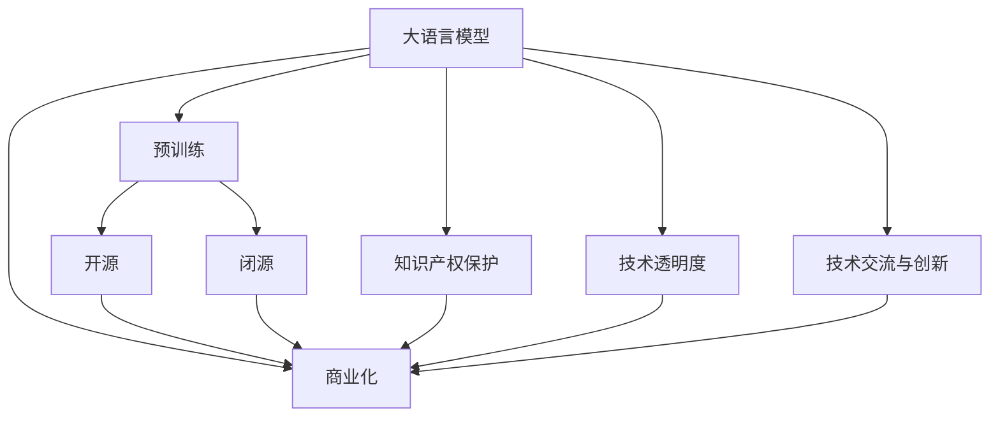
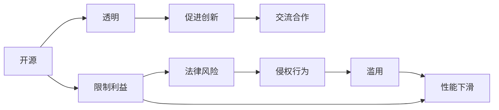
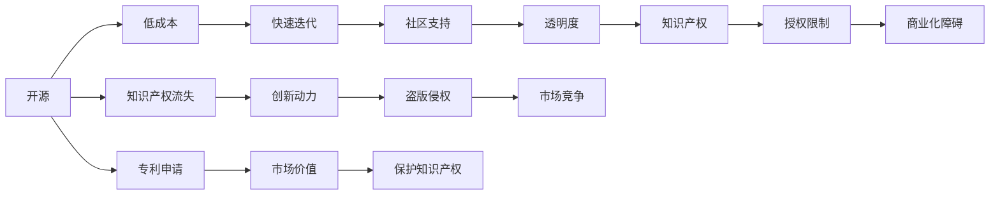

                 

# 开源还是闭源:大模型商业化的抉择

> 关键词：大语言模型商业化,开源闭源决策,知识产权,模型应用,业务需求

## 1. 背景介绍

### 1.1 问题由来
随着人工智能技术的迅猛发展，大语言模型（Large Language Models, LLMs）在自然语言处理（Natural Language Processing, NLP）、计算机视觉（Computer Vision, CV）等领域取得了显著进展，成为了许多应用的关键驱动力。这些模型通常需要大量数据和计算资源进行训练，形成庞大的参数空间，导致其开发和部署成本高昂，难以在商业环境下高效运作。

大模型的商业化涉及多个方面，包括模型构建、部署、运维、更新以及知识产权保护等。在商业化过程中，企业需要权衡是否开源大模型或采用闭源策略。这个问题不仅是技术上的选择，更是商业、法律和伦理上的重要抉择。本文将探讨这一问题，详细分析开源与闭源策略的优缺点，并为大模型商业化提供决策建议。

### 1.2 问题核心关键点
大模型的商业化涉及到是否开源和闭源的决策，具体关键点包括：

- 开源与闭源的区别与联系：开源意味着代码、模型、数据集等可被公众免费使用，而闭源则保留知识产权，只允许特定用户使用。
- 开源与闭源的优缺点：开源可以提高透明度、促进技术交流和创新，但可能面临盗用、滥用等问题；闭源则保护知识产权、减少法律风险，但可能限制模型应用范围和用户使用体验。
- 大模型商业化的实际需求：不同企业根据业务需求、市场定位、技术能力等因素，可能更倾向于开源或闭源。

### 1.3 问题研究意义
研究大模型商业化的开源与闭源策略，对于企业把握技术发展趋势、制定合理的商业化路线、保护知识产权、提升竞争力具有重要意义：

1. 技术透明与创新：开源策略可促进技术透明、加速技术创新，吸引更多开发者参与，形成良性循环。
2. 知识产权保护：闭源策略可以保护核心技术，防止知识产权流失，确保商业利益。
3. 业务需求满足：企业需要根据业务需求和市场策略，选择最适合的开源或闭源方式。
4. 用户使用体验：开源策略有助于用户定制化和二次开发，提高用户满意度；闭源则有更多控制权，提升用户体验。
5. 市场竞争优势：开源与闭源策略的合理选择，有助于企业在竞争中脱颖而出，形成技术壁垒。

## 2. 核心概念与联系

### 2.1 核心概念概述

为更好地理解开源与闭源策略在大模型商业化中的作用，本节将介绍几个密切相关的核心概念：

- 大语言模型(Large Language Model, LLM)：以自回归(如GPT)或自编码(如BERT)模型为代表的大规模预训练语言模型。通过在大规模无标签文本语料上进行预训练，学习通用的语言知识，具备强大的语言理解和生成能力。

- 开源(Open Source)：指将大模型的源代码、数据集等公开，允许任何人在遵守许可协议的前提下使用、修改和分发。

- 闭源(Closed Source)：指大模型的源代码、数据集等仅限于特定用户使用，不公开。

- 商业化(Commercialization)：将大模型应用于商业环境中，通过知识产权保护、市场营销等手段实现商业价值的转化。

- 知识产权(Intellectual Property, IP)：包括专利、版权、商标等，保护创新技术的法律手段。

- 技术透明度(Transparency)：指公开技术细节和实现方式，便于理解和交流。

- 技术交流与创新(Technical Exchange and Innovation)：开源促进技术交流和创新，闭源则限制交流和创新。

这些核心概念之间的逻辑关系可以通过以下Mermaid流程图来展示：



这个流程图展示了大语言模型商业化过程中的核心概念及其之间的关系：

1. 大语言模型通过预训练获得基础能力。
2. 开源与闭源策略决定模型的公开程度。
3. 商业化过程涉及模型的应用和价值的转化。
4. 知识产权保护确保商业利益。
5. 技术透明度促进技术交流和创新。
6. 技术交流与创新推动模型应用和改进。

这些概念共同构成了大模型商业化的完整生态系统，为大模型商业化提供了多维度的参考。

### 2.2 概念间的关系

这些核心概念之间存在着紧密的联系，形成了大模型商业化的完整生态系统。下面我通过几个Mermaid流程图来展示这些概念之间的关系。

#### 2.2.1 开源与闭源的关系



这个流程图展示了开源与闭源之间的关系：

1. 开源带来透明、促进创新、交流合作，但也可能限制商业利益，面临法律风险和滥用问题。
2. 闭源确保商业利益、法律风险小，但可能限制模型应用范围和用户交流合作，性能可能下滑。

#### 2.2.2 开源与闭源的对比



这个流程图展示了开源与闭源的对比：

1. 开源降低成本、快速迭代、社区支持、透明度高，但也面临知识产权流失、创新动力减弱、盗版侵权、市场竞争等风险。
2. 闭源确保知识产权、保护商业利益、授权限制少，但也面临成本高、迭代慢、社区支持少等问题。

#### 2.2.3 开源与闭源的整体架构

最后，我们用一个综合的流程图来展示这些核心概念在大模型商业化过程中的整体架构：

```mermaid
graph TB
    A[大语言模型] --> B[预训练]
    B --> C[开源]
    B --> D[闭源]
    C --> E[透明]
    E --> F[促进创新]
    F --> G[交流合作]
    G --> H[社区支持]
    H --> I[低成本]
    I --> J[快速迭代]
    C --> J
    D --> K[保护知识产权]
    K --> L[商业化]
    L --> M[授权限制]
    M --> N[高成本]
    N --> O[慢迭代]
    D --> O
    A --> P[技术透明度]
    P --> Q[技术交流与创新]
    Q --> R[推动模型应用]
    R --> S[持续改进]
    S --> T[用户体验]
    T --> U[提升满意]
    U --> V[用户参与]
    V --> W[数据反馈]
    W --> X[模型改进]
    A --> Y[商业价值]
    Y --> Z[市场应用]
    Z --> AAA[数据隐私]
    AAA --> AAAA[用户信任]
    AA --> Z
    AA --> AAAA
    AA --> Z
    AA --> AAAA
    AA --> Z
    AA --> AAAA
    AA --> Z
    AA --> AAAA
    AA --> Z
    AA --> AAAA
    AA --> Z
    AA --> AAAA
    AA --> Z
    AA --> AAAA
    AA --> Z
    AA --> AAAA
    AA --> Z
    AA --> AAAA
    AA --> Z
    AA --> AAAA
    AA --> Z
    AA --> AAAA
    AA --> Z
    AA --> AAAA
    AA --> Z
    AA --> AAAA
    AA --> Z
    AA --> AAAA
    AA --> Z
    AA --> AAAA
    AA --> Z
    AA --> AAAA
    AA --> Z
    AA --> AAAA
    AA --> Z
    AA --> AAAA
    AA --> Z
    AA --> AAAA
    AA --> Z
    AA --> AAAA
    AA --> Z
    AA --> AAAA
    AA --> Z
    AA --> AAAA
    AA --> Z
    AA --> AAAA
    AA --> Z
    AA --> AAAA
    AA --> Z
    AA --> AAAA
    AA --> Z
    AA --> AAAA
    AA --> Z
    AA --> AAAA
    AA --> Z
    AA --> AAAA
    AA --> Z
    AA --> AAAA
    AA --> Z
    AA --> AAAA
    AA --> Z
    AA --> AAAA
    AA --> Z
    AA --> AAAA
    AA --> Z
    AA --> AAAA
    AA --> Z
    AA --> AAAA
    AA --> Z
    AA --> AAAA
    AA --> Z
    AA --> AAAA
    AA --> Z
    AA --> AAAA
    AA --> Z
    AA --> AAAA
    AA --> Z
    AA --> AAAA
    AA --> Z
    AA --> AAAA
    AA --> Z
    AA --> AAAA
    AA --> Z
    AA --> AAAA
    AA --> Z
    AA --> AAAA
    AA --> Z
    AA --> AAAA
    AA --> Z
    AA --> AAAA
    AA --> Z
    AA --> AAAA
    AA --> Z
    AA --> AAAA
    AA --> Z
    AA --> AAAA
    AA --> Z
    AA --> AAAA
    AA --> Z
    AA --> AAAA
    AA --> Z
    AA --> AAAA
    AA --> Z
    AA --> AAAA
    AA --> Z
    AA --> AAAA
    AA --> Z
    AA --> AAAA
    AA --> Z
    AA --> AAAA
    AA --> Z
    AA --> AAAA
    AA --> Z
    AA --> AAAA
    AA --> Z
    AA --> AAAA
    AA --> Z
    AA --> AAAA
    AA --> Z
    AA --> AAAA
    AA --> Z
    AA --> AAAA
    AA --> Z
    AA --> AAAA
    AA --> Z
    AA --> AAAA
    AA --> Z
    AA --> AAAA
    AA --> Z
    AA --> AAAA
    AA --> Z
    AA --> AAAA
    AA --> Z
    AA --> AAAA
    AA --> Z
    AA --> AAAA
    AA --> Z
    AA --> AAAA
    AA --> Z
    AA --> AAAA
    AA --> Z
    AA --> AAAA
    AA --> Z
    AA --> AAAA
    AA --> Z
    AA --> AAAA
    AA --> Z
    AA --> AAAA
    AA --> Z
    AA --> AAAA
    AA --> Z
    AA --> AAAA
    AA --> Z
    AA --> AAAA
    AA --> Z
    AA --> AAAA
    AA --> Z
    AA --> AAAA
    AA --> Z
    AA --> AAAA
    AA --> Z
    AA --> AAAA
    AA --> Z
    AA --> AAAA
    AA --> Z
    AA --> AAAA
    AA --> Z
    AA --> AAAA
    AA --> Z
    AA --> AAAA
    AA --> Z
    AA --> AAAA
    AA --> Z
    AA --> AAAA
    AA --> Z
    AA --> AAAA
    AA --> Z
    AA --> AAAA
    AA --> Z
    AA --> AAAA
    AA --> Z
    AA --> AAAA
    AA --> Z
    AA --> AAAA
    AA --> Z
    AA --> AAAA
    AA --> Z
    AA --> AAAA
    AA --> Z
    AA --> AAAA
    AA --> Z
    AA --> AAAA
    AA --> Z
    AA --> AAAA
    AA --> Z
    AA --> AAAA
    AA --> Z
    AA --> AAAA
    AA --> Z
    AA --> AAAA
    AA --> Z
    AA --> AAAA
    AA --> Z
    AA --> AAAA
    AA --> Z
    AA --> AAAA
    AA --> Z
    AA --> AAAA
    AA --> Z
    AA --> AAAA
    AA --> Z
    AA --> AAAA
    AA --> Z
    AA --> AAAA
    AA --> Z
    AA --> AAAA
    AA --> Z
    AA --> AAAA
    AA --> Z
    AA --> AAAA
    AA --> Z
    AA --> AAAA
    AA --> Z
    AA --> AAAA
    AA --> Z
    AA --> AAAA
    AA --> Z
    AA --> AAAA
    AA --> Z
    AA --> AAAA
    AA --> Z
    AA --> AAAA
    AA --> Z
    AA --> AAAA
    AA --> Z
    AA --> AAAA
    AA --> Z
    AA --> AAAA
    AA --> Z
    AA --> AAAA
    AA --> Z
    AA --> AAAA
    AA --> Z
    AA --> AAAA
    AA --> Z
    AA --> AAAA
    AA --> Z
    AA --> AAAA
    AA --> Z
    AA --> AAAA
    AA --> Z
    AA --> AAAA
    AA --> Z
    AA --> AAAA
    AA --> Z
    AA --> AAAA
    AA --> Z
    AA --> AAAA
    AA --> Z
    AA --> AAAA
    AA --> Z
    AA --> AAAA
    AA --> Z
    AA --> AAAA
    AA --> Z
    AA --> AAAA
    AA --> Z
    AA --> AAAA
    AA --> Z
    AA --> AAAA
    AA --> Z
    AA --> AAAA
    AA --> Z
    AA --> AAAA
    AA --> Z
    AA --> AAAA
    AA --> Z
    AA --> AAAA
    AA --> Z
    AA --> AAAA
    AA --> Z
    AA --> AAAA
    AA --> Z
    AA --> AAAA
    AA --> Z
    AA --> AAAA
    AA --> Z
    AA --> AAAA
    AA --> Z
    AA --> AAAA
    AA --> Z
    AA --> AAAA
    AA --> Z
    AA --> AAAA
    AA --> Z
    AA --> AAAA
    AA --> Z
    AA --> AAAA
    AA --> Z
    AA --> AAAA
    AA --> Z
    AA --> AAAA
    AA --> Z
    AA --> AAAA
    AA --> Z
    AA --> AAAA
    AA --> Z
    AA --> AAAA
    AA --> Z
    AA --> AAAA
    AA --> Z
    AA --> AAAA
    AA --> Z
    AA --> AAAA
    AA --> Z
    AA --> AAAA
    AA --> Z
    AA --> AAAA
    AA --> Z
    AA --> AAAA
    AA --> Z
    AA --> AAAA
    AA --> Z
    AA --> AAAA
    AA --> Z
    AA --> AAAA
    AA --> Z
    AA --> AAAA
    AA --> Z
    AA --> AAAA
    AA --> Z
    AA --> AAAA
    AA --> Z
    AA --> AAAA
    AA --> Z
    AA --> AAAA
    AA --> Z
    AA --> AAAA
    AA --> Z
    AA --> AAAA
    AA --> Z
    AA --> AAAA
    AA --> Z
    AA --> AAAA
    AA --> Z
    AA --> AAAA
    AA --> Z
    AA --> AAAA
    AA --> Z
    AA --> AAAA
    AA --> Z
    AA --> AAAA
    AA --> Z
    AA --> AAAA
    AA --> Z
    AA --> AAAA
    AA --> Z
    AA --> AAAA
    AA --> Z
    AA --> AAAA
    AA --> Z
    AA --> AAAA
    AA --> Z
    AA --> AAAA
    AA --> Z
    AA --> AAAA
    AA --> Z
    AA --> AAAA
    AA --> Z
    AA --> AAAA
    AA --> Z
    AA --> AAAA
    AA --> Z
    AA --> AAAA
    AA --> Z
    AA --> AAAA
    AA --> Z
    AA --> AAAA
    AA --> Z
    AA --> AAAA
    AA --> Z
    AA --> AAAA
    AA --> Z
    AA --> AAAA
    AA --> Z
    AA --> AAAA
    AA --> Z
    AA --> AAAA
    AA --> Z
    AA --> AAAA
    AA --> Z
    AA --> AAAA
    AA --> Z
    AA --> AAAA
    AA --> Z
    AA --> AAAA
    AA --> Z
    AA --> AAAA
    AA --> Z
    AA --> AAAA
    AA --> Z
    AA --> AAAA
    AA --> Z
    AA --> AAAA
    AA --> Z
    AA --> AAAA
    AA --> Z
    AA --> AAAA
    AA --> Z
    AA --> AAAA
    AA --> Z
    AA --> AAAA
    AA --> Z
    AA --> AAAA
    AA --> Z
    AA --> AAAA
    AA --> Z
    AA --> AAAA
    AA --> Z
    AA --> AAAA
    AA --> Z
    AA --> AAAA
    AA --> Z
    AA --> AAAA
    AA --> Z
    AA --> AAAA
    AA --> Z
    AA --> AAAA
    AA --> Z
    AA --> AAAA
    AA --> Z
    AA --> AAAA
    AA --> Z
    AA --> AAAA
    AA --> Z
    AA --> AAAA
    AA --> Z
    AA --> AAAA
    AA --> Z
    AA --> AAAA
    AA --> Z
    AA --> AAAA
    AA --> Z
    AA --> AAAA
    AA --> Z
    AA --> AAAA
    AA --> Z
    AA --> AAAA
    AA --> Z
    AA --> AAAA
    AA --> Z
    AA --> AAAA
    AA --> Z
    AA --> AAAA
    AA --> Z
    AA --> AAAA
    AA --> Z
    AA --> AAAA
    AA --> Z
    AA --> AAAA
    AA --> Z
    AA --> AAAA
    AA --> Z
    AA --> AAAA
    AA --> Z
    AA --> AAAA
    AA --> Z
    AA --> AAAA
    AA --> Z
    AA --> AAAA
    AA --> Z
    AA --> AAAA
    AA --> Z
    AA --> AAAA
    AA --> Z
    AA --> AAAA
    AA --> Z
    AA --> AAAA
    AA --> Z
    AA --> AAAA
    AA --> Z
    AA --> AAAA
    AA --> Z
    AA --> AAAA
    AA --> Z
    AA --> AAAA
    AA --> Z
    AA --> AAAA
    AA --> Z
    AA --> AAAA
    AA --> Z
    AA --> AAAA
    AA --> Z
    AA --> AAAA
    AA --> Z
    AA --> AAAA
    AA --> Z
    AA --> AAAA
    AA --> Z
    AA --> AAAA
    AA --> Z
    AA --> AAAA
    AA --> Z
    AA --> AAAA
    AA --> Z
    AA --> AAAA
    AA --> Z
    AA --> AAAA
    AA --> Z
    AA --> AAAA
    AA --> Z
    AA --> AAAA
    AA --> Z
    AA --> AAAA
    AA --> Z
    AA --> AAAA
    AA --> Z
    AA --> AAAA
    AA --> Z
    AA --> AAAA
    AA --> Z
    AA --> AAAA
    AA --> Z
    AA --> AAAA
    AA --> Z
    AA --> AAAA
    AA --> Z
    AA --> AAAA
    AA --> Z
    AA --> AAAA
    AA --> Z
    AA --> AAAA
    AA --> Z
    AA --> AAAA
    AA --> Z
    AA --> AAAA
    AA --> Z
    AA --> AAAA
    AA --> Z
    AA --> AAAA
    AA --> Z
    AA --> AAAA
    AA --> Z
    AA --> AAAA
    AA --> Z
    AA --> AAAA
    AA --> Z
    AA --> AAAA
    AA --> Z
    AA --> AAAA
    AA --> Z
    AA --> AAAA
    AA --> Z
    AA --> AAAA
    AA --> Z
    AA --> AAAA
    AA --> Z
    AA --> AAAA
    AA --> Z
    AA --> AAAA
    AA --> Z
    AA --> AAAA
    AA --> Z
    AA --> AAAA
    AA --> Z
    AA --> AAAA
    AA --> Z
    AA --> AAAA
    AA --> Z
    AA --> AAAA
    AA --> Z
    AA --> AAAA
    AA --> Z
    AA --> AAAA
    AA --> Z
    AA --> AAAA
    AA --> Z
    AA --> AAAA
    AA --> Z
    AA --> AAAA
    AA --> Z
    AA --> AAAA
    AA --> Z
    AA --> AAAA
    AA --> Z
    AA --> AAAA
    AA --> Z
    AA --> AAAA
    AA --> Z
    AA --> AAAA
    AA --> Z
    AA --> AAAA
    AA --> Z
    AA --> AAAA
    AA --> Z
    AA --> AAAA
    AA --> Z
    AA --> AAAA
    AA --> Z
    AA --> AAAA
    AA --> Z
    AA --> AAAA
    AA --> Z
    AA --> AAAA
    AA --> Z
    AA --> AAAA
    AA --> Z
    AA --> AAAA
    AA --> Z
    AA --> AAAA
    AA --> Z
    AA --> AAAA
    AA --> Z
    AA --> AAAA
    AA --> Z
    AA --> AAAA
    AA --> Z
    AA --> AAAA
    AA --> Z
    AA --> AAAA
    AA --> Z
    AA --> AAAA
    AA --> Z
    AA --> AAAA
    AA --> Z
    AA --> AAAA
    AA --> Z
    AA --> AAAA
    AA --> Z
    AA --> AAAA
    AA --> Z
    AA --> AAAA
    AA --> Z
    AA --> AAAA
    AA --> Z
    AA --> AAAA
    AA --> Z
    AA --> AAAA
    AA --> Z
    AA --> AAAA
    AA --> Z
    AA --> AAAA
    AA --> Z
    AA --> AAAA
    AA --> Z
    AA --> AAAA
    AA --> Z
    AA --> AAAA
    AA --> Z
    AA --> AAAA
    AA --> Z
    AA --> AAAA
    AA --> Z
    AA --> AAAA
    AA --> Z
    AA --> AAAA
    AA --> Z
    AA --> AAAA
    AA --> Z
    AA --> AAAA
    AA --> Z
    AA --> AAAA
    AA --> Z
    AA --> AAAA
    AA --> Z
    AA --> AAAA
    AA --> Z
    AA --> AAAA
    AA --> Z
    AA --> AAAA
    AA --> Z
    AA --> AAAA
    AA --> Z
    AA --> AAAA
    AA --> Z
    AA --> AAAA
    AA --> Z
    AA --> AAAA
    AA --> Z
    AA --> AAAA
    AA --> Z
    AA --> AAAA
    AA --> Z
    AA --> AAAA
    AA --> Z
    AA --> AAAA
    AA --> Z
    AA --> AAAA
    AA --> Z
    AA --> AAAA
    AA --> Z
    AA --> AAAA
    AA --> Z
    AA --> AAAA
    AA --> Z
    AA --> AAAA
    AA --> Z
    AA --> AAAA
    AA --> Z
    AA --> AAAA
    AA --> Z
    AA --> AAAA
    AA --> Z
    AA --> AAAA
    AA --> Z
    AA --> AAAA
    AA --> Z
    AA --> AAAA
    AA --> Z
    AA --> AAAA
    AA --> Z
    AA --> AAAA
    AA --> Z
    AA --> AAAA
    AA --> Z
    AA --> AAAA
    AA --> Z
    AA --> AAAA
    AA --> Z
    AA --> AAAA
    AA --> Z
    AA --> AAAA
    AA --> Z
    AA --> AAAA
    AA --> Z
    AA --> AAAA
    AA --> Z
    AA --> AAAA
    AA --> Z
    AA --> AAAA
    AA --> Z
    AA --> AAAA
    AA --> Z
    AA --> AAAA
    AA --> Z
    AA --> AAAA
    AA --> Z
    AA --> AAAA
    AA --> Z
    AA --> AAAA
    AA --> Z
    AA --> AAAA
    AA --> Z
    AA --> AAAA
    AA --> Z
    AA --> AAA

