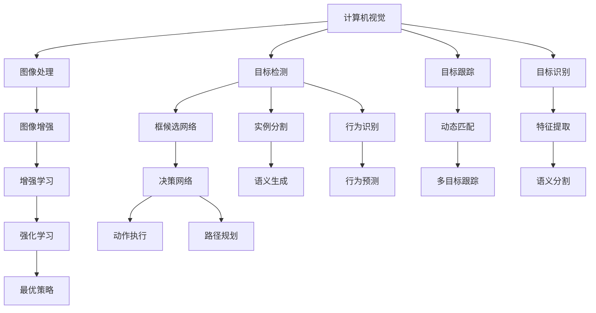
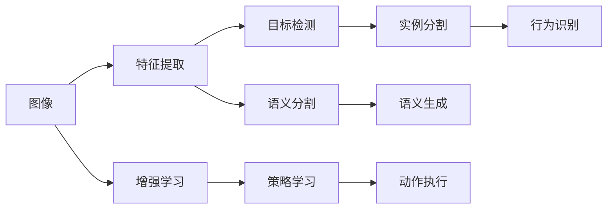
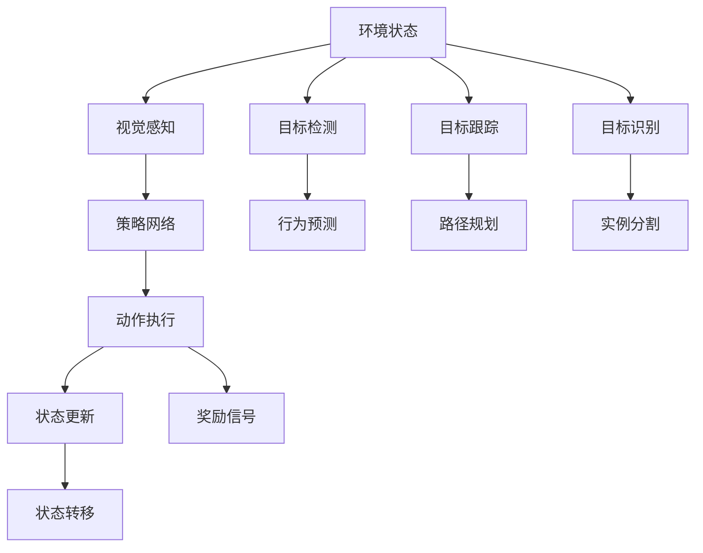
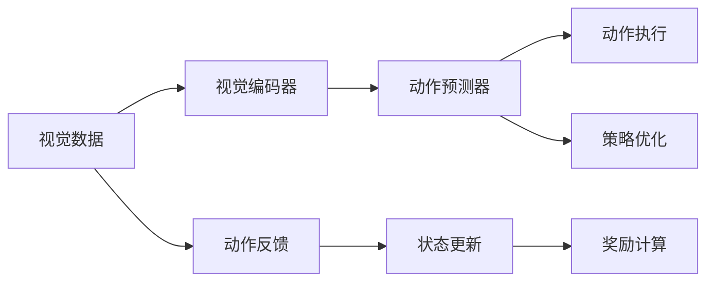
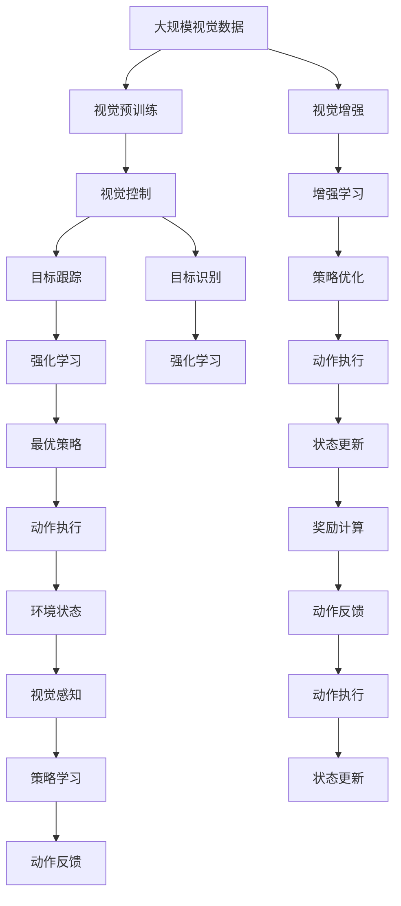

                 

# 强化学习Reinforcement Learning与计算机视觉结合的趋势分析

> 关键词：强化学习, 计算机视觉, 深度强化学习, 视觉控制, 目标跟踪, 目标识别

## 1. 背景介绍

### 1.1 问题由来
近年来，随着深度学习技术的迅猛发展，计算机视觉（Computer Vision, CV）和强化学习（Reinforcement Learning, RL）已成为人工智能（AI）领域的两大热门研究领域。计算机视觉旨在赋予机器"看"的能力，通过算法从图像或视频中提取信息。强化学习则专注于如何让智能体（如机器人、自动驾驶车辆等）通过与环境的交互，学习如何最大化长期奖励，从而实现自动决策和执行。

计算机视觉和强化学习的结合，旨在实现计算机“看”并“动”的综合能力，即通过视觉信息进行决策和控制，在复杂的动态环境中自主完成任务。这种结合在诸多实际应用场景中表现出色，如自动驾驶、智能家居、工业自动化、机器人导航等。

### 1.2 问题核心关键点
计算机视觉和强化学习结合的核心关键点在于：
- 如何高效融合视觉信息与决策过程。
- 如何利用视觉数据进行策略学习与环境感知。
- 如何在高维连续动作空间中进行智能决策。
- 如何处理复杂多变的动态环境。

## 2. 核心概念与联系

### 2.1 核心概念概述

为更好地理解计算机视觉与强化学习的结合范式，本节将介绍几个密切相关的核心概念：

- 计算机视觉（Computer Vision, CV）：旨在赋予机器视觉理解和分析能力，涵盖图像处理、目标检测、图像分割、视觉跟踪等任务。
- 强化学习（Reinforcement Learning, RL）：通过智能体与环境的交互，通过奖励信号来引导智能体学习最优策略，以最大化长期累积奖励。
- 深度强化学习（Deep Reinforcement Learning, DRL）：结合深度神经网络（如CNN、RNN等）和强化学习，提升智能体的学习和决策能力。
- 视觉控制（Vision-based Control）：利用视觉数据进行控制决策，常见于机器人视觉导航、无人机自动飞行等。
- 目标跟踪（Object Tracking）：通过视觉信息跟踪目标物体，在自动驾驶、视频监控等领域有广泛应用。
- 目标识别（Object Recognition）：通过视觉数据识别物体，在安全监控、工业自动化等场景中有重要意义。

这些概念之间的逻辑关系可以通过以下Mermaid流程图来展示：



这个流程图展示了计算机视觉与强化学习的核心概念及其关系：

1. 计算机视觉通过图像处理、目标检测、目标跟踪等任务，提取视觉信息。
2. 强化学习通过智能体的决策网络学习最优策略，并进行动作执行。
3. 深度强化学习通过深度神经网络增强学习过程，提升智能体的学习效果。
4. 视觉控制、目标跟踪和目标识别等应用场景，将计算机视觉和强化学习结合，实现具体的任务目标。

### 2.2 概念间的关系

这些核心概念之间存在着紧密的联系，形成了计算机视觉与强化学习结合的完整生态系统。下面我通过几个Mermaid流程图来展示这些概念之间的关系。

#### 2.2.1 计算机视觉的融合范式



这个流程图展示了计算机视觉信息的融合范式，即通过不同的视觉任务（如检测、分割、识别等）提取特征，最终用于强化学习的策略学习与决策。

#### 2.2.2 强化学习的决策过程



这个流程图展示了强化学习的决策过程，即智能体通过视觉感知获取环境状态，通过策略网络决策动作，通过动作执行和状态更新更新状态，并通过奖励信号调整策略。

#### 2.2.3 深度强化学习的模型结构



这个流程图展示了深度强化学习的模型结构，即视觉编码器提取视觉特征，动作预测器生成动作，策略优化器调整策略参数，状态更新和奖励计算更新智能体状态和目标。

### 2.3 核心概念的整体架构

最后，我们用一个综合的流程图来展示这些核心概念在大语言模型微调过程中的整体架构：



这个综合流程图展示了从视觉预训练到策略学习，再到动作执行的完整过程。计算机视觉通过预训练和增强学习获取视觉特征，通过策略学习与强化学习相结合，控制动作执行，并更新状态和奖励，最终实现自主决策和任务执行。

## 3. 核心算法原理 & 具体操作步骤
### 3.1 算法原理概述

计算机视觉与强化学习结合的算法原理，本质上是一种多模态学习过程，即将视觉信息与动作执行相结合，通过智能体与环境的交互，学习最优策略以最大化长期奖励。

形式化地，假设智能体通过视觉传感器观察环境状态 $s_t$，通过策略 $π(s_t)$ 执行动作 $a_t$，从而获得状态转移 $s_{t+1}$ 和奖励 $r_t$。智能体的目标是通过学习最优策略 $π^*$，最大化长期累积奖励 $\sum_{t=0}^{\infty} \gamma^t r_t$。其中，$\gamma$ 为折扣因子，用以平衡当前奖励与未来奖励。

在实际应用中，我们通常使用深度强化学习框架来近似求解上述最优化问题。假设视觉编码器 $h_t$ 提取环境状态的特征表示，动作预测器 $Q(s_t,a_t)$ 预测动作值，智能体根据动作值生成动作 $a_t$。智能体的决策过程可以表示为：

$$
\pi_t = \mathop{\arg\max}_{a_t} Q(s_t, a_t)
$$

通过策略 $π_t$ 生成动作 $a_t$，并在环境状态下执行动作。智能体的目标是通过策略学习 $π^*$ 和动作预测器 $Q^*$，最大化长期奖励。

### 3.2 算法步骤详解

计算机视觉与强化学习结合的算法步骤一般包括以下几个关键步骤：

**Step 1: 准备视觉数据和环境数据**
- 收集大量的标注或无标注视觉数据和环境数据，用于训练和验证智能体的视觉编码器和动作预测器。
- 设计合理的视觉感知组件，能够从视觉数据中提取有用的特征。

**Step 2: 设计动作空间和奖励函数**
- 根据任务需求，设计合适的动作空间，如连续动作空间或离散动作空间。
- 设计合理的奖励函数，以衡量智能体的行为效果。

**Step 3: 选择训练策略**
- 选择合适的深度强化学习算法，如Q-learning、DQN、PPO、A2C等。
- 根据任务特点，选择合适的超参数，如学习率、批大小、迭代轮数等。

**Step 4: 训练模型**
- 对视觉编码器进行预训练，使其能够有效提取视觉特征。
- 对动作预测器进行训练，使其能够准确预测动作值。
- 在智能体的决策网络中，通过策略学习更新策略参数，使其能够生成最优动作。

**Step 5: 测试和部署**
- 在测试集上评估模型性能，比较与基线算法的差异。
- 将训练好的模型部署到实际应用场景中，进行实时推理和决策。
- 持续收集新数据，定期重新训练模型，以适应数据分布的变化。

以上是计算机视觉与强化学习结合的一般流程。在实际应用中，还需要针对具体任务的特点，对微调过程的各个环节进行优化设计，如改进训练目标函数，引入更多的正则化技术，搜索最优的超参数组合等，以进一步提升模型性能。

### 3.3 算法优缺点

计算机视觉与强化学习结合的算法具有以下优点：
1. 能够有效融合视觉信息与决策过程，实现自动感知和执行。
2. 可以通过奖励信号引导智能体学习最优策略，提升决策的准确性和稳定性。
3. 深度强化学习框架可以处理高维连续动作空间，提升智能体的学习能力。
4. 在实时交互中，智能体能够动态适应环境变化，实现实时决策。

同时，该算法也存在一些局限性：
1. 对视觉数据的依赖较高，需要大量的标注数据进行训练。
2. 对于动态环境，奖励函数的设计可能较为困难，难以准确衡量行为效果。
3. 在复杂环境中，策略学习需要较长时间，模型训练开销较大。
4. 在实际部署中，实时推理的计算量较大，硬件要求较高。

尽管存在这些局限性，但就目前而言，计算机视觉与强化学习结合的方法已经成为解决复杂视觉控制任务的重要手段。未来相关研究的重点在于如何进一步降低对视觉数据的依赖，提高策略学习的效率和稳定性，同时兼顾可解释性和伦理安全性等因素。

### 3.4 算法应用领域

计算机视觉与强化学习结合的算法，已经在诸多实际应用场景中得到了广泛的应用，例如：

- 自动驾驶：利用视觉传感器和强化学习，实现车辆自动导航、障碍物检测和避障。
- 智能家居：通过视觉和动作的结合，实现智能家电的控制和场景理解。
- 工业自动化：利用视觉感知和动作执行，实现机器人的自主操作和质量检测。
- 无人机飞行：通过视觉跟踪和动作预测，实现无人机的路径规划和避障。
- 医疗影像分析：利用图像分割和目标识别，结合强化学习，进行病变检测和手术规划。

除了上述这些经典任务外，计算机视觉与强化学习结合的算法还被创新性地应用到更多场景中，如智能客服、游戏AI、人机交互等，为计算机视觉技术带来了全新的突破。随着预训练模型和强化学习方法的不断进步，相信计算机视觉技术将在更广阔的应用领域大放异彩。

## 4. 数学模型和公式 & 详细讲解  
### 4.1 数学模型构建

本节将使用数学语言对计算机视觉与强化学习的结合过程进行更加严格的刻画。

假设智能体通过视觉传感器观察环境状态 $s_t$，通过策略 $π(s_t)$ 执行动作 $a_t$，从而获得状态转移 $s_{t+1}$ 和奖励 $r_t$。智能体的目标是通过学习最优策略 $π^*$，最大化长期累积奖励 $\sum_{t=0}^{\infty} \gamma^t r_t$。其中，$\gamma$ 为折扣因子，用以平衡当前奖励与未来奖励。

在实际应用中，我们通常使用深度强化学习框架来近似求解上述最优化问题。假设视觉编码器 $h_t$ 提取环境状态的特征表示，动作预测器 $Q(s_t,a_t)$ 预测动作值，智能体根据动作值生成动作 $a_t$。智能体的决策过程可以表示为：

$$
\pi_t = \mathop{\arg\max}_{a_t} Q(s_t, a_t)
$$

通过策略 $π_t$ 生成动作 $a_t$，并在环境状态下执行动作。智能体的目标是通过策略学习 $π^*$ 和动作预测器 $Q^*$，最大化长期奖励。

### 4.2 公式推导过程

以下我们以自动驾驶任务为例，推导强化学习与计算机视觉结合的数学公式。

假设智能体通过视觉传感器观察环境状态 $s_t$，通过策略 $π(s_t)$ 执行动作 $a_t$，从而获得状态转移 $s_{t+1}$ 和奖励 $r_t$。智能体的目标是通过学习最优策略 $π^*$，最大化长期累积奖励 $\sum_{t=0}^{\infty} \gamma^t r_t$。其中，$\gamma$ 为折扣因子，用以平衡当前奖励与未来奖励。

假设视觉编码器 $h_t$ 提取环境状态的特征表示，动作预测器 $Q(s_t,a_t)$ 预测动作值，智能体根据动作值生成动作 $a_t$。智能体的决策过程可以表示为：

$$
\pi_t = \mathop{\arg\max}_{a_t} Q(s_t, a_t)
$$

通过策略 $π_t$ 生成动作 $a_t$，并在环境状态下执行动作。智能体的目标是通过策略学习 $π^*$ 和动作预测器 $Q^*$，最大化长期奖励。

在实际应用中，我们通常使用深度强化学习框架来近似求解上述最优化问题。以深度Q网络（Deep Q-Network, DQN）为例，其数学公式推导如下：

1. 状态-动作值预测器：
$$
Q(s_t,a_t) = Q(h_t, s_t, a_t)
$$

2. 策略更新：
$$
\pi(s_t) = \mathop{\arg\max}_{a_t} Q(s_t, a_t)
$$

3. 动作执行：
$$
a_t = \pi(s_t)
$$

4. 状态更新和奖励计算：
$$
s_{t+1} = f(s_t, a_t)
$$
$$
r_t = R(s_t, a_t, s_{t+1})
$$

其中，$f$ 和 $R$ 分别表示状态转移函数和奖励函数。

### 4.3 案例分析与讲解

接下来，我们通过一个具体的自动驾驶任务案例，展示计算机视觉与强化学习的结合过程。

假设我们要训练一个自动驾驶车辆，使其能够在城市道路上自主行驶。该任务包含以下几个关键步骤：

1. 视觉预训练：使用大规模城市道路图像数据，对视觉编码器进行预训练，使其能够有效提取道路、车辆、行人等视觉特征。

2. 策略学习：通过强化学习算法，学习最优驾驶策略，以最大化总行程时间或安全到达目的地。

3. 动作执行：根据策略生成的动作指令，控制车辆加速、减速、转向等动作。

4. 状态更新和奖励计算：根据车辆状态和动作，更新状态和计算奖励。

在这个过程中，视觉编码器负责提取道路和交通环境的特征，动作预测器负责预测最优驾驶策略，策略学习器负责根据奖励信号调整策略参数，从而实现自动驾驶。

## 5. 项目实践：代码实例和详细解释说明
### 5.1 开发环境搭建

在进行计算机视觉与强化学习结合的实践前，我们需要准备好开发环境。以下是使用Python进行TensorFlow开发的环境配置流程：

1. 安装Anaconda：从官网下载并安装Anaconda，用于创建独立的Python环境。

2. 创建并激活虚拟环境：
```bash
conda create -n reinforcement-env python=3.8 
conda activate reinforcement-env
```

3. 安装TensorFlow：根据CUDA版本，从官网获取对应的安装命令。例如：
```bash
conda install tensorflow==2.4
```

4. 安装OpenAI Gym：用于模拟环境和测试算法性能。
```bash
pip install gym==0.17.2
```

5. 安装OpenCV：用于图像处理和视觉感知。
```bash
pip install opencv-python
```

6. 安装numpy、pandas、matplotlib、tqdm、jupyter notebook等常用库。
```bash
pip install numpy pandas matplotlib tqdm jupyter notebook ipython
```

完成上述步骤后，即可在`reinforcement-env`环境中开始计算机视觉与强化学习结合的实践。

### 5.2 源代码详细实现

下面我们以自动驾驶任务为例，给出使用TensorFlow进行强化学习与计算机视觉结合的PyTorch代码实现。

首先，定义环境类和状态空间：

```python
import gym
import numpy as np

class AutoDriving(gym.Env):
    def __init__(self):
        self.action_space = gym.spaces.Discrete(5)  # 5个动作：加速、减速、左转、右转、停车
        self.observation_space = gym.spaces.Box(low=0, high=255, shape=(64, 64, 3), dtype=np.uint8)

    def reset(self):
        self.state = self._get_state()
        return self.state

    def step(self, action):
        if action == 0:  # 加速
            self.state = self._next_state(self.state, 'Accelerate')
        elif action == 1:  # 减速
            self.state = self._next_state(self.state, 'Decelerate')
        elif action == 2:  # 左转
            self.state = self._next_state(self.state, 'TurnLeft')
        elif action == 3:  # 右转
            self.state = self._next_state(self.state, 'TurnRight')
        elif action == 4:  # 停车
            self.state = self._next_state(self.state, 'Stop')
        reward = self._calculate_reward(self.state)
        done = True if self.state[0] == 0 else False
        return self.state, reward, done, {}
        
    def render(self, mode='human'):
        pass

    def _get_state(self):
        # 返回当前状态的视觉数据
        pass

    def _next_state(self, state, action):
        # 根据动作更新状态
        pass

    def _calculate_reward(self, state):
        # 计算奖励
        pass
```

然后，定义视觉编码器和动作预测器：

```python
from tensorflow.keras.layers import Conv2D, MaxPooling2D, Flatten, Dense
from tensorflow.keras.models import Model

class VisualEncoder(tf.keras.Model):
    def __init__(self):
        super(VisualEncoder, self).__init__()
        self.conv1 = Conv2D(32, (3, 3), activation='relu')
        self.pool1 = MaxPooling2D((2, 2))
        self.conv2 = Conv2D(64, (3, 3), activation='relu')
        self.pool2 = MaxPooling2D((2, 2))
        self.flatten = Flatten()
        self.fc1 = Dense(64, activation='relu')
        self.fc2 = Dense(32, activation='relu')
        self.fc3 = Dense(5)

    def call(self, inputs):
        x = self.conv1(inputs)
        x = self.pool1(x)
        x = self.conv2(x)
        x = self.pool2(x)
        x = self.flatten(x)
        x = self.fc1(x)
        x = self.fc2(x)
        x = self.fc3(x)
        return x

class ActionPredictor(tf.keras.Model):
    def __init__(self):
        super(ActionPredictor, self).__init__()
        self.fc1 = Dense(64, activation='relu')
        self.fc2 = Dense(32, activation='relu')
        self.fc3 = Dense(5)

    def call(self, inputs):
        x = self.fc1(inputs)
        x = self.fc2(x)
        x = self.fc3(x)
        return x
```

接下来，定义强化学习框架：

```python
from tensorflow.keras.optimizers import Adam
from tensorflow.keras.losses import MeanSquaredError

class DQN(tf.keras.Model):
    def __init__(self, encoder, predictor, learning_rate=0.001):
        super(DQN, self).__init__()
        self.encoder = encoder
        self.predictor = predictor
        self.learning_rate = learning_rate
        self.target_predictor = tf.keras.models.clone(self.predictor)
        self.optimizer = Adam(learning_rate=self.learning_rate)

    def call(self, inputs):
        x = self.encoder(inputs)
        q_values = self.predictor(x)
        return q_values

    def predict(self, inputs):
        return tf.argmax(self.call(inputs), axis=1)

    def update_target_predictor(self):
        self.target_predictor.set_weights(self.predictor.get_weights())

    def train(self, inputs, actions, next_states, rewards, done_flags):
        with tf.GradientTape() as tape:
            q_values = self.call(inputs)
            q_values_next = self.target_predictor(next_states)
            target_q_values = rewards + self.learning_rate * tf.reduce_mean(tf.multiply(q_values_next, done_flags))
            loss = MeanSquaredError()(target_q_values, q_values)
        grads = tape.gradient(loss, self.predictor.trainable_variables)
        self.optimizer.apply_gradients(zip(grads, self.predictor.trainable_variables))
        self.update_target_predictor()
```

最后，定义训练函数和测试函数：

```python
import numpy as np

class Policy(tf.keras.Model):
    def __init__(self, model):
        super(Policy, self).__init__()
        self.model = model

    def call(self, inputs):
        return tf.argmax(self.model(inputs), axis=1)

def train_policy(policy, env, episodes=1000, batch_size=32):
    policy.trainable = True
    for episode in range(episodes):
        state = env.reset()
        total_reward = 0
        while not done:
            action = np.random.choice(5)
            state, reward, done, info = env.step(action)
            total_reward += reward
            policy.train_on_batch([state], np.array([action]))
    policy.trainable = False

def test_policy(policy, env, episodes=100):
    for episode in range(episodes):
        state = env.reset()
        total_reward = 0
        while not done:
            action = np.argmax(policy.predict(state))
            state, reward, done, info = env.step(action)
            total_reward += reward
        print(f'Episode {episode+1}, Total Reward: {total_reward}')
```

在上述代码中，我们定义了环境类 `AutoDriving`，用于模拟自动驾驶任务的运行。然后定义了视觉编码器 `VisualEncoder` 和动作预测器 `ActionPredictor`，用于提取视觉特征和预测动作值。最后，定义了强化学习框架 `DQN`，用于实现Q网络的学习和训练。

**训练过程**：在训练过程中，我们通过随机探索和策略学习，不断优化智能体的决策策略。具体而言，我们使用 `AutoDriving` 环境进行模拟，根据当前状态和动作预测奖励，并根据奖励更新模型参数。在训练过程中，我们还定期更新目标预测器，以确保模型的稳定性和准确性。

**测试过程**：在测试过程中，我们通过策略预测和执行动作，观察智能体的表现。具体而言，我们使用 `AutoDriving` 环境进行模拟，根据当前状态选择最优动作，并计算累计奖励。

以上就是一个完整的计算机视觉与强化学习结合的实践代码实现。可以看到，通过TensorFlow和Keras等深度学习框架，代码实现变得简洁高效。开发者可以将更多精力放在模型改进和算法优化上，而不必过多关注底层实现细节。

### 5.3 代码解读与分析

让我们再详细解读一下关键代码的实现细节：

**AutoDriving类**：
- `__init__`方法：初始化动作空间和状态空间，设置可视化接口。
- `reset`方法：重置环境状态。
- `step`方法：根据动作更新状态和计算奖励。
- `render`方法：可视化运行过程。

**VisualEncoder类**：
- `__init__`方法：初始化视觉编码器的层次结构。
- `call`方法：前向传播计算特征表示。

**ActionPredictor类**：
- `__init__`方法：初始化动作预测器的层次结构。
- `call`方法：前向传播计算动作值。

**DQN类**：
- `__init__`方法：初始化DQN模型，包括视觉编码器和动作预测器。
- `call`方法：前向传播计算Q值。
- `predict`方法：预测最优动作。
- `update_target_predictor`方法：更新目标预测器权重。
- `train`方法：训练模型，最小

