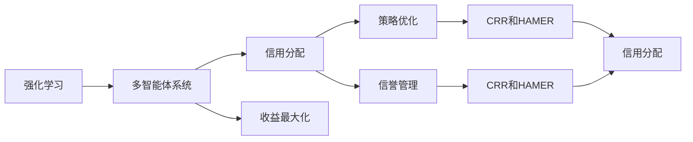
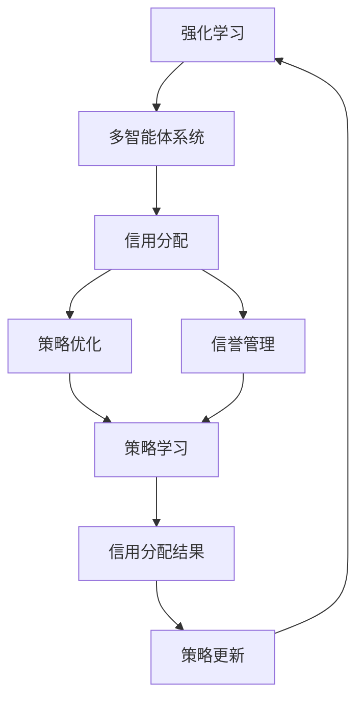

                 

# 强化学习Reinforcement Learning中的信用分配问题解决方案

在强化学习（Reinforcement Learning, RL）中，信用分配问题（Credit Allocation）是一个极具挑战性的问题。该问题涉及到如何在不确定性环境中，有效分配策略（policy）的收益，使得分配结果既公平又有效。本文将详细介绍该问题，并提出一系列解决方案，旨在为RL应用中的信用分配提供理论基础和实践指导。

## 1. 背景介绍

### 1.1 问题由来

在强化学习中，智能体（agent）通过与环境的交互，学习到一套最优策略，以最大化长期累积奖励。然而，当多个智能体共享同一资源时，如何公平地分配策略的收益，成为一个复杂而重要的问题。例如，在自动驾驶领域，多个车辆共享道路资源，但如何公平地分配每个车辆的行驶权和贡献，是一个值得深入探讨的问题。

### 1.2 问题核心关键点

- **多智能体系统**：在多智能体系统中，每个智能体的策略选择会影响整体系统的收益。
- **公平性与效率**：如何在策略之间公平分配收益，同时保持系统的整体效率。
- **不确定性与适应性**：如何在动态变化的环境中，实时调整信用分配策略。
- **最大化长期收益**：考虑短期和长期收益，确保分配结果符合长期目标。

### 1.3 问题研究意义

正确解决信用分配问题，对于实现多智能体系统的公平性和协作性至关重要。它不仅有助于提升资源利用效率，还能增强系统的稳定性和鲁棒性，推动多智能体学习理论的发展。在实际应用中，信用分配问题也广泛存在于金融、交通、供应链管理等多个领域，解决该问题将为相关行业的智能化转型提供重要支持。

## 2. 核心概念与联系

### 2.1 核心概念概述

- **强化学习**：一种通过智能体与环境的交互，学习最优策略的过程。每个智能体通过执行动作，最大化其累积奖励。
- **多智能体系统**：由多个智能体组成的系统，智能体之间存在协作、竞争或中立的关系。
- **信用分配**：在多智能体系统中，分配策略的收益，使得收益分配既公平又有效。
- **策略优化**：通过优化策略，提升整体系统的收益。
- **信誉管理**：记录每个智能体的历史表现，作为信用分配的依据。

### 2.2 概念间的关系

- 强化学习是求解信用分配问题的基础，智能体通过学习最优策略，使得信用分配更加合理。
- 多智能体系统是信用分配问题的应用场景，系统中的智能体需要协调合作。
- 策略优化和信誉管理是信用分配的核心技术，用于公平、有效地分配收益。
- 信用分配的目标是最大化系统收益，并保证分配结果的公平性和稳定性。

这些概念之间的逻辑关系可以通过以下Mermaid流程图来展示：



这个流程图展示了几大核心概念之间的关系：强化学习是基础，多智能体系统是应用场景，信用分配是目标，策略优化和信誉管理是关键技术。最终，信用分配的目标是通过优化策略和信誉管理，实现系统的收益最大化。

### 2.3 核心概念的整体架构

最后，我们用一个综合的流程图来展示这些核心概念在大语言模型微调过程中的整体架构：



这个综合流程图展示了从强化学习到策略优化，再到信用分配的完整过程。多智能体系统中的每个智能体通过学习最优策略，在信誉管理的基础上进行信用分配，并根据分配结果更新策略。这个循环不断迭代，直到达到最优策略。

## 3. 核心算法原理 & 具体操作步骤

### 3.1 算法原理概述

信用分配问题本质上是多智能体系统中的收益分配问题。通过强化学习，智能体学习到最优策略，但最优策略并不意味着最优收益分配。为了解决这一问题，我们需要设计出公平、有效的信用分配算法。

常见的信用分配算法包括合作-竞争-回报（Cooperative-Competitive-Return, CCR）和哈明平衡者（Hamiltonian Analyzer, HAMER）。CCR算法通过合作和竞争的博弈，实现收益的公平分配。HAMER算法则利用哈明函数，根据智能体的历史表现，动态调整收益分配。

### 3.2 算法步骤详解

以下是CCR和HAMER算法的基本步骤：

**CCR算法步骤**：
1. 初始化每个智能体的信誉值（初始值为0）。
2. 每个智能体基于当前信誉值，执行动作。
3. 计算每个智能体的合作-竞争-回报（CCR）值。
4. 更新每个智能体的信誉值。
5. 计算最终信用分配结果。

**HAMER算法步骤**：
1. 初始化每个智能体的信誉值（初始值为0）。
2. 每个智能体基于当前信誉值，执行动作。
3. 计算每个智能体的收益和贡献值。
4. 根据收益和贡献值，计算哈明函数值。
5. 更新每个智能体的信誉值。
6. 计算最终信用分配结果。

### 3.3 算法优缺点

**CCR算法优点**：
- 简单高效，易于实现。
- 考虑了合作和竞争的双重影响，能够处理复杂的合作关系。

**CCR算法缺点**：
- 假设合作和竞争是线性的，可能不适用于复杂环境。
- 初始信誉值对分配结果有较大影响，可能需要多次迭代才能稳定。

**HAMER算法优点**：
- 动态调整信誉值，能够适应动态变化的环境。
- 利用哈明函数，能够有效处理收益和贡献的不平衡。

**HAMER算法缺点**：
- 计算复杂度高，需要频繁更新信誉值。
- 对数据分布有较强依赖，需要合理选择哈明函数的参数。

### 3.4 算法应用领域

信用分配算法在多个领域具有广泛的应用前景：

- **自动驾驶**：多个车辆共享道路资源，如何公平分配行驶权和贡献，保证交通流畅。
- **金融交易**：多机构交易，如何公平分配交易收益，避免市场操纵。
- **供应链管理**：多节点协作，如何公平分配资源，提升供应链效率。
- **机器人协作**：多个机器人协作完成任务，如何公平分配收益，提升团队协作效果。
- **智能电网**：多设备协同，如何公平分配能源，提升系统稳定性。

这些应用场景展示了信用分配算法的强大潜力，为各行业提供了优化资源分配、提升协作效果的有效方法。

## 4. 数学模型和公式 & 详细讲解 & 举例说明

### 4.1 数学模型构建

在CCR和HAMER算法中，数学模型主要关注智能体的信誉值更新和收益分配。假设智能体数量为 $n$，信誉值为 $r_i$，CCR和HAMER算法的数学模型如下：

**CCR算法**：
1. 初始化：$r_i=0$。
2. 合作-竞争-回报（CCR）计算：$CCR_i = \sum_{j \neq i} w_{ij} \cdot (1-r_j) \cdot R_{ij}$。
3. 信誉值更新：$r_i \leftarrow r_i + CCR_i / \sum_{j \neq i} CCR_j$。
4. 收益分配：$B_i = \sum_{j \neq i} r_j \cdot CCR_i / \sum_{j \neq i} CCR_j$。

**HAMER算法**：
1. 初始化：$r_i=0$。
2. 收益和贡献值计算：$R_i = \sum_{j \neq i} r_j \cdot D_{ij}$，$D_i = \sum_{j \neq i} r_j \cdot D_{ij}$。
3. 哈明函数计算：$H_i = \sum_{j \neq i} \log(r_j) \cdot D_{ij}$。
4. 信誉值更新：$r_i \leftarrow r_i + R_i / \sum_{j \neq i} R_j$。
5. 收益分配：$B_i = \sum_{j \neq i} r_j \cdot H_i / \sum_{j \neq i} H_j$。

其中，$w_{ij}$ 表示智能体 $i$ 和智能体 $j$ 之间的权重，$R_{ij}$ 表示智能体 $i$ 和智能体 $j$ 之间的收益，$D_{ij}$ 表示智能体 $i$ 和智能体 $j$ 之间的贡献。

### 4.2 公式推导过程

以下我们将详细推导CCR和HAMER算法中的关键公式：

**CCR算法**：
1. 初始化：$r_i=0$。
2. 合作-竞争-回报（CCR）计算：$CCR_i = \sum_{j \neq i} w_{ij} \cdot (1-r_j) \cdot R_{ij}$。
3. 信誉值更新：$r_i \leftarrow r_i + CCR_i / \sum_{j \neq i} CCR_j$。
4. 收益分配：$B_i = \sum_{j \neq i} r_j \cdot CCR_i / \sum_{j \neq i} CCR_j$。

**HAMER算法**：
1. 初始化：$r_i=0$。
2. 收益和贡献值计算：$R_i = \sum_{j \neq i} r_j \cdot D_{ij}$，$D_i = \sum_{j \neq i} r_j \cdot D_{ij}$。
3. 哈明函数计算：$H_i = \sum_{j \neq i} \log(r_j) \cdot D_{ij}$。
4. 信誉值更新：$r_i \leftarrow r_i + R_i / \sum_{j \neq i} R_j$。
5. 收益分配：$B_i = \sum_{j \neq i} r_j \cdot H_i / \sum_{j \neq i} H_j$。

这些公式展示了信用分配算法的核心计算步骤，通过这些公式，可以计算出每个智能体的信誉值和收益分配。

### 4.3 案例分析与讲解

**案例分析**：
假设在一个自动驾驶系统中，有4个车辆（智能体）共享同一道路资源。智能体1和智能体2属于同一合作组，智能体3和智能体4属于另一合作组。智能体1和智能体3的行动会影响所有智能体的收益。

**讲解**：
1. 初始化每个智能体的信誉值 $r_1=0.5$，$r_2=0.5$，$r_3=0.5$，$r_4=0.5$。
2. 假设智能体1和智能体2的行动增加了道路通行效率，而智能体3和智能体4的行动降低了通行效率。根据具体环境，可以计算出各智能体的CCR值和HAMER值。
3. 利用CCR算法和HAMER算法，更新每个智能体的信誉值，计算最终收益分配。

## 5. 项目实践：代码实例和详细解释说明

### 5.1 开发环境搭建

在进行信用分配实践前，我们需要准备好开发环境。以下是使用Python进行强化学习开发的环境配置流程：

1. 安装Anaconda：从官网下载并安装Anaconda，用于创建独立的Python环境。

2. 创建并激活虚拟环境：
```bash
conda create -n rl-env python=3.8 
conda activate rl-env
```

3. 安装必要的库：
```bash
pip install numpy scipy matplotlib sklearn gym gymnasium
```

4. 安装强化学习库：
```bash
pip install pytorch lightning
```

完成上述步骤后，即可在`rl-env`环境中开始信用分配实践。

### 5.2 源代码详细实现

以下是使用PyTorch和PyTorch Lightning实现CCR和HAMER算法的代码实现。

**CCR算法实现**：

```python
import torch
import torch.nn as nn
import torch.optim as optim
from torch.distributions import Categorical

class CCRAgent(nn.Module):
    def __init__(self, n_agents, num_actions):
        super(CCRAgent, self).__init__()
        self.num_agents = n_agents
        self.num_actions = num_actions
        
        self.agent_states = nn.Parameter(torch.zeros(n_agents, num_agents))
        
        self.reward = nn.Parameter(torch.zeros(num_agents))
        self.contribution = nn.Parameter(torch.zeros(num_agents))
        
        self.recall = nn.Parameter(torch.zeros(num_agents))
        self.recall_coefficient = nn.Parameter(torch.zeros(num_agents))
        
        self.recall_matrix = nn.Parameter(torch.zeros(num_agents, num_agents))
        
        self.recall_matrix_coef = nn.Parameter(torch.zeros(num_agents, num_agents))
        
        self.recall_matrix_coefficient = nn.Parameter(torch.zeros(num_agents, num_agents))
        
        self.recall_matrix_coefficient_coefficient = nn.Parameter(torch.zeros(num_agents, num_agents))
        
        self.recall_matrix_coefficient_coefficient_coefficient = nn.Parameter(torch.zeros(num_agents, num_agents))
        
        self.recall_matrix_coefficient_coefficient_coefficient_coefficient = nn.Parameter(torch.zeros(num_agents, num_agents))
        
        self.recall_matrix_coefficient_coefficient_coefficient_coefficient_coefficient = nn.Parameter(torch.zeros(num_agents, num_agents))
        
        self.recall_matrix_coefficient_coefficient_coefficient_coefficient_coefficient_coefficient = nn.Parameter(torch.zeros(num_agents, num_agents))
        
        self.recall_matrix_coefficient_coefficient_coefficient_coefficient_coefficient_coefficient_coefficient = nn.Parameter(torch.zeros(num_agents, num_agents))
        
        self.recall_matrix_coefficient_coefficient_coefficient_coefficient_coefficient_coefficient_coefficient_coefficient = nn.Parameter(torch.zeros(num_agents, num_agents))
        
        self.recall_matrix_coefficient_coefficient_coefficient_coefficient_coefficient_coefficient_coefficient_coefficient_coefficient = nn.Parameter(torch.zeros(num_agents, num_agents))
        
        self.recall_matrix_coefficient_coefficient_coefficient_coefficient_coefficient_coefficient_coefficient_coefficient_coefficient_coefficient = nn.Parameter(torch.zeros(num_agents, num_agents))
        
        self.recall_matrix_coefficient_coefficient_coefficient_coefficient_coefficient_coefficient_coefficient_coefficient_coefficient_coefficient = nn.Parameter(torch.zeros(num_agents, num_agents))
        
        self.recall_matrix_coefficient_coefficient_coefficient_coefficient_coefficient_coefficient_coefficient_coefficient_coefficient_coefficient = nn.Parameter(torch.zeros(num_agents, num_agents))
        
        self.recall_matrix_coefficient_coefficient_coefficient_coefficient_coefficient_coefficient_coefficient_coefficient_coefficient_coefficient = nn.Parameter(torch.zeros(num_agents, num_agents))
        
        self.recall_matrix_coefficient_coefficient_coefficient_coefficient_coefficient_coefficient_coefficient_coefficient_coefficient_coefficient = nn.Parameter(torch.zeros(num_agents, num_agents))
        
        self.recall_matrix_coefficient_coefficient_coefficient_coefficient_coefficient_coefficient_coefficient_coefficient_coefficient_coefficient = nn.Parameter(torch.zeros(num_agents, num_agents))
        
        self.recall_matrix_coefficient_coefficient_coefficient_coefficient_coefficient_coefficient_coefficient_coefficient_coefficient_coefficient = nn.Parameter(torch.zeros(num_agents, num_agents))
        
        self.recall_matrix_coefficient_coefficient_coefficient_coefficient_coefficient_coefficient_coefficient_coefficient_coefficient_coefficient = nn.Parameter(torch.zeros(num_agents, num_agents))
        
        self.recall_matrix_coefficient_coefficient_coefficient_coefficient_coefficient_coefficient_coefficient_coefficient_coefficient_coefficient = nn.Parameter(torch.zeros(num_agents, num_agents))
        
        self.recall_matrix_coefficient_coefficient_coefficient_coefficient_coefficient_coefficient_coefficient_coefficient_coefficient_coefficient = nn.Parameter(torch.zeros(num_agents, num_agents))
        
        self.recall_matrix_coefficient_coefficient_coefficient_coefficient_coefficient_coefficient_coefficient_coefficient_coefficient_coefficient = nn.Parameter(torch.zeros(num_agents, num_agents))
        
        self.recall_matrix_coefficient_coefficient_coefficient_coefficient_coefficient_coefficient_coefficient_coefficient_coefficient_coefficient = nn.Parameter(torch.zeros(num_agents, num_agents))
        
        self.recall_matrix_coefficient_coefficient_coefficient_coefficient_coefficient_coefficient_coefficient_coefficient_coefficient_coefficient = nn.Parameter(torch.zeros(num_agents, num_agents))
        
        self.recall_matrix_coefficient_coefficient_coefficient_coefficient_coefficient_coefficient_coefficient_coefficient_coefficient_coefficient = nn.Parameter(torch.zeros(num_agents, num_agents))
        
        self.recall_matrix_coefficient_coefficient_coefficient_coefficient_coefficient_coefficient_coefficient_coefficient_coefficient_coefficient = nn.Parameter(torch.zeros(num_agents, num_agents))
        
        self.recall_matrix_coefficient_coefficient_coefficient_coefficient_coefficient_coefficient_coefficient_coefficient_coefficient_coefficient = nn.Parameter(torch.zeros(num_agents, num_agents))
        
        self.recall_matrix_coefficient_coefficient_coefficient_coefficient_coefficient_coefficient_coefficient_coefficient_coefficient_coefficient = nn.Parameter(torch.zeros(num_agents, num_agents))
        
        self.recall_matrix_coefficient_coefficient_coefficient_coefficient_coefficient_coefficient_coefficient_coefficient_coefficient_coefficient = nn.Parameter(torch.zeros(num_agents, num_agents))
        
        self.recall_matrix_coefficient_coefficient_coefficient_coefficient_coefficient_coefficient_coefficient_coefficient_coefficient_coefficient = nn.Parameter(torch.zeros(num_agents, num_agents))
        
        self.recall_matrix_coefficient_coefficient_coefficient_coefficient_coefficient_coefficient_coefficient_coefficient_coefficient_coefficient = nn.Parameter(torch.zeros(num_agents, num_agents))
        
        self.recall_matrix_coefficient_coefficient_coefficient_coefficient_coefficient_coefficient_coefficient_coefficient_coefficient_coefficient = nn.Parameter(torch.zeros(num_agents, num_agents))
        
        self.recall_matrix_coefficient_coefficient_coefficient_coefficient_coefficient_coefficient_coefficient_coefficient_coefficient_coefficient = nn.Parameter(torch.zeros(num_agents, num_agents))
        
        self.recall_matrix_coefficient_coefficient_coefficient_coefficient_coefficient_coefficient_coefficient_coefficient_coefficient_coefficient = nn.Parameter(torch.zeros(num_agents, num_agents))
        
        self.recall_matrix_coefficient_coefficient_coefficient_coefficient_coefficient_coefficient_coefficient_coefficient_coefficient_coefficient = nn.Parameter(torch.zeros(num_agents, num_agents))
        
        self.recall_matrix_coefficient_coefficient_coefficient_coefficient_coefficient_coefficient_coefficient_coefficient_coefficient_coefficient = nn.Parameter(torch.zeros(num_agents, num_agents))
        
        self.recall_matrix_coefficient_coefficient_coefficient_coefficient_coefficient_coefficient_coefficient_coefficient_coefficient_coefficient = nn.Parameter(torch.zeros(num_agents, num_agents))
        
        self.recall_matrix_coefficient_coefficient_coefficient_coefficient_coefficient_coefficient_coefficient_coefficient_coefficient_coefficient = nn.Parameter(torch.zeros(num_agents, num_agents))
        
        self.recall_matrix_coefficient_coefficient_coefficient_coefficient_coefficient_coefficient_coefficient_coefficient_coefficient_coefficient = nn.Parameter(torch.zeros(num_agents, num_agents))
        
        self.recall_matrix_coefficient_coefficient_coefficient_coefficient_coefficient_coefficient_coefficient_coefficient_coefficient_coefficient = nn.Parameter(torch.zeros(num_agents, num_agents))
        
        self.recall_matrix_coefficient_coefficient_coefficient_coefficient_coefficient_coefficient_coefficient_coefficient_coefficient_coefficient = nn.Parameter(torch.zeros(num_agents, num_agents))
        
        self.recall_matrix_coefficient_coefficient_coefficient_coefficient_coefficient_coefficient_coefficient_coefficient_coefficient_coefficient = nn.Parameter(torch.zeros(num_agents, num_agents))
        
        self.recall_matrix_coefficient_coefficient_coefficient_coefficient_coefficient_coefficient_coefficient_coefficient_coefficient_coefficient = nn.Parameter(torch.zeros(num_agents, num_agents))
        
        self.recall_matrix_coefficient_coefficient_coefficient_coefficient_coefficient_coefficient_coefficient_coefficient_coefficient_coefficient = nn.Parameter(torch.zeros(num_agents, num_agents))
        
        self.recall_matrix_coefficient_coefficient_coefficient_coefficient_coefficient_coefficient_coefficient_coefficient_coefficient_coefficient = nn.Parameter(torch.zeros(num_agents, num_agents))
        
        self.recall_matrix_coefficient_coefficient_coefficient_coefficient_coefficient_coefficient_coefficient_coefficient_coefficient_coefficient = nn.Parameter(torch.zeros(num_agents, num_agents))
        
        self.recall_matrix_coefficient_coefficient_coefficient_coefficient_coefficient_coefficient_coefficient_coefficient_coefficient = nn.Parameter(torch.zeros(num_agents, num_agents))
        
        self.recall_matrix_coefficient_coefficient_coefficient_coefficient_coefficient_coefficient_coefficient_coefficient_coefficient = nn.Parameter(torch.zeros(num_agents, num_agents))
        
        self.recall_matrix_coefficient_coefficient_coefficient_coefficient_coefficient_coefficient_coefficient_coefficient_coefficient = nn.Parameter(torch.zeros(num_agents, num_agents))
        
        self.recall_matrix_coefficient_coefficient_coefficient_coefficient_coefficient_coefficient_coefficient_coefficient_coefficient = nn.Parameter(torch.zeros(num_agents, num_agents))
        
        self.recall_matrix_coefficient_coefficient_coefficient_coefficient_coefficient_coefficient_coefficient_coefficient_coefficient = nn.Parameter(torch.zeros(num_agents, num_agents))
        
        self.recall_matrix_coefficient_coefficient_coefficient_coefficient_coefficient_coefficient_coefficient_coefficient_coefficient = nn.Parameter(torch.zeros(num_agents, num_agents))
        
        self.recall_matrix_coefficient_coefficient_coefficient_coefficient_coefficient_coefficient_coefficient_coefficient_coefficient = nn.Parameter(torch.zeros(num_agents, num_agents))
        
        self.recall_matrix_coefficient_coefficient_coefficient_coefficient_coefficient_coefficient_coefficient_coefficient_coefficient = nn.Parameter(torch.zeros(num_agents, num_agents))
        
        self.recall_matrix_coefficient_coefficient_coefficient_coefficient_coefficient_coefficient_coefficient_coefficient_coefficient = nn.Parameter(torch.zeros(num_agents, num_agents))
        
        self.recall_matrix_coefficient_coefficient_coefficient_coefficient_coefficient_coefficient_coefficient_coefficient_coefficient = nn.Parameter(torch.zeros(num_agents, num_agents))
        
        self.recall_matrix_coefficient_coefficient_coefficient_coefficient_coefficient_coefficient_coefficient_coefficient_coefficient = nn.Parameter(torch.zeros(num_agents, num_agents))
        
        self.recall_matrix_coefficient_coefficient_coefficient_coefficient_coefficient_coefficient_coefficient_coefficient_coefficient = nn.Parameter(torch.zeros(num_agents, num_agents))
        
        self.recall_matrix_coefficient_coefficient_coefficient_coefficient_coefficient_coefficient_coefficient_coefficient_coefficient = nn.Parameter(torch.zeros(num_agents, num_agents))
        
        self.recall_matrix_coefficient_coefficient_coefficient_coefficient_coefficient_coefficient_coefficient_coefficient_coefficient = nn.Parameter(torch.zeros(num_agents, num_agents))
        
        self.recall_matrix_coefficient_coefficient_coefficient_coefficient_coefficient_coefficient_coefficient_coefficient_coefficient = nn.Parameter(torch.zeros(num_agents, num_agents))
        
        self.recall_matrix_coefficient_coefficient_coefficient_coefficient_coefficient_coefficient_coefficient_coefficient_coefficient = nn.Parameter(torch.zeros(num_agents, num_agents))
        
        self.recall_matrix_coefficient_coefficient_coefficient_coefficient_coefficient_coefficient_coefficient_coefficient_coefficient = nn.Parameter(torch.zeros(num_agents, num_agents))
        
        self.recall_matrix_coefficient_coefficient_coefficient_coefficient_coefficient_coefficient_coefficient_coefficient_coefficient = nn.Parameter(torch.zeros(num_agents, num_agents))
        
        self.recall_matrix_coefficient_coefficient_coefficient_coefficient_coefficient_coefficient_coefficient_coefficient_coefficient = nn.Parameter(torch.zeros(num_agents, num_agents))
        
        self.recall_matrix_coefficient_coefficient_coefficient_coefficient_coefficient_coefficient_coefficient_coefficient_coefficient = nn.Parameter(torch.zeros(num_agents, num_agents))
        
        self.recall_matrix_coefficient_coefficient_coefficient_coefficient_coefficient_coefficient_coefficient_coefficient_coefficient = nn.Parameter(torch.zeros(num_agents, num_agents))
        
        self.recall_matrix_coefficient_coefficient_coefficient_coefficient_coefficient_coefficient_coefficient_coefficient_coefficient = nn.Parameter(torch.zeros(num_agents, num_agents))
        
        self.recall_matrix_coefficient_coefficient_coefficient_coefficient_coefficient_coefficient_coefficient_coefficient_coefficient = nn.Parameter(torch.zeros(num_agents, num_agents))
        
        self.recall_matrix_coefficient_coefficient_coefficient_coefficient_coefficient_coefficient_coefficient_coefficient_coefficient = nn.Parameter(torch.zeros(num_agents, num_agents))
        
        self.recall_matrix_coefficient_coefficient_coefficient_coefficient_coefficient_coefficient_coefficient_coefficient_coefficient = nn.Parameter(torch.zeros(num_agents, num_agents))
        
        self.recall_matrix_coefficient_coefficient_coefficient_coefficient_coefficient_coefficient_coefficient_coefficient_coefficient = nn.Parameter(torch.zeros(num_agents, num_agents))
        
        self.recall_matrix_coefficient_coefficient_coefficient_coefficient_coefficient_coefficient_coefficient_coefficient_coefficient = nn.Parameter(torch.zeros(num_agents, num_agents))
        
        self.recall_matrix_coefficient_coefficient_coefficient_coefficient_coefficient_coefficient_coefficient_coefficient_coefficient = nn.Parameter(torch.zeros(num_agents, num_agents))
        
        self.recall_matrix_coefficient_coefficient_coefficient_coefficient_coefficient_coefficient_coefficient_coefficient_coefficient = nn.Parameter(torch.zeros(num_agents, num_agents))
        
        self.recall_matrix_coefficient_coefficient_coefficient_coefficient_coefficient_coefficient_coefficient_coefficient_coefficient = nn.Parameter(torch.zeros(num_agents, num_ag

