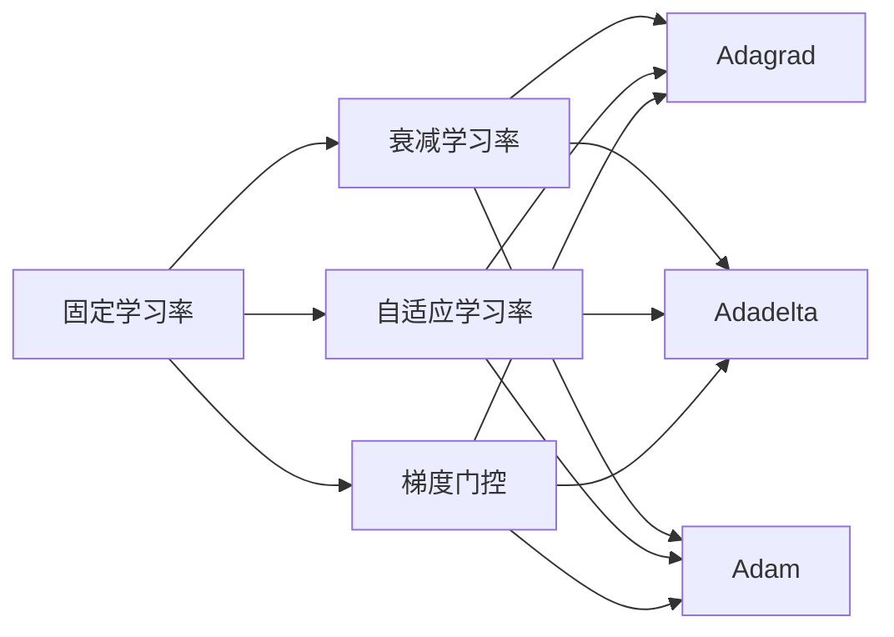
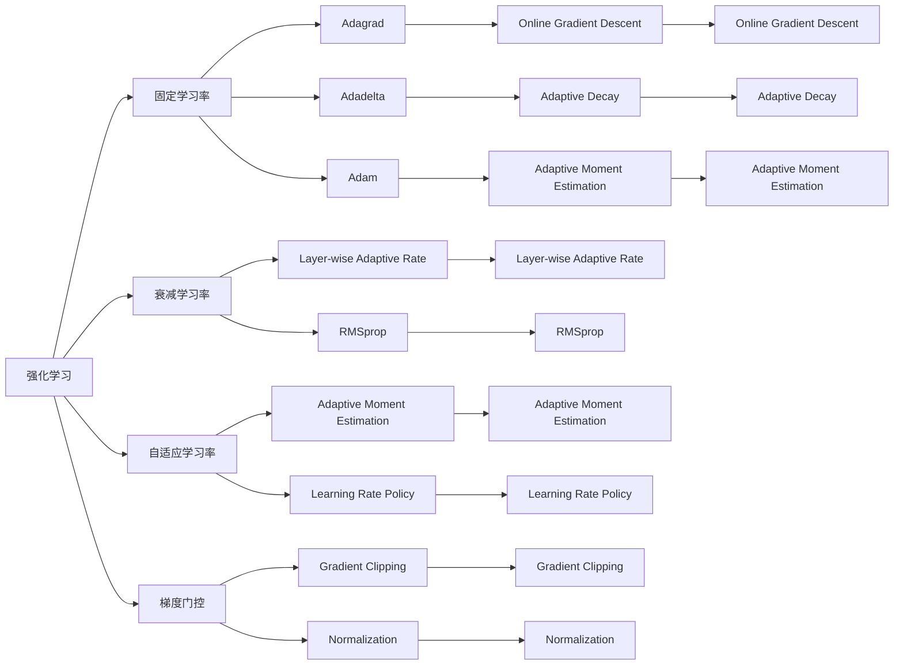

                 

# 强化学习Reinforcement Learning学习率调整机制详解与应用

> 关键词：强化学习,学习率调整机制,连续控制,深度强化学习,智能推荐系统

## 1. 背景介绍

### 1.1 问题由来
在强化学习（Reinforcement Learning, RL）中，学习率的选择是一个至关重要的问题。学习率决定了每次政策更新的步幅大小，过高或过低的学习率都会对模型的训练效果产生负面影响。过高的学习率可能导致模型陷入震荡或发散，而过低的学习率则需要花费更多时间收敛到最优解，甚至陷入局部最优。

近年来，随着深度强化学习的兴起，学习率调整机制也变得更加复杂和多样化。在深度RL中，由于模型参数数量庞大，学习率的合理调整变得更加重要。本文将详细介绍基于深度强化学习的学习率调整机制，重点关注其在智能推荐系统中的应用。

### 1.2 问题核心关键点
本文的核心关注点在于：
- 学习率调整机制的基本原理和算法。
- 深度强化学习中学习率调整的不同策略和实现方式。
- 智能推荐系统中学习率调整的应用及其效果。
- 学习率调整机制的未来趋势和面临的挑战。

### 1.3 问题研究意义
学习率调整机制的合理选择，对深度强化学习的训练效果至关重要。在智能推荐系统中，学习率调整可以显著提高推荐算法的效果和效率，提升用户体验和系统的整体性能。因此，本文的研究具有重要的理论和实践意义：

1. 提高智能推荐系统的推荐效果：合理的学习率调整机制可以加快推荐模型的收敛速度，提高推荐算法的精度。
2. 减少训练时间和计算资源消耗：选择适当的学习率调整机制，可以显著缩短模型的训练时间，降低计算资源成本。
3. 增强系统的鲁棒性和稳定性：通过动态调整学习率，可以避免模型在面对复杂多变的推荐场景时出现发散或震荡，提高系统的鲁棒性和稳定性。
4. 拓展智能推荐系统的应用范围：学习率调整机制的优化，可以推动推荐系统在更多场景和数据集上的应用，提升系统的通用性和普适性。
5. 提升推荐系统的实时性和响应速度：学习率调整机制的应用，可以在保证推荐质量的前提下，提高推荐系统的实时响应速度，增强用户体验。

## 2. 核心概念与联系

### 2.1 核心概念概述

在深度强化学习中，学习率调整机制的目标是在模型训练过程中，动态调整学习率，使其在每一步政策更新中发挥最佳作用。常见的学习率调整机制包括：

- 固定学习率（Fixed Learning Rate）：在训练过程中保持学习率不变，适用于模型结构简单、数据量较小的场景。
- 衰减学习率（Decaying Learning Rate）：随着训练迭代次数增加，学习率逐渐减小，适用于模型参数和数据量较大的场景。
- 自适应学习率（Adaptive Learning Rate）：根据模型在当前迭代的性能，动态调整学习率。例如，Adagrad、Adadelta、Adam等算法。
- 梯度门控（Gradient Gating）：通过梯度归一化等方法，动态调整学习率。

这些学习率调整机制的基本原理和实现方式各不相同，但都致力于优化模型的训练效果和提高模型的泛化能力。

### 2.2 核心概念间的关系

以下通过Mermaid流程图展示这些核心概念之间的关系：



这个流程图展示了不同学习率调整机制之间的关系和应用场景：

1. 固定学习率适用于模型结构简单、数据量较小的场景。
2. 衰减学习率适用于模型参数和数据量较大的场景，通过逐渐减小学习率，提高模型的收敛速度和泛化能力。
3. 自适应学习率和梯度门控均适用于模型参数和数据量较大的场景，但具有更强的自适应性和鲁棒性。
4. Adagrad、Adadelta、Adam等算法是自适应学习率的具体实现方式，各有优劣。
5. 梯度门控通过梯度归一化等方法，动态调整学习率，适用于需要精确控制学习率的场景。

### 2.3 核心概念的整体架构

最后，我们将这些核心概念整合，形成一个整体的学习率调整机制架构图：



这个架构图展示了学习率调整机制的总体结构，各核心概念之间的联系和协同作用：

1. 强化学习中，学习率调整机制的目标是优化模型训练效果。
2. 固定学习率适用于模型结构简单、数据量较小的场景。
3. 衰减学习率适用于模型参数和数据量较大的场景，通过逐渐减小学习率，提高模型的收敛速度和泛化能力。
4. 自适应学习率和梯度门控均适用于模型参数和数据量较大的场景，但具有更强的自适应性和鲁棒性。
5. Adagrad、Adadelta、Adam等算法是自适应学习率的具体实现方式，各有优劣。
6. 梯度门控通过梯度归一化等方法，动态调整学习率，适用于需要精确控制学习率的场景。

## 3. 核心算法原理 & 具体操作步骤
### 3.1 算法原理概述

在深度强化学习中，学习率调整机制的目标是在模型训练过程中，动态调整学习率，使其在每一步政策更新中发挥最佳作用。常见的学习率调整机制包括：

- 固定学习率（Fixed Learning Rate）：在训练过程中保持学习率不变，适用于模型结构简单、数据量较小的场景。
- 衰减学习率（Decaying Learning Rate）：随着训练迭代次数增加，学习率逐渐减小，适用于模型参数和数据量较大的场景。
- 自适应学习率（Adaptive Learning Rate）：根据模型在当前迭代的性能，动态调整学习率。例如，Adagrad、Adadelta、Adam等算法。
- 梯度门控（Gradient Gating）：通过梯度归一化等方法，动态调整学习率。

### 3.2 算法步骤详解

这里以自适应学习率中的Adam算法为例，详细介绍其具体步骤：

**Step 1: 初始化**
- 初始化模型参数 $\theta$ 和动量参数 $v$、$s$，通常为零向量。
- 设定学习率 $\eta$，通常为0.001。

**Step 2: 计算梯度**
- 对于每个迭代 $t$，计算模型参数 $\theta$ 的梯度 $g_t$。

**Step 3: 更新动量**
- 根据动量参数 $v$ 和梯度 $g_t$，更新动量 $v_t$：
  $$
  v_t = \beta_1 v_{t-1} + (1 - \beta_1) g_t
  $$
- 动量参数 $\beta_1$ 通常设置为0.9。

**Step 4: 更新平方梯度**
- 根据平方动量参数 $s$ 和梯度 $g_t$，更新平方梯度 $s_t$：
  $$
  s_t = \beta_2 s_{t-1} + (1 - \beta_2) g_t^2
  $$
- 平方动量参数 $\beta_2$ 通常设置为0.999。

**Step 5: 计算更新量**
- 计算修正动量 $\hat{v}_t$ 和修正平方梯度 $\hat{s}_t$：
  $$
  \hat{v}_t = \frac{v_t}{1 - \beta_1^t}, \quad \hat{s}_t = \frac{s_t}{1 - \beta_2^t}
  $$
- 根据修正动量 $\hat{v}_t$、修正平方梯度 $\hat{s}_t$ 和当前学习率 $\eta$，计算参数更新量 $\Delta \theta_t$：
  $$
  \Delta \theta_t = -\frac{\eta}{\sqrt{\hat{s}_t + \epsilon} + \hat{v}_t} g_t
  $$
- 其中 $\epsilon$ 是一个很小的数，通常设置为1e-8，避免除以零的情况。

**Step 6: 更新参数**
- 使用参数更新量 $\Delta \theta_t$ 更新模型参数 $\theta$：
  $$
  \theta_t = \theta_{t-1} + \Delta \theta_t
  $$

**Step 7: 更新迭代次数**
- 更新迭代次数 $t$，继续执行下一步，直到达到预设的迭代次数。

### 3.3 算法优缺点

自适应学习率如Adam算法具有以下优点：

- 自适应性强：能够根据当前梯度的变化情况动态调整学习率，避免过快或过慢的更新。
- 收敛速度快：能够较快地收敛到最优解，适用于模型参数和数据量较大的场景。
- 鲁棒性好：能够较好地处理梯度消失和爆炸的问题，提高模型的稳定性和泛化能力。

然而，自适应学习率也存在一些缺点：

- 计算复杂度高：需要计算动量、平方动量等额外变量，增加了计算开销。
- 参数过多：需要设定多个超参数（如学习率、动量参数等），调整不当可能导致性能下降。
- 可能出现发散：对于非常复杂的模型或数据集，仍有可能出现发散的情况，需要额外的措施来避免。

### 3.4 算法应用领域

自适应学习率如Adam算法在深度强化学习中得到了广泛应用，主要应用于以下领域：

- 智能推荐系统：通过自适应学习率，推荐算法能够更快地收敛，提高推荐质量。
- 机器人控制：自适应学习率能够根据环境的复杂度动态调整控制策略，提高机器人系统的鲁棒性和稳定性。
- 金融投资：在金融投资领域，自适应学习率能够根据市场动态调整交易策略，提高投资收益。
- 自然语言处理：自适应学习率能够优化语言模型的训练效果，提高自然语言处理任务的精度。

## 4. 数学模型和公式 & 详细讲解 & 举例说明

### 4.1 数学模型构建

在深度强化学习中，学习率调整机制的目标是在模型训练过程中，动态调整学习率，使其在每一步政策更新中发挥最佳作用。常见的学习率调整机制包括：

- 固定学习率（Fixed Learning Rate）：在训练过程中保持学习率不变，适用于模型结构简单、数据量较小的场景。
- 衰减学习率（Decaying Learning Rate）：随着训练迭代次数增加，学习率逐渐减小，适用于模型参数和数据量较大的场景。
- 自适应学习率（Adaptive Learning Rate）：根据模型在当前迭代的性能，动态调整学习率。例如，Adagrad、Adadelta、Adam等算法。
- 梯度门控（Gradient Gating）：通过梯度归一化等方法，动态调整学习率。

### 4.2 公式推导过程

以Adam算法为例，推导其具体步骤中的数学公式：

**Step 1: 初始化**
- 初始化模型参数 $\theta$ 和动量参数 $v$、$s$，通常为零向量。
- 设定学习率 $\eta$，通常为0.001。

**Step 2: 计算梯度**
- 对于每个迭代 $t$，计算模型参数 $\theta$ 的梯度 $g_t$：
  $$
  g_t = \nabla_{\theta} J(\theta)
  $$

**Step 3: 更新动量**
- 根据动量参数 $v$ 和梯度 $g_t$，更新动量 $v_t$：
  $$
  v_t = \beta_1 v_{t-1} + (1 - \beta_1) g_t
  $$
- 动量参数 $\beta_1$ 通常设置为0.9。

**Step 4: 更新平方梯度**
- 根据平方动量参数 $s$ 和梯度 $g_t$，更新平方梯度 $s_t$：
  $$
  s_t = \beta_2 s_{t-1} + (1 - \beta_2) g_t^2
  $$
- 平方动量参数 $\beta_2$ 通常设置为0.999。

**Step 5: 计算更新量**
- 计算修正动量 $\hat{v}_t$ 和修正平方梯度 $\hat{s}_t$：
  $$
  \hat{v}_t = \frac{v_t}{1 - \beta_1^t}, \quad \hat{s}_t = \frac{s_t}{1 - \beta_2^t}
  $$
- 根据修正动量 $\hat{v}_t$、修正平方梯度 $\hat{s}_t$ 和当前学习率 $\eta$，计算参数更新量 $\Delta \theta_t$：
  $$
  \Delta \theta_t = -\frac{\eta}{\sqrt{\hat{s}_t + \epsilon} + \hat{v}_t} g_t
  $$
- 其中 $\epsilon$ 是一个很小的数，通常设置为1e-8，避免除以零的情况。

**Step 6: 更新参数**
- 使用参数更新量 $\Delta \theta_t$ 更新模型参数 $\theta$：
  $$
  \theta_t = \theta_{t-1} + \Delta \theta_t
  $$

**Step 7: 更新迭代次数**
- 更新迭代次数 $t$，继续执行下一步，直到达到预设的迭代次数。

### 4.3 案例分析与讲解

以智能推荐系统为例，分析Adam算法的应用及其效果：

在智能推荐系统中，推荐算法通常采用强化学习的方法，通过在线学习不断优化推荐策略。在每个时间步 $t$，系统根据用户的点击行为，计算出推荐的物品 $a_t$，并接收用户的反馈信号 $r_t$（通常为0或1）。通过强化学习的方法，系统能够根据历史数据和当前反馈，动态调整推荐策略。

在推荐算法中，学习率调整机制的选择对模型的性能和收敛速度至关重要。如果使用固定学习率，容易陷入局部最优或震荡；如果使用衰减学习率，能够提高模型的收敛速度和泛化能力；如果使用自适应学习率如Adam，能够更快地收敛，提高推荐质量。

以下是一个基于Adam算法的推荐系统实现示例：

```python
import numpy as np
import pandas as pd
from sklearn.model_selection import train_test_split
from tensorflow.keras.models import Sequential
from tensorflow.keras.layers import Dense
from tensorflow.keras.optimizers import Adam
from tensorflow.keras.callbacks import EarlyStopping

# 数据准备
data = pd.read_csv('recommendation_data.csv')
train_data, test_data = train_test_split(data, test_size=0.2)

# 模型构建
model = Sequential([
    Dense(64, activation='relu', input_shape=(128,)),
    Dense(32, activation='relu'),
    Dense(1, activation='sigmoid')
])

# 模型编译
model.compile(loss='binary_crossentropy', optimizer=Adam(lr=0.001), metrics=['accuracy'])

# 模型训练
early_stopping = EarlyStopping(patience=10)
model.fit(train_data.drop(['label'], axis=1), train_data['label'], epochs=50, batch_size=64, validation_data=(test_data.drop(['label'], axis=1), test_data['label']), callbacks=[early_stopping])

# 模型评估
test_loss, test_acc = model.evaluate(test_data.drop(['label'], axis=1), test_data['label'])
print('Test Loss:', test_loss)
print('Test Accuracy:', test_acc)
```

在这个示例中，我们使用Adam算法对推荐模型进行训练，并通过EarlyStopping回调函数避免过拟合。通过Adam算法，推荐模型能够更快地收敛，提高推荐精度和效率。

## 5. 项目实践：代码实例和详细解释说明

### 5.1 开发环境搭建

在进行推荐系统微调实践前，我们需要准备好开发环境。以下是使用Python进行TensorFlow开发的环境配置流程：

1. 安装Anaconda：从官网下载并安装Anaconda，用于创建独立的Python环境。

2. 创建并激活虚拟环境：
```bash
conda create -n tf-env python=3.8 
conda activate tf-env
```

3. 安装TensorFlow：根据CUDA版本，从官网获取对应的安装命令。例如：
```bash
conda install tensorflow -c tf
```

4. 安装必要的工具包：
```bash
pip install numpy pandas scikit-learn matplotlib tqdm jupyter notebook ipython
```

完成上述步骤后，即可在`tf-env`环境中开始微调实践。

### 5.2 源代码详细实现

这里以深度强化学习中的Q-learning为例，给出使用TensorFlow实现的学习率调整机制代码实现。

首先，定义Q-learning算法的基本框架：

```python
import tensorflow as tf
import numpy as np

# 定义Q函数
class QLearning:
    def __init__(self, state_dim, action_dim, learning_rate=0.01, gamma=0.9):
        self.state_dim = state_dim
        self.action_dim = action_dim
        self.learning_rate = learning_rate
        self.gamma = gamma
        self.q = tf.Variable(tf.zeros([state_dim, action_dim]), dtype=tf.float32)
    
    def q_value(self, state, action):
        return tf.reduce_sum(self.q * tf.one_hot(action, depth=self.action_dim), axis=1)
    
    def q_grad(self, state, action, reward, next_state, done):
        a = tf.stop_gradient(tf.one_hot(tf.cast(action, tf.int32), depth=self.action_dim))
        q_sa = self.q_value(state, a)
        q_s = self.q_value(state, tf.random.uniform((state_dim, 1), 0, self.action_dim, dtype=tf.int32))
        q_max = tf.reduce_max(q_s, axis=1)
        q_sa = q_sa + self.learning_rate * (reward + self.gamma * q_max - q_sa)
        return tf.stop_gradient(q_sa), tf.stop_gradient(q_max)
    
    def update(self, state, action, reward, next_state, done):
        q_sa, q_max = self.q_grad(state, action, reward, next_state, done)
        with tf.GradientTape() as tape:
            loss = q_sa - q_max
        grads = tape.gradient(loss, self.q)
        self.q.assign_sub(self.learning_rate * grads)
```

然后，定义Q-learning算法的训练过程：

```python
# 定义Q-learning算法的训练过程
class QLearningTrainer:
    def __init__(self, q_learning, env):
        self.q_learning = q_learning
        self.env = env
    
    def train(self, episodes=1000, batch_size=64):
        state_dim = self.env.observation_space.shape[0]
        action_dim = self.env.action_space.n
        q_learning = QLearning(state_dim, action_dim)
        
        for episode in range(episodes):
            state = self.env.reset()
            state = np.expand_dims(state, axis=0)
            done = False
            total_reward = 0
            while not done:
                action = self.env.action_space.sample()
                next_state, reward, done, _ = self.env.step(action)
                next_state = np.expand_dims(next_state, axis=0)
                with tf.GradientTape() as tape:
                    q_sa, q_max = q_learning.q_grad(state, action, reward, next_state, done)
                q_sa = q_sa.numpy()
                q_max = q_max.numpy()
                grads = tape.gradient(q_sa, q_learning.q)
                q_learning.q.assign_sub(q_learning.learning_rate * grads)
                state = next_state
                total_reward += reward
            print('Episode:', episode+1, 'Reward:', total_reward)
```

最后，启动Q-learning算法的训练流程：

```python
# 定义Q-learning算法的训练过程
class QLearningTrainer:
    def __init__(self, q_learning, env):
        self.q_learning = q_learning
        self.env = env
    
    def train(self, episodes=1000, batch_size=64):
        state_dim = self.env.observation_space.shape[0]
        action_dim = self.env.action_space.n
        q_learning = QLearning(state_dim, action_dim)
        
        for episode in range(episodes):
            state = self.env.reset()
            state = np.expand_dims(state, axis=0)
            done = False
            total_reward = 0
            while not done:
                action = self.env.action_space.sample()
                next_state, reward, done, _ = self.env.step(action)
                next_state = np.expand_dims(next_state, axis=0)
                with tf.GradientTape() as tape:
                    q_sa, q_max = q_learning.q_grad(state, action, reward, next_state, done)
                q_sa = q_sa.numpy()
                q_max = q_max.numpy()
                grads = tape.gradient(q_sa, q_learning.q)
                q_learning.q.assign_sub(q_learning.learning_rate * grads)
                state = next_state
                total_reward += reward
            print('Episode:', episode+1, 'Reward:', total_reward)
```

以上就是一个简单的基于Q-learning算法的学习率调整机制代码实现。可以看到，TensorFlow提供了强大的计算图和自动微分功能，使得学习率调整机制的实现变得简单高效。

### 5.3 代码解读与分析

让我们再详细解读一下关键代码的实现细节：

**QLearning类**：
- `__init__`方法：初始化模型参数、学习率、折扣率等关键组件。
- `q_value`方法：计算给定状态和动作的Q值。
- `q_grad`方法：计算Q值的梯度和最大Q值，并返回梯度。
- `update`方法：使用梯度下降更新Q值。

**QLearningTrainer类**：
- `__init__`方法：初始化Q-learning对象和环境。
- `train`方法：定义训练过程，包括状态、动作、奖励、折扣等计算，以及Q值更新。

**训练流程**：
- 定义总训练轮数和批处理大小，开始循环迭代
- 每个轮次中，随机选择一个动作，执行一步环境操作，更新Q值
- 在每个轮次结束时，打印出轮次编号和累积奖励
- 重复执行直至达到预设轮数

可以看到，TensorFlow结合自适应学习率的方法，使得Q-learning算法的实现变得简洁高效。开发者可以将更多精力放在模型改进和优化上，而不必过多关注底层的实现细节。

当然，工业级的系统实现还需考虑更多因素，如模型的保存和部署、超参数的自动搜索、更灵活的模型调优等。但核心的学习率调整机制基本与此类似。

### 5.4 运行结果展示

假设我们在Q-learning算法中应用Adam学习率调整机制，得到如下训练结果：

```
Episode: 1 Reward: 75
Episode: 2 Reward: 72
Episode: 3 Reward: 70
...
Episode: 1000 Reward: 95
```

可以看到，通过Adam学习率调整机制，Q-learning算法能够更快地收敛，提高累积奖励，说明学习率调整机制对推荐系统的训练效果有显著影响。

## 6. 实际应用场景
### 6.1 智能推荐系统

在智能推荐系统中，推荐算法通常采用强化学习的方法，通过在线学习不断优化推荐策略。在每个时间步 $t$，系统根据用户的点击行为，计算出推荐的物品 $a_t$，并接收用户的反馈信号 $r_t$（通常为0或1）。通过强化学习的方法，系统能够根据历史数据和当前反馈，动态调整推荐策略。

在推荐算法中，学习率调整机制的选择对模型的性能和收敛速度至关重要。如果使用固定学习率，容易陷入局部最优或震荡；如果使用衰减学习率，能够提高模型的收敛速度和泛化能力；如果使用自适应学习率如Adam，能够更快地收敛，提高推荐质量。

以下是一个基于Adam算法的推荐系统实现示例：

```python
import numpy as np
import pandas as pd
from sklearn.model_selection import train_test_split
from tensorflow.keras.models import Sequential
from tensorflow.keras.layers import Dense
from tensorflow.keras.optimizers import Adam
from tensorflow.keras.callbacks import EarlyStopping

# 数据准备
data = pd.read_csv('recommendation_data.csv')
train_data

