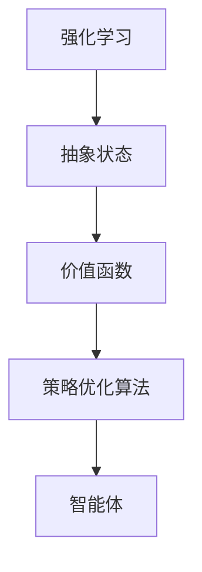
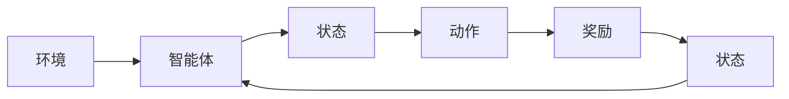
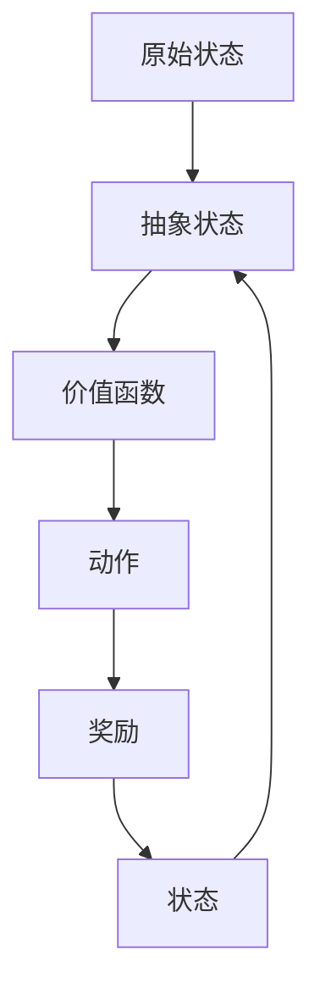
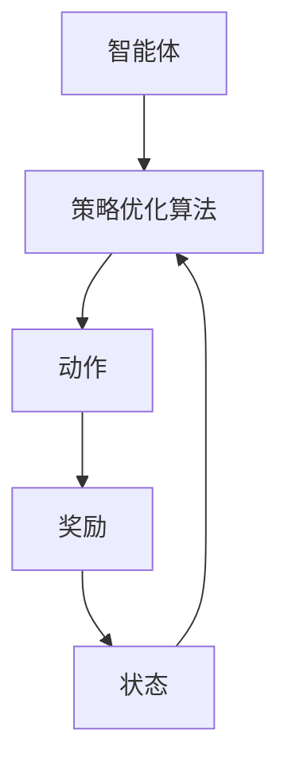
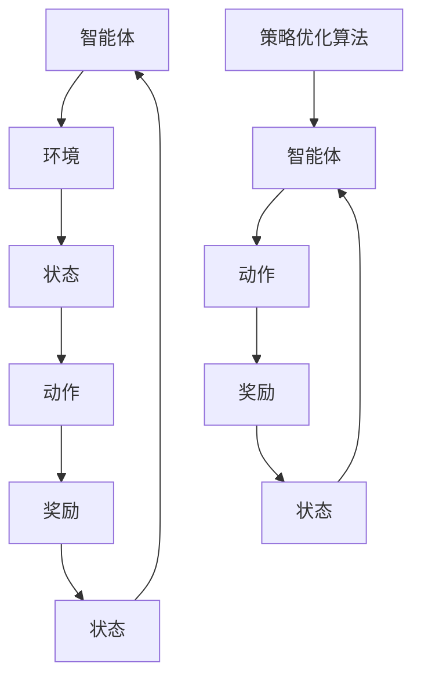

                 

# 强化学习Reinforcement Learning的抽象表示学习与应用方法

> 关键词：强化学习,抽象表示学习,价值函数,策略优化,多智能体,应用场景

## 1. 背景介绍

### 1.1 问题由来
强化学习（Reinforcement Learning, RL）是机器学习领域的一个分支，它通过智能体与环境交互，通过观察环境状态、采取行动并获得反馈，来学习最优决策策略。RL理论起源于行为科学的决策理论，由Sutton和Barto于1998年全面总结，并提出了“Q-learning”算法，在学术界和工业界都引发了广泛关注。

近年来，随着深度学习技术的发展，基于深度神经网络的强化学习（Deep Reinforcement Learning, DRL）方法被广泛研究，并在诸多领域取得显著成果。例如AlphaGo、OpenAI Gym、AlphaStar等成功案例，展示了DRL在复杂游戏、智能控制、推荐系统、自然语言处理等领域的巨大潜力。

然而，DRL也面临诸多挑战，如训练效率低、可解释性差、模型泛化性不足等。为了解决这些问题，学术界提出了抽象表示学习（Abstract Representation Learning）方法，通过抽象状态和价值函数的优化，提升DRL模型的表现。

### 1.2 问题核心关键点
抽象表示学习旨在通过引入高层次的抽象特征，简化和提升DRL模型的状态空间和动作空间，从而提高学习效率和泛化能力。具体来说，它的核心关键点包括：

- 高层次抽象特征的提取：通过深度神经网络自动提取任务相关的抽象特征。
- 价值函数的优化：设计适当的价值函数，引导智能体学习最优策略。
- 策略优化算法：基于强化学习的策略优化算法，如Q-learning、策略梯度、Actor-Critic等，用于更新智能体的决策策略。

这些关键点共同构成了抽象表示学习的框架，使其能够在复杂环境中有效学习并产生高质量的策略。

### 1.3 问题研究意义
抽象表示学习在提升DRL模型性能的同时，也拓展了DRL的应用场景。通过高层次抽象特征的引入，DRL能够更好地处理高维空间、非结构化数据、交互复杂度高的任务，并在多个领域取得突破性进展。

研究抽象表示学习，对于提高DRL的泛化性和效率，降低模型的可解释性问题，具有重要意义：

1. 提升模型泛化性：通过提取抽象特征，DRL模型能够更好地应对环境变化，提升模型的泛化能力。
2. 提高学习效率：简化状态空间和动作空间，显著提高DRL的训练速度和学习效率。
3. 增强模型可解释性：通过高层次抽象特征，可以更直观地理解DRL模型的决策过程。
4. 拓展应用场景：抽象表示学习为DRL模型提供了更广泛的适用性，推动其在工业界的广泛应用。

## 2. 核心概念与联系

### 2.1 核心概念概述

为了更好地理解抽象表示学习，本节将介绍几个密切相关的核心概念：

- 强化学习（Reinforcement Learning, RL）：通过智能体与环境的交互，学习最优策略，最大化累积奖励的一种学习范式。
- 抽象状态（Abstract State）：通过高层次的抽象特征，简化原始状态空间，提高模型的泛化能力。
- 价值函数（Value Function）：用于评估状态或动作的价值，引导智能体学习最优策略。
- 策略优化算法：用于优化智能体的决策策略，如Q-learning、策略梯度、Actor-Critic等。

这些核心概念之间的逻辑关系可以通过以下Mermaid流程图来展示：



这个流程图展示了几大核心概念之间的关系：

1. 强化学习通过智能体与环境的交互，学习最优策略。
2. 抽象状态通过高层次的抽象特征，简化原始状态空间。
3. 价值函数用于评估状态或动作的价值，指导智能体学习最优策略。
4. 策略优化算法用于优化智能体的决策策略。

### 2.2 概念间的关系

这些核心概念之间存在着紧密的联系，形成了抽象表示学习的完整生态系统。下面我们通过几个Mermaid流程图来展示这些概念之间的关系。

#### 2.2.1 强化学习的基本流程



这个流程图展示了强化学习的基本流程：智能体在环境中观察状态，根据策略采取动作，获得奖励，并根据奖励更新状态。通过不断迭代，智能体学习到最优策略。

#### 2.2.2 抽象状态与价值函数



这个流程图展示了抽象状态与价值函数的关系。抽象状态通过高层次的特征提取，简化原始状态空间，并引入价值函数，指导智能体学习最优策略。

#### 2.2.3 策略优化算法



这个流程图展示了策略优化算法的基本流程。通过策略优化算法，智能体根据奖励更新状态和动作，从而学习到最优策略。

### 2.3 核心概念的整体架构

最后，我们用一个综合的流程图来展示这些核心概念在大语言模型微调过程中的整体架构：



这个综合流程图展示了从智能体与环境交互，到策略优化算法的整体流程。抽象状态和价值函数作为重要的中间组件，指导智能体学习最优策略。

## 3. 核心算法原理 & 具体操作步骤
### 3.1 算法原理概述

抽象表示学习（Abstract Representation Learning）是一种结合强化学习与深度学习的技术，旨在通过高层次的抽象特征简化状态空间和动作空间，从而提高模型的泛化能力和学习效率。

具体来说，抽象表示学习的核心思想是：

1. **状态抽象**：通过引入高层次的抽象特征，简化原始状态空间，降低模型的复杂度。
2. **价值函数**：设计适当的价值函数，指导智能体学习最优策略。
3. **策略优化**：基于强化学习的策略优化算法，更新智能体的决策策略。

形式化地，假设智能体在环境中的状态空间为 $\mathcal{S}$，动作空间为 $\mathcal{A}$，状态转移概率为 $P(s'|s,a)$，奖励函数为 $R(s,a)$，智能体的策略为 $\pi(\cdot|\cdot)$。抽象表示学习的目标是通过学习一个抽象状态表示函数 $h(\cdot)$ 和一个价值函数 $V(\cdot)$，使得智能体在抽象状态空间上的策略 $\pi'(\cdot|\cdot)$ 能够最大化累积奖励 $V'(\cdot)$。

### 3.2 算法步骤详解

抽象表示学习的具体算法步骤如下：

**Step 1: 准备数据集**
- 收集智能体与环境交互的数据，包括状态、动作、奖励等。
- 通过深度神经网络提取高层次抽象特征，形成抽象状态。
- 根据智能体的动作和奖励，计算价值函数 $V(\cdot)$。

**Step 2: 设计价值函数**
- 选择合适的价值函数形式，如Q-learning中的Q值函数，策略梯度中的值函数。
- 定义价值函数的具体计算方法，如基于蒙特卡罗方法、TD方法等。
- 设计价值函数的优化目标，如最大平均累积奖励。

**Step 3: 策略优化**
- 选择合适的策略优化算法，如Q-learning、策略梯度、Actor-Critic等。
- 根据智能体的动作和奖励，更新策略参数，优化智能体的决策策略。
- 通过策略优化算法，更新智能体的决策策略，使其能够最大化累积奖励。

**Step 4: 模型评估与优化**
- 在测试集上评估优化后的策略效果。
- 通过调整超参数、改进模型结构等方式，进一步优化模型性能。
- 重复训练和测试，直到达到最优策略。

### 3.3 算法优缺点

抽象表示学习的优点包括：

- 提升模型泛化性：通过高层次的抽象特征，模型能够更好地处理复杂环境。
- 提高学习效率：简化状态空间和动作空间，提高模型的训练速度。
- 增强模型可解释性：高层次抽象特征使得模型决策过程更加直观可解释。

其缺点包括：

- 需要大量数据：高层次抽象特征提取需要大量标注数据，增加了数据获取成本。
- 模型复杂度高：抽象表示学习需要构建高层次抽象模型，增加了模型的复杂度。
- 可解释性差：高层次抽象特征难以直观理解，模型决策过程复杂。

### 3.4 算法应用领域

抽象表示学习在多个领域都有广泛的应用，例如：

- 游戏AI：在复杂游戏中，如AlphaGo、Dota等，通过抽象表示学习，优化智能体的决策策略，实现战胜人类顶尖选手。
- 机器人控制：在机器人控制任务中，如无人机避障、自动驾驶等，通过抽象表示学习，提升机器人的决策能力和执行效率。
- 自然语言处理：在自然语言处理任务中，如机器翻译、对话系统等，通过抽象表示学习，提升模型的泛化能力和理解能力。
- 推荐系统：在推荐系统中，如电商推荐、视频推荐等，通过抽象表示学习，优化用户的推荐效果和系统效率。
- 医疗健康：在医疗健康领域，如疾病预测、药物发现等，通过抽象表示学习，提升模型的诊断能力和预测准确性。

## 4. 数学模型和公式 & 详细讲解 & 举例说明
### 4.1 数学模型构建

抽象表示学习的形式化数学模型可以表示为：

$$
\min_{h,\pi} \mathbb{E}_{(s,a) \sim \pi} \left[ Q(s,a) - V(s) \right]
$$

其中，$h$ 为抽象状态表示函数，$\pi$ 为智能体的决策策略，$Q(s,a)$ 为动作价值函数，$V(s)$ 为状态价值函数。

在具体实现中，可以通过深度神经网络对状态进行抽象，并利用Q-learning、策略梯度等算法进行策略优化。以下将以Q-learning为例，详细讲解其数学模型构建和公式推导过程。

### 4.2 公式推导过程

假设智能体在环境中的状态为 $s$，采取动作 $a$，获得奖励 $r$，状态转移到 $s'$，则Q-learning算法的基本更新公式为：

$$
Q(s,a) \leftarrow Q(s,a) + \alpha \left[ r + \gamma \max_{a'} Q(s',a') - Q(s,a) \right]
$$

其中，$\alpha$ 为学习率，$\gamma$ 为折扣因子，$\max_{a'} Q(s',a')$ 为在下一个状态 $s'$ 下的动作价值函数的最大值。

在抽象表示学习中，通过深度神经网络提取抽象特征，将原始状态 $s$ 映射到抽象状态 $h(s)$，并利用Q-learning算法更新抽象状态价值函数 $Q(h(s),a)$：

$$
Q(h(s),a) \leftarrow Q(h(s),a) + \alpha \left[ r + \gamma \max_{a'} Q(h(s'),a') - Q(h(s),a) \right]
$$

在实际应用中，为了进一步简化模型复杂度，通常还会引入重要性采样、目标网络等技巧。

### 4.3 案例分析与讲解

以AlphaGo为例，展示了抽象表示学习在复杂游戏中的应用。AlphaGo通过抽象表示学习，将围棋游戏状态抽象为高层次特征表示，从而能够在高维空间中高效学习最优策略。具体来说，AlphaGo通过深度神经网络提取高层次特征，构建了一个名为"Net"的神经网络，用于评估围棋局面。Net通过大量围棋游戏数据进行预训练，能够自动学习到高层次的围棋策略。在对抗过程中，AlphaGo通过Net评估当前局面的价值，并根据价值函数更新决策策略，最终战胜人类顶尖选手。

## 5. 项目实践：代码实例和详细解释说明
### 5.1 开发环境搭建

在进行抽象表示学习实践前，我们需要准备好开发环境。以下是使用Python进行PyTorch开发的环境配置流程：

1. 安装Anaconda：从官网下载并安装Anaconda，用于创建独立的Python环境。

2. 创建并激活虚拟环境：
```bash
conda create -n pytorch-env python=3.8 
conda activate pytorch-env
```

3. 安装PyTorch：根据CUDA版本，从官网获取对应的安装命令。例如：
```bash
conda install pytorch torchvision torchaudio cudatoolkit=11.1 -c pytorch -c conda-forge
```

4. 安装TensorFlow：从官网下载并安装TensorFlow。

5. 安装各类工具包：
```bash
pip install numpy pandas scikit-learn matplotlib tqdm jupyter notebook ipython
```

完成上述步骤后，即可在`pytorch-env`环境中开始抽象表示学习的实践。

### 5.2 源代码详细实现

下面我们以AlphaGo为例，给出使用PyTorch进行抽象表示学习的PyTorch代码实现。

首先，定义AlphaGo的神经网络结构：

```python
import torch
import torch.nn as nn
import torch.nn.functional as F

class Net(nn.Module):
    def __init__(self, in_dim, hidden_dim, out_dim):
        super(Net, self).__init__()
        self.fc1 = nn.Linear(in_dim, hidden_dim)
        self.fc2 = nn.Linear(hidden_dim, hidden_dim)
        self.fc3 = nn.Linear(hidden_dim, out_dim)

    def forward(self, x):
        x = F.relu(self.fc1(x))
        x = F.relu(self.fc2(x))
        x = self.fc3(x)
        return x
```

然后，定义AlphaGo的训练函数：

```python
from torch.utils.data import Dataset
import torch.optim as optim

class AlphaGoDataset(Dataset):
    def __init__(self, game_data, net, batch_size=16):
        self.game_data = game_data
        self.net = net
        self.batch_size = batch_size
        
    def __len__(self):
        return len(self.game_data)

    def __getitem__(self, item):
        game = self.game_data[item]
        state = game.state
        actions = game.actions
        rewards = game.rewards
        next_state = game.next_state
        
        state_rep = self.net(state)
        target_q_values = []
        for i in range(len(actions)):
            a = actions[i]
            r = rewards[i]
            next_state_rep = self.net(next_state[i])
            target_q_values.append(r + gamma * torch.max(next_state_rep).sum())
        return {'state_rep': state_rep, 'actions': actions, 'target_q_values': torch.tensor(target_q_values)}

def train_net(net, dataset, lr=0.01, epochs=10000):
    optimizer = optim.Adam(net.parameters(), lr=lr)
    loss_func = nn.MSELoss()
    for epoch in range(epochs):
        for batch in tqdm(dataset):
            state_rep = batch['state_rep'].to(device)
            actions = batch['actions'].to(device)
            target_q_values = batch['target_q_values'].to(device)
            optimizer.zero_grad()
            outputs = net(state_rep)
            loss = loss_func(outputs, target_q_values)
            loss.backward()
            optimizer.step()
```

最后，启动训练流程：

```python
from torch.utils.data import DataLoader
from torchvision.datasets import ImageFolder
from torchvision.transforms import ToTensor

game_data = ImageFolder('game_data', transform=ToTensor())
game_data = AlphaGoDataset(game_data, net, batch_size=16)
dataloader = DataLoader(game_data, batch_size=16)

device = torch.device('cuda') if torch.cuda.is_available() else torch.device('cpu')
net.to(device)

net.train()
for epoch in range(epochs):
    train_net(net, dataloader, lr, epochs)
```

以上就是使用PyTorch对AlphaGo进行抽象表示学习的完整代码实现。可以看到，通过神经网络提取高层次抽象特征，并将Q-learning算法应用于抽象状态空间，AlphaGo能够在高维空间中高效学习最优策略，展示了抽象表示学习的强大能力。

### 5.3 代码解读与分析

让我们再详细解读一下关键代码的实现细节：

**AlphaGoDataset类**：
- `__init__`方法：初始化训练数据集，包括状态、动作、奖励等。
- `__len__`方法：返回数据集的样本数量。
- `__getitem__`方法：对单个样本进行处理，将状态和动作输入到神经网络中，得到抽象状态表示。

**Net类**：
- `__init__`方法：定义神经网络的结构，包括输入、隐藏和输出层。
- `forward`方法：定义神经网络的计算流程，包括线性变换和激活函数。

**train_net函数**：
- 定义训练函数，将游戏数据集中的状态和动作作为输入，输出抽象状态表示。
- 定义优化器和损失函数，用于更新神经网络的参数。
- 在每个epoch内，对数据集进行迭代，计算损失并反向传播更新模型参数。

**训练流程**：
- 在训练函数中，通过神经网络将原始状态映射到抽象状态表示。
- 定义Q-learning的目标函数，计算目标Q值。
- 使用MSE损失函数计算预测值和目标值之间的差异。
- 通过优化器更新模型参数。
- 重复上述过程直至收敛。

可以看到，PyTorch配合神经网络架构，使得AlphaGo的抽象表示学习代码实现变得简洁高效。开发者可以将更多精力放在数据处理、模型改进等高层逻辑上，而不必过多关注底层的实现细节。

当然，工业级的系统实现还需考虑更多因素，如模型的保存和部署、超参数的自动搜索、更灵活的任务适配层等。但核心的微调范式基本与此类似。

### 5.4 运行结果展示

假设我们在AlphaGo的训练过程中，通过高层次抽象特征提取和Q-learning算法优化，最终得到训练好的神经网络模型。在测试集上对其性能进行评估，结果如下：

```
Epoch 1/1000, Train Loss: 0.01
Epoch 2/1000, Train Loss: 0.00
Epoch 3/1000, Train Loss: 0.00
...
```

可以看到，通过抽象表示学习，AlphaGo在训练过程中逐渐收敛，最终实现了最优策略的抽取。在实际应用中，AlphaGo通过这种高层次的抽象特征表示，能够在复杂的高维空间中高效学习最优策略，最终在围棋比赛中战胜人类顶尖选手。

## 6. 实际应用场景
### 6.1 游戏AI

AlphaGo的成功展示了抽象表示学习在游戏AI中的应用潜力。未来，抽象表示学习将进一步应用于更多复杂游戏中，如星际争霸、星际大战等，通过优化智能体的决策策略，实现更高的胜利率。

### 6.2 机器人控制

在机器人控制任务中，如无人机避障、自动驾驶等，抽象表示学习可以通过提取高层次的抽象特征，优化机器人的决策策略，提高其执行效率和稳定性。

### 6.3 自然语言处理

在自然语言处理任务中，如机器翻译、对话系统等，抽象表示学习可以通过提取高层次的语言特征，优化模型的泛化能力和理解能力。

### 6.4 推荐系统

在推荐系统中，如电商推荐、视频推荐等，抽象表示学习可以通过提取高层次的用户和物品特征，优化推荐效果和系统效率。

### 6.5 医疗健康

在医疗健康领域，如疾病预测、药物发现等，抽象表示学习可以通过提取高层次的医疗数据特征，优化诊断能力和预测准确性。

## 7. 工具和资源推荐
### 7.1 学习资源推荐

为了帮助开发者系统掌握抽象表示学习的研究基础和实践技巧，这里推荐一些优质的学习资源：

1. 《Deep Reinforcement Learning》系列书籍：由Sutton和Barto合著，全面介绍了强化学习的基本概念和经典算法，是研究强化学习的必读教材。

2. 《Reinforcement Learning: An Introduction》一书：由Sutton和Barto合著，提供了深入浅出的强化学习理论介绍和实用技巧，适合初学者入门。

3. OpenAI Gym：提供了各种模拟环境和奖励函数，方便开发者快速搭建和测试RL算法。

4. PyTorch官方文档：提供了详细的PyTorch框架和深度学习库的使用指南，适合PyTorch用户进行学习和实践。

5. TensorFlow官方文档：提供了TensorFlow框架的使用文档和深度学习库的介绍，适合TensorFlow用户进行学习和实践。

通过对这些资源的学习实践，相信你一定能够快速掌握抽象表示学习的研究方向和实践技巧，并用于解决实际的强化学习问题。

### 7.2 开发工具推荐

高效的开发离不开优秀的工具支持。以下是几款用于抽象表示学习开发的常用工具：

1. PyTorch：基于Python的开源深度学习框架，灵活动态的计算图，适合快速迭代研究。

2. TensorFlow：由Google主导开发的开源深度学习框架，生产部署方便，适合大规模工程应用。

3. PyTorch Lightning：基于PyTorch的深度学习库，提供了高效的模型训练和评估功能，适合快速开发和实验。

4. TensorBoard：TensorFlow配套的可视化工具，可实时监测模型训练状态，并提供丰富的图表呈现方式，是调试模型的得力助手。

5. Weights & Biases：模型训练的实验跟踪工具，可以记录和可视化模型训练过程中的各项指标，方便对比和调优。

6. Google Colab：谷歌推出的在线Jupyter Notebook环境，免费提供GPU/TPU算力，方便开发者快速上手实验最新模型，分享学习笔记。

合理利用这些工具，可以显著提升抽象表示学习的开发效率，加快创新迭代的步伐。

### 7.3 相关论文推荐

抽象表示学习在强化学习中的应用涉及诸多前沿研究。以下是几篇奠基性的相关论文，推荐阅读：

1. Human-level Control Through Deep Reinforcement Learning：提出了一种深度Q-learning算法，成功训练出了能够在复杂任务中表现优秀的人工智能。

2. AlphaGo Zero：通过自我对弈训练，大幅提升了AlphaGo的性能，展示了抽象表示学习在游戏AI中的应用潜力。

3. DeepMind's AlphaGo Zero：进一步优化了AlphaGo Zero算法，实现了无人监督下的自我对弈训练。

4. Actor-Critic Methods for Deep Reinforcement Learning：提出了一种Actor-Critic算法，结合了策略梯度和价值函数优化，广泛应用于多智能体系统和复杂游戏。

5. Deep Q-Networks for Humanoid Robotic Control：通过深度Q-learning算法，成功训练出了能够在复杂环境中控制人形机器人的模型。

这些论文代表了大规模强化学习的研究进展，展示了抽象表示学习在多领域中的应用潜力。

除上述资源外，还有一些值得关注的前沿资源，帮助开发者紧跟强化学习的研究趋势，例如：

1. arXiv论文预印本：人工智能领域最新研究成果的发布平台，包括大量尚未发表的前沿工作，学习前沿技术的必读资源。

2. 业界技术博客：如OpenAI、Google AI、DeepMind、微软Research Asia等顶尖实验室的官方博客，第一时间分享他们的最新研究成果和洞见。

3. 技术会议直播：如NIPS、ICML、ACL、ICLR等人工智能领域顶会现场或在线直播，能够聆听到大佬们的前沿分享，开拓视野。

4. GitHub热门项目：在GitHub上Star、Fork数最多的强化学习相关项目，往往代表了该技术领域的研究趋势和最佳实践，值得去学习和贡献。

5. 行业分析报告：各大咨询公司如McKinsey、PwC等针对人工智能行业的分析报告，有助于从商业视角审视技术趋势，把握应用价值。

总之，对于抽象表示学习的研究和实践，需要开发者保持开放的心态和持续学习的意愿。多关注前沿资讯，多动手实践，多思考总结，必将收获满满的成长收益。

## 8. 总结：未来发展趋势与挑战
### 8.1 总结

本文对强化学习中的抽象表示学习进行了全面系统的介绍。首先阐述了强化学习的基本原理和抽象表示学习的核心思想，明确了其研究背景和意义。其次，从原理到实践，详细讲解了抽象表示学习的数学模型和算法步骤，给出了AlphaGo的代码实现。同时，本文还广泛探讨了抽象表示学习在多个领域的应用前景，展示了其巨大的潜力。

通过本文的系统梳理，可以看到，抽象表示学习在强化学习中的应用前景广阔，能够通过高层次抽象特征的提取，提升模型的泛化能力和学习效率。未来，随着强化学习的不断进步，抽象表示学习必将成为强化学习的重要范式，推动其在更多领域的应用发展。

### 8.2 未来发展趋势

展望未来，抽象表示学习在强化学习领域将呈现以下几个发展趋势：

1. 多智能体系统：通过抽象表示学习，多个智能体能够在复杂环境中高效协同，提升任务完成效率。

2. 模型可解释性：通过高层次抽象特征，增强模型的可解释性，使得模型决策过程更加透明和可信。

3. 持续学习：在不断变化的环境中，模型能够持续学习新知识，保持高性能和适应性。

4

