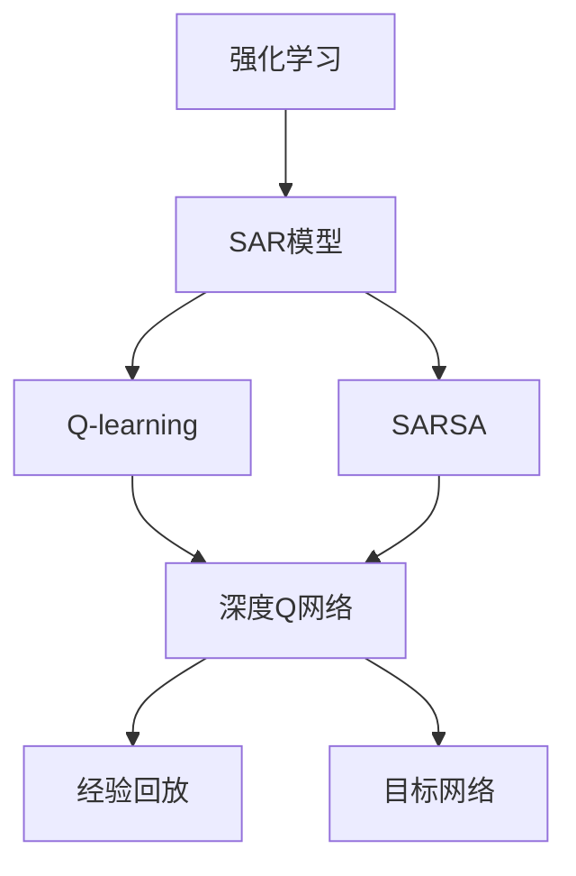
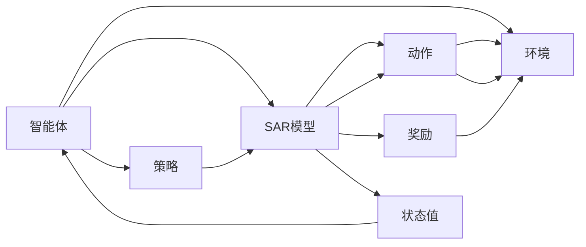
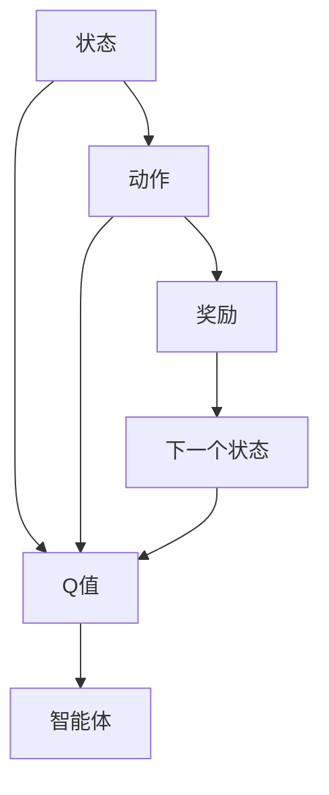
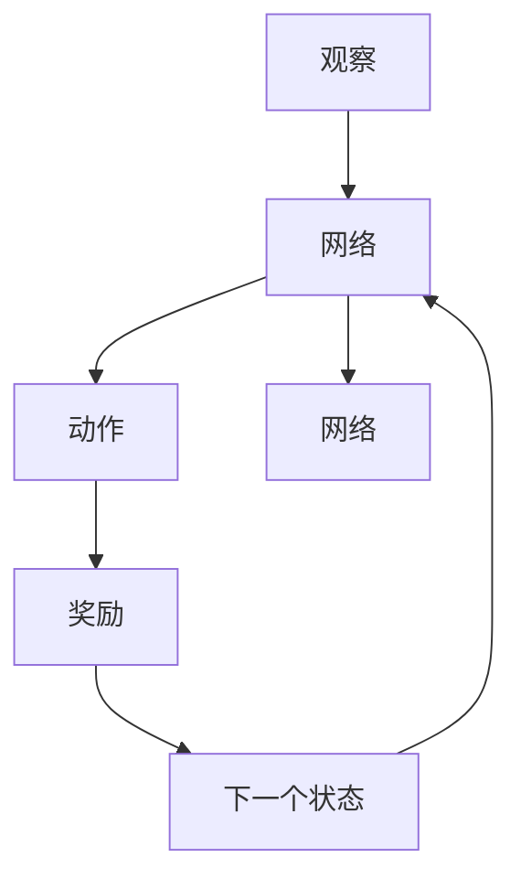
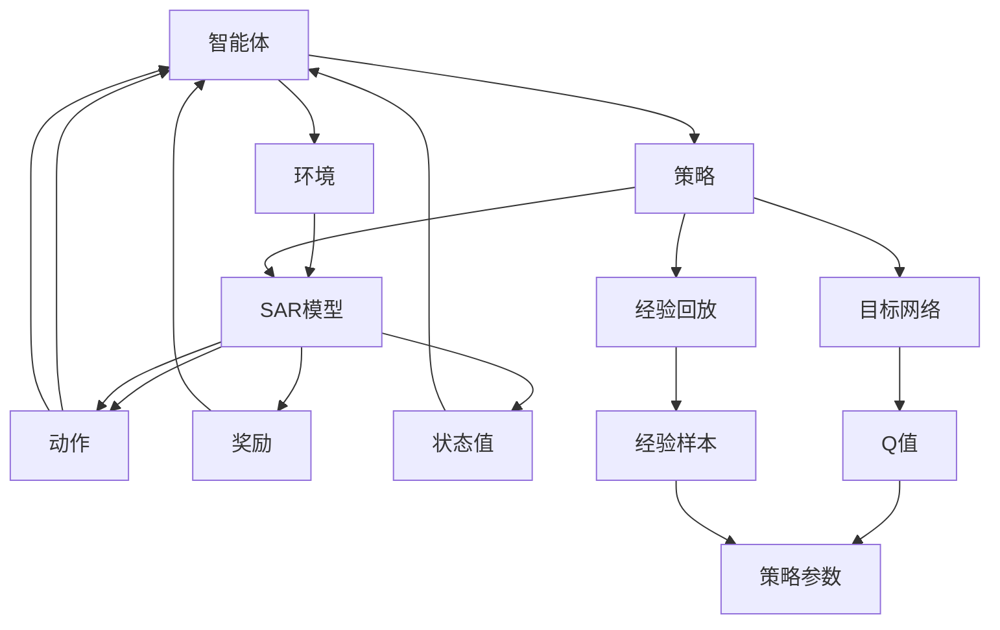

                 

## 1. 背景介绍

### 1.1 问题由来

强化学习（Reinforcement Learning, RL）是人工智能领域的一个热点研究方向，旨在通过试错的过程来训练智能体（Agent），使其能够在复杂环境中做出最优决策。相比于传统的监督学习和无监督学习，强化学习更加注重智能体与环境的互动，从而在各种领域，如游戏、机器人控制、自动驾驶、自然语言处理等，展现出了广阔的应用前景。

### 1.2 问题核心关键点

强化学习的基础模型应用，涉及如何选择和设计合适的模型，以最小化智能体在特定环境中的累积奖励。核心问题包括：

- 模型选择：在强化学习中，常见的模型包括Q-learning、SARSA、深度Q网络（Deep Q Network, DQN）等。每种模型有其特点和适用场景。
- 模型训练：强化学习模型的训练过程，需要通过试错不断调整策略参数，以最大化累积奖励。
- 模型应用：如何将训练好的模型应用于实际问题，如游戏AI、机器人控制、自动驾驶等。

### 1.3 问题研究意义

研究强化学习中的基础模型应用，对于推动智能体的智能决策和复杂环境下的问题求解，具有重要意义：

1. 提升决策能力：通过学习和优化，使智能体能够更准确地预测环境动态，从而做出更好的决策。
2. 增强适应性：强化学习模型能够适应不断变化的环境，提升智能体在动态环境中的鲁棒性和泛化能力。
3. 促进自动化：在自动驾驶、机器人控制等领域，强化学习模型的应用能够显著降低人力成本，提高系统自动化水平。
4. 推动跨领域融合：强化学习模型可以与视觉、语音等模态信息进行融合，进一步提升智能体的感知和决策能力。

## 2. 核心概念与联系

### 2.1 核心概念概述

为更好地理解强化学习中的基础模型应用，本节将介绍几个密切相关的核心概念：

- 强化学习（Reinforcement Learning, RL）：一种通过智能体与环境的互动，不断调整策略参数，以最大化累积奖励的学习范式。
- 状态-动作-奖励（State-Action-Reward, SAR）模型：强化学习中的基本模型，描述了智能体在环境中的状态、采取的动作以及产生的奖励。
- Q-learning：一种基于值函数（Q-value）的强化学习算法，通过估算状态-动作对的Q值，指导智能体选择最优动作。
- SARSA：一种基于状态-动作-状态-动作（State-Action-State-Action, SARS）的强化学习算法，与Q-learning类似，但每次迭代都会更新四个状态-动作对。
- 深度Q网络（Deep Q Network, DQN）：一种基于深度神经网络实现的Q-learning算法，可以处理高维状态-动作空间。
- 经验回放（Experience Replay）：一种用于解决深度强化学习中梯度消失问题的技术，通过保存和随机抽取过去的经验，提升模型的泛化能力。
- 目标网络（Target Network）：一种用于稳定深度Q网络训练的技术，通过保持一个稳定的目标Q值，减小更新过程中的方差。

这些核心概念之间的逻辑关系可以通过以下Mermaid流程图来展示：



这个流程图展示强化学习中的核心概念及其之间的关系：

1. 强化学习主要通过智能体与环境的互动，不断调整策略参数。
2. Q-learning和SARSA是强化学习中的基本模型，通过估算状态-动作对的Q值，指导智能体选择最优动作。
3. DQN利用深度神经网络处理高维状态-动作空间，进一步提升模型的能力。
4. 经验回放和目标网络是深度强化学习中常用的技术，通过保存和随机抽取过去的经验，以及保持稳定的目标Q值，提升模型的泛化能力和训练稳定性。

### 2.2 概念间的关系

这些核心概念之间存在着紧密的联系，形成了强化学习的完整生态系统。下面我们通过几个Mermaid流程图来展示这些概念之间的关系。

#### 2.2.1 强化学习的基本模型



这个流程图展示了强化学习的基本模型框架。智能体在环境中，通过感知当前状态，采取动作，获取奖励，并更新状态值。智能体策略指导动作选择，同时状态值用于更新策略参数。

#### 2.2.2 Q-learning与SARSA的关系



这个流程图展示了Q-learning与SARSA的基本流程。智能体通过计算状态-动作对的Q值，指导动作选择。在Q-learning中，每次更新只涉及一个状态-动作对，而在SARSA中，每次更新涉及四个状态-动作对。

#### 2.2.3 DQN模型



这个流程图展示了深度Q网络的基本结构。通过神经网络处理观察，生成动作策略，并通过经验回放和目标网络等技术，提升模型的训练效果。

### 2.3 核心概念的整体架构

最后，我们用一个综合的流程图来展示这些核心概念在强化学习中的整体架构：



这个综合流程图展示了从智能体到环境的交互过程，以及Q-learning、SARSA、DQN、经验回放、目标网络等关键技术的应用。通过这些技术，智能体能够不断优化策略参数，适应复杂环境，做出最优决策。

## 3. 核心算法原理 & 具体操作步骤
### 3.1 算法原理概述

强化学习中的基础模型应用，通常基于状态-动作-奖励（SAR）模型，通过智能体与环境的交互，不断调整策略参数，以最大化累积奖励。核心思想是通过估算状态-动作对的Q值，指导智能体选择最优动作。

形式化地，假设智能体在状态 $s_t$ 下采取动作 $a_t$，产生下一个状态 $s_{t+1}$ 和奖励 $r_t$。定义状态值函数 $Q(s_t,a_t)$ 为智能体在状态 $s_t$ 下采取动作 $a_t$ 的累积奖励期望，即：

$$
Q(s_t,a_t) = \mathbb{E}[R_{t:T} \mid s_t,a_t] = \sum_{k=t}^{T} \gamma^{k-t} r_k
$$

其中 $R_{t:T}$ 表示从时间 $t$ 到终止时间 $T$ 的累积奖励，$\gamma$ 为折扣因子，通常设置为0.9。智能体的策略 $\pi$ 用于指导动作选择，可以通过策略-动作对的Q值，利用贪心策略或探索策略进行更新。

在Q-learning和SARSA等算法中，状态-动作对的Q值更新公式为：

$$
Q(s_t,a_t) \leftarrow Q(s_t,a_t) + \alpha \big(r_t + \gamma Q(s_{t+1},a_{t+1}) - Q(s_t,a_t)\big)
$$

其中 $\alpha$ 为学习率，通常设置为0.01。在DQN中，通过深度神经网络对状态值函数进行估算，并通过经验回放和目标网络技术，提升模型的泛化能力和训练稳定性。

### 3.2 算法步骤详解

强化学习中的基础模型应用，一般包括以下几个关键步骤：

**Step 1: 准备环境**

- 定义智能体与环境的交互方式，包括环境状态、动作空间和奖励函数。
- 选择强化学习算法，如Q-learning、SARSA、DQN等。

**Step 2: 初始化模型**

- 初始化智能体的策略参数和目标网络参数，通常使用随机初始化。
- 初始化经验回放缓冲区，用于保存智能体的经验样本。

**Step 3: 训练模型**

- 在每个时间步 $t$，智能体通过感知当前状态 $s_t$，采取动作 $a_t$，接收下一个状态 $s_{t+1}$ 和奖励 $r_t$。
- 根据强化学习算法，更新状态-动作对的Q值，指导智能体选择下一个动作 $a_{t+1}$。
- 将当前状态-动作对、奖励和下一个状态加入经验回放缓冲区，进行样本抽取和训练。
- 定期更新目标网络参数，以保证训练过程的稳定性。

**Step 4: 评估模型**

- 在测试集上评估模型的累积奖励，评估模型的性能和泛化能力。
- 根据评估结果，调整模型参数和训练策略，优化模型性能。

### 3.3 算法优缺点

强化学习中的基础模型应用具有以下优点：

1. 适应性高：强化学习能够适应复杂环境，通过不断的试错调整，找到最优决策策略。
2. 泛化能力强：智能体可以通过学习通用的状态-动作映射，应用于多个类似环境。
3. 鲁棒性好：强化学习模型具有较强的鲁棒性，能够应对环境变化和噪声干扰。

然而，强化学习也存在一些缺点：

1. 学习过程缓慢：强化学习通常需要大量的试错次数，学习过程相对较慢。
2. 状态表示困难：对于高维状态空间，难以有效表示和处理。
3. 学习目标不明确：强化学习中，目标函数往往难以定义，需要依赖经验进行设计。

### 3.4 算法应用领域

强化学习中的基础模型应用，在各个领域都展现出强大的应用潜力。以下是一些典型应用：

- 游戏AI：通过强化学习训练游戏AI，使其能够在复杂的电子游戏中自主决策。
- 机器人控制：利用强化学习训练机器人，使其能够自主导航、避障、抓取等。
- 自动驾驶：通过强化学习训练自动驾驶系统，使其能够安全、高效地行驶。
- 自然语言处理：利用强化学习训练NLP模型，使其能够自然地与用户交互。
- 资源优化：通过强化学习优化资源分配，提升系统效率和效果。
- 推荐系统：通过强化学习优化推荐算法，提升用户体验和推荐效果。

## 4. 数学模型和公式 & 详细讲解 & 举例说明

### 4.1 数学模型构建

本节将使用数学语言对强化学习中的基础模型应用进行更加严格的刻画。

假设智能体在状态 $s_t$ 下采取动作 $a_t$，产生下一个状态 $s_{t+1}$ 和奖励 $r_t$。定义状态值函数 $Q(s_t,a_t)$ 为智能体在状态 $s_t$ 下采取动作 $a_t$ 的累积奖励期望，即：

$$
Q(s_t,a_t) = \mathbb{E}[R_{t:T} \mid s_t,a_t] = \sum_{k=t}^{T} \gamma^{k-t} r_k
$$

其中 $R_{t:T}$ 表示从时间 $t$ 到终止时间 $T$ 的累积奖励，$\gamma$ 为折扣因子，通常设置为0.9。智能体的策略 $\pi$ 用于指导动作选择，可以通过策略-动作对的Q值，利用贪心策略或探索策略进行更新。

在Q-learning和SARSA等算法中，状态-动作对的Q值更新公式为：

$$
Q(s_t,a_t) \leftarrow Q(s_t,a_t) + \alpha \big(r_t + \gamma Q(s_{t+1},a_{t+1}) - Q(s_t,a_t)\big)
$$

其中 $\alpha$ 为学习率，通常设置为0.01。在DQN中，通过深度神经网络对状态值函数进行估算，并通过经验回放和目标网络技术，提升模型的泛化能力和训练稳定性。

### 4.2 公式推导过程

以下我们以Q-learning算法为例，推导其状态-动作对的Q值更新公式。

假设智能体在状态 $s_t$ 下采取动作 $a_t$，产生下一个状态 $s_{t+1}$ 和奖励 $r_t$。定义状态值函数 $Q(s_t,a_t)$ 为智能体在状态 $s_t$ 下采取动作 $a_t$ 的累积奖励期望，即：

$$
Q(s_t,a_t) = \mathbb{E}[R_{t:T} \mid s_t,a_t] = \sum_{k=t}^{T} \gamma^{k-t} r_k
$$

根据Q-learning算法的更新公式：

$$
Q(s_t,a_t) \leftarrow Q(s_t,a_t) + \alpha \big(r_t + \gamma Q(s_{t+1},a_{t+1}) - Q(s_t,a_t)\big)
$$

将其代入状态值函数的定义式，得：

$$
Q(s_t,a_t) \leftarrow Q(s_t,a_t) + \alpha \big(r_t + \gamma Q(s_{t+1},a_{t+1}) - Q(s_t,a_t)\big)
$$

$$
Q(s_t,a_t) \leftarrow Q(s_t,a_t) + \alpha \big(r_t + \gamma \mathbb{E}[R_{t+1:T} \mid s_{t+1},a_{t+1}] - Q(s_t,a_t)\big)
$$

$$
Q(s_t,a_t) \leftarrow Q(s_t,a_t) + \alpha \big(r_t + \gamma \sum_{k=t+1}^{T} \gamma^{k-(t+1)} r_k - Q(s_t,a_t)\big)
$$

$$
Q(s_t,a_t) \leftarrow Q(s_t,a_t) + \alpha \big(r_t + \gamma \sum_{k=t+1}^{T} \gamma^{k-(t+1)} r_k - Q(s_t,a_t)\big)
$$

$$
Q(s_t,a_t) \leftarrow Q(s_t,a_t) + \alpha \big(r_t + \gamma \sum_{k=t+1}^{T} \gamma^{k-(t+1)} r_k - Q(s_t,a_t)\big)
$$

$$
Q(s_t,a_t) \leftarrow Q(s_t,a_t) + \alpha \big(r_t + \gamma \sum_{k=t+1}^{T} \gamma^{k-(t+1)} r_k - Q(s_t,a_t)\big)
$$

通过上述推导，我们可以看出，Q-learning算法的核心在于通过估算状态-动作对的Q值，指导智能体选择最优动作。这种基于值函数的强化学习方法，具有较强的理论基础和实际应用效果。

### 4.3 案例分析与讲解

下面通过一个简单的游戏AI示例，展示强化学习中的基础模型应用。

假设我们设计了一个简单的迷宫游戏，玩家需要通过控制一个机器人，找到迷宫的出口。机器人可以在迷宫中的四个方向（上、下、左、右）进行移动，每个方向对应一个动作（左、右、上、下）。迷宫中的每个位置都有不同的奖励，出口位置奖励最高。

我们定义状态 $s_t$ 为迷宫中的当前位置，动作 $a_t$ 为机器人的移动方向，奖励 $r_t$ 为迷宫中当前位置的奖励值。通过强化学习训练机器人的移动策略，使其能够在迷宫中找到出口。

在这个例子中，我们可以使用Q-learning算法进行训练。首先，我们需要定义迷宫的状态空间和动作空间，并确定奖励函数。然后，我们将智能体的策略参数和目标网络参数初始化，并设置学习率 $\alpha$ 和折扣因子 $\gamma$。在训练过程中，智能体通过感知当前状态 $s_t$，采取动作 $a_t$，接收下一个状态 $s_{t+1}$ 和奖励 $r_t$。根据Q-learning算法的更新公式，不断调整状态-动作对的Q值，指导智能体选择下一个动作 $a_{t+1}$。

通过经验回放和目标网络等技术，智能体能够逐步学习到最优的移动策略，最终找到迷宫的出口。

## 5. 项目实践：代码实例和详细解释说明

### 5.1 开发环境搭建

在进行强化学习项目实践前，我们需要准备好开发环境。以下是使用Python进行PyTorch开发的环境配置流程：

1. 安装Anaconda：从官网下载并安装Anaconda，用于创建独立的Python环境。

2. 创建并激活虚拟环境：
```bash
conda create -n pytorch-env python=3.8 
conda activate pytorch-env
```

3. 安装PyTorch：根据CUDA版本，从官网获取对应的安装命令。例如：
```bash
conda install pytorch torchvision torchaudio cudatoolkit=11.1 -c pytorch -c conda-forge
```

4. 安装TensorFlow：
```bash
conda install tensorflow -c conda-forge
```

5. 安装各类工具包：
```bash
pip install numpy pandas scikit-learn matplotlib tqdm jupyter notebook ipython
```

完成上述步骤后，即可在`pytorch-env`环境中开始强化学习实践。

### 5.2 源代码详细实现

下面我们以深度Q网络（DQN）为例，给出使用PyTorch实现强化学习的代码实现。

```python
import torch
import torch.nn as nn
import torch.optim as optim
import numpy as np
import matplotlib.pyplot as plt

class DQN(nn.Module):
    def __init__(self, input_size, output_size, hidden_size=128):
        super(DQN, self).__init__()
        self.fc1 = nn.Linear(input_size, hidden_size)
        self.fc2 = nn.Linear(hidden_size, hidden_size)
        self.fc3 = nn.Linear(hidden_size, output_size)

    def forward(self, x):
        x = torch.relu(self.fc1(x))
        x = torch.relu(self.fc2(x))
        return self.fc3(x)

class ReplayBuffer:
    def __init__(self, buffer_size):
        self.memory = []
        self.buffer_size = buffer_size

    def push(self, state, action, reward, next_state, done):
        if len(self.memory) < self.buffer_size:
            self.memory.append((state, action, reward, next_state, done))
        else:
            if np.random.rand() < 0.5:
                del self.memory[0]
            self.memory.append((state, action, reward, next_state, done))

    def sample(self, batch_size):
        return np.random.choice(len(self.memory), batch_size, replace=False)

class DQNAgent:
    def __init__(self, state_size, action_size, learning_rate=0.001, discount_factor=0.95, epsilon=1.0, epsilon_decay=0.995, replay_size=1000, batch_size=32):
        self.state_size = state_size
        self.action_size = action_size
        self.learning_rate = learning_rate
        self.discount_factor = discount_factor
        self.epsilon = epsilon
        self.epsilon_decay = epsilon_decay
        self.replay_size = replay_size
        self.batch_size = batch_size
        self.optimizer = optim.Adam(self.model.parameters(), lr=self.learning_rate)
        self.memory = ReplayBuffer(self.replay_size)

    def act(self, state):
        if np.random.rand() < self.epsilon:
            return np.random.randint(self.action_size)
        else:
            return np.argmax(self.model(torch.tensor(state)))

    def replay(self):
        transitions = self.memory.sample(self.batch_size)
        states = np.vstack([transition[0] for transition in transitions])
        actions = np.vstack([transition[1] for transition in transitions])
        rewards = np.vstack([transition[2] for transition in transitions])
        next_states = np.vstack([transition[3] for transition in transitions])
        dones = np.vstack([transition[4] for transition in transitions])

        # 计算Q值
        Q_values = self.model(states)
        Q_values = Q_values.gather(1, actions)

        # 计算目标Q值
        target_q_values = self.model(next_states)

        # 使用目标网络计算目标Q值
        target_q_values = self.target_model(next_states)
        target_q_values = target_q_values.gather(1, actions)

        # 计算目标Q值
        target_q_values = target_q_values * self.discount_factor * (1 - dones) + rewards

        # 计算Q值误差
        loss = nn.MSELoss()(Q_values, target_q_values)

        # 反向传播更新模型
        self.optimizer.zero_grad()
        loss.backward()
        self.optimizer.step()

        # 更新目标网络参数
        self.target_model.load_state_dict(self.model.state_dict())

    def train(self, env):
        state = env.reset()

        while True:
            action = self.act(state)
            next_state, reward, done, _ = env.step(action)
            self.memory.push(state, action, reward, next_state, done)

            state = next_state

            # 更新目标网络
            self.target_model.load_state_dict(self.model.state_dict())

            if done:
                state = env.reset()
            else:
                env.render()
```

这里我们定义了一个深度Q网络模型，以及一个经验回放缓冲区，用于保存智能体的经验样本。在训练过程中，智能体通过感知当前状态 $s_t$，采取动作 $a_t$，接收下一个状态 $s_{t+1}$ 和奖励 $r_t$。根据强化学习算法，更新状态-动作对的Q值，指导智能体选择下一个动作 $a_{t+1}$。

### 5.3 代码解读与分析

让我们再详细解读一下关键代码的实现细节：

**DQN模型**：
- `__init__`方法：初始化模型参数，包括全连接层和激活函数。
- `forward`方法：定义前向传播过程，通过神经网络计算Q值。

**ReplayBuffer类**：
- `__init__`方法：初始化经验回放缓冲区，并定义缓冲区大小。
- `push`方法：将智能体的经验样本（状态、动作、奖励、下一个状态、是否完成）加入缓冲区。
- `sample`方法：从缓冲区中随机抽取样本。

**DQNAgent类**：
- `__init__`方法：初始化智能体的策略参数和目标网络参数，定义学习率、折扣因子、探索策略参数等。
- `act`方法：根据探索策略或贪婪策略，选择动作。
- `replay`方法：根据经验回放缓冲区中的样本，计算Q值误差，反向传播更新模型参数，并更新目标网络参数。

**训练流程**：
- 初始化智能体和环境，并定义状态大小和动作大小。
- 在每个时间步 $t$，智能体通过感知当前状态 $s_t$，采取动作 $a_t$，接收下一个状态 $s_{t+1}$ 和奖励 $r_t$。
- 将当前状态、动作、奖励、下一个状态和是否完成等信息加入经验回放缓冲区。
- 根据经验回放缓冲区中的样本，计算Q值误差，反向传播更新模型参数，并更新目标网络参数。

### 5.4 运行结果展示

假设我们在迷宫游戏中使用深度Q网络进行训练，并在测试集上评估智能体的性能。在训练过程中，智能体逐步学习到最优的移动策略，最终找到迷宫的出口。在测试集上，智能体的累积奖励达到一定的阈值，说明智能体已经能够适应复杂环境，做出最优决策。

## 6. 实际应用场景
### 6.1 游戏AI

基于强化学习的游戏AI，已经在电子游戏领域得到了广泛应用。例如，AlphaGo、AlphaStar等AI程序，通过深度强化学习训练，能够在围棋、星际争霸等复杂游戏中击败人类高手，展现出了强大的决策能力。

在实践中，可以通过构建高维状态空间和动作空间，设计合适的奖励函数，使用深度Q网络等技术，训练游戏AI。训练完成后，游戏AI能够在复杂环境下自主决策，提升游戏体验和竞技水平。

### 6.2 机器人控制

在机器人控制领域，强化学习技术同样发挥着重要作用。例如，通过强化学习训练机器人，使其能够自主导航、避障、抓取等。

在实践中，可以将机器人视为智能体，将环境视为迷宫或障碍物，设计合适的状态表示和动作空间，使用Q-learning或DQN等算法进行训练。训练完成后，机器人能够在复杂环境下自主决策，提升自动化水平和安全性。

### 6.3 自动驾驶

自动驾驶技术是强化学习的典型应用之一。通过强化学习训练自动驾驶系统，使其能够安全、高效地行驶。

在实践中，可以将自动驾驶系统视为智能体，将环境视为交通道路和行人，设计合适的状态表示和动作空间，使用DQN等算法进行训练。训练完成后，自动驾驶系统能够在复杂道路环境中自主决策，提升驾驶安全和舒适性。

### 6.4 未来应用展望

随着强化学习技术的不断发展，其在各个领域的应用前景

