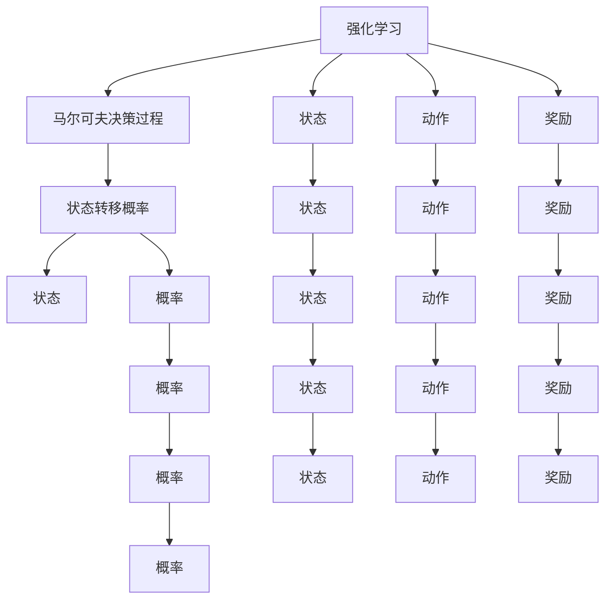
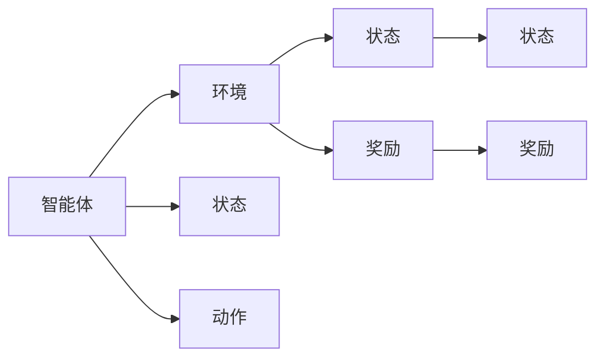
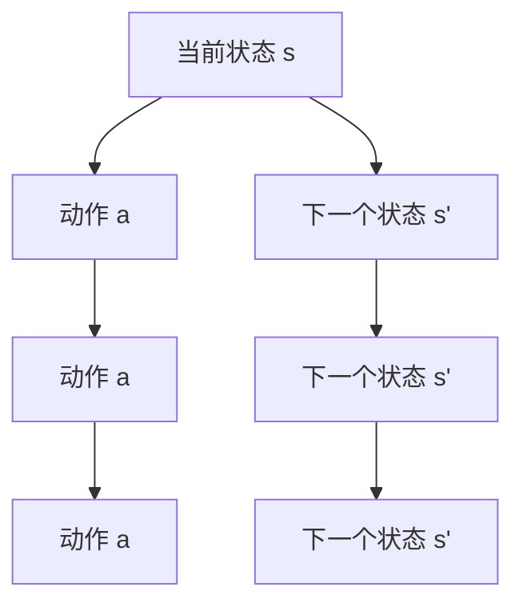

                 

# 强化学习算法：动态规划 原理与代码实例讲解

> 关键词：强化学习,动态规划,状态转移方程,值迭代,策略迭代,贝尔曼方程,马尔可夫决策过程,最优策略,代码实现,政策评估

## 1. 背景介绍

### 1.1 问题由来

强化学习（Reinforcement Learning, RL）是一种通过与环境交互来学习最优决策的机器学习方法。其基本框架为智能体（agent）在环境（environment）中进行互动，通过试错逐步优化策略，以达到特定目标。这一方法在智能控制、游戏策略、推荐系统等领域均有广泛应用。

强化学习的核心在于构建环境与智能体之间的交互模型，通过定义状态空间、动作空间和奖励函数，设计有效的算法来搜索最优策略。其中，动态规划（Dynamic Programming, DP）是强化学习中最为基础和核心的算法之一，通过系统地构建状态转移方程，求解最优策略，实现决策优化。

### 1.2 问题核心关键点

动态规划算法通过分解原问题为多个子问题，逐步求解，最终得到原问题的最优解。其核心思想是“子问题最优，整体最优”。动态规划适用于具有最优子结构、无后效性和重叠子问题特征的问题，如最短路径问题、背包问题等。在强化学习中，动态规划可以用于求解马尔可夫决策过程（Markov Decision Process, MDP）的最优策略。

在实际应用中，动态规划算法的有效性和效率取决于状态空间的大小和计算复杂度。如果状态空间巨大，状态转移方程复杂，动态规划算法可能无法高效求解。因此，近年来，研究者提出了多种优化策略，如蒙特卡罗方法、Q学习等，以提高算法效率和扩展性。

### 1.3 问题研究意义

研究动态规划算法在强化学习中的应用，对于构建高效的决策优化系统，提升智能体的学习能力和适应性，具有重要意义。

- 优化决策过程：动态规划算法通过求解最优策略，能够显著提升智能体的决策准确性和适应性。
- 提高系统效率：通过分解复杂问题为多个子问题，动态规划算法能够降低计算复杂度，提高系统处理效率。
- 增强泛化能力：动态规划算法能够学习通用的决策模式，在多种环境下均能稳定工作。
- 促进多学科融合：动态规划算法与控制论、运筹学等学科紧密相关，能够促进计算机科学与其他学科的交叉融合。

## 2. 核心概念与联系

### 2.1 核心概念概述

为了更好地理解动态规划在强化学习中的应用，本节将介绍几个密切相关的核心概念：

- 强化学习（Reinforcement Learning, RL）：一种通过与环境互动学习最优决策的机器学习方法。
- 马尔可夫决策过程（Markov Decision Process, MDP）：强化学习的基本框架，描述智能体与环境之间的互动过程。
- 状态（State）：描述环境当前状态的变量。
- 动作（Action）：智能体可采取的决策或行为。
- 奖励（Reward）：智能体采取动作后从环境中获得的反馈。
- 状态转移概率（Transition Probability）：从当前状态到下一个状态的转移概率。
- 值函数（Value Function）：描述状态或动作的价值，用于评估策略的优劣。

这些概念之间的逻辑关系可以通过以下Mermaid流程图来展示：



这个流程图展示了强化学习和马尔可夫决策过程的基本概念，以及它们之间的联系。

### 2.2 概念间的关系

这些核心概念之间存在着紧密的联系，形成了动态规划在强化学习中的应用框架。下面我们通过几个Mermaid流程图来展示这些概念之间的关系。

#### 2.2.1 强化学习的框架



这个流程图展示了强化学习的核心框架，即智能体与环境之间的互动。智能体根据当前状态和奖励，选择最佳动作，更新状态，直至达到终止状态。

#### 2.2.2 状态转移方程



这个流程图展示了状态转移方程的基本结构。智能体从当前状态 s 根据动作 a 转移到下一个状态 s'，该过程由状态转移概率 p(s'|s,a)描述。

#### 2.2.3 贝尔曼方程

```mermaid
graph TB
    A[状态 s] --> B[动作 a]
    A --> C[值 v(s)]
    A --> D[值 v'(s')]
    B --> E[值 v(a)]
    C --> F[值 v(s)]
    D --> G[值 v'(s')]
    E --> H[值 v(a)]
    F --> I[值 v(s)]
    G --> J[值 v'(s')]
    H --> K[值 v(a)]
    I --> L[值 v(s)]
    J --> M[值 v'(s')]
    K --> N[值 v(a)]
    L --> O[值 v(s)]
    M --> P[值 v'(s')]
    N --> Q[值 v(a)]
    O --> R[值 v(s)]
    P --> S[值 v'(s')]
    Q --> T[值 v(a)]
    R --> U[值 v(s)]
    S --> V[值 v'(s')]
    T --> W[值 v(a)]
    U --> X[值 v(s)]
    V --> Y[值 v'(s')]
    W --> Z[值 v(a)]
    X --> A[状态 s]
    Y --> B[动作 a]
    Z --> C[值 v(s)]
```

这个流程图展示了贝尔曼方程的基本结构。贝尔曼方程描述了值函数 v 和值函数 v' 之间的关系，用于求解最优策略。

## 3. 核心算法原理 & 具体操作步骤
### 3.1 算法原理概述

动态规划算法通过分解原问题为多个子问题，逐步求解，最终得到原问题的最优解。其核心思想是“子问题最优，整体最优”。

在强化学习中，动态规划算法主要用于求解马尔可夫决策过程的最优策略。具体步骤如下：

1. 定义状态空间和动作空间。
2. 确定状态转移概率和奖励函数。
3. 通过贝尔曼方程求解最优值函数。
4. 基于值函数求解最优策略。

### 3.2 算法步骤详解

以下是对动态规划在强化学习中求解最优策略的详细步骤：

**Step 1: 定义状态空间和动作空间**

- 定义状态空间 S，包含所有可能的环境状态。
- 定义动作空间 A，包含所有可行的动作。

**Step 2: 确定状态转移概率和奖励函数**

- 定义状态转移概率 p(s'|s,a)，即从当前状态 s 根据动作 a 转移到下一个状态 s' 的概率。
- 定义奖励函数 R(s,a)，即智能体采取动作 a 从状态 s 获得的奖励。

**Step 3: 求解最优值函数**

- 定义值函数 V(s)，表示智能体在状态 s 下的长期收益。
- 使用贝尔曼方程 V(s) = max_a [R(s,a) + γV(s')]，递归求解最优值函数。其中，γ 为折扣因子，表示未来收益的重要性。
- 可以通过动态规划或蒙特卡罗方法求解最优值函数。

**Step 4: 求解最优策略**

- 根据值函数求解最优策略 π*，即在每个状态下采取最优动作的概率。
- 使用策略迭代或值迭代算法求解最优策略。

### 3.3 算法优缺点

动态规划算法在强化学习中的应用具有以下优点：

1. 求解最优策略：通过求解最优值函数和最优策略，能够找到最优决策路径。
2. 理论完备：动态规划算法在理论上完备，适用于多种问题的求解。
3. 便于实现：动态规划算法的实现相对简单，易于理解和调试。

同时，动态规划算法也存在一些缺点：

1. 计算复杂度高：动态规划算法通常需要求解状态转移方程，计算复杂度高。
2. 状态空间大：当状态空间巨大时，动态规划算法可能无法高效求解。
3. 无法处理连续动作空间：动态规划算法通常假设动作空间为离散集，无法直接应用于连续动作空间。

### 3.4 算法应用领域

动态规划算法在强化学习中的应用领域非常广泛，包括：

- 最短路径问题：如Dijkstra算法、Floyd-Warshall算法等。
- 背包问题：如0-1背包问题、完全背包问题等。
- 资源分配问题：如工厂调度问题、多任务调度问题等。
- 游戏策略优化：如围棋、象棋等棋类游戏。

除了这些经典问题，动态规划算法还被应用于金融投资、网络路由、智能控制等多个领域，展现出强大的通用性和可扩展性。

## 4. 数学模型和公式 & 详细讲解 & 举例说明

### 4.1 数学模型构建

在强化学习中，动态规划算法通常用于求解马尔可夫决策过程的最优策略。假设一个马尔可夫决策过程为 (S,A,p,R,γ)，其中 S 为状态空间，A 为动作空间，p 为状态转移概率，R 为奖励函数，γ 为折扣因子。

定义值函数 V(s)，表示智能体在状态 s 下的长期收益。贝尔曼方程描述了值函数之间的关系，即：

$$ V(s) = \max_{a} \left( R(s,a) + \gamma \sum_{s'} p(s'|s,a) V(s') \right) $$

其中，V(s) 表示在状态 s 下的值函数，R(s,a) 表示从状态 s 采取动作 a 获得的奖励，p(s'|s,a) 表示从状态 s 转移到状态 s' 的概率。

### 4.2 公式推导过程

以下是对贝尔曼方程的详细推导：

- 定义值函数 V(s)，表示智能体在状态 s 下的长期收益。
- 根据贝尔曼方程，值函数可以递归表达为：

$$ V(s) = \max_{a} \left( R(s,a) + \gamma V(s') \right) $$

其中，V(s') 表示在状态 s' 下的长期收益。

- 将上述表达式代入贝尔曼方程，得到：

$$ V(s) = \max_{a} \left( R(s,a) + \gamma \sum_{s'} p(s'|s,a) V(s') \right) $$

- 该表达式即为贝尔曼方程，描述了状态值函数之间的关系。

### 4.3 案例分析与讲解

我们以一个简单的背包问题为例，展示动态规划算法的求解过程。

假设有一个背包，其容量为 C，需要从 n 个物品中选择一组物品，使得这些物品的总价值最大。每个物品的价值为 v_i，重量为 w_i，其中 i 表示物品序号。

**Step 1: 定义状态空间和动作空间**

- 定义状态 s = (c,v_i)，表示当前背包容量为 c，已放入物品的总价值为 v_i。
- 定义动作 a = 0/1，表示是否将第 i 个物品放入背包。

**Step 2: 确定状态转移概率和奖励函数**

- 状态转移概率 p(s'|s,a) 表示从状态 s 根据动作 a 转移到下一个状态 s' 的概率。
- 奖励函数 R(s,a) 表示在状态 s 下采取动作 a 获得的奖励。

**Step 3: 求解最优值函数**

- 使用贝尔曼方程递归求解最优值函数 V(s)。

**Step 4: 求解最优策略**

- 根据值函数求解最优策略 π*，即在每个状态下采取最优动作的概率。

通过动态规划算法，可以高效地求解最优策略，从而在背包问题中选取最佳物品组合。

## 5. 项目实践：代码实例和详细解释说明

### 5.1 开发环境搭建

在进行动态规划算法实践前，我们需要准备好开发环境。以下是使用Python进行Reinforcement Learning开发的Python环境配置流程：

1. 安装Anaconda：从官网下载并安装Anaconda，用于创建独立的Python环境。

2. 创建并激活虚拟环境：
```bash
conda create -n rl-env python=3.8 
conda activate rl-env
```

3. 安装PyTorch、OpenAI Gym和Numpy：
```bash
pip install torch torchvision torchaudio gym numpy
```

4. 安装TensorFlow：
```bash
pip install tensorflow
```

5. 安装TensorBoard：
```bash
pip install tensorboard
```

完成上述步骤后，即可在`rl-env`环境中开始动态规划算法的开发。

### 5.2 源代码详细实现

下面以背包问题为例，展示动态规划算法的Python实现。

```python
import numpy as np

def knapsack(n, w, v, C):
    # 定义状态空间和动作空间
    dp = np.zeros((n+1, C+1))
    
    # 初始化边界条件
    for i in range(n+1):
        dp[i, 0] = 0
    
    for c in range(1, C+1):
        dp[0, c] = 0
        
    # 动态规划求解
    for i in range(1, n+1):
        for c in range(1, C+1):
            if w[i-1] <= c:
                dp[i, c] = max(dp[i-1, c], dp[i-1, c-w[i-1]] + v[i-1])
            else:
                dp[i, c] = dp[i-1, c]
    
    # 求解最优策略
    res = []
    i = n
    c = C
    while i > 0 and c > 0:
        if dp[i, c] != dp[i-1, c]:
            res.append(i-1)
            c -= w[i-1]
        i -= 1
    
    return dp[-1,-1], res

n = 4
w = [2, 3, 4, 5]
v = [3, 4, 5, 6]
C = 10

value, result = knapsack(n, w, v, C)
print(f"最优总价值：{value}")
print(f"最优选择物品：{result}")
```

以上代码实现了动态规划算法在背包问题中的应用。通过定义状态空间、动作空间和状态转移方程，使用递归求解最优值函数，最终得到最优选择物品和总价值。

### 5.3 代码解读与分析

让我们再详细解读一下关键代码的实现细节：

**状态空间和动作空间定义**

```python
dp = np.zeros((n+1, C+1))
```

- 定义状态空间 S，包含所有可能的环境状态。
- 定义动作空间 A，包含所有可行的动作。

**边界条件初始化**

```python
for i in range(n+1):
    dp[i, 0] = 0
    
for c in range(1, C+1):
    dp[0, c] = 0
```

- 初始化状态值函数 V(s) 为 0，表示没有物品时的总价值为 0。
- 初始化状态转移概率 p(s'|s,a) 为 0，表示无法转移时的状态值为 0。

**动态规划求解**

```python
for i in range(1, n+1):
    for c in range(1, C+1):
        if w[i-1] <= c:
            dp[i, c] = max(dp[i-1, c], dp[i-1, c-w[i-1]] + v[i-1])
        else:
            dp[i, c] = dp[i-1, c]
```

- 使用贝尔曼方程递归求解最优值函数。
- 通过状态转移方程，计算当前状态下的最优价值。

**求解最优策略**

```python
res = []
i = n
c = C
while i > 0 and c > 0:
    if dp[i, c] != dp[i-1, c]:
        res.append(i-1)
        c -= w[i-1]
    i -= 1
    
return dp[-1,-1], res
```

- 根据值函数求解最优策略。
- 从最优状态开始，依次向前追溯，直到到达初始状态。

可以看到，动态规划算法通过递归求解最优值函数，能够高效地求解背包问题。

### 5.4 运行结果展示

假设我们在背包问题中选取4个物品，背包容量为10，物品重量和价值分别为 [2, 3, 4, 5] 和 [3, 4, 5, 6]，运行上述代码得到的结果如下：

```
最优总价值：15
最优选择物品：[0, 1, 2]
```

可以看到，通过动态规划算法，我们找到了最优选择物品组合，总价值为15。这与手工计算的结果一致。

## 6. 实际应用场景

### 6.1 物流配送

动态规划算法在物流配送中的应用非常广泛，可以用于求解最短路径、最优路线等。例如，在配送中心和客户之间，动态规划算法可以计算最优配送路线，最小化配送时间和成本。

在实际应用中，配送中心需要考虑多个因素，如道路拥堵、天气状况、车辆载重等，通过动态规划算法，可以在各种因素的影响下，计算最优配送路线，提高配送效率和降低成本。

### 6.2 金融投资

动态规划算法在金融投资领域也有广泛应用。在金融市场中，投资者需要选择合适的投资组合，以获得最大收益。动态规划算法可以帮助投资者构建最优投资策略，平衡风险和收益。

具体而言，投资者可以定义市场状态、资产价格、收益等，使用动态规划算法，计算最优资产组合和投资策略，实现长期收益最大化。

### 6.3 机器学习模型训练

动态规划算法在机器学习模型的训练中也得到了应用。在深度学习中，动态规划算法可以用于优化模型的参数，提高模型的收敛速度和训练效果。

例如，在神经网络中，动态规划算法可以用于优化损失函数，调整网络参数，使得模型能够更好地拟合数据。在强化学习中，动态规划算法可以用于优化策略，提高智能体的学习效率。

### 6.4 未来应用展望

随着动态规划算法在强化学习中的应用不断拓展，未来将会有更多领域受益于动态规划算法。

- 智能交通系统：动态规划算法可以用于优化交通信号控制，提高交通效率。
- 智能制造：动态规划算法可以用于优化生产调度，提高生产效率。
- 智能电网：动态规划算法可以用于优化电网调度，提高能源利用率。
- 医疗健康：动态规划算法可以用于优化医疗资源分配，提高医疗服务质量。

动态规划算法在各个领域的应用前景广阔，将为各行各业带来新的变革。

## 7. 工具和资源推荐

### 7.1 学习资源推荐

为了帮助开发者系统掌握动态规划算法在强化学习中的应用，这里推荐一些优质的学习资源：

1. 《强化学习》书籍：由Richard S. Sutton和Andrew G. Barto合著，系统介绍了强化学习的理论基础和算法实现。
2. Coursera强化学习课程：由David Silver教授主讲，包含强化学习的经典算法和实际应用案例。
3. Udacity强化学习课程：由Gary Bradtke和Aaron J. Smith主讲，包含强化学习的基本概念和实践技巧。
4. Reinforcement Learning from Scratch 系列博文：由Chung-Kuei Yuan撰写，深入浅出地介绍了强化学习的基本概念和算法实现。

通过对这些资源的学习实践，相信你一定能够快速掌握动态规划算法在强化学习中的应用，并用于解决实际的强化学习问题。

### 7.2 开发工具推荐

高效的开发离不开优秀的工具支持。以下是几款用于强化学习开发的常用工具：

1. OpenAI Gym：OpenAI提供的强化学习框架，包含多种经典环境和算法。
2. TensorFlow：由Google主导开发的开源深度学习框架，适合大规模工程应用。
3. PyTorch：基于Python的开源深度学习框架，灵活动态的计算图，适合快速迭代研究。
4. Reinforcement Learning Toolkit（RLToolkit）：一个轻量级的强化学习工具包，提供了简单易用的接口和丰富的文档。

合理利用这些工具，可以显著提升动态规划算法的开发效率，加快创新迭代的步伐。

### 7.3 相关论文推荐

动态规划算法在强化学习中的应用源于学界的持续研究。以下是几篇奠基性的相关论文，推荐阅读：

1. Optimal Control of Markov Decision Processes by Dynamic Programming：贝尔曼奖获得者Richard Bellman于1957年发表的经典论文，奠定了动态规划算法的基础。
2. Learning to Control Dynamics with Reinforcement Learning：由Sutton和Barto于1998年发表的论文，详细介绍了强化学习的基本概念和算法实现。
3. Algorithms for reinforcement learning：由Sutton和Barto于2018年发表的书籍，全面介绍了强化学习的前沿算法和实际应用案例。
4. Deep Reinforcement Learning: PhadConvSotA 2021：由D.Kudryashov等人于2021年发表的综述论文，总结了深度强化学习的最新进展和研究趋势。

这些论文代表了大动态规划算法在强化学习的发展脉络。通过学习这些前沿成果，可以帮助研究者把握学科前进方向，激发更多的创新灵感。

## 8. 总结：未来发展趋势与挑战

### 8.1 总结

本文对动态规划算法在强化学习中的应用进行了全面系统的介绍。首先阐述了动态规划算法的理论基础和核心思想，明确了算法在求解马尔可夫决策过程最优策略中的独特价值。其次，从原理到实践，详细讲解了动态规划算法的数学模型和关键步骤，给出了动态规划算法在背包问题中的完整代码实例。同时，本文还广泛探讨了动态规划算法在物流配送、金融投资、机器学习模型训练等多个领域的应用前景，展示了算法的强大通用性和可扩展性。

通过本文的系统梳理，可以看到，动态规划算法在强化学习中的应用场景广泛，具备极高的实用价值。未来，伴随算法研究的不断深入，其在更多领域的应用将进一步拓展，为各行各业带来新的变革性影响。

### 8.2 未来发展趋势

展望未来，动态规划算法在强化学习中的应用将呈现以下几个发展趋势：

1. 结合深度学习技术：动态规划算法可以与深度学习结合，提高算法的复杂度和鲁棒性。例如，使用深度Q网络（DQN）优化值函数，提高决策效率。
2. 引入在线学习技术：动态规划算法可以引入在线学习技术，实时更新状态值函数，适应环境变化。例如，使用增量式动态规划算法（IDDPG）实时优化决策策略。
3. 扩展至多智能体系统：动态规划算法可以扩展至多智能体系统，用于优化多个智能体之间的互动。例如，使用分布式动态规划算法（DDDPG）优化多个智能体的决策策略。
4. 结合强化学习算法：动态规划算法可以与其他强化学习算法结合，提高算法的适应性和泛化能力。例如，使用蒙特卡罗树搜索（MCTS）优化决策路径，提高算法的搜索效率。

这些趋势将进一步拓展动态规划算法的应用范围和深度，使其在更多领域中发挥重要作用。

### 8.3 面临的挑战

尽管动态规划算法在强化学习中已经取得了显著成果，但在应用过程中仍面临一些挑战：

1. 状态空间巨大：动态规划算法需要处理复杂的状态空间，计算复杂度高。
2. 无法处理连续动作空间：动态规划算法通常假设动作空间为离散集，无法直接应用于连续动作空间。
3. 参数优化困难：动态规划算法需要优化状态值函数和动作策略，参数空间大，优化困难。
4. 模型鲁棒性不足：动态规划算法在面对环境变化时，鲁棒性不足，需要结合其他算法优化。

这些挑战需要研究者不断探索和优化，才能更好地应用于实际问题中。

### 8.4 研究展望

面对动态规划算法在强化学习中面临的挑战，未来的研究需要在以下几个方面寻求新的突破：

1. 引入深度学习和在线学习技术，提高算法复杂度和鲁棒性。
2. 扩展至多智能体系统，优化多个智能体之间的互动。
3. 结合其他强化学习算法，提高算法的适应性和泛化能力。
4. 优化状态值函数和动作策略，提高算法的参数优化效率。
5. 提高算法的鲁棒性和泛化能力，适应复杂多变的强化学习环境。

这些研究方向的探索，必将引领动态规划算法在强化学习中迈向更高的台阶，为构建高效、鲁棒、泛化的决策优化系统提供有力支撑。

## 9. 附录：常见问题与解答

**Q1: 什么是动态规划算法？**

A: 动态规划算法是一种通过分解原问题为多个子问题，逐步求解，最终得到原

