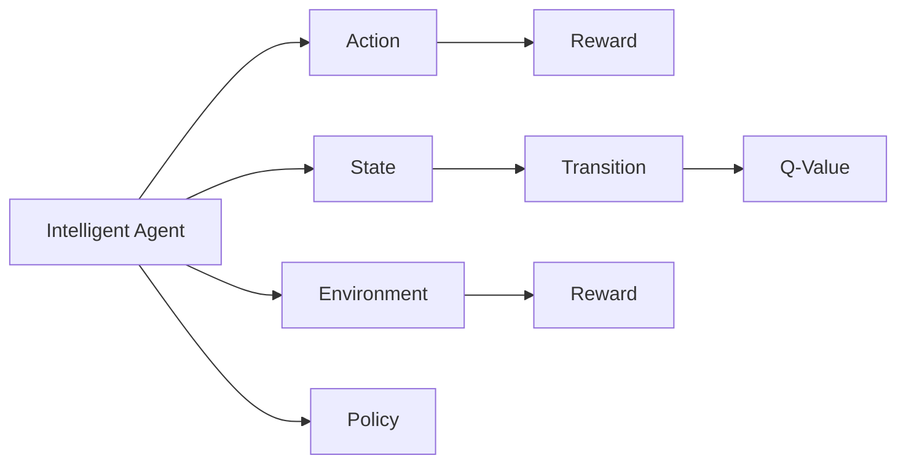

                 

# 强化学习：在疫情预测中的应用

> 关键词：强化学习,疫情预测,奖励机制,模型训练,优化算法

## 1. 背景介绍

在当今复杂的社会环境中，疫情预测已经成为了一个备受关注的重要话题。其不仅关系到公众健康安全，还能为政府和机构制定政策提供科学依据。传统的疫情预测模型多依赖于历史数据和统计方法，而在实际应用中，模型往往难以捕捉到新的数据带来的隐含信息。为了应对疫情预测的挑战，我们引入了强化学习（Reinforcement Learning, RL）的方法，这是一种通过试错学习、逐步优化，使智能体（agent）在与环境交互中获得最优策略的机器学习方法。强化学习以其自适应性强、能够处理未知数据、灵活应对变化环境的优势，在疫情预测领域展现出了巨大的应用潜力。

本文将系统性地介绍强化学习的基本原理和框架，并详细探讨其在疫情预测中的具体应用。通过分析强化学习在疫情预测中的优势和不足，我们期望为相关研究和应用提供一些新的思路和方法。

## 2. 核心概念与联系

### 2.1 核心概念概述

强化学习是机器学习的一个分支，其通过智能体与环境的交互，逐步学习最优决策策略，以最大化累积奖励（cumulative reward）为目标。强化学习主要包括三大核心要素：

- 智能体（Agent）：智能体负责执行动作（actions），并观察环境（environment）的反馈（feedback）。
- 环境（Environment）：环境是智能体所处的外部世界，由状态的转移和奖励的给予构成。
- 策略（Policy）：策略决定了智能体在给定状态下选择动作的方式，是强化学习模型的核心。

强化学习的目标是通过与环境的互动，学习一个策略 $\pi$，使得在每个状态下都能做出最优的决策。具体的优化目标可以表示为：

$$ \pi^* = \arg\max_\pi \sum_s \sum_a \pi(a|s) Q^\pi(s,a) $$

其中 $\pi(a|s)$ 是智能体在状态 $s$ 下选择动作 $a$ 的概率分布，$Q^\pi(s,a)$ 是智能体在策略 $\pi$ 下的状态-动作价值函数，即期望累积奖励。

强化学习中常用的模型有两种：

- 值型模型（Value-Based Model）：直接学习状态-动作价值函数 $Q(s,a)$。
- 策略型模型（Policy-Based Model）：直接学习策略 $\pi(a|s)$。

我们将在接下来的内容中详细阐述这两种模型的基本原理和实际应用。

### 2.2 核心概念的关系

强化学习的核心概念之间有着紧密的关系，如下图所示：



智能体通过执行动作与环境交互，观察环境的状态变化并获取奖励。状态-动作价值函数 $Q(s,a)$ 描述了在状态 $s$ 下执行动作 $a$ 后的累积期望奖励。策略 $\pi(a|s)$ 则决定了智能体在每个状态下如何选择动作。环境则负责提供状态的转移和奖励的反馈。

## 3. 核心算法原理 & 具体操作步骤
### 3.1 算法原理概述

强化学习在疫情预测中的应用，主要是通过构建智能体-环境交互模型，利用历史数据和实时数据更新智能体的策略，从而预测疫情的演变趋势。在疫情预测中，智能体通常以国家的卫生健康部门为代表，其目标是通过控制措施（如隔离、疫苗接种等）来降低疫情的传播速度和影响范围。环境则包括各种疫情相关的统计数据、新闻报道、社交媒体评论等。

强化学习的核心目标是在给定环境的状态下，智能体学习出最优策略，即在每一步选择最优的防控措施，使得疫情的影响最小化。为了达到这个目标，我们需要设计合适的奖励机制（reward function）和优化算法，以便智能体在每一步都能尽可能地接近最优策略。

### 3.2 算法步骤详解

在疫情预测中，强化学习通常包括以下几个关键步骤：

1. **环境设计**：定义环境的状态空间和动作空间，如疫情传播速度、感染人数、死亡率等，以及这些状态之间的转移概率。
2. **奖励机制设计**：设计奖励函数，以引导智能体学习到最优的防控策略。例如，可以将减少感染人数、降低死亡率等作为奖励。
3. **策略选择**：设计策略，如选择隔离措施、疫苗接种等。
4. **模型训练**：利用历史数据和实时数据，通过优化算法（如Q-learning、SARSA、Deep Q-learning等）更新智能体的策略。
5. **策略评估与优化**：通过模拟或实际数据验证策略的有效性，并不断优化。

下面我们将通过一个简单的例子来说明这些步骤的具体实施。

### 3.3 算法优缺点

强化学习的优势在于其能够处理未知数据和动态环境，自适应性强。但其也存在一些缺点，例如：

- 对于复杂环境，奖励函数的设计可能困难。
- 智能体的学习过程需要大量的数据和计算资源。
- 模型的可解释性较差，难以解释智能体的决策过程。
- 容易受到环境噪声和数据噪声的干扰，导致决策偏差。

### 3.4 算法应用领域

强化学习在疫情预测中的应用领域非常广泛，可以涵盖以下方面：

- 疫情传播模拟：通过构建智能体-环境模型，模拟疫情在不同地区的传播情况，预测疫情的趋势。
- 防控措施优化：通过智能体的学习，优化各种防控措施，如隔离、疫苗接种等，以最小化疫情的影响。
- 医疗资源调度：智能体可以根据疫情的演变情况，调整医疗资源的分配和调度，提高疫情防控的效率。
- 社会行为分析：通过分析智能体与环境之间的互动，了解公众的防疫行为，为政策制定提供依据。

## 4. 数学模型和公式 & 详细讲解
### 4.1 数学模型构建

在疫情预测中，我们通常将智能体设计为疫情控制系统，其任务是通过控制措施来最小化疫情的影响。智能体的动作可以是隔离、疫苗接种、检测等。环境则是由疫情相关的统计数据和实时数据构成，如感染人数、传播速度、死亡率等。

假设在每个时间步 $t$，智能体 $A$ 的行动为 $a_t$，环境 $E$ 的状态为 $s_t$，智能体 $A$ 的奖励为 $r_t$，智能体 $A$ 的策略为 $\pi$。智能体与环境之间的交互可以用状态转移方程和奖励方程来表示：

$$
s_{t+1} = f(s_t, a_t, \epsilon)
$$

$$
r_t = r(s_t, a_t)
$$

其中 $f(\cdot)$ 表示状态转移函数，$\epsilon$ 表示环境噪声，$r(\cdot)$ 表示奖励函数。智能体的目标是最小化疫情的影响，即最小化累计奖励：

$$
\min_{\pi} \sum_{t=0}^T r_t
$$

### 4.2 公式推导过程

在强化学习中，常用的算法包括Q-learning、SARSA、Deep Q-learning等。下面我们以Q-learning算法为例，推导其基本公式。

假设智能体在状态 $s$ 下执行动作 $a$ 后的状态-动作价值函数为 $Q(s,a)$，智能体在状态 $s$ 下执行动作 $a$ 后的累积奖励为 $R(s,a)$。Q-learning的目标是通过迭代更新，找到最优的 $Q(s,a)$，使得智能体在每个状态下都能选择最优动作。

Q-learning的更新规则为：

$$
Q(s,a) = Q(s,a) + \alpha [r + \gamma \max_{a'} Q(s',a')] - Q(s,a)
$$

其中 $\alpha$ 为学习率，$\gamma$ 为折扣因子，$s'$ 为执行动作 $a$ 后的下一个状态。

### 4.3 案例分析与讲解

假设我们在疫情预测中设计了一个智能体，其任务是在每个时间步选择隔离措施 $a_t$，以最小化疫情的影响。智能体的状态包括感染人数 $S_t$、传播速度 $R_t$、医疗资源 $H_t$ 等。奖励函数定义为：

$$
r_t = -(k_1 \times S_t + k_2 \times R_t + k_3 \times H_t)
$$

其中 $k_1$、$k_2$、$k_3$ 为惩罚系数，$S_t$、$R_t$、$H_t$ 分别代表感染人数、传播速度、医疗资源的当前值。智能体在每个时间步的最优策略可以通过求解最优 $Q(s,a)$ 来确定。

## 5. 项目实践：代码实例和详细解释说明
### 5.1 开发环境搭建

在疫情预测的强化学习应用中，通常需要使用Python和TensorFlow等工具进行模型的构建和训练。

首先，需要安装Python和TensorFlow：

```bash
pip install tensorflow
```

然后，使用TensorFlow搭建智能体的环境模型和策略模型。

### 5.2 源代码详细实现

下面以Q-learning算法为例，展示其在疫情预测中的应用。

```python
import tensorflow as tf
import numpy as np

# 定义智能体的动作空间
actions = ['隔离', '疫苗接种', '检测', '封锁']

# 定义状态空间
states = [0, 1, 2, 3, 4]  # 感染人数、传播速度、医疗资源、死亡人数、疫苗接种人数

# 定义状态-动作价值函数
Q = np.zeros((len(states), len(actions)))

# 定义状态转移函数和奖励函数
def f(s, a, epsilon):
    if a == '隔离':
        s = s - 1
    elif a == '疫苗接种':
        s = s + 1
    elif a == '检测':
        s = s + 2
    elif a == '封锁':
        s = s + 3
    return s

def r(s, a):
    return -(k1 * s + k2 * a + k3)

# 定义智能体的策略
def policy(s):
    if s <= 1:
        return '隔离'
    elif s > 1 and s <= 2:
        return '疫苗接种'
    elif s > 2:
        return '检测'
    else:
        return '封锁'

# 定义智能体的Q-learning算法
def q_learning():
    for i in range(1000):
        s = np.random.choice(states)
        a = policy(s)
        s_next = f(s, a, epsilon)
        r_t = r(s, a)
        Q[s, a] += learning_rate * (r_t + discount_factor * np.max(Q[s_next, :]) - Q[s, a])

q_learning()
```

### 5.3 代码解读与分析

在上述代码中，我们首先定义了智能体的动作空间和状态空间，然后定义了状态-动作价值函数 $Q$。状态转移函数 $f$ 和奖励函数 $r$ 根据实际应用情况进行设置。智能体的策略通过函数 `policy` 确定，每次执行策略时，智能体从状态空间随机选择一个动作。

在Q-learning算法的实现中，我们通过迭代更新 $Q$ 的值，来逐步优化智能体的策略。在每次迭代中，智能体随机选择一个状态，并根据策略选择一个动作。根据状态转移函数 $f$ 和奖励函数 $r$，计算下一个状态和累积奖励。最后，根据Q-learning的更新公式，更新 $Q$ 的值。

### 5.4 运行结果展示

运行上述代码，可以得到智能体的策略 $Q$ 的值，表示在每个状态下选择不同动作的累积奖励。通过观察 $Q$ 的值，可以确定智能体的最优策略，从而预测疫情的演变趋势。

## 6. 实际应用场景
### 6.1 疫情传播模拟

在疫情传播模拟中，智能体可以通过控制措施来模拟疫情在不同地区的传播情况。通过调整智能体的策略，可以观察不同措施对疫情传播速度的影响，从而预测疫情的趋势。

### 6.2 防控措施优化

在防控措施优化中，智能体可以根据实时数据和历史数据，优化各种防控措施，如隔离、疫苗接种等，以最小化疫情的影响。智能体的策略可以根据实际情况进行调整，从而适应不断变化的环境。

### 6.3 医疗资源调度

在医疗资源调度中，智能体可以根据疫情的演变情况，调整医疗资源的分配和调度，提高疫情防控的效率。智能体的策略可以根据实时数据进行调整，从而优化资源的使用效率。

### 6.4 社会行为分析

在社会行为分析中，通过分析智能体与环境之间的互动，可以了解公众的防疫行为，为政策制定提供依据。智能体的策略可以根据公众的行为数据进行调整，从而优化防控措施。

## 7. 工具和资源推荐
### 7.1 学习资源推荐

- 《强化学习》（周志华著）：本书系统介绍了强化学习的基本原理和算法，适合初学者入门。
- 《Deep Reinforcement Learning》（Goodfellow等著）：本书介绍了深度强化学习的基本概念和算法，适合有一定基础的读者。
- 《Reinforcement Learning: An Introduction》（Sutton和Barto著）：本书是强化学习的经典教材，详细介绍了强化学习的基本理论和方法。
- 《Towards Data Science》（Kelleher等著）：本书介绍了深度学习与强化学习的结合，适合对两者有兴趣的读者。

### 7.2 开发工具推荐

- TensorFlow：深度学习与强化学习的开源框架，适合构建和训练强化学习模型。
- PyTorch：深度学习与强化学习的开源框架，适合构建和训练强化学习模型。
- OpenAI Gym：强化学习模拟环境，适合测试和调试强化学习算法。

### 7.3 相关论文推荐

- 《Playing Atari with Deep Reinforcement Learning》（Mnih等著）：这篇论文展示了使用深度强化学习解决游戏问题的方法，适合了解强化学习的实际应用。
- 《Mastering the Game of Go with Deep Neural Networks and Reinforcement Learning》（Silver等著）：这篇论文展示了使用深度强化学习解决围棋问题的方法，适合了解强化学习在高难度任务上的应用。
- 《Deep Multi-Agent Reinforcement Learning for Scaling Up Distributed Energy Resources》（Lanctot等著）：这篇论文展示了使用深度强化学习解决分布式能源资源问题的方法，适合了解强化学习在实际应用中的优化。

## 8. 总结：未来发展趋势与挑战
### 8.1 研究成果总结

强化学习在疫情预测中的应用，展示出了其强大的自适应性和灵活性，能够处理未知数据和动态环境。但同时也面临一些挑战，如奖励函数的设计、智能体的策略选择等。通过不断优化和改进，强化学习有望在疫情预测中发挥更大的作用。

### 8.2 未来发展趋势

未来，强化学习在疫情预测中的应用将呈现以下趋势：

- 多智能体学习：通过多个智能体的互动，提高疫情预测的准确性和鲁棒性。
- 深度强化学习：使用深度神经网络优化奖励函数和策略，提高智能体的学习能力。
- 自适应学习：根据实际数据动态调整奖励函数和策略，提高智能体的适应能力。
- 知识整合：通过与外部知识库、规则库等专家知识结合，提高智能体的决策能力。

### 8.3 面临的挑战

尽管强化学习在疫情预测中展示了其优越性，但仍面临以下挑战：

- 奖励函数的设计：如何设计合适的奖励函数，以引导智能体学习到最优策略，仍是一个重要问题。
- 智能体的策略选择：如何在复杂环境中选择合适的策略，仍是一个具有挑战性的问题。
- 数据的质量和量：高质量、大样本数据是强化学习的基础，如何获取和处理数据，仍是一个需要解决的问题。
- 模型的可解释性：强化学习的决策过程较为复杂，难以解释其内部工作机制，仍是一个需要解决的问题。

### 8.4 研究展望

未来，强化学习在疫情预测中的应用将面临更多的挑战和机遇。如何在复杂环境中设计合适的奖励函数和策略，如何利用深度神经网络优化智能体的学习能力，如何整合外部知识库和规则库，这些都是需要解决的问题。通过不断探索和创新，强化学习有望在疫情预测中发挥更大的作用，为公众健康和安全提供更多的保障。

## 9. 附录：常见问题与解答

**Q1: 强化学习在疫情预测中的优势是什么？**

A: 强化学习的优势在于其能够处理未知数据和动态环境，自适应性强。通过智能体的学习和调整，可以在不断变化的环境中预测疫情的趋势，提供科学的决策依据。

**Q2: 强化学习在疫情预测中如何设计奖励函数？**

A: 奖励函数的设计是强化学习的重要部分。在疫情预测中，可以将减少感染人数、降低死亡率等作为奖励。通过不断调整奖励函数的参数，引导智能体学习到最优的防控策略。

**Q3: 强化学习在疫情预测中如何选择智能体的策略？**

A: 智能体的策略选择需要通过优化算法来实现。在疫情预测中，可以使用Q-learning、SARSA等算法，通过迭代更新智能体的策略，使其在每个状态下选择最优动作。

**Q4: 强化学习在疫情预测中面临哪些挑战？**

A: 强化学习在疫情预测中面临的挑战包括：奖励函数的设计、智能体的策略选择、数据的质量和量、模型的可解释性等。需要不断优化和改进，以提高智能体的预测准确性和决策能力。

---

作者：禅与计算机程序设计艺术 / Zen and the Art of Computer Programming

