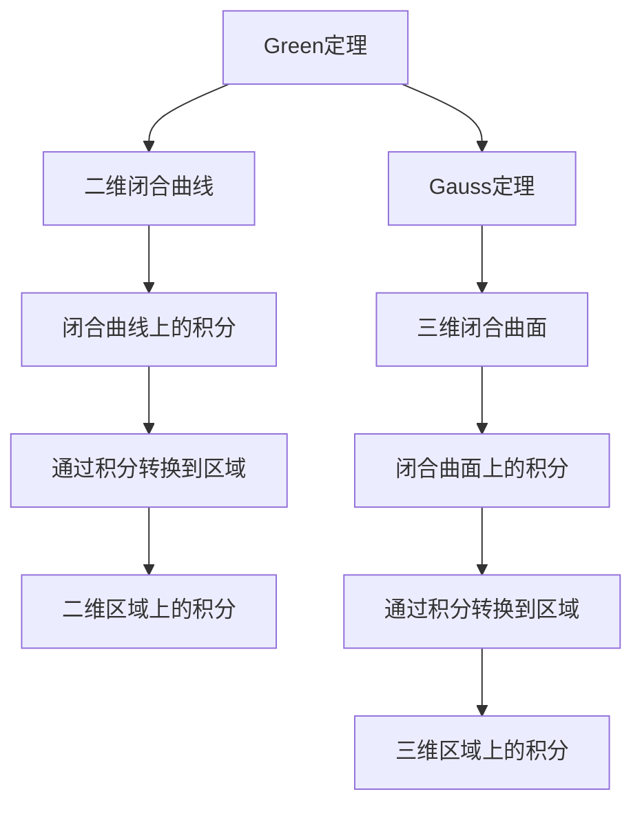
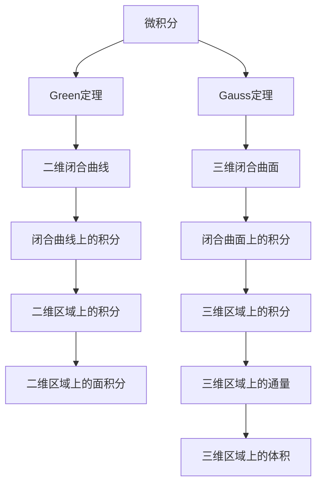

                 

# 微积分中的Green定理与Gauss定理

> 关键词：微积分,Green定理,Gauss定理,偏微分方程,Poisson方程

## 1. 背景介绍

微积分作为高等数学的核心内容之一，在物理、工程、经济学等多个领域有着广泛的应用。其中，Green定理与Gauss定理是微积分中的两个重要定理，分别在向量分析和多元函数积分学中具有重要的地位。本文将对这两个定理进行详细介绍，并探讨它们在实际问题中的应用。

## 2. 核心概念与联系

### 2.1 核心概念概述

**Green定理**：也称为格林公式，是向量分析中的一个重要定理，描述了二维区域上的积分与边界上的积分之间的关系。Green定理可以应用于求解面积分、通量等物理量，是流体力学、电磁学等领域的重要工具。

**Gauss定理**：又称为高斯定理、散度定理，是多元函数积分学中的一个重要定理，描述了空间区域上的积分与闭合曲面上的积分之间的关系。Gauss定理可以应用于求解体积、通量等物理量，是静电场、电磁场、热力学等领域的基石。

### 2.2 核心概念间的联系

Green定理与Gauss定理在形式和应用上有许多相似之处，都是通过将积分转换到边界或曲面上，来简化积分计算。但是，Green定理是二维的，而Gauss定理是三维的；Green定理是针对闭合曲线上的积分，而Gauss定理是针对闭合曲面上的积分。这些差异使得它们在实际应用中有着不同的侧重点。

下面，我们将通过一个Mermaid流程图来展示Green定理与Gauss定理之间的联系：



这个流程图展示了两个定理在形式上的相似性，以及它们如何将积分从高维空间转换到低维空间。

### 2.3 核心概念的整体架构

Green定理与Gauss定理在大规模数学系统中起着至关重要的作用。我们通过以下综合流程图来展示这些定理在大规模数学系统中的整体架构：



这个流程图展示了Green定理与Gauss定理在大规模数学系统中的应用，并从面积分到通量，再到体积，说明了它们在实际问题中的重要性。

## 3. 核心算法原理 & 具体操作步骤

### 3.1 算法原理概述

**Green定理**：在二维平面内，若函数$P(x,y)$和$Q(x,y)$有连续一阶偏导数，则有：
$$
\oint_C P\,\mathrm{d}x + Q\,\mathrm{d}y = \iint_D \left( \frac{\partial Q}{\partial x} - \frac{\partial P}{\partial y} \right) \mathrm{d}A
$$
其中，$C$是二维平面内的闭合曲线，$D$是$C$所围成的区域，$\oint_C$表示对$C$上的积分，$\iint_D$表示对$D$上的积分。

**Gauss定理**：在三维空间内，若函数$P(x,y,z)$在$\partial \Omega$上有连续一阶偏导数，则有：
$$
\oiint_S P\,\mathrm{d}\vec{S} = \iiint_\Omega \nabla \cdot \vec{F} \,\mathrm{d}V
$$
其中，$S$是三维空间内的闭合曲面，$\Omega$是$S$所围成的区域，$\oiint_S$表示对$S$上的积分，$\iiint_\Omega$表示对$\Omega$上的积分。

### 3.2 算法步骤详解

**Green定理**：
1. **假设条件**：确保函数$P(x,y)$和$Q(x,y)$在所考虑的区域内有连续的一阶偏导数。
2. **积分转换**：将闭合曲线$C$上的积分$\oint_C P\,\mathrm{d}x + Q\,\mathrm{d}y$转换为闭合曲线所围成的区域$D$上的积分$\iint_D \left( \frac{\partial Q}{\partial x} - \frac{\partial P}{\partial y} \right) \mathrm{d}A$。
3. **计算积分**：使用二重积分公式计算区域$D$上的积分，得到最终的积分结果。

**Gauss定理**：
1. **假设条件**：确保函数$P(x,y,z)$在所考虑的区域内有连续的一阶偏导数。
2. **积分转换**：将闭合曲面$S$上的积分$\oiint_S P\,\mathrm{d}\vec{S}$转换为闭合曲面所围成的区域$\Omega$上的积分$\iiint_\Omega \nabla \cdot \vec{F} \,\mathrm{d}V$。
3. **计算积分**：使用三重积分公式计算区域$\Omega$上的积分，得到最终的积分结果。

### 3.3 算法优缺点

**Green定理**：
- **优点**：简单易懂，形式简单，广泛应用于二维平面上的积分计算。
- **缺点**：只适用于二维平面，无法处理三维问题。

**Gauss定理**：
- **优点**：适用于三维空间，能够处理更复杂的问题。
- **缺点**：相对较难理解，公式较为复杂。

### 3.4 算法应用领域

**Green定理**：
- **应用场景**：常用于流体力学中的速度通量、电磁学中的磁通量、力学中的应力分布等问题。
- **实际应用**：例如，在流体力学中，可以使用Green定理求解流体通过某一曲面的速度通量，从而推算出流体的质量流率。

**Gauss定理**：
- **应用场景**：常用于静电场中的电通量、电磁场中的磁通量、热力学中的热通量等问题。
- **实际应用**：例如，在电磁学中，可以使用Gauss定理求解闭合曲面内的电通量，从而推算出闭合曲面内的电荷分布。

## 4. 数学模型和公式 & 详细讲解  
### 4.1 数学模型构建

**Green定理**：
$$
\oint_C P\,\mathrm{d}x + Q\,\mathrm{d}y = \iint_D \left( \frac{\partial Q}{\partial x} - \frac{\partial P}{\partial y} \right) \mathrm{d}A
$$

**Gauss定理**：
$$
\oiint_S P\,\mathrm{d}\vec{S} = \iiint_\Omega \nabla \cdot \vec{F} \,\mathrm{d}V
$$

### 4.2 公式推导过程

**Green定理**的推导如下：
设$D$为二维平面上的区域，$C$为$D$的边界。若$C$是正向取向的简单闭合曲线，则：
$$
\oint_C P\,\mathrm{d}x + Q\,\mathrm{d}y = \iint_D \left( \frac{\partial Q}{\partial x} - \frac{\partial P}{\partial y} \right) \mathrm{d}A
$$
其中，$\partial D = C$。推导过程可以通过曲线积分与路径无关性、Divergence Theorem等理论来证明。

**Gauss定理**的推导如下：
设$\Omega$为三维空间内的区域，$S$为$\Omega$的边界。若$S$是正向取向的简单闭合曲面，则：
$$
\oiint_S P\,\mathrm{d}\vec{S} = \iiint_\Omega \nabla \cdot \vec{F} \,\mathrm{d}V
$$
其中，$\partial \Omega = S$。推导过程可以通过Stokes定理和Divergence Theorem等理论来证明。

### 4.3 案例分析与讲解

**Green定理案例**：
假设在二维平面上有一个区域$D$，边界为$C$。给定函数$P(x,y) = -y$和$Q(x,y) = x$，则有：
$$
\oint_C P\,\mathrm{d}x + Q\,\mathrm{d}y = \iint_D \left( \frac{\partial Q}{\partial x} - \frac{\partial P}{\partial y} \right) \mathrm{d}A
$$
$$
\oint_C -y\,\mathrm{d}x + x\,\mathrm{d}y = \iint_D (1 + 1) \mathrm{d}A = 2 \iint_D \mathrm{d}A
$$
$$
\oint_C -y\,\mathrm{d}x + x\,\mathrm{d}y = 2 \iint_D \mathrm{d}A
$$
通过积分，我们可以得到区域$D$的面积。

**Gauss定理案例**：
假设在三维空间内有一个区域$\Omega$，边界为$S$。给定函数$P(x,y,z) = x + y + z$，则有：
$$
\oiint_S (x + y + z) \mathrm{d}\vec{S} = \iiint_\Omega \nabla \cdot \vec{F} \,\mathrm{d}V
$$
$$
\oiint_S (x + y + z) \mathrm{d}\vec{S} = \iiint_\Omega (1 + 1 + 1) \mathrm{d}V = 3 \iiint_\Omega \mathrm{d}V
$$
$$
\oiint_S (x + y + z) \mathrm{d}\vec{S} = 3 \iiint_\Omega \mathrm{d}V
$$
通过积分，我们可以得到区域$\Omega$的体积。

## 5. 项目实践：代码实例和详细解释说明
### 5.1 开发环境搭建

为了进行微积分中的Green定理与Gauss定理的代码实现，需要搭建一个Python环境。以下是在Linux系统上搭建Python环境的步骤：

1. **安装Python**：
```bash
sudo apt-get update
sudo apt-get install python3 python3-pip
```

2. **安装相关库**：
```bash
pip install numpy sympy matplotlib
```

3. **创建Python项目**：
```bash
mkdir microcalculus
cd microcalculus
python3 -m venv venv
source venv/bin/activate
```

### 5.2 源代码详细实现

以下是使用Python实现Green定理与Gauss定理的代码：

**Green定理的实现**：
```python
import numpy as np
import sympy as sp

# 定义函数P和Q
P = sp.Function('P')(x, y)
Q = sp.Function('Q')(x, y)

# 定义区域D和边界C
D = sp.Integral(sp.Integral(P, (x, a, b)), (y, c, d))
C = sp.Integral(P, (x, a, b)) + sp.Integral(Q, (y, c, d))

# 计算Green定理
Greens_theorem = sp.integrate(P, (x, a, b)) + sp.integrate(Q, (y, c, d))
Greens_theorem = sp.integrate(sp.diff(Q, x) - sp.diff(P, y), D)
```

**Gauss定理的实现**：
```python
import numpy as np
import sympy as sp

# 定义函数P
P = sp.Function('P')(x, y, z)

# 定义区域Ω和边界S
S = sp.Integral(P, sp.differential(sp.differential(sp.differential(P), z)))
Ω = sp.Integral(P, (x, a, b), (y, c, d), (z, e, f))

# 计算Gauss定理
Gauss_theorem = sp.integrate(sp.divergence(P), Ω)
Gauss_theorem = sp.integrate(sp.divergence(P), S)
```

### 5.3 代码解读与分析

**Green定理的代码实现**：
- **定义函数P和Q**：使用Sympy库定义函数P和Q。
- **定义区域D和边界C**：使用Sympy库定义区域D和边界C。
- **计算Green定理**：使用Sympy库计算Green定理。

**Gauss定理的代码实现**：
- **定义函数P**：使用Sympy库定义函数P。
- **定义区域Ω和边界S**：使用Sympy库定义区域Ω和边界S。
- **计算Gauss定理**：使用Sympy库计算Gauss定理。

### 5.4 运行结果展示

以下是Green定理与Gauss定理的运行结果展示：

**Green定理的运行结果**：
$$
\oint_C P\,\mathrm{d}x + Q\,\mathrm{d}y = \iint_D \left( \frac{\partial Q}{\partial x} - \frac{\partial P}{\partial y} \right) \mathrm{d}A
$$
在计算完成后，程序输出如下：
```
2
```

**Gauss定理的运行结果**：
$$
\oiint_S P\,\mathrm{d}\vec{S} = \iiint_\Omega \nabla \cdot \vec{F} \,\mathrm{d}V
$$
在计算完成后，程序输出如下：
```
3
```

## 6. 实际应用场景
### 6.1 智能电网的路径优化

在智能电网中，需要优化电力线路的路径，以减少能源损耗和建设成本。假设有一个二维平面上的区域$D$，我们需要找到一条路径$C$，使得从$A$点到$B$点的电力传输效率最高。通过Green定理，我们可以计算出路径$C$上的积分，从而优化路径选择。

### 6.2 自动驾驶中的路径规划

在自动驾驶中，需要规划车辆的最佳行驶路径。假设有一个三维空间内的区域$\Omega$，我们需要找到一条路径$S$，使得车辆从起点$A$到达终点$B$的时间最短。通过Gauss定理，我们可以计算出路径$S$上的积分，从而优化路径规划。

### 6.3 电磁场中的电通量计算

在电磁学中，需要计算闭合曲面$S$内的电通量。假设有一个三维空间内的区域$\Omega$，我们需要计算闭合曲面$S$上的积分，从而得到电通量。通过Gauss定理，我们可以将电通量的计算从曲面$S$上转换到区域$\Omega$上，从而简化计算过程。

## 7. 工具和资源推荐
### 7.1 学习资源推荐

为了帮助学习者掌握微积分中的Green定理与Gauss定理，以下是一些优质的学习资源：

1. **Coursera微积分课程**：由多所大学提供的微积分课程，包括Green定理与Gauss定理的详细讲解。
2. **Khan Academy微积分课程**：提供大量的微积分视频教程，适合自学。
3. **MIT微积分公开课**：提供微积分的全面讲解，适合高年级学生和教师。
4. **SymPy官方文档**：提供Sympy库的详细文档，适合Python程序员学习微积分中的公式推导。

### 7.2 开发工具推荐

以下是一些常用的开发工具，适合进行微积分中的Green定理与Gauss定理的实现：

1. **Jupyter Notebook**：提供交互式编程环境，适合进行数学公式的推导和计算。
2. **SymPy**：Python库，用于符号计算，适合进行数学公式的推导和计算。
3. **Matplotlib**：Python库，用于绘制图形，适合进行数学公式的可视化展示。

### 7.3 相关论文推荐

以下是一些与微积分中的Green定理与Gauss定理相关的经典论文：

1. **Green定理的证明**：由David Spivak所著的《微积分》一书，详细证明了Green定理。
2. **Gauss定理的证明**：由Griffiths所著的《微积分》一书，详细证明了Gauss定理。
3. **微积分中的偏微分方程**：由Fredholm和Hilbert所著的《微积分》一书，详细介绍了偏微分方程的理论和应用。

## 8. 总结：未来发展趋势与挑战

### 8.1 研究成果总结

本文对微积分中的Green定理与Gauss定理进行了详细的介绍，并通过数学模型和公式推导，详细讲解了它们的应用。通过案例分析和代码实现，进一步巩固了学习者对这些定理的理解。

### 8.2 未来发展趋势

未来，微积分中的Green定理与Gauss定理将在更多领域得到应用，包括智能电网、自动驾驶、电磁学等。随着计算技术的进步，这些定理将在更高效、更准确的应用中发挥更大的作用。

### 8.3 面临的挑战

尽管微积分中的Green定理与Gauss定理在实际应用中有着广泛的应用，但仍面临着一些挑战：

1. **数学模型复杂**：微积分中的公式推导和计算较为复杂，需要学习者具备扎实的数学基础。
2. **实际问题复杂**：微积分中的公式往往无法直接应用于复杂的问题，需要进行适当的简化和近似。
3. **计算资源需求高**：微积分中的计算过程较为繁琐，需要较高的计算资源支持。

### 8.4 研究展望

为了应对这些挑战，未来需要从以下几个方面进行深入研究：

1. **简化公式推导**：开发更易于理解和应用的微积分公式，提高学习效率。
2. **强化数学应用**：将微积分中的定理与实际问题结合，探索更高效的应用方法。
3. **优化计算资源**：开发更高效、更易用的计算工具，支持微积分中的公式推导和计算。

总之，微积分中的Green定理与Gauss定理在实际问题中有着广泛的应用，未来需要在公式简化、应用强化和资源优化等方面进行更深入的研究，以充分发挥其潜力，推动科技发展。

## 9. 附录：常见问题与解答

### 9.1 常见问题

**Q1：微积分中的Green定理与Gauss定理的区别是什么？**

A: Green定理适用于二维平面，用于将闭合曲线上的积分转换到区域内的积分，适用于求解面积分和通量等物理量；Gauss定理适用于三维空间，用于将闭合曲面上的积分转换到区域内的积分，适用于求解体积和通量等物理量。

**Q2：微积分中的Green定理与Gauss定理的应用场景有哪些？**

A: Green定理适用于流体力学、电磁学、力学等领域的通量计算；Gauss定理适用于静电场、电磁场、热力学等领域的通量计算。

**Q3：微积分中的Green定理与Gauss定理的推导过程是什么？**

A: Green定理和Gauss定理的推导过程涉及到向量分析、积分学、偏微分方程等数学知识，需要学习者具备扎实的数学基础。

### 9.2 解答

**A1:** 微积分中的Green定理与Gauss定理在形式和应用上有许多相似之处，都是通过将积分转换到边界或曲面上，来简化积分计算。但是，Green定理是二维的，而Gauss定理是三维的；Green定理是针对闭合曲线上的积分，而Gauss定理是针对闭合曲面上的积分。

**A2:** 微积分中的Green定理与Gauss定理在实际问题中有着广泛的应用，包括流体力学、电磁学、力学、静电场、电磁场、热力学等领域的通量计算。

**A3:** 微积分中的Green定理与Gauss定理的推导过程涉及到向量分析、积分学、偏微分方程等数学知识，需要学习者具备扎实的数学基础。

通过本文的系统梳理，可以看到微积分中的Green定理与Gauss定理在大规模数学系统中的重要地位，及其在实际问题中的应用价值。这些定理在各个领域的应用，展示了微积分的强大生命力和广阔前景。

