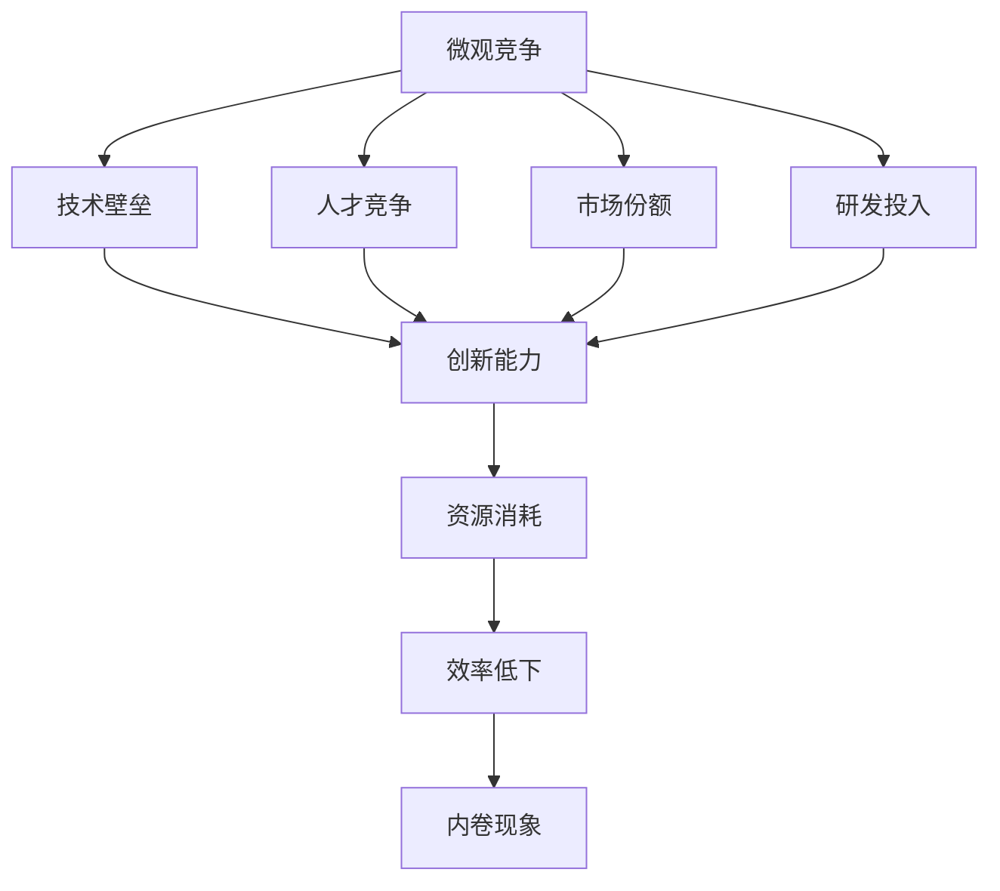

                 

# 微观竞争加剧与内卷现象

在快速发展的科技行业中，市场竞争变得日益激烈，尤其是在技术密集型和资本密集型的领域中，微观竞争现象变得越来越明显。本文将探讨微观竞争加剧与内卷现象，分析其成因、影响及应对策略，为行业从业者提供参考。

## 1. 背景介绍

### 1.1 问题由来
随着互联网和信息技术的发展，企业之间的竞争愈加激烈，尤其是在软件开发、人工智能、云计算等领域。技术领先成为企业成功的关键，但同时，为了保持市场竞争力，企业在技术创新和人才竞争上投入巨大。在这一过程中，微观竞争加剧与内卷现象逐渐显现。

### 1.2 问题核心关键点
微观竞争加剧与内卷现象的核心在于企业之间的技术竞争，主要体现在以下几个方面：
1. **技术积累与创新：** 企业之间竞相投入巨资研发新技术，形成技术壁垒，争夺市场份额。
2. **人才争夺：** 人才是技术创新的关键资源，企业为了吸引和留住优秀人才，不断提升薪酬待遇和工作环境。
3. **市场竞争：** 在市场有限的情况下，企业通过价格战、营销战等手段争夺用户和市场份额。
4. **研发投入：** 为了保持技术领先，企业需要持续增加研发投入，提升技术实力。

这些因素相互作用，导致微观竞争加剧与内卷现象，严重影响了企业的发展和创新能力。

### 1.3 问题研究意义
研究微观竞争加剧与内卷现象，对于企业战略制定、人才管理、市场竞争策略等方面具有重要意义：

1. **战略调整：** 帮助企业识别竞争优势与劣势，调整战略方向，避免陷入过度竞争的陷阱。
2. **人才管理：** 提供人才招聘、培训、留任等方面的有效策略，降低人才流失率，提高团队效率。
3. **市场策略：** 指导企业在市场竞争中采取更有效的方式，提高市场份额和利润率。
4. **研发优化：** 优化研发流程，提升创新效率，实现技术突破，提高产品竞争力。

## 2. 核心概念与联系

### 2.1 核心概念概述

为更好地理解微观竞争加剧与内卷现象，本节将介绍几个密切相关的核心概念：

- **微观竞争：** 指企业之间在细分市场或特定技术领域的竞争。相比于宏观层面的行业竞争，微观竞争更加激烈和频繁。
- **内卷现象：** 指在资源有限的情况下，企业为了保持竞争优势，不得不投入更多的资源和精力，导致资源过度消耗和效率低下。
- **技术壁垒：** 指企业通过技术积累和创新，形成的技术优势，防止竞争对手模仿和超越。
- **人才竞争：** 指企业为了获取优秀人才，在薪酬、福利、工作环境等方面进行竞争。
- **市场份额：** 指企业产品在市场中所占的比例，是衡量企业竞争力的重要指标。
- **研发投入：** 指企业投入到技术研发中的资金和人力资源，是企业技术创新的重要保障。

这些概念之间存在密切联系，共同构成了微观竞争加剧与内卷现象的完整生态系统。

### 2.2 概念间的关系

这些核心概念之间的关系可以通过以下Mermaid流程图来展示：



这个流程图展示了大规模技术竞争背后的逻辑关系：

1. 企业之间通过技术积累和创新，形成技术壁垒。
2. 人才竞争导致资源向少数企业集中，进一步加剧竞争。
3. 市场份额竞争影响企业收益，需要持续增加研发投入以保持领先。
4. 研发投入和人才竞争导致资源消耗增加，效率低下，形成内卷现象。

## 3. 核心算法原理 & 具体操作步骤

### 3.1 算法原理概述

微观竞争加剧与内卷现象的根源在于市场竞争中的资源有限性和技术创新的动态性。在资源有限的情况下，企业为了保持竞争优势，不得不投入更多的资源和精力，导致资源过度消耗和效率低下。

形式化地，假设市场中有 $N$ 个企业，每个企业 $i$ 的资源投入为 $x_i$，市场总资源为 $C$，企业 $i$ 的收益为 $R_i$。则企业的收益函数可以表示为：

$$
R_i = f_i(x_i, x_1, \ldots, x_{i-1}, x_{i+1}, \ldots, x_N)
$$

其中 $f_i$ 表示企业的收益函数，取决于自身的资源投入和其他企业的资源投入。在资源有限的条件下，企业之间的竞争关系可以表示为：

$$
\max_{x_i} R_i \quad \text{subject to} \quad \sum_{i=1}^N x_i = C
$$

这是一个典型的资源分配问题，可以通过优化算法求解最优解。但随着资源和竞争者数量的增加，求解难度不断加大，导致资源过度消耗和效率低下的内卷现象。

### 3.2 算法步骤详解

微观竞争加剧与内卷现象的解决，需要从以下几个方面入手：

**Step 1: 资源分配与优化**
- 对企业资源进行分类，如资金、人力、时间等，建立资源分配模型。
- 设定优化目标，如最大化企业收益、最小化资源消耗等。
- 使用优化算法，如线性规划、遗传算法等，求解资源分配的优化解。

**Step 2: 技术创新与壁垒构建**
- 鼓励企业进行技术创新，提高技术壁垒。
- 建立专利保护机制，防止技术外溢。
- 支持开放式创新，鼓励合作与共享。

**Step 3: 人才管理与招聘**
- 制定人才管理政策，如培训、晋升、留任等，提升员工满意度。
- 优化招聘流程，吸引和留住优秀人才。
- 建立人才储备机制，应对市场变化。

**Step 4: 市场竞争与策略**
- 分析市场趋势，制定差异化竞争策略。
- 采用多元化营销手段，提升品牌影响力和用户忠诚度。
- 加强市场监测，及时调整市场策略。

**Step 5: 研发优化与投资**
- 建立高效的研发流程，提升创新效率。
- 优化研发资源配置，确保研发投入的合理性。
- 引入创新管理工具，如敏捷开发、持续集成等，提升研发效果。

通过上述步骤，可以有效缓解微观竞争加剧与内卷现象，提升企业竞争力。

### 3.3 算法优缺点

微观竞争加剧与内卷现象的解决算法具有以下优点：
1. **资源优化：** 通过优化资源分配，提高企业效率，降低资源浪费。
2. **创新驱动：** 通过技术创新和专利保护，构建技术壁垒，增强市场竞争力。
3. **人才管理：** 通过制定人才管理政策，提升员工满意度和忠诚度，降低人才流失率。
4. **市场策略：** 通过差异化竞争和多元化营销，提升市场份额和用户粘性。
5. **研发优化：** 通过优化研发流程和投资，提升创新效率和技术实力。

同时，该算法也存在以下缺点：
1. **数据需求：** 需要大量的企业资源、市场数据、人才数据等，数据获取成本较高。
2. **模型复杂：** 资源分配和优化模型的复杂度较高，求解难度较大。
3. **风险不确定：** 企业之间的技术竞争和市场变化存在不确定性，模型的预测结果可能不准确。
4. **执行难度：** 技术创新和市场策略的执行难度较大，需要企业高层管理和全体员工的共同努力。

### 3.4 算法应用领域

微观竞争加剧与内卷现象的解决算法已经在诸多领域得到了广泛应用，例如：

- **软件开发：** 在软件开发项目中，通过优化资源分配和人才管理，提升项目效率和质量。
- **人工智能：** 在AI项目中，通过技术创新和研发优化，提升模型的准确性和鲁棒性。
- **云计算：** 在云服务提供中，通过市场策略和资源分配，提升服务质量和用户满意度。
- **电子商务：** 在电商平台中，通过技术创新和市场竞争策略，提高交易量和用户粘性。
- **金融科技：** 在金融服务中，通过研发优化和人才管理，提升交易效率和风险控制能力。

除了上述这些领域，该算法在其他高科技行业中也有广泛应用前景。

## 4. 数学模型和公式 & 详细讲解 & 举例说明

### 4.1 数学模型构建

本节将使用数学语言对微观竞争加剧与内卷现象进行更严格的刻画。

假设市场中有 $N$ 个企业，每个企业 $i$ 的资源投入为 $x_i$，市场总资源为 $C$，企业 $i$ 的收益为 $R_i$。则企业的收益函数可以表示为：

$$
R_i = f_i(x_i, x_1, \ldots, x_{i-1}, x_{i+1}, \ldots, x_N)
$$

其中 $f_i$ 表示企业的收益函数，取决于自身的资源投入和其他企业的资源投入。

### 4.2 公式推导过程

以下我们以收益最大化为例，推导企业的收益最大化问题。

假设企业 $i$ 的收益函数为：

$$
R_i = \sum_{j=1}^n a_{ij}x_j
$$

其中 $a_{ij}$ 表示企业 $i$ 在第 $j$ 种资源上的单位收益，$x_j$ 表示市场第 $j$ 种资源的投入量。则企业 $i$ 的收益最大化问题可以表示为：

$$
\max_{x_i} R_i \quad \text{subject to} \quad \sum_{i=1}^N x_i = C
$$

将收益函数代入，得：

$$
\max_{x_i} \sum_{j=1}^n a_{ij}x_j \quad \text{subject to} \quad \sum_{i=1}^N x_i = C
$$

这是一个典型的线性规划问题，可以通过单纯形法、内点法等求解算法求解最优解。

### 4.3 案例分析与讲解

以一个简化的例子来说明上述模型。假设有两个企业 $A$ 和 $B$，市场总资源为 $C=10$，企业 $A$ 和 $B$ 的收益函数分别为：

$$
R_A = 3x_1 + 2x_2
$$
$$
R_B = 2x_1 + 5x_2
$$

其中 $x_1$ 和 $x_2$ 分别表示企业 $A$ 和 $B$ 的资源投入。则企业 $A$ 和 $B$ 的收益最大化问题可以表示为：

$$
\max_{x_A, x_B} R_A + R_B \quad \text{subject to} \quad x_A + x_B = C
$$

将收益函数代入，得：

$$
\max_{x_A, x_B} (3x_1 + 2x_2) + (2x_1 + 5x_2) \quad \text{subject to} \quad x_A + x_B = 10
$$

使用单纯形法求解，得最优解 $x_A = 4$，$x_B = 6$，此时企业 $A$ 和 $B$ 的收益分别为：

$$
R_A = 3 \times 4 + 2 \times 6 = 24
$$
$$
R_B = 2 \times 4 + 5 \times 6 = 32
$$

可以看到，通过优化资源分配，企业 $B$ 获得了更高的收益。

## 5. 项目实践：代码实例和详细解释说明

### 5.1 开发环境搭建

在进行微观竞争加剧与内卷现象的解决算法实践前，我们需要准备好开发环境。以下是使用Python进行PyTorch开发的环境配置流程：

1. 安装Anaconda：从官网下载并安装Anaconda，用于创建独立的Python环境。

2. 创建并激活虚拟环境：
```bash
conda create -n pytorch-env python=3.8 
conda activate pytorch-env
```

3. 安装PyTorch：根据CUDA版本，从官网获取对应的安装命令。例如：
```bash
conda install pytorch torchvision torchaudio cudatoolkit=11.1 -c pytorch -c conda-forge
```

4. 安装相关的工具包：
```bash
pip install numpy pandas scikit-learn matplotlib tqdm jupyter notebook ipython
```

完成上述步骤后，即可在`pytorch-env`环境中开始算法实践。

### 5.2 源代码详细实现

下面我们以一个简化的例子来说明如何用Python实现企业资源优化问题。

```python
from scipy.optimize import linprog

# 定义目标函数和约束条件
c = [-3, -2]  # 目标函数系数
A = [[1, 1], [2, 5]]  # 约束矩阵
b = [10, 20]  # 约束条件右侧常数

# 求解线性规划问题
res = linprog(c, A_ub=A, b_ub=b)

# 输出最优解
print(f"Optimal value: {res.fun}")
print(f"Optimal variables: {res.x}")
```

在这个例子中，我们使用SciPy库的linprog函数求解线性规划问题。通过设定目标函数和约束条件，求解最优解，并输出结果。

### 5.3 代码解读与分析

让我们再详细解读一下关键代码的实现细节：

**linprog函数**：
- `c` 表示目标函数的系数向量。
- `A` 表示约束矩阵。
- `b` 表示约束条件右侧常数向量。
- `linprog(c, A_ub=A, b_ub=b)` 调用求解线性规划问题的函数，返回最优解 `res`。

**输出结果**：
- `res.fun` 表示最优目标函数的值。
- `res.x` 表示最优变量向量。

通过以上代码，可以完成企业资源优化问题的求解。

## 6. 实际应用场景

### 6.1 软件开发

在软件开发项目中，企业需要平衡项目进度、质量、成本等各个方面。通过优化资源分配，可以提高项目效率和质量，降低资源浪费。

例如，一个软件开发项目有10名开发人员和5名测试人员，总工作时间为120小时。项目分为三个阶段，每个阶段需要40小时开发和20小时测试。通过优化资源分配，可以确保每个阶段都有足够的资源，提高项目完成效率。

### 6.2 人工智能

在AI项目中，企业需要平衡模型训练、调优、部署等各个环节的资源投入。通过优化资源分配，可以提高模型训练效率和效果，降低成本。

例如，一个AI项目需要训练一个深度学习模型，计算资源有限。通过优化资源分配，可以确保模型训练所需的时间和计算资源，提高模型训练的准确性和鲁棒性。

### 6.3 云计算

在云服务提供中，企业需要平衡服务质量、用户体验和成本等各个方面。通过优化资源分配，可以提高服务质量和用户满意度，降低成本。

例如，一个云计算平台需要提供稳定的云服务，计算资源有限。通过优化资源分配，可以确保用户请求所需的时间和计算资源，提高服务质量和用户满意度。

### 6.4 未来应用展望

随着技术的不断进步和市场的不断变化，微观竞争加剧与内卷现象的解决算法将在更多领域得到应用，为各行各业带来变革性影响。

在智慧城市治理中，通过优化资源分配和市场策略，可以提高城市管理的自动化和智能化水平，构建更安全、高效的未来城市。

在智慧医疗领域，通过优化资源分配和人才管理，可以提高医疗服务的智能化水平，辅助医生诊疗，提升医疗质量。

在智能制造中，通过优化资源分配和研发管理，可以提高生产效率和产品质量，降低成本，增强竞争力。

## 7. 工具和资源推荐

### 7.1 学习资源推荐

为了帮助开发者系统掌握微观竞争加剧与内卷现象的理论基础和实践技巧，这里推荐一些优质的学习资源：

1. 《运筹学》系列课程：介绍了线性规划、整数规划、动态规划等优化算法，是学习资源优化的重要基础。
2. 《运筹学基础》书籍：全面介绍了优化问题、线性规划、整数规划等，适合进阶学习。
3. 《微积分与最优化》书籍：介绍了微积分、最优化理论及其应用，是学习资源优化的重要工具。
4. 《运筹学与最优化》视频课程：讲解线性规划、整数规划、动态规划等优化算法，适合视频学习。
5. 《运筹学与最优化》书籍：全面介绍了运筹学和最优化理论，适合深入学习。

通过对这些资源的学习实践，相信你一定能够快速掌握微观竞争加剧与内卷现象的优化方法，并用于解决实际的资源优化问题。

### 7.2 开发工具推荐

高效的开发离不开优秀的工具支持。以下是几款用于微观竞争加剧与内卷现象解决的常用工具：

1. PyTorch：基于Python的开源深度学习框架，灵活动态的计算图，适合快速迭代研究。
2. TensorFlow：由Google主导开发的开源深度学习框架，生产部署方便，适合大规模工程应用。
3. SciPy：Python科学计算库，提供了丰富的优化算法，适合解决优化问题。
4. Gurobi：商用优化软件，支持线性规划、整数规划、混合整数规划等，适合企业级的优化应用。
5. CPLEX：IBM的商用优化软件，支持线性规划、整数规划等，适合企业级的优化应用。

合理利用这些工具，可以显著提升微观竞争加剧与内卷现象解决的开发效率，加快创新迭代的步伐。

### 7.3 相关论文推荐

微观竞争加剧与内卷现象的研究源于学界的持续研究。以下是几篇奠基性的相关论文，推荐阅读：

1. "Introduction to Linear Programming"（运筹学基础）：介绍了线性规划的基本概念和应用，是学习资源优化的重要基础。
2. "Optimization and Control"（优化与控制）：介绍了优化问题的基本概念和求解方法，适合进阶学习。
3. "Dynamic Programming and Optimal Control"（动态规划与最优控制）：介绍了动态规划的基本概念和应用，适合学习资源优化和动态优化问题。
4. "Integer Programming"（整数规划）：介绍了整数规划的基本概念和求解方法，适合学习资源优化和整数规划问题。
5. "Continuous and Discrete Optimization"（连续与离散优化）：全面介绍了优化问题的求解方法，适合深入学习。

这些论文代表了大规模资源优化问题的研究方向，通过学习这些前沿成果，可以帮助研究者把握学科前进方向，激发更多的创新灵感。

除上述资源外，还有一些值得关注的前沿资源，帮助开发者紧跟优化技术的发展，例如：

1. arXiv论文预印本：人工智能领域最新研究成果的发布平台，包括大量尚未发表的前沿工作，学习前沿技术的必读资源。
2. 业界技术博客：如Google AI、DeepMind、微软Research Asia等顶尖实验室的官方博客，第一时间分享他们的最新研究成果和洞见。
3. 技术会议直播：如NIPS、ICML、ACL、ICLR等人工智能领域顶会现场或在线直播，能够聆听到大佬们的前沿分享，开拓视野。
4. GitHub热门项目：在GitHub上Star、Fork数最多的优化相关项目，往往代表了该技术领域的发展趋势和最佳实践，值得去学习和贡献。
5. 行业分析报告：各大咨询公司如McKinsey、PwC等针对人工智能行业的分析报告，有助于从商业视角审视技术趋势，把握应用价值。

总之，对于微观竞争加剧与内卷现象的研究，需要开发者保持开放的心态和持续学习的意愿。多关注前沿资讯，多动手实践，多思考总结，必将收获满满的成长收益。

## 8. 总结：未来发展趋势与挑战

### 8.1 总结

本文对微观竞争加剧与内卷现象进行了全面系统的介绍。首先阐述了微观竞争加剧与内卷现象的背景和意义，明确了资源优化在企业发展中的重要性。其次，从原理到实践，详细讲解了线性规划模型的构建和求解方法，给出了优化问题解决的完整代码实例。同时，本文还广泛探讨了资源优化方法在软件开发、人工智能、云计算等众多领域的应用前景，展示了其广阔的应用价值。

通过本文的系统梳理，可以看到，微观竞争加剧与内卷现象的解决算法已经在多个行业中得到应用，为企业的资源管理和优化提供了重要的参考。未来，伴随技术的不断进步和市场的不断变化，该算法将在更多领域得到进一步优化和应用，为企业的竞争力和创新能力提供更大的保障。

### 8.2 未来发展趋势

展望未来，微观竞争加剧与内卷现象的解决算法将呈现以下几个发展趋势：

1. **技术创新：** 随着技术的不断进步，优化算法的复杂度和求解效率将不断提升，解决更大规模的优化问题。
2. **市场应用：** 在企业资源优化、智能制造、智慧城市等领域，优化算法将发挥越来越重要的作用。
3. **数据融合：** 结合大数据和云计算技术，优化算法将实现更智能、更高效的资源分配。
4. **多目标优化：** 在复杂多目标优化问题中，优化算法将能够同时考虑多个目标，提升决策的全面性和均衡性。
5. **自动化优化：** 结合人工智能技术，自动化优化工具将能够自动解决优化问题，提高效率和精度。

以上趋势凸显了微观竞争加剧与内卷现象的解决算法的广阔前景。这些方向的探索发展，必将进一步提升企业的竞争力，推动行业的技术进步。

### 8.3 面临的挑战

尽管微观竞争加剧与内卷现象的解决算法已经取得了瞩目成就，但在迈向更加智能化、普适化应用的过程中，它仍面临诸多挑战：

1. **数据获取：** 解决优化问题需要大量的数据，数据的获取和处理成本较高。
2. **算法复杂：** 优化问题复杂度高，求解难度大，需要高性能计算资源。
3. **模型鲁棒性：** 优化模型面对数据变化和市场环境的不确定性，鲁棒性不足。
4. **资源浪费：** 优化过程可能面临资源分配不当，导致资源浪费。
5. **隐私保护：** 优化过程中需要处理大量敏感数据，隐私保护和安全问题需要高度重视。

### 8.4 研究展望

面对微观竞争加剧与内卷现象的解决算法所面临的挑战，未来的研究需要在以下几个方面寻求新的突破：

1. **数据增强：** 结合大数据和云计算技术，增强数据的获取和处理能力，提升优化模型的准确性。
2. **算法优化：** 开发更高效的优化算法，提升求解效率和精度。
3. **模型鲁棒性：** 引入鲁棒优化技术，增强模型的稳定性和泛化能力。
4. **资源管理：** 优化资源分配策略，提高资源利用效率，减少资源浪费。
5. **隐私保护：** 结合隐私保护技术，保障数据隐私和安全。

这些研究方向的探索，必将引领微观竞争加剧与内卷现象的解决算法迈向更高的台阶，为企业的资源管理和优化提供更大的保障。面向未来，该算法还需要与其他技术进行更深入的融合，如知识表示、因果推理、强化学习等，多路径协同发力，共同推动企业的竞争力和创新能力。

## 9. 附录：常见问题与解答

**Q1：如何平衡企业资源分配和市场竞争？**

A: 在资源分配和市场竞争中，企业需要制定合理的目标和策略。可以通过线性规划、整数规划等优化算法，平衡企业内部的资源分配，同时考虑市场竞争环境，制定差异化竞争策略。

**Q2：如何应对微观竞争加剧与内卷现象？**

A: 应对微观竞争加剧与内卷现象，需要从以下几个方面入手：
1. 优化资源分配，提高资源利用效率。
2. 鼓励技术创新，增强技术壁垒。
3. 加强人才管理，提高员工满意度和忠诚度。
4. 制定合理的市场策略，提升企业竞争力。
5. 持续优化研发流程，提高创新效率。

**Q3：如何在资源有限的情况下，提高企业收益？**

A: 在资源有限的情况下，可以通过优化资源分配和市场策略，提高企业收益。例如，通过线性规划等优化算法，求解最优资源分配方案，同时制定差异化竞争策略，提升企业收益。

**Q4：如何评估优化算法的性能？**

A: 评估优化算法的性能，需要从以下几个方面入手：
1. 求解精度：优化算法的求解结果与理论最优解的差异。
2. 求解效率：优化算法求解所需的时间和计算资源。
3. 鲁棒性：优化算法面对数据变化和市场环境的不确定性的表现。
4. 可扩展性：优化算法在大规模问题上的表现。

通过对这些问题的深入探讨，相信读者能够更好地理解和应用微观竞争加剧与内卷现象的解决算法，提升企业竞争力。

---

作者：禅与计算机程序设计艺术 / Zen and the Art of Computer Programming

