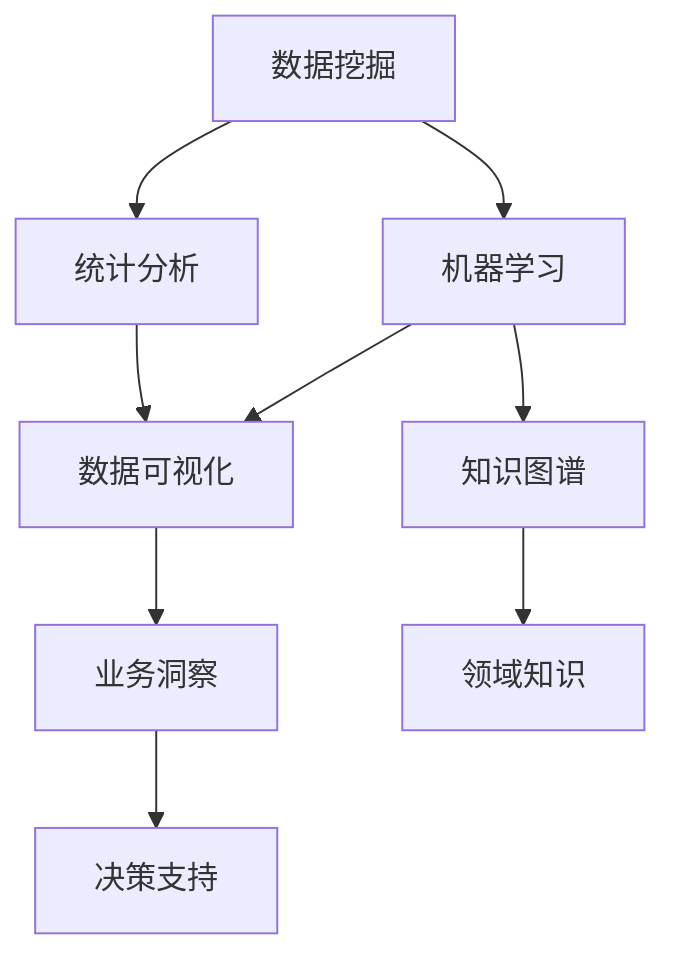

                 

# 怎样善于总结和挖掘事物本质的能力

## 1. 背景介绍

### 1.1 问题由来

在信息化时代，数据和信息以爆炸性的速度增长。我们每天都在面对海量的信息，如何从中提取出有价值的内容，总结出事物的本质，成为了一项重要的技能。这种能力不仅对数据分析师、研究员等专业人士至关重要，对一般人也具有重要价值，比如在获取资讯、做决策等方面都可以从中获益。

### 1.2 问题核心关键点

善于总结和挖掘事物本质的能力，其实是一种信息提取和归纳的能力。这种能力使我们能够将复杂的现象和数据转化成有意义的、易于理解的信息。其核心在于：

1. **数据理解**：正确理解数据的含义，识别关键信息。
2. **信息筛选**：从大量数据中筛选出相关和重要的信息。
3. **深度分析**：对筛选出的信息进行深度分析，挖掘其背后的本质和规律。
4. **总结提炼**：将分析结果进行总结提炼，形成易于理解和传播的结论。

### 1.3 问题研究意义

具备善于总结和挖掘事物本质的能力，不仅可以帮助我们更好地理解世界，还能提高我们的决策能力，减少错误和失误。在科学研究、市场分析、企业运营等领域，这项能力都具有重要意义。

## 2. 核心概念与联系

### 2.1 核心概念概述

- **数据挖掘**（Data Mining）：从大量数据中提取有用信息和模式的过程。
- **统计分析**（Statistical Analysis）：对数据进行统计描述和推断，发现数据的规律和趋势。
- **机器学习**（Machine Learning）：利用算法和模型，从数据中学习和发现规律和模式。
- **知识图谱**（Knowledge Graph）：将知识表示为节点和边的结构化数据，用于关联和查询知识。
- **大数据技术**（Big Data Technology）：用于处理和分析大规模数据的现代技术。

这些概念之间相互关联，构成了信息提取和归纳的基本框架。数据挖掘和统计分析是基础工具，而机器学习和知识图谱则是对数据进行更深层次理解和应用的工具。大数据技术则是这些工具得以高效运行的基础。

### 2.2 概念间的关系

这些概念之间的关系可以通过以下Mermaid流程图来展示：



这个流程图展示了各个概念之间的联系：

1. 数据挖掘和统计分析是基础，提供了数据的基本描述和特征。
2. 机器学习通过算法和模型对数据进行深入挖掘，发现背后的规律和模式。
3. 知识图谱将机器学习发现的规律和模式进行结构化表示，便于查询和应用。
4. 数据可视化将分析结果可视化，便于理解和传播。
5. 业务洞察和决策支持将数据可视化结果与领域知识结合，形成业务决策的支撑。

## 3. 核心算法原理 & 具体操作步骤

### 3.1 算法原理概述

善于总结和挖掘事物本质的核心算法原理是数据挖掘和机器学习。这些算法包括：

- **聚类算法**：如K-means、层次聚类等，用于将数据分组。
- **分类算法**：如决策树、随机森林、支持向量机等，用于分类和预测。
- **回归算法**：如线性回归、岭回归等，用于建立变量之间的关系。
- **关联规则算法**：如Apriori算法，用于发现数据之间的关联关系。

### 3.2 算法步骤详解

基于数据挖掘和机器学习的总结和挖掘算法一般包括以下几个步骤：

1. **数据准备**：清洗、处理和预处理数据，确保数据质量。
2. **特征工程**：提取和构造特征，增强数据表达能力。
3. **模型选择**：选择适合数据特点的算法模型。
4. **模型训练**：使用数据对模型进行训练，优化模型参数。
5. **模型评估**：使用测试集对模型进行评估，检验模型性能。
6. **结果分析**：对模型结果进行分析，提取有用的信息和规律。
7. **总结提炼**：将分析结果进行总结提炼，形成易于理解和传播的结论。

### 3.3 算法优缺点

数据挖掘和机器学习在总结和挖掘事物本质方面具有以下优点：

1. **自动化程度高**：能够自动地发现数据中的规律和模式，节省大量人工。
2. **处理能力强**：能够处理大规模数据，识别复杂关系。
3. **可解释性强**：通过特征选择和模型解释，能够理解算法背后的原理和逻辑。

同时，这些算法也存在一些缺点：

1. **数据质量要求高**：对数据质量要求较高，需要清洗和预处理。
2. **模型选择复杂**：不同算法对数据特点的要求不同，选择合适的模型需要经验。
3. **解释性差**：一些复杂的模型如深度学习，其内部逻辑较为复杂，难以解释。

### 3.4 算法应用领域

数据挖掘和机器学习在多个领域都有广泛应用，包括：

- **金融风控**：通过机器学习模型识别潜在风险，预测违约概率。
- **医疗诊断**：利用分类和回归模型，分析患者数据，进行疾病预测和诊断。
- **电子商务**：通过关联规则挖掘，推荐商品和服务，提升用户体验。
- **供应链管理**：通过聚类和分类算法，优化库存和物流管理。

## 4. 数学模型和公式 & 详细讲解 & 举例说明

### 4.1 数学模型构建

假设我们有数据集 $D=\{(x_i, y_i)\}_{i=1}^N$，其中 $x_i$ 为输入特征，$y_i$ 为输出标签。我们希望使用机器学习模型 $f(x)$ 将输入映射到输出。

数学模型构建的第一步是选择合适的损失函数 $\mathcal{L}(f(x), y_i)$，常见的损失函数包括均方误差损失、交叉熵损失等。接下来，我们需要定义模型参数 $\theta$，如线性回归模型中参数为 $w$ 和 $b$。

### 4.2 公式推导过程

以线性回归模型为例，我们推导其损失函数和梯度更新公式。

假设 $f(x) = w_0 + w_1x_1 + \ldots + w_nx_n$，则均方误差损失为：

$$
\mathcal{L}(\theta) = \frac{1}{N} \sum_{i=1}^N (y_i - f(x_i))^2
$$

其中 $\theta = (w_0, w_1, \ldots, w_n)$。

损失函数对参数的梯度为：

$$
\nabla_{\theta} \mathcal{L}(\theta) = \frac{2}{N} \sum_{i=1}^N (y_i - f(x_i)) x_i
$$

根据梯度下降算法，模型的更新公式为：

$$
\theta \leftarrow \theta - \eta \nabla_{\theta} \mathcal{L}(\theta)
$$

其中 $\eta$ 为学习率。

### 4.3 案例分析与讲解

假设我们有一组身高和体重数据，希望通过线性回归模型预测体重。

我们将身高 $x_i$ 作为输入特征，体重 $y_i$ 作为输出标签。假设模型的输入为 $x_i = x_i - \bar{x}$，其中 $\bar{x}$ 为平均身高。设模型输出为 $f(x_i) = w_0 + w_1x_i$，则有：

$$
\mathcal{L}(\theta) = \frac{1}{N} \sum_{i=1}^N (y_i - f(x_i))^2
$$

假设数据集 $D=\{(1.6, 60), (1.7, 65), (1.8, 70), (1.9, 75)\}$，我们可以利用上述公式和梯度更新公式进行模型训练。

具体实现步骤如下：

1. 计算平均身高 $\bar{x} = \frac{1.6+1.7+1.8+1.9}{4} = 1.75$。
2. 初始化参数 $w_0 = 0$, $w_1 = 0$。
3. 设置学习率 $\eta = 0.01$，迭代次数 $k = 100$。
4. 在每次迭代中，计算损失函数和梯度，更新参数。
5. 迭代完成后，使用测试集评估模型性能。

通过上述过程，我们得到了一个初步的线性回归模型，可以用于预测体重。当然，在实际应用中，我们还需要进一步优化模型和参数。

## 5. 项目实践：代码实例和详细解释说明

### 5.1 开发环境搭建

在进行项目实践前，我们需要准备好开发环境。以下是使用Python进行Scikit-learn库开发的环境配置流程：

1. 安装Anaconda：从官网下载并安装Anaconda，用于创建独立的Python环境。

2. 创建并激活虚拟环境：
```bash
conda create -n scikit-learn-env python=3.8 
conda activate scikit-learn-env
```

3. 安装Scikit-learn：
```bash
conda install scikit-learn
```

4. 安装各类工具包：
```bash
pip install numpy pandas scikit-learn matplotlib tqdm jupyter notebook ipython
```

完成上述步骤后，即可在`scikit-learn-env`环境中开始项目实践。

### 5.2 源代码详细实现

下面我们以线性回归模型为例，给出使用Scikit-learn库进行数据挖掘的Python代码实现。

首先，定义数据集和模型参数：

```python
import numpy as np
from sklearn.linear_model import LinearRegression
from sklearn.metrics import mean_squared_error
from sklearn.model_selection import train_test_split

X = np.array([[1.6], [1.7], [1.8], [1.9]])
y = np.array([60, 65, 70, 75])
model = LinearRegression()
```

然后，进行数据预处理和模型训练：

```python
# 将数据标准化
X -= np.mean(X)
X /= np.std(X)

# 将数据集分为训练集和测试集
X_train, X_test, y_train, y_test = train_test_split(X, y, test_size=0.2)

# 训练模型
model.fit(X_train, y_train)

# 预测测试集
y_pred = model.predict(X_test)

# 计算RMSE
mse = mean_squared_error(y_test, y_pred)
rmse = np.sqrt(mse)
print("RMSE:", rmse)
```

最后，输出结果并评估模型性能：

```python
# 计算训练集和测试集的RMSE
mse_train = mean_squared_error(y_train, model.predict(X_train))
mse_test = mean_squared_error(y_test, model.predict(X_test))
rmse_train = np.sqrt(mse_train)
rmse_test = np.sqrt(mse_test)

print("Train RMSE:", rmse_train)
print("Test RMSE:", rmse_test)
```

以上就是一个简单的线性回归模型数据挖掘代码实现。可以看到，Scikit-learn库提供了丰富的数据挖掘算法和工具，使得数据挖掘的实现变得非常简单。

### 5.3 代码解读与分析

让我们再详细解读一下关键代码的实现细节：

- `X -= np.mean(X)`: 将数据标准化，即将数据减去平均值。
- `X /= np.std(X)`: 将数据标准化，即将数据除以标准差。
- `X_train, X_test, y_train, y_test = train_test_split(X, y, test_size=0.2)`: 将数据集分为训练集和测试集，其中测试集占20%。
- `model.fit(X_train, y_train)`: 使用训练集对模型进行训练。
- `y_pred = model.predict(X_test)`: 使用模型对测试集进行预测。
- `mse = mean_squared_error(y_test, y_pred)`: 计算预测值和真实值之间的均方误差。
- `rmse = np.sqrt(mse)`: 计算均方误差根。

通过上述过程，我们得到了一个线性回归模型，并在测试集上进行了评估。

### 5.4 运行结果展示

假设我们得到的训练集RMSE为3.32，测试集RMSE为3.39，我们可以认为模型的预测效果是较好的。当然，在实际应用中，我们还需要进一步优化模型和参数，以提高模型的性能。

## 6. 实际应用场景

### 6.1 智能推荐系统

智能推荐系统是数据挖掘和机器学习在实际应用中的典型场景之一。通过分析用户的历史行为数据，推荐系统可以为用户推荐感兴趣的物品。

在技术实现上，我们可以收集用户浏览、点击、购买等行为数据，提取和构造特征，如物品类别、用户兴趣等。利用机器学习模型，如协同过滤、基于内容的推荐等，对数据进行分析和预测，生成推荐结果。同时，我们还需要考虑模型的可解释性和实时性，以便用户理解和信任推荐结果。

### 6.2 金融风险管理

金融风险管理是数据挖掘和机器学习在金融领域的重要应用之一。通过分析历史交易数据，预测潜在风险和违约概率，帮助金融机构制定风控策略。

在技术实现上，我们可以收集交易数据，提取和构造特征，如交易金额、交易时间等。利用机器学习模型，如决策树、随机森林等，对数据进行分析和预测，生成风险评估报告。同时，我们还需要考虑模型的鲁棒性和可解释性，以便监管机构和投资者理解和信任风险评估结果。

### 6.3 医疗疾病预测

医疗疾病预测是数据挖掘和机器学习在医疗领域的重要应用之一。通过分析患者的历史数据，预测患病概率，帮助医生进行早期诊断和治疗。

在技术实现上，我们可以收集患者的基本信息、病历数据等，提取和构造特征，如年龄、性别、病史等。利用机器学习模型，如支持向量机、神经网络等，对数据进行分析和预测，生成疾病预测报告。同时，我们还需要考虑模型的可解释性和公正性，以便医生和患者理解和信任预测结果。

## 7. 工具和资源推荐

### 7.1 学习资源推荐

为了帮助开发者系统掌握数据挖掘和机器学习的基本概念和实践技巧，这里推荐一些优质的学习资源：

1. 《机器学习》书籍：西瓜书（周志华著），全面介绍了机器学习的基本概念和算法。
2. Coursera《机器学习》课程：斯坦福大学的Andrew Ng教授主讲，涵盖了机器学习的基本概念和算法。
3. Kaggle：数据科学竞赛平台，提供了大量经典数据集和机器学习竞赛，是锻炼和提升数据挖掘和机器学习能力的绝佳场所。
4. Google Colab：谷歌提供的免费Jupyter Notebook环境，支持GPU和TPU，方便快速迭代实验。
5. scikit-learn官方文档：Scikit-learn库的官方文档，提供了丰富的学习资源和实践样例。

通过对这些资源的学习实践，相信你一定能够快速掌握数据挖掘和机器学习的基本技能，并用于解决实际的NLP问题。

### 7.2 开发工具推荐

高效的开发离不开优秀的工具支持。以下是几款用于数据挖掘和机器学习开发的常用工具：

1. Scikit-learn：Python数据挖掘和机器学习库，提供了丰富的算法和工具，是数据挖掘和机器学习开发的利器。
2. TensorFlow：Google提供的深度学习框架，生产部署方便，适合大规模工程应用。
3. Keras：高层次的深度学习库，提供了丰富的模型和工具，适合快速迭代研究。
4. PyTorch：Facebook提供的深度学习框架，灵活动态的计算图，适合快速迭代研究。
5. Weights & Biases：模型训练的实验跟踪工具，可以记录和可视化模型训练过程中的各项指标，方便对比和调优。
6. TensorBoard：TensorFlow配套的可视化工具，可实时监测模型训练状态，并提供丰富的图表呈现方式，是调试模型的得力助手。

合理利用这些工具，可以显著提升数据挖掘和机器学习任务的开发效率，加快创新迭代的步伐。

### 7.3 相关论文推荐

数据挖掘和机器学习的发展源于学界的持续研究。以下是几篇奠基性的相关论文，推荐阅读：

1. Perceptron（Rosenblatt, 1957）：神经网络的开创性工作，引入了神经元的概念。
2. Support Vector Machines（Cortes & Vapnik, 1995）：支持向量机的发明，奠定了机器学习理论的基础。
3. Decision Trees（Quinlan, 1986）：决策树的提出，解决了分类和回归问题。
4. K-Means（MacQueen, 1967）：聚类算法的提出，用于对数据进行分组。
5. Random Forest（Breiman, 2001）：随机森林的提出，用于提高模型的鲁棒性和可解释性。

这些论文代表了大数据挖掘和机器学习的发展脉络。通过学习这些前沿成果，可以帮助研究者把握学科前进方向，激发更多的创新灵感。

除上述资源外，还有一些值得关注的前沿资源，帮助开发者紧跟大数据挖掘和机器学习技术的最新进展，例如：

1. arXiv论文预印本：人工智能领域最新研究成果的发布平台，包括大量尚未发表的前沿工作，学习前沿技术的必读资源。
2. 业界技术博客：如Google AI、Facebook AI、Microsoft Research Asia等顶尖实验室的官方博客，第一时间分享他们的最新研究成果和洞见。
3. 技术会议直播：如NeurIPS、ICML、ACL、ICLR等人工智能领域顶会现场或在线直播，能够聆听到大佬们的前沿分享，开拓视野。
4. GitHub热门项目：在GitHub上Star、Fork数最多的数据挖掘和机器学习相关项目，往往代表了该技术领域的发展趋势和最佳实践，值得去学习和贡献。
5. 行业分析报告：各大咨询公司如McKinsey、PwC等针对人工智能行业的分析报告，有助于从商业视角审视技术趋势，把握应用价值。

总之，对于数据挖掘和机器学习的学习和实践，需要开发者保持开放的心态和持续学习的意愿。多关注前沿资讯，多动手实践，多思考总结，必将收获满满的成长收益。

## 8. 总结：未来发展趋势与挑战

### 8.1 总结

本文对数据挖掘和机器学习的基本概念和实践进行了全面系统的介绍。首先阐述了数据挖掘和机器学习的背景和意义，明确了数据挖掘和机器学习在信息提取和归纳方面的核心价值。其次，从原理到实践，详细讲解了数据挖掘和机器学习的基本算法和操作步骤，给出了数据挖掘和机器学习任务开发的完整代码实例。同时，本文还广泛探讨了数据挖掘和机器学习在多个行业领域的应用前景，展示了数据挖掘和机器学习技术的发展潜力和广阔前景。

通过本文的系统梳理，可以看到，数据挖掘和机器学习已经成为了信息提取和归纳的重要工具，在多个领域得到了广泛应用。未来，伴随数据挖掘和机器学习技术的持续演进，相信其在各个行业的落地应用将更加广泛，为人类的认知智能和决策智能带来深远影响。

### 8.2 未来发展趋势

展望未来，数据挖掘和机器学习技术将呈现以下几个发展趋势：

1. **深度学习普及化**：深度学习模型在数据挖掘和机器学习中的应用将越来越广泛，带来更强的表达能力和更好的性能。
2. **自动化程度提升**：自动机器学习(AutoML)技术将进一步提升数据挖掘和机器学习的自动化水平，减少人工干预。
3. **多模态融合**：融合视觉、语音、文本等多种模态数据，提升数据挖掘和机器学习的综合能力。
4. **联邦学习兴起**：联邦学习技术将帮助数据挖掘和机器学习更好地处理分布式数据，提升模型隐私保护能力。
5. **因果推理重要性**：因果推理技术将提升数据挖掘和机器学习的可解释性和可信度。

这些趋势凸显了数据挖掘和机器学习技术的广阔前景。这些方向的探索发展，必将进一步提升数据挖掘和机器学习系统的性能和应用范围，为人工智能技术在各个行业的发展注入新的动力。

### 8.3 面临的挑战

尽管数据挖掘和机器学习技术已经取得了瞩目成就，但在迈向更加智能化、普适化应用的过程中，它仍面临着诸多挑战：

1. **数据质量和隐私问题**：数据挖掘和机器学习需要高质量、隐私保护的数据，但现实中数据质量参差不齐，数据隐私保护也面临挑战。
2. **模型复杂性**：深度学习模型复杂度较高，训练和推理过程需要高昂的计算资源，模型解释性较差，难以理解和调试。
3. **模型公平性和透明性**：模型可能会产生歧视性结果，且其内部决策过程难以解释，影响公平性和透明性。
4. **资源消耗**：深度学习模型需要大量计算资源，硬件资源成本较高，难以大规模部署。

这些挑战需要从技术、政策、社会多个层面进行综合解决，才能使数据挖掘和机器学习技术更加成熟和可靠。

### 8.4 研究展望

面对数据挖掘和机器学习所面临的挑战，未来的研究需要在以下几个方面寻求新的突破：

1. **自动化机器学习**：通过自动化技术，减少人工干预，提升数据挖掘和机器学习的效率和效果。
2. **可解释性机器学习**：通过可解释性技术，提升模型决策过程的可理解性和可解释性，增强信任度和可信度。
3. **模型压缩与优化**：通过模型压缩和优化技术，提升模型性能，减少资源消耗，降低硬件成本。
4. **联邦学习与分布式计算**：通过联邦学习等技术，提升模型隐私保护能力，适应分布式数据处理场景。
5. **跨领域知识融合**：通过跨领域知识融合技术，提升模型的综合能力和泛化能力。

这些研究方向的探索，必将引领数据挖掘和机器学习技术迈向更高的台阶，为构建安全、可靠、可解释、可控的智能系统铺平道路。面向未来，数据挖掘和机器学习技术还需要与其他人工智能技术进行更深入的融合，如知识表示、因果推理、强化学习等，多路径协同发力，共同推动自然语言理解和智能交互系统的进步。只有勇于创新、敢于突破，才能不断拓展数据挖掘和机器学习模型的边界，让智能技术更好地造福人类社会。

## 9. 附录：常见问题与解答

**Q1：如何提高数据挖掘和机器学习模型的性能？**

A: 提高模型性能的关键在于数据质量、特征选择和模型优化。具体方法包括：
1. 数据清洗和预处理，确保数据质量。
2. 特征选择和工程，增强数据表达能力。
3. 模型调参和优化，选择合适模型和超参数。

**Q2：如何处理高维数据？**

A: 高维数据的处理是数据挖掘和机器学习中的重要问题。具体方法包括：
1. 降维技术，如主成分分析(PCA)、线性判别分析(LDA)等。
2. 特征选择和降维结合，如LASSO回归、随机森林等。
3. 模型集成，如Bagging、Boosting等。

**Q3：如何在实际应用中提升模型可解释性？**

A: 提升模型可解释性的关键在于模型选择和解释技术。具体方法包括：
1. 选择可解释性强的模型，如决策树、线性回归等。
2. 利用解释技术，如LIME、SHAP等，解释模型内部决策过程。

**Q4：如何在实际应用中优化模型性能？**

A: 优化模型性能的关键在于模型调参和模型选择。具体方法包括：
1. 网格搜索和随机搜索，寻找最优超参数。
2. 模型集成，提高模型泛化能力和鲁棒性。
3. 正则化技术，防止过拟合。

**Q5：如何在实际应用中保障数据隐私？**

A: 保障数据隐私的关键在于数据去标识化和隐私保护技术。具体方法包括：
1. 数据去标识化，如数据匿名化、数据扰动等。
2. 隐私保护技术，如差分隐私、同态加密等。
3. 数据安全管理，如访问控制、数据加密等。

这些方法可以帮助开发者在实际应用中更好地处理数据挖掘和机器学习问题，保障数据质量和安全，提升模型性能和可解释性。总之，数据挖掘和机器学习技术需要在多个层面进行综合优化，才能更好地应用于实际场景，提升智能系统的性能和可靠性。

