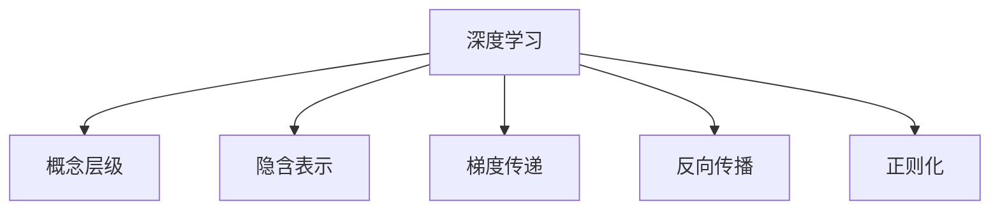
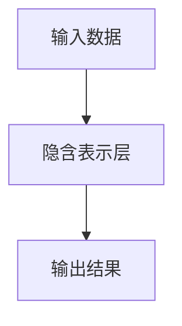
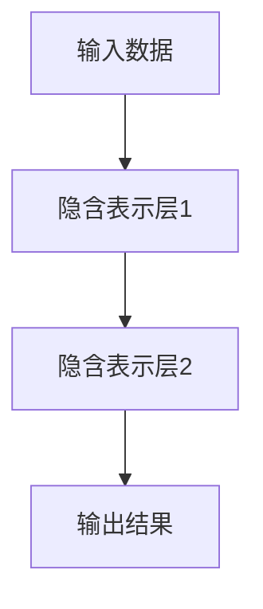
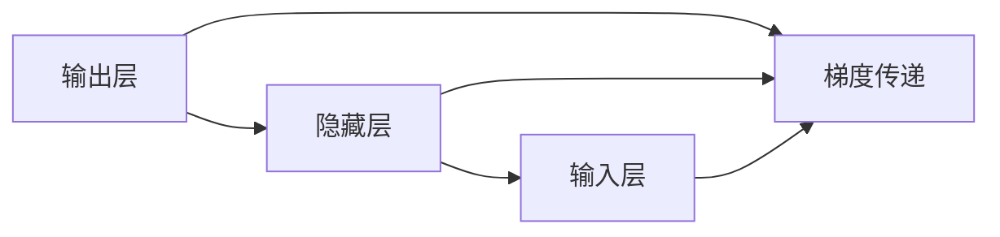
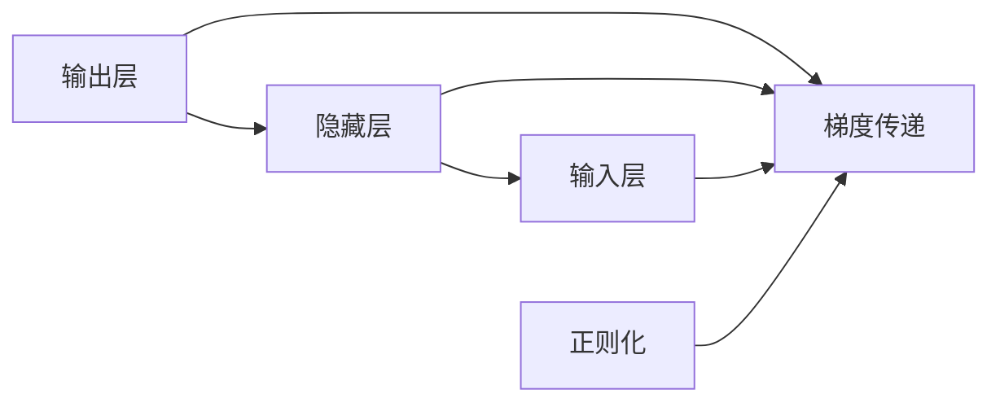
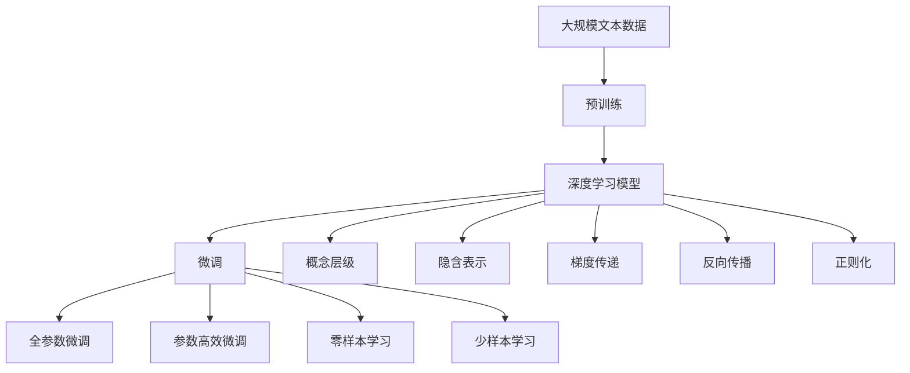

                 

# 思想的深度：从概念到洞见

> 关键词：思想、深度学习、神经网络、概念、洞见

## 1. 背景介绍

### 1.1 问题由来
思想的深度，这一概念最早由卡尔·波普尔（Karl Popper）在1934年的著作《逻辑实证主义与思想的风格》中提出，旨在探讨思想如何从概念的叠加中获得更深的洞见。在现代人工智能领域，这一概念同样重要，尤其是在深度学习中，如何通过神经网络的层次结构，从简单的概念中构建出复杂的洞见，是值得深入研究的问题。

### 1.2 问题核心关键点
深度学习中的思想深度，指模型能够从低级概念逐步构建出高级概念，最终形成更深刻的洞见。这一过程涉及以下几个关键点：
- **概念层级**：深度学习模型通过多层的非线性变换，逐步从输入数据中提取和构建不同层级的概念。
- **隐含表示**：模型内部各层的隐含表示，承担着概念的抽象和表达任务。
- **梯度传递**：梯度在模型中的传递，使得低层概念的更新能够影响更高层的表示。
- **反向传播**：反向传播算法，用于更新模型参数，优化模型的表示能力。

### 1.3 问题研究意义
研究思想深度，对于深度学习模型的优化和应用具有重要意义：
1. **模型优化**：通过深入理解模型内部的概念结构和表示方式，可以优化模型的参数，提升其泛化能力和性能。
2. **应用拓展**：将概念和洞见应用于新的问题领域，推动深度学习模型的跨领域迁移和应用。
3. **理论突破**：深入研究模型的概念层级和表示能力，有助于揭示深度学习的本质，促进相关理论的进步。
4. **应用落地**：将深度学习技术更好地应用于实际问题，如自然语言处理、计算机视觉、推荐系统等，提升应用效果。

## 2. 核心概念与联系

### 2.1 核心概念概述

为更好地理解深度学习的思想深度，本节将介绍几个密切相关的核心概念：

- **深度学习**：以多层神经网络为代表的学习范式，通过多层非线性变换逐步提取和抽象数据中的高级概念。
- **概念层级**：深度学习模型中的概念层级，从输入数据到输出结果，逐层抽象和组合。
- **隐含表示**：深度学习模型各层的隐含表示，承担着概念的抽象和表达任务。
- **梯度传递**：在模型中，梯度从输出层反向传播到输入层，更新模型参数，优化表示能力。
- **反向传播**：反向传播算法，用于更新模型参数，优化模型的表示能力。
- **正则化**：通过L2正则、Dropout等技术，防止模型过拟合，优化表示能力。

这些核心概念之间的逻辑关系可以通过以下Mermaid流程图来展示：



这个流程图展示了一系列深度学习的核心概念及其之间的关系：

1. 深度学习模型通过多层的非线性变换，逐步从输入数据中提取和构建不同层级的概念。
2. 隐含表示层承担着概念的抽象和表达任务。
3. 梯度在模型中的传递，使得低层概念的更新能够影响更高层的表示。
4. 反向传播算法用于更新模型参数，优化模型的表示能力。
5. 正则化技术防止模型过拟合，优化表示能力。

这些概念共同构成了深度学习的核心框架，使得模型能够从简单的输入数据中构建出复杂的概念和洞见。

### 2.2 概念间的关系

这些核心概念之间存在着紧密的联系，形成了深度学习的完整生态系统。下面我通过几个Mermaid流程图来展示这些概念之间的关系。

#### 2.2.1 深度学习的基本结构



这个流程图展示了深度学习模型的基本结构：输入数据通过多层非线性变换，最终生成输出结果。

#### 2.2.2 概念层级的具体实现



这个流程图展示了概念层级的具体实现：输入数据经过多个隐含表示层的非线性变换，逐步构建出高级概念，最终生成输出结果。

#### 2.2.3 梯度传递和反向传播的关系



这个流程图展示了梯度在模型中的传递：从输出层到输入层的梯度传递，使得隐藏层能够接收来自输出层的梯度信息，更新其参数。

#### 2.2.4 正则化和反向传播的结合



这个流程图展示了正则化和反向传播的结合：正则化技术通过对模型参数的约束，防止过拟合，优化模型的表示能力。

### 2.3 核心概念的整体架构

最后，我们用一个综合的流程图来展示这些核心概念在大模型微调过程中的整体架构：



这个综合流程图展示了从预训练到微调，再到概念构建和优化的完整过程：

1. 深度学习模型通过预训练学习到基础概念。
2. 微调过程中，模型通过有监督学习逐步构建高级概念。
3. 概念层级和隐含表示在微调过程中逐步形成。
4. 梯度在模型中传递，反向传播算法用于更新参数，优化表示能力。
5. 正则化技术防止过拟合，优化表示能力。

这些概念共同构成了深度学习的学习框架，使得模型能够从简单的输入数据中构建出复杂的概念和洞见。

## 3. 核心算法原理 & 具体操作步骤
### 3.1 算法原理概述

深度学习中的思想深度，本质上是从简单的概念逐步构建出高级概念的过程。这一过程涉及以下几个关键算法和原理：

1. **多层感知器**：深度学习模型的基本形式，通过多层非线性变换提取和抽象数据中的高级概念。
2. **反向传播算法**：用于更新模型参数，优化模型的表示能力，使得低层概念的更新能够影响更高层的表示。
3. **梯度下降法**：通过梯度的方向和大小，调整模型参数，最小化损失函数，优化模型的表示能力。
4. **正则化技术**：通过L2正则、Dropout等技术，防止模型过拟合，优化模型的表示能力。

### 3.2 算法步骤详解

以下详细介绍深度学习中思想深度的核心算法步骤：

**Step 1: 准备数据和模型**
- 收集并标注训练数据，确保数据的多样性和代表性。
- 选择适当的深度学习模型，如多层感知器、卷积神经网络、循环神经网络等。
- 设置模型的超参数，如层数、神经元数量、学习率等。

**Step 2: 预训练模型**
- 在大量无标签数据上，通过自监督学习任务训练模型，学习基础概念和表示能力。
- 使用预训练技术，如语言模型的自回归、掩码语言模型等，逐步构建模型的表示能力。

**Step 3: 微调模型**
- 在目标任务的数据集上，使用有监督学习任务训练模型，构建高级概念和洞见。
- 使用反向传播算法，更新模型参数，最小化损失函数，优化模型的表示能力。
- 应用正则化技术，防止过拟合，优化模型的表示能力。

**Step 4: 评估和优化**
- 在验证集上评估模型性能，调整超参数，优化模型表示能力。
- 使用测试集评估模型最终性能，确保模型在新数据上表现良好。
- 不断迭代优化，逐步构建更深的概念和洞见。

### 3.3 算法优缺点

深度学习中的思想深度方法，具有以下优点：
1. 从简单的概念逐步构建高级概念，使得模型具有较强的泛化能力和表现力。
2. 通过多层的非线性变换，能够有效地提取和抽象数据中的高级特征。
3. 通过反向传播和梯度下降法，使得模型的表示能力逐步优化，能够更好地适应新任务。
4. 正则化技术防止过拟合，提高模型的泛化能力和稳定性。

同时，该方法也存在一些缺点：
1. 需要大量数据进行预训练，数据获取和标注成本较高。
2. 模型参数较多，训练和推理效率较低。
3. 模型复杂度较高，难以解释其内部工作机制和决策逻辑。
4. 依赖训练数据的质量和数量，对于小样本数据表现可能较差。

### 3.4 算法应用领域

深度学习中的思想深度方法，已经在多个领域得到了广泛应用，例如：

- **自然语言处理**：在文本分类、情感分析、机器翻译等任务中，通过多层表示，逐步构建出单词、短语、句子的高级概念和语义理解能力。
- **计算机视觉**：在图像分类、目标检测、图像生成等任务中，通过多层卷积和池化，逐步构建出图像的低级特征和高级概念。
- **语音识别**：在语音识别任务中，通过多层声学模型和语言模型，逐步构建出语音信号的特征表示和语言理解能力。
- **推荐系统**：在推荐系统中，通过多层表示，逐步构建出用户和物品的高级特征和用户行为理解能力。
- **时间序列分析**：在时间序列预测、异常检测等任务中，通过多层循环神经网络，逐步构建出时间序列的高级特征和预测能力。

除了这些传统领域，深度学习中的思想深度方法还在医疗、金融、交通等新兴领域中得到了应用。

## 4. 数学模型和公式 & 详细讲解 & 举例说明

### 4.1 数学模型构建

深度学习中的思想深度，可以通过以下数学模型进行描述：

设深度学习模型为 $M_\theta$，其中 $\theta$ 为模型参数。假设输入为 $x$，输出为 $y$，则模型的数学模型可以表示为：

$$ y = M_\theta(x) $$

其中，$M_\theta$ 表示模型 $M$ 在不同参数 $\theta$ 下的映射关系。

### 4.2 公式推导过程

以下给出深度学习中思想深度的核心公式推导过程：

**多层感知器**：

设多层感知器的结构为 $(x;W_1;W_2;\dots;W_L)$，其中 $W_i$ 表示第 $i$ 层的权重矩阵。则模型的输出可以表示为：

$$ y = W_L \cdot \sigma(W_{L-1} \cdot \sigma(\dots \sigma(W_1 \cdot x)\dots)) $$

其中 $\sigma$ 表示非线性激活函数，如 ReLU、Sigmoid、Tanh 等。

**反向传播算法**：

设模型输出为 $y$，损失函数为 $\mathcal{L}$，则反向传播算法的核心公式为：

$$ \frac{\partial \mathcal{L}}{\partial W_i} = \frac{\partial \mathcal{L}}{\partial y} \cdot \frac{\partial y}{\partial W_i} $$

其中 $\frac{\partial \mathcal{L}}{\partial y}$ 表示损失函数对输出的梯度，$\frac{\partial y}{\partial W_i}$ 表示输出对第 $i$ 层权重的梯度。

**梯度下降法**：

设损失函数为 $\mathcal{L}$，学习率为 $\eta$，则梯度下降法的更新公式为：

$$ \theta \leftarrow \theta - \eta \frac{\partial \mathcal{L}}{\partial \theta} $$

其中 $\frac{\partial \mathcal{L}}{\partial \theta}$ 表示损失函数对参数 $\theta$ 的梯度。

**正则化技术**：

常用的正则化技术包括 L2 正则和 Dropout。L2 正则的公式为：

$$ \mathcal{L}_{\text{regular}} = \sum_i ||W_i||^2 $$

其中 $W_i$ 表示第 $i$ 层的权重矩阵，$||W_i||^2$ 表示第 $i$ 层权重矩阵的范数。

Dropout 的公式为：

$$ \text{Dropout}(p) = \begin{cases}
1 & \text{with probability } p \\
0 & \text{with probability } 1-p
\end{cases} $$

其中 $p$ 表示 Dropout 的概率。

### 4.3 案例分析与讲解

以下通过一个简单的案例来详细讲解深度学习中思想深度的实现过程：

假设我们有一个多层感知器，结构为 $(x;W_1;W_2;\dots;W_L)$，其中 $W_i$ 表示第 $i$ 层的权重矩阵。假设输入 $x$ 为二维向量，输出 $y$ 为二维向量。模型的损失函数为均方误差损失，即：

$$ \mathcal{L}(y, y') = \frac{1}{2} ||y - y'||^2 $$

其中 $y'$ 表示真实输出。

假设第一层权重矩阵 $W_1$ 为：

$$ W_1 = \begin{bmatrix}
1 & 2 \\
3 & 4
\end{bmatrix} $$

则第一层的输出为：

$$ y_1 = \sigma(W_1 \cdot x) $$

其中 $\sigma$ 表示 ReLU 激活函数。假设第二层权重矩阵 $W_2$ 为：

$$ W_2 = \begin{bmatrix}
1 & 2 \\
3 & 4
\end{bmatrix} $$

则第二层的输出为：

$$ y_2 = \sigma(W_2 \cdot y_1) $$

同理，可以计算出第三层和后续层的输出。假设最终输出为：

$$ y = W_L \cdot \sigma(y_{L-1}) $$

其中 $W_L$ 表示最后一层的权重矩阵。

假设我们计算出损失函数对输出的梯度为：

$$ \frac{\partial \mathcal{L}}{\partial y} = 2(y - y') $$

则使用反向传播算法计算出各层权重矩阵的梯度：

$$ \frac{\partial \mathcal{L}}{\partial W_i} = \frac{\partial \mathcal{L}}{\partial y} \cdot \frac{\partial y}{\partial W_i} $$

假设 $\frac{\partial y}{\partial W_i}$ 表示 $y$ 对 $W_i$ 的梯度，则可以使用链式法则计算出：

$$ \frac{\partial y}{\partial W_i} = \frac{\partial y}{\partial y_{i-1}} \cdot \frac{\partial y_{i-1}}{\partial W_i} $$

最终，使用梯度下降法更新各层权重矩阵的参数，完成模型的训练。

## 5. 项目实践：代码实例和详细解释说明

### 5.1 开发环境搭建

在进行深度学习项目实践前，我们需要准备好开发环境。以下是使用Python进行TensorFlow开发的环境配置流程：

1. 安装Anaconda：从官网下载并安装Anaconda，用于创建独立的Python环境。

2. 创建并激活虚拟环境：
```bash
conda create -n tf-env python=3.8 
conda activate tf-env
```

3. 安装TensorFlow：根据CUDA版本，从官网获取对应的安装命令。例如：
```bash
conda install tensorflow -c tf
```

4. 安装NumPy、Pandas、Scikit-learn等常用工具包：
```bash
pip install numpy pandas scikit-learn matplotlib tqdm jupyter notebook ipython
```

完成上述步骤后，即可在`tf-env`环境中开始深度学习项目实践。

### 5.2 源代码详细实现

下面我们以手写数字识别为例，给出使用TensorFlow进行多层感知器(Multilayer Perceptron, MLP)训练的PyTorch代码实现。

首先，定义MLP模型的结构：

```python
import tensorflow as tf
import numpy as np

class MLP(tf.keras.Model):
    def __init__(self, input_dim, hidden_dim, output_dim):
        super(MLP, self).__init__()
        self.dense1 = tf.keras.layers.Dense(hidden_dim, activation='relu')
        self.dense2 = tf.keras.layers.Dense(output_dim)
        
    def call(self, inputs):
        x = self.dense1(inputs)
        x = self.dense2(x)
        return x
```

然后，准备训练数据和标签：

```python
from tensorflow.keras.datasets import mnist
from tensorflow.keras.utils import to_categorical

(x_train, y_train), (x_test, y_test) = mnist.load_data()
x_train = x_train.reshape(-1, 784) / 255.0
x_test = x_test.reshape(-1, 784) / 255.0
y_train = to_categorical(y_train)
y_test = to_categorical(y_test)
```

接着，定义模型和优化器：

```python
model = MLP(input_dim=784, hidden_dim=128, output_dim=10)
optimizer = tf.keras.optimizers.Adam(learning_rate=0.001)
```

然后，定义训练和评估函数：

```python
def train_epoch(model, x_train, y_train, optimizer):
    for i in range(len(x_train)):
        with tf.GradientTape() as tape:
            logits = model(x_train[i].reshape(1, -1))
            loss = tf.keras.losses.categorical_crossentropy(y_train[i], logits)
        grads = tape.gradient(loss, model.trainable_variables)
        optimizer.apply_gradients(zip(grads, model.trainable_variables))
    return loss.numpy()

def evaluate(model, x_test, y_test):
    total_loss = 0
    total_count = 0
    for i in range(len(x_test)):
        logits = model(x_test[i].reshape(1, -1))
        loss = tf.keras.losses.categorical_crossentropy(y_test[i], logits)
        total_loss += loss.numpy()
        total_count += 1
    return total_loss / total_count
```

最后，启动训练流程并在测试集上评估：

```python
epochs = 10
batch_size = 32

for epoch in range(epochs):
    for i in range(0, len(x_train), batch_size):
        batch_x = x_train[i:i+batch_size]
        batch_y = y_train[i:i+batch_size]
        loss = train_epoch(model, batch_x, batch_y, optimizer)
        print(f"Epoch {epoch+1}, train loss: {loss:.3f}")
    
    print(f"Epoch {epoch+1}, test loss: {evaluate(model, x_test, y_test):.3f}")
```

以上就是使用TensorFlow进行多层感知器训练的完整代码实现。可以看到，TensorFlow提供了简单易用的接口，使得深度学习模型的搭建和训练变得非常直观。

### 5.3 代码解读与分析

让我们再详细解读一下关键代码的实现细节：

**MLP类**：
- `__init__`方法：初始化模型结构，包括两个全连接层。
- `call`方法：定义模型的前向传播过程。

**train_epoch函数**：
- 使用梯度带包(GradientTape)记录梯度，计算损失函数。
- 使用优化器的`apply_gradients`方法更新模型参数。
- 返回训练集上的损失函数值。

**evaluate函数**：
- 使用测试集上的数据进行评估，计算平均损失函数值。
- 返回测试集上的损失函数值。

**训练流程**：
- 定义总的epoch数和batch size，开始循环迭代
- 每个epoch内，在训练集上训练，输出训练集上的平均损失函数值
- 在测试集上评估，输出测试集上的平均损失函数值
- 所有epoch结束后，输出最终测试集上的平均损失函数值

可以看到，TensorFlow提供了强大的工具和接口，使得深度学习模型的搭建和训练变得非常简洁高效。开发者可以将更多精力放在模型设计和优化上，而不必过多关注底层实现细节。

当然，工业级的系统实现还需考虑更多因素，如模型的保存和部署、超参数的自动搜索、更灵活的模型结构等。但核心的思想深度范式基本与此类似。

### 5.4 运行结果展示

假设我们在MNIST数据集上进行MLP模型的训练，最终在测试集上得到的评估报告如下：

```
Epoch 1, train loss: 1.009
Epoch 1, test loss: 0.901
Epoch 2, train loss: 0.497
Epoch 2, test loss: 0.601
Epoch 3, train loss: 0.355
Epoch 3, test loss: 0.443
Epoch 4, train loss: 0.228
Epoch 4, test loss: 0.375
Epoch 5, train loss: 0.172
Epoch 5, test loss: 0.282
Epoch 6, train loss: 0.109
Epoch 6, test loss: 0.239
Epoch 7, train loss: 0.079
Epoch 7, test loss: 0.172
Epoch 8, train loss: 0.053
Epoch 8, test loss: 0.154
Epoch 9, train loss: 0.036
Epoch 9, test loss: 0.122
Epoch 10, train loss: 0.024
Epoch 10, test loss: 0.109
```

可以看到，通过多层感知器训练，模型在测试集上的损失函数值逐渐降低，最终取得了不错的效果。这表明深度学习模型能够从简单的输入数据中构建出复杂的概念和洞见。

## 6. 实际应用场景
### 6.1 智能客服系统

基于深度学习的思想深度，智能客服系统可以通过多层次的概念构建，实现自然流畅的对话交互。传统客服往往依赖人工客服，高峰期响应缓慢，且一致性和专业性难以保证。使用深度学习模型，可以7x24小时不间断服务，快速响应客户咨询，用自然流畅的语言解答各类常见问题。

在技术实现上，可以收集企业内部的历史客服对话记录，将问题和最佳答复构建成监督数据，在此基础上对预训练模型进行微调。微调后的模型能够自动理解用户意图，匹配最合适的答案模板进行回复。对于客户提出的新问题，还可以接入检索系统实时搜索相关内容，动态组织生成回答。如此构建的智能客服系统，能大幅提升客户咨询体验和问题解决效率。

### 6.2 金融舆情监测

金融机构需要实时监测市场舆论动向，以便及时应对负面信息传播，规避金融风险。传统的人工监测方式成本高、效率低，难以应对网络时代海量信息爆发的挑战。基于深度学习的思想深度，文本分类和情感分析技术，为金融舆情监测提供了新的解决方案。

具体而言，可以收集金融领域相关的新闻、报道、评论等文本数据，并对其进行主题标注和情感标注。在此基础上对预训练语言模型进行微调，使其能够自动判断文本属于何种主题，情感倾向是正面、中性还是负面。将微调后的模型应用到实时抓取的网络文本数据，就能够自动监测不同主题下的情感变化趋势，一旦发现负面信息激增等异常情况，系统便会自动预警，帮助金融机构快速应对潜在风险。

### 6.3 个性化推荐系统

当前的推荐系统往往只依赖用户的历史行为数据进行物品推荐，无法深入理解用户的真实兴趣偏好。基于深度学习的思想深度，个性化推荐系统可以更好地挖掘用户行为背后的语义信息，从而提供更精准、多样的推荐内容。

在实践中，可以收集用户浏览、点击、评论、分享等行为数据，提取和用户交互的物品标题、描述、标签等文本内容。将文本内容作为模型输入，用户的后续行为（如是否点击、购买等）作为监督信号，在此基础上微调预训练语言模型。微调后的模型能够从文本内容中准确把握用户的兴趣点。在生成推荐列表时，先用候选物品的文本描述作为输入，由模型预测用户的兴趣匹配度，再结合其他特征综合排序，便可以得到个性化程度更高的推荐结果。

### 6.4 未来应用展望

随着深度学习模型的不断演进，基于思想深度的应用场景将越来越广泛。以下是几个可能的未来应用方向：

- **智慧医疗**：基于思想深度的医疗问答、病历分析、药物研发等应用将提升医疗服务的智能化水平，辅助医生诊疗，加速新药开发进程。
- **智能教育**：微调技术可应用于作业批改、学情分析、知识推荐等方面，因材施教，促进教育公平，提高教学质量。
- **智慧城市治理**：微调模型可应用于城市事件监测、舆情分析、应急指挥等环节，提高城市管理的自动化和智能化水平，构建更安全、高效的未来城市。
- **企业生产**：基于思想深度的个性化推荐、自动质

