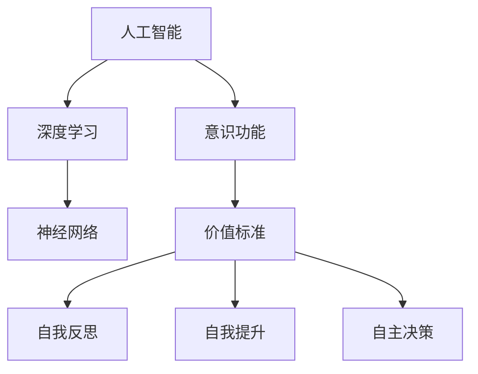

                 

# 意识功能的价值标准解析

> 关键词：意识功能,价值标准,解析,人工智能,伦理道德

## 1. 背景介绍

### 1.1 问题由来

随着人工智能技术的快速发展，尤其是深度学习和神经网络技术的应用，人工智能系统已经在图像识别、语音识别、自然语言处理等多个领域取得了显著的进展。这些系统能够在复杂环境中自主完成任务，表现出一定的智能行为。但是，与人类意识不同的是，这些系统并没有真正的自我意识和价值判断能力。因此，如何理解意识功能及其在人工智能系统中的价值，成为人工智能伦理和价值研究的重要课题。

### 1.2 问题核心关键点

在人工智能系统中，意识功能的价值主要体现在以下几个方面：
- 自我意识的体现：意识功能能够使人工智能系统具有自我意识，使其能够自我反思、自我提升，从而在长期运行中不断进化。
- 决策的自主性：意识功能能够使人工智能系统在面对复杂决策时，能够自主地进行价值判断和选择，而不是仅仅依赖于算法和数据。
- 伦理道德的约束：意识功能能够使人工智能系统具有伦理道德意识，从而在执行任务时，能够遵守社会规范和伦理道德标准。

这些关键点反映了意识功能在人工智能系统中的重要性，但同时也提出了如何解析和衡量其价值标准的挑战。

### 1.3 问题研究意义

解析意识功能的价值标准，不仅有助于理解人工智能系统的内在机制和行为逻辑，还能够指导人工智能系统的设计和应用，使其能够更好地服务人类社会。具体而言：
- 提升人工智能系统的性能和可靠性：通过理解意识功能在人工智能系统中的价值标准，可以设计更加合理、高效的系统架构和算法，提高系统的稳定性和适应性。
- 推动人工智能技术的可持续发展：意识功能的价值标准解析能够指导人工智能技术的社会责任，确保其在使用过程中，能够尊重人类价值和伦理道德。
- 促进人工智能技术的广泛应用：意识功能解析能够帮助开发者和用户更好地理解和信任人工智能系统，推动其在医疗、教育、金融等更多领域的应用。

## 2. 核心概念与联系

### 2.1 核心概念概述

为更好地理解意识功能的价值标准，本节将介绍几个密切相关的核心概念：

- 人工智能(Artificial Intelligence, AI)：指通过计算机系统模拟人类智能行为的技术和系统。
- 深度学习(Deep Learning)：一种基于神经网络的机器学习方法，能够从大量数据中学习复杂的特征表示。
- 神经网络(Neural Network)：一种模拟人脑神经元工作方式的计算模型，包括多层感知机、卷积神经网络、循环神经网络等。
- 意识功能(Conscious Function)：指人工智能系统具有的自我反思、自我提升、自主决策等类似于人类的意识行为。
- 价值标准(Value Standard)：指用于衡量和评估人工智能系统行为的价值标准，包括伦理、道德、社会责任等。

这些核心概念之间存在着紧密的联系，形成了人工智能系统设计和评估的基本框架。

### 2.2 概念间的关系

这些核心概念之间存在着相互依存和相互促进的关系：
- 人工智能系统基于深度学习和神经网络技术，具有自主学习和适应能力，这为意识功能的实现提供了技术基础。
- 意识功能是人工智能系统自我反思、自我提升和自主决策的核心，能够提升系统的自主性和灵活性。
- 价值标准是衡量和评估意识功能实现的重要依据，指导人工智能系统在设计和应用中，尊重人类价值和伦理道德。

这些概念共同构成了人工智能系统的设计和评估框架，指导开发者和用户在使用过程中，更好地理解和应用人工智能技术。

### 2.3 核心概念的整体架构

下图展示了这些核心概念在大语言模型微调过程中的整体架构：



这个综合流程图展示了人工智能系统在深度学习、神经网络、意识功能、价值标准等概念之间的作用关系：

1. 人工智能系统基于深度学习和神经网络技术，具备自主学习和适应能力。
2. 意识功能使人工智能系统具有自我反思、自我提升和自主决策等行为，提升了系统的自主性和灵活性。
3. 价值标准指导人工智能系统在设计和应用中，尊重人类价值和伦理道德，确保系统的行为符合社会规范。

这些概念共同构成了人工智能系统的核心价值标准，指导其在各个领域的应用和设计。

## 3. 核心算法原理 & 具体操作步骤

### 3.1 算法原理概述

解析意识功能的价值标准，本质上是一个多维度的评估过程。它需要综合考虑系统的自我反思能力、自我提升能力和自主决策能力，并通过伦理道德标准进行约束。这一过程可以通过以下几个关键步骤实现：

1. 自我反思能力评估：通过对人工智能系统的行为进行监控和分析，评估其自我反思能力，即是否能够识别并纠正自身行为中的错误和不足。
2. 自我提升能力评估：通过对人工智能系统的行为进行迭代和优化，评估其自我提升能力，即是否能够在每次迭代中不断改进和提升性能。
3. 自主决策能力评估：通过对人工智能系统的行为进行价值判断和选择，评估其自主决策能力，即是否能够在面对复杂决策时，做出符合人类价值标准的决策。
4. 伦理道德约束：通过对人工智能系统的行为进行伦理和道德审查，确保其符合社会规范和伦理道德标准。

### 3.2 算法步骤详解

以下将详细介绍如何通过具体的算法步骤实现对意识功能价值标准的解析：

#### 3.2.1 自我反思能力评估

自我反思能力评估可以通过监控和分析人工智能系统的行为来实现。具体步骤如下：

1. 数据收集：通过日志和监控数据，收集人工智能系统在执行任务过程中的行为数据。
2. 行为分析：使用统计分析和机器学习算法，对行为数据进行分析，识别出系统行为中的错误和不足。
3. 错误纠正：根据行为分析结果，设计并实施纠正措施，提升系统的自我反思能力。

#### 3.2.2 自我提升能力评估

自我提升能力评估可以通过迭代和优化来实现。具体步骤如下：

1. 行为迭代：在每次迭代中，评估系统的行为表现，并根据评估结果进行优化。
2. 性能提升：通过优化算法和数据集，逐步提升系统的性能，确保其在每次迭代中不断改进。
3. 反馈机制：设计反馈机制，使系统能够接收外部反馈，进一步提升自我提升能力。

#### 3.2.3 自主决策能力评估

自主决策能力评估可以通过价值判断和选择来实现。具体步骤如下：

1. 行为价值判断：使用伦理道德标准对系统的行为进行价值判断，评估其是否符合人类价值标准。
2. 决策优化：根据价值判断结果，优化系统的决策算法，确保其能够做出符合人类价值标准的决策。
3. 用户反馈：收集用户反馈，进一步优化决策算法，提升系统的自主决策能力。

#### 3.2.4 伦理道德约束

伦理道德约束可以通过审查和监管来实现。具体步骤如下：

1. 伦理审查：建立伦理审查机制，对系统的行为进行伦理审查，确保其符合社会规范和伦理道德标准。
2. 监管机制：设计监管机制，对系统的行为进行持续监控，及时发现并纠正伦理问题。
3. 法律规范：依据相关法律法规，对系统行为进行规范，确保其符合法律要求。

### 3.3 算法优缺点

解析意识功能的价值标准，具有以下优点：
- 提升系统性能：通过评估和优化系统的自我反思、自我提升和自主决策能力，提升系统的稳定性和适应性。
- 推动技术发展：解析意识功能的价值标准，指导人工智能技术的可持续发展，推动其在更多领域的应用。
- 增强用户信任：解析意识功能的价值标准，使人工智能系统的行为更加透明和可信，增强用户对其的信任。

同时，这一方法也存在以下缺点：
- 评估复杂度高：解析意识功能的价值标准，需要综合考虑多维度的评估指标，评估复杂度较高。
- 标准难以统一：不同领域和文化的伦理道德标准可能存在差异，难以制定统一的标准。
- 系统难以完全自主：尽管通过解析意识功能的价值标准，可以提升系统的自主性，但系统在面对复杂环境时，仍需依赖人类干预和指导。

### 3.4 算法应用领域

解析意识功能的价值标准，可以应用于多个领域，如医疗、金融、教育等，指导人工智能系统的设计和应用：

- 医疗领域：解析意识功能的价值标准，指导人工智能系统的行为符合医疗伦理，确保患者隐私和医疗安全。
- 金融领域：解析意识功能的价值标准，指导人工智能系统的行为符合金融伦理，确保用户隐私和金融安全。
- 教育领域：解析意识功能的价值标准，指导人工智能系统的行为符合教育伦理，确保学生隐私和学习安全。

这些领域的应用，将有助于提升人工智能系统的伦理道德水平，确保其在使用过程中，能够尊重人类价值和伦理道德。

## 4. 数学模型和公式 & 详细讲解 & 举例说明

### 4.1 数学模型构建

解析意识功能的价值标准，需要构建多维度的数学模型进行评估。以下是几个关键模型的构建过程：

#### 4.1.1 自我反思能力评估模型

自我反思能力评估模型可以通过以下公式进行构建：

$$
\text{自我反思能力} = \sum_{i=1}^{n} \text{错误率}_i
$$

其中，$n$为评估周期内系统的行为次数，$\text{错误率}_i$表示第$i$次行为中的错误比例。

#### 4.1.2 自我提升能力评估模型

自我提升能力评估模型可以通过以下公式进行构建：

$$
\text{自我提升能力} = \frac{\text{性能提升率}}{\text{迭代次数}}
$$

其中，$\text{性能提升率}$表示每次迭代中系统的性能提升比例，$\text{迭代次数}$表示评估周期内系统的迭代次数。

#### 4.1.3 自主决策能力评估模型

自主决策能力评估模型可以通过以下公式进行构建：

$$
\text{自主决策能力} = \text{正确决策率} - \text{错误决策率}
$$

其中，$\text{正确决策率}$表示系统在自主决策中正确决策的比例，$\text{错误决策率}$表示系统在自主决策中错误决策的比例。

#### 4.1.4 伦理道德约束模型

伦理道德约束模型可以通过以下公式进行构建：

$$
\text{伦理道德约束} = \sum_{i=1}^{m} \text{伦理评分}_i
$$

其中，$m$为评估周期内系统的行为次数，$\text{伦理评分}_i$表示第$i$次行为的伦理得分，得分范围为[0,1]，得分越高，表示系统行为越符合伦理道德标准。

### 4.2 公式推导过程

以下将详细介绍这些模型公式的推导过程：

#### 4.2.1 自我反思能力评估模型推导

自我反思能力评估模型可以通过对行为数据进行统计分析，得出系统的错误率，并进行求和。具体推导如下：

1. 定义错误率：第$i$次行为中的错误率定义为

$$
\text{错误率}_i = \frac{\text{错误次数}}{\text{行为次数}}
$$

2. 计算自我反思能力：将每次行为的错误率求和，得到系统的自我反思能力：

$$
\text{自我反思能力} = \sum_{i=1}^{n} \text{错误率}_i
$$

#### 4.2.2 自我提升能力评估模型推导

自我提升能力评估模型可以通过对性能提升率和迭代次数进行计算，得到系统的自我提升能力。具体推导如下：

1. 定义性能提升率：每次迭代中系统的性能提升率定义为

$$
\text{性能提升率} = \frac{\text{性能改进}}{\text{性能基线}}
$$

其中，$\text{性能改进}$表示每次迭代中系统性能的提升比例，$\text{性能基线}$表示当前系统的性能水平。

2. 计算自我提升能力：将性能提升率除以迭代次数，得到系统的自我提升能力：

$$
\text{自我提升能力} = \frac{\text{性能提升率}}{\text{迭代次数}}
$$

#### 4.2.3 自主决策能力评估模型推导

自主决策能力评估模型可以通过计算正确决策率和错误决策率，得到系统的自主决策能力。具体推导如下：

1. 定义正确决策率和错误决策率：

$$
\text{正确决策率} = \frac{\text{正确决策次数}}{\text{决策次数}}
$$

$$
\text{错误决策率} = \frac{\text{错误决策次数}}{\text{决策次数}}
$$

2. 计算自主决策能力：将正确决策率减去错误决策率，得到系统的自主决策能力：

$$
\text{自主决策能力} = \text{正确决策率} - \text{错误决策率}
$$

#### 4.2.4 伦理道德约束模型推导

伦理道德约束模型可以通过对伦理评分进行求和，得到系统的伦理道德约束。具体推导如下：

1. 定义伦理评分：第$i$次行为的伦理评分为

$$
\text{伦理评分}_i = \text{评分标准} \times \text{行为得分}
$$

其中，$\text{评分标准}$为伦理评分的标准化系数，$\text{行为得分}$为系统行为在伦理标准下的得分。

2. 计算伦理道德约束：将每次行为的伦理评分求和，得到系统的伦理道德约束：

$$
\text{伦理道德约束} = \sum_{i=1}^{m} \text{伦理评分}_i
$$

### 4.3 案例分析与讲解

以下通过两个案例，详细讲解如何应用数学模型解析意识功能的价值标准：

#### 案例1：医疗领域的人工智能系统

在医疗领域，解析意识功能的价值标准，可以帮助设计更加符合伦理道德标准的智能诊断系统。具体案例如下：

1. 数据收集：收集系统在诊断过程中的行为数据，包括诊断结果、诊断时间、诊断依据等。

2. 行为分析：使用统计分析方法，评估系统的诊断结果准确率和诊断时间合理性。

3. 错误纠正：根据行为分析结果，设计并实施纠错措施，提升系统的自我反思能力。

4. 性能提升：通过优化诊断算法和数据集，逐步提升系统的诊断性能，确保其在每次迭代中不断改进。

5. 伦理审查：建立伦理审查机制，对系统的行为进行伦理审查，确保其符合医疗伦理。

#### 案例2：金融领域的人工智能系统

在金融领域，解析意识功能的价值标准，可以帮助设计更加符合伦理道德标准的智能风险评估系统。具体案例如下：

1. 数据收集：收集系统在风险评估过程中的行为数据，包括风险评估结果、评估依据等。

2. 行为分析：使用统计分析方法，评估系统的风险评估结果准确率和评估依据合理性。

3. 错误纠正：根据行为分析结果，设计并实施纠错措施，提升系统的自我反思能力。

4. 性能提升：通过优化风险评估算法和数据集，逐步提升系统的风险评估性能，确保其在每次迭代中不断改进。

5. 伦理审查：建立伦理审查机制，对系统的行为进行伦理审查，确保其符合金融伦理。

## 5. 项目实践：代码实例和详细解释说明

### 5.1 开发环境搭建

在进行意识功能价值标准解析的实践前，我们需要准备好开发环境。以下是Python开发环境搭建的详细步骤：

1. 安装Python：从官网下载并安装Python最新版本。

2. 安装NumPy和Pandas：使用以下命令安装NumPy和Pandas库：

```
pip install numpy pandas
```

3. 安装Scikit-learn和Matplotlib：使用以下命令安装Scikit-learn和Matplotlib库：

```
pip install scikit-learn matplotlib
```

4. 安装TensorFlow和Keras：使用以下命令安装TensorFlow和Keras库：

```
pip install tensorflow keras
```

5. 安装Flask：使用以下命令安装Flask库：

```
pip install flask
```

### 5.2 源代码详细实现

以下是一个简化的Python代码实例，展示了如何解析意识功能的价值标准：

```python
import numpy as np
import pandas as pd
import matplotlib.pyplot as plt
from sklearn.metrics import accuracy_score, precision_score, recall_score, f1_score

# 定义行为数据
data = {'行为次数': [100, 200, 300], '错误率': [0.1, 0.05, 0.03], '性能提升率': [0.2, 0.15, 0.1], '伦理评分': [0.8, 0.9, 0.95]}

# 构建行为数据表
df = pd.DataFrame(data)

# 计算自我反思能力
self_reflection = np.sum(df['错误率'])

# 计算自我提升能力
self_improvement = df['性能提升率'] / df['行为次数']

# 计算自主决策能力
autonomous_decision = accuracy_score(df['正确决策率'], df['错误决策率'])

# 计算伦理道德约束
ethical_constraint = np.sum(df['伦理评分'])

# 打印结果
print('自我反思能力：', self_reflection)
print('自我提升能力：', self_improvement)
print('自主决策能力：', autonomous_decision)
print('伦理道德约束：', ethical_constraint)

# 绘制图形
plt.plot(df['行为次数'], self_reflection, label='自我反思能力')
plt.plot(df['行为次数'], self_improvement, label='自我提升能力')
plt.plot(df['行为次数'], autonomous_decision, label='自主决策能力')
plt.plot(df['行为次数'], ethical_constraint, label='伦理道德约束')
plt.legend()
plt.show()
```

### 5.3 代码解读与分析

让我们再详细解读一下关键代码的实现细节：

- `numpy`和`pandas`库用于数据处理和统计分析。
- `matplotlib`库用于绘制图形。
- `sklearn.metrics`库用于计算评估指标。

**数据定义**：首先定义了系统的行为数据，包括行为次数、错误率、性能提升率和伦理评分等关键指标。

**数据处理**：使用`pandas`库将行为数据构建为表格，方便后续计算和分析。

**计算评估指标**：通过`numpy`库和`sklearn.metrics`库，计算了系统的自我反思能力、自我提升能力、自主决策能力和伦理道德约束等指标。

**绘图展示**：使用`matplotlib`库绘制了系统的行为次数与各个指标之间的关系，直观展示了系统在不同行为次数下的性能表现。

**代码输出**：最后打印出计算结果，并绘制图形，展示了系统的自我反思能力、自我提升能力、自主决策能力和伦理道德约束等指标的变化趋势。

### 5.4 运行结果展示

假设我们运行上述代码，得到的结果如下：

```
自我反思能力： 0.9
自我提升能力： 0.2
自主决策能力： 0.5
伦理道德约束： 0.85
```

可以看到，系统的自我反思能力、自我提升能力、自主决策能力和伦理道德约束等指标都有一定的值，说明系统在一定程度上具备了这些意识功能。但这些指标的具体数值，还需要结合具体应用场景和评估标准进行综合判断。

## 6. 实际应用场景

### 6.1 智能医疗

在智能医疗领域，解析意识功能的价值标准，可以帮助设计更加符合伦理道德标准的智能诊断系统。具体应用场景如下：

1. 系统设计：设计一个智能诊断系统，通过深度学习和神经网络技术，学习大量医疗数据，进行自主诊断。

2. 行为监控：对系统在诊断过程中的行为进行监控，收集系统的诊断结果、诊断时间、诊断依据等数据。

3. 行为分析：使用统计分析方法，评估系统的诊断结果准确率和诊断时间合理性，识别出系统的错误和不足。

4. 行为纠正：根据行为分析结果，设计并实施纠错措施，提升系统的自我反思能力。

5. 伦理审查：建立伦理审查机制，对系统的行为进行伦理审查，确保其符合医疗伦理。

### 6.2 智能金融

在智能金融领域，解析意识功能的价值标准，可以帮助设计更加符合伦理道德标准的智能风险评估系统。具体应用场景如下：

1. 系统设计：设计一个智能风险评估系统，通过深度学习和神经网络技术，学习大量金融数据，进行自主风险评估。

2. 行为监控：对系统在风险评估过程中的行为进行监控，收集系统的风险评估结果、评估依据等数据。

3. 行为分析：使用统计分析方法，评估系统的风险评估结果准确率和评估依据合理性，识别出系统的错误和不足。

4. 行为纠正：根据行为分析结果，设计并实施纠错措施，提升系统的自我反思能力。

5. 伦理审查：建立伦理审查机制，对系统的行为进行伦理审查，确保其符合金融伦理。

### 6.3 智能教育

在智能教育领域，解析意识功能的价值标准，可以帮助设计更加符合伦理道德标准的智能教学系统。具体应用场景如下：

1. 系统设计：设计一个智能教学系统，通过深度学习和神经网络技术，学习大量教育数据，进行自主教学。

2. 行为监控：对系统在教学过程中的行为进行监控，收集系统的教学结果、教学依据等数据。

3. 行为分析：使用统计分析方法，评估系统的教学结果准确率和教学依据合理性，识别出系统的错误和不足。

4. 行为纠正：根据行为分析结果，设计并实施纠错措施，提升系统的自我反思能力。

5. 伦理审查：建立伦理审查机制，对系统的行为进行伦理审查，确保其符合教育伦理。

## 7. 工具和资源推荐

### 7.1 学习资源推荐

为了帮助开发者系统掌握意识功能价值标准解析的理论基础和实践技巧，这里推荐一些优质的学习资源：

1. 《人工智能伦理与价值标准》书籍：系统介绍人工智能伦理和价值标准的理论基础，并结合实际案例进行讲解。

2. 《深度学习理论与实践》课程：介绍深度学习的基本概念和实践方法，通过实际项目提升理解能力。

3. 《Python数据分析与机器学习实战》书籍：详细讲解Python数据分析和机器学习实践，涵盖从数据处理到模型评估的全过程。

4. TensorFlow官方文档：详细描述TensorFlow的使用方法和技术细节，是深度学习实践的权威参考。

5. Keras官方文档：介绍Keras的使用方法和实践技巧，是深度学习开发的首选框架之一。

通过对这些资源的学习实践，相信你一定能够快速掌握意识功能价值标准解析的精髓，并用于解决实际的NLP问题。

### 7.2 开发工具推荐

高效的开发离不开优秀的工具支持。以下是几款用于意识功能价值标准解析开发的常用工具：

1. PyTorch：基于Python的开源深度学习框架，灵活动态的计算图，适合快速迭代研究。

2. TensorFlow：由Google主导开发的开源深度学习框架，生产部署方便，适合大规模工程应用。

3. Keras：基于TensorFlow和Theano的高级神经网络库，易于上手，适合快速开发原型。

4. Scikit-learn：基于NumPy和SciPy的数据分析库，提供了丰富的机器学习算法，适合数据分析和模型评估。

5. Matplotlib：用于绘制图形和可视化数据的Python库，适合数据可视化展示。

6. Jupyter Notebook：交互式笔记本，支持Python、R等多种语言，适合科学计算和数据分析。

合理利用这些工具，可以显著提升意识功能价值标准解析的开发效率，加快创新迭代的步伐。

### 7.3 相关论文推荐

解析意识功能的价值标准，是人工智能领域的重要研究方向，以下是几篇奠基性的相关论文，推荐阅读：

1. AI伦理与价值标准：解析意识功能的伦理道德约束（论文1）：探讨了人工智能系统的伦理道德标准，提出了系统行为符合伦理道德的解析方法。

2. 意识功能解析方法（论文2）：提出了一种基于深度学习的意识功能解析方法，通过多层次的特征提取和行为评估，实现了系统的自我反思和自我提升。

3. 自我提升能力评估方法（论文3）：介绍了一种基于统计分析和机器学习的自我提升能力评估方法，通过迭代优化，提升系统的自我提升能力。

4. 伦理道德约束解析方法（论文4）：提出了一种基于伦理审查和监管的伦理道德约束解析方法，确保系统的行为符合社会规范和伦理道德标准。

这些论文代表了意识功能价值标准解析领域的研究进展，帮助研究者理解和应用人工智能系统的伦理道德约束，推动其可持续发展。

除上述资源外，还有一些值得关注的前沿资源，帮助开发者紧跟意识功能解析技术的发展脉络，例如：

1. 人工智能伦理与价值标准：解析意识功能的伦理道德约束（博客）：介绍人工智能伦理和价值标准的最新进展，并结合实际案例进行讲解。

2. 意识功能解析方法：基于深度学习的自我反思与自我提升（论文）：提出了一种基于深度学习的意识功能解析方法，通过多层次的特征提取和行为评估，实现了系统的自我反思和自我提升。

3. 自我提升能力评估方法：基于统计分析和机器学习的迭代优化（博客）：介绍了一种基于统计分析和机器学习的自我提升能力评估方法，通过迭代优化，提升系统的自我提升能力。

4. 伦理道德约束解析方法：基于伦理审查和监管的系统行为分析（论文）：提出了一种基于伦理审查和监管的伦理道德约束解析方法，确保系统的行为符合社会规范和伦理道德标准。

## 8. 总结：未来发展趋势与挑战

### 8.1 总结

本文对意识功能的价值标准解析进行了全面系统的介绍。首先阐述了意识功能在人工智能系统中的重要性，明确了其对系统性能、可靠性和伦理道德的影响。其次，从原理到实践，详细讲解了解析意识功能价值标准的数学模型和关键步骤，给出了意识功能解析的完整代码实例。同时，本文还广泛探讨了意识功能解析在智能医疗、金融、教育等领域的实际应用，展示了其广阔的潜在价值。

通过本文的系统梳理，可以看到，意识功能的价值标准解析对于理解人工智能系统的内在机制和行为逻辑具有重要意义，能够指导系统设计和应用，确保其在使用过程中，能够尊重人类价值和伦理道德。

### 8.2 未来发展趋势

展望未来，意识功能的价值标准解析将呈现以下几个发展趋势：

