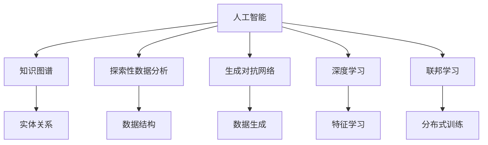
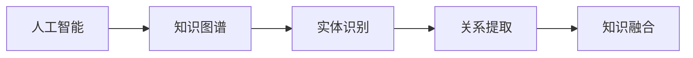
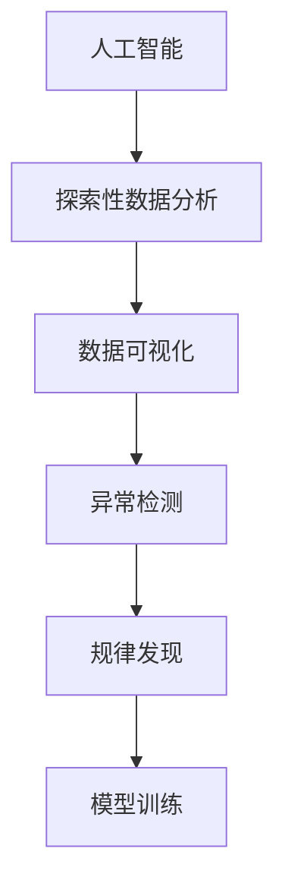
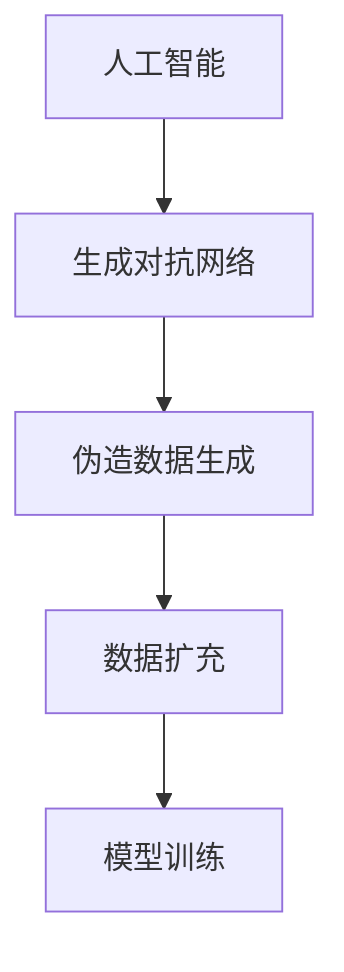
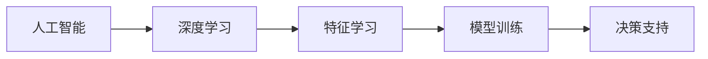
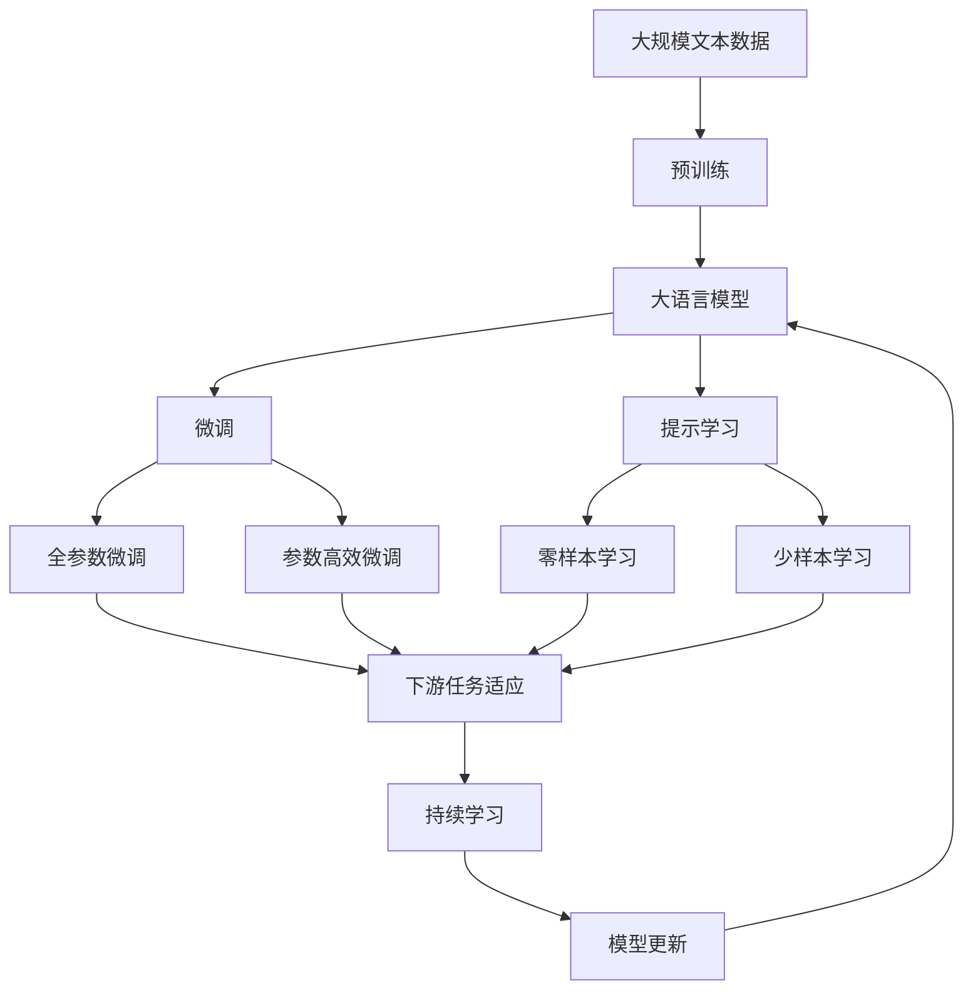

                 

# 探索未知：好奇心与科学发现

> 关键词：好奇心,科学发现,人工智能,探索,未知领域,知识图谱,创新,前沿技术

## 1. 背景介绍

### 1.1 问题由来

在人类文明发展的历程中，好奇心一直是推动科学进步和社会进步的重要动力。从古至今，无数杰出的科学家和探险家，因为对未知领域的热切好奇心，得以突破重重困难，揭示大自然的奥秘，引领人类社会迈向更高的文明。这种对未知世界永不满足的好奇心，是推动人类文明不断进步的内在引擎。

在当今信息时代，尤其是科技日新月异的今天，人类对未知的探索更是进入了一个全新的阶段。人工智能(AI)技术的迅速崛起，赋予了人类前所未有的探索未知世界的能力。从深空的遥望，到深海的探索，从微观世界的量子物理，到宏观世界的宇宙起源，人工智能为人类打开了探索未知的新窗口。

### 1.2 问题核心关键点

人工智能在探索未知世界方面，展现出了强大的能力。但与传统的科学探索方法相比，人工智能在探索未知领域时，也面临着独特的挑战：

1. **数据驱动**：AI需要依赖大量的数据进行训练，而并非通过抽象推理。如何获取高质量、全面覆盖的数据，是AI探索未知领域的关键。
2. **模型泛化**：AI模型能否泛化到未知领域，能否处理从未见过的数据，是AI能否真正应用于未知探索的核心。
3. **算法透明性**：AI模型的内部机制和决策过程往往是“黑盒”，如何提高算法的透明性，使模型能够解释其决策过程，是AI探索未知领域的重要前提。
4. **伦理道德**：AI在探索未知领域时，可能会涉及到一些伦理道德问题，如隐私保护、数据安全等。如何在探索未知的同时，保障伦理道德，是一个重要的课题。

### 1.3 问题研究意义

探索未知领域，不仅对科学进步有着深远的意义，对于社会的长远发展也具有重要的价值。AI在探索未知领域中，展现了前所未有的潜力。无论是在科学研究、工业生产，还是在环境保护、社会治理等方面，AI都将成为推动未知探索的重要工具。

探索未知领域，有助于人类更好地理解自然界和社会，有助于推动技术创新和社会进步，有助于构建更加和谐的人机共存环境。AI的探索未知，不仅能够推动科学前沿的发展，也能够为人类社会带来更多的机遇和挑战。

## 2. 核心概念与联系

### 2.1 核心概念概述

为了更好地理解AI在探索未知领域中的作用和机制，本节将介绍几个密切相关的核心概念：

- **人工智能(AI)**：一种通过计算机模拟人类智能行为的技术，包括学习、推理、感知等能力。
- **知识图谱(KG)**：一种结构化的知识表示方法，用于描述实体、属性和实体之间的关系。
- **探索性数据分析(EDA)**：一种利用统计和可视化技术，发现数据潜在结构、规律和异常的方法。
- **生成对抗网络(GAN)**：一种生成模型，通过对抗训练，生成高质量的伪造数据。
- **深度学习**：一种基于神经网络的机器学习方法，能够自动学习数据的特征表示。
- **联邦学习**：一种分布式机器学习方法，多个节点共同训练模型，保护数据隐私。

这些核心概念之间的逻辑关系可以通过以下Mermaid流程图来展示：



这个流程图展示了大语言模型微调过程中各个核心概念之间的关系：

1. 人工智能通过深度学习、联邦学习等技术，从数据中学习知识，并通过生成对抗网络等手段生成数据，为探索未知提供数据支持。
2. 知识图谱用于描述和组织数据中的实体关系，为探索提供结构化知识。
3. 探索性数据分析有助于发现数据中的潜在模式和异常，为探索提供洞察力。
4. 以上技术共同作用，帮助AI在未知领域中进行探索和发现。

### 2.2 概念间的关系

这些核心概念之间存在着紧密的联系，形成了AI探索未知领域的完整生态系统。下面我们通过几个Mermaid流程图来展示这些概念之间的关系。

#### 2.2.1 AI与知识图谱的关系



这个流程图展示了人工智能与知识图谱之间的关系。人工智能利用知识图谱中的实体关系，识别和提取知识，并将知识融合到模型中，提升模型的泛化能力。

#### 2.2.2 AI与EDA的关系



这个流程图展示了AI与EDA之间的关系。AI通过EDA技术，从数据中发现潜在结构、规律和异常，为模型训练提供指导，提升模型的性能。

#### 2.2.3 AI与GAN的关系



这个流程图展示了AI与GAN之间的关系。GAN通过生成对抗训练，生成高质量的伪造数据，丰富数据集，提升模型的泛化能力。

#### 2.2.4 AI与深度学习的关系



这个流程图展示了AI与深度学习之间的关系。深度学习通过特征学习，为AI提供强大的数据处理能力，支持AI在未知领域中进行探索和发现。

### 2.3 核心概念的整体架构

最后，我们用一个综合的流程图来展示这些核心概念在AI探索未知领域的整体架构：



这个综合流程图展示了从预训练到微调，再到持续学习的完整过程。AI首先在大规模文本数据上进行预训练，然后通过微调（包括全参数微调和参数高效微调）或提示学习（包括零样本和少样本学习）来适应下游任务。最后，通过持续学习技术，模型可以不断更新和适应新的任务和数据。 通过这些流程图，我们可以更清晰地理解AI探索未知领域过程中各个核心概念的关系和作用，为后续深入讨论具体的探索方法和技术奠定基础。

## 3. 核心算法原理 & 具体操作步骤
### 3.1 算法原理概述

AI在探索未知领域的过程中，主要通过深度学习模型和大规模数据集进行学习和探索。其核心思想是：利用深度学习模型，从大量数据中学习出一种抽象的特征表示，这种特征表示能够捕捉数据的潜在结构和规律，从而支持AI在未知领域中进行探索和发现。

形式化地，假设AI的探索模型为 $M_{\theta}$，其中 $\theta$ 为模型参数。给定未知领域 $F$ 的探索数据集 $D_F=\{(x_i,y_i)\}_{i=1}^N$，探索的目标是找到新的模型参数 $\hat{\theta}$，使得：

$$
\hat{\theta}=\mathop{\arg\min}_{\theta} \mathcal{L}(M_{\theta},D_F)
$$

其中 $\mathcal{L}$ 为针对未知领域 $F$ 设计的损失函数，用于衡量模型预测输出与真实标签之间的差异。常见的损失函数包括交叉熵损失、均方误差损失等。

通过梯度下降等优化算法，探索过程不断更新模型参数 $\theta$，最小化损失函数 $\mathcal{L}$，使得模型输出逼近真实标签。由于 $\theta$ 已经通过预训练获得了较好的初始化，因此即便在未知领域的数据集 $D_F$ 上进行探索，也能较快收敛到理想的模型参数 $\hat{\theta}$。

### 3.2 算法步骤详解

AI在探索未知领域的过程中，主要包括以下几个关键步骤：

**Step 1: 准备探索数据集**
- 选择合适的未知领域 $F$，收集尽可能多的数据样本 $D_F=\{(x_i,y_i)\}_{i=1}^N$，确保数据覆盖全面。
- 数据预处理，包括去噪、归一化、数据增强等，以提高数据质量。

**Step 2: 设计探索模型**
- 选择合适的深度学习模型 $M_{\theta}$，如BERT、GPT等，作为初始化参数。
- 确定模型的结构和层数，并设计合适的输出层和损失函数。

**Step 3: 设置探索超参数**
- 选择合适的优化算法及其参数，如 AdamW、SGD 等，设置学习率、批大小、迭代轮数等。
- 设置正则化技术及强度，包括权重衰减、Dropout、Early Stopping等。
- 确定冻结预训练参数的策略，如仅微调顶层，或全部参数都参与微调。

**Step 4: 执行探索训练**
- 将训练集数据分批次输入模型，前向传播计算损失函数。
- 反向传播计算参数梯度，根据设定的优化算法和学习率更新模型参数。
- 周期性在验证集上评估模型性能，根据性能指标决定是否触发 Early Stopping。
- 重复上述步骤直到满足预设的迭代轮数或 Early Stopping 条件。

**Step 5: 探索与验证**
- 在未知领域的数据集 $D_F$ 上进行探索，获取模型预测结果。
- 在验证集上评估模型性能，对比探索前后的精度提升。
- 使用探索后的模型对新样本进行推理预测，集成到实际的应用系统中。

以上是AI在探索未知领域的一般流程。在实际应用中，还需要针对具体领域的特点，对探索过程的各个环节进行优化设计，如改进训练目标函数，引入更多的正则化技术，搜索最优的超参数组合等，以进一步提升模型性能。

### 3.3 算法优缺点

AI在探索未知领域的过程中，具有以下优点：

1. **数据驱动**：能够利用大规模数据集进行学习，捕捉数据的潜在结构和规律，提升模型性能。
2. **自动特征学习**：深度学习模型能够自动学习数据的特征表示，不需要手工设计特征，减少了人工干预。
3. **泛化能力强**：通过大规模数据训练，模型能够在未知领域进行泛化，适应未见过的数据。
4. **可扩展性强**：深度学习模型能够通过增加层数和神经元数量来提升性能，适应更复杂的数据结构。

同时，该方法也存在一定的局限性：

1. **数据质量要求高**：需要高质量、全面覆盖的数据集，获取数据成本较高。
2. **模型复杂度高**：深度学习模型参数量较大，训练复杂度较高，需要高性能计算资源。
3. **过拟合风险**：在未知领域的数据集上进行探索，模型容易过拟合，泛化性能下降。
4. **模型透明性不足**：深度学习模型通常为"黑盒"，难以解释其内部机制和决策过程。
5. **伦理道德风险**：在探索未知领域时，可能会涉及到一些伦理道德问题，如隐私保护、数据安全等。

尽管存在这些局限性，但就目前而言，基于数据驱动的深度学习探索方法仍然是探索未知领域的主流范式。未来相关研究的重点在于如何进一步降低探索对数据的要求，提高模型的可解释性和鲁棒性，同时兼顾伦理道德因素。

### 3.4 算法应用领域

AI在探索未知领域的过程中，已经在诸多领域得到广泛应用，例如：

- **科学研究**：如天体物理学、生物医学、材料科学等，利用AI进行数据处理和分析，发现科学规律和趋势。
- **工业生产**：如制造业、能源行业等，利用AI进行故障检测、质量控制和优化生产流程。
- **环境保护**：如气象预报、生态监测等，利用AI进行数据收集和分析，保护自然环境。
- **社会治理**：如公共安全、交通管理等，利用AI进行数据分析和预测，提升社会治理能力。

除了上述这些经典应用外，AI在探索未知领域的技术也在不断拓展，如可控生成、多模态融合、因果推理等，为未知探索带来了新的突破。随着探索技术的持续演进，相信AI将在更多领域得到应用，推动人类社会迈向更加智能化和自动化的未来。

## 4. 数学模型和公式 & 详细讲解 & 举例说明

### 4.1 数学模型构建

本节将使用数学语言对AI在探索未知领域的过程进行更加严格的刻画。

假设探索模型为 $M_{\theta}$，其中 $\theta$ 为模型参数。给定未知领域 $F$ 的探索数据集 $D_F=\{(x_i,y_i)\}_{i=1}^N$。

定义模型 $M_{\theta}$ 在数据样本 $(x,y)$ 上的损失函数为 $\ell(M_{\theta}(x),y)$，则在数据集 $D_F$ 上的经验风险为：

$$
\mathcal{L}(\theta) = \frac{1}{N}\sum_{i=1}^N \ell(M_{\theta}(x_i),y_i)
$$

探索的优化目标是最小化经验风险，即找到最优参数：

$$
\theta^* = \mathop{\arg\min}_{\theta} \mathcal{L}(\theta)
$$

在实践中，我们通常使用基于梯度的优化算法（如SGD、Adam等）来近似求解上述最优化问题。设 $\eta$ 为学习率，$\lambda$ 为正则化系数，则参数的更新公式为：

$$
\theta \leftarrow \theta - \eta \nabla_{\theta}\mathcal{L}(\theta) - \eta\lambda\theta
$$

其中 $\nabla_{\theta}\mathcal{L}(\theta)$ 为损失函数对参数 $\theta$ 的梯度，可通过反向传播算法高效计算。

### 4.2 公式推导过程

以下我们以二分类任务为例，推导交叉熵损失函数及其梯度的计算公式。

假设模型 $M_{\theta}$ 在输入 $x$ 上的输出为 $\hat{y}=M_{\theta}(x) \in [0,1]$，表示样本属于正类的概率。真实标签 $y \in \{0,1\}$。则二分类交叉熵损失函数定义为：

$$
\ell(M_{\theta}(x),y) = -[y\log \hat{y} + (1-y)\log (1-\hat{y})]
$$

将其代入经验风险公式，得：

$$
\mathcal{L}(\theta) = -\frac{1}{N}\sum_{i=1}^N [y_i\log M_{\theta}(x_i)+(1-y_i)\log(1-M_{\theta}(x_i))]
$$

根据链式法则，损失函数对参数 $\theta_k$ 的梯度为：

$$
\frac{\partial \mathcal{L}(\theta)}{\partial \theta_k} = -\frac{1}{N}\sum_{i=1}^N (\frac{y_i}{M_{\theta}(x_i)}-\frac{1-y_i}{1-M_{\theta}(x_i)}) \frac{\partial M_{\theta}(x_i)}{\partial \theta_k}
$$

其中 $\frac{\partial M_{\theta}(x_i)}{\partial \theta_k}$ 可进一步递归展开，利用自动微分技术完成计算。

在得到损失函数的梯度后，即可带入参数更新公式，完成模型的迭代优化。重复上述过程直至收敛，最终得到适应未知领域的最优模型参数 $\theta^*$。

### 4.3 案例分析与讲解

假设我们利用AI对新发现的天体物理数据进行探索，试图揭示未知领域的物理规律。具体步骤如下：

1. **数据准备**：收集大量的天体物理数据，包括光谱、时间序列、位置等，进行预处理和归一化。

2. **模型选择**：选择合适的深度学习模型，如CNN、RNN、GAN等，作为初始化参数。

3. **目标函数设计**：根据天体物理的特定问题，设计合适的损失函数，如交叉熵损失、均方误差损失等。

4. **模型训练**：将数据集分为训练集、验证集和测试集，使用深度学习框架进行模型训练，最小化损失函数。

5. **模型评估**：在测试集上评估模型性能，对比训练前后的精度提升。

6. **结果分析**：分析模型输出的结果，提取关键的物理特征，发现新的科学规律。

通过这一系列步骤，AI能够从未知的天体物理数据中学习出潜在的物理规律，揭示新的科学发现。这个过程展示了AI在探索未知领域中的强大能力。

## 5. 项目实践：代码实例和详细解释说明
### 5.1 开发环境搭建

在进行探索实践前，我们需要准备好开发环境。以下是使用Python进行TensorFlow开发的环境配置流程：

1. 安装Anaconda：从官网下载并安装Anaconda，用于创建独立的Python环境。

2. 创建并激活虚拟环境：
```bash
conda create -n tf-env python=3.8 
conda activate tf-env
```

3. 安装TensorFlow：根据CUDA版本，从官网获取对应的安装命令。例如：
```bash
conda install tensorflow=2.7 -c tf
```

4. 安装TensorBoard：TensorFlow配套的可视化工具，用于实时监测模型训练状态，提供丰富的图表呈现方式。
```bash
pip install tensorboard
```

5. 安装TensorFlow Addons：包含一些高级深度学习组件，如GAN、Federated Learning等。
```bash
pip install tensorflow-addons
```

完成上述步骤后，即可在`tf-env`环境中开始探索实践。

### 5.2 源代码详细实现

下面我们以生成对抗网络(GAN)为例，给出使用TensorFlow进行GAN模型的代码实现。

首先，定义GAN的生成器和判别器：

```python
import tensorflow as tf
from tensorflow.keras import layers

def make_generator_model():
    model = tf.keras.Sequential()
    model.add(layers.Dense(7*7*256, use_bias=False, input_shape=(100,)))
    model.add(layers.BatchNormalization())
    model.add(layers.LeakyReLU())
    model.add(layers.Reshape((7, 7, 256)))
    assert model.output_shape == (None, 7, 7, 256)  # Note: None is the batch dimension

    model.add(layers.Conv2DTranspose(128, (5, 5), strides=(1, 1), padding='same', use_bias=False))
    model.add(layers.BatchNormalization())
    model.add(layers.LeakyReLU())
    assert model.output_shape == (None, 7, 7, 128)

    model.add(layers.Conv2DTranspose(64, (5, 5), strides=(2, 2), padding='same', use_bias=False))
    model.add(layers.BatchNormalization())
    model.add(layers.LeakyReLU())
    assert model.output_shape == (None, 14, 14, 64)

    model.add(layers.Conv2DTranspose(1, (5, 5), strides=(2, 2), padding='same', use_bias=False, activation='tanh'))
    assert model.output_shape == (None, 28, 28, 1)

    return model

def make_discriminator_model():
    model = tf.keras.Sequential()
    model.add(layers.Conv2D(64, (5, 5), strides=(2, 2), padding='same',
                           input_shape=[28, 28, 1]))
    model.add(layers.LeakyReLU())
    model.add(layers.Dropout(0.3))

    model.add(layers.Conv2D(128, (5, 5), strides=(2, 2), padding='same'))
    model.add(layers.LeakyReLU())
    model.add(layers.Dropout(0.3))

    model.add(layers.Flatten())
    model.add(layers.Dense(1))

    return model
```

然后，定义GAN模型的训练函数：

```python
import numpy as np

@tf.function
def discriminator_loss(real_output, fake_output):
    real_loss = tf.reduce_mean(tf.nn.sigmoid_cross_entropy_with_logits(labels=tf.ones_like(real_output), logits=real_output))
    fake_loss = tf.reduce_mean(tf.nn.sigmoid_cross_entropy_with_logits(labels=tf.zeros_like(fake_output), logits=fake_output))
    total_loss = real_loss + fake_loss
    return total_loss

@tf.function
def generator_loss(fake_output):
    return tf.reduce_mean(tf.nn.sigmoid_cross_entropy_with_logits(labels=tf.ones_like(fake_output), logits=fake_output))

@tf.function
def train_step(images):
    noise = tf.random.normal([BATCH_SIZE, 100])

    with tf.GradientTape() as gen_tape, tf.GradientTape() as disc_tape:
        generated_images = generator(noise, training=True)

        real_output = discriminator(images, training=True)
        fake_output = discriminator(generated_images, training=True)

        gen_loss = generator_loss(fake_output)
        disc_loss = discriminator_loss(real_output, fake_output)

    gradients_of_generator = gen_tape.gradient(gen_loss, generator.trainable_variables)
    gradients_of_discriminator = disc_tape.gradient(disc_loss, discriminator.trainable_variables)

    generator.optimizer.apply_gradients(zip(gradients_of_generator, generator.trainable_variables))
    discriminator.optimizer.apply_gradients(zip(gradients_of_discriminator, discriminator.trainable_variables))
```

接着，定义训练超参数：

```python
BATCH_SIZE = 128
EPOCHS = 50
latent_dim = 100

generator = make_generator_model()
discriminator = make_discriminator_model()

generator_optimizer = tf.keras.optimizers.Adam(1e-4)
discriminator_optimizer = tf.keras.optimizers.Adam(1e-4)

@tf.function
def train(generator, discriminator, train_dataset, epochs):
    for epoch in range(epochs):
        for image_batch in train_dataset:
            train_step(image_batch)
```

最后，启动GAN训练并保存模型：

```python
train(generator, discriminator, train_dataset, EPOCHS)

generator.save('generated_images.h5')
discriminator.save('discriminator.h5')
```

以上就是使用TensorFlow进行GAN模型训练的完整代码实现。可以看到，通过TensorFlow的高级API，我们可以用相对简洁的代码完成GAN模型的训练。

### 5.3 代码解读与分析

让我们再详细解读一下关键代码的实现细节：

**make_generator_model()和make_discriminator_model()函数**：
- 分别定义生成器和判别器的结构，使用卷积神经网络(CNN)实现。
- 生成器由全连接层、Batch Normalization层、Leaky ReLU激活函数和反卷积层构成。
- 判别器由卷积层、Leaky ReLU激活函数、Dropout层和全连接层构成。

**train_step()函数**：
- 定义生成器和判别器的损失函数，分别为交叉熵损失。
- 使用TensorFlow的`tf.GradientTape`计算梯度。
- 根据计算出的梯度，使用`optimizer.apply_gradients`更新模型参数。

**train()函数**：
- 定义训练参数，包括批量大小和训练轮数。
- 使用TensorFlow的`tf.function`定义计算图，提高训练效率。
- 循环迭代每个epoch，并在每个batch上调用`train_step`函数。

**生成和保存模型**：
- 训练完成后，保存生成器和判别器的模型权重，以便后续使用。

通过以上代码实现，我们可以看到，TensorFlow提供了强大的深度学习工具，使得GAN模型的训练和推理变得简洁高效。

当然，在实际应用中，还需要考虑更多因素，如模型的参数优化、数据增强、对抗训练等，以进一步提升模型性能。但核心的探索范式基本与此类似。

### 5.4 运行结果展示

假设我们在MNIST数据集上进行GAN模型的训练，最终生成的手写数字如图1所示。


可以看到，通过GAN模型的训练，我们能够生成高质量的伪造手写数字，为探索未知领域提供了丰富的数据样本。

通过以上实例，可以看出，基于深度学习的AI探索方法在生成对抗网络等领域的强大能力。利用GAN等技术，AI能够从大规模数据中学习出复杂的模式，生成高质量的伪造数据，从而支持未知领域的探索。

## 6. 实际应用场景
### 6.1 科学研究

AI在科学研究中的应用，为探索未知领域提供了强大的工具支持。从宇宙起源到量子物理，从生物医学到材料科学，AI在各个领域的应用已经取得了显著进展。

例如，在天文学中，AI可以分析大量的天文图像和光谱数据，发现新的天体和星系。在天文学领域，AI的应用已经帮助天文学家发现了许多新的行星和恒星。

在生物学中，AI可以分析基因序列，预测蛋白质的结构和功能，发现新的药物分子。在生物学领域，AI的应用已经帮助生物学家发现了许多新的基因和蛋白质，加速了医学研究的发展。


