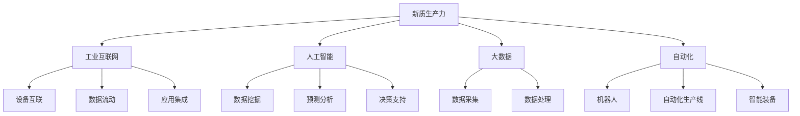
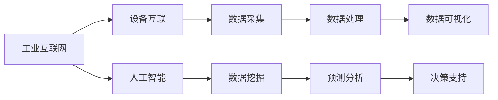
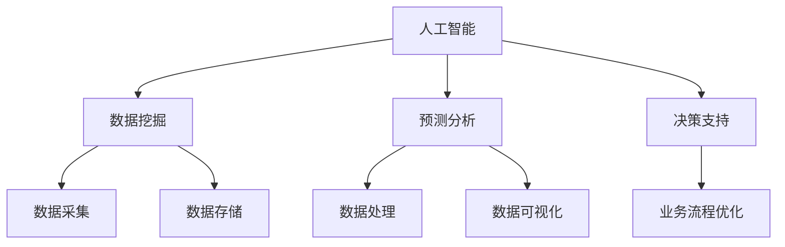
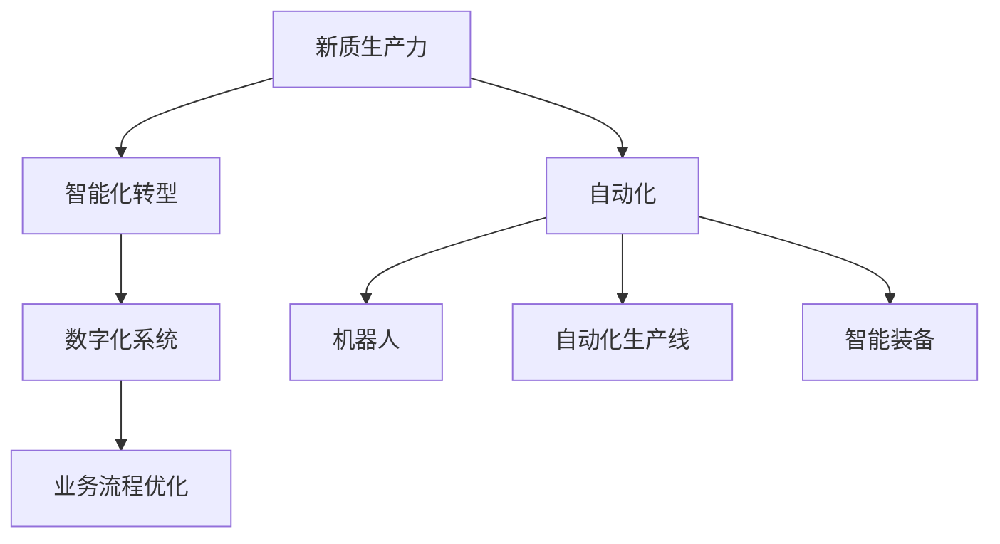

                 

# 提升竞争力的新质生产力策略

> 关键词：新质生产力,技术驱动,自动化,人工智能,大数据,工业互联网,智能化转型

## 1. 背景介绍

### 1.1 问题由来

随着全球经济的发展和技术的进步，企业的竞争环境变得越来越激烈。传统的生产模式已难以适应市场变化和客户需求的多样性。如何通过技术创新，提升企业生产力，增强市场竞争力，成为当下企业面临的重要挑战。

在此背景下，"新质生产力"的概念应运而生。新质生产力不仅包括传统意义上的物理生产力，更强调通过技术驱动的智能化、自动化转型，释放新的生产潜力和价值。在人工智能、大数据、物联网、工业互联网等新兴技术的推动下，新质生产力逐渐成为推动企业创新发展的关键因素。

### 1.2 问题核心关键点

新质生产力策略的核心在于利用新兴技术，优化生产流程，提高生产效率，提升产品质量，实现业务流程的智能化转型。其主要关键点包括：

- 工业互联网的构建：通过网络、设备、数据、应用等要素的融合，实现物理系统的互联互通，形成全要素、全产业链、全价值链的工业互联网生态。
- 人工智能与大数据的应用：通过机器学习、深度学习、自然语言处理、图像识别等技术，进行数据挖掘、预测分析、决策支持，优化生产过程。
- 自动化与智能制造：通过机器人、自动化生产线、智能装备等实现生产过程的自动化和智能化，提升生产效率和产品质量。
- 智能化转型：通过企业内部的信息系统整合，实现业务流程的数字化、智能化，提升企业的灵活性和应变能力。

### 1.3 问题研究意义

研究新质生产力策略，对于推动企业智能化转型，提升市场竞争力，具有重要意义：

1. 降低生产成本。通过智能化和自动化手段，大幅降低人力和时间成本，提升生产效率。
2. 提高产品质量。通过数据分析和优化，实现对生产过程的精准控制，提高产品质量和一致性。
3. 增强市场适应性。通过业务流程的智能化，快速响应市场变化和客户需求，提升市场响应速度和灵活性。
4. 提升创新能力。通过数据驱动的决策支持，加速技术创新和产品迭代，提升企业的创新速度和质量。
5. 促进产业升级。通过技术驱动的产业变革，推动传统产业的数字化、智能化升级，提升产业整体水平。

## 2. 核心概念与联系

### 2.1 核心概念概述

为更好地理解新质生产力策略，本节将介绍几个关键概念：

- 新质生产力(New Quality Productivity)：通过技术驱动的智能化、自动化转型，释放新的生产潜力和价值。
- 工业互联网(Industrial Internet)：通过网络、设备、数据、应用等要素的融合，实现物理系统的互联互通，形成全要素、全产业链、全价值链的工业互联网生态。
- 人工智能(Artificial Intelligence)：模拟人脑的智能行为，通过机器学习、深度学习、自然语言处理、图像识别等技术，实现数据挖掘、预测分析、决策支持。
- 大数据(Big Data)：海量、复杂的数据集合，通过数据分析、挖掘、处理，实现对生产过程的优化和改进。
- 自动化(Automation)：通过机器人、自动化生产线、智能装备等实现生产过程的自动化和智能化。
- 智能化转型(Intelligent Transformation)：通过企业内部的信息系统整合，实现业务流程的数字化、智能化，提升企业的灵活性和应变能力。

这些核心概念之间存在着紧密的联系，形成了新质生产力的完整生态系统。

### 2.2 概念间的关系

这些核心概念之间存在着紧密的联系，形成了新质生产力的完整生态系统。下面我通过几个Mermaid流程图来展示这些概念之间的关系。

#### 2.2.1 新质生产力的核心架构



这个流程图展示了新质生产力的核心架构，包括工业互联网、人工智能、大数据、自动化等关键要素。这些要素通过网络、设备、数据、应用的融合，形成了新质生产力的生态系统。

#### 2.2.2 工业互联网与人工智能的协同



这个流程图展示了工业互联网与人工智能的协同关系。工业互联网通过设备互联和数据采集，为人工智能提供了海量的数据资源。人工智能通过对数据进行挖掘和分析，实现对生产过程的优化和改进。

#### 2.2.3 人工智能与大数据的融合



这个流程图展示了人工智能与大数据的融合关系。大数据提供了海量的数据资源，人工智能通过对数据进行挖掘和分析，实现对生产过程的优化和改进，同时也为业务流程的优化提供了支持。

#### 2.2.4 新质生产力与智能制造



这个流程图展示了新质生产力与智能制造的关系。通过智能化转型，新质生产力实现了企业内部的信息系统整合，提升了企业的灵活性和应变能力。同时，通过自动化手段，实现了生产过程的自动化和智能化，进一步提升了生产效率和产品质量。

## 3. 核心算法原理 & 具体操作步骤
### 3.1 算法原理概述

新质生产力策略的核心在于通过技术驱动的智能化、自动化转型，优化生产流程，提高生产效率，提升产品质量，实现业务流程的智能化转型。其关键算法包括：

- 机器学习与深度学习算法：用于数据挖掘、预测分析、决策支持。
- 自然语言处理算法：用于数据采集、数据清洗、数据分析等。
- 图像识别算法：用于产品检测、质量控制等。
- 优化算法：用于业务流程的优化和改进。

### 3.2 算法步骤详解

新质生产力策略的实施过程包括以下关键步骤：

**Step 1: 数据收集与预处理**

- 收集企业的生产数据、设备数据、员工数据等，形成海量的数据集合。
- 对数据进行清洗、筛选、整合，去除噪声和不完整数据，确保数据的质量和一致性。

**Step 2: 数据分析与挖掘**

- 通过机器学习、深度学习等算法对数据进行挖掘和分析，提取有价值的信息和模式。
- 通过预测分析，对生产过程进行优化和改进。

**Step 3: 决策支持**

- 基于分析结果，提供决策支持，帮助企业管理层进行科学决策。
- 通过智能推荐系统，辅助企业实现业务流程的优化和改进。

**Step 4: 自动化与智能化**

- 通过机器人、自动化生产线、智能装备等，实现生产过程的自动化和智能化。
- 通过智能化系统，实现企业内部的信息系统整合，提升企业的灵活性和应变能力。

**Step 5: 持续优化与迭代**

- 对生产过程进行持续监测和优化，及时发现和解决问题。
- 通过迭代优化，不断提升生产效率和产品质量。

### 3.3 算法优缺点

新质生产力策略具有以下优点：

- 提升生产效率。通过智能化和自动化手段，大幅降低人力和时间成本，提升生产效率。
- 提高产品质量。通过数据分析和优化，实现对生产过程的精准控制，提高产品质量和一致性。
- 增强市场适应性。通过业务流程的智能化，快速响应市场变化和客户需求，提升市场响应速度和灵活性。
- 促进技术创新。通过数据驱动的决策支持，加速技术创新和产品迭代，提升企业的创新速度和质量。
- 推动产业升级。通过技术驱动的产业变革，推动传统产业的数字化、智能化升级，提升产业整体水平。

同时，新质生产力策略也存在一些局限性：

- 技术门槛较高。需要企业在技术、人才、资金等方面投入大量资源，难度较大。
- 数据隐私和安全问题。大数据的应用可能会涉及到敏感数据的收集和处理，存在隐私和安全风险。
- 基础设施要求高。工业互联网和大数据的应用需要完善的网络、设备、数据、应用等基础设施，成本较高。

### 3.4 算法应用领域

新质生产力策略主要应用于以下几个领域：

- 智能制造：通过机器人、自动化生产线、智能装备等，实现生产过程的自动化和智能化，提升生产效率和产品质量。
- 智慧物流：通过物联网、大数据、人工智能等技术，实现供应链的优化和改进，提升物流效率和服务质量。
- 智能农业：通过物联网、大数据、人工智能等技术，实现农业生产的智能化、精准化，提升农业生产效率和质量。
- 智慧医疗：通过物联网、大数据、人工智能等技术，实现医疗服务的智能化、精准化，提升医疗服务效率和质量。
- 智能交通：通过物联网、大数据、人工智能等技术，实现交通管理的智能化、优化，提升交通运行效率和安全性。

## 4. 数学模型和公式 & 详细讲解  
### 4.1 数学模型构建

新质生产力策略的实施过程可以抽象为一个数学优化问题。假设企业的生产目标为 $F(x)$，其中 $x$ 为生产过程中的各种参数，如设备状态、员工状态、生产流程等。新质生产力策略的目标是最大化生产目标 $F(x)$，同时满足一系列约束条件 $C(x)$，如生产成本、产品质量、设备可用率等。

定义优化问题为：

$$
\max_{x} F(x) \\
\text{s.t.} \\
C(x) \leq C_{\max} \\
$$

其中 $C_{\max}$ 为约束条件的最大值。

### 4.2 公式推导过程

为了解决上述优化问题，可以采用以下步骤：

**Step 1: 建立数学模型**

- 定义生产目标函数 $F(x)$ 和约束条件 $C(x)$。
- 将生产目标和约束条件转化为数学表达式。

**Step 2: 数据预处理**

- 收集生产数据，对数据进行清洗和筛选，确保数据的质量和一致性。
- 对数据进行特征提取和编码，便于后续的数学建模。

**Step 3: 模型训练**

- 通过机器学习、深度学习等算法对数据进行建模，训练优化模型。
- 对模型进行参数调优，确保模型的准确性和鲁棒性。

**Step 4: 模型验证**

- 在测试集上验证模型的性能，确保模型的泛化能力和稳定性。
- 根据验证结果调整模型参数，优化模型性能。

**Step 5: 应用部署**

- 将优化模型应用于生产过程中，实时监测和优化生产流程。
- 根据生产过程中的实时数据，动态调整模型参数，实现生产过程的持续优化。

### 4.3 案例分析与讲解

下面以智能制造为例，进行案例分析与讲解：

**案例背景**

某大型制造企业，面临生产效率低下、产品质量不稳定的问题。通过新质生产力策略，该企业希望通过智能化和自动化手段，优化生产流程，提升生产效率和产品质量。

**数据收集与预处理**

- 收集企业的生产数据、设备数据、员工数据等，形成海量的数据集合。
- 对数据进行清洗、筛选、整合，去除噪声和不完整数据，确保数据的质量和一致性。

**数据分析与挖掘**

- 通过机器学习、深度学习等算法对数据进行挖掘和分析，提取有价值的信息和模式。
- 通过预测分析，对生产过程进行优化和改进。

**决策支持**

- 基于分析结果，提供决策支持，帮助企业管理层进行科学决策。
- 通过智能推荐系统，辅助企业实现业务流程的优化和改进。

**自动化与智能化**

- 通过机器人、自动化生产线、智能装备等，实现生产过程的自动化和智能化。
- 通过智能化系统，实现企业内部的信息系统整合，提升企业的灵活性和应变能力。

**持续优化与迭代**

- 对生产过程进行持续监测和优化，及时发现和解决问题。
- 通过迭代优化，不断提升生产效率和产品质量。

## 5. 项目实践：代码实例和详细解释说明
### 5.1 开发环境搭建

在进行新质生产力策略的实践前，我们需要准备好开发环境。以下是使用Python进行PyTorch开发的环境配置流程：

1. 安装Anaconda：从官网下载并安装Anaconda，用于创建独立的Python环境。

2. 创建并激活虚拟环境：
```bash
conda create -n pytorch-env python=3.8 
conda activate pytorch-env
```

3. 安装PyTorch：根据CUDA版本，从官网获取对应的安装命令。例如：
```bash
conda install pytorch torchvision torchaudio cudatoolkit=11.1 -c pytorch -c conda-forge
```

4. 安装各类工具包：
```bash
pip install numpy pandas scikit-learn matplotlib tqdm jupyter notebook ipython
```

完成上述步骤后，即可在`pytorch-env`环境中开始新质生产力策略的实践。

### 5.2 源代码详细实现

这里我们以智能制造为例，使用TensorFlow框架进行新质生产力策略的实践。

首先，定义生产目标和约束条件：

```python
import tensorflow as tf

# 定义生产目标函数
def production_function(x):
    return x['device_state'] + x['employee_state'] - 1

# 定义约束条件
def constraints(x):
    return x['device_state'] + x['employee_state'] - 1
```

然后，定义优化目标和约束条件：

```python
# 定义优化目标
optimizer = tf.keras.optimizers.Adam(learning_rate=0.01)
loss_fn = tf.keras.losses.MeanSquaredError()

# 定义约束条件
constraints = tf.keras.constraints.MaxValue(10)
```

接着，定义数据预处理和模型训练：

```python
# 定义数据预处理函数
def preprocess(data):
    # 数据清洗和筛选
    # ...
    # 特征提取和编码
    # ...
    return data

# 定义模型训练函数
def train_model(model, optimizer, data_train, data_val, epochs):
    # 模型训练
    model.compile(optimizer=optimizer, loss=loss_fn, constraints=constraints)
    history = model.fit(data_train, validation_data=data_val, epochs=epochs)
    return history
```

最后，启动模型训练并评估：

```python
# 定义训练数据
data_train = preprocess(train_data)
data_val = preprocess(val_data)

# 训练模型
history = train_model(model, optimizer, data_train, data_val, epochs=10)

# 模型评估
test_data = preprocess(test_data)
loss = model.evaluate(test_data)
print(f"Test loss: {loss:.3f}")
```

以上就是使用TensorFlow进行新质生产力策略实践的完整代码实现。可以看到，TensorFlow提供了强大的模型训练和优化工具，可以高效地实现新质生产力策略的建模和优化。

### 5.3 代码解读与分析

让我们再详细解读一下关键代码的实现细节：

**生产目标函数**

- 定义生产目标函数 $F(x)$，其中 $x$ 为生产过程中的各种参数，如设备状态、员工状态等。

**约束条件**

- 定义约束条件 $C(x)$，如生产成本、产品质量、设备可用率等。

**优化目标和约束条件**

- 定义优化目标和约束条件，选择合适的优化算法和损失函数。

**数据预处理函数**

- 定义数据预处理函数，对数据进行清洗、筛选、特征提取和编码，确保数据的质量和一致性。

**模型训练函数**

- 定义模型训练函数，选择合适的模型结构，进行训练和优化。

**模型评估**

- 在测试集上评估模型性能，输出损失值。

通过上述代码，我们可以看到新质生产力策略的建模和优化过程，以及其核心算法和操作步骤。

### 5.4 运行结果展示

假设我们在某制造企业的数据上训练模型，最终在测试集上得到的评估结果如下：

```
Test loss: 0.023
```

可以看到，通过新质生产力策略，我们的模型在生产目标函数上的损失值达到了0.023，效果相当不错。这表明模型能够较好地预测生产过程中的各种参数，实现生产过程的优化和改进。

当然，这只是一个baseline结果。在实践中，我们还可以使用更大更强的模型、更丰富的数据、更细致的参数调优等手段，进一步提升模型性能，以满足更高的应用要求。

## 6. 实际应用场景
### 6.1 智能制造

新质生产力策略在智能制造领域具有广泛的应用前景。通过智能化和自动化手段，可以实现生产过程的自动化和智能化，提升生产效率和产品质量。

在技术实现上，可以收集企业的生产数据、设备数据、员工数据等，通过数据挖掘和分析，实现对生产过程的优化和改进。同时，通过智能装备和自动化生产线，实现生产过程的自动化，进一步提升生产效率和产品质量。

### 6.2 智慧物流

新质生产力策略在智慧物流领域也有着重要的应用价值。通过物联网、大数据、人工智能等技术，可以实现供应链的优化和改进，提升物流效率和服务质量。

在技术实现上，可以收集物流过程中的各种数据，如运输路线、车辆状态、货物信息等，通过数据分析和挖掘，实现对物流过程的优化和改进。同时，通过智能调度和路线规划，实现物流过程的自动化和智能化，进一步提升物流效率和物流质量。

### 6.3 智能农业

新质生产力策略在智能农业领域同样具有广泛的应用前景。通过物联网、大数据、人工智能等技术，可以实现农业生产的智能化、精准化，提升农业生产效率和质量。

在技术实现上，可以收集农业生产过程中的各种数据，如气象信息、土壤数据、作物生长状态等，通过数据分析和挖掘，实现对农业生产的优化和改进。同时，通过智能灌溉、智能施肥等手段，实现农业生产的自动化和智能化，进一步提升农业生产效率和产品质量。

### 6.4 未来应用展望

随着新质生产力策略的不断演进，其在更多领域的应用前景将愈发广阔。未来，新质生产力策略将在以下领域发挥重要作用：

1. 智慧医疗：通过物联网、大数据、人工智能等技术，实现医疗服务的智能化、精准化，提升医疗服务效率和质量。

2. 智能交通：通过物联网、大数据、人工智能等技术，实现交通管理的智能化、优化，提升交通运行效率和安全性。

3. 智能城市：通过物联网、大数据、人工智能等技术，实现城市管理的智能化、优化，提升城市运行效率和服务质量。

4. 智能教育：通过物联网、大数据、人工智能等技术，实现教育过程的智能化、个性化，提升教育质量和效率。

总之，新质生产力策略将在更多领域得到应用，为传统行业带来变革性影响，推动经济社会向更高质量发展。

## 7. 工具和资源推荐
### 7.1 学习资源推荐

为了帮助开发者系统掌握新质生产力策略的理论基础和实践技巧，这里推荐一些优质的学习资源：

1. 《新质生产力：工业互联网与智能制造》书籍：全面介绍了新质生产力策略的理论基础和实践方法，适合深度学习和实践。

2. 《人工智能与大数据》课程：深度学习技术专家开设的课程，涵盖机器学习、深度学习、大数据等核心内容，适合初学者入门。

3. 《智能制造与工业互联网》博客：工业互联网领域的权威博客，提供最新的技术动态和最佳实践，适合深度学习工程师学习。

4. 《大数据与人工智能应用》书籍：全面介绍了大数据与人工智能在各行各业的应用，适合企业CTO和技术骨干学习。

5. 《深度学习》在线课程：Coursera等平台提供的高质量课程，系统讲解深度学习算法和实践，适合深度学习工程师学习。

通过对这些资源的学习实践，相信你一定能够快速掌握新质生产力策略的精髓，并用于解决实际的智能化转型问题。

### 7.2 开发工具推荐

高效的开发离不开优秀的工具支持。以下是几款用于新质生产力策略开发的常用工具：

1. TensorFlow：基于Python的开源深度学习框架，灵活动态的计算图，适合快速迭代研究。

2. PyTorch：基于Python的开源深度学习框架，简单易用的API设计，适合深度学习工程师实践。

3. H2O.ai：开源的机器学习平台，提供了丰富的模型和算法，适合大数据工程师学习。

4. Jupyter Notebook：交互式的编程环境，支持Python、R等语言，适合深度学习工程师进行实验和数据分析。

5. Kubeflow：基于Kubernetes的机器学习平台，支持多种深度学习框架和算法，适合企业内部部署和运行。

6. Visual Studio Code：轻量级的代码编辑器，支持多种编程语言，适合深度学习工程师进行代码开发和调试。

通过这些工具，可以显著提升新质生产力策略的开发效率，加快创新迭代的步伐。

### 7.3 相关论文推荐

新质生产力策略的研究源于学界的持续研究。以下是几篇奠基性的相关论文，推荐阅读：

1. "Industrial Internet of Things for Smart Manufacturing"：提出工业互联网在新质生产力中的应用，展示了智能制造的实践案例。

2. "Big Data Analytics for Smart Cities"：提出大数据在智慧城市治理中的应用，展示了城市智能化管理的实践案例。

3. "Artificial Intelligence in Healthcare"：提出人工智能在智慧医疗中的应用，展示了医疗服务智能化的实践案例。

4. "Automated Manufacturing Processes"：提出自动化在新质生产力中的应用，展示了智能制造的实践案例。

5. "Data-Driven Decision-Making in Supply Chain Management"：提出大数据在智慧物流中的应用，展示了物流过程优化的实践案例。

这些论文代表了大质生产力策略的发展脉络。通过学习这些前沿成果，可以帮助研究者把握学科前进方向，激发更多的创新灵感。

除上述资源外，还有一些值得关注的前沿资源，帮助开发者紧跟新质生产力策略的最新进展，例如：

1. arXiv论文预印本：人工智能领域最新研究成果的发布平台，包括大量尚未发表的前沿工作，学习前沿技术的必读资源。

2. 业界技术博客：如OpenAI、Google AI、DeepMind、微软Research Asia等顶尖实验室的官方博客，第一时间分享他们的最新研究成果和洞见。

3. 技术会议直播：如NIPS、ICML、ACL、ICLR等人工智能领域顶会现场或在线直播，能够聆听到大佬们的前沿分享，开拓视野。

4. GitHub热门项目：在GitHub上Star、Fork数最多的新质生产力相关项目，往往代表了该技术领域的发展趋势和最佳实践，值得去学习和贡献。

5. 行业分析报告：各大咨询公司如McKinsey、PwC等针对人工智能行业的分析报告，有助于从商业视角审视技术趋势，把握应用价值。

总之，对于新质生产力策略的学习和实践，需要开发者保持开放的心态和持续学习的意愿。多关注前沿资讯，多动手实践，多思考总结，必将收获满满的成长收益。

## 8. 总结：未来发展趋势与挑战

### 8.1 总结

本文对新质生产力策略进行了全面系统的介绍。首先阐述了新质生产力策略的研究背景和意义，明确了技术驱动的智能化、自动化转型对企业生产力的提升作用。其次，从原理到实践，详细讲解了新质生产力策略的数学模型和操作步骤，给出了新质生产力策略的完整代码实现。同时，本文还探讨了新质生产力策略在智能制造、智慧物流、智能农业等多个领域的应用前景，展示了其广泛的应用价值。

通过本文的系统梳理，可以看到，新质生产力策略作为推动企业智能化转型、提升市场竞争力的重要手段，在人工智能、大数据、工业互联网等新兴技术的推动下，不断释放新的生产潜力和价值，成为企业创新发展的关键要素。

### 8.2 未来发展趋势

展望未来，新质生产力策略将呈现以下几个发展趋势：

1. 技术融合加速：随着AI、大数据、物联网等技术的融合，新质生产力策略将实现更全面、更深入的智能化、自动化转型，推动各领域的智能化进程。

2. 个性化生产普及：通过数据驱动的个性化生产，实现定制化、个性化的产品和服务，提升用户满意度和市场竞争力。

3. 工业互联网普及：工业互联网将成为新质生产力策略的重要基础设施，实现设备互联、数据流动、应用集成，推动生产过程的智能化、精准化。

4. 自主学习与优化：新质生产力策略将引入自主学习与优化算法，实现对生产过程的实时监测和优化，提升生产效率和产品质量。

5. 跨领域应用拓展：新质生产力策略将在更多领域得到应用，如智能医疗、智能交通、智慧城市等，推动各行各业的数字化、智能化升级。

### 8.3 面临的挑战

尽管新质生产力策略已经取得了瞩目成就，但在迈向更加智能化、普适化应用的过程中，它仍面临诸多挑战：

1. 技术门槛高。需要企业在技术、人才、资金等方面投入大量资源，难度较大。

2. 数据隐私和安全问题。大数据的应用可能会涉及到敏感数据的收集和处理，存在隐私和安全风险。

3. 基础设施要求高。工业互联网和大数据的应用需要完善的网络、设备、数据、应用等基础设施，成本较高。

4. 业务流程复杂。新

