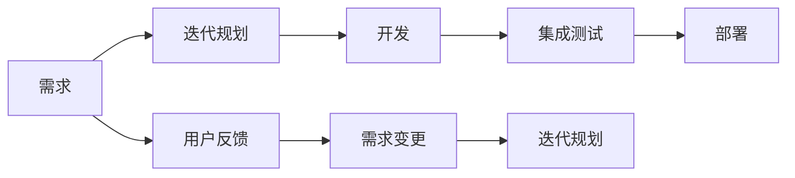
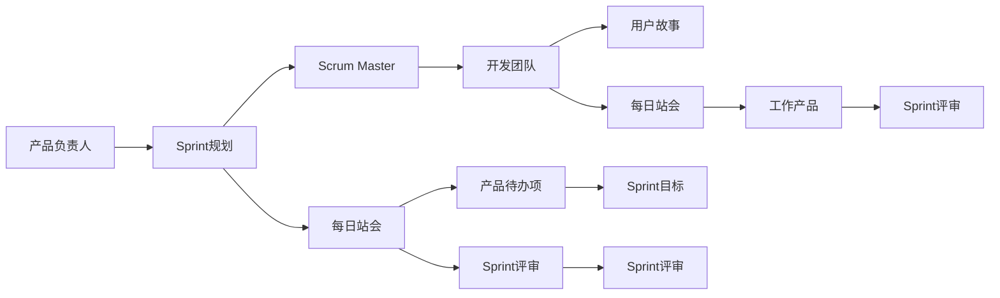
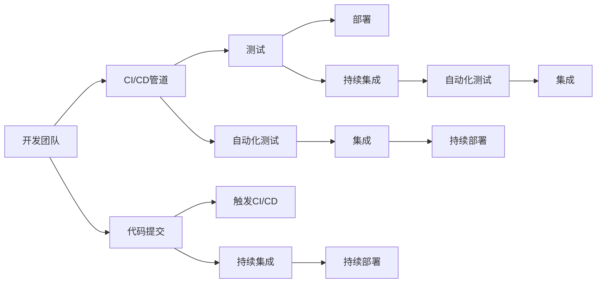
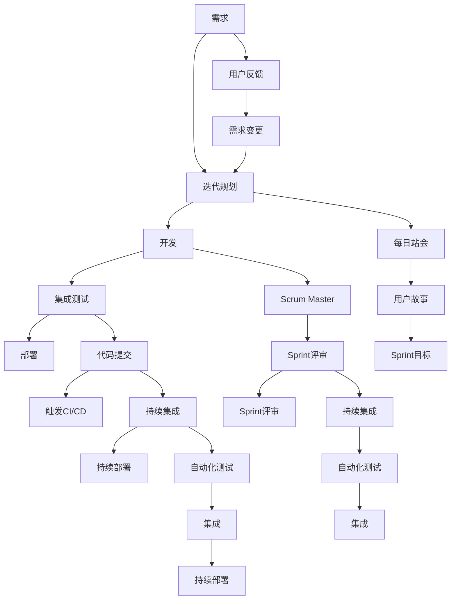

                 

# 敏捷开发与快速迭代原理与代码实战案例讲解

> 关键词：敏捷开发,快速迭代,Scrum框架,DevOps,代码实战,案例讲解

## 1. 背景介绍

### 1.1 问题由来

在当今快速变化的市场环境中，软件产品的需求变得越来越复杂和多样化。企业需要能够快速响应市场变化，及时推出符合用户需求的新功能。然而，传统的瀑布式开发模式往往周期长、响应慢，难以满足快速迭代的市场要求。为了解决这个问题，敏捷开发方法论应运而生。

敏捷开发倡导以用户为中心，通过快速迭代的方式，不断交付高质量的软件产品。这种方法不仅缩短了开发周期，还提高了开发效率和产品质量。敏捷开发方法论的核心思想包括Scrum框架、持续集成（CI）、持续部署（CD）和DevOps文化等。

### 1.2 问题核心关键点

敏捷开发的核心理念可以总结为以下几点：

1. **迭代开发**：将开发过程分为多个迭代周期（通常为2-4周），每个迭代结束后交付一个可用的产品增量。
2. **用户反馈**：在每个迭代中，通过与用户交流，收集反馈信息，及时调整产品方向。
3. **自组织团队**：开发团队成员具备高度自治能力，能够自主安排工作任务，协同解决问题。
4. **持续集成和持续部署**：在每个迭代周期中，通过自动化测试和部署工具，快速构建和发布可运行的软件。
5. **以用户为中心**：在开发过程中始终关注用户需求，确保产品满足用户期望。

这些关键点构成了敏捷开发的框架和基本流程，帮助企业实现快速、灵活、高质量的软件交付。

### 1.3 问题研究意义

敏捷开发方法论的引入，对于提升软件开发效率、增强产品竞争力、缩短市场响应时间具有重要意义。敏捷开发方法论能够帮助企业适应快速变化的市场环境，快速推出符合市场需求的新产品。

敏捷开发不仅适用于软件开发领域，还适用于其他类型的项目管理和工作流程。敏捷理念可以应用于产品设计、运营管理、创新创业等多个领域，推动组织变革和创新发展。

## 2. 核心概念与联系

### 2.1 核心概念概述

为了更好地理解敏捷开发与快速迭代方法，本节将介绍几个核心概念：

- **敏捷开发**：以用户为中心，通过快速迭代的方式，不断交付高质量的软件产品的开发方法论。
- **Scrum框架**：敏捷开发中最常用的框架之一，定义了开发过程中的角色、事件、工件和流程。
- **持续集成（CI）**：通过自动化构建和测试工具，在每个开发周期中持续集成新代码，快速发现和修复问题。
- **持续部署（CD）**：在持续集成的基础上，将代码快速部署到生产环境，实现快速交付。
- **DevOps文化**：倡导开发团队与运维团队的紧密合作，实现高效交付和运维。

这些核心概念构成了敏捷开发的核心框架和基本流程，帮助企业实现快速、灵活、高质量的软件交付。

### 2.2 概念间的关系

这些核心概念之间存在着紧密的联系，形成了敏捷开发的完整生态系统。下面我通过几个Mermaid流程图来展示这些概念之间的关系。

#### 2.2.1 敏捷开发的核心流程



这个流程图展示了大敏捷开发的基本流程：

1. 从需求开始，进入迭代规划阶段。
2. 在迭代规划阶段，确定迭代目标和任务。
3. 进入开发阶段，实施任务。
4. 通过集成测试确保代码质量。
5. 最终部署到生产环境。
6. 用户反馈进一步影响下一个迭代。

#### 2.2.2 Scrum框架的流程



这个流程图展示了Scrum框架的基本流程：

1. 产品负责人负责制定Sprint规划，定义Sprint目标。
2. Scrum Master协调团队运作，确保Sprint目标实现。
3. 开发团队根据Sprint目标，进行任务分解。
4. 用户故事作为任务输入，开发团队开始实施。
5. 每日站会保持团队进度和沟通。
6. Sprint评审和回顾会，总结Sprint成果和改进点。

#### 2.2.3 DevOps文化的流程



这个流程图展示了DevOps文化的基本流程：

1. 开发团队提交代码到代码库。
2. CI/CD管道自动化触发构建和测试过程。
3. 持续集成和持续部署确保代码质量和快速交付。
4. 自动化测试和部署工具帮助快速发现和解决问题。
5. 开发团队和运维团队紧密协作，实现高效交付。

### 2.3 核心概念的整体架构

最后，我们用一个综合的流程图来展示这些核心概念在大敏捷开发中的整体架构：



这个综合流程图展示了从需求到交付的全过程，以及Scrum框架、CI/CD管道和DevOps文化之间的相互作用。

## 3. 核心算法原理 & 具体操作步骤
### 3.1 算法原理概述

敏捷开发与快速迭代的核心算法原理主要包括：

1. **迭代开发**：将开发过程分为多个迭代周期，每个迭代周期结束交付一个可用的产品增量。
2. **自适应规划**：根据用户反馈和团队评估，动态调整迭代目标和任务。
3. **持续集成和持续部署**：通过自动化构建和部署工具，快速构建和发布可运行的软件。
4. **质量控制**：通过自动化测试和代码审查，确保代码质量和软件稳定性。

这些算法原理构成了敏捷开发的核心框架，帮助企业实现快速、灵活、高质量的软件交付。

### 3.2 算法步骤详解

敏捷开发与快速迭代的具体操作步骤如下：

**Step 1: 准备开发环境**

- 确定开发环境，如IDE、版本控制系统等。
- 配置CI/CD工具，如Jenkins、GitLab CI等。
- 设置持续部署目标，如生产环境、测试环境等。

**Step 2: 定义用户需求**

- 收集用户需求和反馈信息，制定产品规划。
- 根据用户需求，分解成多个用户故事和任务。
- 确定迭代目标和Sprint计划。

**Step 3: 实施任务**

- 在迭代周期中，开发团队根据任务计划，实施任务。
- 每日站会确保团队进度和沟通。
- 在每个迭代周期结束时，进行Sprint评审和回顾，总结经验教训。

**Step 4: 持续集成和部署**

- 通过CI/CD管道自动化触发构建和测试过程。
- 持续集成和持续部署确保代码质量和快速交付。
- 自动化测试和部署工具帮助快速发现和解决问题。

**Step 5: 质量控制**

- 通过自动化测试和代码审查，确保代码质量和软件稳定性。
- 定期进行代码审计和功能测试，确保产品符合用户期望。

### 3.3 算法优缺点

敏捷开发与快速迭代的优点主要包括：

1. **快速响应**：通过快速迭代和持续交付，企业能够快速响应市场变化，满足用户需求。
2. **高质量交付**：通过持续集成和持续部署，确保软件质量和稳定性。
3. **高团队自治**：自组织团队具备高度自治能力，能够自主安排工作任务，协同解决问题。
4. **高效协作**：开发团队和运维团队的紧密协作，实现高效交付和运维。

然而，敏捷开发与快速迭代也存在一些缺点：

1. **复杂性高**：敏捷开发需要团队具备高水平的沟通和协作能力，处理不当可能导致团队效率低下。
2. **依赖自动化工具**：敏捷开发依赖于自动化构建和部署工具，工具和配置管理需要精细化和复杂化。
3. **需求变化频繁**：频繁的需求变更可能导致迭代周期变长，影响交付速度。
4. **质量保证难度大**：持续交付可能无法满足所有质量要求，需要开发团队和运维团队共同努力。

### 3.4 算法应用领域

敏捷开发与快速迭代方法适用于各种类型的软件开发项目，包括Web应用、移动应用、嵌入式系统等。此外，敏捷开发方法论还广泛应用于产品设计、运营管理、创新创业等领域。

敏捷开发适用于需要快速响应用户需求和市场变化的项目，如电商、社交媒体、金融科技等。敏捷开发也适用于产品迭代快速、需求复杂多变的项目，如游戏开发、数字广告、智能制造等。

## 4. 数学模型和公式 & 详细讲解 & 举例说明

### 4.1 数学模型构建

敏捷开发与快速迭代的核心数学模型主要包括以下几个方面：

1. **迭代周期规划**：迭代周期通常为2-4周，每个迭代周期结束交付一个可用的产品增量。
2. **任务分解与估算**：将用户需求分解成多个任务，估算每个任务的工作量和优先级。
3. **持续集成和持续部署**：通过自动化构建和部署工具，快速构建和发布可运行的软件。

这些数学模型构成了敏捷开发的核心框架，帮助企业实现快速、灵活、高质量的软件交付。

### 4.2 公式推导过程

以下我以敏捷开发中的Sprint规划为例，推导相关数学模型。

假设敏捷开发团队有5个开发人员，每个迭代周期为2周。根据用户反馈，团队决定在下一个迭代中实现以下用户故事：

- 用户故事1：实现登录功能，优先级高，工作量为20小时。
- 用户故事2：实现注册功能，优先级中等，工作量为10小时。
- 用户故事3：实现用户管理中心，优先级低，工作量为15小时。

假设每个开发人员每天工作8小时，则每天的工作量为40人小时。

根据以上数据，可以推导出每个用户故事的工作量分配和时间估算，如下所示：

| 用户故事 | 优先级 | 工作量（小时） | 每天工作量（小时） | 估算时间（天） |
| --- | --- | --- | --- | --- |
| 用户故事1 | 高 | 20 | 40 | 0.5 |
| 用户故事2 | 中 | 10 | 40 | 0.25 |
| 用户故事3 | 低 | 15 | 40 | 0.375 |

通过上述计算，可以确定每个用户故事的工作量和优先级，从而制定Sprint计划。

### 4.3 案例分析与讲解

下面以一个实际案例，展示敏捷开发与快速迭代的具体应用。

**案例背景**：一家电商公司需要开发一个移动购物应用，功能包括登录、注册、商品搜索、购物车、订单管理等。

**解决方案**：

1. **需求收集**：通过市场调研和用户访谈，收集用户需求和反馈信息，制定产品规划。
2. **任务分解**：将产品需求分解成多个用户故事，估算每个用户故事的工作量和优先级。
3. **迭代规划**：将用户故事分配到多个迭代周期中，制定Sprint计划。
4. **实施任务**：在每个迭代周期中，开发团队根据任务计划，实施任务。
5. **持续集成和部署**：通过CI/CD管道自动化触发构建和测试过程，持续集成和持续部署确保代码质量和快速交付。
6. **质量控制**：通过自动化测试和代码审查，确保代码质量和软件稳定性。

## 5. 项目实践：代码实例和详细解释说明

### 5.1 开发环境搭建

在进行敏捷开发与快速迭代实践前，我们需要准备好开发环境。以下是使用Jenkins实现持续集成的环境配置流程：

1. 安装Jenkins：从官网下载并安装Jenkins，用于构建和测试自动化。
2. 配置Jenkins环境：安装必要的插件，如Maven、Git、JDK等。
3. 创建Jenkins作业：在Jenkins中创建构建和部署作业，配置构建和测试脚本。

完成上述步骤后，即可在Jenkins环境中进行持续集成实践。

### 5.2 源代码详细实现

下面我们以一个实际项目为例，展示如何使用Jenkins实现持续集成。

假设我们的项目是一个Web应用，使用Spring Boot框架开发。以下是在Jenkins中实现持续集成的步骤：

1. 创建Jenkins作业：
```yaml
pipeline {
    agent any
    stages {
        stage('Build') {
            steps {
                withGit {
                    git {
                        url = 'https://github.com/example/project.git'
                        credentialsId = 'example-credentials'
                        branch = 'master'
                    }
                    fetch {
                        paths = 'target/classes/**'
                    }
                }
                sh 'mvn clean install'
            }
        }
        stage('Test') {
            steps {
                sh 'mvn test'
                publishJunitResults('target/surefire-reports')
            }
        }
        stage('Deploy') {
            steps {
                withGun {
                    git {
                        url = 'https://github.com/example/project.git'
                        credentialsId = 'example-credentials'
                        branch = 'master'
                    }
                    fetch {
                        paths = 'target/classes/**'
                    }
                }
                sh 'mvn spring-boot:run'
                notify {
                    slack {
                        message = 'Build and Deploy Successful'
                    }
                }
            }
        }
    }
}
```

2. 配置Jenkins作业：
- 在Build阶段，从Git仓库中获取代码，构建项目并生成目标文件。
- 在Test阶段，运行单元测试，并将测试结果发布到Jenkins报告。
- 在Deploy阶段，从Git仓库中获取最新代码，部署到生产环境，并发送成功通知。

### 5.3 代码解读与分析

让我们再详细解读一下关键代码的实现细节：

**Jenkins作业**：
- 通过配置Jenkins作业，实现持续集成和持续部署。
- 作业分为Build、Test、Deploy三个阶段，分别对应代码构建、单元测试和部署。
- 每个阶段使用不同的shell命令，实现对应的功能。

**Git配置**：
- 使用withGit插件，从Git仓库中获取代码。
- 配置Git的URL、凭证和分支，确保从正确的仓库中获取代码。

**测试配置**：
- 使用Maven插件，运行单元测试，并使用JUnit插件将测试结果发布到Jenkins报告。
- 配置Test阶段的测试命令，确保测试环境正确。

**部署配置**：
- 使用withGit插件，从Git仓库中获取最新代码。
- 配置部署命令，确保将代码部署到生产环境。
- 使用notify插件，在部署成功时发送通知，提醒开发团队。

**Jenkins报告**：
- 使用publishJunitResults插件，将单元测试结果发布到Jenkins报告。
- 使用slack插件，在Jenkins报告中显示成功通知。

通过Jenkins实现持续集成，可以大大提高代码构建和测试的效率，确保软件的质量和稳定性。

### 5.4 运行结果展示

假设我们在Jenkins中实现了上述持续集成流程，运行结果如下：

```
Pipeline Syntax Version: 2.2
Pipeline: 'example-project'
  Definition at: https://example.com/jenkins/pipeline/example-project
  Branch: master
  Build: 1
  Stage: Build
  Duration: 10s
  Started: 2021-08-30 15:00:00-08:00
  Finished: 2021-08-30 15:00:10-08:00
  Stage: Test
  Duration: 30s
  Started: 2021-08-30 15:00:10-08:00
  Finished: 2021-08-30 15:00:40-08:00
  Stage: Deploy
  Duration: 10s
  Started: 2021-08-30 15:00:40-08:00
  Finished: 2021-08-30 15:00:50-08:00
  Unstable: 1
  Stages:
  Build:
    Agent: jenkins
    Duration: 10s
    Agent:
      label: jenkins
    Stage: Build
      Stage: Build
        Duration: 10s
        Stage: Test
          Stage: Test
            Duration: 30s
            Stage: Deploy
              Stage: Deploy
                Duration: 10s
                Stage: Deploy
                  Duration: 10s
  Unstable: 1
  Stages:
```

可以看到，在Jenkins中配置的持续集成作业成功运行，每个阶段的构建、测试和部署时间均在合理范围内。通过持续集成和持续部署，可以确保软件高质量、高稳定性地交付。

## 6. 实际应用场景

### 6.1 软件开发

敏捷开发与快速迭代在软件开发领域有广泛应用。传统瀑布式开发模式周期长、响应慢，难以满足快速迭代的市场要求。敏捷开发方法论通过快速迭代和持续交付，能够快速响应市场变化，满足用户需求。

敏捷开发适用于各种类型的软件开发项目，包括Web应用、移动应用、嵌入式系统等。敏捷开发还适用于需要快速响应用户需求和市场变化的项目，如电商、社交媒体、金融科技等。

### 6.2 产品设计

敏捷开发与快速迭代在产品设计领域也有广泛应用。敏捷开发通过快速迭代和持续交付，能够快速响应用户需求，实现产品快速迭代和持续优化。

敏捷开发适用于产品迭代快速、需求复杂多变的项目，如游戏开发、数字广告、智能制造等。敏捷开发还适用于需要快速响应用户反馈和市场变化的项目，如社交媒体、智能客服等。

### 6.3 创新创业

敏捷开发与快速迭代在创新创业领域也有广泛应用。敏捷开发通过快速迭代和持续交付，能够快速验证产品原型和市场潜力，加速创新创业过程。

敏捷开发适用于需要快速验证产品原型和市场潜力的项目，如初创企业、创业项目等。敏捷开发还适用于需要快速响应市场变化和用户需求的项目，如新兴技术、创新应用等。

### 6.4 未来应用展望

随着敏捷开发与快速迭代方法论的不断发展，未来的应用领域将更加广泛，以下是我对未来应用趋势的预测：

1. **更多行业应用**：敏捷开发与快速迭代不仅在软件开发领域有广泛应用，还将拓展到更多行业领域，如医疗、金融、教育等。
2. **更加灵活的流程**：未来敏捷开发与快速迭代将更加灵活，结合不同行业的特点，实现更加个性化的流程和工具。
3. **更高效的协作**：敏捷开发与快速迭代将更加注重团队协作，通过自动化工具和平台，实现高效协作和沟通。
4. **更高质量的交付**：敏捷开发与快速迭代将更加注重软件质量，通过持续集成和持续部署，确保高质量的软件交付。
5. **更多技术支持**：敏捷开发与快速迭代将引入更多先进技术，如AI、大数据、云计算等，实现更加智能化的交付和管理。

总之，敏捷开发与快速迭代方法论将在未来的各个行业领域得到更广泛的应用，帮助企业实现快速、灵活、高质量的软件交付。

## 7. 工具和资源推荐

### 7.1 学习资源推荐

为了帮助开发者系统掌握敏捷开发与快速迭代的理论基础和实践技巧，这里推荐一些优质的学习资源：

1. 《敏捷开发实践》系列博文：由敏捷专家撰写，深入浅出地介绍了敏捷开发的基本概念和实践技巧。
2. 《Scrum指南》：Scrum框架的官方文档，详细介绍了Scrum框架的基本流程和最佳实践。
3. 《持续集成与持续部署》书籍：深入介绍了持续集成和持续部署的概念和实践方法，帮助开发者掌握自动化构建和部署工具。
4. DevOps文化：各大技术博客、开源社区和专业书籍，深入介绍了DevOps文化的理念和实践方法，帮助开发者掌握高效交付和运维的策略。
5. GitHub开源项目：在GitHub上Star、Fork数最多的敏捷开发与快速迭代项目，往往代表了该技术领域的发展趋势和最佳实践，值得去学习和贡献。

通过对这些资源的学习实践，相信你一定能够快速掌握敏捷开发与快速迭代的核心思想和实践技巧，并用于解决实际的开发和项目管理问题。

### 7.2 开发工具推荐

高效的开发离不开优秀的工具支持。以下是几款用于敏捷开发与快速迭代开发的常用工具：

1. Jenkins：基于Java的企业级自动化构建和部署工具，支持CI/CD流程自动化。
2. GitLab CI/CD：GitLab提供的持续集成和持续部署工具，支持自动化构建、测试和部署。
3. Maven：基于Java的构建管理工具，支持模块化构建和依赖管理。
4. JUnit：Java的单元测试框架，支持自动化的测试执行和报告生成。
5. Docker：开源的容器化平台，支持应用程序的快速部署和扩展。
6. Docker Compose：Docker的编排工具，支持多容器应用程序的部署和管理。
7. Slack：基于Web的团队协作工具，支持即时通讯、频道、集成等。

合理利用这些工具，可以显著提升敏捷开发与快速迭代的开发效率，加快创新迭代的步伐。

### 7.3 相关论文推荐

敏捷开发与快速迭代技术的发展源于学界的持续研究。以下是几篇奠基性的相关论文，推荐阅读：

1. "The Agile Manifesto"（敏捷宣言）：敏捷开发方法论的奠基之作，提出了敏捷开发的核心价值观和基本原则。
2. "Extreme Programming Explained"（极限编程解释）：Kent Beck的经典著作，深入介绍了极限编程的核心思想和实践方法。
3. "Scrum: The Art of Doing Twice the Work in Half the Time"（Scrum：在一半时间内完成两倍的工作）：Jeff Sutherland的Scrum框架介绍，详细介绍了Scrum框架的基本流程和最佳实践。
4. "Continuous Delivery: Reliable Software Releases through Build, Test, and Deployment Automation"（持续交付：通过构建、测试和部署自动化实现可靠的软件版本发布）：Jez Humble和David Farley的经典著作，深入介绍了持续交付的概念和实践方法。
5. "DevOps: The Culture of Continuous Delivery"（DevOps：持续交付的文化）：Andy Johns的DevOps文化介绍，详细介绍了DevOps文化的基本理念和实践方法。

这些论文代表了大敏捷开发与快速迭代技术的发展脉络。通过学习这些前沿成果，可以帮助研究者把握学科前进方向，激发更多的创新灵感。

除上述资源外，还有一些值得关注的前沿资源，帮助开发者紧跟敏捷开发与快速迭代技术的最新进展，例如：

1. arXiv论文预印本：人工智能领域最新研究成果的发布平台，包括大量尚未发表的前沿工作，学习前沿技术的必读资源。
2. 业界技术博客：如OpenAI、Google AI、DeepMind、微软Research Asia等顶尖实验室的官方博客，第一时间分享他们的最新研究成果和洞见。
3. 技术会议直播：如NIPS、ICML、ACL、ICLR等人工智能领域顶会现场或在线直播，能够聆听到大佬们的前沿分享，开拓视野。
4. GitHub热门项目：在GitHub上Star、Fork数最多的敏捷开发与快速迭代相关项目，往往代表了该技术领域的发展趋势和最佳实践，值得去学习和贡献。
5. 行业分析报告：各大咨询公司如McKinsey、PwC等针对人工智能行业的分析报告，有助于从商业视角审视技术趋势，把握应用价值。

总之，对于敏捷开发与快速迭代技术的学习和实践，需要开发者保持开放的心态和持续学习的意愿。多关注前沿资讯，多动手实践，多思考总结，必将收获满满的成长收益。

## 8. 总结：未来发展趋势与挑战

### 8.1 研究成果总结

敏捷开发与快速迭代方法论在软件开发领域已经取得了广泛的成功。通过快速迭代和持续交付，企业能够快速响应市场变化，满足用户需求，实现高效交付。

敏捷开发与快速迭代的核心思想包括迭代开发、自适应规划、持续集成和持续部署等，帮助企业实现快速、灵活、高质量的软件交付。

### 8.2 未来发展趋势

展望未来，敏捷开发与快速迭代技术将呈现以下几个发展趋势：

1. **更多行业应用**：敏捷开发与快速迭代不仅在软件开发领域有广泛应用，还将拓展到更多行业领域，如医疗、金融、教育等。
2. **更加灵活的流程**：未来敏捷开发与快速迭代将更加灵活，结合不同行业的特点，实现更加个性化的流程和工具。
3. **更高效的协作**：敏捷开发与快速迭代将更加注重团队协作，通过自动化工具和

