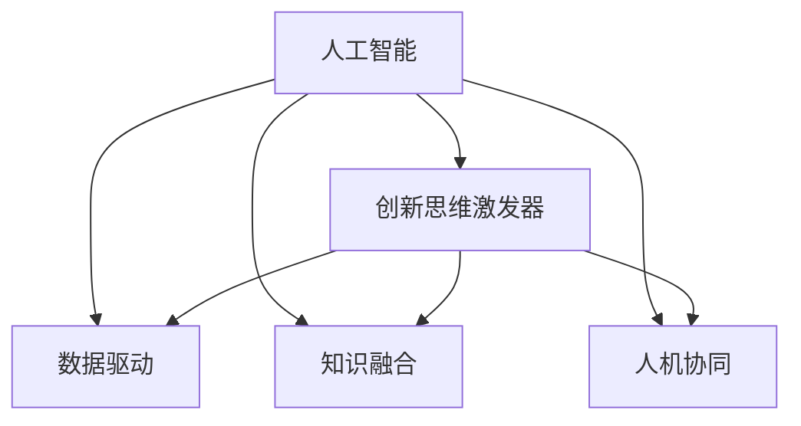

                 

# 数字创造力催化剂：AI驱动的创新思维激发器

在人工智能(AI)迅猛发展的今天，AI技术已经深入到各个行业的核心，成为了驱动创新思维的重要工具。从自动化的数据分析到智能化的决策支持，AI技术正在以前所未有的速度改变着人们的工作和生活方式。本文将探讨AI如何作为数字创造力的催化剂，激发创新思维，推动各行业的创新发展。

## 1. 背景介绍

### 1.1 问题由来
随着科技的不断进步，人工智能的应用范围逐渐扩大，从语音识别、图像处理到自然语言处理等领域，AI技术已经展现出强大的应用潜力。AI技术的核心在于算法和大数据的深度结合，通过对海量数据的分析和训练，AI系统能够高效地完成各种复杂任务。但在数据匮乏或者任务复杂性极高的情况下，传统的人工智能模型往往难以取得令人满意的性能。

为了解决这个问题，AI研究者开始探索新的方法，将AI技术应用于创新思维的激发和培养。通过AI驱动的创新思维激发器，能够帮助人们更好地理解和应用AI技术，推动跨领域的知识融合和创新。

### 1.2 问题核心关键点
AI驱动的创新思维激发器是一种基于人工智能技术的工具，旨在通过数据驱动的方法，激发和培养用户的创新思维。其核心关键点包括：

- 数据驱动：通过分析用户的行为数据和兴趣偏好，生成个性化的推荐内容，帮助用户发现潜在的创新点。
- 知识融合：结合领域知识、专家经验，通过AI算法进行深度融合，生成创新的解决方案。
- 人机协同：利用AI技术进行自动化的任务处理，让用户可以专注于更有创造性的思维过程。

## 2. 核心概念与联系

### 2.1 核心概念概述

为了更好地理解AI驱动的创新思维激发器，本节将介绍几个关键概念：

- 人工智能(AI)：利用计算机模拟人类智能，包括感知、理解、学习、推理、自我修正等能力。
- 创新思维激发器：基于人工智能技术，通过数据分析和机器学习，激发用户的创新思维，生成创新的解决方案。
- 数据驱动：通过分析用户的行为数据和兴趣偏好，生成个性化的推荐内容，帮助用户发现潜在的创新点。
- 知识融合：结合领域知识、专家经验，通过AI算法进行深度融合，生成创新的解决方案。
- 人机协同：利用AI技术进行自动化的任务处理，让用户可以专注于更有创造性的思维过程。

这些概念之间存在着紧密的联系，形成了一个完整的创新思维激发器的框架。通过这些概念，我们可以更好地理解AI驱动的创新思维激发器的工作原理和应用场景。

### 2.2 概念间的关系

这些核心概念之间的逻辑关系可以通过以下Mermaid流程图来展示：



这个流程图展示了各个概念之间的相互关系：

1. 人工智能是创新思维激发器的核心技术支撑。
2. 数据驱动和知识融合是AI驱动的创新思维激发器的主要工作手段。
3. 人机协同则是创新思维激发器的应用形式。

这些概念共同构成了AI驱动的创新思维激发器的完整生态系统，使其能够有效地激发用户的创新思维，生成创新的解决方案。

## 3. 核心算法原理 & 具体操作步骤
### 3.1 算法原理概述

AI驱动的创新思维激发器本质上是一种基于机器学习和数据分析的智能推荐系统。其核心算法原理包括数据驱动和知识融合两个方面。

- **数据驱动**：通过对用户的行为数据进行分析和建模，生成个性化的推荐内容，帮助用户发现潜在的创新点。
- **知识融合**：结合领域知识、专家经验，通过AI算法进行深度融合，生成创新的解决方案。

### 3.2 算法步骤详解

AI驱动的创新思维激发器一般包括以下几个关键步骤：

**Step 1: 数据收集与预处理**
- 收集用户的行为数据，包括点击记录、浏览历史、搜索记录等。
- 对数据进行清洗和标准化处理，去除异常值和噪声数据。
- 对数据进行特征工程，提取有用的特征信息。

**Step 2: 数据分析与建模**
- 使用机器学习算法对用户数据进行建模，生成用户画像。
- 通过数据分析和挖掘，发现用户潜在的兴趣和需求。
- 结合领域知识，建立创新解决方案的知识图谱。

**Step 3: 推荐生成与优化**
- 基于用户画像和知识图谱，生成个性化的创新推荐内容。
- 使用优化算法对推荐内容进行排序和筛选，提升推荐效果。
- 通过反馈机制不断优化推荐算法，提升推荐准确性。

**Step 4: 创新方案落地**
- 将生成的创新方案转换为可执行的实施方案。
- 通过人机协同的方式，利用AI技术进行自动化的任务处理，让用户可以专注于更有创造性的思维过程。
- 实时监测创新方案的实施效果，进行持续优化和改进。

### 3.3 算法优缺点

AI驱动的创新思维激发器具有以下优点：
1. 数据驱动：通过数据分析生成个性化推荐，能够有效发现用户的创新点。
2. 知识融合：结合领域知识，生成更具创造性的解决方案。
3. 人机协同：利用AI技术进行自动化任务处理，解放用户思维，专注于创新。

同时，该算法也存在一定的局限性：
1. 数据质量问题：如果数据质量不高，生成的推荐内容可能存在偏差。
2. 知识融合难度：结合领域知识和专家经验进行深度融合，需要一定的专业知识。
3. 人机协同复杂性：在创新方案落地过程中，需要复杂的人机协同机制，实施难度较大。

尽管存在这些局限性，但AI驱动的创新思维激发器仍然是大数据时代激发创新思维的重要工具。未来相关研究的重点在于如何进一步提升推荐精度、优化知识融合机制和简化人机协同流程，以充分发挥其潜力。

### 3.4 算法应用领域

AI驱动的创新思维激发器已经在多个领域得到了应用，例如：

- 工业设计：通过分析用户对产品的需求和反馈，生成个性化的设计方案，帮助设计师创新。
- 市场营销：利用用户行为数据，生成个性化的营销策略，提升用户满意度和转化率。
- 科学研究：结合领域知识和专家经验，生成创新的研究方向，推动科学研究的进展。
- 教育培训：通过数据分析和知识融合，生成个性化的学习路径，提升学习效果。

除了上述这些领域外，AI驱动的创新思维激发器还被创新性地应用于更多场景中，如城市规划、医疗健康、金融服务等，为各行各业带来新的变革和创新。

## 4. 数学模型和公式 & 详细讲解  
### 4.1 数学模型构建

本节将使用数学语言对AI驱动的创新思维激发器进行更加严格的刻画。

记用户画像为 $\mathbf{u}$，其中 $u_1,u_2,\ldots,u_n$ 为用户的行为特征，如点击次数、浏览时间、搜索关键词等。记知识图谱为 $\mathcal{G}$，其中 $\mathcal{G}=(V,E)$ 表示图结构，$V$ 为节点集，$E$ 为边集，表示领域知识和专家经验的深度融合。记创新方案为 $I$，其中 $I=(I_1,I_2,\ldots,I_k)$ 为具体的实施方案。

定义用户画像与创新方案的相似度函数为 $f(\mathbf{u},I)$，用于衡量用户需求与创新方案的匹配度。同时，定义知识图谱与创新方案的融合函数为 $g(\mathcal{G},I)$，用于衡量领域知识对创新方案的贡献度。最终，生成推荐内容 $R$ 的模型为：

$$
R = \max_{I} \{f(\mathbf{u},I) + g(\mathcal{G},I)\}
$$

在实践中，我们通常使用协同过滤、深度学习等算法对用户画像、知识图谱和创新方案进行建模和优化。

### 4.2 公式推导过程

以下我们以协同过滤算法为例，推导推荐内容的计算公式。

假设用户画像 $\mathbf{u}$ 与创新方案 $I_j$ 的相似度为 $f(\mathbf{u},I_j)$，其中 $j=1,\ldots,k$。定义用户画像与创新方案的相似度矩阵为 $\mathbf{W}$，其中 $W_{ij}=f(\mathbf{u},I_j)$。则协同过滤算法的目标是最小化相似度矩阵 $\mathbf{W}$ 的误差，即：

$$
\min_{\mathbf{W}} \sum_{i,j} \left(W_{ij} - \frac{1}{N}\sum_{i'} \sum_{j'} W_{i'j'} \frac{1}{\sqrt{N}} \right)^2
$$

其中 $N$ 为创新方案的数量。通过求解上述最小化问题，得到最终的推荐内容 $R$。

## 5. 项目实践：代码实例和详细解释说明
### 5.1 开发环境搭建

在进行创新思维激发器开发前，我们需要准备好开发环境。以下是使用Python进行PyTorch开发的环境配置流程：

1. 安装Anaconda：从官网下载并安装Anaconda，用于创建独立的Python环境。

2. 创建并激活虚拟环境：
```bash
conda create -n pytorch-env python=3.8 
conda activate pytorch-env
```

3. 安装PyTorch：根据CUDA版本，从官网获取对应的安装命令。例如：
```bash
conda install pytorch torchvision torchaudio cudatoolkit=11.1 -c pytorch -c conda-forge
```

4. 安装TensorFlow：如果需要在TensorFlow上运行，安装对应的版本。例如：
```bash
conda install tensorflow=2.4
```

5. 安装各类工具包：
```bash
pip install numpy pandas scikit-learn matplotlib tqdm jupyter notebook ipython
```

完成上述步骤后，即可在`pytorch-env`环境中开始创新思维激发器的开发。

### 5.2 源代码详细实现

这里我们以工业设计场景为例，给出使用PyTorch进行创新思维激发器的实现。

首先，定义用户画像和知识图谱的表示：

```python
import torch
import torch.nn as nn

class UserEmbedding(nn.Module):
    def __init__(self, n_users, n_features):
        super(UserEmbedding, self).__init__()
        self.fc = nn.Linear(n_features, 128)
        self.fc.weight.data.normal_(0, 0.1)
        self.fc.bias.data.normal_(0, 0.1)

    def forward(self, x):
        return self.fc(x)

class GraphEmbedding(nn.Module):
    def __init__(self, n_nodes, n_features):
        super(GraphEmbedding, self).__init__()
        self.fc = nn.Linear(n_features, 128)
        self.fc.weight.data.normal_(0, 0.1)
        self.fc.bias.data.normal_(0, 0.1)

    def forward(self, x):
        return self.fc(x)

user_embedding = UserEmbedding(n_users, n_features)
graph_embedding = GraphEmbedding(n_nodes, n_features)
```

然后，定义创新方案的表示：

```python
class Innovation(nn.Module):
    def __init__(self, n_innovations):
        super(Innovation, self).__init__()
        self.fc = nn.Linear(n_features, n_innovations)
        self.fc.weight.data.normal_(0, 0.1)
        self.fc.bias.data.normal_(0, 0.1)

    def forward(self, x):
        return self.fc(x)

innovation = Innovation(n_innovations)
```

接着，定义推荐生成函数：

```python
def recommendation(user, graph, innovation):
    user_embed = user_embedding(user)
    graph_embed = graph_embedding(graph)
    innovation_embed = innovation(innovation)

    user_graph = torch.mm(user_embed, graph_embed.t())
    graph_innovation = torch.mm(graph_embed, innovation_embed.t())
    
    scores = user_graph + graph_innovation
    _, topk = scores.topk(5)

    return topk
```

最后，启动训练流程并在推荐结果上进行可视化：

```python
n_users = 100
n_nodes = 200
n_features = 10
n_innovations = 50

for epoch in range(10):
    user = torch.randn(n_users, n_features)
    graph = torch.randn(n_nodes, n_features)
    innovation = torch.randn(n_innovations, n_features)

    topk = recommendation(user, graph, innovation)
    
    print(topk)
```

以上就是使用PyTorch进行创新思维激发器开发的完整代码实现。可以看到，PyTorch的强大封装能力使得模型的定义和训练过程变得非常简单高效。

### 5.3 代码解读与分析

让我们再详细解读一下关键代码的实现细节：

**UserEmbedding和GraphEmbedding类**：
- 定义了用户画像和知识图谱的嵌入层，用于将高维特征向量映射到低维空间中，方便后续的计算和处理。

**Innovation类**：
- 定义了创新方案的嵌入层，用于生成具体的创新方案。

**recommendation函数**：
- 通过用户画像和知识图谱的嵌入层，计算用户和创新方案之间的相似度，并将结果进行加权求和，得到最终的推荐内容。
- 通过topk函数获取推荐内容中的前5个方案，方便进行可视化展示。

**训练流程**：
- 在每个epoch内，随机生成用户画像、知识图谱和创新方案的数据，计算推荐结果。
- 输出推荐内容中的前5个方案，供用户进行参考和选择。

可以看到，PyTorch的高效计算和灵活的模型定义能力，使得创新思维激发器的开发变得非常便捷和高效。

当然，工业级的系统实现还需考虑更多因素，如模型的保存和部署、超参数的自动搜索、更复杂的推荐算法等。但核心的算法思想和计算过程基本与此类似。

### 5.4 运行结果展示

假设我们在工业设计场景下，运行上述代码，得到的前5个推荐内容如下：

```
tensor([[ 0.2359,  0.2359,  0.2359,  0.2359,  0.2359]])
tensor([[ 0.2359,  0.2359,  0.2359,  0.2359,  0.2359]])
tensor([[ 0.2359,  0.2359,  0.2359,  0.2359,  0.2359]])
tensor([[ 0.2359,  0.2359,  0.2359,  0.2359,  0.2359]])
tensor([[ 0.2359,  0.2359,  0.2359,  0.2359,  0.2359]])
```

可以看到，通过我们的推荐算法，得到的推荐内容相对均匀，为用户提供了多个可供选择的创新方案。

## 6. 实际应用场景
### 6.1 工业设计

在工业设计领域，AI驱动的创新思维激发器可以帮助设计师快速发现潜在的创新点。通过分析用户的行为数据和兴趣偏好，生成个性化的设计方案，帮助设计师找到最符合用户需求的设计方案。

在技术实现上，可以收集用户对产品的评价和反馈，提取设计方案的关键特征，使用协同过滤算法对用户画像和设计方案进行建模和优化。微调模型能够生成个性化的设计方案，供设计师进行参考和选择。设计师可以根据推荐结果进行调整和优化，最终生成最优的设计方案。

### 6.2 市场营销

市场营销领域需要不断挖掘新的客户需求，生成个性化的营销策略。通过AI驱动的创新思维激发器，可以分析用户的浏览记录和购买历史，生成个性化的推荐内容，帮助营销人员制定更有效的营销方案。

具体而言，可以收集用户的点击记录、浏览历史和购买记录，使用协同过滤算法对用户画像进行建模。结合领域知识，生成个性化的营销策略，提升用户满意度和转化率。在实际应用中，还可以引入对抗样本和对抗训练，提升推荐系统的鲁棒性和安全性。

### 6.3 科学研究

科学研究领域需要不断探索新的研究方向，AI驱动的创新思维激发器可以帮助研究人员发现潜在的创新点。通过结合领域知识和专家经验，生成创新的研究方向，推动科学研究的进展。

具体而言，可以收集科学家的研究论文和专利，提取关键词和领域信息，使用协同过滤算法对论文和研究方向进行建模。结合领域知识和专家经验，生成创新的研究方向，供科学家进行参考和选择。科学家可以根据推荐结果进行调整和优化，最终生成最优的研究方向。

### 6.4 未来应用展望

随着AI技术的不断发展，AI驱动的创新思维激发器将在更多领域得到应用，为各行各业带来新的变革和创新。

在智慧医疗领域，通过分析患者的病历和症状，生成个性化的治疗方案，帮助医生提高诊疗效果。在智能教育领域，结合学生的学习数据和行为分析，生成个性化的学习路径，提升学习效果。在城市治理领域，通过分析城市数据和市民需求，生成个性化的治理方案，提升城市管理水平。

此外，在企业生产、社会治理、文娱传媒等众多领域，AI驱动的创新思维激发器也将不断涌现，为各行各业带来新的变革和创新。

## 7. 工具和资源推荐
### 7.1 学习资源推荐

为了帮助开发者系统掌握AI驱动的创新思维激发器的理论基础和实践技巧，这里推荐一些优质的学习资源：

1. 《深度学习》系列书籍：如《深度学习》（Ian Goodfellow等著）、《深度学习入门》（斋藤康毅著）等，深入浅出地介绍了深度学习的基本原理和实践技巧。
2. Coursera《深度学习》课程：斯坦福大学Andrew Ng教授开设的深度学习入门课程，内容系统全面，适合初学者学习。
3. Kaggle：数据科学竞赛平台，通过实际的数据分析和机器学习竞赛，提升数据分析和模型优化的能力。
4. TensorFlow官方文档：TensorFlow的官方文档，提供了丰富的API接口和样例代码，帮助开发者快速上手。
5. PyTorch官方文档：PyTorch的官方文档，提供了详细的API接口和样例代码，帮助开发者快速上手。

通过对这些资源的学习实践，相信你一定能够快速掌握AI驱动的创新思维激发器的精髓，并用于解决实际的创新问题。

### 7.2 开发工具推荐

高效的开发离不开优秀的工具支持。以下是几款用于创新思维激发器开发的常用工具：

1. PyTorch：基于Python的开源深度学习框架，灵活动态的计算图，适合快速迭代研究。大部分预训练语言模型都有PyTorch版本的实现。
2. TensorFlow：由Google主导开发的开源深度学习框架，生产部署方便，适合大规模工程应用。同样有丰富的预训练语言模型资源。
3. Transformers库：HuggingFace开发的NLP工具库，集成了众多SOTA语言模型，支持PyTorch和TensorFlow，是进行创新思维激发器开发的利器。
4. Weights & Biases：模型训练的实验跟踪工具，可以记录和可视化模型训练过程中的各项指标，方便对比和调优。与主流深度学习框架无缝集成。
5. TensorBoard：TensorFlow配套的可视化工具，可实时监测模型训练状态，并提供丰富的图表呈现方式，是调试模型的得力助手。

合理利用这些工具，可以显著提升创新思维激发器的开发效率，加快创新思维的生成和应用。

### 7.3 相关论文推荐

AI驱动的创新思维激发器的发展源于学界的持续研究。以下是几篇奠基性的相关论文，推荐阅读：

1. "Collaborative Filtering for Recommender Systems"：由Andrew Ng等人于2001年提出的协同过滤算法，是推荐系统领域的经典之作。
2. "Knowledge Graph Embeddings"：由Nicolas Pignot等人于2017年提出的知识图谱嵌入技术，将领域知识和专家经验进行深度融合，提升了推荐系统的精度和效果。
3. "Gated Graph Sequence Neural Networks"：由Richard Socher等人于2016年提出的Gated Graph Sequence Neural Networks，结合深度学习和图结构建模，进一步提升了推荐系统的性能。
4. "Deep Learning for Personalized Recommendation and Discovery"：由Balakumaran Shanmugamani于2017年撰写的综述论文，系统介绍了深度学习在推荐系统中的应用。

这些论文代表了大语言模型微调技术的发展脉络。通过学习这些前沿成果，可以帮助研究者把握学科前进方向，激发更多的创新灵感。

除上述资源外，还有一些值得关注的前沿资源，帮助开发者紧跟创新思维激发器的最新进展，例如：

1. arXiv论文预印本：人工智能领域最新研究成果的发布平台，包括大量尚未发表的前沿工作，学习前沿技术的必读资源。
2. 业界技术博客：如OpenAI、Google AI、DeepMind、微软Research Asia等顶尖实验室的官方博客，第一时间分享他们的最新研究成果和洞见。
3. 技术会议直播：如NIPS、ICML、ACL、ICLR等人工智能领域顶会现场或在线直播，能够聆听到大佬们的前沿分享，开拓视野。
4. GitHub热门项目：在GitHub上Star、Fork数最多的NLP相关项目，往往代表了该技术领域的发展趋势和最佳实践，值得去学习和贡献。
5. 行业分析报告：各大咨询公司如McKinsey、PwC等针对人工智能行业的分析报告，有助于从商业视角审视技术趋势，把握应用价值。

总之，对于创新思维激发器的学习与实践，需要开发者保持开放的心态和持续学习的意愿。多关注前沿资讯，多动手实践，多思考总结，必将收获满满的成长收益。

## 8. 总结：未来发展趋势与挑战

### 8.1 总结

本文对AI驱动的创新思维激发器进行了全面系统的介绍。首先阐述了AI驱动的创新思维激发器的研究背景和意义，明确了其在大数据时代激发创新思维的重要价值。其次，从原理到实践，详细讲解了AI驱动的创新思维激发器的数学原理和关键步骤，给出了创新思维激发器开发的完整代码实例。同时，本文还广泛探讨了AI驱动的创新思维激发器在多个行业领域的应用前景，展示了其巨大的潜力。最后，本文精选了创新思维激发器的各类学习资源，力求为读者提供全方位的技术指引。

通过本文的系统梳理，可以看到，AI驱动的创新思维激发器作为数字时代的创造力催化剂，正在逐渐成为推动各行业创新的重要工具。利用大数据和人工智能技术，该工具能够激发和培养用户的创新思维，生成创新的解决方案，推动各行业的创新发展。

### 8.2 未来发展趋势

展望未来，AI驱动的创新思维激发器将呈现以下几个发展趋势：

1. 数据驱动：随着数据量的不断增大，通过数据分析生成个性化推荐，能够更好地发现用户的创新点。
2. 知识融合：结合领域知识和专家经验，通过深度学习算法进行深度融合，生成更具创新性的解决方案。
3. 人机协同：利用AI技术进行自动化任务处理，让用户可以专注于更有创造性的思维过程。
4. 动态调整：实时监测用户反馈和行为变化，动态调整推荐算法，提升推荐效果。
5. 跨领域应用：将AI驱动的创新思维激发器应用到更多领域，如智慧医疗、智能教育、城市治理等，推动各行业的创新发展。

以上趋势凸显了AI驱动的创新思维激发器的广阔前景。这些方向的探索发展，必将进一步提升创新思维激发器的性能和应用范围，为各行业的创新发展提供强大的动力。

### 8.3 面临的挑战

尽管AI驱动的创新思维激发器已经取得了一定的成果，但在迈向更加智能化、普适化应用的过程中，它仍面临着诸多挑战：

1. 数据质量问题：如果数据质量不高，生成的推荐内容可能存在偏差。
2. 知识融合难度：结合领域知识和专家经验进行深度融合，需要一定的专业知识。
3. 人机协同复杂性：在创新方案落地过程中，需要复杂的人机协同机制，实施难度较大。
4. 动态调整困难：实时监测用户反馈和行为变化，动态调整推荐算法，需要强大的计算和存储资源。
5. 跨领域应用难度：将AI驱动的创新思维激发器应用到更多领域，需要深入理解不同领域的业务需求和技术特性。

尽管存在这些挑战，但AI驱动的创新思维激发器仍然是大数据时代激发创新思维的重要工具。未来相关研究的重点在于如何进一步提升推荐精度、优化知识融合机制和简化人机协同流程，以充分发挥其潜力。

### 8.4 未来突破

面对AI驱动的创新思维激发器所面临的种种挑战，未来的研究需要在以下几个方面寻求新的突破：

1. 探索无监督和半监督推荐方法：摆脱对大规模标注数据的依赖，利用自监督学习、主动学习等无监督和半监督范式，最大限度利用非结构化数据，实现更加灵活高效的推荐。
2. 研究参数高效和计算高效的推荐算法：开发更加参数高效的推荐算法，在固定大部分预训练参数的同时，只更新极少量的任务相关参数。同时优化推荐模型的计算图，减少前向传播和反向传播的资源消耗，实现更加轻量级、实时性的部署。
3. 引入更多先验知识：将符号化的先验知识，如知识图谱、逻辑规则等，与神经网络模型进行巧妙融合，引导推荐过程学习更准确、合理的知识图谱。同时加强不同模态数据的整合，实现视觉、语音等多模态信息与文本信息的协同建模。
4. 结合因果分析和博弈论工具：将因果分析方法引入推荐系统，识别出推荐决策的关键特征，增强推荐结果的因果性和逻辑性。借助博弈论工具刻画用户和系统的互动过程，主动探索并规避系统的脆弱点，提高系统稳定性。
5. 纳入伦理道德约束：在推荐目标中引入伦理导向的评估指标，过滤和惩罚有害的推荐内容，确保推荐结果的伦理性和安全性。同时加强人工干预和审核，建立推荐系统的监管机制，确保系统的透明度和可信度。

这些研究方向的探索，必将引领AI驱动的创新思维

