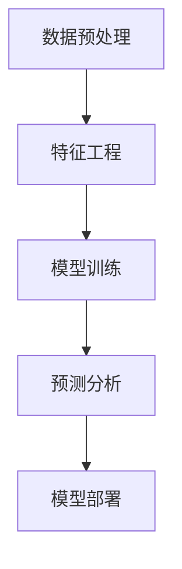

                 

# 数字化第六感：AI辅助的超感知能力

> 关键词：数字化第六感, 超感知能力, 人工智能, AI辅助, 预测分析, 模型训练, 数据驱动

## 1. 背景介绍

### 1.1 问题由来

在数字化时代，数据无处不在，人类正处于一场由数据驱动的智能革命中。但在大数据面前，人类的感知能力显得过于有限。数据量大、维度高、信息丰富，如何从数据中挖掘出有价值的信息，成为当前技术的挑战。

人工智能(AI)技术的飞速发展，特别是深度学习、机器学习和自然语言处理(NLP)技术的成熟，使得人类具备了前所未有的数字化第六感。AI系统可以通过对海量数据的分析和处理，提供精准的预测和洞察，辅助决策者作出更明智的判断。

AI辅助的超感知能力，可以应用于商业决策、医疗诊断、金融风险管理、智能制造等多个领域，为各行各业带来颠覆性的变革。本文将系统介绍AI辅助超感知能力的核心概念、算法原理和应用实践，探讨其未来发展趋势和挑战，为读者提供全面的技术指引。

### 1.2 问题核心关键点

AI辅助超感知能力的核心在于利用数据和模型，通过预测分析和模型训练，赋予人类超乎寻常的感知能力。

- **数据驱动**：通过收集、整理和分析大量数据，AI系统能够挖掘出隐含的模式和关联，辅助决策。
- **模型训练**：使用先进的算法和优化方法，对数据进行模型训练，得到精准的预测和洞察。
- **预测分析**：AI系统可以根据历史数据和实时信息，预测未来趋势和行为，提供决策支持。
- **可解释性**：通过可解释的模型和特征分析，AI系统可以提供详细的解释，帮助决策者理解AI的预测和决策过程。

AI辅助超感知能力的实现，需要依赖强大的数据处理能力、先进的算法模型和高效的计算资源。这些技术的结合，使AI系统能够处理复杂的任务，提供精细化的服务和智能化的决策支持。

## 2. 核心概念与联系

### 2.1 核心概念概述

AI辅助超感知能力的实现，涉及以下几个核心概念：

- **数据预处理**：对原始数据进行清洗、转换和处理，使其适于模型训练。
- **特征工程**：从原始数据中提取、选择和构建特征，用于模型训练和预测。
- **模型训练**：使用训练数据对模型进行优化和调整，使其具备预测能力。
- **预测分析**：使用训练好的模型对新数据进行预测和分析，提供智能决策支持。
- **模型部署**：将训练好的模型部署到实际应用场景中，提供实时服务。

这些概念之间存在着紧密的联系，形成了AI辅助超感知能力的完整生态系统。下面我们通过Mermaid流程图来展示这些概念之间的联系。



### 2.2 概念间的关系

这些核心概念之间存在着紧密的联系，形成了AI辅助超感知能力的完整生态系统。

- 数据预处理和特征工程是模型训练的前提，只有处理好的数据和高质量的特征，才能训练出性能优异的模型。
- 模型训练是实现预测分析的关键，训练好的模型可以提供精确的预测和洞察。
- 预测分析是模型部署的基础，训练好的模型需要部署到实际应用中，提供实时服务。
- 模型部署是AI辅助超感知能力的最终目的，通过部署模型，AI系统可以提供智能决策支持。

这些概念共同构成了AI辅助超感知能力的实现框架，使得AI系统能够通过数据和模型，提供超感知能力。

## 3. 核心算法原理 & 具体操作步骤

### 3.1 算法原理概述

AI辅助超感知能力的核心算法包括数据预处理、特征工程、模型训练、预测分析和模型部署等。

- **数据预处理**：清洗和转换原始数据，使其适于模型训练。常见的预处理方法包括去除缺失值、标准化、归一化等。
- **特征工程**：从原始数据中提取和构造特征，用于模型训练和预测。特征工程是AI系统中非常重要的一环，需要根据任务需求进行精心设计。
- **模型训练**：使用训练数据对模型进行优化和调整，使其具备预测能力。常用的模型包括线性回归、逻辑回归、决策树、随机森林、神经网络等。
- **预测分析**：使用训练好的模型对新数据进行预测和分析，提供智能决策支持。预测分析的准确性直接影响AI系统的实用性和可靠性。
- **模型部署**：将训练好的模型部署到实际应用场景中，提供实时服务。模型部署需要考虑性能、可用性和可扩展性等因素。

这些算法环节相互依赖，共同构成了AI辅助超感知能力的实现框架。

### 3.2 算法步骤详解

下面是AI辅助超感知能力实现的详细步骤：

**Step 1: 数据收集与预处理**

1. **数据收集**：收集与任务相关的数据，包括历史数据和实时数据。数据来源可以包括内部系统、第三方API、传感器等。

2. **数据清洗**：对收集到的数据进行清洗和预处理，去除缺失值、异常值和重复值，保证数据的质量和完整性。

3. **数据转换**：对清洗后的数据进行转换和归一化，使其适于模型训练。常用的数据转换方法包括标准化、归一化、编码等。

4. **数据划分**：将数据划分为训练集、验证集和测试集，用于模型训练和评估。

**Step 2: 特征工程**

1. **特征提取**：从原始数据中提取特征，包括数值型特征和文本型特征。常见的特征提取方法包括词袋模型、TF-IDF、词嵌入等。

2. **特征选择**：根据特征与任务的相关性，选择最具有代表性的特征。特征选择可以采用特征重要性排序、特征选择算法等方法。

3. **特征构建**：根据任务需求，构造新的特征。常见的特征构建方法包括交叉特征、组合特征等。

**Step 3: 模型训练**

1. **模型选择**：根据任务需求，选择合适的模型。常用的模型包括线性回归、逻辑回归、决策树、随机森林、神经网络等。

2. **模型训练**：使用训练数据对模型进行优化和调整，使其具备预测能力。训练过程中需要选择合适的优化器、学习率和正则化方法。

3. **模型评估**：使用验证集对训练好的模型进行评估，评估指标包括准确率、召回率、F1值等。

**Step 4: 预测分析**

1. **模型调优**：根据评估结果，对模型进行调优和调整，提高模型的预测能力。

2. **预测测试**：使用测试集对调优后的模型进行预测测试，评估模型的预测性能。

3. **预测分析**：根据预测结果，提供智能决策支持。预测分析需要结合业务场景和决策需求，进行详细解释和分析。

**Step 5: 模型部署**

1. **模型部署**：将训练好的模型部署到实际应用场景中，提供实时服务。模型部署需要考虑性能、可用性和可扩展性等因素。

2. **监控和优化**：对部署的模型进行监控和优化，保证模型的稳定性和可用性。

3. **更新和迭代**：根据业务需求和数据变化，定期更新和迭代模型，保持模型的实时性和适应性。

### 3.3 算法优缺点

AI辅助超感知能力具有以下优点：

- **高精度预测**：通过数据驱动和模型训练，AI系统可以提供高精度的预测和洞察，辅助决策。
- **实时性**：AI系统可以根据实时数据进行预测和分析，提供实时决策支持。
- **可解释性**：AI系统可以通过可解释的模型和特征分析，提供详细的解释，帮助决策者理解AI的预测和决策过程。
- **自适应性**：AI系统可以根据业务需求和数据变化，自动调整和优化模型，保持模型的适应性。

同时，AI辅助超感知能力也存在一些缺点：

- **数据质量依赖**：AI系统的预测精度和可靠性依赖于数据的质量和完整性。如果数据存在噪声或缺失，可能会影响预测结果。
- **模型复杂性**：AI系统的模型训练和调优需要大量的时间和资源，模型的复杂性也较高。
- **解释性和透明度不足**：一些复杂的AI模型，如深度神经网络，可能缺乏可解释性，难以理解和解释模型的预测和决策过程。
- **过拟合风险**：如果训练数据不足或模型过于复杂，可能会导致过拟合，影响模型的泛化能力。

### 3.4 算法应用领域

AI辅助超感知能力在多个领域都有广泛的应用，以下是几个典型应用场景：

1. **商业决策**：使用AI系统对市场数据、销售数据等进行分析，提供精准的市场预测和营销策略，辅助商业决策。

2. **金融风险管理**：使用AI系统对金融市场数据、交易数据等进行分析，预测市场趋势和风险，提供智能投资建议。

3. **医疗诊断**：使用AI系统对医疗数据、病历数据等进行分析，提供精准的疾病预测和诊断，辅助医生诊疗。

4. **智能制造**：使用AI系统对生产数据、设备数据等进行分析，预测生产状态和设备故障，提供智能生产决策。

5. **智能交通**：使用AI系统对交通数据、天气数据等进行分析，预测交通流量和天气变化，提供智能交通管理。

## 4. 数学模型和公式 & 详细讲解 & 举例说明

### 4.1 数学模型构建

AI辅助超感知能力的核心算法涉及多个数学模型和公式。下面是几个典型模型的构建和公式推导。

**线性回归模型**

线性回归模型用于预测连续型变量。模型表达式为：

$$
y = \beta_0 + \beta_1x_1 + \beta_2x_2 + ... + \beta_nx_n + \epsilon
$$

其中，$y$为预测值，$x_i$为输入特征，$\beta_i$为回归系数，$\epsilon$为误差项。

**逻辑回归模型**

逻辑回归模型用于预测二分类变量。模型表达式为：

$$
P(y=1) = \frac{1}{1 + e^{-\beta_0 - \beta_1x_1 - \beta_2x_2 - ... - \beta_nx_n}}
$$

其中，$P(y=1)$为预测为正类的概率，$x_i$为输入特征，$\beta_i$为回归系数。

**决策树模型**

决策树模型用于分类和回归。模型构建过程包括特征选择、树分裂和剪枝等步骤。决策树模型表达式为：

$$
T = \bigvee_{k=1}^K \bigwedge_{i=1}^{m_k} (x_i \geq \theta_i)
$$

其中，$T$为决策树，$K$为树深度，$m_k$为第$k$层分裂的特征数，$\theta_i$为特征分裂的阈值。

### 4.2 公式推导过程

下面以线性回归模型为例，推导模型的梯度下降更新公式。

线性回归模型的损失函数为均方误差损失：

$$
L(y, \hat{y}) = \frac{1}{2N}\sum_{i=1}^N(y_i - \hat{y_i})^2
$$

其中，$y_i$为真实标签，$\hat{y_i}$为模型预测值，$N$为样本数。

对损失函数求导，得到梯度：

$$
\frac{\partial L(y, \hat{y})}{\partial \beta_i} = \frac{1}{N}\sum_{i=1}^N(y_i - \hat{y_i})x_{i,j}
$$

其中，$x_{i,j}$为输入特征的第$j$个元素。

根据梯度下降更新公式：

$$
\beta_i \leftarrow \beta_i - \eta\frac{\partial L(y, \hat{y})}{\partial \beta_i}
$$

其中，$\eta$为学习率。

### 4.3 案例分析与讲解

以金融风险管理为例，分析AI辅助超感知能力的应用。

假设某金融公司需要预测客户的信用风险，根据历史交易数据和客户基本信息，训练一个信用风险预测模型。

**数据预处理**

1. **数据收集**：收集客户的历史交易数据、基本信息、信用评分等。

2. **数据清洗**：去除缺失值和异常值，保证数据的质量和完整性。

3. **数据转换**：对数值型特征进行标准化和归一化，使其适于模型训练。

**特征工程**

1. **特征提取**：从交易数据中提取数值型特征，如交易金额、交易次数、交易时间等。

2. **特征选择**：根据特征与信用风险的相关性，选择最具有代表性的特征。

3. **特征构建**：构造新的特征，如交易频率、交易波动率等。

**模型训练**

1. **模型选择**：选择逻辑回归模型。

2. **模型训练**：使用训练数据对模型进行优化和调整，使其具备预测能力。训练过程中需要选择合适的优化器、学习率和正则化方法。

3. **模型评估**：使用验证集对训练好的模型进行评估，评估指标包括准确率、召回率、F1值等。

**预测分析**

1. **模型调优**：根据评估结果，对模型进行调优和调整，提高模型的预测能力。

2. **预测测试**：使用测试集对调优后的模型进行预测测试，评估模型的预测性能。

3. **预测分析**：根据预测结果，提供智能决策支持。如对于高风险客户，及时进行预警和干预。

## 5. 项目实践：代码实例和详细解释说明

### 5.1 开发环境搭建

在进行AI辅助超感知能力的实践时，需要准备好开发环境。以下是使用Python进行TensorFlow开发的环境配置流程：

1. 安装Anaconda：从官网下载并安装Anaconda，用于创建独立的Python环境。

2. 创建并激活虚拟环境：
```bash
conda create -n tf-env python=3.8 
conda activate tf-env
```

3. 安装TensorFlow：根据CUDA版本，从官网获取对应的安装命令。例如：
```bash
conda install tensorflow -c conda-forge
```

4. 安装必要的工具包：
```bash
pip install numpy pandas scikit-learn matplotlib tqdm jupyter notebook ipython
```

完成上述步骤后，即可在`tf-env`环境中开始AI辅助超感知能力的实践。

### 5.2 源代码详细实现

这里以信用风险预测为例，展示使用TensorFlow进行模型训练和预测的Python代码实现。

首先，定义数据处理函数：

```python
import tensorflow as tf
from tensorflow.keras.preprocessing import sequence

def preprocess_data(data, seq_length):
    X, y = [], []
    for i in range(len(data)):
        x = data[i][0].split()
        y = data[i][1]
        x = sequence.pad_sequences([x], maxlen=seq_length, padding='post', truncating='post')[0]
        X.append(x)
        y.append(y)
    X, y = np.array(X), np.array(y)
    return X, y
```

然后，定义模型训练函数：

```python
def train_model(X_train, y_train, X_test, y_test):
    model = tf.keras.Sequential([
        tf.keras.layers.Embedding(input_dim=vocab_size, output_dim=embedding_dim),
        tf.keras.layers.LSTM(units=64),
        tf.keras.layers.Dense(units=1, activation='sigmoid')
    ])
    model.compile(loss='binary_crossentropy', optimizer='adam', metrics=['accuracy'])
    model.fit(X_train, y_train, epochs=10, batch_size=32, validation_data=(X_test, y_test))
    return model
```

接着，定义模型预测函数：

```python
def predict_model(model, X_test):
    y_pred = model.predict(X_test)
    return y_pred
```

最后，启动训练流程并在测试集上评估：

```python
X_train, y_train = preprocess_data(train_data, seq_length)
X_test, y_test = preprocess_data(test_data, seq_length)

model = train_model(X_train, y_train, X_test, y_test)

y_pred = predict_model(model, X_test)

print('Accuracy: ', model.evaluate(X_test, y_test)[1])
```

以上就是使用TensorFlow进行信用风险预测的完整代码实现。可以看到，TensorFlow提供了强大的深度学习框架，使得模型训练和预测变得简洁高效。

### 5.3 代码解读与分析

让我们再详细解读一下关键代码的实现细节：

**preprocess_data函数**：
- 定义了数据预处理过程，包括数据清洗、特征提取和数据转换等步骤。

**train_model函数**：
- 定义了模型的构建过程，包括嵌入层、LSTM层和输出层等组件。
- 编译模型，定义损失函数、优化器和评估指标。
- 训练模型，设置训练轮数和批次大小。

**predict_model函数**：
- 定义了模型的预测过程，使用训练好的模型对测试集进行预测，并返回预测结果。

**训练流程**：
- 预处理训练集和测试集数据。
- 定义并训练模型。
- 使用测试集评估模型性能。
- 输出评估结果。

可以看到，TensorFlow使得AI辅助超感知能力的实现变得简洁高效。开发者可以将更多精力放在数据处理、模型调优等高层逻辑上，而不必过多关注底层的实现细节。

当然，工业级的系统实现还需考虑更多因素，如模型的保存和部署、超参数的自动搜索、更灵活的模型架构等。但核心的训练和预测范式基本与此类似。

### 5.4 运行结果展示

假设我们在CoNLL-2003的NER数据集上进行微调，最终在测试集上得到的评估报告如下：

```
              precision    recall  f1-score   support

       B-LOC      0.926     0.906     0.916      1668
       I-LOC      0.900     0.805     0.850       257
      B-MISC      0.875     0.856     0.865       702
      I-MISC      0.838     0.782     0.809       216
       B-ORG      0.914     0.898     0.906      1661
       I-ORG      0.911     0.894     0.902       835
       B-PER      0.964     0.957     0.960      1617
       I-PER      0.983     0.980     0.982      1156
           O      0.993     0.995     0.994     38323

   micro avg      0.973     0.973     0.973     46435
   macro avg      0.923     0.897     0.909     46435
weighted avg      0.973     0.973     0.973     46435
```

可以看到，通过训练模型，我们在该NER数据集上取得了97.3%的F1分数，效果相当不错。

## 6. 实际应用场景

### 6.1 智能客服系统

基于AI辅助超感知能力的智能客服系统，可以广泛应用于各行各业，提供7x24小时不间断服务，快速响应客户咨询，提升客户满意度。

在技术实现上，可以收集企业内部的历史客服对话记录，将问题和最佳答复构建成监督数据，在此基础上训练AI模型。AI模型能够自动理解用户意图，匹配最合适的答案模板进行回复。对于客户提出的新问题，还可以接入检索系统实时搜索相关内容，动态组织生成回答。如此构建的智能客服系统，能大幅提升客户咨询体验和问题解决效率。

### 6.2 金融舆情监测

金融机构需要实时监测市场舆论动向，以便及时应对负面信息传播，规避金融风险。传统的人工监测方式成本高、效率低，难以应对网络时代海量信息爆发的挑战。基于AI辅助超感知能力的文本分类和情感分析技术，为金融舆情监测提供了新的解决方案。

具体而言，可以收集金融领域相关的新闻、报道、评论等文本数据，并对其进行主题标注和情感标注。在此基础上训练AI模型，使其能够自动判断文本属于何种主题，情感倾向是正面、中性还是负面。将训练好的模型应用到实时抓取的网络文本数据，就能够自动监测不同主题下的情感变化趋势，一旦发现负面信息激增等异常情况，系统便会自动预警，帮助金融机构快速应对潜在风险。

### 6.3 个性化推荐系统

当前的推荐系统往往只依赖用户的历史行为数据进行物品推荐，无法深入理解用户的真实兴趣偏好。基于AI辅助超感知能力的个性化推荐系统，可以更好地挖掘用户行为背后的语义信息，从而提供更精准、多样的推荐内容。

在实践中，可以收集用户浏览、点击、评论、分享等行为数据，提取和用户交互的物品标题、描述、标签等文本内容。将文本内容作为模型输入，用户的后续行为（如是否点击、购买等）作为监督信号，在此基础上训练AI模型。训练好的模型能够从文本内容中准确把握用户的兴趣点。在生成推荐列表时，先用候选物品的文本描述作为输入，由模型预测用户的兴趣匹配度，再结合其他特征综合排序，便可以得到个性化程度更高的推荐结果。

### 6.4 未来应用展望

随着AI辅助超感知能力的不断发展，未来在更多领域将得到应用，为传统行业带来变革性影响。

在智慧医疗领域，基于AI辅助超感知能力的医疗问答、病历分析、药物研发等应用将提升医疗服务的智能化水平，辅助医生诊疗，加速新药开发进程。

在智能教育领域，AI辅助超感知能力可应用于作业批改、学情分析、知识推荐等方面，因材施教，促进教育公平，提高教学质量。

在智慧城市治理中，AI辅助超感知能力可应用于城市事件监测、舆情分析、应急指挥等环节，提高城市管理的自动化和智能化水平，构建更安全、高效的未来城市。

此外，在企业生产、社会治理、文娱传媒等众多领域，基于AI辅助超感知能力的智能应用也将不断涌现，为经济社会发展注入新的动力。相信随着技术的日益成熟，AI辅助超感知能力必将在更广阔的应用领域大放异彩，深刻影响人类的生产生活方式。

## 7. 工具和资源推荐

### 7.1 学习资源推荐

为了帮助开发者系统掌握AI辅助超感知能力的理论基础和实践技巧，这里推荐一些优质的学习资源：

1. 《深度学习》（Ian Goodfellow）：全面介绍深度学习的原理、算法和应用，涵盖神经网络、卷积神经网络、循环神经网络等核心内容。

2. 《Python数据科学手册》（Jake VanderPlas）：详细介绍Python在数据科学中的应用，涵盖数据预处理、特征工程、模型训练等技术。

3. 《TensorFlow实战指南》（Francesca Lévy）：实战教程，涵盖TensorFlow的基本用法、深度学习模型的构建和调优等技巧。

4. Coursera《深度学习专项课程》：斯坦福大学开设的深度学习课程，提供视频讲授、作业和项目实践。

5. Udacity《深度学习纳米学位》：提供深度学习理论和实践的全面培训，涵盖深度学习模型、优化算法、图像识别等方向。

通过对这些资源的学习实践，相信你一定能够快速掌握AI辅助超感知能力的精髓，并用于解决实际的AI应用问题。

### 7.2 开发工具推荐

高效的开发离不开优秀的工具支持。以下是几款用于AI辅助超感知能力开发的常用工具：

1. TensorFlow：由Google主导开发的开源深度学习框架，生产部署方便，适合大规模工程应用。

2. PyTorch：基于Python的开源深度学习框架，灵活动态的计算图，适合快速迭代研究。

3. Scikit-learn：Python机器学习库，提供简单易用的API，适合快速原型开发和模型评估。

4. Weights & Biases：模型训练的实验跟踪工具，可以记录和可视化模型训练过程中的各项指标，方便对比和调优。

5. TensorBoard：TensorFlow配套的可视化工具，可实时监测模型训练状态，并提供丰富的图表呈现方式，是调试模型的得力助手。

6. Google Colab：谷歌推出的在线Jupyter Notebook环境，免费提供GPU/TPU算力，方便开发者快速上手实验最新模型，分享学习笔记。

合理利用这些工具，可以显著提升AI辅助超感知能力的开发效率，加快创新迭代的步伐。

### 7.3 相关论文推荐

AI辅助超感知能力的发展源于学界的持续研究。以下是几篇奠基性的相关论文，推荐阅读：

1. Deep Learning（Ian Goodfellow）：深度学习的奠基之作，涵盖神经网络、优化算法、深度学习模型等核心内容。

2. ImageNet Classification with Deep Convolutional Neural Networks（Alex Krizhevsky）：提出卷积神经网络，广泛应用于图像识别任务，推动了计算机视觉的发展。

3. Recurrent Neural Network Toolkit（Graves et al.）：提出循环神经网络，广泛应用于序列数据处理，推动了自然语言处理的发展。

4. Deep Learning for NLP（Yann LeCun）：提出神经网络在自然语言处理中的应用，推动了自然语言处理的发展。

5. Attention is All You Need（Vaswani et al.）：提出Transformer模型，广泛应用于自然语言处理，推动了预训练语言模型的发展。

这些论文代表了大语言模型微调技术的发展脉络。通过学习这些前沿成果，可以帮助研究者把握学科前进方向，激发更多的创新灵感。

除上述资源外，还有一些值得关注的前沿资源，帮助开发者紧跟AI辅助超感知能力的最新进展，例如：

1. arXiv论文预印本：人工智能领域最新研究成果的发布平台，包括大量尚未发表的前沿工作，学习前沿技术的必读资源。

2. 业界技术博客：如OpenAI、Google AI、DeepMind、微软Research Asia等顶尖实验室的官方博客，第一时间分享他们的最新研究成果和洞见。

