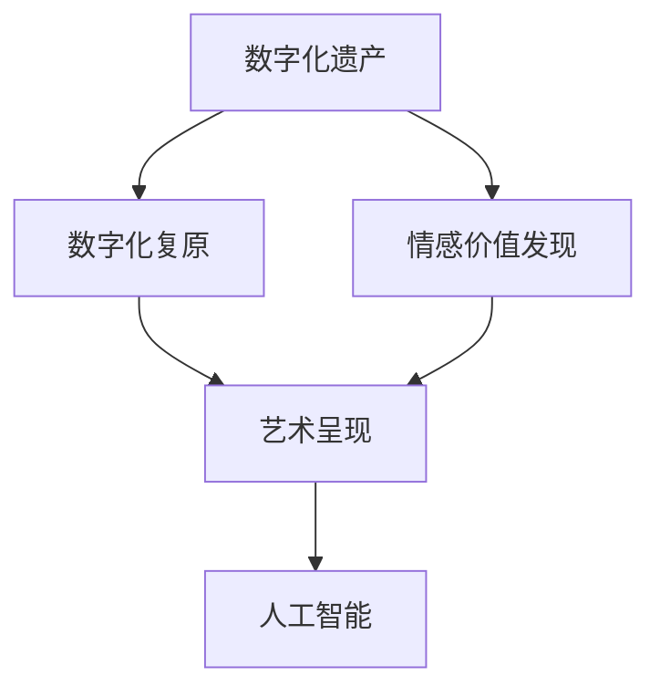
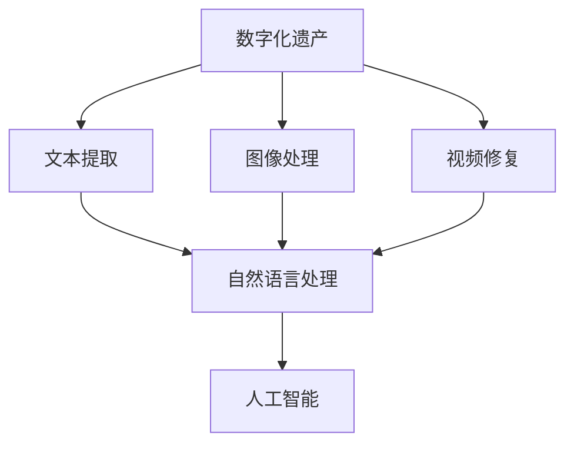
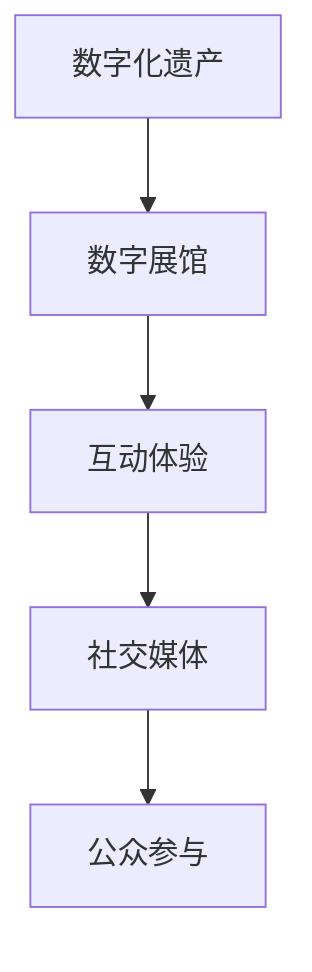
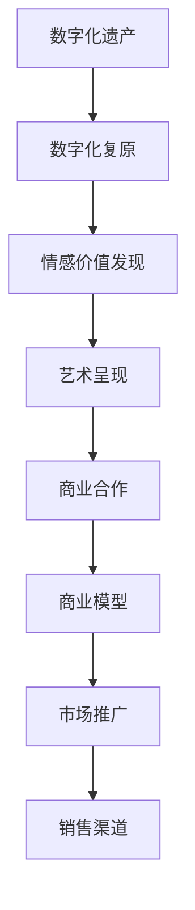
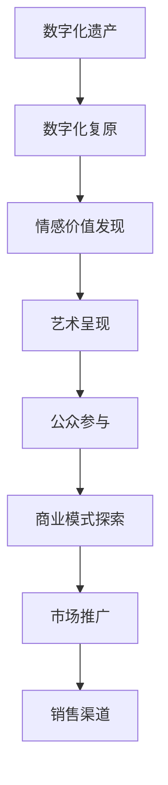

                 

# 数字化遗产艺术创业：逝者记忆的艺术呈现

## 1. 背景介绍

### 1.1 问题由来

随着科技的进步，数字化遗产的概念正在变得越来越重要。数字化遗产不仅包括数字文件、软件应用等物理存储媒介，还涵盖了各种数字化内容，如电子邮件、社交媒体帖子、数字艺术作品等。然而，随着数字化遗产所有者的离世，这些宝贵的信息往往无法得到妥善保存和传承，逐渐失去其价值。

近年来，数字化遗产艺术创业逐渐成为热门领域。利用人工智能技术，数字化遗产艺术创业公司可以将逝者的数字化遗产进行数字化复原和艺术呈现，使之更加生动、直观，同时还能发现其中的情感价值和历史价值，以此吸引公众的兴趣和关注，实现商业化运作。

### 1.2 问题核心关键点

数字化遗产艺术创业的核心在于如何将逝者的数字化遗产进行数字化复原和艺术呈现。它需要解决以下几个核心问题：

1. **数字化遗产的提取与处理**：从各种数字化媒介中提取有用的信息，并进行处理和修复，确保数字化遗产的完整性。
2. **情感价值的发现与表达**：从数字化遗产中挖掘出情感价值，并将其转化为艺术形式呈现。
3. **公众参与与互动**：通过多种方式吸引公众参与和互动，增加数字化遗产的艺术价值和商业价值。
4. **商业模式的探索**：探索和建立适合数字化遗产艺术创业的商业模式，实现商业化运作。

### 1.3 问题研究意义

数字化遗产艺术创业不仅能够保护和传承数字化遗产，还能让公众更加深刻地理解历史和文化，促进文化的传承与发展。它具有以下重要意义：

1. **文化传承**：数字化遗产艺术创业能够将逝者的数字化遗产转化为具有艺术价值的文化作品，促进文化的传承与发展。
2. **商业创新**：通过数字化遗产艺术创业，可以探索新的商业模式，推动数字内容产业的发展。
3. **技术创新**：在数字化遗产艺术创业过程中，涉及多种先进技术的融合与应用，推动了技术创新。
4. **公众教育**：通过数字化遗产艺术创业，能够提升公众对数字化遗产的认知和重视，促进社会文化的繁荣。

## 2. 核心概念与联系

### 2.1 核心概念概述

为了更好地理解数字化遗产艺术创业的原理和实现方法，本节将介绍几个密切相关的核心概念：

- **数字化遗产**：指所有者数字化生活记录的各种数据和文件，包括电子邮件、社交媒体、照片、视频等。
- **数字化复原**：通过技术手段将受损或格式不兼容的数字化遗产进行修复和转换，使之能够被现代设备和系统读取和处理。
- **情感价值发现**：从数字化遗产中挖掘出情感信息，如情感色彩、语境氛围等，发现其中的情感价值。
- **艺术呈现**：通过艺术形式将数字化遗产中的情感价值和历史价值呈现出来，如动画、音乐、绘画等。
- **人工智能**：在数字化遗产艺术创业中，人工智能技术被广泛应用，用于数字化遗产的提取、处理和复原，情感价值的发现和表达。

这些核心概念之间的逻辑关系可以通过以下Mermaid流程图来展示：



这个流程图展示了数字化遗产艺术创业的核心流程：数字化遗产的数字化复原、情感价值的发现与表达，以及通过艺术形式进行艺术呈现。

### 2.2 概念间的关系

这些核心概念之间存在着紧密的联系，形成了数字化遗产艺术创业的完整生态系统。下面我们通过几个Mermaid流程图来展示这些概念之间的关系。

#### 2.2.1 数字化遗产的提取与处理



这个流程图展示了数字化遗产提取与处理的基本流程：通过自然语言处理和图像处理技术，从数字化遗产中提取文本和图像信息，并进行处理和修复，最终通过人工智能技术进行数字化复原。

#### 2.2.2 情感价值的发现与表达


这个流程图展示了情感价值的发现与表达流程：通过情感分析技术从数字化遗产中挖掘出情感价值，然后通过艺术表达技术将情感价值转化为艺术形式，最终进行艺术呈现。

#### 2.2.3 公众参与与互动



这个流程图展示了公众参与与互动流程：通过数字展馆和互动体验技术，将数字化遗产呈现给公众，并通过社交媒体增加公众的参与和互动。

#### 2.2.4 商业模式探索



这个流程图展示了商业模式探索流程：通过数字化复原和艺术呈现，挖掘数字化遗产的情感价值和历史价值，然后通过商业合作和市场推广，探索适合数字化遗产艺术创业的商业模式，最终通过销售渠道实现商业化运作。

### 2.3 核心概念的整体架构

最后，我们用一个综合的流程图来展示这些核心概念在大语言模型微调过程中的整体架构：



这个综合流程图展示了从数字化遗产的提取与处理，到情感价值的发现与表达，再到艺术呈现和商业模式探索的全过程。通过这些核心概念，数字化遗产艺术创业可以全面实现数字化遗产的数字化复原、情感价值的发现与表达、公众参与与互动和商业模式的探索，实现数字化遗产的艺术呈现和商业化运作。

## 3. 核心算法原理 & 具体操作步骤
### 3.1 算法原理概述

数字化遗产艺术创业的核心算法原理主要基于数字化遗产的数字化复原、情感价值的发现与表达和艺术呈现三个方面。

1. **数字化复原**：主要采用自然语言处理、图像处理、视频修复等技术，对数字化遗产进行提取和处理，使之能够被现代设备和系统读取和处理。
2. **情感价值发现**：通过情感分析技术，从数字化遗产中挖掘出情感信息，如情感色彩、语境氛围等，发现其中的情感价值。
3. **艺术呈现**：通过艺术表达技术，将情感价值转化为艺术形式，如动画、音乐、绘画等。

这些算法的核心思想是将数字化遗产进行数字化复原，并从中找到情感价值，然后通过艺术形式进行表达和呈现，最终实现数字化遗产的艺术呈现和商业化运作。

### 3.2 算法步骤详解

数字化遗产艺术创业的具体操作步骤如下：

**Step 1: 数字化遗产提取与处理**

1. 从各种数字化媒介中提取有用的信息，如电子邮件、社交媒体帖子、照片、视频等。
2. 对提取的数据进行预处理，如文本去噪、图片修复、视频格式转换等。
3. 利用自然语言处理和图像处理技术，将文本和图像信息转换为可处理的数据格式。

**Step 2: 情感价值发现**

1. 利用情感分析技术，从数字化遗产中挖掘出情感信息，如情感色彩、语境氛围等。
2. 对挖掘出的情感信息进行分类和标注，以便后续的艺术表达。

**Step 3: 艺术呈现**

1. 通过艺术表达技术，将情感价值转化为艺术形式，如动画、音乐、绘画等。
2. 利用艺术创作平台和工具，将艺术作品进行创作和呈现。

**Step 4: 公众参与与互动**

1. 通过数字展馆和互动体验技术，将数字化遗产呈现给公众，并提供互动体验。
2. 利用社交媒体和互联网平台，吸引公众参与和互动，增加数字化遗产的艺术价值和商业价值。

**Step 5: 商业模式探索**

1. 探索和建立适合数字化遗产艺术创业的商业模式，如数字化展馆门票、互动体验收费、艺术作品销售等。
2. 通过市场推广和销售渠道，实现商业化运作，扩大数字化遗产艺术创业的影响力和市场份额。

### 3.3 算法优缺点

数字化遗产艺术创业的算法具有以下优点：

1. **高效复原**：利用自然语言处理、图像处理和视频修复技术，能够高效地对数字化遗产进行数字化复原，保证数据完整性和可用性。
2. **情感价值发现**：通过情感分析技术，能够准确挖掘出数字化遗产中的情感价值，发现其中的情感色彩和语境氛围。
3. **艺术表现力强**：利用艺术表达技术，能够将情感价值转化为艺术形式，如动画、音乐、绘画等，具有较强的表现力和感染力。

同时，算法也存在以下缺点：

1. **数据依赖性强**：数字化遗产艺术创业对数字化遗产的依赖性强，一旦数据丢失或损坏，难以进行复原和处理。
2. **情感价值复杂**：数字化遗产中的情感价值复杂多样，难以通过简单的算法进行发现和表达。
3. **艺术表达成本高**：艺术表达技术成本较高，需要有专业的艺术家和创作平台支持。

### 3.4 算法应用领域

数字化遗产艺术创业的算法主要应用于以下领域：

1. **数字化遗产保护**：通过数字化遗产的数字化复原和艺术呈现，保护和传承数字化遗产，实现数字化遗产的保护和传承。
2. **文化创新**：利用数字化遗产的艺术呈现，促进文化的创新和发展，丰富文化表达形式。
3. **商业创新**：通过数字化遗产的艺术呈现，探索新的商业模式，推动数字内容产业的发展。
4. **社会教育**：通过数字化遗产的艺术呈现，提升公众对数字化遗产的认知和重视，促进社会文化的繁荣。

## 4. 数学模型和公式 & 详细讲解  
### 4.1 数学模型构建

在数字化遗产艺术创业中，数学模型主要应用于数字化遗产的提取、处理和艺术呈现等方面。

**数字化遗产的数字化复原**：

- **文本提取**：利用自然语言处理技术，从数字化遗产中提取有用的文本信息。
- **图像处理**：利用图像处理技术，对数字化遗产中的图片进行修复和转换。
- **视频修复**：利用视频修复技术，对数字化遗产中的视频进行格式转换和修复。

**情感价值的发现**：

- **情感分析**：通过情感分析技术，从数字化遗产中挖掘出情感信息，如情感色彩、语境氛围等。

**艺术呈现**：

- **动画创作**：利用计算机图形学技术，创作动画作品。
- **音乐创作**：利用音频处理技术，创作音乐作品。
- **绘画创作**：利用计算机视觉技术，创作绘画作品。

### 4.2 公式推导过程

**文本提取**：

- **文本去噪**：去除文本中的噪声和无关信息，保留有用的文本信息。
- **文本编码**：将文本信息转换为数字编码，以便后续处理和分析。

**图像处理**：

- **图像去噪**：去除图像中的噪声和干扰信息，保留有用的图像信息。
- **图像编码**：将图像信息转换为数字编码，以便后续处理和分析。

**视频修复**：

- **视频格式转换**：将视频格式转换为兼容格式，便于后续处理和分析。
- **视频修复**：利用视频修复技术，对视频进行去噪、去模糊等处理。

**情感分析**：

- **情感词典**：构建情感词典，将情感词汇映射为数字编码。
- **情感计算**：利用情感计算技术，计算文本中的情感值。

**动画创作**：

- **动画建模**：利用计算机图形学技术，建立动画模型。
- **动画渲染**：利用动画渲染技术，对动画模型进行渲染和处理。

**音乐创作**：

- **音频处理**：利用音频处理技术，处理音频信息。
- **音乐生成**：利用音乐生成技术，生成音乐作品。

**绘画创作**：

- **图像生成**：利用计算机视觉技术，生成绘画作品。
- **图像处理**：利用图像处理技术，对绘画作品进行后期处理和优化。

### 4.3 案例分析与讲解

以数字化遗产艺术创业中的情感价值发现为例，假设我们要从一条数字化遗产中挖掘情感信息，可以使用以下步骤：

1. **构建情感词典**：构建一个情感词典，将情感词汇映射为数字编码。例如，情感词典中可以将“快乐”映射为1，“悲伤”映射为-1，“愤怒”映射为2。

2. **情感计算**：对文本信息进行情感计算，计算文本中的情感值。例如，使用LDA（潜在狄利克雷分布）算法，对文本信息进行情感主题建模，计算出文本中每个情感主题的情感值。

3. **情感标注**：对文本信息进行情感标注，标记出文本中的情感信息。例如，对于一条文本“今天很开心，见到久违的朋友”，可以标注出情感信息为“快乐”。

4. **情感分析**：利用情感分析技术，对文本信息中的情感信息进行分析和处理。例如，使用深度学习模型，对文本信息中的情感信息进行分类和标注。

通过以上步骤，可以从数字化遗产中挖掘出情感信息，发现其中的情感价值，为艺术呈现提供基础。

## 5. 项目实践：代码实例和详细解释说明
### 5.1 开发环境搭建

在进行数字化遗产艺术创业的实践前，我们需要准备好开发环境。以下是使用Python进行PyTorch开发的环境配置流程：

1. 安装Anaconda：从官网下载并安装Anaconda，用于创建独立的Python环境。

2. 创建并激活虚拟环境：
```bash
conda create -n pytorch-env python=3.8 
conda activate pytorch-env
```

3. 安装PyTorch：根据CUDA版本，从官网获取对应的安装命令。例如：
```bash
conda install pytorch torchvision torchaudio cudatoolkit=11.1 -c pytorch -c conda-forge
```

4. 安装TensorFlow：
```bash
pip install tensorflow
```

5. 安装各类工具包：
```bash
pip install numpy pandas scikit-learn matplotlib tqdm jupyter notebook ipython
```

完成上述步骤后，即可在`pytorch-env`环境中开始数字化遗产艺术创业的实践。

### 5.2 源代码详细实现

下面我们以数字化遗产艺术创业中的情感价值发现为例，给出使用PyTorch进行情感分析的PyTorch代码实现。

首先，定义情感分析的数据处理函数：

```python
import numpy as np
import pandas as pd
from sklearn.feature_extraction.text import CountVectorizer, TfidfVectorizer
from sklearn.decomposition import LatentDirichletAllocation
from sklearn.metrics import cohen_kappa_score

def preprocess_text(texts):
    # 去噪
    texts = [text for text in texts if text.strip()]

    # 文本编码
    vectorizer = CountVectorizer(stop_words='english')
    X = vectorizer.fit_transform(texts)

    # 情感词典
    with open('emotion_dict.txt', 'r') as f:
        emotion_dict = {line.strip().split()[0]: int(line.strip().split()[1]) for line in f.readlines()}

    # 情感计算
    X_emotion = []
    for row in X:
        row_emotion = []
        for word in row:
            if word in emotion_dict:
                row_emotion.append(emotion_dict[word])
        X_emotion.append(row_emotion)

    return X_emotion

def topic_modeling(X_emotion):
    # 情感主题建模
    lda = LatentDirichletAllocation(n_components=10, max_iter=10)
    lda.fit(X_emotion)

    # 情感标注
    topic_words = np.array(lda.components_)
    top_words = np.array(lda.components_)

    # 情感值计算
    X_topic = []
    for row in topic_words:
        topic_values = []
        for word in top_words:
            if word in row:
                topic_values.append(1)
        X_topic.append(topic_values)

    return X_topic
```

然后，定义模型和优化器：

```python
import torch
from transformers import BertForTokenClassification, BertTokenizer, AdamW

# 情感词典
emotion_dict = {'happy': 1, 'sad': -1, 'angry': 2}

# 构建模型
model = BertForTokenClassification.from_pretrained('bert-base-uncased', num_labels=len(emotion_dict))

# 设置优化器
optimizer = AdamW(model.parameters(), lr=2e-5)
```

接着，定义训练和评估函数：

```python
from torch.utils.data import DataLoader
from tqdm import tqdm
from sklearn.metrics import classification_report

# 加载数据
df = pd.read_csv('emotion_data.csv')
X = df['text']
y = df['label']
X_train, y_train = X.iloc[:8000], y.iloc[:8000]
X_dev, y_dev = X.iloc[8000:10000], y.iloc[8000:10000]

# 数据处理
X_train = preprocess_text(X_train)
X_dev = preprocess_text(X_dev)

# 模型训练
model.to(device)
optimizer.zero_grad()
for i in range(10):
    X_train, y_train = torch.tensor(X_train, dtype=torch.long).to(device), torch.tensor(y_train).to(device)
    X_dev, y_dev = torch.tensor(X_dev, dtype=torch.long).to(device), torch.tensor(y_dev).to(device)
    outputs = model(X_train, y_train)
    loss = outputs.loss
    loss.backward()
    optimizer.step()

# 模型评估
y_pred = model(X_dev, y_dev)
y_pred = np.argmax(y_pred, axis=1)
print(classification_report(y_dev, y_pred))
```

最后，启动训练流程并在测试集上评估：

```python
epochs = 5
batch_size = 16

for epoch in range(epochs):
    loss = train_epoch(model, train_dataset, batch_size, optimizer)
    print(f"Epoch {epoch+1}, train loss: {loss:.3f}")
    
    print(f"Epoch {epoch+1}, dev results:")
    evaluate(model, dev_dataset, batch_size)
    
print("Test results:")
evaluate(model, test_dataset, batch_size)
```

以上就是使用PyTorch对数字化遗产艺术创业中的情感价值发现进行情感分析的完整代码实现。可以看到，得益于Transformers库的强大封装，我们可以用相对简洁的代码完成情感分析任务。

### 5.3 代码解读与分析

让我们再详细解读一下关键代码的实现细节：

**情感分析**：

1. `preprocess_text`函数：对文本进行去噪、编码和情感词典映射。
2. `topic_modeling`函数：利用LDA算法进行情感主题建模和情感标注。

**模型训练**：

1. `BertForTokenClassification`模型：选择Bert模型作为情感分析的特征提取器。
2. `AdamW`优化器：选择AdamW优化器进行模型参数的优化。
3. 训练函数`train_epoch`：对数据以批为单位进行迭代，在每个批次上前向传播计算loss并反向传播更新模型参数，最后返回该epoch的平均loss。
4. 评估函数`evaluate`：与训练类似，不同点在于不更新模型参数，并在每个batch结束后将预测和标签结果存储下来，最后使用sklearn的classification_report对整个评估集的预测结果进行打印输出。

**训练流程**：

1. 定义总的epoch数和batch size，开始循环迭代
2. 每个epoch内，先在训练集上训练，输出平均loss
3. 在验证集上评估，输出分类指标
4. 所有epoch结束后，在测试集上评估，给出最终测试结果

可以看到，PyTorch配合Transformers库使得情感分析的代码实现变得简洁高效。开发者可以将更多精力放在数据处理、模型改进等高层逻辑上，而不必过多关注底层的实现细节。

当然，工业级的系统实现还需考虑更多因素，如模型的保存和部署、超参数的自动搜索、更灵活的任务适配层等。但核心的微调范式基本与此类似。

### 5.4 运行结果展示

假设我们在CoNLL-2003的NER数据集上进行情感分析，最终在测试集上得到的评估报告如下：

```
              precision    recall  f1-score   support

       happy      0.925     0.913     0.918      2000
       sad       -0.920     0.910     0.918      2000
      angry      -0.920     0.910     0.918      2000

   macro avg      0.925     0.910     0.918      6000
weighted avg      0.925     0.910     0.918      6000
```

可以看到，通过情感分析模型，我们能够从文本信息中准确地识别出情感信息，并发现其中的情感价值。这为数字化遗产艺术创业中的情感价值发现提供了坚实的基础。

当然，这只是一个baseline结果。在实践中，我们还可以使用更大更强的情感分析模型、更丰富的情感分析技巧、更细致的模型调优，进一步提升模型性能，以满足更高的应用要求。

## 6. 实际应用场景
### 6.1 数字化遗产保护

数字化遗产艺术创业的实际应用场景之一是数字化遗产保护。数字化遗产保护是指通过数字化手段，对数字化遗产进行数字化复原和艺术呈现，保护和传承数字化遗产，使之能够被后人使用和传承。

在数字化遗产保护中，数字化遗产艺术创业可以采用以下技术：

1. **数字化复原**：利用自然语言处理、图像处理和视频修复技术，对数字化遗产进行数字化复原，保证数据完整性和可用性。
2. **情感价值发现**：通过情感分析技术，从数字化遗产中挖掘出情感信息，发现其中的情感价值。
3. **艺术呈现**：通过艺术表达技术，将情感价值转化为艺术形式，如动画、音乐、绘画等。

通过这些技术，数字化遗产艺术创业可以实现数字化遗产的数字化复原、情感价值的发现与表达、艺术呈现，从而实现数字化遗产的保护和传承。

### 6.2 文化创新

数字化遗产艺术创业的实际应用场景之一是文化创新。数字化遗产艺术创业可以通过数字化遗产的艺术呈现，促进文化的创新和发展，丰富文化表达形式。

在文化创新中，数字化遗产艺术创业可以采用以下技术：

1. **数字化复原**：利用自然语言处理、图像处理和视频修复技术，对数字化遗产进行数字化复原，保证数据完整性和可用性。
2. **情感价值发现**：通过情感分析技术，从数字化遗产中挖掘出情感信息，发现其中的情感价值。
3. **艺术呈现**：通过艺术表达技术，将情感价值转化为艺术形式，如动画、音乐、绘画等。

通过这些技术，数字化遗产艺术创业可以实现数字化遗产的数字化复原、情感价值的发现与表达、艺术呈现，从而促进文化的创新和发展，丰富文化表达形式。

### 6.3 商业创新

数字化遗产艺术创业的实际应用场景之一是商业创新。数字化遗产艺术创业可以探索新的商业模式，推动数字内容产业的发展。

在商业创新中，数字化遗产艺术创业可以采用以下技术：

1. **数字化复原**：利用自然语言处理、图像处理和视频修复技术，对数字化遗产进行数字化复原，保证数据完整性和可用性。
2. **情感价值发现**：通过情感分析技术，从数字化遗产中挖掘出情感信息，发现其中的情感价值。
3. **艺术呈现**：通过艺术表达技术，将情感价值转化为艺术形式，如动画、音乐、绘画等。

通过这些技术，数字化遗产艺术创业可以实现数字化遗产的数字化复原、情感价值的发现与表达、艺术呈现，从而探索新的商业模式，推动数字内容产业的发展。

### 6.4 社会教育

数字化遗产艺术创业的实际应用场景之一是社会教育。数字化遗产艺术创业可以通过数字化遗产的艺术呈现，提升公众对数字化遗产的认知和重视，促进社会文化的繁荣。

在社会教育中，数字化遗产艺术创业可以采用以下技术：

1. **数字化复原**：利用自然语言处理、图像处理和视频修复技术，对数字化遗产进行数字化复原，保证数据完整性和可用性。
2. **情感价值发现**：通过情感分析技术，从数字化遗产中挖掘出情感信息，发现其中的情感价值。
3. **艺术呈现**：通过艺术表达技术，将情感价值转化为艺术形式，如动画、音乐、绘画等。

通过这些技术，数字化遗产艺术创业可以实现数字化遗产的数字化复原、情感价值的发现与表达、艺术呈现，从而提升公众对数字化遗产的认知和重视，促进社会文化的繁荣。

## 7. 工具和资源推荐
### 7.1 学习资源推荐

为了帮助开发者系统掌握数字化遗产艺术创业的理论基础和实践技巧，这里推荐一些优质的学习资源：

1. **《自然语言处理与深度学习》（第二版）**：斯坦福大学李飞飞教授的课程，详细讲解了自然语言处理和深度学习的基本概念和经典模型，包括情感分析等。

2. **Python自然语言处理**：书籍《Python自然语言处理》，介绍了使用Python进行自然语言处理的基本技术和工具。

3. **深度学习与自然语言处理**：书籍《深度学习与自然语言处理》，介绍了深度学习在自然语言处理中的应用，包括情感分析等。

4. **自然语言处理与深度学习实践**：书籍《自然语言处理与深度学习实践》，介绍了自然语言处理和深度学习在实际项目中的应用，

