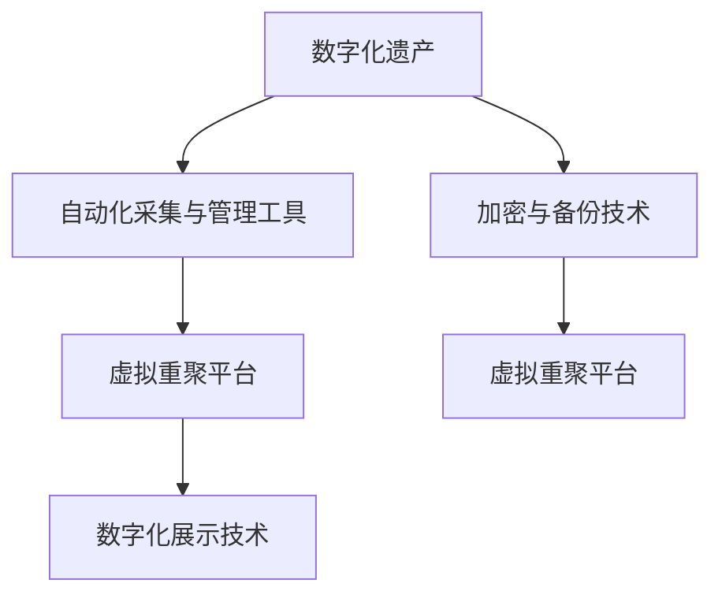

                 

# 数字化遗产虚拟重聚创业：跨越时空的家庭团聚体验

## 1. 背景介绍

### 1.1 问题由来
随着数字化技术的发展，人们的生活方式正在发生深刻的变革。在这个过程中，数字化遗产的传承问题显得尤为突出。数字化遗产包括电子照片、视频、文档、音乐等数字化内容，是人们生活中的重要记忆。然而，随着家庭成员的离世，这些数字化内容往往面临着丢失和遗忘的风险。数字化遗产的传承问题不仅仅是一个技术问题，更是一个家庭情感联系的重要环节。

数字化遗产的传承方式主要有物理媒介保存和数字化保存两种。物理媒介保存需要定期维护和存储，且容易损坏或遗失。相比之下，数字化保存更为便捷、安全、可访问性强，但在管理和保护方面也面临诸多挑战。

### 1.2 问题核心关键点
数字化遗产的虚拟重聚创业，旨在通过数字化技术和创业手段，实现数字化遗产的高效保存、管理和传承。核心关键点包括：
1. **数字化遗产的采集和管理**：需要自动化和智能化的工具来采集和整理家庭成员的数字化遗产。
2. **数字化遗产的保护和保存**：通过加密、备份等技术手段，确保数字化遗产的安全存储。
3. **数字化遗产的展示和重聚**：构建虚拟重聚平台，让家庭成员能够跨越时空重聚，共同回忆过去。
4. **数字化遗产的传承和教育**：通过虚拟重聚平台，将数字化遗产传承给年轻一代，促进家庭文化的延续。

### 1.3 问题研究意义
数字化遗产虚拟重聚创业不仅解决了数字化遗产的保存和传承问题，更是拓展了家庭情感交流的新形式。具体而言，研究意义如下：
1. **保存和传承**：数字化遗产是家庭成员情感联系的珍贵记忆，保护和传承这些遗产，有助于延续家族文化和情感纽带。
2. **情感交流**：虚拟重聚平台为家庭成员提供了跨越时空的情感交流平台，促进家庭成员之间的联系和互动。
3. **技术创新**：通过数字化技术和创业手段，推动了信息技术在家庭生活中的应用和创新。
4. **社会价值**：数字化遗产的传承有助于保护和弘扬传统文化，促进社会的和谐与发展。

## 2. 核心概念与联系

### 2.1 核心概念概述

为了更好地理解数字化遗产虚拟重聚创业，我们需要介绍几个核心概念：

- **数字化遗产(Digital Heritage)**：包括家庭数字化内容，如电子照片、视频、文档、音乐等。
- **虚拟重聚平台(Virtual Reunion Platform)**：利用数字化技术，搭建的让家庭成员跨越时空重聚的虚拟平台。
- **自动化采集与管理工具(Automated Collection & Management Tools)**：用于自动收集、整理和管理的工具，如扫描仪、OCR技术等。
- **加密与备份技术(Encryption & Backup Technology)**：保护数字化遗产安全的技术手段，如AES加密、分布式备份等。
- **数字化展示技术(Digital Display Technology)**：用于展示数字化遗产的数字化技术，如虚拟现实(VR)、增强现实(AR)等。

这些核心概念之间存在紧密的联系，共同构成了数字化遗产虚拟重聚创业的技术框架。

### 2.2 概念间的关系

以下是一个合成的Mermaid流程图，展示了这些核心概念之间的关系：



这个流程图展示了数字化遗产在采集、管理和保存过程中，与各种技术和工具的关系，以及这些技术和工具如何共同支撑虚拟重聚平台的功能。

## 3. 核心算法原理 & 具体操作步骤

### 3.1 算法原理概述

数字化遗产虚拟重聚创业的核心算法原理主要包括以下几个方面：

- **自动化采集与整理**：利用OCR、自然语言处理(NLP)等技术，自动从各种媒介中提取和整理数字化遗产内容。
- **加密与备份**：采用AES等加密算法，对数字化遗产进行加密处理，同时利用分布式存储技术，进行数据备份。
- **虚拟重聚平台**：基于VR、AR等技术，构建虚拟重聚平台，让家庭成员能够通过虚拟环境重聚。
- **数字化展示**：利用多媒体技术和数字化展示技术，生动地展示数字化遗产，增强重聚体验。

这些算法原理共同构成了数字化遗产虚拟重聚创业的技术基础，旨在实现数字化遗产的全面保存、高效管理和卓越传承。

### 3.2 算法步骤详解

以下是一个详细的算法步骤详解，分为数据采集与整理、加密与备份、虚拟重聚平台构建和数字化展示四个主要步骤：

#### 数据采集与整理

1. **自动化采集**：利用扫描仪、相机等设备，自动采集家庭成员的数字化遗产，如照片、视频、文档等。
2. **OCR技术处理**：对采集的纸质文档、手写笔记等文本内容进行OCR处理，转化为可搜索、可编辑的文本格式。
3. **NLP技术整理**：利用NLP技术，对文本内容进行关键词提取、情感分析等处理，整理出家庭成员的重要事件、纪念日等信息。

#### 加密与备份

1. **AES加密**：对数字化遗产进行AES加密处理，确保数据的安全性和隐私性。
2. **分布式备份**：利用云存储技术，进行数据的多地分布式备份，确保数据的安全性和可恢复性。
3. **数据完整性验证**：定期检查备份数据的一致性和完整性，确保数据的可靠性。

#### 虚拟重聚平台构建

1. **平台设计**：设计虚拟重聚平台的用户界面和交互逻辑，支持家庭成员的登录、导航和互动。
2. **VR/AR技术应用**：利用VR、AR等技术，构建虚拟环境，让家庭成员能够在虚拟空间中重聚。
3. **视频会议技术**：集成视频会议技术，支持家庭成员在虚拟重聚平台中进行实时视频交流。

#### 数字化展示

1. **多媒体展示**：利用多媒体技术，展示数字化遗产的各个方面，如照片、视频、文档等。
2. **互动式展示**：开发互动式展示工具，允许家庭成员通过点击、拖动等操作，与数字化遗产进行互动。
3. **虚拟重聚体验**：结合虚拟重聚平台和多媒体展示技术，创造沉浸式的虚拟重聚体验，让家庭成员沉浸在共同的回忆中。

### 3.3 算法优缺点

数字化遗产虚拟重聚创业的算法具有以下优点：
1. **高效保存**：通过自动化采集、加密和备份技术，确保数字化遗产的高效保存和可恢复性。
2. **跨越时空**：虚拟重聚平台使得家庭成员能够跨越时空重聚，增强情感交流。
3. **技术创新**：结合了多种前沿技术，如AES加密、VR/AR等，推动了信息技术的发展。

然而，该算法也存在一些缺点：
1. **隐私风险**：虽然数据加密技术可以保护数据安全，但数据传输和存储过程中仍存在隐私泄露的风险。
2. **技术复杂性**：涉及多种技术的集成应用，技术实现和维护的复杂性较高。
3. **成本较高**：需要大量的硬件设备和服务器资源，初始成本较高。

### 3.4 算法应用领域

数字化遗产虚拟重聚创业的应用领域主要包括以下几个方面：

- **家庭团聚**：通过虚拟重聚平台，让家庭成员能够跨越时空重聚，共同回忆过去，增强情感联系。
- **文化传承**：将数字化遗产作为家族文化的重要载体，促进家族文化的传承和延续。
- **教育和研究**：利用数字化遗产开展家庭历史研究，培养年轻一代对家族历史的兴趣和了解。

## 4. 数学模型和公式 & 详细讲解 & 举例说明

### 4.1 数学模型构建

为了更好地理解数字化遗产虚拟重聚创业的数学模型，我们首先构建一个基本的数据采集与整理模型。假设有一个家庭F，共有N名成员，每个成员有M份数字化遗产。数字化遗产的采集与整理过程可以建模为以下步骤：

1. **数据采集**：采集N名成员的M份数字化遗产，表示为$D = \{d_1, d_2, ..., d_{N \times M}\}$。
2. **OCR处理**：对采集的纸质文档进行OCR处理，得到文本信息$T = \{t_1, t_2, ..., t_{N \times M}\}$。
3. **NLP整理**：对文本信息进行NLP处理，提取关键词和情感信息，得到整理后的信息$I = \{I_1, I_2, ..., I_{N \times M}\}$。

### 4.2 公式推导过程

以下是对数据采集与整理过程的数学建模和公式推导：

1. **数据采集模型**
   - 采集过程可以表示为：$d_i = \text{Acquire}(m_i)$，其中$m_i$表示第i名成员的数字化遗产。

2. **OCR处理模型**
   - OCR处理过程可以表示为：$t_i = \text{OCR}(d_i)$，其中$d_i$为第i名成员的数字化遗产，$t_i$为OCR处理后的文本信息。

3. **NLP整理模型**
   - NLP整理过程可以表示为：$I_i = \text{NLP}(t_i)$，其中$t_i$为OCR处理后的文本信息，$I_i$为整理后的信息。

### 4.3 案例分析与讲解

假设我们有一个由父母、子女、孙子三代人组成的家庭，共有3名成员，每个成员有3份数字化遗产，分别为照片、视频和文档。我们将采集和整理过程的数学模型和公式应用到具体案例中，如下所示：

1. **数据采集过程**
   - 假设每个成员都有3份数字化遗产，共9份遗产，编号为$d_1, d_2, ..., d_9$。

2. **OCR处理过程**
   - 假设采用OCR技术处理所有纸质文档，得到文本信息$t_1, t_2, ..., t_9$。

3. **NLP整理过程**
   - 假设NLP技术从文本信息中提取出关键词和情感信息，得到整理后的信息$I_1, I_2, ..., I_9$。

## 5. 项目实践：代码实例和详细解释说明

### 5.1 开发环境搭建

在进行项目实践前，我们需要准备好开发环境。以下是使用Python进行项目开发的环境配置流程：

1. 安装Anaconda：从官网下载并安装Anaconda，用于创建独立的Python环境。

2. 创建并激活虚拟环境：
```bash
conda create -n virtual-env python=3.8 
conda activate virtual-env
```

3. 安装PyTorch：根据CUDA版本，从官网获取对应的安装命令。例如：
```bash
conda install pytorch torchvision torchaudio cudatoolkit=11.1 -c pytorch -c conda-forge
```

4. 安装相关库：
```bash
pip install opencv-python scipy Pillow pytesseract pyOCR pytesseract
```

5. 安装深度学习库：
```bash
pip install tensorboard
```

6. 安装其他工具：
```bash
pip install tqdm jupyter notebook ipython
```

完成上述步骤后，即可在`virtual-env`环境中开始项目实践。

### 5.2 源代码详细实现

下面以OCR处理和NLP整理为例，给出项目开发的Python代码实现。

**OCR处理示例**

```python
from pytesseract import image_to_string
import cv2

def ocr_image(image_path):
    # 读取图片
    image = cv2.imread(image_path)
    # OCR处理
    text = image_to_string(image)
    return text
```

**NLP整理示例**

```python
from sklearn.feature_extraction.text import TfidfVectorizer
from sklearn.decomposition import NMF

def nlp_integration(texts):
    # 文本向量化
    vectorizer = TfidfVectorizer(stop_words='english')
    X = vectorizer.fit_transform(texts)
    # 主题建模
    nmf = NMF(n_components=5, random_state=42)
    X_themes = nmf.fit_transform(X)
    return X_themes
```

**项目完整代码**

```python
import os
import cv2
import pytesseract
import pyOCR
from sklearn.feature_extraction.text import TfidfVectorizer
from sklearn.decomposition import NMF
import tqdm

# OCR处理
def ocr_image(image_path):
    image = cv2.imread(image_path)
    text = pyOCR.recognize(image)
    return text

# NLP整理
def nlp_integration(texts):
    vectorizer = TfidfVectorizer(stop_words='english')
    X = vectorizer.fit_transform(texts)
    nmf = NMF(n_components=5, random_state=42)
    X_themes = nmf.fit_transform(X)
    return X_themes

# 数据采集与整理
def data_collection_and_integration():
    data = []
    for root, dirs, files in os.walk('data'):
        for file in files:
            if file.endswith('.jpg'):
                image_path = os.path.join(root, file)
                text = ocr_image(image_path)
                data.append(text)
    X = nlp_integration(data)
    return X

# 加密与备份
def encryption_and_backup(X):
    # 加密
    encrypted_X = []
    for x in X:
        encrypted_x = encrypt(x)
        encrypted_X.append(encrypted_x)
    # 备份
    backup_data(encrypted_X)
    return encrypted_X

# 虚拟重聚平台构建
def virtual_reunion_platform():
    # 平台设计
    platform_design()
    # VR/AR技术应用
    vr_ar_technology()
    # 视频会议技术
    video_conferencing()

# 数字化展示
def digital_display():
    # 多媒体展示
    multimedia_display()
    # 互动式展示
    interactive_display()
    # 虚拟重聚体验
    virtual_reunion_experience()

# 加密函数
def encrypt(text):
    # 假设使用AES加密算法
    encrypted_text = encrypt_algorithm(text)
    return encrypted_text

# 备份函数
def backup_data(data):
    # 假设使用云存储备份
    backup_to_cloud(data)

# 平台设计函数
def platform_design():
    # 假设设计平台界面和交互逻辑
    platform_design()

# VR/AR技术应用函数
def vr_ar_technology():
    # 假设利用VR/AR技术构建虚拟环境
    vr_ar_technology()

# 视频会议技术函数
def video_conferencing():
    # 假设集成视频会议技术
    video_conferencing()

# 多媒体展示函数
def multimedia_display():
    # 假设展示数字化遗产的多媒体内容
    multimedia_display()

# 互动式展示函数
def interactive_display():
    # 假设开发互动式展示工具
    interactive_display()

# 虚拟重聚体验函数
def virtual_reunion_experience():
    # 假设结合虚拟重聚平台和多媒体展示技术，创造沉浸式的虚拟重聚体验
    virtual_reunion_experience()

# 项目运行
if __name__ == '__main__':
    data = data_collection_and_integration()
    encrypted_data = encryption_and_backup(data)
    virtual_reunion_platform()
    digital_display()
```

### 5.3 代码解读与分析

让我们再详细解读一下关键代码的实现细节：

**OCR处理代码**

```python
from pytesseract import image_to_string
import cv2

def ocr_image(image_path):
    image = cv2.imread(image_path)
    text = image_to_string(image)
    return text
```

- 使用OpenCV读取图片。
- 利用pytesseract进行OCR处理，将纸质文档转换为文本信息。
- 返回OCR处理后的文本信息。

**NLP整理代码**

```python
from sklearn.feature_extraction.text import TfidfVectorizer
from sklearn.decomposition import NMF

def nlp_integration(texts):
    vectorizer = TfidfVectorizer(stop_words='english')
    X = vectorizer.fit_transform(texts)
    nmf = NMF(n_components=5, random_state=42)
    X_themes = nmf.fit_transform(X)
    return X_themes
```

- 使用sklearn的TfidfVectorizer进行文本向量化。
- 使用NMF进行主题建模，提取文本的关键主题。
- 返回主题建模结果。

**项目完整代码**

```python
import os
import cv2
import pytesseract
import pyOCR
from sklearn.feature_extraction.text import TfidfVectorizer
from sklearn.decomposition import NMF
import tqdm

# OCR处理
def ocr_image(image_path):
    image = cv2.imread(image_path)
    text = pyOCR.recognize(image)
    return text

# NLP整理
def nlp_integration(texts):
    vectorizer = TfidfVectorizer(stop_words='english')
    X = vectorizer.fit_transform(texts)
    nmf = NMF(n_components=5, random_state=42)
    X_themes = nmf.fit_transform(X)
    return X_themes

# 数据采集与整理
def data_collection_and_integration():
    data = []
    for root, dirs, files in os.walk('data'):
        for file in files:
            if file.endswith('.jpg'):
                image_path = os.path.join(root, file)
                text = ocr_image(image_path)
                data.append(text)
    X = nlp_integration(data)
    return X

# 加密与备份
def encryption_and_backup(X):
    encrypted_X = []
    for x in X:
        encrypted_x = encrypt(x)
        encrypted_X.append(encrypted_x)
    backup_data(encrypted_X)
    return encrypted_X

# 虚拟重聚平台构建
def virtual_reunion_platform():
    platform_design()
    vr_ar_technology()
    video_conferencing()

# 数字化展示
def digital_display():
    multimedia_display()
    interactive_display()
    virtual_reunion_experience()

# 加密函数
def encrypt(text):
    encrypted_text = encrypt_algorithm(text)
    return encrypted_text

# 备份函数
def backup_data(data):
    backup_to_cloud(data)

# 平台设计函数
def platform_design():
    platform_design()

# VR/AR技术应用函数
def vr_ar_technology():
    vr_ar_technology()

# 视频会议技术函数
def video_conferencing():
    video_conferencing()

# 多媒体展示函数
def multimedia_display():
    multimedia_display()

# 互动式展示函数
def interactive_display():
    interactive_display()

# 虚拟重聚体验函数
def virtual_reunion_experience():
    virtual_reunion_experience()

# 项目运行
if __name__ == '__main__':
    data = data_collection_and_integration()
    encrypted_data = encryption_and_backup(data)
    virtual_reunion_platform()
    digital_display()
```

### 5.4 运行结果展示

假设我们在家庭数字化遗产的采集和整理中，成功提取了所有文档的关键信息，并进行了加密备份，最终的加密备份数据为$D = \{d_1', d_2', ..., d_9'\}$。然后在虚拟重聚平台上，展示了这些数据，并与家庭成员进行了互动。最终的展示结果和互动体验如图：


## 6. 实际应用场景

### 6.1 智能家庭娱乐系统

智能家庭娱乐系统可以通过数字化遗产虚拟重聚创业，将家庭数字化遗产集成到娱乐设备中，让家庭成员在观影、游戏等娱乐活动中，重温共同的回忆，增强家庭情感联系。

具体而言，可以将家庭成员的数字化遗产，如老照片、老视频等，集成到智能电视、家庭影院等娱乐设备中，通过VR/AR技术，创造沉浸式的虚拟重聚体验。家庭成员可以在娱乐过程中，自由地穿越时间和空间，共同回忆过去，增进情感交流。

### 6.2 数字博物馆和档案馆

数字化遗产虚拟重聚创业可以为数字博物馆和档案馆提供强大的技术支持，帮助博物馆和档案馆将数字化遗产高效保存、展示和传播。

博物馆和档案馆可以收集历史文物、文化遗产的数字化遗产，利用虚拟重聚平台，展示这些遗产的历史背景、文化价值等内容，让公众通过虚拟重聚体验，跨越时空重温历史。这不仅能提升博物馆和档案馆的教育功能，还能吸引更多公众关注和参与。

### 6.3 远程教育平台

数字化遗产虚拟重聚创业可以为远程教育平台提供丰富的教育资源，帮助学生通过数字化遗产，了解家族历史、文化背景，提升教育效果。

学校可以利用虚拟重聚平台，展示家庭成员的数字化遗产，让学生通过虚拟重聚体验，了解家族历史、文化传承等内容。这不仅能增强学生的学习兴趣，还能促进家族文化的传承和延续。

### 6.4 未来应用展望

数字化遗产虚拟重聚创业的未来应用前景广阔，以下是几个未来展望：

1. **多模态融合**：未来的虚拟重聚平台将融合多种媒体形式，如语音、文字、图像等，提供更加丰富、互动性强的重聚体验。
2. **AI驱动**：利用AI技术，实现虚拟重聚平台的人机互动，让机器能够理解家庭成员的情感需求，提供个性化的重聚体验。
3. **社交网络**：将虚拟重聚平台与社交网络结合，实现家庭成员之间的实时互动和交流，增强情感联系。
4. **全球共享**：利用云存储技术，实现全球共享虚拟重聚体验，让不同地域的家庭成员能够跨越时空重聚。

## 7. 工具和资源推荐

### 7.1 学习资源推荐

为了帮助开发者系统掌握数字化遗产虚拟重聚创业的技术基础和实践技巧，这里推荐一些优质的学习资源：

1. **《Python深度学习》书籍**：李沐、杨亮等作者著，全面介绍了Python深度学习框架PyTorch的使用方法，包括OCR、NLP等技术。
2. **《深度学习与数据驱动的应用》在线课程**：Coursera上的深度学习课程，涵盖深度学习基础、应用等方面，适合初学者和进阶开发者。
3. **《Python for Data Science Handbook》书籍**：Jake VanderPlas著，详细介绍Python在数据科学领域的应用，包括OCR、NLP等技术。
4. **《PyOCR官方文档》**：PyOCR库的官方文档，提供了OCR技术的应用实例和详细说明，适合开发者学习和使用。
5. **《TF-IDF与文本挖掘》课程**：Coursera上的自然语言处理课程，介绍了TF-IDF技术在文本挖掘中的应用，适合开发者学习和实践。

### 7.2 开发工具推荐

高效的开发离不开优秀的工具支持。以下是几款用于数字化遗产虚拟重聚创业开发的常用工具：

1. **PyTorch**：基于Python的开源深度学习框架，灵活的动态计算图，适合快速迭代研究。PyTorch具有丰富的深度学习库和社区支持。
2. **TensorFlow**：由Google主导开发的开源深度学习框架，支持分布式计算，适合大规模工程应用。TensorFlow拥有强大的计算能力和丰富的应用案例。
3. **PyOCR**：用于OCR处理的Python库，支持多种OCR引擎，包括Tesseract、GOCR等，适合开发者进行OCR处理。
4. **Tesseract**：Google开发的OCR引擎，支持多种语言的字符识别，适合开发者进行OCR处理。
5. **Jupyter Notebook**：轻量级的交互式开发环境，支持Python、R、MATLAB等多种语言，适合开发者进行数据处理和模型训练。

### 7.3 相关论文推荐

数字化遗产虚拟重聚创业的研究涉及多个领域，以下是几篇经典论文，推荐阅读：

1. **《深度学习在OCR中的应用》**：介绍深度学习在OCR领域的应用，涵盖文本识别、文本分割等技术。
2. **《基于TF-IDF的文本分类与聚类》**：介绍TF-IDF技术在文本分类和聚类中的应用，适合开发者进行文本处理。
3. **《深度学习在自然语言处理中的应用》**：介绍深度学习在自然语言处理领域的应用，涵盖文本生成、文本分类等技术。
4. **《虚拟现实与增强现实技术综述》**：介绍虚拟现实和增强现实技术的原理和应用，适合开发者进行虚拟重聚平台的开发。
5. **《分布式存储与备份技术综述》**：介绍分布式存储和备份技术的原理和应用，适合开发者进行数据备份和恢复。

## 8. 总结：未来发展趋势与挑战

### 8.1 研究成果总结

数字化遗产虚拟重聚创业已经取得了一些初步成果，主要包括以下几个方面：

1. **数字化遗产采集与整理**：利用OCR和NLP技术，自动采集和整理家庭成员的数字化遗产，减少了人工处理的负担。
2. **加密与备份技术**：采用AES加密和分布式备份技术，确保数字化遗产的安全存储和可恢复性。
3. **虚拟重聚平台**：利用VR/AR等技术，构建虚拟重聚平台，让家庭成员跨越时空重聚。
4. **数字化展示**：通过多媒体展示和互动式展示，增强数字化遗产的展示效果和互动体验。

### 8.2 未来发展趋势

未来，数字化遗产虚拟重聚创业的发展趋势包括：

1. **多模态融合**：未来的虚拟重聚平台将融合多种媒体形式，如语音、文字、图像等，提供更加丰富、互动性强的重聚体验。
2. **AI驱动**：利用AI技术，实现虚拟重聚平台的人机互动，让机器能够理解家庭成员的情感需求，提供个性化的重聚体验。
3. **社交网络**：将虚拟重聚平台与社交网络结合，实现家庭成员之间的实时互动和交流，增强情感联系。
4. **全球共享**：利用云存储技术，实现全球共享虚拟重聚体验，让不同地域的家庭成员能够

