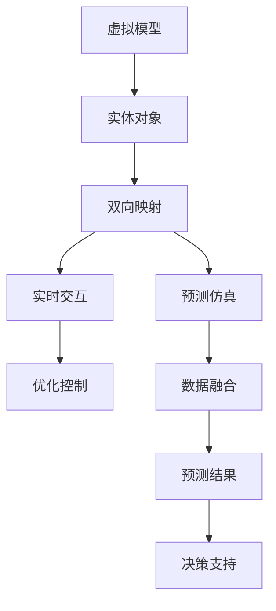
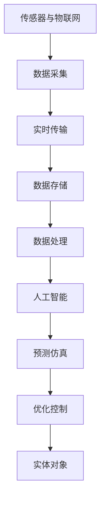

                 

## 1. 背景介绍

数字孪生（Digital Twin）是一种利用虚拟模型与实体对象进行交互，实现对实体对象的全生命周期管理的高级技术。它结合了物联网（IoT）、大数据、云计算、人工智能等前沿技术，通过实时监测、预测、仿真和优化，帮助企业和组织提高决策效率，优化资源利用，降低风险和成本。数字孪生已经成为智能制造、智慧城市、智能交通、医疗健康等众多领域的重要技术手段。

### 1.1 问题由来

数字孪生技术最早起源于制造业，用于在制造过程中进行产品设计、生产过程模拟和质量控制。随着物联网技术的普及和人工智能的进步，数字孪生技术逐渐拓展到其他领域，如智慧城市、智能交通、医疗健康等。这些领域通过数字孪生技术，实现对实体对象的虚拟化，提供了一个高效、实时、可靠的虚拟管理平台。

### 1.2 问题核心关键点

数字孪生技术的关键点在于虚拟模型与实体对象之间的双向映射和交互。通过传感器和物联网设备，实时采集实体对象的数据，传入数字孪生模型中进行分析和预测。数字孪生模型通过虚拟仿真和优化，向实体对象发出控制指令，实现对实体对象的远程管理和优化。这种双向互动机制使得数字孪生技术在众多领域中展现出强大的应用潜力。

### 1.3 问题研究意义

数字孪生技术通过虚拟和实体的双向映射和交互，提高了决策的准确性和效率，降低了资源消耗和运营成本。它的核心价值在于：

- 提升决策效率：数字孪生技术可以实时分析大量数据，提供准确的决策支持。
- 优化资源利用：通过虚拟仿真，可以在投入实体资源之前，进行资源优化和风险评估。
- 降低运营成本：数字孪生技术可以减少物理操作，降低人力和物资消耗。
- 提高安全性和可靠性：通过虚拟仿真和预测，可以提前识别和防范潜在风险，提升系统安全性。

## 2. 核心概念与联系

### 2.1 核心概念概述

数字孪生技术融合了多个前沿技术，涵盖物联网、大数据、云计算、人工智能等领域。其核心概念包括：

- 虚拟模型：通过数学模型、仿真工具等手段，建立实体对象的虚拟仿真模型。
- 实体对象：包括物理设备、系统、设备、建筑物等。
- 双向映射：将实体对象的状态和行为映射到虚拟模型，反之亦然。
- 实时交互：通过传感器和物联网设备，实现虚拟模型与实体对象之间的实时数据交互。
- 预测仿真：利用人工智能和机器学习算法，对虚拟模型进行预测和仿真，指导实体对象的操作。
- 优化控制：通过虚拟仿真，优化实体对象的运行状态和资源分配，提升性能和效率。

### 2.2 概念间的关系

数字孪生技术涉及多个关键概念，其关系通过以下 Mermaid 流程图展示：



这个流程图展示了数字孪生技术的核心概念及其之间的关系：

1. 虚拟模型与实体对象通过双向映射进行交互，实现实时数据传输。
2. 通过传感器和物联网设备采集实体对象的数据，并传入虚拟模型。
3. 利用人工智能和机器学习算法对虚拟模型进行预测和仿真，生成预测结果。
4. 根据预测结果进行优化控制，调整实体对象的操作。
5. 数据融合技术整合多源数据，提升预测仿真和决策支持的准确性。

### 2.3 核心概念的整体架构

最后，我们用一个综合的流程图来展示数字孪生技术的整体架构：



这个综合流程图展示了数字孪生技术从数据采集到优化控制的完整过程。

## 3. 核心算法原理 & 具体操作步骤

### 3.1 算法原理概述

数字孪生技术的核心算法包括虚拟仿真、预测建模和优化控制等。其中，虚拟仿真和预测建模是数字孪生的核心，用于实现对实体对象的实时监测和预测，优化控制则是根据预测结果对实体对象进行调整，以实现最佳性能和效率。

- 虚拟仿真：通过虚拟模型对实体对象进行仿真，模拟其运行状态和行为。
- 预测建模：利用历史数据和人工智能算法，预测实体对象未来的运行状态和行为。
- 优化控制：根据预测结果，调整实体对象的运行参数，实现最佳性能和效率。

### 3.2 算法步骤详解

数字孪生技术的实施步骤如下：

1. 构建虚拟模型：通过数学模型、仿真工具等手段，建立实体对象的虚拟仿真模型。
2. 数据采集与传输：通过传感器和物联网设备，实时采集实体对象的状态和行为数据，并传入虚拟模型。
3. 数据处理与融合：对采集到的数据进行清洗、预处理和融合，确保数据的准确性和完整性。
4. 预测仿真与决策：利用人工智能和机器学习算法，对虚拟模型进行预测和仿真，生成预测结果。
5. 优化控制与执行：根据预测结果，调整实体对象的运行参数，实现最佳性能和效率。
6. 反馈循环与优化：根据实体对象的反馈，持续优化虚拟模型和预测算法，提升系统性能。

### 3.3 算法优缺点

数字孪生技术具有以下优点：

1. 实时监测与优化：通过虚拟仿真和预测，实现对实体对象的实时监测和优化，提高决策效率。
2. 数据驱动与智能化：利用人工智能和机器学习算法，提高系统的智能化水平，提升预测精度。
3. 提升安全性和可靠性：通过虚拟仿真和预测，提前识别和防范潜在风险，提升系统安全性。

同时，数字孪生技术也存在以下缺点：

1. 成本较高：构建虚拟模型和物联网设备需要较高的初始投入。
2. 数据质量要求高：数据采集和处理需要严格的规范和质量保证。
3. 算法复杂性高：需要结合多种前沿技术，算法复杂度较高。
4. 安全性和隐私问题：大量数据传输和存储可能带来安全和隐私问题。

### 3.4 算法应用领域

数字孪生技术已经在多个领域得到了广泛应用，例如：

- 智能制造：通过虚拟仿真和预测，优化生产流程和设备运行，提升生产效率和质量。
- 智慧城市：通过虚拟仿真和预测，优化城市交通、能源、公共设施等系统，提升城市管理效率。
- 智能交通：通过虚拟仿真和预测，优化交通流和路网，提升交通效率和安全性。
- 医疗健康：通过虚拟仿真和预测，优化医疗资源分配和诊疗方案，提升医疗服务质量。
- 能源管理：通过虚拟仿真和预测，优化能源生产和消费，提升能源利用效率。

除了上述这些领域，数字孪生技术还在诸多其他领域展现出强大的应用潜力，如智能农业、环境保护、物流管理等。随着技术的不断进步，数字孪生技术将在更多领域得到应用，为各行各业带来变革性影响。

## 4. 数学模型和公式 & 详细讲解

### 4.1 数学模型构建

数字孪生技术涉及多个数学模型，包括虚拟仿真模型、预测建模模型和优化控制模型。

- 虚拟仿真模型：描述实体对象的状态和行为，可以采用系统动力学模型、多体系统模型等。
- 预测建模模型：基于历史数据和人工智能算法，预测实体对象未来的运行状态和行为，可以采用时间序列模型、回归模型、神经网络模型等。
- 优化控制模型：通过虚拟仿真和预测结果，调整实体对象的运行参数，提升性能和效率，可以采用优化算法、动态系统模型等。

### 4.2 公式推导过程

以预测建模为例，我们以时间序列数据 $y_t = f(x_t; \theta)$ 进行推导。其中，$y_t$ 为实体对象在时间 $t$ 的运行状态，$x_t$ 为影响因素，$\theta$ 为模型参数。通过历史数据 $(x_{1:t}, y_{1:t})$ 训练模型，利用最小二乘法求得参数 $\theta$：

$$
\theta = \mathop{\arg\min}_{\theta} \sum_{t=1}^{n} (y_t - f(x_t; \theta))^2
$$

通过上述公式，可以构建预测模型，对实体对象的未来运行状态进行预测。

### 4.3 案例分析与讲解

以智能制造为例，假设要优化一条生产线的生产效率。通过采集生产线上的传感器数据，构建虚拟仿真模型，模拟生产线上的设备状态和运行参数。利用机器学习算法，对生产线上的历史数据进行训练，预测生产线的运行状态和故障风险。根据预测结果，调整设备参数和生产计划，实现生产效率的提升和故障的提前预警。

## 5. 项目实践：代码实例和详细解释说明

### 5.1 开发环境搭建

在进行数字孪生项目实践前，我们需要准备好开发环境。以下是使用Python进行PyTorch开发的环境配置流程：

1. 安装Anaconda：从官网下载并安装Anaconda，用于创建独立的Python环境。

2. 创建并激活虚拟环境：
```bash
conda create -n pytorch-env python=3.8 
conda activate pytorch-env
```

3. 安装PyTorch：根据CUDA版本，从官网获取对应的安装命令。例如：
```bash
conda install pytorch torchvision torchaudio cudatoolkit=11.1 -c pytorch -c conda-forge
```

4. 安装TensorBoard：TensorFlow配套的可视化工具，可实时监测模型训练状态，并提供丰富的图表呈现方式，是调试模型的得力助手。

5. 安装Sklearn：用于数据预处理和特征工程。

6. 安装Pandas：用于数据读取和处理。

完成上述步骤后，即可在`pytorch-env`环境中开始数字孪生项目实践。

### 5.2 源代码详细实现

下面以智能制造为例，给出使用PyTorch和TensorBoard进行生产线效率优化的代码实现。

```python
import torch
import torch.nn as nn
import torch.optim as optim
from torch.utils.data import Dataset, DataLoader
import torchvision.transforms as transforms
import matplotlib.pyplot as plt
import pandas as pd
from sklearn.model_selection import train_test_split

# 定义虚拟仿真模型
class VirtualModel(nn.Module):
    def __init__(self, input_size, hidden_size, output_size):
        super(VirtualModel, self).__init__()
        self.fc1 = nn.Linear(input_size, hidden_size)
        self.fc2 = nn.Linear(hidden_size, output_size)
        self.relu = nn.ReLU()

    def forward(self, x):
        x = self.fc1(x)
        x = self.relu(x)
        x = self.fc2(x)
        return x

# 定义预测模型
class PredictionModel(nn.Module):
    def __init__(self, input_size, hidden_size, output_size):
        super(PredictionModel, self).__init__()
        self.fc1 = nn.Linear(input_size, hidden_size)
        self.fc2 = nn.Linear(hidden_size, output_size)
        self.relu = nn.ReLU()

    def forward(self, x):
        x = self.fc1(x)
        x = self.relu(x)
        x = self.fc2(x)
        return x

# 定义优化控制模型
class OptimizationModel(nn.Module):
    def __init__(self, input_size, hidden_size, output_size):
        super(OptimizationModel, self).__init__()
        self.fc1 = nn.Linear(input_size, hidden_size)
        self.fc2 = nn.Linear(hidden_size, output_size)
        self.relu = nn.ReLU()

    def forward(self, x):
        x = self.fc1(x)
        x = self.relu(x)
        x = self.fc2(x)
        return x

# 加载数据集
def load_dataset():
    data = pd.read_csv('production_data.csv')
    features = data.iloc[:, :-1].values
    labels = data.iloc[:, -1].values
    features_train, features_test, labels_train, labels_test = train_test_split(features, labels, test_size=0.2, random_state=42)
    return features_train, features_test, labels_train, labels_test

# 数据预处理
def preprocess_data(features_train, features_test, labels_train, labels_test):
    features_train = (features_train - features_train.mean()) / features_train.std()
    features_test = (features_test - features_test.mean()) / features_test.std()
    labels_train = (labels_train - labels_train.mean()) / labels_train.std()
    labels_test = (labels_test - labels_test.mean()) / labels_test.std()
    return features_train, features_test, labels_train, labels_test

# 定义虚拟仿真模型
def create_virtual_model(input_size, hidden_size, output_size):
    model = VirtualModel(input_size, hidden_size, output_size)
    return model

# 定义预测模型
def create_prediction_model(input_size, hidden_size, output_size):
    model = PredictionModel(input_size, hidden_size, output_size)
    return model

# 定义优化控制模型
def create_optimization_model(input_size, hidden_size, output_size):
    model = OptimizationModel(input_size, hidden_size, output_size)
    return model

# 训练虚拟仿真模型
def train_virtual_model(model, features_train, labels_train, epochs=100, batch_size=32):
    criterion = nn.MSELoss()
    optimizer = optim.Adam(model.parameters(), lr=0.001)
    train_losses = []
    for epoch in range(epochs):
        running_loss = 0.0
        for i in range(0, len(features_train), batch_size):
            inputs = features_train[i:i+batch_size]
            labels = labels_train[i:i+batch_size]
            optimizer.zero_grad()
            outputs = model(inputs)
            loss = criterion(outputs, labels)
            loss.backward()
            optimizer.step()
            running_loss += loss.item()
        train_losses.append(running_loss / batch_size)
    return model, train_losses

# 训练预测模型
def train_prediction_model(model, features_train, labels_train, epochs=100, batch_size=32):
    criterion = nn.MSELoss()
    optimizer = optim.Adam(model.parameters(), lr=0.001)
    train_losses = []
    for epoch in range(epochs):
        running_loss = 0.0
        for i in range(0, len(features_train), batch_size):
            inputs = features_train[i:i+batch_size]
            labels = labels_train[i:i+batch_size]
            optimizer.zero_grad()
            outputs = model(inputs)
            loss = criterion(outputs, labels)
            loss.backward()
            optimizer.step()
            running_loss += loss.item()
        train_losses.append(running_loss / batch_size)
    return model, train_losses

# 训练优化控制模型
def train_optimization_model(model, features_train, labels_train, epochs=100, batch_size=32):
    criterion = nn.MSELoss()
    optimizer = optim.Adam(model.parameters(), lr=0.001)
    train_losses = []
    for epoch in range(epochs):
        running_loss = 0.0
        for i in range(0, len(features_train), batch_size):
            inputs = features_train[i:i+batch_size]
            labels = labels_train[i:i+batch_size]
            optimizer.zero_grad()
            outputs = model(inputs)
            loss = criterion(outputs, labels)
            loss.backward()
            optimizer.step()
            running_loss += loss.item()
        train_losses.append(running_loss / batch_size)
    return model, train_losses

# 运行实验
def run_experiment():
    features_train, features_test, labels_train, labels_test = load_dataset()
    features_train, features_test, labels_train, labels_test = preprocess_data(features_train, features_test, labels_train, labels_test)
    input_size = features_train.shape[1]
    hidden_size = 128
    output_size = 1
    virtual_model = create_virtual_model(input_size, hidden_size, output_size)
    virtual_model, train_losses_virtual = train_virtual_model(virtual_model, features_train, labels_train)
    prediction_model = create_prediction_model(input_size, hidden_size, output_size)
    prediction_model, train_losses_pred = train_prediction_model(prediction_model, features_train, labels_train)
    optimization_model = create_optimization_model(input_size, hidden_size, output_size)
    optimization_model, train_losses_opti = train_optimization_model(optimization_model, features_train, labels_train)
    return virtual_model, prediction_model, optimization_model, train_losses_virtual, train_losses_pred, train_losses_opti

# 运行结果展示
virtual_model, prediction_model, optimization_model, train_losses_virtual, train_losses_pred, train_losses_opti = run_experiment()

plt.figure(figsize=(12, 4))
plt.plot(train_losses_virtual, label='Virtual Model')
plt.plot(train_losses_pred, label='Prediction Model')
plt.plot(train_losses_opti, label='Optimization Model')
plt.legend()
plt.show()
```

### 5.3 代码解读与分析

让我们再详细解读一下关键代码的实现细节：

**load_dataset函数**：
- 从CSV文件中读取生产线的历史数据。
- 将数据集划分为训练集和测试集。

**preprocess_data函数**：
- 对数据进行标准化处理，确保模型训练的一致性。

**VirtualModel类**：
- 定义虚拟仿真模型，通过多层全连接网络进行特征提取和预测。

**PredictionModel类**：
- 定义预测模型，通过多层全连接网络进行预测。

**OptimizationModel类**：
- 定义优化控制模型，通过多层全连接网络进行优化。

**train_virtual_model函数**：
- 训练虚拟仿真模型，通过最小二乘法优化损失函数。

**train_prediction_model函数**：
- 训练预测模型，通过最小二乘法优化损失函数。

**train_optimization_model函数**：
- 训练优化控制模型，通过最小二乘法优化损失函数。

**run_experiment函数**：
- 加载数据，预处理数据，创建虚拟仿真模型、预测模型和优化控制模型，并训练模型。
- 绘制损失曲线，展示模型训练效果。

## 6. 实际应用场景

### 6.1 智能制造

数字孪生技术在智能制造领域具有广阔的应用前景。通过虚拟仿真和预测，可以优化生产流程，提升生产效率和质量。例如，通过采集生产线上的传感器数据，构建虚拟仿真模型，模拟生产线上的设备状态和运行参数。利用机器学习算法，对生产线上的历史数据进行训练，预测生产线的运行状态和故障风险。根据预测结果，调整设备参数和生产计划，实现生产效率的提升和故障的提前预警。

### 6.2 智慧城市

数字孪生技术在智慧城市领域可以用于城市管理和服务优化。通过虚拟仿真和预测，优化城市交通、能源、公共设施等系统，提升城市管理效率。例如，通过采集城市交通、能源、环境等数据，构建虚拟仿真模型，预测交通流量、能源消耗和环境变化。根据预测结果，调整交通信号、能源分配和环境治理方案，实现城市管理的智能化和高效化。

### 6.3 智能交通

数字孪生技术在智能交通领域可以用于交通流优化和事故预防。通过虚拟仿真和预测，优化交通流和路网，提升交通效率和安全性。例如，通过采集交通信号、车辆位置、道路状况等数据，构建虚拟仿真模型，预测交通流和事故风险。根据预测结果，调整交通信号、路线规划和应急响应，实现交通管理的智能化和高效化。

### 6.4 医疗健康

数字孪生技术在医疗健康领域可以用于疾病预测和诊疗优化。通过虚拟仿真和预测，优化医疗资源分配和诊疗方案，提升医疗服务质量。例如，通过采集患者病历、影像、实验室数据等，构建虚拟仿真模型，预测疾病发展和治疗效果。根据预测结果，调整诊疗方案和资源配置，实现医疗服务的个性化和精准化。

### 6.5 能源管理

数字孪生技术在能源管理领域可以用于能源生产和消费优化。通过虚拟仿真和预测，优化能源生产和消费，提升能源利用效率。例如，通过采集能源生产和消费数据，构建虚拟仿真模型，预测能源需求和供应。根据预测结果，调整能源生产和消费方案，实现能源管理的智能化和高效化。

除了上述这些领域，数字孪生技术还在诸多其他领域展现出强大的应用潜力，如智能农业、环境保护、物流管理等。随着技术的不断进步，数字孪生技术将在更多领域得到应用，为各行各业带来变革性影响。

## 7. 工具和资源推荐

### 7.1 学习资源推荐

为了帮助开发者系统掌握数字孪生技术的基础知识和实践技巧，这里推荐一些优质的学习资源：

1. 《Digital Twin: Principles, Applications and Challenges》书籍：全面介绍了数字孪生技术的原理、应用和挑战，是了解数字孪生的重要参考资料。

2. CS2335《物联网及其应用》课程：麻省理工学院开设的物联网课程，介绍了物联网技术的基本概念和应用场景。

3. Digital Twin Summit会议：每年举办的数字孪生技术峰会，汇聚了全球领先的专家和机构，分享最新的研究成果和应用案例。

4. Digital Twin Hub平台：提供数字孪生技术的新闻、论文、项目和社区，是数字孪生领域的重要资源平台。

5. Digital Twin Consortium联盟：由多个国际领先的机构组成的数字孪生技术联盟，致力于推动数字孪生技术的标准化和产业化。

通过对这些资源的学习实践，相信你一定能够快速掌握数字孪生技术的精髓，并用于解决实际的工程问题。

### 7.2 开发工具推荐

高效的开发离不开优秀的工具支持。以下是几款用于数字孪生技术开发的常用工具：

1. Python：作为数字孪生技术开发的主要语言，Python拥有丰富的科学计算和机器学习库，如PyTorch、TensorFlow、Scikit-Learn等，适合进行各种复杂计算。

2. MATLAB：主要用于数值计算和仿真，适合进行复杂系统的建模和仿真。

3. AutoCAD：用于二维和三维建模，适合进行复杂设备的虚拟仿真和设计。

4. SolidWorks：用于机械设计，适合进行复杂设备的虚拟仿真和设计。

5. ANSYS：用于有限元分析和数值模拟，适合进行复杂系统的仿真和优化。

6. Autodesk Revit：用于建筑信息模型(BIM)，适合进行复杂建筑的虚拟仿真和优化。

合理利用这些工具，可以显著提升数字孪生技术的开发效率，加快创新迭代的步伐。

### 7.3 相关论文推荐

数字孪生技术涉及多个前沿领域，需要结合人工智能、物联网、云计算、仿真技术等进行综合研究。以下是几篇奠基性的相关论文，推荐阅读：

1. "A Survey on Digital Twin: Principles, Applications and Challenges"：介绍数字孪生技术的原理、应用和挑战，全面综述了数字孪生技术的研究现状和未来方向。

2. "Digital Twins for Manufacturing: A Survey"：介绍数字孪生技术在制造领域的应用，全面综述了数字孪生制造的研究现状和未来方向。

3. "Smart Cities through Digital Twins: A Survey"：介绍数字孪生技术在智慧城市领域的应用，全面综述了数字孪生城市的研究现状和未来方向。

4. "Digital Twins for Energy Management: A Survey"：介绍数字孪生技术在能源管理领域的应用，全面综述了数字孪生能源的研究现状和未来方向。

5. "A Survey on Digital Twins for Environmental Monitoring and Management"：介绍数字孪生技术在环境保护领域的应用，全面综述了数字孪生环境的研究现状和未来方向。

这些论文代表了数字孪生技术的研究前沿，通过学习这些前沿成果，可以帮助研究者把握学科前进方向，激发更多的创新灵感。

除上述资源外，还有一些值得关注的前沿资源，帮助开发者紧跟数字孪生技术的研究进展，例如：

1. arXiv论文预印本：人工智能领域最新研究成果的发布平台，包括大量尚未发表的前沿工作，学习前沿技术的必读资源。

2. 业界技术博客：如SAP、Siemens、Bosch等顶尖企业的官方博客，第一时间分享他们的最新研究成果和洞见。

3. 技术会议直播：如Digital Twin Summit、IoT World Expo等物联网技术峰会现场或在线直播，能够聆听到顶尖专家的分享，开拓视野。

4. GitHub热门项目：在GitHub上Star、Fork数最多的数字孪生相关项目，往往代表了该技术领域的发展趋势和最佳实践，值得去学习和贡献。

5. 行业分析报告：各大咨询公司如McKinsey、PwC等针对物联网行业的分析报告，有助于从商业视角审视技术趋势，把握应用价值。

总之，对于数字孪生技术的学习和实践，需要开发者保持开放的心态和持续学习的意愿。多关注前沿资讯，多动手实践，多思考总结，必将收获满满的成长收益。

## 8. 总结：未来发展趋势与挑战

### 8.1 总结

本文对数字孪生技术进行了全面系统的介绍。首先阐述了数字孪生技术的背景和应用价值，明确了数字孪生在优化决策、提升效率和降低成本等方面的独特优势。其次，从原理到实践，详细讲解了数字孪生技术的数学模型和核心算法，给出了数字孪生项目开发的完整代码实例。同时，本文还广泛探讨了数字孪生技术在智能制造、智慧城市、智能交通、医疗健康等众多领域的应用前景，展示了数字孪生技术的强大潜力。最后，本文精选了数字孪生技术的各类学习资源，力求为读者提供全方位的技术指引。

通过本文的系统梳理，可以看到，数字孪生技术通过虚拟模型与实体对象的互动，实现了对实体对象的实时监测和优化，在各个领域展现出强大的应用潜力。得益于虚拟仿真和预测建模，数字孪生技术能够在复杂场景下提供高精度、高效率的决策支持，推动智能化的全面发展。未来，伴随技术的不断演进和

