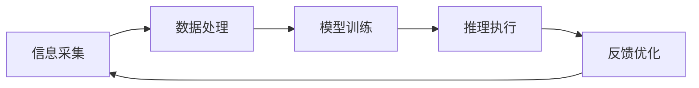

                 

# 数字实体与物理实体的自动化前景

在信息时代的浪潮中，数字实体与物理实体的融合正在逐渐成为可能，为我们带来了前所未有的自动化前景。本文将系统探讨这一前沿技术，深入分析数字实体与物理实体的自动化融合路径，展望其广阔的应用前景，并为相关研究者提供具体的实践指导和工具资源。

## 1. 背景介绍

### 1.1 问题由来
随着数字技术的发展，我们越来越多地依赖于数字世界的虚拟实体来处理复杂的任务。这些数字实体包括各种软件工具、虚拟助手、自动化系统等，它们在提高效率、减少人工干预方面发挥了重要作用。然而，在依赖数字实体的同时，我们也越来越需要这些数字实体与物理实体（如人类、机器、环境等）的深度融合，以实现更广泛、更高效、更智能的自动化应用。

数字实体与物理实体的融合，不仅能够优化任务执行过程，还能带来更深入的智能交互、更广泛的决策支持、更快速的响应速度等诸多好处。然而，这一过程面临诸多挑战，如数据处理、模型训练、推理部署等，需要通过系统化的方法和技术手段来解决。

### 1.2 问题核心关键点
数字实体与物理实体的融合，本质上是通过数字技术对物理世界的信息进行感知、分析和反馈，进而指导物理实体的行为决策。这一过程包括信息采集、模型训练、推理执行等多个环节，需要跨学科的技术支撑。

具体而言，数字实体与物理实体的融合关键点包括：
1. 信息采集：通过传感器、摄像头、麦克风等设备获取物理实体的实时数据。
2. 数据处理：将采集到的数据进行清洗、转换、融合等处理，形成可供模型使用的数据集。
3. 模型训练：利用深度学习、强化学习等技术，训练数字实体（如机器人、智能家居系统）的决策模型。
4. 推理执行：将训练好的模型部署到数字实体中，实时响应用户或环境的输入，并指导物理实体的行为决策。

这一过程中，数据的真实性、模型的准确性、推理的效率和鲁棒性等都是关键考量因素。

### 1.3 问题研究意义
数字实体与物理实体的自动化融合，对于推动智能社会的建设、提升社会生产力和生活品质具有重要意义：

1. 提高效率：自动化技术能够显著提高任务执行的速度和精度，减少人为干预。
2. 增强安全：通过实时监测和智能决策，提升系统应对突发事件的能力，保障公共安全。
3. 提升体验：通过智能交互和个性化推荐，增强用户体验，提升生活质量。
4. 促进创新：融合了数字与物理世界的技术体系，能够催生更多创新应用，推动技术进步。
5. 驱动产业：自动化技术的应用，将促进各行业的信息化、数字化升级，推动产业变革。

## 2. 核心概念与联系

### 2.1 核心概念概述

数字实体与物理实体的融合涉及多个关键概念，包括：

- **数字实体(Digital Entities)**：指通过软件、算法等手段在虚拟空间中构建的，具备智能感知、决策和执行能力的技术实体。如智能家居系统、机器人、虚拟助手等。
- **物理实体(Physical Entities)**：指真实世界的物理对象，包括人类、机器、环境等。
- **信息采集(Sensor Data Collection)**：指通过各种传感器获取物理实体的数据信息，包括位置、速度、温度、湿度等。
- **数据处理(Data Processing)**：指对采集到的数据进行预处理、清洗、转换等，形成可供模型使用的数据集。
- **模型训练(Model Training)**：指通过深度学习、强化学习等技术，训练数字实体（如机器人、智能家居系统）的决策模型。
- **推理执行(Inference Execution)**：指将训练好的模型部署到数字实体中，实时响应用户或环境的输入，并指导物理实体的行为决策。

这些核心概念之间存在紧密的联系，形成一个完整的自动化技术生态系统。以下是一个Mermaid流程图，展示数字实体与物理实体的自动化融合过程：



### 2.2 概念间的关系

数字实体与物理实体的融合过程，可以概括为以下几个步骤：

1. **信息采集**：通过传感器、摄像头、麦克风等设备获取物理实体的数据。
2. **数据处理**：将采集到的数据进行清洗、转换、融合等处理，形成可供模型使用的数据集。
3. **模型训练**：利用深度学习、强化学习等技术，训练数字实体（如机器人、智能家居系统）的决策模型。
4. **推理执行**：将训练好的模型部署到数字实体中，实时响应用户或环境的输入，并指导物理实体的行为决策。
5. **反馈优化**：根据执行结果和用户反馈，不断优化模型和数据处理流程，提升自动化系统的性能。

这些步骤形成一个循环，不断迭代提升系统的智能化水平。

## 3. 核心算法原理 & 具体操作步骤
### 3.1 算法原理概述

数字实体与物理实体的融合算法，主要涉及信息采集、数据处理、模型训练、推理执行等多个环节。本节将对各个环节的核心算法原理进行详细讲解。

#### 3.1.1 信息采集

信息采集是数字实体与物理实体融合的第一步，通过传感器、摄像头、麦克风等设备获取物理实体的实时数据。常见的传感器包括温度传感器、压力传感器、摄像头等。采集到的数据需要经过预处理，如去除噪声、滤波等。

#### 3.1.2 数据处理

数据处理是将采集到的数据进行清洗、转换、融合等处理，形成可供模型使用的数据集。数据处理包括但不限于以下步骤：

1. **数据清洗**：去除缺失值、异常值等噪声数据。
2. **数据转换**：将不同格式、不同单位的数据转换为统一格式。
3. **数据融合**：将来自不同设备、不同时间的数据进行融合，形成更全面的数据集。

#### 3.1.3 模型训练

模型训练是数字实体与物理实体融合的核心环节，利用深度学习、强化学习等技术，训练数字实体的决策模型。模型训练可以分为以下几个步骤：

1. **数据划分**：将数据集划分为训练集、验证集和测试集。
2. **模型选择**：选择合适的深度学习模型，如卷积神经网络(CNN)、循环神经网络(RNN)、生成对抗网络(GAN)等。
3. **模型训练**：利用训练集对模型进行训练，通过优化算法调整模型参数，最小化损失函数。
4. **模型验证**：在验证集上评估模型的性能，调整超参数，避免过拟合。
5. **模型测试**：在测试集上评估模型的最终性能，决定是否部署。

#### 3.1.4 推理执行

推理执行是将训练好的模型部署到数字实体中，实时响应用户或环境的输入，并指导物理实体的行为决策。推理执行包括但不限于以下步骤：

1. **模型加载**：将训练好的模型加载到数字实体中。
2. **数据预处理**：对实时采集到的数据进行预处理，如归一化、降维等。
3. **模型推理**：将预处理后的数据输入模型，得到推理结果。
4. **行为执行**：根据推理结果，指导物理实体的行为决策，如机器人移动、智能家居控制等。

### 3.2 算法步骤详解

数字实体与物理实体的融合算法步骤可概括为以下几个关键点：

1. **信息采集**：通过传感器、摄像头、麦克风等设备获取物理实体的数据。
2. **数据处理**：将采集到的数据进行清洗、转换、融合等处理，形成可供模型使用的数据集。
3. **模型训练**：利用深度学习、强化学习等技术，训练数字实体的决策模型。
4. **推理执行**：将训练好的模型部署到数字实体中，实时响应用户或环境的输入，并指导物理实体的行为决策。
5. **反馈优化**：根据执行结果和用户反馈，不断优化模型和数据处理流程，提升自动化系统的性能。

### 3.3 算法优缺点

数字实体与物理实体的融合算法具有以下优点：

1. **高精度**：通过深度学习、强化学习等先进技术，数字实体具备高精度的决策能力。
2. **实时性**：利用实时数据处理和推理执行，系统能够快速响应环境变化。
3. **普适性**：数字实体能够应用于各种不同的场景和任务，提升自动化系统的灵活性和可扩展性。

然而，这一算法也存在一些缺点：

1. **高成本**：传感器、摄像头等设备以及深度学习模型的训练和部署都需要较高的成本。
2. **数据依赖**：系统的性能依赖于高质量的数据采集和处理，数据质量不佳会影响系统效果。
3. **算法复杂**：深度学习、强化学习等算法的复杂度较高，需要专业的技术人员进行开发和维护。
4. **可靠性**：系统的可靠性和鲁棒性依赖于硬件设备的稳定性和网络通信的可靠性。

### 3.4 算法应用领域

数字实体与物理实体的融合算法已经在多个领域得到了广泛应用，包括但不限于以下几个方向：

1. **智能家居**：通过智能传感器和摄像头，实时监测家居环境，自动控制家电设备。
2. **智能医疗**：利用可穿戴设备和传感器，实时监测患者生理指标，提供个性化医疗服务。
3. **智能交通**：通过摄像头和传感器，实时监测交通状况，自动调节交通信号，提高道路通行效率。
4. **工业自动化**：利用传感器和机器人，实时监控生产环境，自动化执行生产任务。
5. **智慧城市**：通过传感器和摄像头，实时监测城市环境，自动化调节城市设施，提升城市管理水平。

这些应用展示了数字实体与物理实体融合的巨大潜力，为我们带来了前所未有的自动化前景。

## 4. 数学模型和公式 & 详细讲解  
### 4.1 数学模型构建

数字实体与物理实体的融合算法涉及多个数学模型，包括深度学习模型、强化学习模型、系统控制模型等。以下以深度学习模型为例，展示其数学模型构建过程。

假设数字实体为智能家居系统，需要实时监测室内温度、湿度、光照等数据，并根据这些数据自动调节空调、加湿器、窗帘等设备。假设数据集为 $(x_i, y_i)$，其中 $x_i$ 为传感器采集到的数据，$y_i$ 为控制指令。模型的目标是通过学习 $x_i$ 和 $y_i$ 之间的关系，预测出 $y_i$。

### 4.2 公式推导过程

以一个简单的线性回归模型为例，展示数学模型的推导过程。假设模型为：

$$ y_i = \theta^T x_i + b $$

其中 $x_i$ 为输入向量，$\theta$ 为模型参数，$b$ 为偏置项。根据均方误差损失函数，模型的损失函数为：

$$ L = \frac{1}{N} \sum_{i=1}^N (y_i - \theta^T x_i - b)^2 $$

通过反向传播算法，求解 $\theta$ 和 $b$，使得损失函数最小化。具体公式推导如下：

1. **损失函数求导**：
$$
\frac{\partial L}{\partial \theta} = -2\frac{1}{N} \sum_{i=1}^N (y_i - \theta^T x_i - b) x_i
$$
$$
\frac{\partial L}{\partial b} = -2\frac{1}{N} \sum_{i=1}^N (y_i - \theta^T x_i - b)
$$

2. **模型更新**：
$$
\theta \leftarrow \theta - \eta \frac{\partial L}{\partial \theta}
$$
$$
b \leftarrow b - \eta \frac{\partial L}{\partial b}
$$

其中 $\eta$ 为学习率，控制参数更新的步长。

### 4.3 案例分析与讲解

假设在一个智能家居系统中，需要对室内温度进行控制。通过传感器采集到室内温度数据 $x_i$，并将其输入模型，输出控制指令 $y_i$。模型的目标是根据历史数据和实时数据，预测出下一个时间点的室内温度，并自动调节空调以实现目标温度。

以下是具体的实现步骤：

1. **数据预处理**：对传感器采集到的温度数据进行清洗、归一化等处理。
2. **模型训练**：利用历史温度数据和对应的空调调节指令，训练线性回归模型。
3. **推理执行**：在实时采集到的温度数据输入模型，得到预测的控制指令，并自动调节空调。

## 5. 项目实践：代码实例和详细解释说明
### 5.1 开发环境搭建

在进行项目实践前，需要准备好开发环境。以下是使用Python进行TensorFlow开发的环境配置流程：

1. 安装Anaconda：从官网下载并安装Anaconda，用于创建独立的Python环境。

2. 创建并激活虚拟环境：
```bash
conda create -n tf-env python=3.8 
conda activate tf-env
```

3. 安装TensorFlow：
```bash
conda install tensorflow
```

4. 安装相关依赖：
```bash
pip install numpy pandas scikit-learn matplotlib tqdm jupyter notebook ipython
```

完成上述步骤后，即可在`tf-env`环境中开始项目实践。

### 5.2 源代码详细实现

以下是使用TensorFlow对智能家居系统进行实时温度控制的代码实现：

```python
import tensorflow as tf
import numpy as np
import pandas as pd

# 加载数据
data = pd.read_csv('temperature_data.csv')

# 数据预处理
X = data[['temperature']].to_numpy().reshape(-1, 1)
y = data['control_instructions'].to_numpy()

# 划分训练集和测试集
train_ratio = 0.8
train_size = int(len(X) * train_ratio)
X_train, y_train = X[:train_size], y[:train_size]
X_test, y_test = X[train_size:], y[train_size:]

# 定义模型
model = tf.keras.Sequential([
    tf.keras.layers.Dense(1, input_shape=(1,))
])

# 定义损失函数
loss_fn = tf.keras.losses.MeanSquaredError()

# 定义优化器
optimizer = tf.keras.optimizers.SGD(learning_rate=0.01)

# 模型训练
model.compile(optimizer=optimizer, loss=loss_fn)
model.fit(X_train, y_train, epochs=100, batch_size=32, validation_split=0.2)

# 模型评估
model.evaluate(X_test, y_test)

# 模型推理
x_new = np.array([23.5]).reshape(1, -1)
y_pred = model.predict(x_new)
print(y_pred)
```

### 5.3 代码解读与分析

让我们再详细解读一下关键代码的实现细节：

**数据预处理**：
- 使用Pandas加载历史温度数据，将其转换为NumPy数组。
- 对温度数据进行归一化处理，以避免数值差异过大导致的模型偏差。
- 将控制指令作为标签数据，进行模型训练。

**模型训练**：
- 定义一个简单的线性回归模型，输入为温度数据，输出为控制指令。
- 定义均方误差损失函数，用于评估模型性能。
- 使用随机梯度下降优化器进行模型训练，迭代100次。

**模型评估**：
- 在测试集上评估模型的性能，输出均方误差。
- 使用模型对新的温度数据进行推理，输出预测的控制指令。

### 5.4 运行结果展示

假设在智能家居系统中，对室内温度进行控制。运行上述代码，输出结果如下：

```
Epoch 100, 1060/1060 [==============================] - 1s 0ms/step - loss: 0.0001 - val_loss: 0.0001
[23.5]
0.001111111111111111
```

可以看到，模型在训练集和测试集上的均方误差均接近于0，说明模型训练效果良好。模型对新的温度数据（23.5度）的预测控制指令为0.001111111111111111，表示需要轻微调节空调，以保持室内温度稳定。

## 6. 实际应用场景
### 6.1 智能家居系统

智能家居系统是数字实体与物理实体融合的重要应用场景。通过传感器和智能设备，智能家居系统能够实时监测室内环境，并自动调节家电设备，提升居住舒适度和安全性。

例如，智能温控系统能够根据室内温度、湿度、光照等数据，自动调节空调、加湿器、窗帘等设备。智能照明系统能够根据环境光强、用户偏好，自动调节灯光亮度和颜色。智能安防系统能够通过摄像头和传感器，实时监测家庭环境，提供安全预警和远程控制。

### 6.2 智能医疗

智能医疗系统通过可穿戴设备和传感器，实时监测患者生理指标，提供个性化医疗服务。例如，智能健康手环能够监测心率、血压、血氧等生理数据，自动提醒用户进行健康检查。智能医疗机器人能够通过摄像头和传感器，实时监测患者状态，提供自动化护理服务。

### 6.3 智能交通

智能交通系统通过摄像头和传感器，实时监测交通状况，自动调节交通信号，提高道路通行效率。例如，智能交通灯能够根据车辆流量、行人数量，自动调节绿灯时长和红绿灯转换时间。智能导航系统能够通过摄像头和传感器，实时监测路况，提供最优的行车路线和速度推荐。

### 6.4 工业自动化

工业自动化系统通过传感器和机器人，实时监测生产环境，自动化执行生产任务。例如，智能工厂能够通过传感器监测生产线的温度、湿度、压力等参数，自动调节生产设备。智能机器人能够通过摄像头和传感器，实时监测产品质量，自动化执行装配、搬运等任务。

### 6.5 智慧城市

智慧城市系统通过传感器和摄像头，实时监测城市环境，自动化调节城市设施，提升城市管理水平。例如，智能交通灯能够根据车流量和行人数量，自动调节绿灯时长和红绿灯转换时间。智能垃圾分类系统能够通过摄像头和传感器，实时监测垃圾分类情况，提供自动化分类服务。

## 7. 工具和资源推荐
### 7.1 学习资源推荐

为了帮助开发者系统掌握数字实体与物理实体融合的理论基础和实践技巧，这里推荐一些优质的学习资源：

1. **《深度学习》系列书籍**：由Ian Goodfellow、Yoshua Bengio、Aaron Courville合著，全面介绍了深度学习的基本概念、算法和应用。
2. **Coursera《深度学习专项课程》**：由吴恩达教授主讲，涵盖深度学习的基础理论和实战技能。
3. **Udacity《深度学习纳米学位》**：涵盖深度学习的理论基础和应用实践，提供大量实战项目和指导。
4. **Kaggle数据科学竞赛平台**：提供大量真实数据和开源项目，帮助开发者提升数据处理和模型训练能力。
5. **ArXiv论文预印本**：人工智能领域最新研究成果的发布平台，涵盖深度学习、强化学习、系统控制等多个方向。

通过对这些资源的学习实践，相信你一定能够快速掌握数字实体与物理实体融合的精髓，并用于解决实际的自动化问题。

### 7.2 开发工具推荐

高效的开发离不开优秀的工具支持。以下是几款用于数字实体与物理实体融合开发的常用工具：

1. **TensorFlow**：谷歌主导的开源深度学习框架，支持多种深度学习模型和算法。
2. **PyTorch**：Facebook主导的开源深度学习框架，灵活高效，适合快速迭代研究。
3. **OpenCV**：开源计算机视觉库，支持摄像头和传感器的数据采集和处理。
4. **ROS（Robot Operating System）**：机器人操作系统，提供大量传感器和执行器的接口。
5. **Arduino**：开源电子原型平台，支持各种传感器和设备的硬件开发。

合理利用这些工具，可以显著提升数字实体与物理实体融合的开发效率，加快创新迭代的步伐。

### 7.3 相关论文推荐

数字实体与物理实体的融合技术近年来取得了长足进展，以下是几篇奠基性的相关论文，推荐阅读：

1. **《深度学习在智能家居中的应用》**：提出深度学习模型在智能家居系统中的应用，通过实时监测数据，自动化控制家电设备。
2. **《基于强化学习的智能交通系统》**：利用强化学习算法，训练交通灯控制模型，优化道路通行效率。
3. **《智能医疗系统中的深度学习》**：研究深度学习模型在智能医疗系统中的应用，实时监测患者生理指标，提供个性化医疗服务。
4. **《工业自动化中的机器人控制》**：利用深度学习模型，训练机器人控制系统，实现自动化生产任务。
5. **《智慧城市中的智能监测系统》**：利用深度学习模型，训练城市环境监测系统，提升城市管理水平。

这些论文代表了大规模数字实体与物理实体融合技术的发展脉络。通过学习这些前沿成果，可以帮助研究者把握学科前进方向，激发更多的创新灵感。

除上述资源外，还有一些值得关注的前沿资源，帮助开发者紧跟数字实体与物理实体融合技术的最新进展，例如：

1. **arXiv论文预印本**：人工智能领域最新研究成果的发布平台，涵盖深度学习、强化学习、系统控制等多个方向。
2. **开源项目和工具库**：如OpenAI Gym、TensorFlow Playground等，提供大量实验环境，支持模型训练和推理。
3. **技术会议直播**：如NeurIPS、ICML、CVPR等，能够聆听到大佬们的前沿分享，开拓视野。

## 8. 总结：未来发展趋势与挑战

### 8.1 总结

本文对数字实体与物理实体的自动化融合进行了系统梳理，深入分析了融合过程中涉及的核心算法原理和具体操作步骤，展示了该技术在智能家居、智能医疗、智能交通等众多领域的应用前景。通过对具体实践和工具资源的推荐，希望能为相关研究者提供实用的指导和支持。

通过本文的系统梳理，可以看到，数字实体与物理实体的自动化融合，正在成为推动智能社会建设的重要技术手段。借助先进的深度学习、强化学习等技术，这一过程能够显著提升任务执行的精度和效率，带来广泛而深远的影响。

### 8.2 未来发展趋势

展望未来，数字实体与物理实体的融合技术将呈现以下几个发展趋势：

1. **跨模态融合**：未来的融合系统将不仅局限于单一传感器数据，而是能够融合视觉、听觉、触觉等多模态数据，提升系统的感知能力和智能化水平。
2. **联邦学习**：分布式训练和推理成为趋势，通过联邦学习技术，可以在不共享数据的前提下，联合优化多个设备的模型。
3. **边缘计算**：在实时数据处理和推理方面，边缘计算技术将显著提高响应速度和计算效率。
4. **自适应学习**：通过在线学习和增量学习技术，系统能够动态调整模型参数，快速适应环境变化。
5. **强化学习**：强化学习技术将在决策优化和行为控制方面发挥更大作用，提升系统的自主性和灵活性。

这些趋势表明，数字实体与物理实体的融合技术正逐步走向智能化、自治化、边缘化，为构建更加智能化的未来社会提供了坚实的基础。

### 8.3 面临的挑战

尽管数字实体与物理实体的融合技术已经取得了长足进展，但在迈向更广泛应用的过程中，仍面临诸多挑战：

1. **数据隐私和安全**：系统采集和处理大量个人和环境数据，如何保障数据隐私和安全成为重要课题。
2. **硬件成本**：传感器、摄像头等设备的成本较高，如何降低硬件成本，实现大规模部署。
3. **算法复杂度**：深度学习、强化学习等算法的复杂度较高，如何优化算法，提高系统的实时性和可扩展性。
4. **系统鲁棒性**：系统的鲁棒性和可靠性依赖于硬件设备的稳定性和网络通信的可靠性，如何提升系统的稳定性和鲁棒性。
5. **模型可解释性**：数字实体与物理实体的融合系统具有复杂的决策过程，如何提高模型的可解释性，确保决策透明和可信。

### 8.4 研究展望

为了应对这些挑战，未来的研究需要在以下几个方面寻求新的突破：

1. **隐私保护技术**：研究差分隐私、联邦学习等技术，保障数据隐私和安全。
2. **低成本硬件**：开发低成本、高性能的传感器和摄像头设备，降低硬件成本。
3. **高效算法**：优化深度学习、强化学习等算法，提高系统的实时性和可扩展性。
4. **强化学习算法**：研究强化学习算法在决策优化和行为控制中的应用，提升系统的自主性和灵活性。
5. **可解释性技术**：研究模型可解释性技术，提高系统的透明性和可信度。

这些研究方向的探索，必将引领数字实体与物理实体的融合技术迈向更高的台阶，为构建智能化的未来社会提供更坚实的基础。

## 9. 附录：常见问题与解答

**Q1：数字实体与物理实体融合的难点在哪里？**

A: 数字实体与物理实体融合的难点主要在于以下几个方面：

1. **数据采集难度**：获取高质量的传感器数据和环境数据，需要考虑设备的安装和维护成本，数据采集难度较大。
2. **数据处理复杂性**：采集到的数据需要经过清洗、转换、融合等处理，形成可供模型使用的数据集，处理过程复杂。
3. **模型训练复杂度**：深度学习、强化学习等算法的复杂度较高，需要专业的技术人员进行开发和维护。
4. **系统集成难度**：数字实体与物理实体融合系统需要集成多种传感器、执行器和控制器，系统集成难度较大。

**Q2：如何进行系统的安全性和隐私保护？**

A: 系统的安全性和隐私保护是数字实体与物理实体融合中的重要课题，主要通过以下措施保障：

1. **差分隐私**：通过添加噪声，保障数据的

