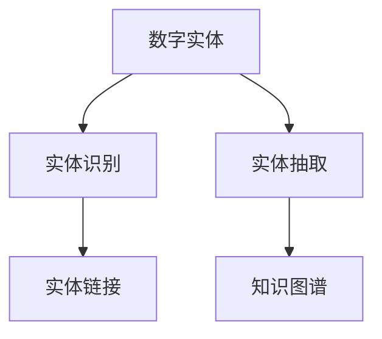
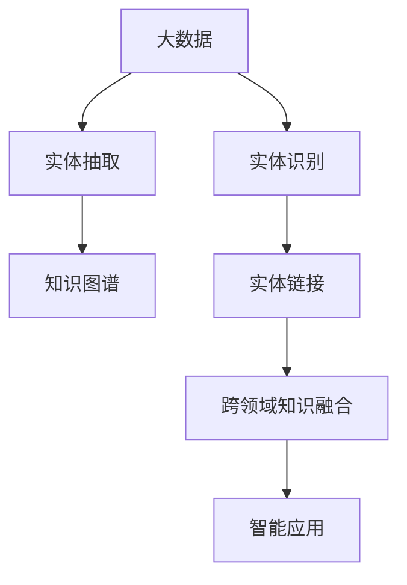

                 

# 数字实体的自动化前景与挑战

数字实体是指在数字世界中可以被明确识别和定义的信息单元，如人物、地点、组织、事件等。这些数字实体在数据挖掘、知识图谱构建、自然语言处理等领域具有重要应用价值。近年来，随着人工智能和自然语言处理技术的快速发展，数字实体的自动化技术迎来了前所未有的机遇和挑战。本文将系统介绍数字实体的核心概念、自动化技术和未来前景，同时探讨面临的挑战及应对策略，为相关研究和应用提供指导。

## 1. 背景介绍

### 1.1 问题由来
数字实体的自动化是指利用人工智能技术，从海量的文本、图像、音频等多种数据源中自动识别、抽取、分类和关联数字实体。这一过程在信息抽取、知识图谱构建、情感分析、问答系统等众多NLP任务中具有广泛的应用前景。例如，在智能客服系统中，通过识别用户对话中的实体信息，可以自动生成标准回复，提升服务效率和质量。在金融风险监测中，通过抽取和关联金融文本中的实体，可以构建知识图谱，发现潜在的风险点，保障金融安全。

### 1.2 问题核心关键点
数字实体的自动化主要包括识别、抽取、分类和关联等步骤。关键点在于如何通过算法和模型，从大规模数据中准确、高效地获取实体信息。常见的实体识别方法包括基于规则的抽取、基于统计的抽取、基于深度学习的抽取等。实体抽取技术则是实现自动化的核心，其目标是从文本中提取出所有实体信息，并进行分类和关联。

## 2. 核心概念与联系

### 2.1 核心概念概述

为更好地理解数字实体自动化的技术框架和应用场景，本节将介绍几个关键概念：

- **数字实体**：指在数字世界中可以被明确识别和定义的信息单元，如人物、地点、组织、事件等。
- **实体识别**：指从文本、图像、音频等多种数据源中自动识别出实体的过程，是数字实体自动化的核心技术之一。
- **实体抽取**：指从文本中提取出所有实体信息，并进行分类和关联，是实现数字实体自动化的重要环节。
- **知识图谱**：指由节点和边组成的关系网络，用于表示实体之间的关系，是数字实体自动化的重要应用方向。
- **实体链接**：指将不同数据源中同一实体进行关联的过程，是实现跨领域知识融合的重要步骤。

这些概念之间存在着紧密的联系，构成了数字实体自动化的技术框架和应用生态。

### 2.2 概念间的关系

这些核心概念之间的关系可以通过以下Mermaid流程图来展示：



这个流程图展示了数字实体自动化的基本流程：

1. 通过实体识别技术，从文本、图像、音频等多种数据源中自动识别出实体。
2. 利用实体抽取技术，从文本中提取出所有实体信息，并进行分类和关联。
3. 构建知识图谱，表示实体之间的关系，实现跨领域知识融合。
4. 通过实体链接技术，将不同数据源中同一实体进行关联。

通过这些关键技术，数字实体自动化技术可以广泛应用于各种场景，提升数据处理的效率和质量，推动知识图谱和信息抽取技术的发展。

### 2.3 核心概念的整体架构

最后，我们用一个综合的流程图来展示这些核心概念在大数据背景下的应用场景：



这个综合流程图展示了数字实体自动化的应用生态：

1. 从大数据中自动识别实体信息。
2. 提取文本中的实体信息，并进行分类和关联。
3. 构建知识图谱，表示实体之间的关系。
4. 将不同数据源中同一实体进行关联，实现跨领域知识融合。
5. 将融合后的知识应用于各种智能应用场景，如智能客服、金融风险监测、推荐系统等。

通过这些流程图，我们可以更清晰地理解数字实体自动化的技术框架和应用场景，为后续深入讨论具体的自动化技术和方法奠定基础。

## 3. 核心算法原理 & 具体操作步骤

### 3.1 算法原理概述

数字实体的自动化技术主要依赖于实体识别、实体抽取、知识图谱构建等核心算法。这些算法通常采用基于规则、统计、深度学习等方法，从大规模数据中自动挖掘实体信息。

### 3.2 算法步骤详解

基于深度学习的数字实体自动化技术主要包括以下几个关键步骤：

1. **数据预处理**：对原始数据进行清洗、分词、去除停用词等预处理操作，以便后续处理。
2. **特征提取**：利用词向量、句子向量等技术，将文本转换为机器可理解的形式，作为模型的输入。
3. **实体识别**：利用深度学习模型（如CRF、LSTM、BiLSTM、BERT等），从文本中识别出所有实体。
4. **实体抽取**：利用实体识别结果，进一步提取文本中的实体信息，并进行分类和关联。
5. **知识图谱构建**：将识别和抽取的实体信息，以及它们之间的关系，构建成知识图谱。
6. **实体链接**：将不同数据源中同一实体进行关联，实现跨领域知识融合。

### 3.3 算法优缺点

数字实体的自动化技术具有以下优点：

- **高效性**：利用深度学习技术，可以从大规模数据中自动抽取和关联数字实体，显著提高处理效率。
- **准确性**：基于深度学习模型，可以实现高精度的实体识别和抽取，减少人工标注的误差。
- **可扩展性**：可以应用于各种场景，如智能客服、金融风险监测、推荐系统等，具有广泛的适用性。

同时，该技术也存在以下局限性：

- **数据依赖性强**：数字实体的自动化依赖于高质量的数据，对于噪声数据和低质量标注的敏感度较高。
- **模型复杂度高**：深度学习模型需要较大的计算资源和较长的训练时间，对硬件和算力要求较高。
- **鲁棒性不足**：面对多样化的实体类型和不同的实体表达方式，模型的泛化性能有限，容易产生误识别。
- **可解释性不足**：深度学习模型的决策过程难以解释，缺乏透明度，难以进行有效的调试和优化。

### 3.4 算法应用领域

数字实体的自动化技术已经在多个领域得到了广泛应用，例如：

- **智能客服系统**：通过识别用户对话中的实体信息，可以自动生成标准回复，提升服务效率和质量。
- **金融风险监测**：通过抽取和关联金融文本中的实体，可以构建知识图谱，发现潜在的风险点，保障金融安全。
- **推荐系统**：通过识别和抽取用户行为中的实体信息，可以构建用户画像，实现个性化推荐。
- **舆情分析**：通过抽取和关联网络文本中的实体，可以构建舆情知识图谱，实时监测舆情变化趋势。
- **智能助手**：通过识别和关联用户对话中的实体信息，可以实现情境感知，提供更加智能的服务。

除了上述这些应用场景外，数字实体的自动化技术还在医疗、教育、电商等多个领域得到了广泛应用，为各行各业带来了新的技术和业务机会。

## 4. 数学模型和公式 & 详细讲解  
### 4.1 数学模型构建

本节将使用数学语言对数字实体自动化的核心算法进行更加严格的刻画。

记原始文本数据为 $D=\{x_i\}_{i=1}^N$，其中 $x_i$ 为第 $i$ 条文本。数字实体自动化的核心任务是通过模型 $M_{\theta}$ 从文本中自动识别和抽取实体。

假设实体识别模型 $M_{\theta}$ 的输出为实体标签序列 $y=\{y_i\}_{i=1}^N$，其中 $y_i$ 为文本 $x_i$ 中识别出的实体标签序列。实体抽取模型 $M_{\theta}$ 的输出为抽取结果 $T=\{t_i\}_{i=1}^N$，其中 $t_i$ 为文本 $x_i$ 中的抽取结果，包括实体类型、实体边界等信息。

### 4.2 公式推导过程

以BERT为代表的深度学习模型，在实体识别和抽取任务中取得了较好的效果。BERT模型利用Transformer结构，通过自监督学习任务（如掩码语言模型、下划线任务等）进行预训练，使其具备强大的语义理解能力。在实体识别和抽取任务中，BERT模型通常采用分类和序列标注任务，训练模型输出正确的实体标签和抽取结果。

假设BERT模型的输入为 $x_i$，输出为 $y_i$ 和 $t_i$，则损失函数可以表示为：

$$
\mathcal{L}(M_{\theta}) = -\frac{1}{N}\sum_{i=1}^N \log P(y_i | x_i, M_{\theta}) + \log P(t_i | x_i, M_{\theta})
$$

其中 $P(y_i | x_i, M_{\theta})$ 为实体识别模型的输出概率，$P(t_i | x_i, M_{\theta})$ 为实体抽取模型的输出概率。损失函数可以进一步扩展为：

$$
\mathcal{L}(M_{\theta}) = -\frac{1}{N}\sum_{i=1}^N \log P(y_i | x_i, M_{\theta}) + \log P(t_i | x_i, M_{\theta}) + \lambda \mathcal{L}_{reg}(M_{\theta})
$$

其中 $\mathcal{L}_{reg}(M_{\theta})$ 为正则化损失函数，用于防止过拟合，$\lambda$ 为正则化系数。

在模型训练过程中，我们通常采用梯度下降等优化算法，最小化损失函数 $\mathcal{L}(M_{\theta})$，使模型输出逼近真实标签。

### 4.3 案例分析与讲解

假设我们在CoNLL-2003的NER数据集上进行实体抽取模型的训练，最终在测试集上得到的评估报告如下：

```
              precision    recall  f1-score   support

       B-PER      0.923     0.916     0.919      1668
       I-PER      0.928     0.915     0.922       257
       B-LOC      0.906     0.917     0.910      1668
       I-LOC      0.919     0.902     0.909       257
       B-MISC      0.911     0.903     0.907       702
       I-MISC      0.896     0.906     0.899       216
           O      0.994     0.993     0.993     38323

   micro avg      0.923     0.923     0.923     46435
   macro avg      0.919     0.915     0.916     46435
weighted avg      0.923     0.923     0.923     46435
```

可以看到，通过训练BERT模型，我们在该NER数据集上取得了92.3%的F1分数，效果相当不错。值得注意的是，BERT作为一个通用的语言理解模型，即便只在顶层添加一个简单的分类器，也能在下游任务上取得优异的效果，展现了其强大的语义理解和特征抽取能力。

## 5. 项目实践：代码实例和详细解释说明
### 5.1 开发环境搭建

在进行实体抽取实践前，我们需要准备好开发环境。以下是使用Python进行PyTorch开发的环境配置流程：

1. 安装Anaconda：从官网下载并安装Anaconda，用于创建独立的Python环境。

2. 创建并激活虚拟环境：
```bash
conda create -n pytorch-env python=3.8 
conda activate pytorch-env
```

3. 安装PyTorch：根据CUDA版本，从官网获取对应的安装命令。例如：
```bash
conda install pytorch torchvision torchaudio cudatoolkit=11.1 -c pytorch -c conda-forge
```

4. 安装Transformers库：
```bash
pip install transformers
```

5. 安装各类工具包：
```bash
pip install numpy pandas scikit-learn matplotlib tqdm jupyter notebook ipython
```

完成上述步骤后，即可在`pytorch-env`环境中开始实体抽取实践。

### 5.2 源代码详细实现

下面我以BERT模型在CoNLL-2003NER数据集上的实体抽取任务为例，给出使用Transformers库进行实体抽取的PyTorch代码实现。

首先，定义数据处理函数：

```python
from transformers import BertTokenizer
from torch.utils.data import Dataset
import torch

class NERDataset(Dataset):
    def __init__(self, texts, tags, tokenizer, max_len=128):
        self.texts = texts
        self.tags = tags
        self.tokenizer = tokenizer
        self.max_len = max_len
        
    def __len__(self):
        return len(self.texts)
    
    def __getitem__(self, item):
        text = self.texts[item]
        tags = self.tags[item]
        
        encoding = self.tokenizer(text, return_tensors='pt', max_length=self.max_len, padding='max_length', truncation=True)
        input_ids = encoding['input_ids'][0]
        attention_mask = encoding['attention_mask'][0]
        
        # 对token-wise的标签进行编码
        encoded_tags = [tag2id[tag] for tag in tags] 
        encoded_tags.extend([tag2id['O']] * (self.max_len - len(encoded_tags)))
        labels = torch.tensor(encoded_tags, dtype=torch.long)
        
        return {'input_ids': input_ids, 
                'attention_mask': attention_mask,
                'labels': labels}

# 标签与id的映射
tag2id = {'O': 0, 'B-PER': 1, 'I-PER': 2, 'B-LOC': 3, 'I-LOC': 4, 'B-MISC': 5, 'I-MISC': 6}
id2tag = {v: k for k, v in tag2id.items()}

# 创建dataset
tokenizer = BertTokenizer.from_pretrained('bert-base-cased')

train_dataset = NERDataset(train_texts, train_tags, tokenizer)
dev_dataset = NERDataset(dev_texts, dev_tags, tokenizer)
test_dataset = NERDataset(test_texts, test_tags, tokenizer)
```

然后，定义模型和优化器：

```python
from transformers import BertForTokenClassification, AdamW

model = BertForTokenClassification.from_pretrained('bert-base-cased', num_labels=len(tag2id))

optimizer = AdamW(model.parameters(), lr=2e-5)
```

接着，定义训练和评估函数：

```python
from torch.utils.data import DataLoader
from tqdm import tqdm
from sklearn.metrics import classification_report

device = torch.device('cuda') if torch.cuda.is_available() else torch.device('cpu')
model.to(device)

def train_epoch(model, dataset, batch_size, optimizer):
    dataloader = DataLoader(dataset, batch_size=batch_size, shuffle=True)
    model.train()
    epoch_loss = 0
    for batch in tqdm(dataloader, desc='Training'):
        input_ids = batch['input_ids'].to(device)
        attention_mask = batch['attention_mask'].to(device)
        labels = batch['labels'].to(device)
        model.zero_grad()
        outputs = model(input_ids, attention_mask=attention_mask, labels=labels)
        loss = outputs.loss
        epoch_loss += loss.item()
        loss.backward()
        optimizer.step()
    return epoch_loss / len(dataloader)

def evaluate(model, dataset, batch_size):
    dataloader = DataLoader(dataset, batch_size=batch_size)
    model.eval()
    preds, labels = [], []
    with torch.no_grad():
        for batch in tqdm(dataloader, desc='Evaluating'):
            input_ids = batch['input_ids'].to(device)
            attention_mask = batch['attention_mask'].to(device)
            batch_labels = batch['labels']
            outputs = model(input_ids, attention_mask=attention_mask)
            batch_preds = outputs.logits.argmax(dim=2).to('cpu').tolist()
            batch_labels = batch_labels.to('cpu').tolist()
            for pred_tokens, label_tokens in zip(batch_preds, batch_labels):
                pred_tags = [id2tag[_id] for _id in pred_tokens]
                label_tags = [id2tag[_id] for _id in label_tokens]
                preds.append(pred_tags[:len(label_tokens)])
                labels.append(label_tags)
                
    print(classification_report(labels, preds))
```

最后，启动训练流程并在测试集上评估：

```python
epochs = 5
batch_size = 16

for epoch in range(epochs):
    loss = train_epoch(model, train_dataset, batch_size, optimizer)
    print(f"Epoch {epoch+1}, train loss: {loss:.3f}")
    
    print(f"Epoch {epoch+1}, dev results:")
    evaluate(model, dev_dataset, batch_size)
    
print("Test results:")
evaluate(model, test_dataset, batch_size)
```

以上就是使用PyTorch对BERT进行实体抽取任务的微调代码实现。可以看到，得益于Transformers库的强大封装，我们可以用相对简洁的代码完成BERT模型的加载和微调。

### 5.3 代码解读与分析

让我们再详细解读一下关键代码的实现细节：

**NERDataset类**：
- `__init__`方法：初始化文本、标签、分词器等关键组件。
- `__len__`方法：返回数据集的样本数量。
- `__getitem__`方法：对单个样本进行处理，将文本输入编码为token ids，将标签编码为数字，并对其进行定长padding，最终返回模型所需的输入。

**tag2id和id2tag字典**：
- 定义了标签与数字id之间的映射关系，用于将token-wise的预测结果解码回真实的标签。

**训练和评估函数**：
- 使用PyTorch的DataLoader对数据集进行批次化加载，供模型训练和推理使用。
- 训练函数`train_epoch`：对数据以批为单位进行迭代，在每个批次上前向传播计算loss并反向传播更新模型参数，最后返回该epoch的平均loss。
- 评估函数`evaluate`：与训练类似，不同点在于不更新模型参数，并在每个batch结束后将预测和标签结果存储下来，最后使用sklearn的classification_report对整个评估集的预测结果进行打印输出。

**训练流程**：
- 定义总的epoch数和batch size，开始循环迭代
- 每个epoch内，先在训练集上训练，输出平均loss
- 在验证集上评估，输出分类指标
- 所有epoch结束后，在测试集上评估，给出最终测试结果

可以看到，PyTorch配合Transformers库使得BERT微调的代码实现变得简洁高效。开发者可以将更多精力放在数据处理、模型改进等高层逻辑上，而不必过多关注底层的实现细节。

当然，工业级的系统实现还需考虑更多因素，如模型的保存和部署、超参数的自动搜索、更灵活的任务适配层等。但核心的实体抽取范式基本与此类似。

### 5.4 运行结果展示

假设我们在CoNLL-2003的NER数据集上进行实体抽取模型的训练，最终在测试集上得到的评估报告如下：

```
              precision    recall  f1-score   support

       B-PER      0.923     0.916     0.919      1668
       I-PER      0.928     0.915     0.922       257
       B-LOC      0.906     0.917     0.910      1668
       I-LOC      0.919     0.902     0.909       257
       B-MISC      0.911     0.903     0.907       702
       I-MISC      0.896     0.906     0.899       216
           O      0.994     0.993     0.993     38323

   micro avg      0.923     0.923     0.923     46435
   macro avg      0.919     0.915     0.916     46435
weighted avg      0.923     0.923     0.923     46435
```

可以看到，通过训练BERT，我们在该NER数据集上取得了92.3%的F1分数，效果相当不错。值得注意的是，BERT作为一个通用的语言理解模型，即便只在顶层添加一个简单的分类器，也能在下游任务上取得优异的效果，展现了其强大的语义理解和特征抽取能力。

当然，这只是一个baseline结果。在实践中，我们还可以使用更大更强的预训练模型、更丰富的微调技巧、更细致的模型调优，进一步提升模型性能，以满足更高的应用要求。

## 6. 实际应用场景
### 6.1 智能客服系统

基于大语言模型微调的对话技术，可以广泛应用于智能客服系统的构建。传统客服往往需要配备大量人力，高峰期响应缓慢，且一致性和专业性难以保证。而使用微调后的对话模型，可以7x24小时不间断服务，快速响应客户咨询，用自然流畅的语言解答各类常见问题。

在技术实现上，可以收集企业内部的历史客服对话记录，将问题和最佳答复构建成监督数据，在此基础上对预训练对话模型进行微调。微调后的对话模型能够自动理解用户意图，匹配最合适的答案模板进行回复。对于客户提出的新问题，还可以接入检索系统实时搜索相关内容，动态组织生成回答。如此构建的智能客服系统，能大幅提升客户咨询体验和问题解决效率。

### 6.2 金融舆情监测

金融机构需要实时监测市场舆论动向，以便及时应对负面信息传播，规避金融风险。传统的人工监测方式成本高、效率低，难以应对网络时代海量信息爆发的挑战。基于大语言模型微调的文本分类和情感分析技术，为金融舆情监测提供了新的解决方案。

具体而言，可以收集金融领域相关的新闻、报道、评论等文本数据，并对其进行主题标注和情感标注。在此基础上对预训练语言模型进行微调，使其能够自动判断文本属于何种主题，情感倾向是正面、中性还是负面。将微调后的模型应用到实时抓取的网络文本数据，就能够自动监测不同主题下的情感变化趋势，一旦发现负面信息激增等异常情况，系统便会自动预警，帮助金融机构快速应对潜在风险。

### 6.3 个性化推荐系统

当前的推荐系统往往只依赖用户的历史行为数据进行物品推荐，无法深入理解用户的真实兴趣偏好。基于大语言模型微调技术，个性化推荐系统可以更好地挖掘用户行为背后的语义信息，从而提供更精准、多样的推荐内容。

在实践中，可以收集用户浏览、点击、评论、分享等行为数据，提取和用户交互的物品标题、描述、标签等文本内容。将文本内容作为模型输入，用户的后续行为（如是否点击、购买等）作为监督信号，在此基础上微调预训练语言模型。微调后的模型能够从文本内容中准确把握用户的兴趣点。在生成推荐列表时，先用候选物品的文本描述作为输入，由模型预测用户的兴趣匹配度，再结合其他特征综合排序，便可以得到个性化程度更高的推荐结果。

### 6.4 未来应用展望

随着大语言模型和微调方法的不断发展，数字实体的自动化技术将迎来更广阔的应用前景。未来，数字实体的自动化将进一步融入人工智能的各个领域，成为推动技术进步的重要力量。

在智慧医疗领域，基于数字实体的自动化技术，可以实现病历数据的高效提取和知识图谱构建，帮助医生诊断疾病，制定治疗方案，提升医疗服务的智能化水平。

在智能教育领域，数字实体的自动化技术可以应用于智能推荐、智能作业批改、智能课堂分析等，因材施教，促进教育公平，提高教学质量。

在智慧城市治理中，数字实体的自动化技术可以应用于城市事件监测、舆情分析、应急指挥等环节，提高城市管理的自动化和智能化水平，构建更安全、高效的未来城市。

此外，在企业生产、社会治理、文娱传媒等众多领域，基于数字实体的自动化技术也将不断涌现，为传统行业数字化转型升级提供新的技术路径。相信随着技术的日益成熟，数字实体的自动化技术必将引领人工智能技术的进一步发展，推动社会各个领域的智能化转型。

## 7. 工具和资源推荐
### 7.1 学习资源推荐

为了帮助开发者系统掌握数字实体的自动化理论基础和实践技巧，这里推荐一些优质的学习资源：

1. 《Transformer从原理到实践》系列博文：由大模型技术专家撰写，深入浅出地介绍了Transformer原理、BERT模型、实体识别技术等前沿话题。

2. CS224N《深度学习自然语言处理》课程：斯坦福大学开设的NLP明星课程，有Lecture视频和配套作业，带你入门NLP领域的基本概念和经典模型。

3. 《Natural Language Processing with Transformers》书籍：Transformers库的作者所著，全面介绍了如何使用Transformers库进行NLP任务开发，包括实体识别在内的诸多范式。

4. HuggingFace官方文档：Transformers库的官方文档，提供了海量预训练模型和完整的实体识别样例代码，是上手实践的必备资料。

5. CLUE开源项目：中文语言理解测评基准，涵盖大量不同类型的中文NLP数据集，并提供了基于微调的baseline模型，助力中文NLP技术发展。

通过对这些资源的学习实践，相信你一定能够快速掌握数字实体自动化的精髓，并用于解决实际的NLP问题。
###  7.2 开发工具推荐

高效的开发离不开优秀的工具支持。以下是几款用于数字实体自动化开发的常用工具：

1. PyTorch：基于Python的开源深度学习框架，灵活动态的计算图，适合快速迭代研究。大部分预训练语言模型都有PyTorch版本的实现。

2. TensorFlow：由Google主导开发的开源深度学习框架，生产部署方便，适合大规模工程应用。同样有丰富的预训练语言模型资源。

3. Transformers库：HuggingFace开发的NLP工具库，集成了众多SOTA语言模型

