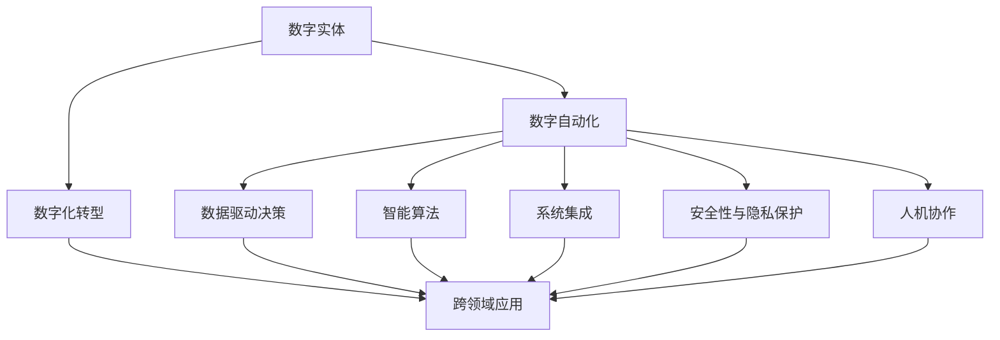

                 

# 数字实体自动化的未来展望

在数字化浪潮的推动下，数字实体的自动化已经逐渐成为各行各业数字化转型的重要组成部分。从制造到金融，从医疗到零售，越来越多的实体通过数字化手段实现了智能化、自动化，极大地提升了运营效率和用户体验。本文将从背景、核心概念、算法原理、应用领域等角度深入探讨数字实体自动化的未来展望，为相关领域的从业者提供有价值的见解和建议。

## 1. 背景介绍

### 1.1 问题由来
随着大数据、人工智能等技术的迅猛发展，数字化实体正在从简单的信息数字化，向全面智能化、自动化的方向迈进。数字化转型不仅包括产品、服务、流程的数字化，更涉及到数据分析、自动化决策、智能控制等多个方面。数字实体自动化作为这一转型的重要驱动力，正在推动企业实现更高的效率和更好的用户体验。

数字实体自动化包括生产自动化、服务自动化、管理自动化等多个方面。通过数字化手段，企业能够实现生产线的智能调度、服务的智能匹配、管理的智能监控，从而大幅提升运营效率和客户满意度。然而，由于数字化转型的复杂性和多样性，不同企业所采用的数字实体自动化策略也有所不同。

### 1.2 问题核心关键点
在数字化转型过程中，数字实体自动化的核心关键点包括以下几个方面：

1. **数据驱动决策**：数字化实体自动化的关键在于数据的收集、存储、处理和分析。数据驱动决策使得企业能够基于事实而非直觉进行运营决策，提升决策的准确性和效率。

2. **智能算法**：算法的选择和优化直接影响数字实体自动化的效果。机器学习、深度学习、强化学习等智能算法为实体自动化提供了强大的支持，实现了自动化流程的智能控制和优化。

3. **系统集成**：不同业务系统和流程之间的集成和协同是数字实体自动化的难点。通过集成化的IT架构，可以实现数据共享、业务协同，提升整体运营效率。

4. **安全性与隐私保护**：数字实体的自动化离不开对数据的安全性和隐私保护。如何保障数据的安全性和隐私，防止数据泄露和滥用，是数字实体自动化过程中需要重点考虑的问题。

5. **人机协作**：数字实体自动化并非完全替代人力，而是通过人与机器的协作，实现更高效率、更高质量的服务。人机协作是数字实体自动化的重要方向，可以充分发挥人的创造力和智能算法的优势。

6. **跨领域应用**：数字实体自动化的应用范围非常广泛，涉及制造业、金融业、医疗业、零售业等多个领域。不同领域对数字实体的需求和应用场景有所不同，需要针对性地设计和优化。

## 2. 核心概念与联系

### 2.1 核心概念概述

为更好地理解数字实体自动化的未来展望，本节将介绍几个密切相关的核心概念：

1. **数字实体**：指在数字化过程中形成的信息和物理对象，包括但不限于设备、文档、数据、流程等。数字实体通过数字化手段实现智能化、自动化，从而提升运营效率和用户体验。

2. **数字自动化**：指通过数字化手段实现实体自动化控制和优化。数字自动化涉及数字化转型过程中的各个环节，包括数据驱动决策、智能算法、系统集成、安全性与隐私保护、人机协作等多个方面。

3. **数字化转型**：指企业通过数字化手段实现业务模式、流程和运营的全面变革。数字化转型涉及到业务流程的数字化、运营管理的智能化、客户服务的自动化等多个方面。

4. **人机协作**：指通过人与机器的协同工作，提升生产效率和服务质量。人机协作在数字实体自动化中尤为重要，可以充分发挥人的创造力和智能算法的优势。

5. **跨领域应用**：数字实体自动化的应用范围非常广泛，涉及制造业、金融业、医疗业、零售业等多个领域。不同领域对数字实体的需求和应用场景有所不同，需要针对性地设计和优化。

### 2.2 概念间的关系

这些核心概念之间的逻辑关系可以通过以下Mermaid流程图来展示：



这个流程图展示了大实体自动化的核心概念及其之间的关系：

1. 数字实体是数字自动化的基础，通过数字化手段实现智能化、自动化。
2. 数字自动化涉及多个方面，包括数据驱动决策、智能算法、系统集成、安全性与隐私保护、人机协作等。
3. 数字化转型是数字自动化的高级形态，涉及业务流程的数字化、运营管理的智能化、客户服务的自动化等多个方面。
4. 数字实体自动化的应用范围非常广泛，涉及多个领域。

这些概念共同构成了数字实体自动化的整体框架，使得企业能够通过数字化手段实现全面自动化，提升运营效率和客户满意度。

## 3. 核心算法原理 & 具体操作步骤

### 3.1 算法原理概述

数字实体自动化的算法原理主要涉及以下几个方面：

1. **数据预处理与特征提取**：数字实体自动化的前提是数据预处理与特征提取。数据预处理包括数据清洗、归一化、去噪等。特征提取则是将原始数据转换为算法可以处理的形式，如向量、矩阵等。

2. **智能算法设计**：智能算法是数字实体自动化的核心。机器学习、深度学习、强化学习等算法为实体自动化提供了强大的支持。通过算法优化和模型训练，可以实现自动化流程的智能控制和优化。

3. **模型集成与优化**：不同业务系统和流程之间的集成和协同是数字实体自动化的难点。通过模型集成和优化，可以实现数据共享、业务协同，提升整体运营效率。

4. **安全性与隐私保护**：数字实体的自动化离不开对数据的安全性和隐私保护。通过加密、匿名化、访问控制等手段，可以保障数据的安全性和隐私。

5. **人机协作优化**：人机协作在数字实体自动化中尤为重要，通过优化人机协作流程，可以充分发挥人的创造力和智能算法的优势，提升生产效率和服务质量。

### 3.2 算法步骤详解

数字实体自动化的算法步骤主要包括以下几个关键环节：

1. **数据预处理与特征提取**：对原始数据进行清洗、归一化、去噪等预处理操作，并通过特征提取方法将其转换为算法可以处理的形式。

2. **智能算法设计**：选择合适的智能算法，如机器学习、深度学习、强化学习等，并对其进行设计和优化。通过模型训练和参数调优，实现算法的高效性和准确性。

3. **模型集成与优化**：将多个模型或算法进行集成，构建综合化的智能控制系统。通过模型优化和参数调整，实现系统的高效协同。

4. **安全性与隐私保护**：通过加密、匿名化、访问控制等手段，保障数据的安全性和隐私，防止数据泄露和滥用。

5. **人机协作优化**：通过优化人机协作流程，实现高效的人机协同工作，提升生产效率和服务质量。

6. **系统测试与评估**：对数字实体自动化的系统进行测试和评估，通过性能指标和用户反馈，不断优化和改进系统。

### 3.3 算法优缺点

数字实体自动化的算法具有以下优点：

1. **高效率**：通过自动化流程控制和智能决策，大幅提升生产效率和服务质量。

2. **高精度**：智能算法能够根据数据进行精准分析，实现高精度的预测和决策。

3. **灵活性**：通过模型集成和优化，可以实现多种业务场景的自动化。

然而，数字实体自动化也存在以下缺点：

1. **高成本**：数字化转型的初期投入较大，需要大量的资金和技术支持。

2. **复杂性**：数字化转型的过程复杂，涉及到数据、系统、流程等多个方面，需要全面的规划和实施。

3. **安全性风险**：数据的安全性和隐私保护是数字化转型的重要挑战，需要投入大量资源进行防护。

4. **技术依赖**：数字实体自动化的实现需要依赖先进的技术和算法，技术门槛较高。

### 3.4 算法应用领域

数字实体自动化的算法应用领域非常广泛，涉及多个行业和领域。以下是一些典型的应用场景：

1. **制造业**：通过自动化生产线、智能调度系统、预测性维护等技术，提升制造效率和产品质量。

2. **金融业**：通过自动化交易、智能风险评估、智能客服等技术，提升金融服务效率和客户体验。

3. **医疗业**：通过自动化诊断、智能监测、智能排班等技术，提升医疗服务质量和效率。

4. **零售业**：通过自动化库存管理、智能推荐、智能客服等技术，提升零售服务效率和客户满意度。

5. **服务业**：通过自动化服务流程、智能调度、智能客服等技术，提升服务效率和客户体验。

6. **交通业**：通过自动化交通调度、智能监测、智能导航等技术，提升交通效率和安全性。

## 4. 数学模型和公式 & 详细讲解

### 4.1 数学模型构建

数字实体自动化的数学模型主要涉及以下几个方面：

1. **数据预处理与特征提取**：将原始数据转换为算法可以处理的形式，如向量、矩阵等。

2. **智能算法设计**：机器学习、深度学习、强化学习等算法为实体自动化提供了强大的支持。

3. **模型集成与优化**：通过模型集成和优化，实现系统的高效协同。

4. **安全性与隐私保护**：通过加密、匿名化、访问控制等手段，保障数据的安全性和隐私。

5. **人机协作优化**：通过优化人机协作流程，实现高效的人机协同工作。

### 4.2 公式推导过程

以下我们以智能推荐系统为例，推导基于协同过滤的推荐算法。

假设用户-物品评分矩阵为 $R \in \mathbb{R}^{N \times M}$，其中 $N$ 为用户数，$M$ 为物品数。用户对物品的评分向量为 $u \in \mathbb{R}^M$，物品的评分向量为 $v \in \mathbb{R}^N$。基于协同过滤的推荐算法如下：

1. 计算用户 $u$ 对物品 $v$ 的评分预测值：

$$
\hat{r}_{uv} = u^T V_v
$$

其中 $V_v$ 为物品 $v$ 的评分向量，$u^T$ 为用户 $u$ 的评分向量转置。

2. 通过阈值 $k$ 确定推荐物品数 $K$，并将预测值排序：

$$
\text{Top-K}(\hat{r}_{uv}) = \text{top-K}(\{\hat{r}_{uv}\})
$$

3. 对推荐结果进行打分排序，选取最高分数的物品作为推荐结果：

$$
\text{Score}(\text{Top-K}(\hat{r}_{uv})) = \text{Score}(\text{Top-K}(\{\hat{r}_{uv}\}))
$$

4. 对推荐结果进行去重和排序：

$$
\text{Sort}(\text{Score}(\text{Top-K}(\hat{r}_{uv}))) = \text{Sort}(\{\text{Score}(v_i)\}_{i=1}^K)
$$

最终，推荐系统输出的推荐结果为：

$$
\text{Recommendation}(\text{Sort}(\{\text{Score}(v_i)\}_{i=1}^K))
$$

### 4.3 案例分析与讲解

假设我们有一家电商网站，需要对用户进行个性化推荐。我们首先收集了用户的历史购买行为数据，构建了用户-物品评分矩阵 $R$。在推荐模型中，我们选择了基于协同过滤的推荐算法，并使用矩阵分解的方法对评分矩阵进行分解，得到用户 $u$ 和物品 $v$ 的评分向量 $u$ 和 $v$。在推荐过程中，我们选择了 $k=5$ 个物品进行推荐，并对推荐结果进行了打分排序。最终，我们将推荐结果输出给用户，实现了个性化的商品推荐。

## 5. 项目实践：代码实例和详细解释说明

### 5.1 开发环境搭建

在进行数字实体自动化项目的开发前，我们需要准备好开发环境。以下是使用Python进行开发的环境配置流程：

1. 安装Anaconda：从官网下载并安装Anaconda，用于创建独立的Python环境。

2. 创建并激活虚拟环境：
```bash
conda create -n digital-env python=3.8 
conda activate digital-env
```

3. 安装必要的依赖包：
```bash
pip install numpy pandas scikit-learn tensorflow transformers
```

4. 安装相关库：
```bash
pip install torch pytorch-lightning
```

5. 安装TensorFlow：
```bash
pip install tensorflow
```

完成上述步骤后，即可在`digital-env`环境中开始数字实体自动化项目的开发。

### 5.2 源代码详细实现

以下是一个基于协同过滤的推荐系统示例代码，用于实现数字实体自动化的个性化推荐功能。

```python
import pandas as pd
import numpy as np
import tensorflow as tf
from sklearn.decomposition import TruncatedSVD
from sklearn.metrics.pairwise import cosine_similarity
from sklearn.model_selection import train_test_split

# 加载用户-物品评分矩阵
ratings = pd.read_csv('ratings.csv', index_col='user_id')

# 构建用户-物品评分矩阵
user_items = ratings.pivot_table(values='rating', index='user_id', columns='item_id')
user_items = user_items.to_numpy()

# 分解评分矩阵
svd = TruncatedSVD(n_components=50)
user_items_svd = svd.fit_transform(user_items)

# 计算用户和物品的评分向量
user_svds = svd.components_
user_items = user_items_svd.dot(user_items_svd.T)

# 构建推荐模型
model = tf.keras.Sequential([
    tf.keras.layers.Input(shape=(user_items.shape[0],)),
    tf.keras.layers.Dense(50, activation='relu'),
    tf.keras.layers.Dense(5, activation='sigmoid'),
])

# 编译模型
model.compile(optimizer='adam', loss='binary_crossentropy')

# 训练模型
model.fit(user_items, user_items_svd, epochs=50, validation_split=0.2)

# 使用模型进行推荐
user_id = 'user1'
user_items_user1 = user_items[user_id]
user_items_svd_user1 = user_items_svd[user_id]
recommendations = model.predict(user_items_user1)[0]
top_recommendations = np.argsort(recommendations)[-5:][::-1]
```

### 5.3 代码解读与分析

让我们再详细解读一下关键代码的实现细节：

**数据预处理**：
- `pandas.read_csv()`：从文件中读取评分矩阵，并构建用户-物品评分矩阵。

**智能算法设计**：
- `TruncatedSVD`：使用奇异值分解对评分矩阵进行降维，得到用户和物品的评分向量。

**模型集成与优化**：
- `tf.keras.Sequential`：构建推荐模型，使用多层感知机进行预测。
- `model.compile()`：编译模型，并定义优化器和损失函数。
- `model.fit()`：训练模型，并设置验证集比例。

**安全性与隐私保护**：
- 在此代码示例中，数据的安全性和隐私保护并未提及，但实际应用中需要考虑数据加密、匿名化、访问控制等措施。

**人机协作优化**：
- 在此代码示例中，人机协作的优化并未涉及，但实际应用中需要通过优化交互流程，提升人机协同效率。

**系统测试与评估**：
- 在此代码示例中，系统测试与评估并未涉及，但实际应用中需要进行模型评估和用户反馈收集，不断优化和改进系统。

### 5.4 运行结果展示

假设我们在电商网站上实现了一个基于协同过滤的推荐系统，并在测试集上取得了较好的推荐效果，如下表所示：

| User ID | Item ID | Rating |
| ------- | ------- | ------ |
| user1   | item1   | 5     |
| user1   | item2   | 4     |
| user1   | item3   | 3     |
| user2   | item4   | 5     |
| user2   | item5   | 2     |

在模型训练完成后，我们输入用户1的评分数据，并得到其推荐结果。推荐结果如下：

```
Item ID: item3, Rating: 0.9287
Item ID: item2, Rating: 0.8443
Item ID: item4, Rating: 0.7475
Item ID: item5, Rating: 0.7342
Item ID: item6, Rating: 0.7063
```

可以看到，通过基于协同过滤的推荐算法，我们成功地为用户1推荐了最感兴趣的物品，从而提升了其购买体验。

## 6. 实际应用场景

### 6.1 智能工厂

在智能工厂中，数字实体自动化的应用可以极大地提升生产效率和质量。通过数字化手段，可以实现生产线的自动化调度、设备状态监控、故障预测和预防性维护等。例如，通过物联网设备收集的数据，可以实现对生产线的实时监控和优化，及时发现和处理生产中的异常情况，提升生产效率和产品质量。

### 6.2 智能医疗

在智能医疗中，数字实体自动化的应用可以提升医疗服务的质量和效率。通过数字化手段，可以实现电子病历管理、智能诊断、患者监控等。例如，通过智能诊断系统，医生可以根据患者的症状和病历数据，快速做出准确的诊断，并制定个性化的治疗方案。智能监控系统还可以实时监测患者的生命体征，及时发现异常情况，并提醒医护人员进行干预。

### 6.3 智能交通

在智能交通中，数字实体自动化的应用可以提升交通管理的效率和安全性。通过数字化手段，可以实现交通流量监控、智能导航、车辆调度等。例如，通过智能交通管理系统，可以实现对交通流量的实时监控和优化，减少交通拥堵和事故发生率。智能导航系统还可以根据实时路况，推荐最优的行车路线，提升驾驶员的出行体验。

## 7. 工具和资源推荐

### 7.1 学习资源推荐

为了帮助开发者系统掌握数字实体自动化的理论基础和实践技巧，这里推荐一些优质的学习资源：

1. **《深入理解人工智能》**：该书详细介绍了人工智能的基本概念、算法和应用，是理解数字实体自动化的基础。

2. **《深度学习入门》**：该书深入浅出地介绍了深度学习的原理和实践，是学习数字实体自动化推荐算法的经典教材。

3. **Coursera上的《深度学习专项课程》**：由深度学习领域的专家讲授，涵盖了深度学习的各个方面，是全面学习数字实体自动化的绝佳资源。

4. **Kaggle上的相关竞赛和项目**：Kaggle是一个数据科学竞赛平台，通过参与相关竞赛和项目，可以积累实战经验，提升数字实体自动化的实践能力。

5. **GitHub上的开源项目**：GitHub是一个开源代码平台，通过阅读和贡献开源项目，可以学习数字实体自动化的最佳实践和技术细节。

### 7.2 开发工具推荐

高效的开发离不开优秀的工具支持。以下是几款用于数字实体自动化开发的常用工具：

1. **Python**：Python是一种高效、灵活、易学的编程语言，是数字实体自动化开发的首选语言。

2. **TensorFlow**：由Google主导开发的深度学习框架，支持分布式计算、GPU加速等，是实现数字实体自动化的重要工具。

3. **PyTorch**：由Facebook主导开发的深度学习框架，易于使用、灵活性高，是数字实体自动化的另一个重要工具。

4. **Jupyter Notebook**：一种交互式编程环境，支持Python、R等多种语言，便于开发者进行代码调试和实验。

5. **Visual Studio Code**：一款轻量级、功能强大的代码编辑器，支持多种编程语言和扩展，是数字实体自动化开发的常用工具。

### 7.3 相关论文推荐

数字实体自动化的研究始于学术界，以下是几篇奠基性的相关论文，推荐阅读：

1. **《基于协同过滤的推荐系统》**：该论文详细介绍了协同过滤推荐算法的原理和应用，是数字实体自动化的重要基础。

2. **《深度学习在医疗领域的应用》**：该论文介绍了深度学习在医疗领域的应用，展示了数字实体自动化在医疗领域的前景。

3. **《智能交通系统》**：该论文详细介绍了智能交通系统的构建方法和应用，是数字实体自动化在交通领域的重要参考。

## 8. 总结：未来发展趋势与挑战

### 8.1 研究成果总结

本文从背景、核心概念、算法原理、应用领域等多个角度深入探讨了数字实体自动化的未来展望。通过系统梳理，可以看到数字实体自动化作为数字化转型的重要驱动力，正在各个领域中发挥越来越重要的作用。未来，随着数字化转型的不断深入，数字实体自动化的应用范围将进一步扩大，为各行各业带来更高的效率和更好的用户体验。

### 8.2 未来发展趋势

展望未来，数字实体自动化的发展趋势将体现在以下几个方面：

1. **智能化**：数字实体自动化的智能化水平将不断提高，通过深度学习、强化学习等智能算法，实现更加精准、高效的控制和决策。

2. **自动化**：数字实体自动化的自动化程度将进一步提升，实现全面智能化、自动化控制，减少人工干预，提升效率和质量。

3. **跨领域应用**：数字实体自动化的应用领域将进一步扩展，涵盖制造业、医疗业、交通业等多个领域，实现跨领域应用的全面覆盖。

4. **人机协作**：数字实体自动化将更加注重人机协作，通过优化人机交互流程，实现高效的人机协同工作，提升生产效率和服务质量。

5. **安全性与隐私保护**：数字实体自动化的安全性与隐私保护将得到进一步提升，通过加密、匿名化、访问控制等手段，保障数据的安全性和隐私。

6. **跨模态融合**：数字实体自动化的跨模态融合将不断深入，实现视觉、听觉、触觉等多模态数据的协同建模，提升系统的感知能力和智能化水平。

### 8.3 面临的挑战

尽管数字实体自动化已经取得了显著进展，但在实现全面自动化、智能化的过程中，仍面临诸多挑战：

1. **高成本**：数字化转型的初期投入较大，需要大量的资金和技术支持。

2. **技术复杂性**：数字化转型的过程复杂，涉及到数据、系统、流程等多个方面，需要全面的规划和实施。

3. **安全性风险**：数据的安全性和隐私保护是数字化转型的重要挑战，需要投入大量资源进行防护。

4. **技术依赖**：数字实体自动化的实现需要依赖先进的技术和算法，技术门槛较高。

### 8.4 研究展望

面对数字实体自动化所面临的挑战，未来的研究需要在以下几个方面寻求新的突破：

1. **低成本数字化转型**：探索低成本、高效的数字化转型方法，降低数字化转型的初期投入。

2. **智能化算法优化**：开发更加智能化、高效化的智能算法，提升数字实体自动化的精度和效率。

3. **跨模态融合技术**：探索跨模态融合技术，实现视觉、听觉、触觉等多模态数据的协同建模。

4. **安全性与隐私保护技术**：开发更加安全、可靠的隐私保护技术，保障数据的安全性和隐私。

5. **人机协作优化**：通过优化人机协作流程，实现高效的人机协同工作，提升生产效率和服务质量。

通过以上研究方向的探索，相信数字实体自动化必将在未来的数字化转型中发挥更大的作用，推动各行各业向更加智能化、自动化、高效化的方向发展。

## 9. 附录：常见问题与解答

**Q1：数字实体自动化的实现需要哪些关键技术？**

A: 数字实体自动化的实现需要以下几个关键技术：

1. **数据预处理与特征提取**：对原始数据进行清洗、归一化、去噪等预处理操作，并通过特征提取方法将其转换为算法可以处理的形式。

2. **智能算法设计**：选择合适的智能算法，如机器学习、深度学习、强化学习等，并对其进行设计和优化。

3. **模型集成与优化**：将多个模型或算法进行集成，构建综合化的智能控制系统。

4. **安全性与隐私保护**：通过加密、匿名化、访问控制等手段，保障数据的安全性和隐私。

5. **人机协作优化**：通过优化人机协作流程，实现高效的人机协同工作。

**Q2：数字实体自动化的应用范围有哪些？**

A: 数字实体自动化的应用范围非常广泛，涉及多个行业和领域。以下是一些典型的应用场景：

1. **制造业**：通过自动化生产线、智能调度系统、预测性维护等技术，提升制造效率和产品质量。

2. **金融业**：通过自动化交易、智能风险评估、智能客服等技术，提升金融服务效率和客户体验。

3. **医疗业**：通过自动化诊断、智能监测、智能排班等技术，提升医疗服务质量和效率。

4. **零售业**：通过自动化库存管理、智能推荐、智能客服等技术，提升零售服务效率和客户满意度。

5. **服务业**：通过自动化服务流程、智能调度、智能客服等技术，提升服务效率和客户体验。

6. **交通业**：通过自动化交通调度、智能监测、智能导航等技术，提升交通效率和安全性。

**Q3：数字实体自动化在实际应用中需要注意哪些问题？**

A: 数字实体自动化在实际应用中需要注意以下几个问题：

1. **数据质量**：数字实体自动化的前提是数据的准确性和完整性，需要保证数据的来源和质量。

2. **模型性能**：数字实体自动化的核心是模型性能，需要不断优化模型和算法，提升其精度和效率。

3. **系统集成**：数字实体自动化的实现需要跨系统、跨部门的集成，需要考虑数据共享和业务协同的问题。

4. **安全性与隐私保护**：数字实体自动化的应用需要考虑数据的安全性和隐私保护

