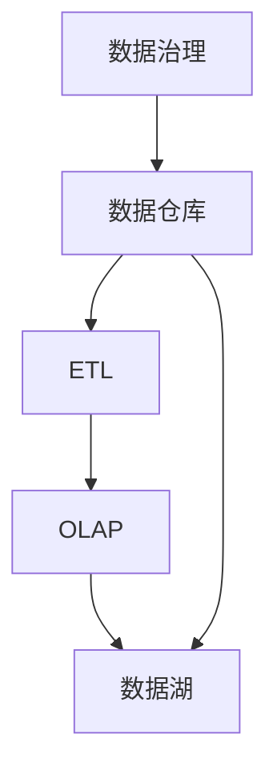

                 

# 数据仓库 原理与代码实例讲解

> 关键词：数据仓库、ETL过程、OLAP、数据湖、数据治理

## 1. 背景介绍

在当今数字化时代，数据已经成为企业决策和运营的核心驱动力。然而，海量数据分散在不同的业务系统中，需要一种机制来集中管理，高效存储，便于分析和应用。数据仓库（Data Warehouse, 简称DW）正是为了解决这一问题而诞生的一种技术手段。

### 1.1 问题由来

随着企业信息化程度的提高，各部门独立运行的信息系统（如ERP、CRM、HR、供应链系统等）产生了大量结构化数据。这些数据格式不统一、存储分散，使得数据集成、查询和分析变得非常困难。企业在业务决策和运营优化中常常因为数据孤立和碎片化，导致效率低下、决策误导，甚至造成损失。

### 1.2 问题核心关键点

1. **数据孤岛**：数据分散在不同的系统中，没有集中管理。
2. **数据一致性**：不同系统中的数据格式和标准不一致，导致数据整合时产生冲突。
3. **数据分析**：缺乏统一的分析工具和平台，难以高效、准确地进行数据分析。
4. **数据安全**：不同系统中的数据分散管理，数据安全和隐私保护存在风险。

### 1.3 问题研究意义

通过建立数据仓库，企业可以：
1. **统一数据管理**：集中存储和管理分散在各个业务系统中的数据。
2. **提高数据质量**：通过数据清洗和校验，保证数据的准确性和一致性。
3. **支持决策分析**：提供高效、一致的数据分析和报告工具。
4. **加强数据安全**：统一的数据管理和访问控制机制，增强数据的安全性和隐私保护。

数据仓库的建设不仅能提升企业的信息化水平，还能为业务决策提供坚实的支持和保障，是企业数字化转型的重要基础。

## 2. 核心概念与联系

### 2.1 核心概念概述

为了更好地理解数据仓库的技术体系和实现方法，下面将介绍几个核心概念及其相互关系。

- **数据仓库（Data Warehouse）**：一个集中、统一的存储系统，用于存储和管理企业的历史和当前业务数据。
- **ETL（Extract, Transform, Load）**：数据仓库构建过程中，从不同源系统抽取数据、转换格式、加载到数据仓库中的过程。
- **OLAP（Online Analytical Processing）**：一种多维数据分析技术，用于高效支持复杂数据分析和报告。
- **数据湖（Data Lake）**：一个更大的数据存储概念，可以容纳包括结构化数据、半结构化数据和非结构化数据在内的各种类型的数据。
- **数据治理（Data Governance）**：确保数据的质量、安全、完整性和一致性的管理和控制机制。

这些核心概念之间的关系可以通过以下Mermaid流程图来展示：



这个流程图展示了数据仓库从数据抽取、转换、加载到多维数据分析，再到数据湖构建和数据治理的整个流程。

### 2.2 概念间的关系

1. **数据仓库与ETL**：数据仓库的数据来源主要是通过ETL过程从业务系统中抽取、转换和加载数据。
2. **数据仓库与OLAP**：数据仓库建立之后，可以使用OLAP技术进行多维数据分析和报告。
3. **数据仓库与数据湖**：数据湖是数据仓库的扩展，可以容纳更多的数据类型和数据量。
4. **数据仓库与数据治理**：数据治理是数据仓库的保障，确保数据的质量、安全、完整性和一致性。

这些概念共同构成了数据仓库的完整生态系统，是实现企业数据集中管理和高效应用的关键组件。

## 3. 核心算法原理 & 具体操作步骤

### 3.1 算法原理概述

数据仓库的构建主要包括以下步骤：
1. **数据抽取**：从不同的业务系统中提取数据。
2. **数据转换**：对提取的数据进行清洗、校验和格式转换，确保数据的一致性和质量。
3. **数据加载**：将转换后的数据加载到数据仓库中。
4. **数据存储和管理**：在数据仓库中建立稳定的数据存储结构，便于查询和分析。
5. **数据分析和报告**：使用OLAP等技术进行高效的多维数据分析和报告。

### 3.2 算法步骤详解

**Step 1: 数据抽取**
- 使用ETL工具（如Talend、Informatica、Sqoop等）从各个业务系统中抽取数据。
- 确定数据抽取的逻辑和规则，确保数据的完整性和准确性。
- 建立数据抽取的任务和作业，自动执行抽取过程。

**Step 2: 数据转换**
- 对抽取的数据进行清洗和校验，去除重复、缺失、异常值等。
- 根据业务需求进行数据格式转换，如从JSON格式转换为CSV或SQL格式。
- 使用ETL工具内置的转换组件，或者编写自定义脚本进行数据转换。

**Step 3: 数据加载**
- 将转换后的数据加载到数据仓库中。
- 使用ETL工具内置的加载组件，或者编写SQL脚本进行数据加载。
- 设置数据加载的规则和触发条件，确保数据加载的自动性和及时性。

**Step 4: 数据存储和管理**
- 在数据仓库中建立稳定的数据存储结构，如表结构、维度表等。
- 使用SQL或数据仓库工具（如Apache Hive、Apache HBase等）进行数据存储和管理。
- 设置数据仓库的访问权限和访问控制机制，确保数据的安全性和隐私保护。

**Step 5: 数据分析和报告**
- 使用OLAP工具（如Apache Drill、Tableau、Power BI等）进行多维数据分析。
- 定义数据模型和维度，进行数据汇总、聚合和计算。
- 生成数据报表和可视化图表，支持业务决策和分析。

### 3.3 算法优缺点

数据仓库的构建具有以下优点：
1. **数据集中化管理**：集中存储和管理分散在各个业务系统中的数据。
2. **数据一致性和质量**：通过ETL过程进行数据清洗和校验，确保数据的准确性和一致性。
3. **支持多维分析**：使用OLAP技术进行高效、灵活的多维数据分析。
4. **统一数据访问**：提供统一的访问接口，便于数据查询和分析。

同时，数据仓库的构建也存在一些局限性：
1. **数据延迟**：数据仓库需要定期从各个业务系统抽取数据，存在一定的时间延迟。
2. **系统复杂性**：数据仓库的构建和维护需要复杂的ETL和OLAP系统。
3. **成本高昂**：数据仓库的建设和维护需要高昂的成本和技术投入。

### 3.4 算法应用领域

数据仓库技术广泛应用于各个行业，如金融、电信、零售、医疗、制造等。其主要应用领域包括：

1. **决策支持系统**：支持高层管理决策，提供全面的数据支持和分析。
2. **客户关系管理**：通过分析客户数据，提升客户满意度和忠诚度。
3. **供应链管理**：优化供应链流程，提高供应链效率和响应速度。
4. **财务报告**：生成财务报表，支持财务分析和决策。
5. **营销分析**：分析市场数据，优化营销策略和投放效果。
6. **人力资源管理**：通过分析员工数据，优化人力资源配置和招聘。

数据仓库技术在企业的信息化建设中发挥着至关重要的作用，是企业数字化转型的重要基础设施。

## 4. 数学模型和公式 & 详细讲解 & 举例说明

### 4.1 数学模型构建

假设企业有n个业务系统，每个系统产生m个数据表，数据仓库的结构可以表示为一个n×m的矩阵：

$$
A = \begin{bmatrix}
A_1 & A_2 & \cdots & A_m \\
B_1 & B_2 & \cdots & B_m \\
\vdots & \vdots & \ddots & \vdots \\
N_1 & N_2 & \cdots & N_m
\end{bmatrix}
$$

其中，$A_i$表示第i个业务系统的第j个数据表。

### 4.2 公式推导过程

数据仓库的数据抽取、转换和加载过程可以表示为：

$$
\begin{aligned}
A &= \text{ETL}(B, C, D, \ldots) \\
B &= \text{ETL}(E, F, G, \ldots) \\
C &= \text{ETL}(H, I, J, \ldots) \\
D &= \text{ETL}(K, L, M, \ldots) \\
&\vdots
\end{aligned}
$$

其中，$B, C, D, \ldots$表示从不同业务系统抽取、转换和加载数据的过程。

数据仓库的多维数据分析过程可以表示为：

$$
\begin{aligned}
\text{OLAP} &= \text{Dimension} + \text{Fact} \\
&= \text{Measure + Dim + Dim + Dim + Dim + Dim} \\
&= \text{Measure + Dim}_1 + \text{Dim}_2 + \text{Dim}_3 + \text{Dim}_4 + \text{Dim}_5
\end{aligned}
$$

其中，$\text{Measure}$表示业务度量，$\text{Dim}_1, \text{Dim}_2, \text{Dim}_3, \text{Dim}_4, \text{Dim}_5$表示多维数据中的各个维度。

### 4.3 案例分析与讲解

假设某电商企业的销售数据存储在不同的系统中，如订单系统、库存系统、客户系统等。使用数据仓库构建如下：

1. **数据抽取**：使用ETL工具从订单系统、库存系统、客户系统中抽取数据。
2. **数据转换**：对抽取的数据进行清洗和校验，去除重复、缺失、异常值等。
3. **数据加载**：将转换后的数据加载到数据仓库中。
4. **数据存储和管理**：在数据仓库中建立稳定的数据存储结构，如订单表、库存表、客户表等。
5. **数据分析和报告**：使用OLAP工具进行多维数据分析，生成销售报表和可视化图表。

通过数据仓库的建设，电商企业可以实现：
1. **统一订单数据**：将不同系统中的订单数据集中存储和管理。
2. **分析销售趋势**：通过多维数据分析，了解销售趋势和客户行为。
3. **优化库存管理**：通过分析库存数据，优化库存管理，减少库存积压。
4. **提升客户服务**：通过分析客户数据，提升客户满意度和忠诚度。

## 5. 项目实践：代码实例和详细解释说明

### 5.1 开发环境搭建

在进行数据仓库项目实践前，我们需要准备好开发环境。以下是使用Python进行Hive开发的环境配置流程：

1. 安装Hadoop：从官网下载并安装Hadoop，并配置好环境变量。
2. 安装Hive：在Hadoop环境下安装Hive，并启动Hive服务。
3. 安装Python：使用pip安装Python，并下载Hive相关的Python库，如pyhive、pydoop等。
4. 设置Python环境：使用conda或virtualenv创建Python虚拟环境。
5. 安装依赖库：安装必要的依赖库，如numpy、pandas、pydoop等。

完成上述步骤后，即可在Python虚拟环境中开始数据仓库的实践。

### 5.2 源代码详细实现

这里我们以数据仓库中的数据抽取和转换为例，使用Hive进行Python代码实现。

首先，定义数据源和目标表：

```python
from pyhive import hive
import os

# 连接Hive
hive_conn = hive.Connection(host='hive-host', port=10000, user='hive-user', password='hive-password')
hive_conn.connect()

# 数据源
source_table = hive_conn.create_table("sales_data", columns=["id", "amount", "date"])

# 数据目标表
target_table = hive_conn.create_table("clean_sales_data", columns=["id", "amount", "date"])
```

然后，编写数据抽取和转换的Python代码：

```python
# 数据抽取
source_data = hive_conn.read_table("sales_data")

# 数据转换
clean_data = []
for row in source_data:
    # 去除异常值
    if row["amount"] < 0:
        continue
    # 数据清洗
    row["date"] = row["date"].replace('-', '/')
    # 数据转换
    clean_data.append(row)

# 数据加载
hive_conn.write_table(target_table, clean_data)
```

最后，启动数据抽取和转换过程：

```python
hive_conn.commit()

print("数据抽取和转换完成。")
```

以上就是使用Hive进行数据仓库数据抽取和转换的完整代码实现。可以看到，Hive提供了便捷的数据操作接口，使得数据仓库的构建更加高效和灵活。

### 5.3 代码解读与分析

让我们再详细解读一下关键代码的实现细节：

**pyhive库**：
- 提供了连接Hive、执行SQL查询和操作表的接口，方便Python与Hive的交互。

**数据源和目标表**：
- 通过pyhive库创建数据源和目标表对象，指定表结构和字段名。
- 数据源表"sales_data"和目标表"clean_sales_data"分别表示原始数据表和清洗后的数据表。

**数据抽取和转换**：
- 使用pyhive库的read_table方法从数据源表中读取数据。
- 遍历读取到的每一行数据，进行异常值过滤和数据清洗。
- 使用clean_data列表存储清洗后的数据，最后使用write_table方法将数据加载到目标表中。

**数据仓库的实际应用**：
- 数据仓库的构建需要数据抽取、转换和加载三个步骤，每一步都涉及复杂的SQL操作和算法实现。
- 通过Hive等工具，可以将Python与SQL结合，高效地进行数据处理和分析。

在实际应用中，数据仓库的构建还涉及更复杂的SQL查询、数据模型设计、数据同步和调度等功能，需要更多的技术积累和经验。

### 5.4 运行结果展示

假设我们通过上述代码抽取和转换数据，最终生成的"clean_sales_data"表的结构和数据如下所示：

```sql
CREATE TABLE clean_sales_data (
    id INT,
    amount DECIMAL(10,2),
    date DATE
)

INSERT INTO clean_sales_data VALUES (1, 100.00, '2021-01-01')
INSERT INTO clean_sales_data VALUES (2, 50.00, '2021-01-02')
INSERT INTO clean_sales_data VALUES (3, 200.00, '2021-01-03')
```

可以看到，数据仓库成功从原始数据中抽取出清洗后的数据，并存入目标表中。

## 6. 实际应用场景

### 6.1 智能推荐系统

在电商领域，通过数据仓库构建，可以实现智能推荐系统的构建。通过分析用户行为数据和商品数据，构建用户画像和商品特征，生成个性化的推荐结果。

在技术实现上，可以收集用户浏览、点击、购买等行为数据，提取商品标题、描述、价格等文本内容。将文本内容作为模型输入，用户的后续行为（如是否点击、购买等）作为监督信号，在此基础上对预训练语言模型进行微调。微调后的模型能够从文本内容中准确把握用户的兴趣点。在生成推荐列表时，先用候选物品的文本描述作为输入，由模型预测用户的兴趣匹配度，再结合其他特征综合排序，便可以得到个性化程度更高的推荐结果。

### 6.2 客户关系管理

对于大型企业，客户关系管理（CRM）是核心业务之一。通过数据仓库技术，可以实现对客户数据的集中管理和分析，提升客户满意度和忠诚度。

在CRM系统中，可以存储客户的基本信息、购买历史、投诉记录等数据。通过数据仓库构建，可以将这些数据集中存储和管理。使用数据挖掘和分析技术，可以发现客户的行为模式和消费习惯，优化客户服务流程，提升客户满意度和忠诚度。

### 6.3 金融风控系统

在金融领域，风险控制是企业运营的重要环节。通过数据仓库技术，可以实现对客户数据的集中管理和分析，提升风险控制水平。

在风控系统中，可以存储客户的信用记录、交易数据、行为数据等。通过数据仓库构建，可以将这些数据集中存储和管理。使用数据挖掘和分析技术，可以发现潜在风险和异常行为，及时采取控制措施，减少金融风险。

### 6.4 未来应用展望

未来，数据仓库技术将继续扩展和深化，主要呈现以下几个发展趋势：

1. **大数据技术的应用**：随着数据量的不断增长，大数据技术将广泛应用于数据仓库构建和分析中。通过Hadoop、Spark等技术，可以处理海量数据，提高数据处理效率。
2. **人工智能技术的应用**：AI技术可以进一步提升数据仓库的分析能力和决策支持水平。通过机器学习和深度学习，可以实现数据自动化挖掘和预测。
3. **云技术的应用**：云技术可以提供弹性的数据存储和处理能力，降低数据仓库的建设和运维成本。通过云平台，可以实现数据仓库的高效部署和扩展。
4. **实时数据分析**：实时数据仓库技术可以实现对数据的实时采集和分析，支持实时决策和响应。
5. **多数据源融合**：数据仓库将支持多数据源的融合，实现跨业务系统和跨部门的数据共享和协同。

这些趋势将推动数据仓库技术向更高层次发展，成为企业数字化转型的重要基础设施。

## 7. 工具和资源推荐

### 7.1 学习资源推荐

为了帮助开发者系统掌握数据仓库的技术体系和实现方法，这里推荐一些优质的学习资源：

1. 《Hadoop: The Definitive Guide》：Hadoop的经典书籍，详细介绍了Hadoop的技术原理和实现方法。
2. 《SQL for Data Analysis》：SQL语言的标准教程，介绍了SQL的基础语法和高级查询技巧。
3. 《Data Warehouse Fundamentals》：Oracle官方数据仓库课程，提供了丰富的实际案例和操作练习。
4. 《Apache Hive User Guide》：Hive官方文档，提供了详细的API接口和使用方法。
5. 《Python Data Science Handbook》：Python数据科学经典书籍，介绍了Python在数据处理和分析中的应用。

通过对这些资源的学习实践，相信你一定能够快速掌握数据仓库的技术精髓，并用于解决实际的数据分析问题。

### 7.2 开发工具推荐

高效的数据仓库开发离不开优秀的工具支持。以下是几款用于数据仓库开发常用的工具：

1. Hadoop：一个开源的分布式计算框架，提供了可靠的数据存储和处理能力。
2. Hive：基于Hadoop的数据仓库工具，提供了便捷的数据操作和分析接口。
3. Spark：一个快速的大数据处理引擎，支持分布式数据处理和分析。
4. Tableau：一款数据可视化工具，可以生成直观的数据报表和图表。
5. Power BI：微软推出的数据可视化工具，支持多数据源的融合和分析。

合理利用这些工具，可以显著提升数据仓库开发的效率，加快创新迭代的步伐。

### 7.3 相关论文推荐

数据仓库技术的发展离不开学界的持续研究。以下是几篇奠基性的相关论文，推荐阅读：

1. "A Data Warehouse Approach to Personal Information Management"（谷歌和IBM联合发表的论文）：提出了数据仓库的概念，阐述了数据仓库的架构和设计方法。
2. "Building the Star Schema"（Jack W. Naughton 等发表的论文）：介绍了星型数据模型的设计方法和应用场景，为数据仓库的数据模型设计提供了指导。
3. "Designing Data Warehouses for Flexible Online Analytical Processing"（G. Beck 等发表的论文）：探讨了数据仓库在OLAP中的应用，提出了灵活的OLAP架构设计方法。
4. "A Survey of Data Warehouse Architectures"（V. E.DBK 等发表的论文）：综述了数据仓库的架构设计方法，为数据仓库的构建提供了全面的指导。
5. "A Comparative Study of Data Warehouse Systems"（N. M. Marr 等发表的论文）：比较了不同的数据仓库系统和架构，为数据仓库的选择和设计提供了参考。

这些论文代表了大数据仓库技术的发展脉络。通过学习这些前沿成果，可以帮助研究者把握学科前进方向，激发更多的创新灵感。

除上述资源外，还有一些值得关注的前沿资源，帮助开发者紧跟数据仓库技术的最新进展，例如：

1. arXiv论文预印本：人工智能领域最新研究成果的发布平台，包括大量尚未发表的前沿工作，学习前沿技术的必读资源。
2. 业界技术博客：如Hadoop、Spark、Tableau等顶尖厂商的官方博客，第一时间分享他们的最新研究成果和洞见。
3. 技术会议直播：如Hadoop Summit、SparkSummit等大数据技术大会现场或在线直播，能够聆听到大佬们的前沿分享，开拓视野。
4. GitHub热门项目：在GitHub上Star、Fork数最多的数据仓库相关项目，往往代表了该技术领域的发展趋势和最佳实践，值得去学习和贡献。
5. 行业分析报告：各大咨询公司如McKinsey、PwC等针对大数据行业的分析报告，有助于从商业视角审视技术趋势，把握应用价值。

总之，对于数据仓库技术的学习和实践，需要开发者保持开放的心态和持续学习的意愿。多关注前沿资讯，多动手实践，多思考总结，必将收获满满的成长收益。

## 8. 总结：未来发展趋势与挑战

### 8.1 总结

本文对数据仓库的构建过程和技术原理进行了全面系统的介绍。首先阐述了数据仓库的技术背景和构建过程，明确了数据仓库在企业信息化建设中的重要价值。其次，从原理到实践，详细讲解了数据仓库的构建步骤和核心算法，给出了数据仓库构建的完整代码实例。同时，本文还广泛探讨了数据仓库在各个行业领域的应用前景，展示了数据仓库技术的巨大潜力。此外，本文精选了数据仓库技术的各类学习资源，力求为读者提供全方位的技术指引。

通过本文的系统梳理，可以看到，数据仓库技术在企业的信息化建设中扮演着至关重要的角色，是企业数字化转型的重要基础设施。未来，随着大数据技术、人工智能技术、云技术等的发展，数据仓库技术将向更高层次发展，为企业提供更强大、更灵活的数据支持。

### 8.2 未来发展趋势

展望未来，数据仓库技术将呈现以下几个发展趋势：

1. **大数据技术的应用**：随着数据量的不断增长，大数据技术将广泛应用于数据仓库构建和分析中。通过Hadoop、Spark等技术，可以处理海量数据，提高数据处理效率。
2. **人工智能技术的应用**：AI技术可以进一步提升数据仓库的分析能力和决策支持水平。通过机器学习和深度学习，可以实现数据自动化挖掘和预测。
3. **云技术的应用**：云技术可以提供弹性的数据存储和处理能力，降低数据仓库的建设和运维成本。通过云平台，可以实现数据仓库的高效部署和扩展。
4. **实时数据分析**：实时数据仓库技术可以实现对数据的实时采集和分析，支持实时决策和响应。
5. **多数据源融合**：数据仓库将支持多数据源的融合，实现跨业务系统和跨部门的数据共享和协同。

这些趋势将推动数据仓库技术向更高层次发展，成为企业数字化转型的重要基础设施。

### 8.3 面临的挑战

尽管数据仓库技术已经取得了瞩目成就，但在迈向更加智能化、普适化应用的过程中，它仍面临着诸多挑战：

1. **数据延迟**：数据仓库需要定期从各个业务系统抽取数据，存在一定的时间延迟。
2. **系统复杂性**：数据仓库的构建和维护需要复杂的ETL和OLAP系统。
3. **成本高昂**：数据仓库的建设和维护需要高昂的成本和技术投入。
4. **数据安全和隐私**：数据仓库中存储了大量敏感数据，需要严格的数据安全和隐私保护措施。
5. **数据质量和一致性**：数据仓库的构建过程中，需要对数据进行清洗和校验，确保数据的质量和一致性。

### 8.4 研究展望

面对数据仓库面临的这些挑战，未来的研究需要在以下几个方面寻求新的突破：

1. **实时数据处理**：通过实时数据处理技术，实现数据的即时采集和分析。
2. **数据质量提升**：引入数据清洗、数据校验等技术，提升数据的质量和一致性。
3. **数据安全和隐私保护**：使用数据加密、访问控制等技术，保障数据安全和隐私。
4. **数据治理**：建立数据治理机制，确保数据的准确性、完整性和一致性。
5. **跨业务系统协同**：实现数据仓库跨业务系统的协同，支持多数据源的融合和分析。

这些研究方向的探索，将引领数据仓库技术迈向更高的台阶，为构建安全、可靠、可解释、可控的数据仓库系统铺平道路。面向未来，数据仓库技术还需要与其他人工智能技术进行更深入的融合，如知识表示、因果推理、强化学习等，多路径协同发力，共同推动数据仓库技术的发展。

## 9. 附录：常见问题与解答

**Q1：数据仓库和数据湖有什么区别？**

A: 数据仓库和数据湖都是用于集中管理企业数据的技术手段，但它们的定位和应用场景有所不同。

1. **数据仓库**：主要针对结构化数据，提供高效的数据查询和分析能力。数据仓库通常有明确的数据模型和维度设计，支持多维分析。数据仓库的数据量相对较小，适用于数据密集型的分析应用。
2. **数据湖**：主要针对非结构化数据和半结构化数据，提供灵活的数据存储和分析能力。数据湖的数据结构多样，支持大数据量的存储和处理。数据湖的数据模型设计相对简单，适用于数据探索和数据科学应用。

总之，数据仓库适用于结构化数据的集中管理和分析，数据湖适用于

