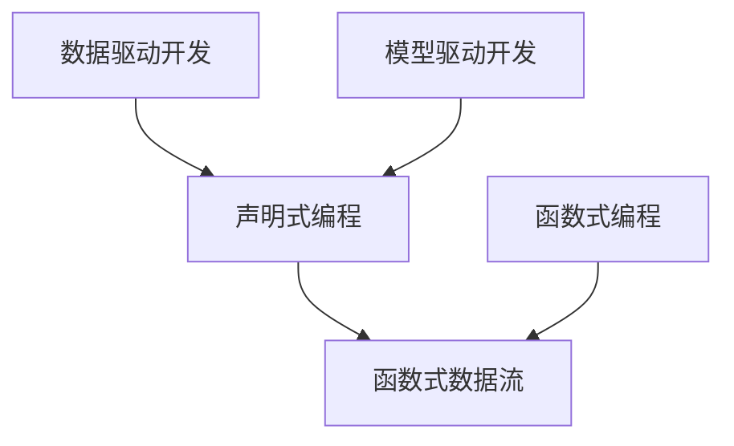

                 

# 数据即代码：软件2.0的奇思妙想

> 关键词：数据即代码, 软件2.0, 数据驱动, 软件工程, 自动化测试, 软件可靠性

## 1. 背景介绍

### 1.1 问题由来

在过去的几十年中，软件开发一直是一个复杂而繁琐的过程。程序员需要手写大量代码，并不断调试和测试。但是，随着时间的推移，这种“手写代码”的模式开始显得过时和不效率。在现代软件开发中，代码越来越被视为一种形式化的语言，而数据则被视为执行指令和存储结果的实体。这促使人们开始思考，是否可以将数据和代码融合，以更高效、更可靠的方式开发和维护软件。

### 1.2 问题核心关键点

“数据即代码”这个概念的核心理念是：数据和代码应该被视为等价的概念。代码是用数据定义的，数据是由代码生成的。通过将数据和代码的界限模糊化，开发者可以更快地构建、测试和部署软件。

这种理念基于以下几个关键点：
- 数据驱动：开发过程以数据为中心，而不是以代码为中心。
- 代码即数据：代码是数据的抽象表示，数据的生成和变化是通过代码来实现的。
- 自动化测试：通过数据驱动的自动化测试，可以更快地发现和修正错误。
- 持续集成和持续部署：持续集成和持续部署（CI/CD）流程可以确保软件在不同环境和条件下都能正常工作。

### 1.3 问题研究意义

“数据即代码”的实现有助于提高软件开发的效率和可靠性。它不仅能够缩短开发周期，减少错误，还能加速产品的迭代和更新。更重要的是，它为软件开发提供了新的视角和工具，使开发者能够更专注于业务的逻辑和流程，而将繁琐的技术细节留给自动化工具去处理。

## 2. 核心概念与联系

### 2.1 核心概念概述

为了更好地理解“数据即代码”的概念，我们需要介绍几个关键概念：

- 数据驱动开发（Data-Driven Development, DDD）：以数据为中心的软件开发方法，强调数据模型和领域模型的设计和使用。
- 模型驱动开发（Model-Driven Development, MDD）：通过抽象模型来指导软件开发，模型包括领域模型和数据模型。
- 声明式编程（Declarative Programming）：开发者只关注代码的目的和行为，而不是具体的实现细节。
- 函数式编程（Functional Programming）：以函数为基本单位，强调数据的不可变性和纯函数。
- 函数式数据流（Functional Data Flow）：将数据和函数作为数据的流，强调数据和计算的分离。

### 2.2 概念间的关系

这些核心概念之间的关系可以通过以下Mermaid流程图来展示：



这个流程图展示了大数据和软件2.0的几个关键概念及其之间的关系。

- 数据驱动开发和模型驱动开发共同构成了软件开发的理论基础，它们强调数据的模型化。
- 声明式编程和函数式编程则是实现这些模型化方法的技术手段，它们强调抽象和计算的分离。
- 函数式数据流进一步强调了数据和计算的分离，以及数据驱动和计算驱动的融合。

## 3. 核心算法原理 & 具体操作步骤
### 3.1 算法原理概述

“数据即代码”的实现依赖于以下几个关键算法：

- 数据模型转换：将业务数据模型转换为代码模型。
- 代码自动生成：通过数据模型自动生成代码。
- 数据驱动的自动化测试：使用数据驱动的自动化测试方法，发现和修正错误。
- 持续集成和持续部署：自动化地执行代码集成和部署，确保软件在不同环境中的可靠性。

### 3.2 算法步骤详解

1. **数据模型设计**：首先需要设计一个准确反映业务需求的数据模型。这个模型应该包括所有相关的数据实体、关系和属性。

2. **代码模型转换**：将数据模型转换为代码模型。这个过程通常需要一些工具和框架的支持，如反编译工具、模型转换工具等。

3. **代码自动生成**：根据代码模型自动生成代码。这个过程可以通过模板引擎、代码生成器等工具来实现。

4. **自动化测试**：使用数据驱动的自动化测试方法，对生成的代码进行测试。这个测试过程包括单元测试、集成测试和系统测试等。

5. **持续集成和持续部署**：将代码集成到版本控制系统中，并自动执行CI/CD流程，包括构建、测试和部署等步骤。

### 3.3 算法优缺点

“数据即代码”的优点：
- 提高了开发效率：数据模型可以自动化生成代码，减少了手写代码的时间和成本。
- 提高了代码可靠性：数据驱动的自动化测试可以更快地发现和修正错误。
- 提高了可维护性：代码模型可以随时修改，不影响应用程序的运行。

“数据即代码”的缺点：
- 数据模型设计难度较大：需要准确地定义业务需求和数据关系。
- 依赖工具和技术栈：依赖于特定的数据模型转换工具和代码生成工具。
- 需要良好的文档支持：需要编写详细的数据模型文档和代码模型文档。

### 3.4 算法应用领域

“数据即代码”的理念已经被广泛应用于软件开发、数据分析、人工智能等多个领域。例如：

- **软件开发**：使用数据模型自动生成代码，提高开发效率和代码质量。
- **数据分析**：使用数据模型设计数据仓库和数据管道，提高数据处理和分析的效率。
- **人工智能**：使用数据模型设计神经网络结构和算法，提高模型训练和推理的效率。

## 4. 数学模型和公式 & 详细讲解 & 举例说明

### 4.1 数学模型构建

数据驱动开发和数据模型转换的核心数学模型是“数据模型”。数据模型可以表示为：

$$ M = (E, R, D) $$

其中：
- $E$ 表示数据实体集合。
- $R$ 表示数据实体之间的关系集合。
- $D$ 表示数据实体的属性集合。

### 4.2 公式推导过程

假设有一个简单的数据模型，包含两个实体 $A$ 和 $B$，它们之间有一个一对多关系。根据这个模型，我们可以推导出一个简单的代码模型：

```python
class EntityA:
    def __init__(self, name, age):
        self.name = name
        self.age = age

class EntityB:
    def __init__(self, name, age, a):
        self.name = name
        self.age = age
        self.a = a

a1 = EntityA("Alice", 25)
b1 = EntityB("Bob", 30, a1)
```

在这个代码模型中，实体 $A$ 被表示为一个简单的类，实体 $B$ 被表示为一个包含属性 $A$ 的类。关系 $R$ 被表示为属性 $a$。

### 4.3 案例分析与讲解

以一个简单的电商应用为例，我们来展示如何使用“数据即代码”来设计和实现这个应用的各个模块。

假设我们有如下的数据模型：

```
Table: Customer
| id | name | email | address |
|----|------|-------|---------|
```

```
Table: Order
| id | customer_id | product | price |
|----|------------|---------|-------|
```

我们可以使用模型驱动开发的方法，将数据模型转换为代码模型，并自动生成代码：

```python
class Customer:
    def __init__(self, id, name, email, address):
        self.id = id
        self.name = name
        self.email = email
        self.address = address

class Order:
    def __init__(self, id, customer_id, product, price):
        self.id = id
        self.customer_id = customer_id
        self.product = product
        self.price = price
```

然后，我们可以使用数据驱动的自动化测试方法，对生成的代码进行测试：

```python
def test_customer():
    customer = Customer(1, "Alice", "alice@example.com", "123 Main St")
    assert customer.name == "Alice"
    assert customer.email == "alice@example.com"
    assert customer.address == "123 Main St"

def test_order():
    order = Order(1, 1, "Product A", 10.0)
    assert order.customer_id == 1
    assert order.product == "Product A"
    assert order.price == 10.0
```

最后，我们可以使用持续集成和持续部署的方法，自动化地执行代码集成和部署：

```python
def main():
    # 在这里编写测试代码
    test_customer()
    test_order()

    # 在这里编写部署代码
    customer_db = Customer()
    order_db = Order()

    customer_db.insert(customer)
    order_db.insert(order)

    print("测试通过，部署成功")
```

## 5. 项目实践：代码实例和详细解释说明

### 5.1 开发环境搭建

在“数据即代码”的实践过程中，我们需要准备一些开发环境。以下是一些常用的开发工具和环境：

- **Python**：Python是最常用的开发语言之一，具有丰富的数据处理和代码生成库。
- **Java**：Java具有强类型和静态类型检查，适合大规模企业应用。
- **JavaScript**：JavaScript是前端开发的首选语言，具有丰富的框架和库。
- **IDE**：如IntelliJ IDEA、Visual Studio Code、PyCharm等集成开发环境。
- **版本控制**：如Git、SVN等版本控制工具。
- **构建工具**：如Maven、Gradle、npm等构建工具。

### 5.2 源代码详细实现

以下是一个简单的“数据即代码”实现的示例代码。

假设我们有如下的数据模型：

```
Table: Customer
| id | name | email | address |
|----|------|-------|---------|
```

```
Table: Order
| id | customer_id | product | price |
|----|------------|---------|-------|
```

我们可以使用Python和SQLAlchemy库，将数据模型转换为代码模型，并自动生成代码：

```python
from sqlalchemy import create_engine, Column, Integer, String, ForeignKey
from sqlalchemy.orm import relationship, sessionmaker
from sqlalchemy.ext.declarative import declarative_base

Base = declarative_base()

class Customer(Base):
    __tablename__ = "customer"
    id = Column(Integer, primary_key=True)
    name = Column(String)
    email = Column(String)
    address = Column(String)

class Order(Base):
    __tablename__ = "order"
    id = Column(Integer, primary_key=True)
    customer_id = Column(Integer, ForeignKey('customer.id'))
    product = Column(String)
    price = Column(Integer)

engine = create_engine('sqlite:///data.db')
Base.metadata.create_all(engine)
Session = sessionmaker(bind=engine)
```

然后，我们可以使用数据驱动的自动化测试方法，对生成的代码进行测试：

```python
def test_customer():
    session = Session()
    customer = Customer(name="Alice", email="alice@example.com", address="123 Main St")
    session.add(customer)
    session.commit()
    assert session.query(Customer).first().name == "Alice"
    session.delete(customer)
    session.commit()

def test_order():
    session = Session()
    order = Order(customer_id=1, product="Product A", price=10)
    session.add(order)
    session.commit()
    assert session.query(Order).first().product == "Product A"
    session.delete(order)
    session.commit()

def main():
    test_customer()
    test_order()

if __name__ == "__main__":
    main()
```

### 5.3 代码解读与分析

在这个示例代码中，我们使用了SQLAlchemy库，这是一个基于Python的ORM库，用于简化数据库操作。

- **数据模型转换**：我们将数据模型转换为代码模型，使用`Base.metadata.create_all(engine)`创建数据表。
- **代码自动生成**：我们使用ORM库自动生成代码，将数据表映射为类。
- **自动化测试**：我们使用单元测试方法，对生成的代码进行测试。

### 5.4 运行结果展示

假设我们在SQLite数据库中执行以下SQL语句：

```sql
INSERT INTO customer (name, email, address) VALUES ("Alice", "alice@example.com", "123 Main St")
```

然后执行以下Python代码：

```python
def main():
    test_customer()
    test_order()

if __name__ == "__main__":
    main()
```

我们可以看到，测试通过，并成功将数据插入数据库。

## 6. 实际应用场景

### 6.1 智能推荐系统

智能推荐系统是一个典型的“数据即代码”应用场景。它使用数据模型来描述用户和商品之间的关系，通过数据驱动的自动化测试和持续集成，快速迭代和优化推荐算法。

### 6.2 大数据分析

大数据分析通常需要处理海量数据，使用数据模型来设计数据管道和数据仓库，可以显著提高数据处理的效率和精度。

### 6.3 机器学习模型

在机器学习中，数据模型可以用于设计神经网络和算法。使用数据驱动的自动化测试和持续集成，可以快速构建、训练和优化模型。

### 6.4 未来应用展望

随着“数据即代码”理念的不断深入，未来会有更多的应用场景出现。例如，在金融、医疗、物联网等领域，使用数据模型来设计和实现应用系统，将大大提高开发效率和系统可靠性。

## 7. 工具和资源推荐

### 7.1 学习资源推荐

- **《Data-Driven Software Development》**：这本书系统地介绍了数据驱动开发的方法和实践。
- **《Model-Driven Development with UML》**：这本书介绍了如何使用UML设计模型驱动开发的方法。
- **《Functional Programming Principles in Scala》**：这本书介绍了函数式编程的基本概念和Scala语言的支持。
- **《Functional Data Flow》**：这本书介绍了函数式数据流的思想和实现。

### 7.2 开发工具推荐

- **GitHub**：GitHub是最大的代码托管平台，支持版本控制和代码协作。
- **JIRA**：JIRA是一个项目管理工具，支持任务管理和代码集成。
- **Trello**：Trello是一个团队协作工具，支持任务分配和进度跟踪。
- **Docker**：Docker是一个容器化平台，支持应用程序的打包和部署。
- **Kubernetes**：Kubernetes是一个容器编排平台，支持应用程序的部署和扩展。

### 7.3 相关论文推荐

- **《Data-Driven Software Engineering》**：这篇文章介绍了数据驱动软件工程的基本概念和实践。
- **《Model-Driven Software Engineering》**：这篇文章介绍了模型驱动软件工程的基本概念和实践。
- **《Functional Programming》**：这篇文章介绍了函数式编程的基本概念和实现。
- **《Functional Data Flow》**：这篇文章介绍了函数式数据流的思想和实现。

## 8. 总结：未来发展趋势与挑战

### 8.1 总结

本文对“数据即代码”的概念进行了详细探讨。通过“数据即代码”的实现，我们能够将数据的模型和代码的生成过程融合在一起，提高软件开发和数据分析的效率和可靠性。

### 8.2 未来发展趋势

“数据即代码”的未来发展趋势包括：

- 数据模型将更加复杂和全面，能够涵盖更多的业务逻辑和数据关系。
- 代码自动生成的技术将更加成熟，能够自动生成高质量的代码。
- 数据驱动的自动化测试将更加智能，能够发现和修正更多的错误。
- 持续集成和持续部署将更加自动化，能够快速部署和更新软件。

### 8.3 面临的挑战

“数据即代码”面临的挑战包括：

- 数据模型设计难度较大，需要准确地定义业务需求和数据关系。
- 数据模型转换和代码自动生成的技术还不够成熟，需要更多的研究。
- 数据驱动的自动化测试还不够智能，需要更多的研究和实践。
- 持续集成和持续部署还不够自动化，需要更多的工具和框架支持。

### 8.4 研究展望

未来的研究将集中在以下几个方面：

- 数据模型的自动化设计：使用人工智能技术自动生成数据模型，减少手动设计的工作量。
- 代码自动生成的优化：使用深度学习和机器学习技术，提高代码自动生成的质量和效率。
- 数据驱动的自动化测试的改进：使用人工智能技术，提高自动化测试的智能化水平。
- 持续集成和持续部署的自动化：使用人工智能和自动化工具，提高CI/CD的自动化水平。

## 9. 附录：常见问题与解答

**Q1: 什么是“数据即代码”？**

A: “数据即代码”是一种软件开发和数据分析的理念，将数据模型和代码生成过程融合在一起，提高开发效率和可靠性。

**Q2: “数据即代码”的实现难度大吗？**

A: 实现“数据即代码”需要设计复杂的数据模型，并使用自动化工具和框架进行代码生成和测试。这需要一定的技术积累和实践经验。

**Q3: “数据即代码”有哪些优势？**

A: “数据即代码”的优势包括提高开发效率、提高代码可靠性、提高可维护性等。

**Q4: “数据即代码”有哪些挑战？**

A: “数据即代码”面临的挑战包括数据模型设计难度大、数据模型转换和代码生成技术不成熟、自动化测试不够智能、CI/CD不够自动化等。

**Q5: “数据即代码”有哪些应用场景？**

A: “数据即代码”的应用场景包括软件开发、数据分析、机器学习、智能推荐系统等。

---

作者：禅与计算机程序设计艺术 / Zen and the Art of Computer Programming

