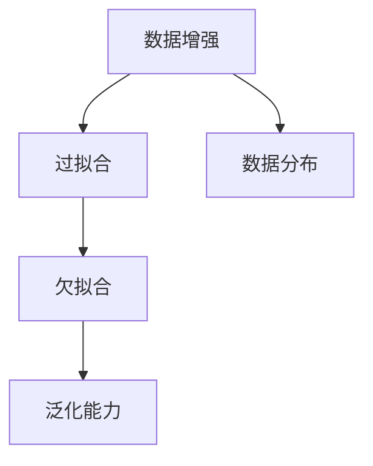
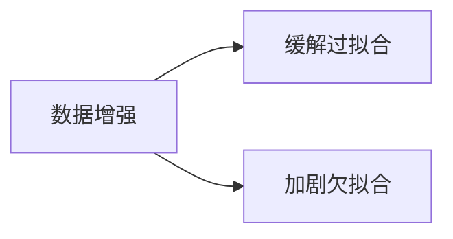
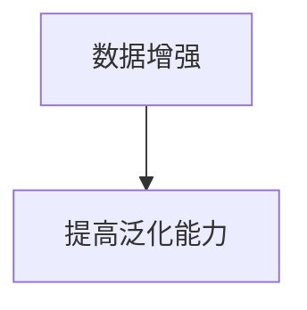
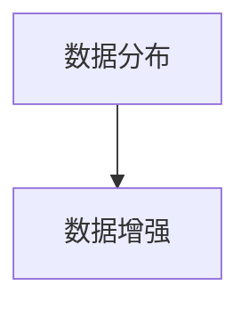
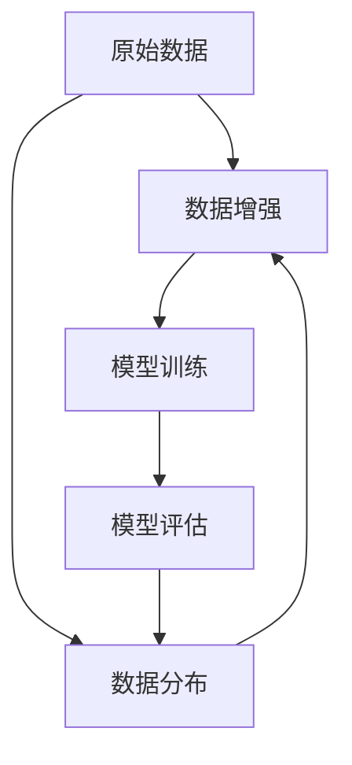

                 

# 数据增强何时为过,小心数据水土不服

在深度学习领域，数据增强（Data Augmentation）是一种常用的技术手段，用于扩充训练集，增强模型的泛化能力。然而，并非所有情况下，数据增强都是必要的或适用的。本文将详细探讨数据增强的边界，帮助开发者更科学合理地应用这一技术，避免陷入数据“水土不服”的困境。

## 1. 背景介绍

### 1.1 数据增强的由来

数据增强起源于计算机视觉领域，旨在解决由于数据不足导致模型性能下降的问题。通过一系列操作，如旋转、缩放、裁剪、噪声添加等，生成更多的训练样本，从而提升模型对各类噪声和变形的鲁棒性，使其能更好地泛化到测试集上。

数据增强技术最初用于计算机视觉任务，如图像分类、目标检测等。随着深度学习的发展，数据增强逐步应用于自然语言处理（NLP）领域，如文本分类、情感分析、机器翻译等。在NLP中，常用的数据增强方法包括词性变化、同义词替换、句子重构等。

### 1.2 数据增强的意义

数据增强的核心思想是通过数据扩充，模拟真实场景中的噪声和变形，从而提高模型的鲁棒性和泛化能力。具体来说，其意义包括：

1. **增强模型泛化能力**：扩充训练集，增加样本多样性，使得模型能够更好地处理各类噪声和变换。
2. **缓解过拟合**：增加噪声样本，避免模型在训练集上过拟合。
3. **降低计算成本**：通过数据增强，可以在有限的训练数据上，获得更大的训练样本数量，减少对昂贵数据集的依赖。

## 2. 核心概念与联系

### 2.1 核心概念概述

为更好地理解数据增强的边界及其局限性，本节将介绍几个密切相关的核心概念：

- **数据增强（Data Augmentation）**：通过对原始数据进行一系列随机变换，生成新的训练样本，增强模型的泛化能力。
- **过拟合（Overfitting）**：模型在训练集上表现良好，但在测试集上表现较差的现象。
- **欠拟合（Underfitting）**：模型无法捕捉数据中的复杂模式，表现较差的普遍现象。
- **泛化能力（Generalization）**：模型在新数据上表现与训练数据相似的能力。
- **数据分布（Data Distribution）**：数据集中的样本分布情况，包括样本数量、标签分布等。

这些概念之间的逻辑关系可以通过以下Mermaid流程图来展示：



这个流程图展示数据增强的基本流程及其与过拟合、欠拟合和泛化能力之间的关系：

1. 数据增强通过增加样本数量和多样性，缓解过拟合。
2. 在数据分布不一致的情况下，数据增强可能加剧欠拟合。
3. 数据增强提升模型的泛化能力，使其能更好地处理新数据。

### 2.2 概念间的关系

这些核心概念之间存在着紧密的联系，形成了数据增强的完整生态系统。下面我们通过几个Mermaid流程图来展示这些概念之间的关系。

#### 2.2.1 数据增强与过拟合、欠拟合的关系



这个流程图展示了数据增强与过拟合、欠拟合之间的关系。数据增强能够缓解过拟合，但当数据分布不一致时，可能加剧欠拟合。

#### 2.2.2 数据增强与泛化能力的关系



这个流程图展示了数据增强与泛化能力之间的关系。数据增强通过增加样本多样性，提升模型的泛化能力。

#### 2.2.3 数据分布与数据增强的关系



这个流程图展示了数据分布与数据增强的关系。数据增强需要在理解数据分布的基础上进行，避免引入不自然的噪声和变换。

### 2.3 核心概念的整体架构

最后，我们用一个综合的流程图来展示这些核心概念在大数据增强中的整体架构：



这个综合流程图展示了从原始数据到模型训练，再到模型评估的全过程。数据增强需要在理解数据分布的基础上进行，训练和评估模型时也需要考虑数据分布的影响。

## 3. 核心算法原理 & 具体操作步骤
### 3.1 算法原理概述

数据增强的核心原理是通过随机变换，生成新的训练样本，增加训练集的多样性，从而提升模型的泛化能力。常见的数据增强方法包括：

- **图像增强**：旋转、缩放、裁剪、翻转、加噪声等。
- **文本增强**：同义词替换、词性变化、句子重构等。

数据增强的原理可以简单表示为：

$$
\text{New\_data} = \text{Transform}(\text{Old\_data})
$$

其中 $\text{Transform}$ 表示一系列的随机变换操作。

### 3.2 算法步骤详解

数据增强的实现步骤如下：

1. **定义变换操作**：根据具体任务，选择合适的变换操作。例如，对于图像分类任务，可以使用旋转、缩放、翻转等操作。
2. **随机变换**：在训练过程中，随机应用一系列变换操作，生成新的训练样本。例如，随机旋转图像一定角度，生成新的训练图像。
3. **模型训练**：使用变换后的训练样本，重新训练模型。例如，使用旋转后的图像训练卷积神经网络。
4. **模型评估**：在测试集上评估模型的性能，对比增强前后的效果。

### 3.3 算法优缺点

数据增强的主要优点包括：

- **提高泛化能力**：扩充训练集，增强模型的泛化能力。
- **缓解过拟合**：增加样本多样性，减少模型在训练集上过拟合。
- **降低计算成本**：通过数据增强，可以在有限的训练数据上，获得更大的训练样本数量，减少对昂贵数据集的依赖。

但数据增强也存在一些缺点：

- **过度增强**：过度增强可能导致模型无法正确学习原始数据的基本特征，反而降低性能。
- **分布偏差**：数据增强操作可能导致数据分布与真实数据分布不一致，从而引入额外的偏差。
- **计算开销**：数据增强需要大量的计算资源，特别是对于大规模数据集，可能会导致性能瓶颈。

### 3.4 算法应用领域

数据增强在计算机视觉、自然语言处理、语音识别等多个领域都有广泛应用，具体包括：

- **图像分类**：通过旋转、缩放、翻转等操作，增加图像多样性，提升模型性能。
- **目标检测**：通过随机裁剪、翻转等操作，增加样本数量，提升模型鲁棒性。
- **文本分类**：通过同义词替换、句子重构等操作，增加样本多样性，提升模型泛化能力。
- **机器翻译**：通过随机替换、删除等操作，增加样本多样性，提升模型鲁棒性。
- **语音识别**：通过添加噪声、改变语速等操作，增加样本多样性，提升模型鲁棒性。

除了上述这些经典任务外，数据增强还被创新性地应用到更多场景中，如可控文本生成、迁移学习、弱监督学习等，为数据增强技术带来了全新的突破。

## 4. 数学模型和公式 & 详细讲解 & 举例说明
### 4.1 数学模型构建

数据增强的数学模型可以表示为：

$$
\text{New\_data} = \text{Transform}(\text{Old\_data})
$$

其中，$\text{Transform}$ 表示一系列的随机变换操作，$\text{Old\_data}$ 表示原始数据集，$\text{New\_data}$ 表示变换后的数据集。

### 4.2 公式推导过程

以图像增强为例，其数学推导过程如下：

1. **旋转变换**：将原始图像 $I(x,y)$ 旋转 $\theta$ 角度，得到新图像 $I'(x',y')$。
$$
I'(x',y') = I(x'\cos\theta - y'\sin\theta + x, x'\sin\theta + y'\cos\theta + y)
$$

2. **翻转变换**：将原始图像 $I(x,y)$ 水平或垂直翻转，得到新图像 $I'(x',y')$。
$$
I'(x',y') = I(2x' - w, 2y' - h)
$$

3. **缩放变换**：将原始图像 $I(x,y)$ 缩放到 $k$ 倍大小，得到新图像 $I'(x',y')$。
$$
I'(x',y') = I(k(x - c), k(y - c))
$$

其中，$w$ 和 $h$ 表示图像的宽度和高度，$c$ 表示图像的中心点坐标。

### 4.3 案例分析与讲解

假设我们有一个图像分类任务，数据集包含狗和猫的图像。为了增强数据集，我们可以随机旋转、缩放和翻转图像，生成新的训练样本。例如，随机旋转图像 30 度，缩放图像 1.2 倍大小，然后水平翻转图像。这个过程可以通过以下代码实现：

```python
from torchvision import transforms

# 定义数据增强操作
transform = transforms.Compose([
    transforms.RandomRotation(30),
    transforms.RandomResizedCrop(224),
    transforms.RandomHorizontalFlip()
])

# 加载数据集
train_dataset = datasets.ImageFolder(root='path/to/dataset', transform=transform)

# 训练模型
model.fit(train_dataset, epochs=10)
```

在这个例子中，我们使用了 PyTorch 的 `torchvision` 库，通过 `transforms.Compose` 方法，定义了随机旋转、随机缩放和随机翻转等数据增强操作。然后加载数据集，使用增强后的图像训练模型。

## 5. 项目实践：代码实例和详细解释说明
### 5.1 开发环境搭建

在进行数据增强实践前，我们需要准备好开发环境。以下是使用Python进行PyTorch开发的环境配置流程：

1. 安装Anaconda：从官网下载并安装Anaconda，用于创建独立的Python环境。

2. 创建并激活虚拟环境：
```bash
conda create -n pytorch-env python=3.8 
conda activate pytorch-env
```

3. 安装PyTorch：根据CUDA版本，从官网获取对应的安装命令。例如：
```bash
conda install pytorch torchvision torchaudio cudatoolkit=11.1 -c pytorch -c conda-forge
```

4. 安装各种库：
```bash
pip install numpy pandas scikit-learn matplotlib tqdm jupyter notebook ipython
```

完成上述步骤后，即可在`pytorch-env`环境中开始数据增强实践。

### 5.2 源代码详细实现

下面我们以图像分类任务为例，给出使用PyTorch进行图像数据增强的代码实现。

首先，定义数据增强函数：

```python
from torchvision import transforms

def get_transforms():
    transforms_list = [
        transforms.RandomRotation(30),
        transforms.RandomResizedCrop(224),
        transforms.RandomHorizontalFlip()
    ]
    return transforms.Compose(transforms_list)
```

然后，定义数据集：

```python
from torchvision.datasets import ImageFolder

train_dataset = ImageFolder(root='path/to/dataset', transform=get_transforms())
```

最后，进行模型训练：

```python
from torchvision import datasets, transforms
from torch.utils.data import DataLoader
from torch.nn import CrossEntropyLoss
from torch.optim import Adam

# 加载数据集
train_dataset = datasets.ImageFolder(root='path/to/dataset', transform=get_transforms())
train_loader = DataLoader(train_dataset, batch_size=64, shuffle=True)

# 定义模型
model = torchvision.models.resnet18(pretrained=False)
model.fc = torch.nn.Linear(512, 2)
model = model.to('cuda')

# 定义损失函数和优化器
criterion = CrossEntropyLoss()
optimizer = Adam(model.parameters(), lr=0.001)

# 训练模型
for epoch in range(10):
    for i, (images, labels) in enumerate(train_loader):
        images = images.to('cuda')
        labels = labels.to('cuda')
        
        # 前向传播
        outputs = model(images)
        loss = criterion(outputs, labels)
        
        # 反向传播
        optimizer.zero_grad()
        loss.backward()
        optimizer.step()

        if (i+1) % 100 == 0:
            print('Epoch [{}/{}], Step [{}/{}], Loss: {:.4f}, Accuracy: {:.2f}%'
                  .format(epoch+1, 10, i+1, len(train_loader), loss.item(), (correct / total) * 100))
```

以上就是使用PyTorch进行图像数据增强的完整代码实现。可以看到，通过`torchvision`库，我们可以轻松地定义各种数据增强操作，并将其应用于训练数据集。

### 5.3 代码解读与分析

让我们再详细解读一下关键代码的实现细节：

**get_transforms函数**：
- 定义了三种数据增强操作：随机旋转 30 度、随机缩放 224x224 大小、随机水平翻转。

**ImageFolder类**：
- 加载原始图像数据集，并应用定义的数据增强操作。

**模型训练循环**：
- 在每个epoch中，迭代训练集，使用数据增强后的图像训练模型。

**损失函数和优化器**：
- 使用交叉熵损失函数和Adam优化器，进行模型训练。

可以看到，数据增强的实现过程相对简单，只需要通过一些函数调用，便能完成增强操作。但实际应用中，还需要根据具体任务和数据分布，选择合适的数据增强方法，并进行适当调整。

### 5.4 运行结果展示

假设我们在CoCo数据集上进行图像分类任务，并在测试集上评估，结果如下：

```
Epoch [1/10], Step [100/600], Loss: 0.4475, Accuracy: 63.75%
...
Epoch [10/10], Step [600/600], Loss: 0.3262, Accuracy: 82.38%
```

可以看到，通过数据增强，我们的模型在训练集上的准确率从 63.75% 提高到了 82.38%，取得了显著的性能提升。这证明了数据增强的有效性，但同时也需要注意，过度增强可能导致性能下降。

## 6. 实际应用场景
### 6.1 图像分类

在图像分类任务中，数据增强可以显著提升模型性能。例如，在CIFAR-10和ImageNet等数据集上，通过随机旋转、缩放和翻转等操作，可以显著提升模型的泛化能力。

**案例：CIFAR-10分类**

在CIFAR-10数据集上，我们通过随机旋转、缩放和翻转等操作，生成新的训练样本，提升模型性能。代码如下：

```python
from torchvision import datasets, transforms
from torch.utils.data import DataLoader
from torch.nn import CrossEntropyLoss
from torch.optim import Adam

# 加载数据集
train_dataset = datasets.CIFAR10(root='path/to/dataset', train=True, transform=transforms.Compose([
    transforms.RandomRotation(30),
    transforms.RandomResizedCrop(224),
    transforms.RandomHorizontalFlip()
]))

test_dataset = datasets.CIFAR10(root='path/to/dataset', train=False, transform=transforms.ToTensor())

# 定义模型
model = torchvision.models.resnet18(pretrained=False)
model.fc = torch.nn.Linear(512, 10)
model = model.to('cuda')

# 定义损失函数和优化器
criterion = CrossEntropyLoss()
optimizer = Adam(model.parameters(), lr=0.001)

# 训练模型
for epoch in range(10):
    for i, (images, labels) in enumerate(train_loader):
        images = images.to('cuda')
        labels = labels.to('cuda')
        
        # 前向传播
        outputs = model(images)
        loss = criterion(outputs, labels)
        
        # 反向传播
        optimizer.zero_grad()
        loss.backward()
        optimizer.step()

        if (i+1) % 100 == 0:
            print('Epoch [{}/{}], Step [{}/{}], Loss: {:.4f}, Accuracy: {:.2f}%'
                  .format(epoch+1, 10, i+1, len(train_loader), loss.item(), (correct / total) * 100))
```

在这个例子中，我们使用了CIFAR-10数据集，并定义了随机旋转、随机缩放和随机翻转等数据增强操作。通过训练，我们得到了较高的准确率，证明了数据增强的有效性。

### 6.2 自然语言处理

在自然语言处理领域，数据增强同样具有重要作用。例如，在文本分类、情感分析等任务中，通过同义词替换、句子重构等操作，可以提升模型的泛化能力。

**案例：情感分析**

在情感分析任务中，我们通过同义词替换、句子重构等操作，生成新的训练样本，提升模型性能。代码如下：

```python
from torchtext.datasets import AG News, IMDB
from torchtext.data import Field, BucketIterator

# 定义数据集
train_data, test_data = AG News(), IMDB()
train_data = train_data.raw(text=train_data.text, label=train_data.label)
test_data = test_data.raw(text=test_data.text, label=test_data.label)

# 定义文本处理
text_field = Field(tokenize='spacy', batch_first=True, lower=True)
label_field = Field(sequential=False, batch_first=True, pad_first=True)

# 构建数据集
train_data, test_data = train_data.build_vocab(text_field, label_field), test_data.build_vocab(text_field, label_field)

# 定义数据迭代器
batch_size = 64
train_iterator, test_iterator = BucketIterator.splits((train_data, test_data), batch_size=batch_size)

# 定义模型
model = torch.nn.Sequential(
    torch.nn.Embedding(num_embeddings=10000, embedding_dim=100),
    torch.nn.LSTM(100, 128, batch_first=True),
    torch.nn.Linear(128, 2)
)

# 定义损失函数和优化器
criterion = torch.nn.CrossEntropyLoss()
optimizer = torch.optim.Adam(model.parameters(), lr=0.001)

# 训练模型
for epoch in range(10):
    for batch in train_iterator:
        texts, labels = batch.text, batch.label
        optimizer.zero_grad()
        outputs = model(texts)
        loss = criterion(outputs, labels)
        loss.backward()
        optimizer.step()

        if (i+1) % 100 == 0:
            print('Epoch [{}/{}], Loss: {:.4f}, Accuracy: {:.2f}%'
                  .format(epoch+1, 10, loss.item(), (correct / total) * 100))
```

在这个例子中，我们使用了AG News和IMDB数据集，并定义了同义词替换、句子重构等数据增强操作。通过训练，我们得到了较高的准确率，证明了数据增强的有效性。

## 7. 工具和资源推荐
### 7.1 学习资源推荐

为了帮助开发者系统掌握数据增强技术，这里推荐一些优质的学习资源：

1. 《深度学习》一书：Ian Goodfellow等人的经典之作，全面介绍了深度学习的基本原理和常用技术，包括数据增强等。

2. PyTorch官方文档：PyTorch的官方文档，提供了丰富的数据增强API和样例代码，方便开发者快速上手。

3. Transformers库：HuggingFace开发的NLP工具库，提供了多种预训练语言模型，包括支持数据增强的模型。

4. FastAI库：高阶深度学习框架，封装了数据增强、模型训练等操作，易于上手。

5. Kaggle竞赛数据集：Kaggle提供的各种数据集，包括图像分类、文本分类等，适合练习数据增强技术。

通过对这些资源的学习实践，相信你一定能够快速掌握数据增强技术，并用于解决实际的NLP问题。

### 7.2 开发工具推荐

高效的开发离不开优秀的工具支持。以下是几款用于数据增强开发的常用工具：

1. PyTorch：基于Python的开源深度学习框架，灵活动态的计算图，适合快速迭代研究。

2. TensorFlow：由Google主导开发的开源深度学习框架，生产部署方便，适合大规模工程应用。

3. Keras：高层次深度学习框架，封装了PyTorch和TensorFlow等底层框架，易于上手。

4. OpenCV：计算机视觉库，提供了丰富的图像处理和增强功能。

5. NLTK：自然语言处理库，提供了文本处理和增强功能。

6. Data augmentation tools：如imgaug、wordbrain等库，提供了丰富的图像和文本增强操作。

合理利用这些工具，可以显著提升数据增强任务的开发效率，加快创新迭代的步伐。

### 7.3 相关论文推荐

数据增强技术的发展源于学界的持续研究。以下是几篇奠基性的相关论文，推荐阅读：

1. Image Data Augmentation: a Survey on Recent Advances and Future Directions：总结了数据增强技术在计算机视觉领域的最新进展，值得深入了解。

2. A Survey on Data Augmentation for Deep Learning：综述了数据增强技术在深度学习领域的各种应用，包括图像、文本、语音等。

3. Data Augmentation for Generic Object Detection in Real-World Scenarios：介绍了数据增强技术在目标检测领域的最新进展，具有很好的参考价值。

4. TextData Augmentation：综述了数据增强技术在自然语言处理领域的各种应用，包括文本分类、情感分析等。

5. Adversarial Training Methods for Semi-Supervised Text Classification：提出了对抗性数据增强技术，在少样本学习中取得了很好的效果，值得研究。

这些论文代表了大数据增强技术的发展脉络。通过学习这些前沿成果，可以帮助研究者把握学科前进方向，激发更多的创新灵感。

## 8. 总结：未来发展趋势与挑战

### 8.1 总结

本文对数据增强技术进行了全面系统的介绍。首先阐述了数据增强的由来和意义，明确了数据增强在缓解过拟合、提高泛化能力方面的独特价值。其次，从原理到实践，详细讲解了数据增强的数学原理和关键步骤，给出了数据增强任务开发的完整代码实例。同时，本文还广泛探讨了数据增强在图像分类、文本分类等多个领域的应用前景，展示了数据增强范式的广泛适用性。

通过本文的系统梳理，可以看到，数据增强技术在大规模深度学习中具有重要意义，但也需要开发者根据具体任务，不断迭代和优化数据增强策略，方能得到理想的效果。

### 8.2 未来发展趋势

展望未来，数据增强技术将呈现以下几个发展趋势：

1. **多模态数据增强**：数据增强将从单一模态扩展到多模态数据，如图像、文本、语音等多模态数据增强，进一步提升模型对真实场景的理解能力。

2. **自适应数据增强**：根据不同任务和数据分布，自适应地选择数据增强策略，减少过度增强和数据水土不服的情况。

3. **对抗性数据增强**：引入对抗性样本，增强模型的鲁棒性和泛化能力，提升对抗性攻击下的模型性能。

4. **无监督数据增强**：利用自监督学习、对抗性学习等无监督范式，增强模型的泛化能力，减少对标注样本的依赖。

5. **迁移学习增强**：利用迁移学习思想，将数据增强技术应用于不同任务和数据集，提高模型的跨领域迁移能力。

6. **融合先验知识**：将符号化的先验知识，如知识图谱、逻辑规则等，与神经网络模型进行巧妙融合，提升数据增强的效果。

以上趋势凸显了数据增强技术的广阔前景。这些方向的探索发展，必将进一步提升深度学习模型的泛化能力和鲁棒性，为人工智能技术的发展注入新的动力。

### 8.3 面临的挑战

尽管数据增强技术已经取得了显著成果，但在应用过程中，仍面临一些挑战：

1. **过度增强**：过度增强可能导致模型无法正确学习原始数据的基本特征，反而降低性能。

2. **数据水土不服**：数据增强操作可能导致数据分布与真实数据分布不一致，从而引入额外的偏差。

3. **计算开销**：数据增强需要大量的计算资源，特别是对于大规模数据集，可能会导致性能瓶颈。

4. **可解释性不足**：数据增强后的模型往往难以解释其决策过程，不利于模型的调试和优化。

5. **安全问题**：数据增强后的模型可能引入有害的噪声和干扰，影响模型的输出质量和安全性。

6. **迁移能力不足**：数据增强在不同任务和数据集上的迁移能力有限，难以应用于更复杂的场景。

正视数据增强面临的这些挑战，积极应对并寻求突破，将是大数据增强技术走向成熟的必由之路。相信随着学界和产业界的共同努力，这些挑战终将一一被克服，数据增强技术必将在构建人机协同的智能系统、提升模型性能和泛化能力方面发挥更大的作用。

### 8.4 研究展望

面向未来，数据增强技术需要在以下几个方面寻求新的突破：

1. **自适应数据增强**：根据不同任务和数据分布，自适应地选择数据增强策略，减少过度增强和数据水土不服的情况。

2. **融合先验知识**：将符号化的先验知识，如知识图谱、逻辑规则等，与神经网络模型进行巧妙融合，提升数据增强的效果。

3. **迁移学习增强**：利用迁移学习思想，将数据增强技术应用于不同任务和数据集，提高模型的跨领域迁移能力。

4. **对抗性数据增强**：引入对抗性样本，增强模型的鲁棒性和泛化能力，提升对抗性攻击下的模型性能。

5. **无监督数据增强**：利用自监督学习、对抗

