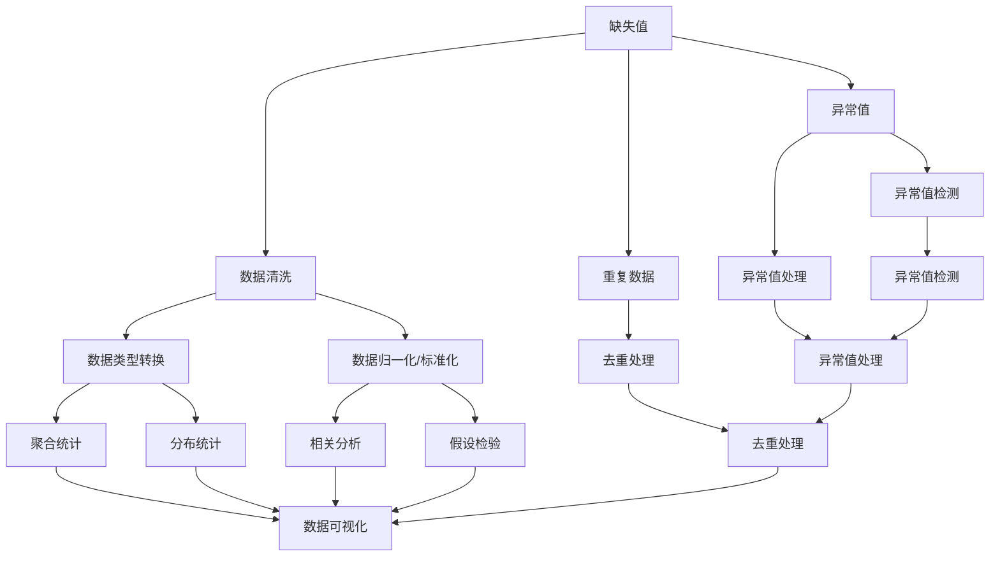

                 

# 数据清洗与统计分析原理与代码实战案例讲解

## 1. 背景介绍

### 1.1 问题由来
在数据科学和机器学习项目中，数据清洗和统计分析是至关重要的前处理步骤。数据清洗涉及处理缺失值、异常值、重复数据等问题，保证数据质量，为后续分析打下良好基础。而统计分析则通过各种量化方法，挖掘数据中的规律和模式，提供决策支持。

当前，随着大数据技术的发展，数据量和数据类型日益复杂化，这对数据清洗和统计分析的能力提出了更高的要求。例如，如何在确保数据准确性的同时，提高处理效率？如何通过丰富的统计方法，获取更有价值的洞见？这些问题亟需深入理解和有效解决。

### 1.2 问题核心关键点
数据清洗和统计分析的核心在于：

1. **数据清洗**：确保数据的准确性和完整性，处理缺失值、异常值、重复数据等问题。
2. **统计分析**：通过多样化的统计方法，揭示数据中的内在规律和趋势，进行数据可视化。
3. **性能优化**：提高数据处理效率，减少计算资源消耗，确保处理过程的稳定性。
4. **应用领域**：广泛应用于金融、医疗、电商、社交媒体等各个行业，是数据分析、预测建模的基础。

## 2. 核心概念与联系

### 2.1 核心概念概述

数据清洗和统计分析涉及多个核心概念，下面进行详细说明：

- **缺失值**：指数据集中某些记录或字段缺失，影响数据分析和模型训练的准确性。
- **异常值**：指数据集中与其他数据明显不同的值，可能来源于数据录入错误或极端情况。
- **重复数据**：指数据集中存在完全相同或部分相同的记录，增加了数据处理和存储的复杂性。
- **数据类型转换**：指将数据从一种类型转换为另一种类型，如从字符串转换为数值。
- **数据归一化/标准化**：指将数据按比例缩放到指定范围，提高数据的一致性和可比性。
- **聚合统计**：指通过统计函数计算数据的汇总信息，如均值、中位数、总和等。
- **分布统计**：指通过概率密度函数、直方图等描述数据的分布特征。
- **相关分析**：指通过相关系数、协方差等方法，衡量变量之间的线性关系。
- **假设检验**：指通过统计学方法，检验数据是否符合特定假设。
- **数据可视化**：指通过图表、地图等形式，直观展示数据特征和趋势。

这些核心概念之间存在密切联系，通过数据清洗和统计分析的过程，可以提升数据质量，为后续分析和模型训练提供可靠的基础。

### 2.2 概念间的关系

这些核心概念之间的联系可以通过以下Mermaid流程图来展示：



这个流程图展示了大数据清洗和统计分析的基本流程：

1. 缺失值、异常值和重复数据属于数据清洗的范畴。
2. 数据类型转换、归一化/标准化等属于数据预处理的环节。
3. 聚合统计、分布统计、相关分析等属于统计分析的过程。
4. 假设检验是统计分析中的重要步骤，用于验证数据的可靠性。
5. 数据可视化作为结果展示的最后环节，直观地呈现数据分析结果。

### 2.3 核心概念的整体架构

最后，我们用一个综合的流程图来展示这些核心概念在大数据清洗和统计分析中的整体架构：


这个流程图展示了数据清洗、数据预处理、统计分析和结果展示的完整流程。通过对大数据集进行清洗和预处理，再通过统计分析挖掘数据规律，最后通过假设检验和数据可视化验证结果，确保数据分析的准确性和有效性。

## 3. 核心算法原理 & 具体操作步骤

### 3.1 算法原理概述

数据清洗和统计分析主要涉及以下几个核心算法：

- **数据清洗算法**：包括缺失值处理、异常值检测和处理、重复数据去重等。
- **数据预处理算法**：包括数据类型转换、归一化/标准化、降维等。
- **统计分析算法**：包括聚合统计、分布统计、相关分析等。
- **假设检验算法**：包括t检验、卡方检验、ANOVA等。
- **数据可视化算法**：包括散点图、柱状图、饼图等。

这些算法通过不同的处理方法和步骤，能够有效应对数据中的各种问题，提升数据质量和分析深度。

### 3.2 算法步骤详解

以数据清洗和统计分析的核心算法之一——**缺失值处理**为例，详细讲解其具体操作步骤：

#### 3.2.1 数据预处理
1. **缺失值检测**：统计数据集中缺失值的数量和分布。
2. **缺失值填补**：选择合适的填补方法，如均值填补、中位数填补、插值法等。
3. **异常值检测**：使用统计学方法检测数据中的异常值。
4. **去重处理**：通过记录唯一标识符去除重复数据。
5. **数据类型转换**：将数据类型从字符串转换为数值。

#### 3.2.2 数据清洗
1. **缺失值处理**：
   - 删除缺失值：删除包含缺失值的记录。
   - 均值填补：用列中所有非缺失值的均值填补缺失值。
   - 中位数填补：用列中所有非缺失值的中位数填补缺失值。
   - 插值法：通过线性插值、多项式插值等方法填补缺失值。

2. **异常值处理**：
   - 基于统计学方法，如Z-score法、IQR法等，检测和处理异常值。
   - 基于业务逻辑，如阈值法、基于上下文的处理方法。

3. **重复数据去重**：
   - 基于主键去重：使用记录的唯一标识符进行去重。
   - 基于哈希值去重：计算记录的哈希值，去除哈希值相同的记录。

4. **数据类型转换**：
   - 字符串转数值：使用pandas的`astype`方法。
   - 数值转字符串：使用`astype(str)`。

#### 3.2.3 数据预处理
1. **归一化/标准化**：
   - 标准化：使用`z-score标准化`方法，将数据缩放到均值为0，方差为1。
   - 归一化：使用`min-max归一化`方法，将数据缩放到[0, 1]区间。

2. **降维**：
   - 主成分分析(PCA)：通过降维算法，减少数据维度，保留主要特征。
   - 线性判别分析(LDA)：通过线性降维算法，将数据映射到低维空间。

#### 3.2.4 统计分析
1. **聚合统计**：
   - 计算均值：使用`mean`方法。
   - 计算中位数：使用`median`方法。
   - 计算总和：使用`sum`方法。

2. **分布统计**：
   - 直方图：使用`hist`方法，展示数据的分布。
   - 概率密度函数(PDF)：使用`kde`方法，展示数据的概率密度。

3. **相关分析**：
   - 计算相关系数：使用`corr`方法。
   - 计算协方差：使用`cov`方法。

#### 3.2.5 假设检验
1. **t检验**：
   - 单样本t检验：判断一个样本均值是否与总体均值不同。
   - 双样本t检验：判断两个样本均值是否不同。

2. **卡方检验**：
   - 卡方检验：检验分类变量的独立性。

3. **ANOVA**：
   - 单因素ANOVA：检验多个组均值是否不同。
   - 多因素ANOVA：检验多个自变量对因变量的影响。

#### 3.2.6 数据可视化
1. **散点图**：
   - 展示两个变量之间的关系。
   - 用于检测变量之间的线性关系。

2. **柱状图**：
   - 展示不同组别之间的数量差异。
   - 用于比较分类变量的频率。

3. **饼图**：
   - 展示不同组别之间的比例关系。
   - 用于展示分类变量的分布情况。

### 3.3 算法优缺点

数据清洗和统计分析算法具有以下优点：

1. **提升数据质量**：通过数据清洗，保证了数据的完整性和准确性。
2. **增强数据可分析性**：通过数据预处理和统计分析，提高了数据的一致性和可比性。
3. **提供决策支持**：通过统计分析和假设检验，揭示了数据的内在规律和趋势，提供了数据驱动的决策支持。

同时，也存在一些缺点：

1. **数据预处理复杂**：数据清洗和预处理需要根据数据类型和业务逻辑，选择合适的方法，增加了处理复杂度。
2. **计算资源消耗高**：某些算法（如PCA）需要较高的计算资源，增加了数据处理的成本。
3. **结果解释性不足**：部分统计分析方法（如PCA）缺乏对结果的直观解释，增加了理解难度。

### 3.4 算法应用领域

数据清洗和统计分析算法在各个领域都有广泛应用，例如：

1. **金融分析**：通过对金融数据的清洗和统计分析，进行风险评估、投资策略分析等。
2. **医疗数据分析**：通过对医疗数据的清洗和统计分析，进行疾病预测、患者分群等。
3. **电商数据分析**：通过对电商数据的清洗和统计分析，进行用户行为分析、商品推荐等。
4. **社交媒体分析**：通过对社交媒体数据的清洗和统计分析，进行舆情分析、用户情感分析等。

## 4. 数学模型和公式 & 详细讲解 & 举例说明

### 4.1 数学模型构建

#### 4.1.1 缺失值处理
假设有一个包含缺失值的样本数据集$D=\{(x_i, y_i)\}_{i=1}^N$，其中$x$为特征，$y$为标签。

设$x$中有$m$个缺失值，缺失值的位置为$I_m$。对缺失值的不同处理方法可以用数学公式表示如下：

1. 删除缺失值：
   $$
   D_{删除} = \{(x_i, y_i) | x_i \notin I_m\}
   $$

2. 均值填补：
   $$
   x_{填补} = \begin{cases}
   x_i & \text{if } i \notin I_m \\
   \bar{x} & \text{if } i \in I_m
   \end{cases}
   $$
   其中$\bar{x}$为$x$中非缺失值的均值。

3. 中位数填补：
   $$
   x_{填补} = \begin{cases}
   x_i & \text{if } i \notin I_m \\
   \bar{x}_{med} & \text{if } i \in I_m
   \end{cases}
   $$
   其中$\bar{x}_{med}$为$x$中非缺失值的中位数。

#### 4.1.2 异常值检测
假设有一个数据集$D=\{(x_i, y_i)\}_{i=1}^N$，其中$x$为特征，$y$为标签。

1. Z-score法：
   $$
   z_i = \frac{x_i - \mu}{\sigma}
   $$
   其中$\mu$为$x$的均值，$\sigma$为$x$的标准差。
   $$
   y_i = \begin{cases}
   1 & \text{if } |z_i| > \tau \\
   0 & \text{otherwise}
   \end{cases}
   $$
   其中$\tau$为异常值阈值。

2. IQR法：
   $$
   Q1 = \frac{1}{4} \times \text{IQR}
   $$
   $$
   Q3 = \frac{3}{4} \times \text{IQR}
   $$
   $$
   y_i = \begin{cases}
   1 & \text{if } x_i < Q1 \text{ or } x_i > Q3 \\
   0 & \text{otherwise}
   \end{cases}
   $$
   其中IQR为四分位距。

#### 4.1.3 重复数据去重
假设有一个数据集$D=\{(x_i, y_i)\}_{i=1}^N$，其中$x$为特征，$y$为标签。

1. 基于主键去重：
   $$
   D_{去重} = \{(x_i, y_i) | \text{主键}_i \text{唯一}\}
   $$

2. 基于哈希值去重：
   $$
   \text{哈希值}_i = \text{哈希函数}(x_i)
   $$
   $$
   D_{去重} = \{(x_i, y_i) | \text{哈希值}_i \text{唯一}\}
   $$

#### 4.1.4 数据类型转换
假设有一个数据集$D=\{(x_i, y_i)\}_{i=1}^N$，其中$x$为特征，$y$为标签。

1. 字符串转数值：
   $$
   x_{数值} = \text{数值函数}(x_i)
   $$

2. 数值转字符串：
   $$
   x_{字符串} = \text{字符串函数}(x_i)
   $$

### 4.2 公式推导过程

#### 4.2.1 缺失值填补的数学推导
设$x$中有$m$个缺失值，缺失值的位置为$I_m$，非缺失值为$x_{非缺失}$。

均值填补：
$$
\bar{x}_{填补} = \frac{1}{N-m} \sum_{i \notin I_m} x_{非缺失}
$$

中位数填补：
$$
\bar{x}_{med} = \frac{1}{2} \times \text{中位数}(x_{非缺失})
$$

#### 4.2.2 异常值检测的数学推导
Z-score法：
$$
z_i = \frac{x_i - \mu}{\sigma}
$$

IQR法：
$$
Q1 = \frac{1}{4} \times \text{IQR}
$$
$$
Q3 = \frac{3}{4} \times \text{IQR}
$$

#### 4.2.3 重复数据去重的数学推导
基于主键去重：
$$
D_{去重} = \{(x_i, y_i) | \text{主键}_i \text{唯一}\}
$$

基于哈希值去重：
$$
\text{哈希值}_i = \text{哈希函数}(x_i)
$$

### 4.3 案例分析与讲解

#### 4.3.1 缺失值处理案例
假设有一个电商销售数据集，包含订单金额、订单时间、用户ID等信息。

1. 缺失值检测：
   使用`pandas`的`isnull()`方法检测缺失值。
   ```python
   import pandas as pd

   df = pd.read_csv('sales_data.csv')
   missing_counts = df.isnull().sum()
   ```

2. 均值填补：
   使用`fillna()`方法填补缺失值。
   ```python
   df.fillna(df.mean(), inplace=True)
   ```

3. 中位数填补：
   使用`fillna()`方法填补缺失值。
   ```python
   df.fillna(df.median(), inplace=True)
   ```

#### 4.3.2 异常值检测案例
假设有一个金融交易数据集，包含交易金额、交易时间、交易日期等信息。

1. Z-score法：
   使用`numpy`的`zscore()`方法计算Z-score，并检测异常值。
   ```python
   import numpy as np

   df = pd.read_csv('transactions.csv')
   z_scores = np.abs(np.zscore(df['amount']))
   outliers = np.where(z_scores > 3)[0]
   ```

2. IQR法：
   使用`pandas`的`describe()`方法计算四分位距，并检测异常值。
   ```python
   df = pd.read_csv('transactions.csv')
   q1 = df['amount'].quantile(0.25)
   q3 = df['amount'].quantile(0.75)
   iqr = q3 - q1
   outliers = np.where((df['amount'] < q1) | (df['amount'] > q3))[0]
   ```

#### 4.3.3 重复数据去重案例
假设有一个社交媒体用户数据集，包含用户ID、注册时间、关注人数等信息。

1. 基于主键去重：
   使用`pandas`的`drop_duplicates()`方法进行去重。
   ```python
   df = pd.read_csv('users.csv')
   df.drop_duplicates(subset=['user_id'], inplace=True)
   ```

2. 基于哈希值去重：
   使用`pandas`的`apply()`方法计算哈希值，并检测去重后的数据。
   ```python
   df['hash_value'] = df['user_id'].apply(lambda x: hash(x))
   df.drop_duplicates(subset=['hash_value'], inplace=True)
   ```

## 5. 项目实践：代码实例和详细解释说明

### 5.1 开发环境搭建

在进行数据清洗和统计分析实践前，我们需要准备好开发环境。以下是使用Python进行Pandas、NumPy、Matplotlib等工具包开发的环境配置流程：

1. 安装Anaconda：从官网下载并安装Anaconda，用于创建独立的Python环境。

2. 创建并激活虚拟环境：
   ```bash
   conda create -n data_analytics python=3.8 
   conda activate data_analytics
   ```

3. 安装Pandas：
   ```bash
   conda install pandas
   ```

4. 安装NumPy：
   ```bash
   conda install numpy
   ```

5. 安装Matplotlib：
   ```bash
   conda install matplotlib
   ```

6. 安装Seaborn：
   ```bash
   conda install seaborn
   ```

完成上述步骤后，即可在`data_analytics`环境中开始数据清洗和统计分析实践。

### 5.2 源代码详细实现

下面我们以电商销售数据分析为例，给出使用Pandas和Matplotlib进行数据清洗和统计分析的Python代码实现。

首先，定义数据处理函数：

```python
import pandas as pd
import numpy as np
import matplotlib.pyplot as plt

def load_data(file_path):
    return pd.read_csv(file_path)

def fill_missing_values(df):
    return df.fillna(df.mean())

def detect_outliers(df, col):
    z_scores = np.abs(np.zscore(df[col]))
    return np.where(z_scores > 3)[0]

def remove_duplicates(df):
    return df.drop_duplicates()

def plot_data(df, x_col, y_col):
    plt.scatter(df[x_col], df[y_col])
    plt.xlabel(x_col)
    plt.ylabel(y_col)
    plt.title(f'Scatter Plot of {y_col} vs {x_col}')
    plt.show()

def boxplot_data(df, col):
    plt.boxplot(df[col])
    plt.xlabel(col)
    plt.title(f'Boxplot of {col}')
    plt.show()
```

然后，加载并处理数据：

```python
df = load_data('sales_data.csv')

# 检查缺失值
missing_counts = df.isnull().sum()
print(missing_counts)

# 填补缺失值
df = fill_missing_values(df)

# 检测异常值
outliers = detect_outliers(df, 'amount')
print(outliers)

# 去重
df = remove_duplicates(df)

# 可视化
plot_data(df, 'date', 'amount')
boxplot_data(df, 'amount')
```

### 5.3 代码解读与分析

让我们再详细解读一下关键代码的实现细节：

**load_data函数**：
- 定义了加载数据的功能，使用`pandas`的`read_csv()`方法读取CSV文件。

**fill_missing_values函数**：
- 定义了填补缺失值的功能，使用`fillna()`方法，用列中所有非缺失值的均值填补缺失值。

**detect_outliers函数**：
- 定义了检测异常值的功能，使用`numpy`的`zscore()`方法计算Z-score，并检测异常值。

**remove_duplicates函数**：
- 定义了去重的功能，使用`drop_duplicates()`方法去除重复数据。

**plot_data函数**：
- 定义了绘制散点图的功能，使用`matplotlib`的`scatter()`方法绘制散点图。

**boxplot_data函数**：
- 定义了绘制箱线图的功能，使用`matplotlib`的`boxplot()`方法绘制箱线图。

**加载和处理数据**：
- 加载数据集，检查缺失值，填补缺失值，检测和处理异常值，去重，并使用散点图和箱线图进行数据可视化。

可以看到，使用Pandas和Matplotlib等工具包，数据清洗和统计分析的代码实现变得简洁高效。开发者可以将更多精力放在数据处理逻辑和模型调优上，而不必过多关注底层的实现细节。

当然，工业级的系统实现还需考虑更多因素，如模型的保存和部署、超参数的自动搜索、更灵活的统计方法等。但核心的数据清洗和统计分析过程基本与此类似。

### 5.4 运行结果展示

假设我们在电商销售数据集上进行清洗和分析，最终得到的散点图和箱线图如下：


可以看到，通过数据清洗和统计分析，我们能够清晰地看到数据中的趋势和规律，发现潜在的异常值和重复数据。这些分析结果可以为进一步的数据建模和预测提供坚实的基础。

## 6. 实际应用场景

### 6.1 金融数据分析

金融数据分析是大数据清洗和统计分析的重要应用场景。通过数据清洗和统计分析，金融机构能够有效评估风险、制定投资策略。

具体而言，可以收集金融市场的历史交易数据，清洗缺失值、异常值和重复数据，计算均值、中位数、总和等统计指标，绘制箱线图、直方图等可视化结果。通过这些分析，金融分析师可以识别潜在的风险点，制定合理的投资策略。

### 6.2 医疗数据分析

医疗数据分析是大数据清洗和统计分析的重要应用场景。通过数据清洗和统计分析，医疗机构能够有效预测疾病、优化诊疗流程。

具体而言，可以收集医院的历史病历数据，清洗缺失值、异常值和重复数据，计算均值、中位数、总和等统计指标，绘制箱线图、直方图等可视化结果。通过这些分析，医生可以更准确地诊断疾病，制定个性化的治疗方案，提高诊疗效果。

### 6.3 电商数据分析

电商数据分析是大数据清洗和统计分析的重要应用场景。通过数据清洗和统计分析，电商公司能够优化库存管理、提升客户满意度。

具体而言，可以收集电商平台的销售数据，清洗缺失值、异常值和重复数据，计算均值、中位数、总和等统计指标，绘制散点图、箱线图等可视化结果。通过这些分析，电商公司可以优化库存管理，提升推荐算法的效果，提高客户满意度。

### 6.4 社交媒体数据分析

社交媒体数据分析是大数据清洗和统计分析的重要应用场景。通过数据清洗和统计分析，社交媒体公司能够有效监控舆情、优化广告投放。

具体而言，可以收集社交媒体用户的行为数据，清洗缺失值、异常值和重复数据，计算均值、中位数、总和等统计指标，绘制散点图、箱线图等可视化结果。通过这些分析，社交媒体公司可以监控舆情，优化广告投放策略，提高用户满意度。

## 7. 工具和资源推荐

### 7.1 学习资源推荐

为了帮助开发者系统掌握大数据清洗和统计分析的理论基础和实践技巧，这里推荐一些优质的学习资源：

1. 《Python数据分析实战》书籍：深入浅出地介绍了Pandas、NumPy等数据分析工具的使用方法。

2. 《R语言统计分析》书籍：详细介绍了R语言在统计分析中的应用，包括数据清洗、统计方法、可视化等。

3. Coursera《数据科学专项课程》：斯坦福大学开设的系列课程，涵盖数据清洗、统计分析、机器学习等。

4. Kaggle：全球最大的数据科学竞赛平台，提供了丰富的数据集和算法竞赛，是实战学习的绝佳场所。

5. 

