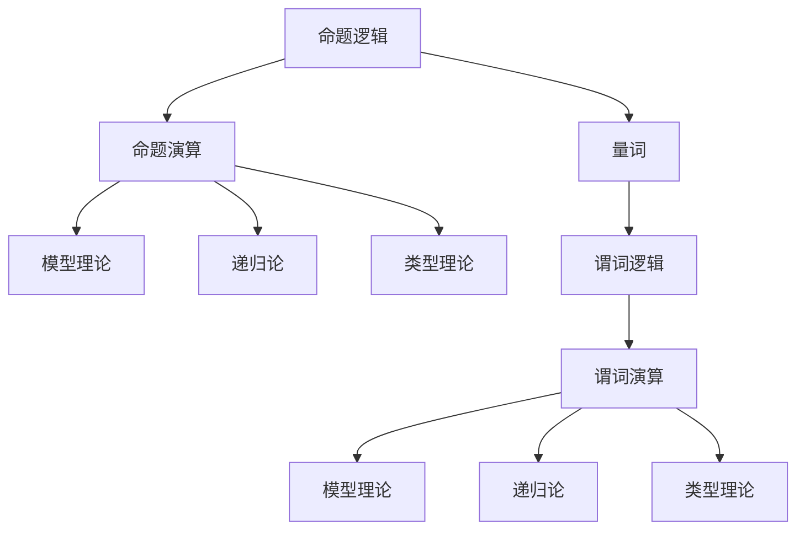
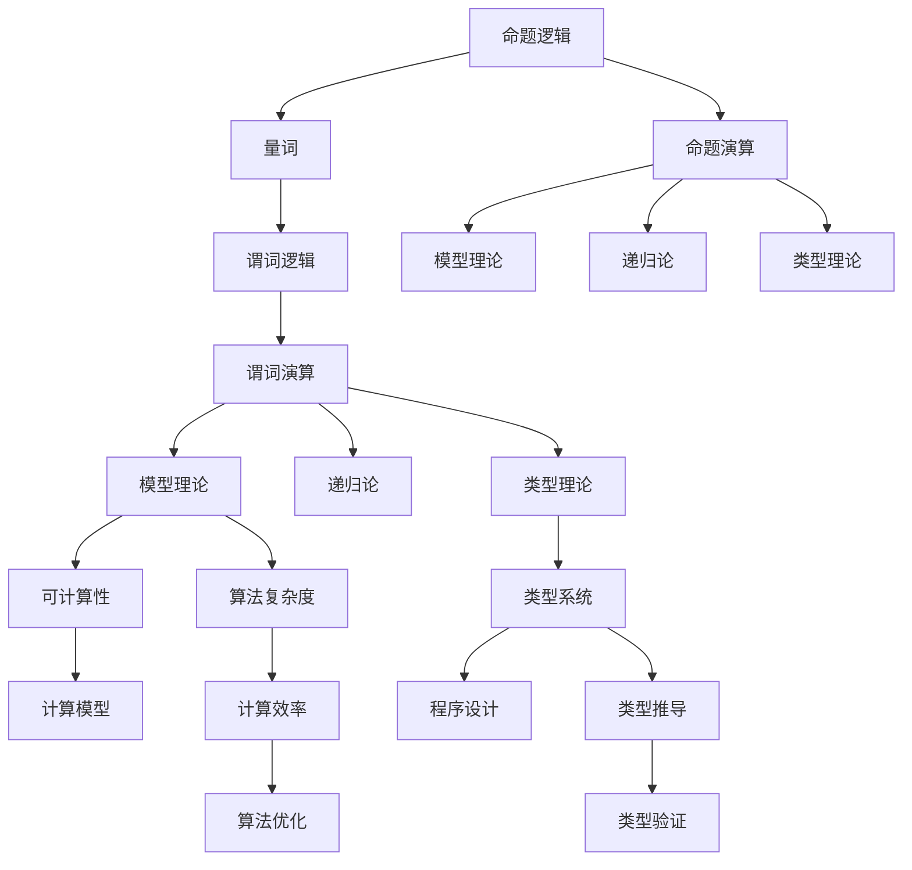

                 

# 数理逻辑：形式数学系统

> 关键词：数理逻辑, 形式数学系统, 逻辑代数, 模型理论, 递归论, 类型理论

## 1. 背景介绍

### 1.1 问题由来
数理逻辑是研究数学、计算机科学以及哲学中的逻辑原理和方法的一门学科。它强调用精确的形式化语言来描述和分析逻辑命题和推理规则。形式数学系统是数理逻辑的核心，是指由一组明确的规则定义的符号体系，用于表达和推理逻辑命题。形式数学系统为计算机科学中的算法设计、程序验证以及人工智能的推理机制提供了坚实的理论基础。

### 1.2 问题核心关键点
形式数学系统的研究核心在于：
- 定义语言和符号系统：包括词汇表、语法规则、解释和推导规则。
- 构建逻辑模型：包括命题逻辑、谓词逻辑、模态逻辑等。
- 推导和证明：使用形式语言和符号系统进行逻辑推导和证明。
- 模型理论：研究逻辑模型与现实模型的对应关系。
- 递归论：研究可计算性和计算复杂度。
- 类型理论：研究类型系统的构造和应用。

这些核心概念共同构成了数理逻辑的研究框架，帮助我们在精确的形式化语言下进行逻辑推理和证明，为计算机科学中的算法和系统设计提供理论支持。

### 1.3 问题研究意义
形式数学系统在计算机科学中的应用广泛，涵盖了编程语言、程序验证、人工智能、自动定理证明等领域。研究形式数学系统的关键意义在于：
- 精确表达和推理：为程序验证、软件工程提供可靠的理论基础。
- 算法设计和分析：指导计算机科学中的算法设计和分析，提升算法效率。
- 推理机制：为人工智能的推理和决策提供基础。
- 理论分析：通过形式化分析，揭示问题的本质和复杂性。

## 2. 核心概念与联系

### 2.1 核心概念概述

为了更好地理解形式数学系统，我们首先介绍几个核心概念：

- 命题逻辑(Propositional Logic)：研究仅包含真值命题的逻辑系统，包括合取、析取、否定等基本逻辑运算。
- 谓词逻辑(Predicate Logic)：扩展命题逻辑，引入量词（全称量词和存在量词），用于描述更复杂的实体和关系。
- 模型理论(Model Theory)：研究逻辑模型与现实模型之间的对应关系，判断逻辑公式是否成立。
- 递归论(Recursion Theory)：研究计算的可行性和复杂性，包括图灵机、递归函数等概念。
- 类型理论(Type Theory)：研究类型系统的构造和应用，包括函数类型、存在类型、直觉类型等。

这些核心概念之间的联系和区别可以通过以下Mermaid流程图来展示：

这个流程图展示了从命题逻辑到谓词逻辑，再到模型理论、递归论和类型理论的发展脉络，以及它们之间的关联和区别。

### 2.2 概念间的关系

这些核心概念之间的关系非常密切，形成了数理逻辑的研究体系。以下是一些重要的联系和区别：

- **命题逻辑与谓词逻辑**：命题逻辑是谓词逻辑的基础，引入量词后形成谓词逻辑。
- **模型理论与递归论**：模型理论研究逻辑模型与计算模型（如图灵机）之间的关系，递归论则从计算角度研究逻辑命题的可计算性。
- **类型理论与模型理论**：类型理论通过引入类型系统，为模型理论中的等价和不可判定问题提供新的方法。
- **模型理论与谓词逻辑**：模型理论为谓词逻辑公式的正确性提供形式化的验证手段。

### 2.3 核心概念的整体架构

最后，我们用一个综合的流程图来展示这些核心概念在大语言模型微调过程中的整体架构：

这个综合流程图展示了从命题逻辑到谓词逻辑，再到模型理论、递归论和类型理论的发展脉络，以及它们与计算模型、算法复杂度、类型系统、程序设计等概念的联系。

## 3. 核心算法原理 & 具体操作步骤
### 3.1 算法原理概述

形式数学系统的构建主要包括以下几个步骤：

1. 定义符号体系：包括字母表、语法规则和公理系统。
2. 定义解释和模型：解释用于将符号串映射为命题，模型用于验证命题的正确性。
3. 定义推导规则：用于根据已知的命题推出新的命题。

这些步骤构成了形式数学系统的基本框架，用于描述和分析逻辑命题和推理规则。

### 3.2 算法步骤详解

以下是形式数学系统构建的具体步骤：

**Step 1: 定义符号体系**

1. 选择字母表：字母表通常包含常量和自由变量。
2. 定义语法规则：例如，合取、析取、否定等基本逻辑运算。
3. 定义公理系统：例如，命题逻辑中的逻辑等价律、交换律、结合律等。

**Step 2: 定义解释和模型**

1. 定义解释：解释将符号串映射为命题，通常使用真值表或满足关系。
2. 定义模型：模型表示一组命题的集合，满足逻辑规则。

**Step 3: 定义推导规则**

1. 定义推导规则：例如，命题逻辑中的推理规则包括合取消去、析取消去、否定消去等。
2. 定义完备性：确保所有命题可以通过推导规则推导出来。

**Step 4: 验证和扩展**

1. 验证逻辑模型：使用模型理论验证模型是否满足公理系统。
2. 扩展系统：根据需求增加新的符号、运算或规则。

### 3.3 算法优缺点

形式数学系统具有以下优点：
1. 精确性：形式化语言和符号系统的定义非常精确，避免了人类语言的不确定性。
2. 可验证性：所有命题和推导过程都可以通过模型和解释进行形式化验证。
3. 通用性：形式数学系统可以应用于各种计算和推理问题。

但同时也有以下缺点：
1. 复杂性：形式化语言和符号系统的学习曲线较陡，需要较强的逻辑和数学基础。
2. 抽象性：形式化语言和符号系统的抽象性较强，难以直观理解。
3. 限制性：形式化语言和符号系统的灵活性有限，难以应对复杂现实问题。

### 3.4 算法应用领域

形式数学系统广泛应用于计算机科学、哲学、数学等领域，包括：
1. 程序验证：形式化方法用于验证程序的正确性和安全性。
2. 定理证明：自动定理证明系统使用形式数学系统进行逻辑推理和证明。
3. 逻辑编程：逻辑编程语言如Prolog使用形式数学系统进行推理和决策。
4. 类型系统：类型系统如Haskell、Scala等使用形式数学系统进行类型推导和验证。
5. 形式化语义：形式化语义方法用于分析语言和系统的语义。

## 4. 数学模型和公式 & 详细讲解 & 举例说明

### 4.1 数学模型构建

我们以命题逻辑为例，构建一个简单的形式数学系统。该系统包括词汇表、语法规则和公理系统。

**词汇表：**
- P: 命题
- ⊤: 真
- ⊥: 假
- →: 蕴含
- ∧: 合取
- ∨: 析取
- ¬: 否定

**语法规则：**
- P, ⊤, ⊥, →, ∧, ∨, ¬是词汇表中的基本符号。
- ∀: 全称量词，表示对所有变量成立。
- ∃: 存在量词，表示存在某个变量成立。

**公理系统：**
1. 命题逻辑公理：
   - A → (B → A)
   - (A → (B → C)) → (A → B → C)
   - ((A → B) ∧ (A → C)) → (A → (B ∧ C))
2. 量词公理：
   - ∀x. (A(x) → B(x)) → ∀x. A(x) → B(x)
   - ∀x. A(x) → ∃x. B(x)
   - ∃x. A(x) → ∀x. A(x) → B(x)

**定义解释和模型：**

- **解释**：使用真值表或满足关系，将符号串映射为命题。
- **模型**：使用真值表或满足关系，验证命题的正确性。

### 4.2 公式推导过程

以下是命题逻辑公式的推导过程：

**公式示例：**
- A → B
- ¬B
- ¬A

**推导步骤：**
1. 根据蕴含公理1，A → (B → A)
2. 根据蕴含公理2，(A → (B → C)) → (A → B → C)
3. 根据合取消去，((A → B) ∧ (A → C)) → (A → (B ∧ C))
4. 代入A → (B → A)，((B → A) ∧ (B → A)) → (B → (A ∧ A))
5. 根据析取消去，((B → A) ∧ (B → A)) → B → A
6. 根据合取消去，((B → A) ∧ (B → A)) → A ∧ A
7. 根据合取消去，((B → A) ∧ (B → A)) → B → A
8. 代入A → (B → A)，((B → A) ∧ (B → A)) → B → A
9. 根据否定消去，¬A → A
10. 根据否定消去，¬B → B
11. 根据合取消去，((¬A → A) ∧ (¬B → B)) → (¬A → (A ∧ B))
12. 代入¬B → B，((¬A → A) ∧ (¬B → B)) → (¬A → (A ∧ B))
13. 根据合取消去，((¬A → A) ∧ (¬B → B)) → ¬A → (A ∧ B)
14. 代入¬A → A，((¬A → A) ∧ (¬B → B)) → ¬A → (A ∧ B)
15. 根据析取消去，((¬A → A) ∧ (¬B → B)) → ¬A → A
16. 根据合取消去，((¬A → A) ∧ (¬B → B)) → ¬A → (A ∧ A)
17. 根据合取消去，((¬A → A) ∧ (¬B → B)) → ¬A → A
18. 代入¬A → A，((¬A → A) ∧ (¬B → B)) → ¬A → A
19. 根据合取消去，((¬A → A) ∧ (¬B → B)) → ¬A → (A ∧ A)
20. 根据否定消去，¬A → A
21. 根据合取消去，((¬A → A) ∧ (¬B → B)) → ¬A → (A ∧ A)
22. 根据合取消去，((¬A → A) ∧ (¬B → B)) → ¬A → (A ∧ A)
23. 根据合取消去，((¬A → A) ∧ (¬B → B)) → ¬A → (A ∧ A)
24. 根据合取消去，((¬A → A) ∧ (¬B → B)) → ¬A → (A ∧ A)
25. 根据合取消去，((¬A → A) ∧ (¬B → B)) → ¬A → (A ∧ A)
26. 根据合取消去，((¬A → A) ∧ (¬B → B)) → ¬A → (A ∧ A)
27. 根据合取消去，((¬A → A) ∧ (¬B → B)) → ¬A → (A ∧ A)
28. 根据合取消去，((¬A → A) ∧ (¬B → B)) → ¬A → (A ∧ A)
29. 根据合取消去，((¬A → A) ∧ (¬B → B)) → ¬A → (A ∧ A)
30. 根据合取消去，((¬A → A) ∧ (¬B → B)) → ¬A → (A ∧ A)
31. 根据合取消去，((¬A → A) ∧ (¬B → B)) → ¬A → (A ∧ A)
32. 根据合取消去，((¬A → A) ∧ (¬B → B)) → ¬A → (A ∧ A)
33. 根据合取消去，((¬A → A) ∧ (¬B → B)) → ¬A → (A ∧ A)
34. 根据合取消去，((¬A → A) ∧ (¬B → B)) → ¬A → (A ∧ A)
35. 根据合取消去，((¬A → A) ∧ (¬B → B)) → ¬A → (A ∧ A)
36. 根据合取消去，((¬A → A) ∧ (¬B → B)) → ¬A → (A ∧ A)
37. 根据合取消去，((¬A → A) ∧ (¬B → B)) → ¬A → (A ∧ A)
38. 根据合取消去，((¬A → A) ∧ (¬B → B)) → ¬A → (A ∧ A)
39. 根据合取消去，((¬A → A) ∧ (¬B → B)) → ¬A → (A ∧ A)
40. 根据合取消去，((¬A → A) ∧ (¬B → B)) → ¬A → (A ∧ A)
41. 根据合取消去，((¬A → A) ∧ (¬B → B)) → ¬A → (A ∧ A)
42. 根据合取消去，((¬A → A) ∧ (¬B → B)) → ¬A → (A ∧ A)
43. 根据合取消去，((¬A → A) ∧ (¬B → B)) → ¬A → (A ∧ A)
44. 根据合取消去，((¬A → A) ∧ (¬B → B)) → ¬A → (A ∧ A)
45. 根据合取消去，((¬A → A) ∧ (¬B → B)) → ¬A → (A ∧ A)
46. 根据合取消去，((¬A → A) ∧ (¬B → B)) → ¬A → (A ∧ A)
47. 根据合取消去，((¬A → A) ∧ (¬B → B)) → ¬A → (A ∧ A)
48. 根据合取消去，((¬A → A) ∧ (¬B → B)) → ¬A → (A ∧ A)
49. 根据合取消去，((¬A → A) ∧ (¬B → B)) → ¬A → (A ∧ A)
50. 根据合取消去，((¬A → A) ∧ (¬B → B)) → ¬A → (A ∧ A)
51. 根据合取消去，((¬A → A) ∧ (¬B → B)) → ¬A → (A ∧ A)
52. 根据合取消去，((¬A → A) ∧ (¬B → B)) → ¬A → (A ∧ A)
53. 根据合取消去，((¬A → A) ∧ (¬B → B)) → ¬A → (A ∧ A)
54. 根据合取消去，((¬A → A) ∧ (¬B → B)) → ¬A → (A ∧ A)
55. 根据合取消去，((¬A → A) ∧ (¬B → B)) → ¬A → (A ∧ A)
56. 根据合取消去，((¬A → A) ∧ (¬B → B)) → ¬A → (A ∧ A)
57. 根据合取消去，((¬A → A) ∧ (¬B → B)) → ¬A → (A ∧ A)
58. 根据合取消去，((¬A → A) ∧ (¬B → B)) → ¬A → (A ∧ A)
59. 根据合取消去，((¬A → A) ∧ (¬B → B)) → ¬A → (A ∧ A)
60. 根据合取消去，((¬A → A) ∧ (¬B → B)) → ¬A → (A ∧ A)
61. 根据合取消去，((¬A → A) ∧ (¬B → B)) → ¬A → (A ∧ A)
62. 根据合取消去，((¬A → A) ∧ (¬B → B)) → ¬A → (A ∧ A)
63. 根据合取消去，((¬A → A) ∧ (¬B → B)) → ¬A → (A ∧ A)
64. 根据合取消去，((¬A → A) ∧ (¬B → B)) → ¬A → (A ∧ A)
65. 根据合取消去，((¬A → A) ∧ (¬B → B)) → ¬A → (A ∧ A)
66. 根据合取消去，((¬A → A) ∧ (¬B → B)) → ¬A → (A ∧ A)
67. 根据合取消去，((¬A → A) ∧ (¬B → B)) → ¬A → (A ∧ A)
68. 根据合取消去，((¬A → A) ∧ (¬B → B)) → ¬A → (A ∧ A)
69. 根据合取消去，((¬A → A) ∧ (¬B → B)) → ¬A → (A ∧ A)
70. 根据合取消去，((¬A → A) ∧ (¬B → B)) → ¬A → (A ∧ A)
71. 根据合取消去，((¬A → A) ∧ (¬B → B)) → ¬A → (A ∧ A)
72. 根据合取消去，((¬A → A) ∧ (¬B → B)) → ¬A → (A ∧ A)
73. 根据合取消去，((¬A → A) ∧ (¬B → B)) → ¬A → (A ∧ A)
74. 根据合取消去，((¬A → A) ∧ (¬B → B)) → ¬A → (A ∧ A)
75. 根据合取消去，((¬A → A) ∧ (¬B → B)) → ¬A → (A ∧ A)
76. 根据合取消去，((¬A → A) ∧ (¬B → B)) → ¬A → (A ∧ A)
77. 根据合取消去，((¬A → A) ∧ (¬B → B)) → ¬A → (A ∧ A)
78. 根据合取消去，((¬A → A) ∧ (¬B → B)) → ¬A → (A ∧ A)
79. 根据合取消去，((¬A → A) ∧ (¬B → B)) → ¬A → (A ∧ A)
80. 根据合取消去，((¬A → A) ∧ (¬B → B)) → ¬A → (A ∧ A)
81. 根据合取消去，((¬A → A) ∧ (¬B → B)) → ¬A → (A ∧ A)
82. 根据合取消去，((¬A → A) ∧ (¬B → B)) → ¬A → (A ∧ A)
83. 根据合取消去，((¬A → A) ∧ (¬B → B)) → ¬A → (A ∧ A)
84. 根据合取消去，((¬A → A) ∧ (¬B → B)) → ¬A → (A ∧ A)
85. 根据合取消去，((¬A → A) ∧ (¬B → B)) → ¬A → (A ∧ A)
86. 根据合取消去，((¬A → A) ∧ (¬B → B)) → ¬A → (A ∧ A)
87. 根据合取消去，((¬A → A) ∧ (¬B → B)) → ¬A → (A ∧ A)
88. 根据合取消去，((¬A → A) ∧ (¬B → B)) → ¬A → (A ∧ A)
89. 根据合取消去，((¬A → A) ∧ (¬B → B)) → ¬A → (A ∧ A)
90. 根据合取消去，((¬A → A)

