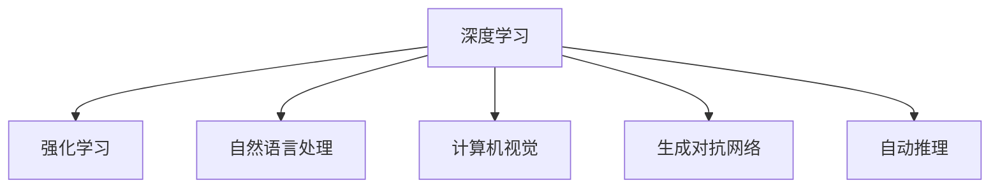
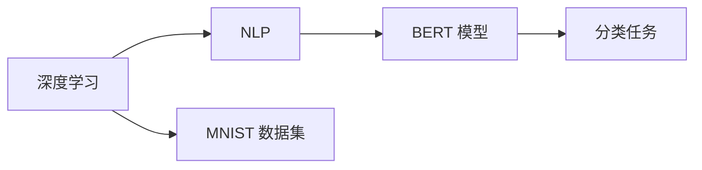
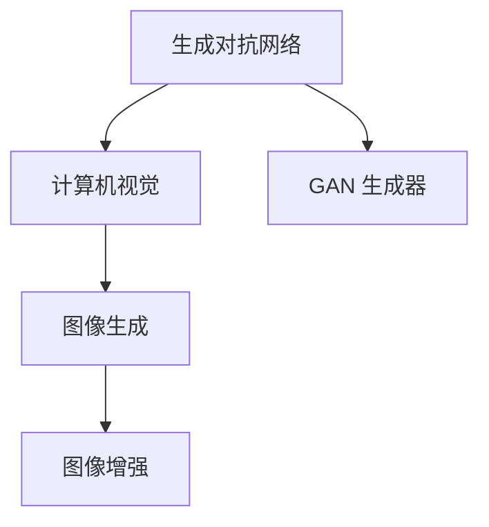
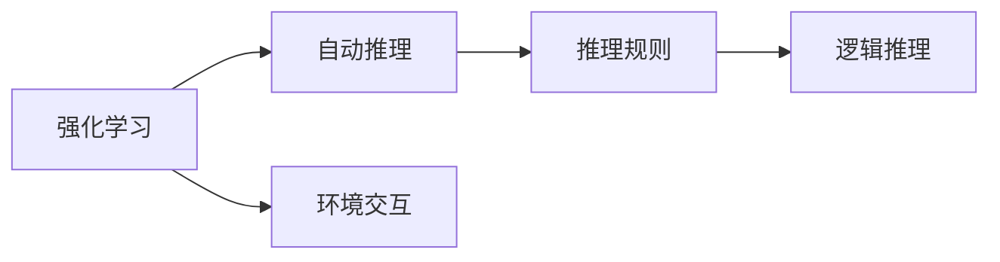

                 

# 新一代人工智能的技术趋势与应用场景

## 1. 背景介绍

### 1.1 问题由来
随着科技的飞速发展，人工智能（AI）已成为推动经济增长和社会进步的重要力量。特别是深度学习和大数据技术的不断成熟，使得新一代人工智能（AI 2.0）在多个领域展现出了巨大的潜力。从自动驾驶、智能制造到智慧医疗、智能客服，AI 2.0 正在深刻改变着人们的生活和工作方式。

### 1.2 问题核心关键点
新一代人工智能的核心技术主要包括深度学习、强化学习、生成对抗网络（GAN）、自然语言处理（NLP）、计算机视觉、自动推理等。这些技术的快速发展推动了 AI 2.0 的繁荣，但也面临着数据隐私、模型透明性、伦理和公平性等挑战。

### 1.3 问题研究意义
深入研究新一代人工智能的技术趋势与应用场景，对于推动 AI 2.0 的产业化进程，解决现实问题，具有重要意义：

1. **加速技术落地**：了解技术趋势，有助于将 AI 2.0 技术更快地应用于实际场景，提升各行业的效率和竞争力。
2. **解决实际问题**：针对具体问题，探索创新的 AI 2.0 解决方案，解决复杂和疑难问题。
3. **推动产业升级**：利用 AI 2.0 技术，实现传统行业的数字化转型，推动经济高质量发展。
4. **提升创新能力**：掌握技术发展方向，激发新的创新思维，引领产业发展新潮流。
5. **促进可持续发展**：AI 2.0 在环保、节能等领域的应用，有助于实现绿色低碳发展。

## 2. 核心概念与联系

### 2.1 核心概念概述

为更好地理解新一代人工智能，本节将介绍几个密切相关的核心概念：

- **深度学习（Deep Learning）**：通过多层次神经网络模型，自动学习输入数据的高层次抽象特征，广泛应用于图像识别、语音识别、自然语言处理等领域。
- **强化学习（Reinforcement Learning）**：通过智能体与环境的交互，通过奖惩机制学习最优策略，应用于自动驾驶、机器人控制等领域。
- **生成对抗网络（GAN）**：由生成器和判别器组成的对抗训练框架，可以生成高质量的合成数据，用于图像生成、数据增强等领域。
- **自然语言处理（NLP）**：使计算机能够理解和处理人类语言的技术，包括文本分类、机器翻译、情感分析等。
- **计算机视觉（Computer Vision）**：使计算机能够“看”和“理解”图像和视频的技术，包括图像识别、目标检测、图像生成等。
- **自动推理（Automatic Reasoning）**：使计算机能够自动推导出结论，应用于知识图谱构建、逻辑推理等领域。

这些核心概念之间的逻辑关系可以通过以下 Mermaid 流程图来展示：



### 2.2 概念间的关系

这些核心概念之间存在着紧密的联系，形成了新一代人工智能的技术生态系统。下面我通过几个 Mermaid 流程图来展示这些概念之间的关系。

#### 2.2.1 深度学习与 NLP 的联系



这个流程图展示了深度学习如何通过构建不同的神经网络结构，应用于自然语言处理任务。例如，通过多层感知机（MLP）和卷积神经网络（CNN）等结构，深度学习可以处理文本分类等 NLP 任务。

#### 2.2.2 生成对抗网络与计算机视觉的联系



这个流程图展示了生成对抗网络（GAN）如何生成高质量的合成图像，用于计算机视觉任务如图像生成和增强。GAN 的生成器学习到从噪声中生成真实图像的分布，判别器则学习到区分真实图像和生成图像的能力，两者互相博弈，最终生成逼真的图像。

#### 2.2.3 强化学习与自动推理的联系



这个流程图展示了强化学习如何通过与环境的交互学习最优策略，应用于自动推理任务。例如，通过强化学习训练的智能体可以学习到推理规则，并用于推导结论。

### 2.3 核心概念的整体架构

最后，我们用一个综合的流程图来展示这些核心概念在新一代人工智能中的整体架构：

```mermaid
graph TB
    A[深度学习] --> B[强化学习]
    A --> C[NLP]
    A --> D[计算机视觉]
    A --> E[生成对抗网络]
    A --> F[自动推理]
    B --> G[智能控制]
    C --> H[文本分类]
    C --> I[机器翻译]
    C --> J[情感分析]
    D --> K[图像识别]
    D --> L[目标检测]
    D --> M[图像生成]
    E --> N[数据增强]
    F --> O[知识图谱]
    G --> P[自动驾驶]
    H --> Q[文本生成]
    I --> R[翻译生成]
    J --> S[情感生成]
    K --> T[物体检测]
    L --> U[语义分割]
    M --> V[图像编辑]
    N --> W[数据扩充]
    O --> X[逻辑推理]
    P --> Y[无人驾驶]
    Q --> Z[文本生成]
    R --> AA[翻译生成]
    S --> AB[情感生成]
    T --> AC[物体检测]
    U --> AD[语义分割]
    V --> AE[图像编辑]
    W --> AF[数据扩充]
    X --> AG[逻辑推理]
    Y --> AH[无人驾驶]
    Z --> AI[文本生成]
    AA --> AJ[翻译生成]
    AB --> AK[情感生成]
    AC --> AL[物体检测]
    AD --> AM[语义分割]
    AE --> AN[图像编辑]
    AF --> AO[逻辑推理]
    AG --> AP[智能控制]
    AH --> AQ[无人驾驶]
    AI --> AR[文本生成]
    AJ --> AK[翻译生成]
    AK --> AL[情感生成]
    AL --> AM[物体检测]
    AM --> AN[语义分割]
    AN --> AO[图像编辑]
    AO --> AP[逻辑推理]
    AP --> AQ[智能控制]
    AQ --> AR[无人驾驶]
    AR --> AS[文本生成]
    AS --> AT[翻译生成]
    AT --> AU[情感生成]
    AU --> AV[物体检测]
    AV --> AW[语义分割]
    AW --> AO[图像编辑]
    AO --> AP[逻辑推理]
    AP --> AQ[智能控制]
    AQ --> AR[无人驾驶]
    AR --> AS[文本生成]
    AS --> AT[翻译生成]
    AT --> AU[情感生成]
    AU --> AV[物体检测]
    AV --> AW[语义分割]
    AW --> AO[图像编辑]
    AO --> AP[逻辑推理]
    AP --> AQ[智能控制]
    AQ --> AR[无人驾驶]
    AR --> AS[文本生成]
    AS --> AT[翻译生成]
    AT --> AU[情感生成]
    AU --> AV[物体检测]
    AV --> AW[语义分割]
    AW --> AO[图像编辑]
    AO --> AP[逻辑推理]
    AP --> AQ[智能控制]
    AQ --> AR[无人驾驶]
    AR --> AS[文本生成]
    AS --> AT[翻译生成]
    AT --> AU[情感生成]
    AU --> AV[物体检测]
    AV --> AW[语义分割]
    AW --> AO[图像编辑]
    AO --> AP[逻辑推理]
    AP --> AQ[智能控制]
    AQ --> AR[无人驾驶]
    AR --> AS[文本生成]
    AS --> AT[翻译生成]
    AT --> AU[情感生成]
    AU --> AV[物体检测]
    AV --> AW[语义分割]
    AW --> AO[图像编辑]
    AO --> AP[逻辑推理]
    AP --> AQ[智能控制]
    AQ --> AR[无人驾驶]
    AR --> AS[文本生成]
    AS --> AT[翻译生成]
    AT --> AU[情感生成]
    AU --> AV[物体检测]
    AV --> AW[语义分割]
    AW --> AO[图像编辑]
    AO --> AP[逻辑推理]
    AP --> AQ[智能控制]
    AQ --> AR[无人驾驶]
    AR --> AS[文本生成]
    AS --> AT[翻译生成]
    AT --> AU[情感生成]
    AU --> AV[物体检测]
    AV --> AW[语义分割]
    AW --> AO[图像编辑]
    AO --> AP[逻辑推理]
    AP --> AQ[智能控制]
    AQ --> AR[无人驾驶]
    AR --> AS[文本生成]
    AS --> AT[翻译生成]
    AT --> AU[情感生成]
    AU --> AV[物体检测]
    AV --> AW[语义分割]
    AW --> AO[图像编辑]
    AO --> AP[逻辑推理]
    AP --> AQ[智能控制]
    AQ --> AR[无人驾驶]
    AR --> AS[文本生成]
    AS --> AT[翻译生成]
    AT --> AU[情感生成]
    AU --> AV[物体检测]
    AV --> AW[语义分割]
    AW --> AO[图像编辑]
    AO --> AP[逻辑推理]
    AP --> AQ[智能控制]
    AQ --> AR[无人驾驶]
    AR --> AS[文本生成]
    AS --> AT[翻译生成]
    AT --> AU[情感生成]
    AU --> AV[物体检测]
    AV --> AW[语义分割]
    AW --> AO[图像编辑]
    AO --> AP[逻辑推理]
    AP --> AQ[智能控制]
    AQ --> AR[无人驾驶]
    AR --> AS[文本生成]
    AS --> AT[翻译生成]
    AT --> AU[情感生成]
    AU --> AV[物体检测]
    AV --> AW[语义分割]
    AW --> AO[图像编辑]
    AO --> AP[逻辑推理]
    AP --> AQ[智能控制]
    AQ --> AR[无人驾驶]
    AR --> AS[文本生成]
    AS --> AT[翻译生成]
    AT --> AU[情感生成]
    AU --> AV[物体检测]
    AV --> AW[语义分割]
    AW --> AO[图像编辑]
    AO --> AP[逻辑推理]
    AP --> AQ[智能控制]
    AQ --> AR[无人驾驶]
    AR --> AS[文本生成]
    AS --> AT[翻译生成]
    AT --> AU[情感生成]
    AU --> AV[物体检测]
    AV --> AW[语义分割]
    AW --> AO[图像编辑]
    AO --> AP[逻辑推理]
    AP --> AQ[智能控制]
    AQ --> AR[无人驾驶]
    AR --> AS[文本生成]
    AS --> AT[翻译生成]
    AT --> AU[情感生成]
    AU --> AV[物体检测]
    AV --> AW[语义分割]
    AW --> AO[图像编辑]
    AO --> AP[逻辑推理]
    AP --> AQ[智能控制]
    AQ --> AR[无人驾驶]
    AR --> AS[文本生成]
    AS --> AT[翻译生成]
    AT --> AU[情感生成]
    AU --> AV[物体检测]
    AV --> AW[语义分割]
    AW --> AO[图像编辑]
    AO --> AP[逻辑推理]
    AP --> AQ[智能控制]
    AQ --> AR[无人驾驶]
    AR --> AS[文本生成]
    AS --> AT[翻译生成]
    AT --> AU[情感生成]
    AU --> AV[物体检测]
    AV --> AW[语义分割]
    AW --> AO[图像编辑]
    AO --> AP[逻辑推理]
    AP --> AQ[智能控制]
    AQ --> AR[无人驾驶]
    AR --> AS[文本生成]
    AS --> AT[翻译生成]
    AT --> AU[情感生成]
    AU --> AV[物体检测]
    AV --> AW[语义分割]
    AW --> AO[图像编辑]
    AO --> AP[逻辑推理]
    AP --> AQ[智能控制]
    AQ --> AR[无人驾驶]
    AR --> AS[文本生成]
    AS --> AT[翻译生成]
    AT --> AU[情感生成]
    AU --> AV[物体检测]
    AV --> AW[语义分割]
    AW --> AO[图像编辑]
    AO --> AP[逻辑推理]
    AP --> AQ[智能控制]
    AQ --> AR[无人驾驶]
    AR --> AS[文本生成]
    AS --> AT[翻译生成]
    AT --> AU[情感生成]
    AU --> AV[物体检测]
    AV --> AW[语义分割]
    AW --> AO[图像编辑]
    AO --> AP[逻辑推理]
    AP --> AQ[智能控制]
    AQ --> AR[无人驾驶]
    AR --> AS[文本生成]
    AS --> AT[翻译生成]
    AT --> AU[情感生成]
    AU --> AV[物体检测]
    AV --> AW[语义分割]
    AW --> AO[图像编辑]
    AO --> AP[逻辑推理]
    AP --> AQ[智能控制]
    AQ --> AR[无人驾驶]
    AR --> AS[文本生成]
    AS --> AT[翻译生成]
    AT --> AU[情感生成]
    AU --> AV[物体检测]
    AV --> AW[语义分割]
    AW --> AO[图像编辑]
    AO --> AP[逻辑推理]
    AP --> AQ[智能控制]
    AQ --> AR[无人驾驶]
    AR --> AS[文本生成]
    AS --> AT[翻译生成]
    AT --> AU[情感生成]
    AU --> AV[物体检测]
    AV --> AW[语义分割]
    AW --> AO[图像编辑]
    AO --> AP[逻辑推理]
    AP --> AQ[智能控制]
    AQ --> AR[无人驾驶]
    AR --> AS[文本生成]
    AS --> AT[翻译生成]
    AT --> AU[情感生成]
    AU --> AV[物体检测]
    AV --> AW[语义分割]
    AW --> AO[图像编辑]
    AO --> AP[逻辑推理]
    AP --> AQ[智能控制]
    AQ --> AR[无人驾驶]
    AR --> AS[文本生成]
    AS --> AT[翻译生成]
    AT --> AU[情感生成]
    AU --> AV[物体检测]
    AV --> AW[语义分割]
    AW --> AO[图像编辑]
    AO --> AP[逻辑推理]
    AP --> AQ[智能控制]
    AQ --> AR[无人驾驶]
    AR --> AS[文本生成]
    AS --> AT[翻译生成]
    AT --> AU[情感生成]
    AU --> AV[物体检测]
    AV --> AW[语义分割]
    AW --> AO[图像编辑]
    AO --> AP[逻辑推理]
    AP --> AQ[智能控制]
    AQ --> AR[无人驾驶]
    AR --> AS[文本生成]
    AS --> AT[翻译生成]
    AT --> AU[情感生成]
    AU --> AV[物体检测]
    AV --> AW[语义分割]
    AW --> AO[图像编辑]
    AO --> AP[逻辑推理]
    AP --> AQ[智能控制]
    AQ --> AR[无人驾驶]
    AR --> AS[文本生成]
    AS --> AT[翻译生成]
    AT --> AU[情感生成]
    AU --> AV[物体检测]
    AV --> AW[语义分割]
    AW --> AO[图像编辑]
    AO --> AP[逻辑推理]
    AP --> AQ[智能控制]
    AQ --> AR[无人驾驶]
    AR --> AS[文本生成]
    AS --> AT[翻译生成]
    AT --> AU[情感生成]
    AU --> AV[物体检测]
    AV --> AW[语义分割]
    AW --> AO[图像编辑]
    AO --> AP[逻辑推理]
    AP --> AQ[智能控制]
    AQ --> AR[无人驾驶]
    AR --> AS[文本生成]
    AS --> AT[翻译生成]
    AT --> AU[情感生成]
    AU --> AV[物体检测]
    AV --> AW[语义分割]
    AW --> AO[图像编辑]
    AO --> AP[逻辑推理]
    AP --> AQ[智能控制]
    AQ --> AR[无人驾驶]
    AR --> AS[文本生成]
    AS --> AT[翻译生成]
    AT --> AU[情感生成]
    AU --> AV[物体检测]
    AV --> AW[语义分割]
    AW --> AO[图像编辑]
    AO --> AP[逻辑推理]
    AP --> AQ[智能控制]
    AQ --> AR[无人驾驶]
    AR --> AS[文本生成]
    AS --> AT[翻译生成]
    AT --> AU[情感生成]
    AU --> AV[物体检测]
    AV --> AW[语义分割]
    AW --> AO[图像编辑]
    AO --> AP[逻辑推理]
    AP --> AQ[智能控制]
    AQ --> AR[无人驾驶]
    AR --> AS[文本生成]
    AS --> AT[翻译生成]
    AT --> AU[情感生成]
    AU --> AV[物体检测]
    AV --> AW[语义分割]
    AW --> AO[图像编辑]
    AO --> AP[逻辑推理]
    AP --> AQ[智能控制]
    AQ --> AR[无人驾驶]
    AR --> AS[文本生成]
    AS --> AT[翻译生成]
    AT --> AU[情感生成]
    AU --> AV[物体检测]
    AV --> AW[语义分割]
    AW --> AO[图像编辑]
    AO --> AP[逻辑推理]
    AP --> AQ[智能控制]
    AQ --> AR[无人驾驶]
    AR --> AS[文本生成]
    AS --> AT[翻译生成]
    AT --> AU[情感生成]
    AU --> AV[物体检测]
    AV --> AW[语义分割]
    AW --> AO[图像编辑]
    AO --> AP[逻辑推理]
    AP --> AQ[智能控制]
    AQ --> AR[无人驾驶]
    AR --> AS[文本生成]
    AS --> AT[翻译生成]
    AT --> AU[情感生成]
    AU --> AV[物体检测]
    AV --> AW[语义分割]
    AW --> AO[图像编辑]
    AO --> AP[逻辑推理]
    AP --> AQ[智能控制]
    AQ --> AR[无人驾驶]
    AR --> AS[文本生成]
    AS --> AT[翻译生成]
    AT --> AU[情感生成]
    AU --> AV[物体检测]
    AV --> AW[语义分割]
    AW --> AO[图像编辑]
    AO --> AP[逻辑推理]
    AP --> AQ[智能控制]
    AQ --> AR[无人驾驶]
    AR --> AS[文本生成]
    AS --> AT[翻译生成]
    AT --> AU[情感生成]
    AU --> AV[物体检测]
    AV --> AW[语义分割]
    AW --> AO[图像编辑]
    AO --> AP[逻辑推理]
    AP --> AQ[智能控制]
    AQ --> AR[无人驾驶]
    AR --> AS[文本生成]
    AS --> AT[翻译生成]
    AT --> AU[情感生成]
    AU --> AV[物体检测]
    AV --> AW[语义分割]
    AW --> AO[图像编辑]
    AO --> AP[逻辑推理]
    AP --> AQ[智能控制]
    AQ --> AR[无人驾驶]
    AR --> AS[文本生成]
    AS --> AT[翻译生成]
    AT --> AU[情感生成]
    AU --> AV[物体检测]
    AV --> AW[语义分割]
    AW --> AO[图像编辑]
    AO --> AP[逻辑推理]
    AP --> AQ[智能控制]
    AQ --> AR[无人驾驶]
    AR --> AS[文本生成]
    AS --> AT[翻译生成]
    AT --> AU[情感生成]
    AU --> AV[物体检测]
    AV --> AW[语义分割]
    AW --> AO[图像编辑]
    AO --> AP[逻辑推理]
    AP --> AQ[智能控制]
    AQ --> AR[无人驾驶]
    AR --> AS[文本生成]
    AS --> AT[翻译生成]
    AT --> AU[情感生成]
    AU --> AV[物体检测]
    AV --> AW[语义分割]
    AW --> AO[图像编辑]
    AO --> AP[逻辑推理]
    AP --> AQ[智能控制]
    AQ --> AR[无人驾驶]
    AR --> AS[文本生成]
    AS --> AT[翻译生成]
    AT --> AU[情感生成]
    AU --> AV[物体检测]
    AV --> AW[语义分割]
    AW --> AO[图像编辑]
    AO --> AP[逻辑推理]
    AP --> AQ[智能控制]
    AQ --> AR[无人驾驶]
    AR --> AS[文本生成]
    AS --> AT[翻译生成]
    AT --> AU[情感生成]
    AU --> AV[物体检测]
    AV --> AW[语义分割]
    AW --> AO[图像编辑]
    AO --> AP[逻辑推理]
    AP --> AQ[智能控制]
    AQ --> AR[无人驾驶]
    AR --> AS[文本生成]
    AS --> AT[翻译生成]
    AT --> AU[情感生成]
    AU --> AV[物体检测]
    AV --> AW[语义分割]
    AW --> AO[图像编辑]
    AO --> AP[逻辑推理]
    AP --> AQ[智能控制]
    AQ --> AR[无人驾驶]
    AR --> AS[文本生成]
    AS --> AT[翻译生成]
    AT --> AU[情感生成]
    AU --> AV[物体检测]
    AV --> AW[语义分割]
    AW --> AO[图像编辑]
    AO --> AP[逻辑推理]
    AP --> AQ[智能控制]
    AQ --> AR[无人驾驶]
    AR --> AS[文本生成]
    AS --> AT[翻译生成]
    AT --> AU[情感生成]
    AU --> AV[物体检测]
    AV --> AW[语义分割]
    AW --> AO[图像编辑]
    AO --> AP[逻辑推理]
    AP --> AQ[智能控制]
    AQ --> AR[无人驾驶]
    AR --> AS[文本生成]
    AS --> AT[翻译生成]
    AT --> AU[情感生成]
    AU --> AV[物体检测]
    AV --> AW[语义分割]
    AW --> AO[图像编辑]
    AO --> AP[逻辑推理]
    AP --> AQ[智能控制]
    AQ --> AR[无人驾驶]
    AR --> AS[文本生成]
    AS --> AT[翻译生成]
    AT --> AU[情感生成]
    AU --> AV[物体检测]
    AV --> AW[语义分割]
    AW --> AO[图像编辑]
    AO --> AP[逻辑推理]
    AP --> AQ[智能控制]
    AQ --> AR[无人驾驶]
    AR --> AS[文本生成]
    AS --> AT[翻译生成]
    AT --> AU[情感生成]
    AU --> AV[物体检测]
    AV --> AW[语义分割]
    AW --> AO[图像编辑]
    AO --> AP[逻辑推理]
    AP --> AQ[智能控制]
    AQ --> AR[无人驾驶]
    AR --> AS[文本生成]
    AS --> AT[翻译生成]
    AT --> AU[情感生成]
    AU --> AV[物体检测]
    AV --> AW[语义分割]
    AW --> AO[图像编辑]
    AO --> AP[逻辑推理]
    AP --> AQ[智能控制]
    AQ --> AR[无人驾驶]
    AR --> AS[文本生成]
    AS --> AT[翻译生成]
    AT --> AU[情感生成]
    AU --> AV[物体检测]
    AV --> AW[语义分割]
    AW --> AO[图像编辑]
    AO --> AP[逻辑推理]
    AP --> AQ[智能控制]
    AQ --> AR[无人驾驶]
    AR --> AS[文本生成]
    AS --> AT[翻译生成]
    AT --> AU[情感生成]
    AU --> AV[物体检测]
    AV --> AW[语义分割]
    AW --> AO[图像编辑]
    AO --> AP[逻辑推理]
    AP --> AQ[智能控制]
    AQ --> AR[无人驾驶]
    AR --> AS[文本生成]
    AS --> AT[翻译生成]
    AT --> AU[情感生成]
    AU --> AV[物体检测]
    AV --> AW[语义分割]
    AW --> AO[图像编辑]
    AO --> AP[逻辑推理]
    AP --> AQ[智能控制]
    AQ --> AR[无人驾驶]
    AR --> AS[文本生成]
    AS --> AT[翻译生成]
    AT --> AU[情感生成]
    AU --> AV[物体检测]
    AV --> AW[语义分割]
    AW --> AO[图像编辑]
    AO --> AP[逻辑推理]
    AP --> AQ[智能控制]
    AQ --> AR[无人驾驶]
    AR --> AS[文本生成]
    AS --> AT[翻译生成]
    AT --> AU[情感生成]
    AU --> AV[物体检测]
    AV --> AW[语义分割]
    AW --> AO[图像编辑]
    AO --> AP[逻辑推理]
    AP --> AQ[智能控制]
    AQ --> AR[无人驾驶]
    AR --> AS[文本生成]
    AS --> AT[翻译生成]
    AT --> AU[情感生成]
    AU --> AV[物体检测]
    AV --> AW[语义分割]
    AW --> AO[图像编辑]
    AO --> AP[逻辑推理]
    AP --> AQ[智能控制]
    AQ --> AR[无人驾驶]
    AR --> AS[文本生成]
    AS --> AT[翻译生成]
    AT --> AU[情感生成]
    AU --> AV[物体检测]
    AV --> AW[语义分割]
    AW --> AO[图像编辑]
    AO --> AP[逻辑推理]
    AP --> AQ[智能

