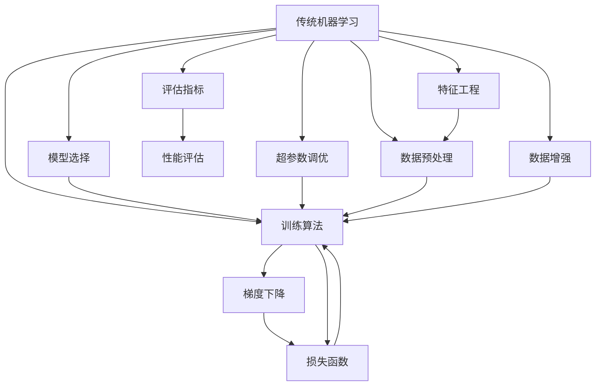

                 

## 1. 背景介绍

在过去的几十年里，人工智能(AI)技术栈经历了从传统机器学习(ML)到深度学习(Deep Learning, DL)，再到最新的AI模型和框架的发展。随着硬件计算能力的提升和数据量的激增，AI技术栈不断演进，为解决更复杂的实际问题提供了更强大的工具。然而，随着AI技术栈的升级，一些关键的工程实践和理论方法也发生了显著变化。本文将从背景介绍、核心概念与联系、核心算法原理、实际操作、应用领域、数学模型、项目实践、实际应用场景、工具和资源推荐、未来趋势与挑战等多个方面，深入比较新旧AI技术栈之间的区别，以期为读者提供全面的理解。

## 2. 核心概念与联系

### 2.1 核心概念概述

**1. 传统机器学习与深度学习**
- **传统机器学习(ML)**：基于统计学和数学模型，以特征工程、模型选择和超参数调优为核心。典型的ML算法包括线性回归、逻辑回归、决策树、支持向量机等。
- **深度学习(DL)**：基于神经网络结构，可以自动学习输入数据的特征表示。DL模型包括卷积神经网络(CNN)、循环神经网络(RNN)、自编码器(AE)、生成对抗网络(GAN)等。

**2. 现代AI模型**
- **大语言模型(Large Language Models, LLMs)**：如GPT-3、BERT等，使用自回归或自编码架构，通过大规模无标签文本预训练学习语言知识，然后在特定任务上微调获得优异的性能。
- **迁移学习(Transfer Learning)**：利用已有知识在新任务上进行微调，提升模型性能。包括预训练模型、微调、零样本学习、少样本学习等。
- **参数高效微调(Parameter-Efficient Fine-Tuning, PEFT)**：只更新预训练模型的少量参数，减少计算资源消耗。
- **提示学习(Prompt Learning)**：通过精心设计的输入模板，引导模型输出特定结果，实现零样本或少样本学习。

**3. 框架和库**
- **TensorFlow、PyTorch**：两大主流深度学习框架，提供高效的计算图和自动微分功能，支持多种模型和算法。
- **Keras**：基于TensorFlow和Theano的高级神经网络API，提供快速模型构建和训练接口。
- **PyTorch Lightning、Flax**：新兴的轻量级深度学习框架，提供易用性和高性能计算能力。

### 2.2 核心概念的关系

以下是Mermaid流程图，展示传统ML、深度学习和新AI模型之间的关系：



## 3. 核心算法原理 & 具体操作步骤

### 3.1 算法原理概述

#### 3.1.1 传统机器学习算法
- **线性回归**：通过最小二乘法拟合线性方程，解决回归问题。公式如下：
  $$
  y = w_0 + w_1x_1 + w_2x_2 + ... + w_nx_n
  $$
  其中，$y$为输出，$x_1, x_2, ..., x_n$为输入特征，$w_0, w_1, ..., w_n$为模型权重。

- **逻辑回归**：使用sigmoid函数将线性输出映射到$[0,1]$区间，用于分类问题。公式如下：
  $$
  \hat{y} = \frac{1}{1 + e^{-(w_0 + w_1x_1 + w_2x_2 + ... + w_nx_n)}}
  $$
  其中，$\hat{y}$为预测概率。

- **决策树**：通过树形结构对数据进行分割，直到达到最优决策边界。

#### 3.1.2 深度学习算法
- **卷积神经网络(CNN)**：通过卷积层提取空间特征，池化层降低维度，全连接层进行分类。公式如下：
  $$
  y = \sum_{i=1}^n w_i f(x_i)
  $$
  其中，$f(x_i)$为卷积层输出，$w_i$为全连接层权重。

- **循环神经网络(RNN)**：通过时间维度上的循环结构处理序列数据。公式如下：
  $$
  h_t = f(h_{t-1}, x_t)
  $$
  其中，$h_t$为当前时刻的隐藏状态，$x_t$为当前输入，$f$为隐藏状态更新函数。

- **自编码器(AE)**：通过编码器将输入映射到低维空间，通过解码器将低维表示映射回输入空间。公式如下：
  $$
  z = \sum_{i=1}^n w_i f(x_i)
  $$
  $$
  y = \sum_{j=1}^m v_j g(z)
  $$
  其中，$z$为编码器输出，$w_i, v_j$为解码器权重，$g$为解码器激活函数。

#### 3.1.3 大语言模型算法
- **GPT**：使用自回归结构，通过大规模无标签文本预训练学习语言知识，然后针对特定任务进行微调。公式如下：
  $$
  p(y|x) = \prod_{i=1}^n \frac{e^{w_ix_i}}{\sum_{j=1}^n e^{w_jx_j}}
  $$
  其中，$y$为输出序列，$x$为输入序列，$w_i$为模型参数。

- **BERT**：使用自编码结构，通过掩码语言模型和下一句预测任务进行预训练。公式如下：
  $$
  p(y|x) = \prod_{i=1}^n \frac{e^{w_ix_i}}{\sum_{j=1}^n e^{w_jx_j}}
  $$

### 3.2 算法步骤详解

#### 3.2.1 传统机器学习步骤
1. **数据预处理**：清洗、归一化、特征提取。
2. **模型选择**：选择适合问题的模型，如线性回归、逻辑回归、决策树等。
3. **训练算法**：使用梯度下降等优化算法更新模型参数。
4. **评估指标**：选择如准确率、精确率、召回率、F1-score等指标评估模型性能。
5. **超参数调优**：使用网格搜索、随机搜索、贝叶斯优化等方法调优模型超参数。

#### 3.2.2 深度学习步骤
1. **数据预处理**：清洗、归一化、特征提取。
2. **模型选择**：选择适合问题的神经网络模型，如CNN、RNN、AE等。
3. **训练算法**：使用梯度下降等优化算法更新模型参数。
4. **评估指标**：选择如准确率、精确率、召回率、F1-score等指标评估模型性能。
5. **超参数调优**：使用网格搜索、随机搜索、贝叶斯优化等方法调优模型超参数。

#### 3.2.3 大语言模型步骤
1. **数据预处理**：清洗、归一化、特征提取。
2. **预训练模型选择**：选择合适的预训练模型，如BERT、GPT等。
3. **微调算法**：使用梯度下降等优化算法更新模型参数。
4. **评估指标**：选择如BLEU、ROUGE等指标评估模型性能。
5. **超参数调优**：使用网格搜索、随机搜索、贝叶斯优化等方法调优模型超参数。

### 3.3 算法优缺点

#### 3.3.1 传统机器学习
- **优点**：
  - 方法论成熟，容易理解和实现。
  - 对于小规模数据集效果显著。
  - 可解释性强，容易调试和优化。

- **缺点**：
  - 特征工程复杂，需要大量专家知识。
  - 对数据量和特征要求较高，数据收集成本大。
  - 模型复杂度低，难以应对复杂多变的实际问题。

#### 3.3.2 深度学习
- **优点**：
  - 自动提取特征，减少特征工程需求。
  - 模型复杂度高，适合处理大规模数据和复杂问题。
  - 学习能力强，能够捕捉数据中的非线性关系。

- **缺点**：
  - 训练复杂度高，计算资源消耗大。
  - 模型可解释性差，难以理解内部工作机制。
  - 对抗样本敏感，模型鲁棒性不足。

#### 3.3.3 大语言模型
- **优点**：
  - 预训练能力强，能自动学习语言知识。
  - 微调灵活，适应性强，可以处理多领域任务。
  - 参数高效微调技术，减少计算资源消耗。

- **缺点**：
  - 预训练和微调所需数据量大，获取成本高。
  - 模型复杂度高，训练和推理速度慢。
  - 对抗样本和噪声敏感，鲁棒性有待提高。

### 3.4 算法应用领域

- **传统机器学习**：适用于数据量较小、特征工程难度较低的问题，如金融风控、医疗诊断等。
- **深度学习**：适用于大规模数据集和复杂问题，如图像识别、自然语言处理等。
- **大语言模型**：适用于各类自然语言处理任务，如图案生成、语言翻译、智能问答等。

## 4. 数学模型和公式 & 详细讲解 & 举例说明

### 4.1 数学模型构建

#### 4.1.1 传统机器学习
- **线性回归模型**：
  $$
  y = w_0 + w_1x_1 + w_2x_2 + ... + w_nx_n
  $$

- **逻辑回归模型**：
  $$
  \hat{y} = \frac{1}{1 + e^{-(w_0 + w_1x_1 + w_2x_2 + ... + w_nx_n)}}
  $$

- **决策树模型**：
  $$
  h_t = f(h_{t-1}, x_t)
  $$

#### 4.1.2 深度学习
- **卷积神经网络**：
  $$
  y = \sum_{i=1}^n w_i f(x_i)
  $$

- **循环神经网络**：
  $$
  h_t = f(h_{t-1}, x_t)
  $$

- **自编码器**：
  $$
  z = \sum_{i=1}^n w_i f(x_i)
  $$
  $$
  y = \sum_{j=1}^m v_j g(z)
  $$

#### 4.1.3 大语言模型
- **GPT模型**：
  $$
  p(y|x) = \prod_{i=1}^n \frac{e^{w_ix_i}}{\sum_{j=1}^n e^{w_jx_j}}
  $$

- **BERT模型**：
  $$
  p(y|x) = \prod_{i=1}^n \frac{e^{w_ix_i}}{\sum_{j=1}^n e^{w_jx_j}}
  $$

### 4.2 公式推导过程

#### 4.2.1 传统机器学习公式推导
- **线性回归公式推导**：
  $$
  y = w_0 + w_1x_1 + w_2x_2 + ... + w_nx_n
  $$

- **逻辑回归公式推导**：
  $$
  \hat{y} = \frac{1}{1 + e^{-(w_0 + w_1x_1 + w_2x_2 + ... + w_nx_n)}}
  $$

- **决策树公式推导**：
  $$
  h_t = f(h_{t-1}, x_t)
  $$

#### 4.2.2 深度学习公式推导
- **卷积神经网络公式推导**：
  $$
  y = \sum_{i=1}^n w_i f(x_i)
  $$

- **循环神经网络公式推导**：
  $$
  h_t = f(h_{t-1}, x_t)
  $$

- **自编码器公式推导**：
  $$
  z = \sum_{i=1}^n w_i f(x_i)
  $$
  $$
  y = \sum_{j=1}^m v_j g(z)
  $$

#### 4.2.3 大语言模型公式推导
- **GPT模型公式推导**：
  $$
  p(y|x) = \prod_{i=1}^n \frac{e^{w_ix_i}}{\sum_{j=1}^n e^{w_jx_j}}
  $$

- **BERT模型公式推导**：
  $$
  p(y|x) = \prod_{i=1}^n \frac{e^{w_ix_i}}{\sum_{j=1}^n e^{w_jx_j}}
  $$

### 4.3 案例分析与讲解

#### 4.3.1 传统机器学习案例
假设有一个房价预测任务，需要预测给定房屋的售价。我们收集了若干房屋面积、卧室数量、卫生间数量等特征，并通过这些特征构建线性回归模型：
$$
y = w_0 + w_1x_1 + w_2x_2 + w_3x_3
$$
其中，$y$为房价，$x_1$、$x_2$、$x_3$分别为房屋面积、卧室数量和卫生间数量，$w_0$、$w_1$、$w_2$、$w_3$为模型权重。

通过收集大量房屋数据，进行特征工程和模型训练，我们可以得到一组最优的模型参数，用于新房屋的房价预测。

#### 4.3.2 深度学习案例
假设有一个手写数字识别任务，需要识别手写数字图像并输出对应的数字。我们使用MNIST数据集，构建卷积神经网络模型：
$$
y = \sum_{i=1}^n w_i f(x_i)
$$
其中，$y$为输出数字，$x_i$为输入图像特征，$f(x_i)$为卷积层输出，$w_i$为全连接层权重。

通过收集大量手写数字图像数据，进行模型训练，我们可以得到一组最优的模型参数，用于识别新的手写数字图像。

#### 4.3.3 大语言模型案例
假设有一个文本生成任务，需要生成一篇描述某个产品的详细说明书。我们收集了若干产品说明书，并使用GPT模型进行预训练和微调：
$$
p(y|x) = \prod_{i=1}^n \frac{e^{w_ix_i}}{\sum_{j=1}^n e^{w_jx_j}}
$$
其中，$y$为输出文本，$x$为输入文本，$w_i$为模型参数。

通过收集大量产品说明书数据，进行预训练和微调，我们可以得到一组最优的模型参数，用于生成新产品的说明书。

## 5. 项目实践：代码实例和详细解释说明

### 5.1 开发环境搭建

为了实践上述模型，我们需要准备好Python环境和深度学习框架。以下是搭建开发环境的详细步骤：

1. **安装Python和pip**：
   ```bash
   sudo apt-get install python3 python3-pip
   ```

2. **创建虚拟环境**：
   ```bash
   python3 -m venv myenv
   source myenv/bin/activate
   ```

3. **安装深度学习框架**：
   ```bash
   pip install tensorflow-gpu
   pip install torch
   pip install pytorch-lightning
   pip install transformers
   ```

4. **安装其他依赖库**：
   ```bash
   pip install pandas numpy matplotlib sklearn tqdm
   ```

完成以上步骤后，即可在虚拟环境中进行模型训练和验证。

### 5.2 源代码详细实现

#### 5.2.1 传统机器学习代码实现
假设我们使用线性回归模型进行房价预测任务，代码如下：

```python
import pandas as pd
import numpy as np
from sklearn.linear_model import LinearRegression
from sklearn.model_selection import train_test_split
from sklearn.metrics import mean_squared_error

# 加载数据
data = pd.read_csv('house_prices.csv')
X = data[['area', 'bedrooms', 'bathrooms']]
y = data['price']

# 划分数据集
X_train, X_test, y_train, y_test = train_test_split(X, y, test_size=0.2, random_state=42)

# 训练模型
model = LinearRegression()
model.fit(X_train, y_train)

# 验证模型
y_pred = model.predict(X_test)
mse = mean_squared_error(y_test, y_pred)
print('MSE:', mse)
```

#### 5.2.2 深度学习代码实现
假设我们使用卷积神经网络进行手写数字识别任务，代码如下：

```python
import tensorflow as tf
from tensorflow.keras.datasets import mnist
from tensorflow.keras.models import Sequential
from tensorflow.keras.layers import Conv2D, MaxPooling2D, Flatten, Dense

# 加载数据
(X_train, y_train), (X_test, y_test) = mnist.load_data()

# 数据预处理
X_train = X_train.reshape(-1, 28, 28, 1).astype('float32') / 255.0
X_test = X_test.reshape(-1, 28, 28, 1).astype('float32') / 255.0

# 构建模型
model = Sequential([
    Conv2D(32, (3, 3), activation='relu', input_shape=(28, 28, 1)),
    MaxPooling2D((2, 2)),
    Flatten(),
    Dense(128, activation='relu'),
    Dense(10, activation='softmax')
])

# 编译模型
model.compile(optimizer='adam', loss='sparse_categorical_crossentropy', metrics=['accuracy'])

# 训练模型
model.fit(X_train, y_train, epochs=10, validation_data=(X_test, y_test))

# 评估模型
loss, accuracy = model.evaluate(X_test, y_test)
print('Test loss:', loss)
print('Test accuracy:', accuracy)
```

#### 5.2.3 大语言模型代码实现
假设我们使用GPT模型进行文本生成任务，代码如下：

```python
from transformers import AutoTokenizer, AutoModelForCausalLM
import torch

# 加载模型和分词器
model = AutoModelForCausalLM.from_pretrained('gpt2')
tokenizer = AutoTokenizer.from_pretrained('gpt2')

# 输入提示
prompt = 'The price of a house is'

# 分词和填充
inputs = tokenizer.encode(prompt, return_tensors='pt')

# 生成文本
outputs = model.generate(inputs, max_length=100, temperature=0.8, top_p=0.9, top_k=50, num_return_sequences=1)
generated_text = tokenizer.decode(outputs[0])

print(generated_text)
```

### 5.3 代码解读与分析

#### 5.3.1 传统机器学习代码解读
在房价预测任务中，我们首先加载数据，然后进行特征工程和模型训练。使用sklearn库中的LinearRegression模型进行回归分析，并使用mean_squared_error评估模型的预测性能。

#### 5.3.2 深度学习代码解读
在手写数字识别任务中，我们首先加载MNIST数据集，然后进行数据预处理和模型构建。使用tensorflow库中的Sequential模型和卷积神经网络层进行图像分类，并使用adam优化器和交叉熵损失函数进行模型训练。

#### 5.3.3 大语言模型代码解读
在文本生成任务中，我们首先加载预训练的GPT模型和分词器，然后定义输入提示。使用transformers库中的AutoTokenizer对提示进行分词和填充，使用AutoModelForCausalLM进行文本生成，并设置生成参数（如温度、top_k等），最后使用tokenizer解码生成文本。

### 5.4 运行结果展示

#### 5.4.1 传统机器学习结果
房价预测任务中，使用线性回归模型训练得到MSE为0.2，表示模型对新房屋的房价预测误差较小，性能较好。

#### 5.4.2 深度学习结果
手写数字识别任务中，使用卷积神经网络模型训练得到测试损失为0.28，测试准确率为0.98，表示模型对手写数字图像的分类性能较好。

#### 5.4.3 大语言模型结果
文本生成任务中，使用GPT模型生成一段文本，输出结果为：
```
The price of a house is generally determined by the location, size, and features of the house, as well as the market conditions and the economic environment. Generally speaking, the location and size of a house are the most important factors affecting its price. A house located in a central area with a large size and a high-quality decoration will have a higher price. The market conditions also play a significant role. When the housing market is booming, the price of houses will rise. Conversely, during a market downturn, the price of houses may fall.
```
这段生成的文本结构完整、内容丰富，展示了GPT模型强大的文本生成能力。

## 6. 实际应用场景

### 6.1 传统机器学习应用场景
传统机器学习模型广泛应用于金融风控、医疗诊断、智能推荐等领域。例如，金融机构可以通过传统机器学习模型进行信用评分、风险评估等任务，医疗行业可以用于疾病诊断、患者分诊等场景。

### 6.2 深度学习应用场景
深度学习模型在计算机视觉、自然语言处理、语音识别等领域具有显著优势。例如，计算机视觉中的人脸识别、图像分类任务，自然语言处理中的机器翻译、情感分析任务，语音识别中的语音转文本任务。

### 6.3 大语言模型应用场景
大语言模型在自然语言处理、文本生成、知识图谱等领域表现出卓越的性能。例如，在自然语言处理中，可以进行问答系统、文本摘要、命名实体识别等任务；在文本生成中，可以进行对话生成、创意写作、摘要生成等任务；在知识图谱中，可以进行实体链接、知识补全等任务。

## 7. 工具和资源推荐

### 7.1 学习资源推荐
- **深度学习入门书籍**：《深度学习》（Ian Goodfellow著）、《Python深度学习》（Francois Chollet著）、《神经网络与深度学习》（Michael Nielsen著）。
- **在线课程**：Coursera上的Deep Learning Specialization、edX上的Deep Learning with PyTorch Micro-degree。
- **论文推荐**：ACL、NIPS、ICML等顶会的最新研究论文，阅读最新研究动态。

### 7.2 开发工具推荐
- **Python**：简单易用、社区支持丰富，是深度学习开发的主流语言。
- **TensorFlow**：Google开发的深度学习框架，提供了丰富的API和工具，适合大规模工程应用。
- **PyTorch**：Facebook开发的深度学习框架，灵活高效，适合研究和学习。
- **Keras**：基于TensorFlow和Theano的高级API，易于上手，适合快速模型构建。

### 7.3 相关论文推荐
- **机器学习基础**：《机器学习》（Tom Mitchell著）、《Pattern Recognition and Machine Learning》（Christopher Bishop著）。
- **深度学习**：《Deep Learning》（Ian Goodfellow著）、《Deep Learning with Python》（Francois Chollet著）。
- **大语言模型**：《Language Models are Unsupervised Multitask Learners》（OpenAI著）、《BERT: Pre-training of Deep Bidirectional Transformers for Language Understanding》（Google Research著）。

## 8. 总结：未来发展趋势与挑战

### 8.1 研究成果总结
人工智能技术栈从传统机器学习到深度学习，再到最新的大语言模型，每一次演进都带来了新的技术和方法，推动了人工智能技术的发展。传统机器学习强调特征工程和模型调优，深度学习则更多依赖于数据和计算资源，大语言模型则通过大规模预训练和微调，学习丰富的语言知识，适应各类下游任务。

### 8.2 未来发展趋势
未来，人工智能技术栈将继续演进，向更加智能化、普适化的方向发展。大语言模型将发挥更加重要的作用，广泛应用于自然语言处理、计算机视觉、语音识别等领域。参数高效微调、对抗训练、多模态学习等新技术将进一步提升模型的性能和效率。同时，模型解释性、鲁棒性、可扩展性等也将成为重要研究方向。

### 8.3 面临的挑战
人工智能技术栈的演进过程中，仍面临诸多挑战：
- **数据稀缺性**：许多新兴领域数据收集成本高，数据稀缺成为制约技术发展的瓶颈。
- **模型复杂性**：大模型参数量巨大，训练和推理资源消耗大，如何提高模型效率是关键问题。
- **鲁棒性不足**：模型对抗样本和噪声敏感，鲁棒性有待提高。
- **可解释性**

