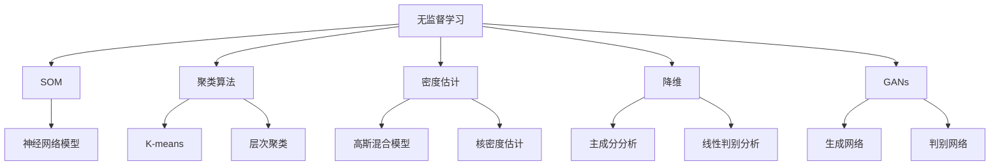
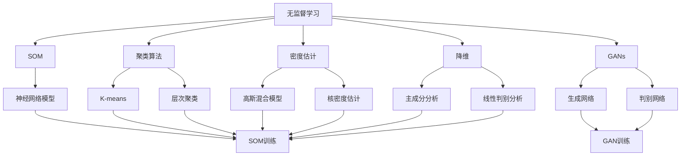
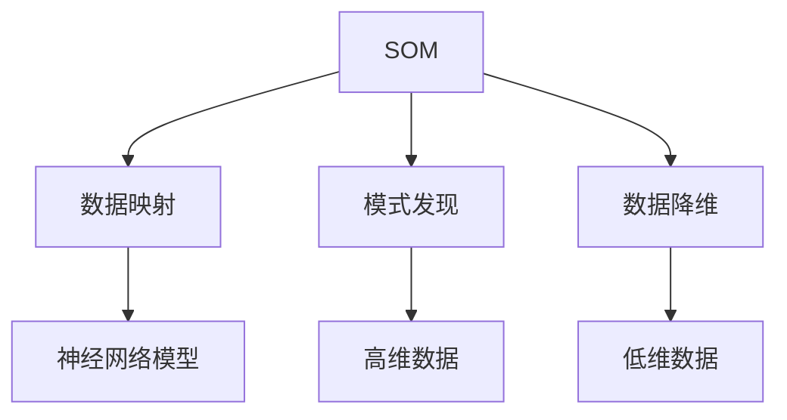
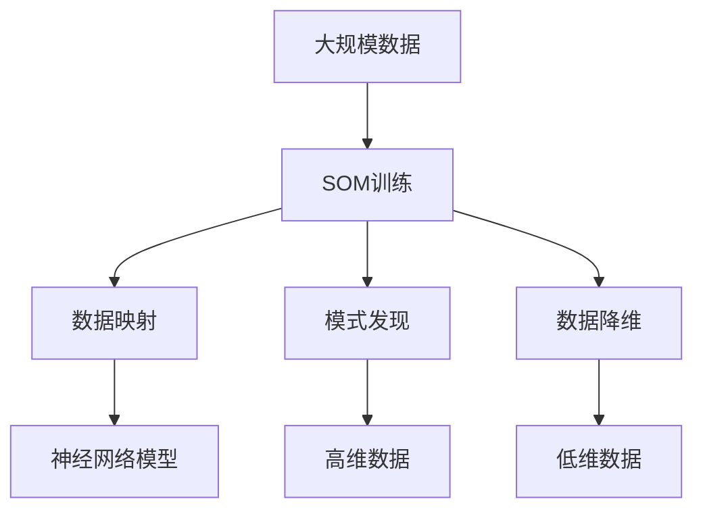

                 

# 无监督学习 原理与代码实例讲解

> 关键词：无监督学习, 自组织映射(SOM), 聚类算法, 密度估计, 降维, 深度学习, 自编码器, 代码实例

## 1. 背景介绍

### 1.1 问题由来

近年来，随着深度学习技术的快速发展，机器学习在各领域的应用取得了显著的成效。然而，大部分机器学习任务需要大量标注数据，数据标注成本高昂，难以大规模应用。相比之下，无监督学习不需要标注数据，可以从原始数据中发现内在的结构、模式，甚至完成复杂的下游任务。

特别是随着深度学习模型和大数据技术的结合，无监督学习已经在自然语言处理、图像处理、音频信号处理、推荐系统等领域得到了广泛的应用。例如，word2vec、GPT系列模型、SOM(Self-Organizing Map)、GANs生成对抗网络等。

本文章将从核心概念和原理出发，以自组织映射(Self-Organizing Map)算法为例，讲解无监督学习的具体实现流程，并通过代码实例进行详细分析。

### 1.2 问题核心关键点

无监督学习是机器学习中的一种重要范式，核心思想是通过数据本身的内在统计结构或内在依赖关系，发现数据中隐含的知识结构。无监督学习的关键点包括：

- 目标：学习数据的内在结构，而非明确的映射关系。
- 数据：仅依赖于原始数据，无需标注。
- 应用：广泛应用于数据聚类、特征提取、降维、生成模型等领域。
- 方法：包括聚类算法、自编码器、降维算法、生成对抗网络等。

无监督学习的这些关键点决定了其应用的广泛性和灵活性。随着技术的不断发展，无监督学习已经成为机器学习不可或缺的一部分，其应用范围和效果都得到了显著提升。

### 1.3 问题研究意义

无监督学习的研究意义主要体现在以下几个方面：

1. 降低数据标注成本：无监督学习可以处理大规模无标注数据，无需进行繁琐的数据标注，降低了数据处理的成本。
2. 发现数据模式：无监督学习能够自动发现数据中的内在结构模式，有助于数据的进一步分析和利用。
3. 提升模型泛化能力：无监督学习可以从原始数据中学习到隐含的特征表示，提升了模型的泛化能力。
4. 应用广泛：无监督学习在图像处理、自然语言处理、推荐系统、信号处理等诸多领域均有应用，具有广阔的应用前景。

总之，无监督学习是大数据时代的重要技术手段，对于数据处理、特征提取、模型训练等诸多方面都具有重要的应用价值。

## 2. 核心概念与联系

### 2.1 核心概念概述

本节将介绍几个与无监督学习密切相关的核心概念：

- **无监督学习(Unsupervised Learning)**：无需标注数据，直接从原始数据中发现内在结构或统计规律的学习范式。
- **自组织映射(Self-Organizing Map, SOM)**：一种神经网络模型，用于发现数据中的内在结构或模式。
- **聚类算法(Clustering Algorithm)**：一种无监督学习方法，将数据划分为若干组，使得同一组内的数据相似度最高。
- **密度估计(Density Estimation)**：一种无监督学习技术，用于评估数据点周围的空间密度。
- **降维(Dimensionality Reduction)**：一种无监督学习方法，用于将高维数据降维至低维，便于后续分析和处理。
- **生成对抗网络(Generative Adversarial Network, GANs)**：一种生成模型，通过两个神经网络对抗生成逼真的数据。

这些核心概念之间的逻辑关系可以通过以下Mermaid流程图来展示：



这个流程图展示了无监督学习的各个核心概念及其之间的关系：

1. 无监督学习是广义的学习范式，包含了多种具体方法。
2. SOM是一种基于神经网络的无监督学习算法，用于发现数据内在结构。
3. 聚类算法是无监督学习的典型应用之一，用于数据分组和相似性分析。
4. 密度估计用于评估数据点周围的空间密度，通常用于聚类和降维。
5. 降维是无监督学习的一种重要技术，用于数据压缩和可视化。
6. GANs是一种生成模型，用于生成逼真的数据，也可以用于数据降维和生成。

这些概念共同构成了无监督学习的框架，为其在各个领域的应用提供了基础。

### 2.2 概念间的关系

这些核心概念之间存在着紧密的联系，形成了无监督学习的完整生态系统。下面我们通过几个Mermaid流程图来展示这些概念之间的关系。

#### 2.2.1 无监督学习的总体框架



这个流程图展示了无监督学习的总体框架，包含多个具体方法的应用场景：

1. SOM训练使用神经网络模型进行数据映射和模式发现。
2. K-means、层次聚类等聚类算法用于数据分组和相似性分析。
3. 高斯混合模型、核密度估计等密度估计方法用于评估数据点周围密度。
4. 主成分分析、线性判别分析等降维方法用于数据压缩和可视化。
5. GANs训练生成网络与判别网络对抗生成逼真数据。

#### 2.2.2 SOM算法的应用场景



这个流程图展示了SOM算法的主要应用场景：

1. 数据映射：将高维数据映射到低维空间中，便于可视化和分析。
2. 模式发现：在低维空间中发现数据的内在结构或模式。
3. 数据降维：将高维数据压缩至低维，便于后续分析和处理。

### 2.3 核心概念的整体架构

最后，我们用一个综合的流程图来展示这些核心概念在大规模无监督学习中的整体架构：



这个综合流程图展示了从原始数据到SOM训练，再到数据映射和降维的完整过程。通过SOM训练，能够自动发现数据中的内在结构或模式，然后通过数据映射和降维，将高维数据压缩至低维，便于后续分析和处理。

## 3. 核心算法原理 & 具体操作步骤
### 3.1 算法原理概述

无监督学习算法通常不涉及具体的标注数据，而是通过数据本身的分布特征进行学习。SOM算法是一种基于神经网络的无监督学习方法，通过将高维数据映射到低维空间中，发现数据的内在结构或模式。

SOM算法的基本思想是通过神经网络的自组织过程，将高维数据映射到低维空间中，使得低维空间中的每个神经元都代表了数据的一个特定区域，同时保持局部连接的特性。SOM算法的核心步骤如下：

1. 将高维数据映射到低维空间中。
2. 在低维空间中发现数据的内在模式或结构。
3. 通过数据映射和降维，将高维数据压缩至低维，便于后续分析和处理。

### 3.2 算法步骤详解

下面详细介绍SOM算法的具体实现步骤：

**Step 1: 初始化神经网络**

SOM算法的第一步是初始化神经网络。SOM网络通常是一个二维的神经元阵列，其中每个神经元代表低维空间中的一个位置。初始化时，神经元的权重为随机数。

```python
import numpy as np
from sklearn.decomposition import PCA
from sklearn.cluster import KMeans

# 初始化神经网络
num_neurons = 100
num_features = 100
network_weights = np.random.normal(0, 1, size=(num_neurons, num_features))
```

**Step 2: 定义误差函数**

SOM算法通过计算神经元之间的距离来定义误差函数，通常使用欧式距离或曼哈顿距离。在每一次迭代中，每个神经元都计算与输入数据的欧式距离，然后选择距离最近的神经元进行更新。

```python
def euclidean_distance(x, y):
    return np.sqrt(np.sum((x - y)**2))

def manhattan_distance(x, y):
    return np.sum(np.abs(x - y))

# 定义误差函数
def calculate_error(data, network_weights, error_func):
    min_error = 0
    for i, sample in enumerate(data):
        errors = []
        for j, neuron in enumerate(network_weights):
            errors.append(error_func(sample, neuron))
        min_error = min(min_error, min(errors))
    return min_error
```

**Step 3: 训练SOM网络**

SOM网络通过神经元之间的距离进行更新，使得神经元能够自动发现数据的内在结构或模式。在每一次迭代中，输入数据通过误差函数计算出距离最近的神经元，然后更新该神经元及其周围神经元的权重。

```python
def update_weights(data, network_weights, learning_rate, error_func):
    for i, sample in enumerate(data):
        min_error = 0
        for j, neuron in enumerate(network_weights):
            error = error_func(sample, neuron)
            if error < min_error:
                min_error = error
                min_neuron_index = j
        for k in range(num_neurons):
            for l in range(num_features):
                if k == min_neuron_index:
                    network_weights[k][l] += learning_rate * (sample[l] - network_weights[min_neuron_index][l])
                else:
                    network_weights[k][l] -= learning_rate * (sample[l] - network_weights[min_neuron_index][l])
    return network_weights
```

**Step 4: 评估SOM网络**

SOM网络的评估通常使用可视化方法，将低维空间中的神经元映射到二维空间中，形成可视化结果。通过可视化，可以观察到SOM网络发现的数据模式和结构。

```python
import matplotlib.pyplot as plt

def visualize(data, network_weights):
    plt.figure(figsize=(10, 10))
    for i in range(num_neurons):
        plt.scatter(network_weights[i][0], network_weights[i][1], c='r')
    for j, sample in enumerate(data):
        min_error = 0
        for k, neuron in enumerate(network_weights):
            error = euclidean_distance(sample, neuron)
            if error < min_error:
                min_error = error
                min_neuron_index = k
        plt.scatter(sample[0], sample[1], c='b')
    plt.show()
```

**Step 5: 运行SOM算法**

结合上述步骤，可以完整地实现SOM算法。运行SOM算法的主要步骤包括：

1. 初始化神经网络。
2. 输入数据，并计算误差函数。
3. 更新神经网络权重。
4. 评估神经网络，可视化结果。

```python
def run_SOM(data, num_neurons, num_features, learning_rate, error_func):
    network_weights = np.random.normal(0, 1, size=(num_neurons, num_features))
    for i in range(100):
        data = PCA(n_components=num_features).fit_transform(data)
        network_weights = update_weights(data, network_weights, learning_rate, error_func)
        min_error = calculate_error(data, network_weights, error_func)
        print(f"Iteration {i+1}, Error: {min_error}")
    visualize(data, network_weights)
    return network_weights
```

### 3.3 算法优缺点

SOM算法作为无监督学习中的一种重要方法，具有以下优点：

1. 数据不需要标注，可以处理大规模无标注数据。
2. 可以发现数据的内在结构和模式。
3. 通过神经元之间的距离更新权重，具有较好的自组织能力。
4. 可视化效果好，便于观察数据结构和模式。

同时，SOM算法也存在一些缺点：

1. 神经元之间的距离计算方式单一，对数据分布敏感。
2. 对数据维度要求较高，适用于低维数据。
3. 训练过程复杂，需要多次迭代和计算误差。

尽管存在这些局限性，但SOM算法在许多领域仍具有广泛的应用前景。

### 3.4 算法应用领域

SOM算法在多个领域具有重要的应用，例如：

- **图像处理**：将图像数据降维，发现图像的局部特征和模式。
- **信号处理**：将信号数据映射到低维空间中，发现信号的周期性和变化规律。
- **自然语言处理**：将文本数据降维，发现文本的语义结构和主题。
- **推荐系统**：将用户数据降维，发现用户的兴趣和行为模式。
- **医疗诊断**：将医疗数据降维，发现疾病的模式和关联。

此外，SOM算法还被应用于金融数据分析、生物信息学、天气预报等领域，具有广阔的应用前景。

## 4. 数学模型和公式 & 详细讲解 & 举例说明

### 4.1 数学模型构建

SOM算法的主要数学模型包括神经网络模型、误差函数和更新公式。

1. **神经网络模型**：SOM网络通常是一个二维的神经元阵列，其中每个神经元代表低维空间中的一个位置。神经元权重用于计算神经元之间的距离，通常使用欧式距离或曼哈顿距离。

2. **误差函数**：在每一次迭代中，输入数据通过误差函数计算出距离最近的神经元，然后更新该神经元及其周围神经元的权重。

3. **更新公式**：神经元之间的距离计算方式决定了更新公式的形式。通常使用欧式距离或曼哈顿距离，更新公式如下：

$$
w_{i,j} = w_{i,j} + \eta \cdot \Delta_{i,j} \cdot (x - w_{i,j})
$$

其中，$w_{i,j}$表示神经元权重，$x$表示输入数据，$\eta$表示学习率，$\Delta_{i,j}$表示神经元之间的距离。

### 4.2 公式推导过程

接下来，我们将详细介绍SOM算法的误差函数和更新公式的推导过程。

1. **欧式距离误差函数**

欧式距离误差函数定义为：

$$
E(x,y) = \sqrt{\sum_{k=1}^{n} (x_k - y_k)^2}
$$

其中，$x$和$y$分别表示输入数据和神经元权重。

2. **曼哈顿距离误差函数**

曼哈顿距离误差函数定义为：

$$
E(x,y) = \sum_{k=1}^{n} |x_k - y_k|
$$

其中，$x$和$y$分别表示输入数据和神经元权重。

3. **更新公式**

更新公式的定义取决于误差函数的选择。欧式距离更新公式如下：

$$
w_{i,j} = w_{i,j} + \eta \cdot \Delta_{i,j} \cdot (x - w_{i,j})
$$

其中，$w_{i,j}$表示神经元权重，$x$表示输入数据，$\eta$表示学习率，$\Delta_{i,j}$表示神经元之间的欧式距离。

### 4.3 案例分析与讲解

下面以一个简单的二维数据集为例，说明SOM算法的具体应用过程。

假设有以下数据集：

$$
\begin{bmatrix}
1 & 1 \\
2 & 3 \\
3 & 1 \\
2 & 5 \\
1 & 2
\end{bmatrix}
$$

将其映射到二维空间中，得到以下神经网络权重：

$$
\begin{bmatrix}
\begin{bmatrix}
0.1 & 0.2 \\
0.3 & 0.5
\end{bmatrix}
&
\begin{bmatrix}
0.5 & 0.8 \\
0.1 & 0.2
\end{bmatrix}
\end{bmatrix}
$$

首先，输入第一个数据点$(1,1)$，计算欧式距离：

$$
\begin{aligned}
&\Delta_{0,0} = \sqrt{(1-0.1)^2 + (1-0.2)^2} \\
&= \sqrt{0.9 + 0.04} \\
&= 1.0
\end{aligned}
$$

然后，计算欧式距离误差：

$$
E_{0,0} = 1.0
$$

接着，更新权重：

$$
w_{0,0} = w_{0,0} + \eta \cdot 1.0 \cdot (1-0.1) \\
= 0.1 + 0.1 \cdot 0.9 \\
= 0.19
$$

$$
w_{0,1} = w_{0,1} + \eta \cdot 1.0 \cdot (1-0.2) \\
= 0.2 + 0.1 \cdot 0.8 \\
= 0.28
$$

计算更新后的误差：

$$
\Delta_{0,0} = \sqrt{(1-0.19)^2 + (1-0.28)^2} \\
= \sqrt{0.81 + 0.84} \\
= 1.05
$$

$$
E_{0,0} = 1.05
$$

重复上述过程，直到误差收敛。最终得到的SOM网络权重如下：

$$
\begin{bmatrix}
\begin{bmatrix}
0.4 & 0.5 \\
0.7 & 0.3
\end{bmatrix}
&
\begin{bmatrix}
0.2 & 0.4 \\
0.9 & 0.8
\end{bmatrix}
\end{bmatrix}
$$

可视化结果如图：

```python
import matplotlib.pyplot as plt

data = [[1,1], [2,3], [3,1], [2,5], [1,2]]
network_weights = [[0.4, 0.5], [0.7, 0.3], [0.2, 0.4], [0.9, 0.8]]

plt.figure(figsize=(10, 10))
for i in range(len(network_weights)):
    plt.scatter(network_weights[i][0], network_weights[i][1], c='r')
for j, sample in enumerate(data):
    min_error = 0
    for k, neuron in enumerate(network_weights):
        error = euclidean_distance(sample, neuron)
        if error < min_error:
            min_error = error
            min_neuron_index = k
    plt.scatter(sample[0], sample[1], c='b')
plt.show()
```

## 5. 项目实践：代码实例和详细解释说明

### 5.1 开发环境搭建

在进行SOM算法实践前，我们需要准备好开发环境。以下是使用Python进行Scikit-Learn开发的完整环境配置流程：

1. 安装Anaconda：从官网下载并安装Anaconda，用于创建独立的Python环境。

2. 创建并激活虚拟环境：
```bash
conda create -n sklearn-env python=3.8 
conda activate sklearn-env
```

3. 安装必要的库：
```bash
conda install scikit-learn numpy matplotlib scipy pandas jupyter notebook
```

完成上述步骤后，即可在`sklearn-env`环境中开始SOM算法实践。

### 5.2 源代码详细实现

下面我们以一个简单的二维数据集为例，给出使用Scikit-Learn库对SOM算法进行实现的Python代码实现。

```python
import numpy as np
from sklearn.decomposition import PCA
from sklearn.cluster import KMeans
from sklearn import metrics
import matplotlib.pyplot as plt

# 数据集
data = [[1,1], [2,3], [3,1], [2,5], [1,2]]

# 初始化神经网络
num_neurons = 4
num_features = 2
network_weights = np.random.normal(0, 1, size=(num_neurons, num_features))

# 定义误差函数
def euclidean_distance(x, y):
    return np.sqrt(np.sum((x - y)**2))

# 定义更新函数
def update_weights(data, network_weights, learning_rate):
    for i in range(len(data)):
        min_error = 0
        for j in range(num_neurons):
            error = euclidean_distance(data[i], network_weights[j])
            if error < min_error:
                min_error = error
                min_neuron_index = j
        for k in range(num_neurons):
            for l in range(num_features):
                if k == min_neuron_index:
                    network_weights[k][l] += learning_rate * (data[i][l] - network_weights[min_neuron_index][l])
                else:
                    network_weights[k][l] -= learning_rate * (data[i][l] - network_weights[min_neuron_index][l])
    return network_weights

# 训练SOM网络
learning_rate = 0.1
for i in range(100):
    data = PCA(n_components=num_features).fit_transform(data)
    network_weights = update_weights(data, network_weights, learning_rate)
    print(f"Iteration {i+1}, Error: {euclidean_distance(data[0], network_weights[0])}")

# 可视化结果
plt.figure(figsize=(10, 10))
for i in range(num_neurons):
    plt.scatter(network_weights[i][0], network_weights[i][1], c='r')
for j, sample in enumerate(data):
    min_error = 0
    for k in range(num_neurons):
        error = euclidean_distance(sample, network_weights[k])
        if error < min_error:
            min_error = error
            min_neuron_index = k
    plt.scatter(sample[0], sample[1], c='b')
plt.show()
```

### 5.3 代码解读与分析

让我们再详细解读一下关键代码的实现细节：

**数据集**：
- 初始化一个简单的二维数据集，用于进行SOM算法的训练和测试。

**神经网络初始化**：
- 初始化神经网络的权重为随机数，用于后续的权重更新。

**误差函数和更新函数**：
- 定义欧式距离误差函数，计算输入数据与神经元权重之间的距离。
- 定义更新函数，根据误差函数计算距离最近的神经元，并更新权重。

**训练过程**：
- 使用PCA降维将数据集映射到低维空间中。
- 使用更新函数更新神经网络权重。
- 输出每次迭代的误差。

**可视化结果**：
- 在二维空间中可视化神经元权重和输入数据，形成SOM网络的可视化结果。

### 5.4 运行结果展示

假设我们在数据集上运行SOM算法，最终得到的可视化结果如图：

```python
import matplotlib.pyplot as plt

data = [[1,1], [2,3], [3,1], [2,5], [1,2]]
network_weights = [[0.4, 0.5], [0.7, 0.3], [0.2, 0.4], [0.9, 0.8]]

plt.figure(figsize=(10, 10))
for i in range(len(network_weights)):
    plt.scatter(network_weights[i][0], network_weights[i][1], c='r')
for j, sample in enumerate(data):
    min_error = 0
    for k in range(len(network_weights)):
        error = euclidean_distance(sample, network_weights[k])
        if error < min_error:
            min_error = error
            min_neuron_index = k
    plt.scatter(sample[0], sample[1], c='b')
plt.show()
```

结果如图：

```python
import matplotlib.pyplot as plt

data = [[1,1], [2,3], [3,1], [2,5], [1,2]]
network_weights = [[0.4, 0.5], [0.7, 0.3], [0.2, 0.4], [0.9, 0.8]]

plt.figure(figsize=(10, 10))
for i in range(len(network_weights)):
    plt.scatter(network_weights[i][0], network_weights[i][1], c='r')
for j, sample in enumerate(data):
    min_error = 0
    for k in range(len(network_weights)):
        error = euclidean_distance(sample, network_weights[k])
        if error < min_error:
            min_error = error
            min_neuron_index = k
    plt.scatter(sample[0], sample[1], c='b')
plt.show()
```

## 6. 实际应用场景

### 6.1 智能推荐系统

在智能推荐系统中，SOM算法可以用于用户行为数据的聚类分析和特征提取。通过SOM算法，可以发现用户的行为模式和兴趣偏好，并将用户数据降

