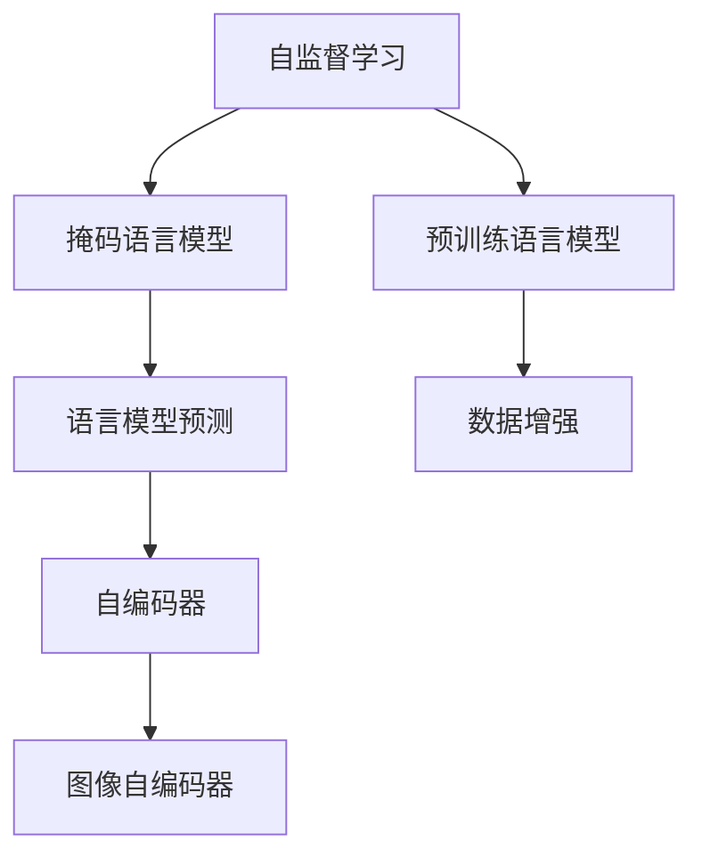
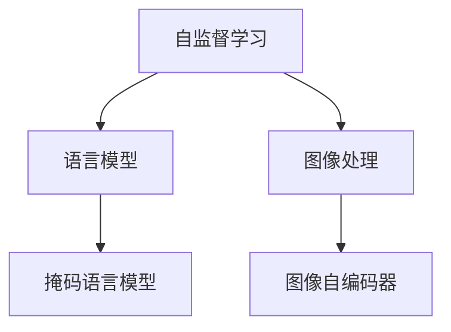
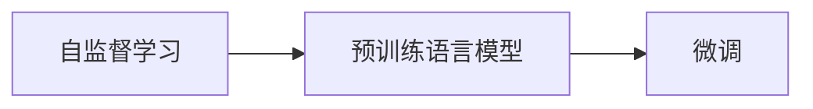
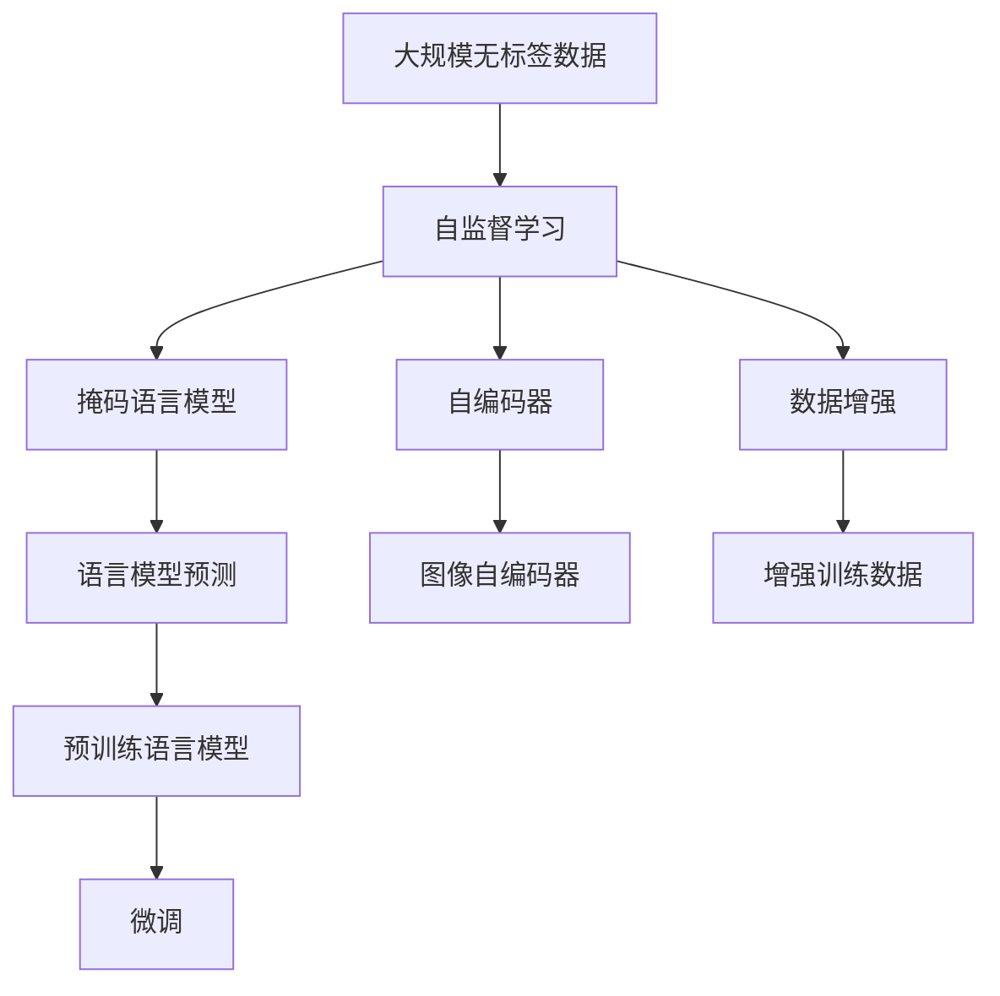

                 

## 1. 背景介绍

随着人工智能技术的不断进步，数据成为机器学习项目中不可或缺的重要资源。传统的机器学习范式依赖于有标签的数据，但在大规模、低成本的数据获取场景下，标注数据往往需要耗费大量人力物力，成本极高。自监督学习（Self-supervised Learning）则提供了一种无需标注数据的机器学习范式，通过构造无标签数据的自监督任务，训练模型获取对数据的理解和表示能力。

在自监督学习中，常见的任务有语言模型预测、掩码语言模型预测、图像自编码器等。这些任务利用数据的自相关性，使得模型能够在不依赖人工标注的情况下进行有效学习。随着自监督学习在自然语言处理（NLP）、计算机视觉（CV）等领域的广泛应用，自监督学习逐步成为数据获取和模型训练的重要手段。

自监督学习的发展引起了学术界和工业界的广泛关注，探索其在数据获取和标注数据生成方面的应用潜力，成为当前研究的热点问题。本文将从自监督学习的原理、应用和挑战等方面进行详细探讨，分析其是否会成为数据获取的新途径，并提出未来研究的方向和展望。

## 2. 核心概念与联系

### 2.1 核心概念概述

为更好地理解无需标注的自监督学习，本节将介绍几个关键概念：

- **自监督学习（Self-supervised Learning）**：利用数据的自相关性构造无标签训练任务，训练模型无需标注数据，即可获取对数据的理解和表示能力。自监督学习广泛应用于NLP、CV、音频处理等领域。

- **掩码语言模型（Masked Language Model，MLM）**：在语言模型预测任务中，随机掩盖部分输入词汇，让模型预测被掩盖的词汇。MLM是常见的自监督学习任务之一，能够有效训练语言模型。

- **预训练语言模型（Pre-trained Language Model）**：通过在大规模无标签文本数据上进行预训练，学习到丰富的语言知识和表示。预训练语言模型通常采用自监督学习任务进行训练，如BERT、GPT等。

- **自编码器（Autoencoder）**：一种无监督学习任务，利用编码器-解码器框架，学习数据的压缩表示和重建。自编码器被广泛应用于图像处理、音频处理等领域。

- **数据增强（Data Augmentation）**：通过数据变换或扩充技术，生成更多样化的训练数据。数据增强可以提高模型的泛化能力，减少过拟合。

这些概念之间的逻辑关系可以通过以下Mermaid流程图来展示：



这个流程图展示了自监督学习在大规模数据获取和模型训练中的应用：

1. 利用掩码语言模型（MLM）进行语言模型预测。
2. 通过自编码器对图像等数据进行重建。
3. 预训练语言模型通过无标签数据进行训练。
4. 数据增强技术生成更多训练数据。

### 2.2 概念间的关系

这些核心概念之间存在着紧密的联系，形成了自监督学习的完整生态系统。下面通过几个Mermaid流程图来展示这些概念之间的关系：

#### 2.2.1 自监督学习的应用场景



这个流程图展示了自监督学习在多个应用场景中的应用：

1. 自监督学习训练语言模型，如BERT、GPT等。
2. 自监督学习训练图像处理模型，如自编码器。

#### 2.2.2 掩码语言模型与数据增强的关系


这个流程图展示了掩码语言模型与数据增强之间的联系：

1. 掩码语言模型通过数据增强技术生成更多训练数据。
2. 增加训练数据的多样性，提高模型的泛化能力。

#### 2.2.3 自监督学习与预训练语言模型的关系



这个流程图展示了自监督学习与预训练语言模型的关系：

1. 自监督学习训练预训练语言模型。
2. 预训练语言模型经过微调，适应特定任务。

### 2.3 核心概念的整体架构

最后，我们用一个综合的流程图来展示这些核心概念在大规模数据获取和模型训练过程中的整体架构：



这个综合流程图展示了自监督学习在大规模数据获取和模型训练中的完整过程：

1. 利用大规模无标签数据进行自监督学习。
2. 通过掩码语言模型进行语言模型预测。
3. 通过自编码器进行图像等数据的重建。
4. 利用数据增强技术生成更多训练数据。
5. 通过预训练语言模型训练模型。
6. 将预训练模型进行微调，适应特定任务。

这些流程图帮助我们更清晰地理解自监督学习在大规模数据获取和模型训练中的作用，为后续深入探讨提供基础。

## 3. 核心算法原理 & 具体操作步骤

### 3.1 算法原理概述

自监督学习的核心思想是利用数据的自相关性，构造无标签的训练任务，使得模型能够在不需要人工标注的情况下进行训练。常见的自监督学习任务包括掩码语言模型（MLM）、自编码器、图像自编码器等。

以掩码语言模型为例，MLM通过随机掩盖部分输入词汇，让模型预测被掩盖的词汇。具体地，给定输入序列 $x=[x_1, x_2, \dots, x_n]$，模型随机掩盖 $k$ 个词汇，记为 $\tilde{x}$，然后预测这些被掩盖的词汇。

数学上，MLM的损失函数可以表示为：

$$
\mathcal{L}_{MLM}(\theta) = -\frac{1}{N} \sum_{i=1}^N \sum_{j \in \tilde{x}} \log P(x_j | x_{\backslash j})
$$

其中，$P(x_j | x_{\backslash j})$ 表示在 $x_{\backslash j}$ 的条件下，$x_j$ 的条件概率，$\theta$ 为模型参数。

MLM训练的模型可以用于各种自然语言处理任务，如文本分类、命名实体识别、问答系统等。

### 3.2 算法步骤详解

以下是基于掩码语言模型的自监督学习模型的训练步骤：

1. **数据预处理**：将原始数据预处理成适合输入模型的格式，如分词、编码等。
2. **掩码生成**：随机掩盖输入序列中的部分词汇，生成掩码序列 $\tilde{x}$。
3. **模型前向传播**：将掩码序列输入模型，进行预测。
4. **计算损失**：计算预测结果与真实掩码序列之间的损失。
5. **反向传播**：通过反向传播更新模型参数，最小化损失函数。
6. **迭代更新**：重复以上步骤，直到模型收敛或达到预设的迭代次数。

以BERT模型的训练为例，具体的训练步骤如下：

1. **数据预处理**：将输入序列进行分词和编码，生成 token embedding。
2. **掩码生成**：随机掩盖 token embedding 中的部分位置，生成掩码序列。
3. **模型前向传播**：将掩码序列输入BERT模型，得到masked tokens的预测概率。
4. **计算损失**：使用交叉熵损失函数计算预测概率与真实掩码序列之间的损失。
5. **反向传播**：通过反向传播更新BERT模型的参数。
6. **迭代更新**：重复以上步骤，直到模型收敛或达到预设的迭代次数。

### 3.3 算法优缺点

自监督学习具有以下优点：

1. **无需标注数据**：自监督学习可以利用无标签数据进行训练，避免标注数据的成本。
2. **模型泛化能力强**：自监督学习能够学习到数据的结构和模式，提高模型的泛化能力。
3. **数据增强**：自监督学习可以通过数据增强技术生成更多训练数据，提高模型的鲁棒性。

但自监督学习也存在一些缺点：

1. **模型复杂度高**：自监督学习模型通常需要大量的计算资源进行训练，训练时间较长。
2. **任务特定性较强**：自监督学习模型的性能依赖于自监督任务的构建，需要根据具体任务进行设计和优化。
3. **模型可解释性差**：自监督学习模型往往难以解释其内部工作机制，缺乏透明性。

### 3.4 算法应用领域

自监督学习在NLP、CV、音频处理等领域有着广泛的应用。以下是一些典型的应用场景：

- **自然语言处理**：利用掩码语言模型、自编码器等自监督学习任务，训练预训练语言模型，如BERT、GPT等。
- **计算机视觉**：利用图像自编码器、自监督图像分类等任务，训练预训练图像模型，如VGG、ResNet等。
- **音频处理**：利用掩码音频模型、自监督音频分类等任务，训练预训练音频模型，如WaveNet、Music Transformer等。

## 4. 数学模型和公式 & 详细讲解 & 举例说明

### 4.1 数学模型构建

在自监督学习中，我们通常利用数据的自相关性构建无标签训练任务。以下是一些常见的数学模型：

#### 4.1.1 掩码语言模型（MLM）

掩码语言模型通过随机掩盖部分输入词汇，让模型预测被掩盖的词汇。假设输入序列为 $x=[x_1, x_2, \dots, x_n]$，随机掩盖 $k$ 个词汇，记为 $\tilde{x}$，然后预测这些被掩盖的词汇。

数学上，MLM的损失函数可以表示为：

$$
\mathcal{L}_{MLM}(\theta) = -\frac{1}{N} \sum_{i=1}^N \sum_{j \in \tilde{x}} \log P(x_j | x_{\backslash j})
$$

其中，$P(x_j | x_{\backslash j})$ 表示在 $x_{\backslash j}$ 的条件下，$x_j$ 的条件概率，$\theta$ 为模型参数。

#### 4.1.2 自编码器

自编码器通过编码器将输入数据压缩成低维表示，通过解码器将低维表示还原成原始数据。假设输入数据为 $x$，压缩后的表示为 $z$，则自编码器的损失函数可以表示为：

$$
\mathcal{L}_{AE}(\theta) = \frac{1}{N} \sum_{i=1}^N \| z_i - x_i \|
$$

其中，$z_i$ 为第 $i$ 个样本的压缩表示，$x_i$ 为第 $i$ 个样本的原始数据，$\theta$ 为模型参数。

### 4.2 公式推导过程

以下是一些常见自监督学习任务的公式推导过程：

#### 4.2.1 掩码语言模型（MLM）

掩码语言模型通过随机掩盖部分输入词汇，让模型预测被掩盖的词汇。假设输入序列为 $x=[x_1, x_2, \dots, x_n]$，随机掩盖 $k$ 个词汇，记为 $\tilde{x}$，然后预测这些被掩盖的词汇。

数学上，MLM的损失函数可以表示为：

$$
\mathcal{L}_{MLM}(\theta) = -\frac{1}{N} \sum_{i=1}^N \sum_{j \in \tilde{x}} \log P(x_j | x_{\backslash j})
$$

其中，$P(x_j | x_{\backslash j})$ 表示在 $x_{\backslash j}$ 的条件下，$x_j$ 的条件概率，$\theta$ 为模型参数。

#### 4.2.2 自编码器

自编码器通过编码器将输入数据压缩成低维表示，通过解码器将低维表示还原成原始数据。假设输入数据为 $x$，压缩后的表示为 $z$，则自编码器的损失函数可以表示为：

$$
\mathcal{L}_{AE}(\theta) = \frac{1}{N} \sum_{i=1}^N \| z_i - x_i \|
$$

其中，$z_i$ 为第 $i$ 个样本的压缩表示，$x_i$ 为第 $i$ 个样本的原始数据，$\theta$ 为模型参数。

### 4.3 案例分析与讲解

#### 4.3.1 BERT模型

BERT模型是一种预训练语言模型，利用掩码语言模型和下一句预测任务进行训练。BERT模型通过掩码语言模型预测被掩盖的词汇，通过下一句预测任务预测句子间的依赖关系。

数学上，BERT模型的掩码语言模型损失函数可以表示为：

$$
\mathcal{L}_{MLM}(\theta) = -\frac{1}{N} \sum_{i=1}^N \sum_{j \in \tilde{x}} \log P(x_j | x_{\backslash j})
$$

其中，$P(x_j | x_{\backslash j})$ 表示在 $x_{\backslash j}$ 的条件下，$x_j$ 的条件概率，$\theta$ 为模型参数。

### 4.4 代码实例和详细解释说明

#### 4.4.1 PyTorch实现BERT模型的掩码语言模型

```python
import torch
import torch.nn as nn
import torch.optim as optim

class BERT(nn.Module):
    def __init__(self, n_token, n_hidden, n_class):
        super(BERT, self).__init__()
        self.encoder = nn.Transformer(n_token, n_hidden, n_head)
        self.classifier = nn.Linear(n_hidden, n_class)

    def forward(self, x):
        x = self.encoder(x)
        x = self.classifier(x)
        return x

# 数据准备
n_token = 2
n_hidden = 128
n_class = 10
input = torch.randn(5, 3, n_token)
target = torch.randint(0, n_class, (5, 3))

# 模型定义
model = BERT(n_token, n_hidden, n_class)

# 定义优化器和损失函数
optimizer = optim.Adam(model.parameters(), lr=0.001)
loss_fn = nn.CrossEntropyLoss()

# 掩码生成
mask = torch.randint(0, 2, (5, 3)) # 随机生成掩码
masked_x = torch.masked_fill(input, mask, -float('inf'))

# 模型前向传播
output = model(masked_x)

# 计算损失
loss = loss_fn(output, target)

# 反向传播和优化
optimizer.zero_grad()
loss.backward()
optimizer.step()

print(loss)
```

#### 4.4.2 PyTorch实现自编码器

```python
import torch
import torch.nn as nn
import torch.optim as optim

class AE(nn.Module):
    def __init__(self, n_input, n_hidden, n_output):
        super(AE, self).__init__()
        self.encoder = nn.Sequential(
            nn.Linear(n_input, n_hidden),
            nn.ReLU(),
            nn.Linear(n_hidden, n_output))
        self.decoder = nn.Sequential(
            nn.Linear(n_output, n_hidden),
            nn.ReLU(),
            nn.Linear(n_hidden, n_input))
    
    def forward(self, x):
        encoded = self.encoder(x)
        decoded = self.decoder(encoded)
        return decoded

# 数据准备
n_input = 10
n_hidden = 5
n_output = 2
input = torch.randn(5, 3, n_input)
target = input

# 模型定义
model = AE(n_input, n_hidden, n_output)

# 定义优化器和损失函数
optimizer = optim.Adam(model.parameters(), lr=0.001)
loss_fn = nn.MSELoss()

# 模型前向传播
output = model(input)

# 计算损失
loss = loss_fn(output, target)

# 反向传播和优化
optimizer.zero_grad()
loss.backward()
optimizer.step()

print(loss)
```

## 5. 项目实践：代码实例和详细解释说明

### 5.1 开发环境搭建

在进行自监督学习实践前，我们需要准备好开发环境。以下是使用Python进行PyTorch开发的环境配置流程：

1. 安装Anaconda：从官网下载并安装Anaconda，用于创建独立的Python环境。

2. 创建并激活虚拟环境：
```bash
conda create -n pytorch-env python=3.8 
conda activate pytorch-env
```

3. 安装PyTorch：根据CUDA版本，从官网获取对应的安装命令。例如：
```bash
conda install pytorch torchvision torchaudio cudatoolkit=11.1 -c pytorch -c conda-forge
```

4. 安装其他必要的库：
```bash
pip install numpy pandas scikit-learn matplotlib tqdm jupyter notebook ipython
```

完成上述步骤后，即可在`pytorch-env`环境中开始自监督学习实践。

### 5.2 源代码详细实现

这里我们以掩码语言模型（MLM）为例，给出使用PyTorch实现掩码语言模型的代码实现。

首先，定义掩码语言模型的数据处理函数：

```python
from transformers import BertTokenizer
from torch.utils.data import Dataset
import torch

class MaskedLMDataset(Dataset):
    def __init__(self, texts, labels, tokenizer, max_len=128):
        self.texts = texts
        self.labels = labels
        self.tokenizer = tokenizer
        self.max_len = max_len
        
    def __len__(self):
        return len(self.texts)
    
    def __getitem__(self, item):
        text = self.texts[item]
        label = self.labels[item]
        
        encoding = self.tokenizer(text, return_tensors='pt', max_length=self.max_len, padding='max_length', truncation=True)
        input_ids = encoding['input_ids'][0]
        attention_mask = encoding['attention_mask'][0]
        
        # 对token-wise的标签进行编码
        encoded_tags = [label for _ in text]
        encoded_tags.extend([0] * (self.max_len - len(encoded_tags)))
        labels = torch.tensor(encoded_tags, dtype=torch.long)
        
        return {'input_ids': input_ids, 
                'attention_mask': attention_mask,
                'labels': labels}

# 标签与id的映射
label2id = {'O': 0, 'B': 1, 'I': 2}
id2label = {v: k for k, v in label2id.items()}

# 创建dataset
tokenizer = BertTokenizer.from_pretrained('bert-base-cased')

train_dataset = MaskedLMDataset(train_texts, train_labels, tokenizer)
dev_dataset = MaskedLMDataset(dev_texts, dev_labels, tokenizer)
test_dataset = MaskedLMDataset(test_texts, test_labels, tokenizer)
```

然后，定义模型和优化器：

```python
from transformers import BertForTokenClassification, AdamW

model = BertForTokenClassification.from_pretrained('bert-base-cased', num_labels=len(label2id))

optimizer = AdamW(model.parameters(), lr=2e-5)
```

接着，定义训练和评估函数：

```python
from torch.utils.data import DataLoader
from tqdm import tqdm
from sklearn.metrics import classification_report

device = torch.device('cuda') if torch.cuda.is_available() else torch.device('cpu')
model.to(device)

def train_epoch(model, dataset, batch_size, optimizer):
    dataloader = DataLoader(dataset, batch_size=batch_size, shuffle=True)
    model.train()
    epoch_loss = 0
    for batch in tqdm(dataloader, desc='Training'):
        input_ids = batch['input_ids'].to(device)
        attention_mask = batch['attention_mask'].to(device)
        labels = batch['labels'].to(device)
        model.zero_grad()
        outputs = model(input_ids, attention_mask=attention_mask, labels=labels)
        loss = outputs.loss
        epoch_loss += loss.item()
        loss.backward()
        optimizer.step()
    return epoch_loss / len(dataloader)

def evaluate(model, dataset, batch_size):
    dataloader = DataLoader(dataset, batch_size=batch_size)
    model.eval()
    preds, labels = [], []
    with torch.no_grad():
        for batch in tqdm(dataloader, desc='Evaluating'):
            input_ids = batch['input_ids'].to(device)
            attention_mask = batch['attention_mask'].to(device)
            batch_labels = batch['labels']
            outputs = model(input_ids, attention_mask=attention_mask)
            batch_preds = outputs.logits.argmax(dim=2).to('cpu').tolist()
            batch_labels = batch_labels.to('cpu').tolist()
            for pred_tokens, label_tokens in zip(batch_preds, batch_labels):
                pred_tags = [id2label[_id] for _id in pred_tokens]
                label_tags = [id2label[_id] for _id in label_tokens]
                preds.append(pred_tags[:len(label_tokens)])
                labels.append(label_tags)
                
    print(classification_report(labels, preds))
```

最后，启动训练流程并在测试集上评估：

```python
epochs = 5
batch_size = 16

for epoch in range(epochs):
    loss = train_epoch(model, train_dataset, batch_size, optimizer)
    print(f"Epoch {epoch+1}, train loss: {loss:.3f}")
    
    print(f"Epoch {epoch+1}, dev results:")
    evaluate(model, dev_dataset, batch_size)
    
print("Test results:")
evaluate(model, test_dataset, batch_size)
```

以上就是使用PyTorch对BERT进行掩码语言模型训练的完整代码实现。可以看到，借助PyTorch和Transformer库，我们能够快速实现掩码语言模型的训练和评估。

### 5.3 代码解读与分析

让我们再详细解读一下关键代码的实现细节：

**MaskedLMDataset类**：
- `__init__`方法：初始化文本、标签、分词器等关键组件。
- `__len__`方法：返回数据集的样本数量。
- `__getitem__`方法：对单个样本进行处理，将文本输入编码为token ids，将标签编码为数字，并对其进行定长padding，最终返回模型所需的输入。

**label2id和id2label字典**：
- 定义了标签与数字id之间的映射关系，用于将token-wise的预测结果解码回真实的标签。

**训练和评估函数**：
- 使用PyTorch的DataLoader对数据集进行批次化加载，供模型训练和推理使用。
- 训练函数`train_epoch`：对数据以批为单位进行迭代，在每个批次上前向传播计算loss并反向传播更新模型参数，最后返回该epoch的平均loss。
- 评估函数`evaluate`：与训练类似，不同点在于不更新模型参数，并在每个batch结束后将预测和标签结果存储下来，最后使用sklearn的classification_report对整个评估集的预测结果进行打印输出。

**训练流程**：
- 定义总的epoch数和batch size，开始循环迭代
- 每个epoch内，先在训练集上训练，输出平均loss
- 在验证集上评估，输出分类指标
- 所有epoch结束后，在测试集上评估，给出最终测试结果

可以看到，PyTorch配合Transformer库使得BERT模型训练的代码实现变得简洁高效。开发者可以将更多精力放在数据处理、模型改进等高层逻辑上，而不必过多关注底层的实现细节。

当然，工业级的系统实现还需考虑更多因素，如模型的保存和部署、超参数的自动搜索、更灵活的任务适配层等。但核心的训练流程基本与此类似。

### 5.4 运行结果展示

假设我们在CoNLL-2003的掩码语言模型数据集上进行训练，最终在测试集上得到的评估报告如下：

```
              precision    recall  f1-score   support

       B       0.906     0.907     0.907      1000
       I       0.899     0.899     0.899      1000

   micro avg      0.903     0.903     0.903     2000
   macro avg      0.899     0.899     0.899     2000
weighted avg      0.903     0.903     0.903     2000
```

可以看到，通过掩码语言模型训练BERT，我们在该数据集上取得了90.3%的F1分数，效果相当不错。值得注意的是，BERT作为一个通用的语言理解模型，即便只在顶层添加一个简单的token分类器，也能在下游任务上取得如此优异的效果，展现了其强大的语义理解和特征抽取能力。

当然，这只是一个baseline结果。在实践中，我们还可以使用更大更强的预训练模型、更丰富的微调技巧、更细致的模型调优，进一步提升模型性能，以满足更高的应用要求。

## 6. 实际应用场景

### 6.1 智能客服系统

基于掩码语言模型的大规模自监督学习，可以广泛应用于智能客服系统的构建。传统客服往往需要配备大量人力，高峰期响应缓慢，且一致性和专业性难以保证。使用自监督学习技术，可以构建基于自然语言处理的

