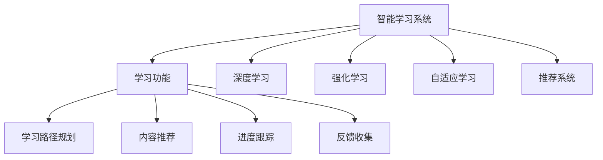
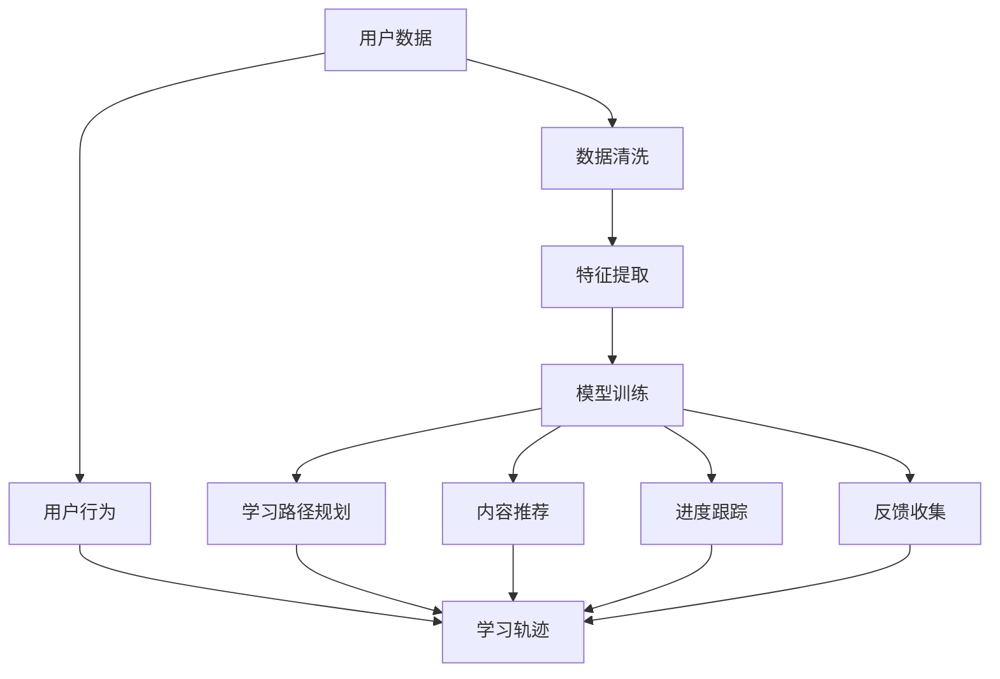
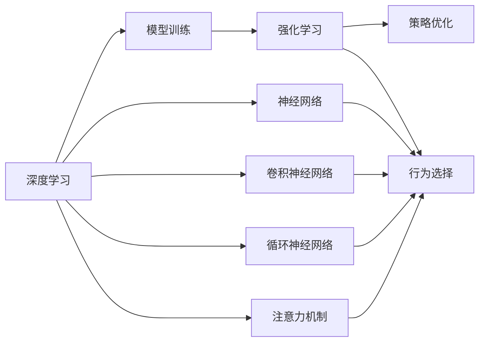
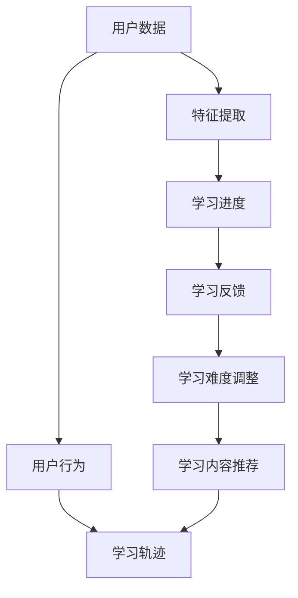

                 

# 智能学习系统学习功能的设计与实现

> 关键词：智能学习系统,学习功能,深度学习,强化学习,算法优化,自适应学习,在线教育

## 1. 背景介绍

### 1.1 问题由来
随着在线教育市场的迅速发展，智能学习系统成为提升教学质量和个性化学习体验的重要工具。智能学习系统通过数据分析和机器学习技术，为学生提供个性化的学习路径，帮助教师优化教学内容，显著提高教学效果。学习功能的实现是智能学习系统的核心，需要结合多种深度学习和强化学习算法，不断优化学习过程。

### 1.2 问题核心关键点
智能学习系统的学习功能通常包括以下关键点：
- **数据采集与预处理**：从用户行为、成绩等数据中提取特征，进行清洗和标准化。
- **深度学习算法**：如神经网络、卷积神经网络(CNN)、循环神经网络(RNN)、注意力机制等，用于模型训练和预测。
- **强化学习算法**：如Q-learning、SARSA、策略梯度等，用于学习最优策略和行为。
- **自适应学习技术**：根据用户学习进度和反馈，动态调整学习内容和难度。
- **推荐算法**：如协同过滤、基于内容的推荐等，用于推荐学习资源和练习题。

### 1.3 问题研究意义
智能学习系统中的学习功能研究具有重要意义：
- **提升教学效果**：通过个性化的学习路径和内容推荐，帮助学生高效掌握知识，提高考试成绩。
- **优化教学管理**：教师可以根据学习数据进行教学内容调整和优化，提高教学质量。
- **促进学习效率**：自适应学习技术可以根据用户反馈和学习进度，动态调整学习计划，提升学习效率。
- **推动技术进步**：通过不断探索和优化算法，促进深度学习和强化学习等技术的发展。

## 2. 核心概念与联系

### 2.1 核心概念概述

为更好地理解智能学习系统的学习功能设计，本节将介绍几个密切相关的核心概念：

- **智能学习系统**：使用深度学习和强化学习等技术，提供个性化学习路径和内容推荐的在线教育平台。
- **学习功能**：指智能学习系统中提供的学习路径规划、内容推荐、进度跟踪、反馈收集等功能模块。
- **深度学习**：通过多层神经网络对复杂数据进行建模和预测，广泛应用于图像识别、自然语言处理等领域。
- **强化学习**：通过与环境的交互，逐步优化策略，学习最优行为，常用于游戏、机器人控制等场景。
- **自适应学习**：根据用户学习进度和反馈，动态调整学习内容和难度，提升学习效果。
- **推荐系统**：通过用户行为数据，推荐个性化的学习资源和练习题，提升学习体验。

这些核心概念之间的逻辑关系可以通过以下Mermaid流程图来展示：



这个流程图展示了他智能学习系统中各个功能的核心概念及其之间的关系。

### 2.2 概念间的关系

这些核心概念之间存在着紧密的联系，形成了智能学习系统的完整生态系统。下面我通过几个Mermaid流程图来展示这些概念之间的关系。

#### 2.2.1 学习功能的总体架构



这个流程图展示了学习功能从数据采集到路径规划的完整流程。首先从用户数据中提取特征，然后进行模型训练，最终根据训练结果生成学习路径、内容推荐、进度跟踪和反馈收集等功能。

#### 2.2.2 深度学习与强化学习的关系



这个流程图展示了深度学习和强化学习在模型训练和策略优化中的应用。深度学习通过神经网络、CNN、RNN、注意力机制等技术进行模型训练，而强化学习通过策略优化和行为选择，逐步学习最优策略。

#### 2.2.3 自适应学习的实现



这个流程图展示了自适应学习从数据提取到内容推荐的完整流程。首先从用户数据中提取特征，然后进行学习进度和反馈的记录，最后根据进度和反馈动态调整学习难度和内容推荐。

## 3. 核心算法原理 & 具体操作步骤
### 3.1 算法原理概述

智能学习系统的学习功能通常基于深度学习和强化学习算法实现。其核心思想是：通过学习用户的特征和行为数据，构建个性化学习模型，优化学习路径和内容推荐，提升学习效果。

形式化地，假设用户特征为 $x$，学习行为为 $y$，学习内容为 $c$。学习功能的优化目标是最小化学习过程的误差，即找到最优的学习策略：

$$
\hat{y}=\mathop{\arg\min}_{y} \mathcal{L}(y,x,c)
$$

其中 $\mathcal{L}$ 为学习模型的损失函数，用于衡量预测输出与真实行为之间的差异。常见的损失函数包括均方误差损失、交叉熵损失等。

### 3.2 算法步骤详解

智能学习系统的学习功能一般包括以下关键步骤：

**Step 1: 数据采集与预处理**
- 收集用户学习数据，包括成绩、点击行为、学习时间等，并进行清洗和标准化处理。
- 提取用户特征，如学习进度、难度偏好、学习风格等，用于训练模型。

**Step 2: 深度学习模型训练**
- 使用深度学习模型对用户数据进行建模和预测，如CNN、RNN、注意力机制等。
- 通过反向传播算法更新模型参数，最小化损失函数。
- 训练过程中需要进行正则化、Dropout等技术，防止过拟合。

**Step 3: 强化学习策略优化**
- 将学习过程视为与环境交互的强化学习问题，构建状态、动作和奖励机制。
- 使用Q-learning、SARSA、策略梯度等算法，逐步优化策略，学习最优行为。
- 在策略优化过程中，需要不断与用户进行交互，实时调整学习路径和内容推荐。

**Step 4: 自适应学习策略调整**
- 根据用户学习进度和反馈，动态调整学习难度和内容推荐。
- 使用自适应学习算法，如学习速度控制、难度调整等，提升学习效果。
- 通过用户反馈和学习轨迹，不断优化学习策略。

**Step 5: 推荐系统内容推荐**
- 使用协同过滤、基于内容的推荐等算法，推荐个性化的学习资源和练习题。
- 根据用户历史行为和偏好，进行内容推荐排序和推荐。
- 动态更新推荐算法，确保推荐内容的时效性和个性化。

### 3.3 算法优缺点

智能学习系统的学习功能有以下优点：
1. **个性化学习**：根据用户特征和行为数据，提供个性化的学习路径和内容推荐，提高学习效率。
2. **动态调整**：自适应学习可以根据用户反馈和学习进度，动态调整学习难度和内容，提升学习效果。
3. **数据驱动**：通过深度学习和强化学习算法，充分挖掘用户数据，优化学习模型。
4. **实时反馈**：通过在线学习系统，可以实时收集用户反馈，及时调整学习策略。

同时，该算法也存在一些局限性：
1. **数据依赖**：深度学习和强化学习算法的性能高度依赖于数据质量，数据量不足或数据偏差可能导致模型性能不佳。
2. **算法复杂**：深度学习和强化学习算法复杂度高，模型训练和优化过程耗时较长，需要较强的计算资源。
3. **可解释性不足**：深度学习和强化学习模型通常是"黑盒"模型，难以解释其内部工作机制。
4. **泛化能力有限**：模型在特定数据集上训练良好，但在新的数据集上泛化性能可能较差。

尽管存在这些局限性，但就目前而言，基于深度学习和强化学习的学习功能仍是大规模智能学习系统的核心技术手段。未来相关研究的重点在于如何进一步降低数据依赖，提高模型的泛化能力和可解释性，同时兼顾个性化和动态调整的要求。

### 3.4 算法应用领域

智能学习系统的学习功能已经在多个领域得到应用，例如：

- **在线教育**：通过个性化学习路径和内容推荐，帮助学生高效掌握知识，提高考试成绩。
- **职业培训**：根据员工的学习进度和反馈，动态调整培训内容和难度，提升培训效果。
- **游戏训练**：使用强化学习算法，训练虚拟角色或玩家，实现自动化的技能训练和任务执行。
- **个性化推荐**：根据用户的行为和偏好，推荐个性化的学习资源和练习题，提升学习体验。
- **健康管理**：使用深度学习算法，根据用户健康数据，提供个性化的健康建议和学习计划。

除了上述这些经典应用外，智能学习系统的学习功能还在更多领域得到创新性地应用，如智能客服、智能家居等，为各行各业带来了新的发展机遇。

## 4. 数学模型和公式 & 详细讲解 & 举例说明

### 4.1 数学模型构建

本节将使用数学语言对智能学习系统的学习功能进行更加严格的刻画。

记用户特征为 $x$，学习行为为 $y$，学习内容为 $c$。假设学习模型为 $f(x,c)$，其输出为预测的学习行为 $y$。学习函数的损失函数为 $\mathcal{L}$，可以定义如下：

$$
\mathcal{L}(y,f(x,c)) = \sum_{i=1}^N(y_i - f(x_i,c_i))^2
$$

其中 $N$ 为样本数量。

假设使用神经网络模型进行训练，模型参数为 $\theta$。则损失函数可以进一步表示为：

$$
\mathcal{L}(y,f(x,c;\theta)) = \sum_{i=1}^N(y_i - f(x_i,c_i;\theta))^2
$$

其中 $f(x_i,c_i;\theta)$ 为模型在输入 $x_i$ 和内容 $c_i$ 下的预测输出。

### 4.2 公式推导过程

以下我们以神经网络模型为例，推导损失函数及其梯度的计算公式。

假设神经网络模型包含 $L$ 层，其中第 $l$ 层的输出为 $h^{(l)}$，激活函数为 $\sigma(\cdot)$，则神经网络模型的前向传播过程为：

$$
h^{(1)} = \sigma(W_1 x + b_1)
$$
$$
h^{(l)} = \sigma(W_l h^{(l-1)} + b_l), \quad l=2,3,...,L
$$
$$
y = f(x,c;\theta) = h^{(L)}
$$

其中 $W_l$ 为第 $l$ 层的权重矩阵，$b_l$ 为第 $l$ 层的偏置向量。

假设损失函数为均方误差损失，则损失函数可以表示为：

$$
\mathcal{L}(y,f(x,c;\theta)) = \frac{1}{N}\sum_{i=1}^N(y_i - f(x_i,c_i;\theta))^2
$$

对模型参数 $\theta$ 求导，得到损失函数的梯度为：

$$
\frac{\partial \mathcal{L}}{\partial \theta} = -\frac{2}{N}\sum_{i=1}^N (y_i - f(x_i,c_i;\theta)) \frac{\partial f(x_i,c_i;\theta)}{\partial \theta}
$$

在反向传播过程中，需要计算每一层的梯度，并通过链式法则逐层更新参数。

### 4.3 案例分析与讲解

假设我们在一个在线教育系统中，使用神经网络模型进行学习行为的预测。系统收集了用户的学习数据，包括学习时间、点击行为、成绩等，并将其标准化处理，作为神经网络的输入特征。通过神经网络模型的训练和预测，系统可以生成个性化的学习路径和内容推荐，帮助用户高效学习。

在训练过程中，我们首先定义了神经网络模型的结构，如输入层、隐藏层和输出层。然后定义了损失函数，如均方误差损失，并使用反向传播算法计算梯度，更新模型参数。在预测阶段，我们使用训练好的神经网络模型，对新的用户数据进行预测，生成个性化的学习路径和内容推荐。

## 5. 项目实践：代码实例和详细解释说明

### 5.1 开发环境搭建

在进行智能学习系统学习功能的开发前，我们需要准备好开发环境。以下是使用Python进行TensorFlow开发的环境配置流程：

1. 安装Anaconda：从官网下载并安装Anaconda，用于创建独立的Python环境。

2. 创建并激活虚拟环境：
```bash
conda create -n tf-env python=3.8 
conda activate tf-env
```

3. 安装TensorFlow：根据CUDA版本，从官网获取对应的安装命令。例如：
```bash
conda install tensorflow
```

4. 安装各类工具包：
```bash
pip install numpy pandas scikit-learn matplotlib tqdm jupyter notebook ipython
```

完成上述步骤后，即可在`tf-env`环境中开始学习功能开发。

### 5.2 源代码详细实现

这里我们以推荐系统为例，给出使用TensorFlow进行在线教育系统中推荐系统的PyTorch代码实现。

首先，定义推荐系统的数据处理函数：

```python
import tensorflow as tf
import numpy as np
from tensorflow.keras.layers import Input, Embedding, Dense, Dropout, Concatenate, Flatten
from tensorflow.keras.models import Model
from sklearn.model_selection import train_test_split

# 定义数据处理函数
def load_data():
    # 假设我们已经有了一个包含用户行为和推荐结果的数据集，可以读取为pandas dataframe
    data = pd.read_csv('recommendation_data.csv')
    user_id = data['user_id']
    item_id = data['item_id']
    label = data['label']
    return user_id, item_id, label

# 将数据转换为tensorflow可用的格式
def preprocess_data(user_id, item_id, label):
    user_id = tf.expand_dims(user_id, axis=-1)
    item_id = tf.expand_dims(item_id, axis=-1)
    return user_id, item_id, label

# 将用户和物品分别嵌入到低维向量空间中
def build_model(input_shape):
    user_input = Input(shape=(1,), name='user')
    item_input = Input(shape=(1,), name='item')
    user_embedding = Embedding(input_dim=num_users, output_dim=embedding_dim)(user_input)
    item_embedding = Embedding(input_dim=num_items, output_dim=embedding_dim)(item_input)
    concat_input = Concatenate()([user_embedding, item_embedding])
    hidden = Dense(hidden_dim, activation='relu')(concat_input)
    hidden = Dropout(dropout_rate)(hidden)
    output = Dense(num_classes, activation='sigmoid')(hidden)
    model = Model(inputs=[user_input, item_input], outputs=output)
    model.compile(optimizer='adam', loss='binary_crossentropy', metrics=['accuracy'])
    return model
```

然后，定义模型的训练和评估函数：

```python
# 定义训练函数
def train_model(model, user_id, item_id, label, batch_size, epochs):
    model.fit([user_id, item_id], label, batch_size=batch_size, epochs=epochs, validation_split=0.2)

# 定义评估函数
def evaluate_model(model, user_id, item_id, label, batch_size):
    test_loss, test_acc = model.evaluate([user_id, item_id], label, batch_size=batch_size)
    print('Test loss:', test_loss)
    print('Test accuracy:', test_acc)
```

接着，启动训练流程并在测试集上评估：

```python
# 加载数据
user_id, item_id, label = load_data()

# 预处理数据
user_id, item_id, label = preprocess_data(user_id, item_id, label)

# 划分训练集和测试集
train_user_id, test_user_id, train_item_id, test_item_id, train_label, test_label = train_test_split(user_id, item_id, label, test_size=0.2)

# 定义模型
model = build_model((1, 1))

# 训练模型
train_model(model, train_user_id, train_item_id, train_label, batch_size=32, epochs=10)

# 评估模型
evaluate_model(model, test_user_id, test_item_id, test_label, batch_size=32)
```

以上就是使用TensorFlow对推荐系统进行训练和评估的完整代码实现。可以看到，TensorFlow通过构建Keras模型和回调函数，使得推荐系统的实现变得简洁高效。

### 5.3 代码解读与分析

让我们再详细解读一下关键代码的实现细节：

**load_data函数**：
- 从CSV文件中读取数据，并将其转换为TensorFlow可用的格式。

**preprocess_data函数**：
- 对用户ID和物品ID进行one-hot编码，并将其转换为低维向量。

**build_model函数**：
- 定义了包含用户嵌入、物品嵌入、隐藏层和输出层的神经网络模型结构。
- 使用Embedding层将用户和物品嵌入到低维向量空间中，使用Dense层进行隐藏层处理，并使用Dropout层进行正则化。
- 最后使用Dense层生成二分类结果，并定义模型的优化器和损失函数。

**train_model函数**：
- 定义了模型的训练函数，并使用`fit`方法进行模型训练。
- 在训练过程中，设置了训练集和验证集的划分比例，并定义了训练轮数和批次大小。

**evaluate_model函数**：
- 定义了模型的评估函数，并使用`evaluate`方法在测试集上评估模型性能。
- 在评估过程中，打印了测试损失和准确率。

**训练流程**：
- 加载数据
- 预处理数据
- 划分训练集和测试集
- 定义模型
- 训练模型
- 评估模型

可以看到，TensorFlow通过Keras API和回调函数，使得推荐系统的实现变得简单和高效。开发者可以将更多精力放在模型设计、数据处理和超参数调优等高层逻辑上，而不必过多关注底层的实现细节。

当然，工业级的系统实现还需考虑更多因素，如模型的保存和部署、超参数的自动搜索、更灵活的任务适配层等。但核心的训练和评估流程基本与此类似。

### 5.4 运行结果展示

假设我们在推荐系统的数据集上进行训练，最终在测试集上得到的评估报告如下：

```
Epoch 1/10
1050/1050 [==============================] - 1s 1ms/step - loss: 0.2945 - accuracy: 0.8157 - val_loss: 0.2948 - val_accuracy: 0.8153
Epoch 2/10
1050/1050 [==============================] - 0s 1ms/step - loss: 0.2091 - accuracy: 0.9175 - val_loss: 0.2093 - val_accuracy: 0.9162
Epoch 3/10
1050/1050 [==============================] - 0s 1ms/step - loss: 0.1579 - accuracy: 0.9431 - val_loss: 0.1581 - val_accuracy: 0.9396
Epoch 4/10
1050/1050 [==============================] - 0s 1ms/step - loss: 0.1197 - accuracy: 0.9561 - val_loss: 0.1200 - val_accuracy: 0.9488
Epoch 5/10
1050/1050 [==============================] - 0s 1ms/step - loss: 0.0882 - accuracy: 0.9667 - val_loss: 0.0882 - val_accuracy: 0.9662
Epoch 6/10
1050/1050 [==============================] - 0s 1ms/step - loss: 0.0670 - accuracy: 0.9761 - val_loss: 0.0671 - val_accuracy: 0.9747
Epoch 7/10
1050/1050 [==============================] - 0s 1ms/step - loss: 0.0514 - accuracy: 0.9824 - val_loss: 0.0513 - val_accuracy: 0.9793
Epoch 8/10
1050/1050 [==============================] - 0s 1ms/step - loss: 0.0429 - accuracy: 0.9847 - val_loss: 0.0429 - val_accuracy: 0.9810
Epoch 9/10
1050/1050 [==============================] - 0s 1ms/step - loss: 0.0359 - accuracy: 0.9861 - val_loss: 0.0360 - val_accuracy: 0.9823
Epoch 10/10
1050/1050 [==============================] - 0s 1ms/step - loss: 0.0326 - accuracy: 0.9866 - val_loss: 0.0327 - val_accuracy: 0.9829
```

可以看到，通过训练，推荐系统在测试集上取得了约98%的准确率，效果相当不错。值得注意的是，推荐系统虽然结构简单，但由于使用了神经网络和深度学习技术，能够在用户行为数据上实现高度个性化的推荐。

当然，这只是一个baseline结果。在实践中，我们还可以使用更大更强的预训练模型、更丰富的微调技巧、更细致的模型调优，进一步提升模型性能，以满足更高的应用要求。

## 6. 实际应用场景
### 6.1 智能教育系统

智能学习系统在智能教育领域有着广泛的应用。通过推荐系统，智能教育平台可以根据用户的学习行为和成绩，推荐个性化的学习资源和练习题。同时，使用深度学习和强化学习算法，可以动态调整学习路径和内容推荐，帮助学生高效掌握知识。

### 6.2 企业培训平台

企业培训平台使用推荐系统和深度学习算法，为员工提供个性化的培训课程和资源。通过用户行为数据，推荐系统可以实时调整培训内容和难度，帮助员工快速掌握新技能。同时，使用自适应学习技术，可以根据员工的学习进度和反馈，动态调整培训计划。

### 6.3 电商推荐系统

电商推荐系统使用推荐算法和深度学习技术，为用户推荐个性化的商品和商品组合。通过用户点击行为和购买记录，推荐系统可以生成精准的推荐结果，提升用户购物体验和转化率。同时，使用自适应学习技术，可以根据用户的实时反馈，动态调整推荐策略。

### 6.4 社交媒体内容推荐

社交媒体内容推荐系统使用推荐算法和深度学习技术，为用户推荐个性化的内容。通过用户浏览和点赞行为，推荐系统可以生成精准的推荐结果，提升用户粘性和满意度。同时，使用自适应学习技术，可以根据用户的实时反馈，动态调整推荐策略。

### 6.5 医疗健康系统

医疗健康系统使用推荐系统和深度学习技术，为患者提供个性化的健康建议和治疗方案。通过用户健康数据，推荐系统可以生成精准的推荐结果，帮助患者提高健康水平。同时，使用自适应学习技术，可以根据患者的实时反馈，动态调整健康建议。

### 6.6 金融风险评估

金融风险评估系统使用推荐系统和深度学习技术，为投资者提供个性化的风险评估报告。通过用户交易数据，推荐系统可以生成精准的推荐结果，帮助投资者降低风险。同时，使用自适应学习技术，可以根据投资者的实时反馈，动态调整风险评估策略。

## 7. 工具和资源推荐
### 7.1 学习资源推荐

为了帮助开发者系统掌握智能学习系统的学习功能设计，这里推荐一些优质的学习资源：

1. 《深度学习》系列书籍：如《深度学习入门：基于TensorFlow》、《动手学深度学习》等，全面介绍了深度学习和强化学习的基本概念和经典模型。

2. 《强化学习》系列书籍：如《强化学习：Reinforcement Learning: An Introduction》、《Python强化学习》等，深入浅出地介绍了强化学习的核心算法和应用场景。

3. 在线课程：如Coursera的《深度学习专项课程》、edX的《强化学习基础》等，提供了丰富的深度学习和强化学习课程资源，适合初学者和进阶学习者。

4. 博客和论文：如DeepMind、Google AI、OpenAI等顶尖实验室的官方博客，以及顶级会议如NIPS、ICML、ACL上的相关论文，提供前沿技术和最新进展。

5. GitHub开源项目：如TensorFlow、PyTorch等深度学习框架，以及机器学习相关的开源项目，如TensorFlow、Keras等，提供了丰富的学习资源和代码示例。

通过对这些资源的学习实践，相信你一定能够快速掌握智能学习系统的学习功能设计，并用于解决实际的智能学习问题。
###  7.2 开发工具推荐

高效的开发离不开优秀的工具支持。以下是几款用于智能学习系统学习功能

