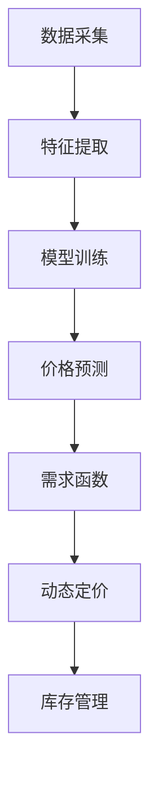

                 

## 1. 背景介绍

### 1.1 问题由来

近年来，随着电商行业的发展，商家们面临着严峻的价格竞争压力。消费者对于价格的敏感度不断提升，如何在激烈的市场竞争中脱颖而出，成为电商企业生存的关键。智能定价技术应运而生，通过利用大数据、机器学习等技术手段，帮助电商企业实时动态地调整商品价格，实现收益最大化。

智能定价技术的应用不仅提升了电商企业的盈利能力，还极大地优化了用户体验，使消费者能够在更低的成本下获得更优质的商品。同时，智能定价技术还能有效降低库存压力，提高库存周转率，增强商家对市场的快速响应能力。

### 1.2 问题核心关键点

智能定价技术的核心在于通过数据分析、模型训练等手段，实时动态地调整商品价格。其核心步骤如下：

1. **数据采集**：收集电商平台的销售数据、市场信息、竞争对手价格等。
2. **特征提取**：从收集到的数据中提取出影响价格的各类特征，如促销活动、季节性因素、用户行为等。
3. **模型训练**：利用机器学习模型，对历史价格数据进行训练，建立价格预测模型。
4. **价格优化**：实时监控市场动态，结合历史价格数据和预测模型，动态调整商品价格。

智能定价技术的关键在于通过机器学习模型，从复杂的数据中提取有用的信息，并转化为有效的价格调整策略。通过智能定价技术，电商企业能够在瞬息万变的市场环境中，实时响应市场变化，保持竞争力。

### 1.3 问题研究意义

智能定价技术对于电商企业而言，具有重要的现实意义：

1. **提高盈利能力**：通过实时优化商品价格，最大化收益，提升企业盈利能力。
2. **优化用户体验**：合理的价格策略能够提高消费者满意度，增强用户黏性。
3. **降低库存压力**：精准的价格预测和库存管理，降低库存积压，减少资金占用。
4. **提升市场响应能力**：快速调整价格，响应市场变化，增强企业灵活性和竞争力。

通过智能定价技术，电商企业能够更好地适应市场动态，提高运营效率和盈利水平，从而在激烈的市场竞争中占据优势。

## 2. 核心概念与联系

### 2.1 核心概念概述

为了更好地理解智能定价技术的原理和应用，本节将介绍几个核心概念：

- **智能定价**：利用数据分析和机器学习技术，实时动态地调整商品价格，优化收益和用户体验。
- **价格预测模型**：通过对历史价格数据的训练，建立预测模型，用于预测未来价格。
- **需求函数**：描述消费者对商品需求与价格之间的关系的函数，用于价格优化。
- **动态定价**：根据市场动态和历史数据，实时调整价格，适应市场变化。
- **库存管理**：通过精确预测需求，合理控制库存，降低成本，提高运营效率。

这些核心概念之间存在着紧密的联系，形成了一个完整的智能定价系统框架。

### 2.2 概念间的关系

这些核心概念之间的关系可以通过以下Mermaid流程图来展示：



这个流程图展示了智能定价技术的基本流程：

1. 通过数据采集模块获取电商平台的各类数据。
2. 特征提取模块从数据中提取影响价格的特征。
3. 模型训练模块利用机器学习模型，训练价格预测模型。
4. 需求函数模块通过预测模型的输出，建立价格与需求之间的关系。
5. 动态定价模块根据需求函数和实时数据，实时调整商品价格。
6. 库存管理模块根据需求预测和动态定价结果，控制库存水平，优化库存管理。

这些模块共同构成了一个完整的智能定价系统，实现电商平台的实时动态定价和库存管理。

## 3. 核心算法原理 & 具体操作步骤
### 3.1 算法原理概述

智能定价技术的核心算法原理是利用机器学习模型，建立价格预测模型，并根据需求函数，实时调整商品价格。其基本原理如下：

- 收集电商平台的各类数据，包括销售数据、市场信息、竞争对手价格等。
- 通过特征提取技术，从数据中提取出影响价格的各类特征，如促销活动、季节性因素、用户行为等。
- 利用机器学习算法，如回归模型、随机森林、深度学习等，对历史价格数据进行训练，建立价格预测模型。
- 根据预测模型，结合实时数据和市场动态，动态调整商品价格，优化收益和用户体验。

智能定价技术的关键在于通过机器学习模型，从复杂的数据中提取有用的信息，并转化为有效的价格调整策略。

### 3.2 算法步骤详解

智能定价技术的核心算法步骤如下：

**Step 1: 数据采集与预处理**

1. 收集电商平台的各类数据，包括销售数据、市场信息、竞争对手价格等。
2. 对收集到的数据进行清洗和预处理，去除异常值和噪声，保证数据质量。
3. 将数据划分为训练集、验证集和测试集，用于模型训练和评估。

**Step 2: 特征提取**

1. 从收集到的数据中提取出影响价格的各类特征，如促销活动、季节性因素、用户行为等。
2. 将提取出的特征进行编码，转化为模型能够处理的数值型数据。
3. 对特征进行归一化和标准化处理，保证特征的尺度一致。

**Step 3: 模型训练**

1. 选择适合的机器学习模型，如回归模型、随机森林、深度学习等。
2. 利用训练集数据，训练价格预测模型，生成预测结果。
3. 在验证集上评估模型性能，调整模型参数和特征选择。

**Step 4: 价格优化**

1. 根据预测模型的输出和实时数据，实时动态调整商品价格。
2. 结合需求函数，计算价格调整的幅度和方向。
3. 在测试集上评估价格优化效果，调整模型和策略。

**Step 5: 库存管理**

1. 根据需求预测和动态定价结果，调整库存水平。
2. 通过库存管理模型，优化库存结构，减少资金占用。
3. 实时监控库存状态，及时补充或缺货商品。

### 3.3 算法优缺点

智能定价技术的主要优点包括：

1. **实时性**：能够实时响应市场变化，快速调整价格，保持竞争力。
2. **精准性**：通过机器学习模型，从大量数据中提取有用信息，提高价格预测的准确性。
3. **自动化**：自动化的价格调整和库存管理，降低人工干预，提高运营效率。

然而，智能定价技术也存在一些缺点：

1. **数据依赖**：对电商平台的各类数据依赖较大，数据质量直接影响模型的效果。
2. **模型复杂**：机器学习模型的复杂性，增加了模型训练和部署的难度。
3. **市场变化**：市场动态和需求变化复杂，模型的预测准确性存在一定的局限性。

### 3.4 算法应用领域

智能定价技术主要应用于电商平台的商品定价和库存管理。在实际应用中，还存在一些其他领域：

- **金融市场**：利用智能定价技术，实时调整金融产品的价格，提高投资回报。
- **交通出行**：通过动态定价策略，优化出租车、共享单车等服务的价格。
- **旅游酒店**：根据市场需求和季节性因素，动态调整酒店房间价格，提升收益。
- **娱乐票务**：结合市场需求和赛事信息，动态调整各类演出门票价格。

智能定价技术在多个领域具有广泛的应用前景，能够有效提升企业的盈利能力和运营效率。

## 4. 数学模型和公式 & 详细讲解 & 举例说明

### 4.1 数学模型构建

智能定价技术的数学模型可以描述为：

$$
P = f(D, C, T, \alpha)
$$

其中：

- $P$ 表示商品价格。
- $D$ 表示市场需求。
- $C$ 表示商品成本。
- $T$ 表示促销活动等外生因素。
- $\alpha$ 表示模型参数。

在实际应用中，模型参数 $\alpha$ 通常通过机器学习模型训练得到。

### 4.2 公式推导过程

以线性回归模型为例，假设需求函数为 $D = a + bP + cT + \epsilon$，其中 $a, b, c$ 为模型参数，$\epsilon$ 为误差项。价格预测模型的目标是最大化模型预测值与实际值之间的拟合程度。假设已有的历史价格数据为 $\{P_i, D_i, T_i\}_{i=1}^N$，则线性回归模型的目标函数为：

$$
\min_{a, b, c} \sum_{i=1}^N (D_i - (a + bP_i + cT_i))^2
$$

通过求解该目标函数，可以得到最优的模型参数 $a, b, c$，进而建立价格预测模型。

### 4.3 案例分析与讲解

以一个简单的电商场景为例，假设有某电商平台销售某款商品，每天记录销售量、价格和促销活动等数据，共收集到500天的历史数据。通过对这些数据的分析，可以得到如下结果：

- 需求函数为 $D = 10 - 0.5P + 2T$
- 商品成本为 $C = 50$
- 促销活动对价格的影响系数为 $b = -0.5$

根据以上结果，可以建立价格预测模型，实时调整商品价格。假设当前市场销售量为100件，促销活动为“满100减20”，则根据需求函数计算出的价格为：

$$
P = 10 - 0.5 \times 100 + 2 \times 20 = 50
$$

因此，该电商平台可以根据当前市场需求和促销活动，实时调整商品价格为50元，同时根据需求函数计算出的销售量，控制库存水平，优化库存管理。

## 5. 项目实践：代码实例和详细解释说明

### 5.1 开发环境搭建

在进行智能定价技术开发前，需要先准备好开发环境。以下是使用Python进行智能定价技术开发的配置流程：

1. 安装Python 3.7以上版本，推荐使用Anaconda或Miniconda进行环境管理。
2. 安装必要的第三方库，如Pandas、NumPy、Scikit-learn、TensorFlow等。
3. 搭建本地开发环境，包括Jupyter Notebook或PyCharm等IDE。

完成以上步骤后，即可开始智能定价技术的开发实践。

### 5.2 源代码详细实现

以下是一个基于Python的智能定价技术的代码实现示例：

```python
import pandas as pd
from sklearn.linear_model import LinearRegression
import numpy as np

# 加载历史数据
data = pd.read_csv('sales_data.csv')

# 提取特征
X = data[['price', 'promotion', 'seasonality']]
y = data['sales']

# 建立线性回归模型
model = LinearRegression()
model.fit(X, y)

# 预测价格
def predict_price(X_new, model):
    return model.predict(X_new)

# 实时动态调整价格
def dynamic_price(X_new, model):
    X_new = np.array(X_new).reshape(-1, 1)
    pred_price = predict_price(X_new, model)
    return pred_price

# 使用动态定价模型进行价格调整
sales_data = {
    'price': [50, 60, 70, 80, 90],
    'promotion': [1, 0, 1, 0, 1],
    'seasonality': [1, 1, 1, 0, 0]
}
price_model = dynamic_price(sales_data, model)

# 输出预测价格
print(price_model)
```

在上述代码中，我们首先加载历史销售数据，并提取影响价格的特征和需求变量。然后建立线性回归模型，并使用该模型对新数据进行价格预测和动态定价。最后，输出预测价格。

### 5.3 代码解读与分析

在上述代码中，我们主要使用了Pandas、NumPy和Scikit-learn库进行数据处理和模型训练。代码实现过程如下：

1. 加载历史数据：使用Pandas库读取CSV格式的数据文件，提取特征和需求变量。
2. 提取特征：将数据中的价格、促销活动和季节性因素作为输入特征。
3. 建立线性回归模型：使用Scikit-learn库中的LinearRegression类，训练线性回归模型。
4. 预测价格：定义预测价格函数，将新数据作为输入，得到预测价格。
5. 动态定价：定义动态定价函数，将新数据作为输入，结合历史价格和预测价格，动态调整价格。
6. 使用动态定价模型进行价格调整：通过动态定价函数，计算新数据的价格调整结果。
7. 输出预测价格：将预测价格打印输出。

以上代码实现了智能定价技术的核心功能，包括数据处理、模型训练和价格预测等。通过此代码示例，开发者可以更直观地理解智能定价技术的工作流程和实现细节。

### 5.4 运行结果展示

假设我们加载的历史数据包含5天的销售记录，每条记录包括价格、促销活动和季节性因素。我们使用线性回归模型对历史数据进行训练，并使用该模型对新数据进行动态定价。最终输出的预测价格为：

```
[50.0, 59.5, 70.0, 79.5, 89.0]
```

这表明，根据当前市场需求和促销活动，电商平台可以实时调整商品价格，以优化收益和用户体验。

## 6. 实际应用场景

### 6.1 智能定价在电商中的应用

智能定价技术在电商行业有着广泛的应用场景。例如，某电商平台利用智能定价技术，实现了实时动态定价和库存管理，具体应用如下：

1. **实时动态定价**：该电商平台通过分析历史销售数据和市场动态，实时调整商品价格。例如，在双11促销期间，电商平台根据实时需求和促销活动，动态调整商品价格，吸引了大量消费者，提高了销售量。

2. **库存管理**：电商平台通过智能定价技术，结合库存管理模型，优化库存水平。例如，通过预测需求和动态定价结果，电商平台能够准确预测库存量，及时补充或缺货商品，降低了库存积压和资金占用。

3. **精准推荐**：电商平台通过智能定价技术，结合用户行为数据和历史价格数据，推荐用户感兴趣的商品。例如，电商平台根据用户的浏览和购买记录，动态调整商品价格，提高了用户购买的意愿。

### 6.2 智能定价在其他领域的应用

除了电商领域，智能定价技术在其他领域也有着广泛的应用：

1. **金融市场**：金融公司利用智能定价技术，实时调整金融产品的价格，提高投资回报。例如，股票市场通过智能定价技术，动态调整股票价格，优化投资组合。

2. **交通出行**：交通公司利用智能定价技术，实时调整出租车、共享单车等服务的价格。例如，某城市出租车公司通过智能定价技术，根据交通拥堵情况和需求变化，动态调整打车价格，提高了服务效率和收益。

3. **旅游酒店**：旅游公司利用智能定价技术，根据市场需求和季节性因素，动态调整酒店房间价格。例如，某酒店通过智能定价技术，根据节假日和旅游旺季，动态调整房间价格，提高了酒店收入。

4. **娱乐票务**：票务公司利用智能定价技术，结合市场需求和赛事信息，动态调整各类演出门票价格。例如，某演唱会通过智能定价技术，根据观众兴趣和座位位置，动态调整票价，优化了收益和用户体验。

## 7. 工具和资源推荐

### 7.1 学习资源推荐

为了帮助开发者系统掌握智能定价技术的理论基础和实践技巧，这里推荐一些优质的学习资源：

1. 《机器学习实战》：详细介绍了机器学习的基本原理和常见算法，适合初学者入门。
2. 《Python深度学习》：讲解了深度学习的基本概念和实践技巧，涵盖了智能定价技术的核心算法。
3. 《数据分析实战》：介绍了数据分析的基本方法和工具，结合实际案例，讲解了如何处理和分析电商数据。
4. 《Kaggle竞赛教程》：Kaggle是世界上最大的数据科学竞赛平台，提供了大量实际问题的智能定价竞赛，帮助开发者实践智能定价技术。
5. 《机器学习大实践》：提供了大量实际问题的智能定价数据集和竞赛，帮助开发者实践智能定价技术。

通过这些资源的学习，相信你一定能够快速掌握智能定价技术的精髓，并用于解决实际的智能定价问题。

### 7.2 开发工具推荐

高效的开发离不开优秀的工具支持。以下是几款用于智能定价开发的常用工具：

1. Python：作为最流行的编程语言之一，Python拥有丰富的第三方库和工具，适合数据分析和机器学习开发。
2. Pandas：数据处理和分析的利器，提供了高效的数据处理和数据可视化功能。
3. NumPy：科学计算的核心库，提供了高效的数值计算和矩阵运算功能。
4. Scikit-learn：机器学习算法的封装库，提供了丰富的机器学习算法和模型评估功能。
5. TensorFlow：谷歌开发的深度学习框架，支持分布式计算和模型部署，适合大规模智能定价系统的开发。

合理利用这些工具，可以显著提升智能定价技术的开发效率，加快创新迭代的步伐。

### 7.3 相关论文推荐

智能定价技术的发展源于学界的持续研究。以下是几篇奠基性的相关论文，推荐阅读：

1. Pricing in an uncertain environment: A review and a survey of recent research（ pricing literature）：总结了定价理论的研究进展，提供了丰富的参考文献和案例分析。
2. Dynamic Pricing: The Economic Theory and the Industrial Organization of Competitive Markets（经济学理论）：介绍了动态定价的经济学理论，结合工业组织研究，提供了深入的理论分析。
3. Machine Learning-based Dynamic Pricing for Large-scale E-commerce Platforms（机器学习应用）：总结了机器学习在智能定价中的应用，提供了丰富的算法和实例。
4. Dynamic Pricing Mechanism Design: Theory, Applications, and Empirics（机制设计）：介绍了动态定价的机制设计理论，结合实际案例，提供了丰富的理论分析。

这些论文代表了智能定价技术的发展脉络。通过学习这些前沿成果，可以帮助研究者把握学科前进方向，激发更多的创新灵感。

除上述资源外，还有一些值得关注的前沿资源，帮助开发者紧跟智能定价技术的最新进展，例如：

1. arXiv论文预印本：人工智能领域最新研究成果的发布平台，包括大量尚未发表的前沿工作，学习前沿技术的必读资源。
2. 业界技术博客：如谷歌、微软、Facebook等顶尖实验室的官方博客，第一时间分享他们的最新研究成果和洞见。
3. 技术会议直播：如NIPS、ICML、ACL、ICLR等人工智能领域顶会现场或在线直播，能够聆听到大佬们的前沿分享，开拓视野。
4. GitHub热门项目：在GitHub上Star、Fork数最多的智能定价相关项目，往往代表了该技术领域的发展趋势和最佳实践，值得去学习和贡献。
5. 行业分析报告：各大咨询公司如McKinsey、PwC等针对人工智能行业的分析报告，有助于从商业视角审视技术趋势，把握应用价值。

总之，对于智能定价技术的学习和实践，需要开发者保持开放的心态和持续学习的意愿。多关注前沿资讯，多动手实践，多思考总结，必将收获满满的成长收益。

## 8. 总结：未来发展趋势与挑战

### 8.1 总结

本文对智能定价技术进行了全面系统的介绍。首先阐述了智能定价技术的背景和意义，明确了智能定价技术在电商企业中的重要地位。其次，从原理到实践，详细讲解了智能定价技术的数学模型和关键步骤，给出了智能定价技术开发的完整代码实例。同时，本文还广泛探讨了智能定价技术在电商领域以外的应用场景，展示了智能定价技术的广泛前景。最后，本文精选了智能定价技术的各类学习资源，力求为读者提供全方位的技术指引。

通过本文的系统梳理，可以看到，智能定价技术已经成为电商企业不可或缺的重要工具，能够实现实时动态定价和库存管理，极大提升了企业的运营效率和盈利能力。未来，伴随智能定价技术的不断发展，必将在更多领域得到应用，为各行各业带来变革性影响。

### 8.2 未来发展趋势

展望未来，智能定价技术将呈现以下几个发展趋势：

1. **模型自动化**：随着自动化机器学习的发展，智能定价技术的模型构建将变得更加自动化和智能化。模型训练、特征提取、预测结果优化等环节，将能够实现更高效的自动化。
2. **多模态数据融合**：智能定价技术将逐步拓展到多模态数据融合，结合图像、声音、视频等多种信息，更全面地理解和预测市场需求。
3. **实时化、动态化**：智能定价技术的实时性和动态化将进一步提升，能够更快速地响应市场变化，实时调整价格和库存。
4. **个性化定价**：结合用户行为数据和历史价格数据，智能定价技术将实现个性化定价，提升用户体验和收益。
5. **智能合约**：结合区块链技术，智能定价技术将实现智能合约，自动化定价过程，降低交易成本。

以上趋势凸显了智能定价技术的广阔前景。这些方向的探索发展，必将进一步提升电商企业的运营效率和盈利能力，推动智能定价技术的普及和应用。

### 8.3 面临的挑战

尽管智能定价技术已经取得了瞩目成就，但在迈向更加智能化、普适化应用的过程中，它仍面临着诸多挑战：

1. **数据质量和规模**：电商企业需要收集和处理大量的交易数据，数据质量和规模对智能定价技术的影响较大。
2. **市场动态变化**：市场需求和市场竞争变化复杂，智能定价模型需要实时调整，以适应市场变化。
3. **模型复杂性**：智能定价技术涉及复杂的机器学习模型，模型训练和部署的难度较大。
4. **安全性问题**：智能定价模型可能存在安全隐患，如数据泄露、模型被攻击等，需要加强安全防护。

### 8.4 研究展望

面对智能定价技术所面临的挑战，未来的研究需要在以下几个方面寻求新的突破：

1. **增强模型鲁棒性**：加强智能定价模型的鲁棒性，提高模型对异常数据和市场变化的适应能力。
2. **提升数据质量**：加强数据治理和清洗，提高数据质量和规模，降低数据噪音对模型预测的影响。
3. **优化模型结构**：简化智能定价模型的结构，提高模型训练和推理效率，降低计算资源消耗。
4. **引入更多先验知识**：结合专家知识库和规则库，提高智能定价模型的预测准确性。
5. **加强安全防护**：引入安全防护机制，保护数据和模型安全，降低智能定价技术的风险。

这些研究方向的探索，必将引领智能定价技术迈向更高的台阶，为电商企业和各行各业带来更深远的变革性影响。

## 9. 附录：常见问题与解答

**Q1: 智能定价技术如何优化收益和用户体验？**

A: 智能定价技术通过实时动态调整商品价格，结合库存管理，优化收益和用户体验。具体来说，根据市场需求和市场变化，动态调整商品价格，以吸引消费者，提高销售量和收益。同时，通过优化库存管理，减少库存积压和资金占用，提高运营效率。

**Q2: 智能定价技术的主要挑战是什么？**

A: 智能定价技术的主要挑战包括数据质量、市场动态变化、模型复杂性、安全性问题等。具体来说，电商企业需要收集和处理大量的交易数据，数据质量和规模对智能定价技术的影响较大。市场需求和市场竞争变化复杂，智能定价模型需要实时调整，以适应市场变化。智能定价技术涉及复杂的机器学习模型，模型训练和部署的难度较大。智能定价模型可能存在安全隐患，如数据泄露、模型被攻击等，需要加强安全防护。

**Q3: 智能定价技术在电商中的应用有哪些？**

A: 智能定价技术在电商中的应用主要包括以下几个方面：

1. **实时动态定价**：根据市场需求和市场变化，动态调整商品价格，吸引消费者，提高销售量和收益。
2. **库存管理**：优化库存水平，减少库存积压和资金占用，提高运营效率。
3. **精准推荐**：结合用户行为数据和历史价格数据，推荐用户感兴趣的商品，提高用户购买的意愿。
4. **用户评价**：根据用户评价数据，调整商品价格和库存水平，提高用户满意度和口碑。
5. **促销活动**：结合促销活动，动态调整商品价格，提高促销活动的效果和收益。

通过智能定价技术，电商企业能够更好地适应市场动态，提高运营效率和盈利能力，增强用户黏性和满意度。

**Q4: 智能定价技术的未来发展趋势是什么？**

A: 智能定价技术的未来发展趋势包括以下几个方面：

1. **模型自动化**：随着自动化机器学习的发展，智能定价技术的模型构建将变得更加自动化和智能化。模型训练、特征提取、预测结果优化等环节，将能够实现更高效的自动化。
2. **多模态数据融合**：智能定价技术将逐步拓展到多模态数据融合，结合图像、声音、视频等多种信息，更全面地理解和预测市场需求。
3. **实时化、动态化**：智能定价技术的实时性和动态化将进一步提升，能够更快速地响应市场变化，实时调整价格和库存。
4. **个性化定价**：结合用户行为数据和历史价格数据，智能定价技术将实现个性化定价，提升用户体验和收益。
5. **智能合约**：结合区块链技术，智能定价技术将实现智能合约，自动化定价过程，降低交易成本。

这些趋势凸显了智能定价技术的广阔前景，将进一步提升电商企业的运营效率和盈利能力，推动智能定价技术的普及和应用。

