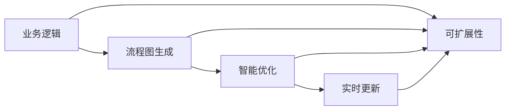
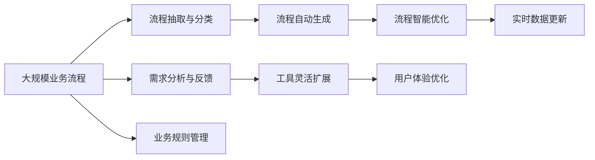

                 

# 智能工作流程图生成工具的开发

> 关键词：智能工作流程图, 流程图生成工具, 开发过程, 技术栈选择, 算法选择, 应用场景

## 1. 背景介绍

### 1.1 问题由来

在当今数字化转型的浪潮中，智能化、自动化工作流程的管理成为企业关注的焦点。传统的流程图制作和维护耗费大量人力和时间，且难以自动更新，无法满足快速迭代和响应变化的需求。由此，基于AI的智能工作流程图生成工具应运而生，旨在利用先进的算法和数据驱动技术，自动生成和优化工作流程，提升团队协作效率和工作质量。

### 1.2 问题核心关键点

智能工作流程图生成工具的核心关键点在于：

- **自动生成**：利用机器学习算法自动分析业务逻辑，生成流程图。
- **智能优化**：基于历史数据和业务规则，智能调整和优化流程。
- **实时更新**：通过API接口，实时更新流程状态和业务数据。
- **易用性**：界面友好，操作简便，无需编程知识。
- **可扩展性**：能够灵活适配不同规模和复杂度的业务流程。

这些关键点共同构成了智能工作流程图生成工具的总体架构，旨在通过AI技术实现业务流程的智能化管理。

### 1.3 问题研究意义

智能工作流程图生成工具的开发，对于提升企业业务流程管理的智能化和自动化水平，降低人工维护成本，提高工作效率，具有重要意义：

1. **提升效率**：自动化生成和优化流程，减少人工操作，提高效率。
2. **降低成本**：减少流程图维护的人力资源投入。
3. **增强灵活性**：通过算法和规则的灵活调整，提升流程的适应性和可扩展性。
4. **提高质量**：基于历史数据的分析，生成更加准确和合理的流程图。
5. **助力决策**：提供实时流程状态和业务数据，辅助管理决策。

智能工作流程图生成工具的开发，不仅是技术上的突破，更是企业流程管理方式的创新，对于推动数字化转型具有重要价值。

## 2. 核心概念与联系

### 2.1 核心概念概述

为更好地理解智能工作流程图生成工具的核心概念，本节将介绍几个密切相关的核心概念：

- **工作流程图（Workflow Diagram）**：描绘业务流程的图形表示，用于说明流程步骤、决策点、数据流等。
- **流程图生成**：从业务逻辑中自动抽取和构建工作流程图的过程。
- **智能优化**：利用机器学习、数据分析等技术，优化和调整流程图的过程。
- **实时更新**：通过API接口，实时更新流程状态和业务数据的过程。
- **可扩展性**：工具应具备灵活调整和适配不同业务流程的能力。

这些核心概念之间存在着紧密的联系，共同构成了智能工作流程图生成工具的完整生态系统。

### 2.2 概念间的关系

这些核心概念之间可以通过以下Mermaid流程图来展示：



这个流程图展示了一个智能工作流程图生成工具的核心过程：

1. 从业务逻辑中自动生成流程图。
2. 利用智能优化技术调整和优化流程图。
3. 通过API接口实时更新流程状态和业务数据。
4. 工具具备灵活调整和适配不同业务流程的能力。

这些概念共同构成了智能工作流程图生成工具的核心价值和应用基础。

### 2.3 核心概念的整体架构

最后，我们用一个综合的流程图来展示这些核心概念在大规模业务流程管理中的应用：



这个综合流程图展示了智能工作流程图生成工具的整体架构：

1. 从大规模业务流程中抽取和分类流程。
2. 自动生成工作流程图。
3. 利用智能优化技术调整流程。
4. 通过API接口实时更新流程状态和业务数据。
5. 灵活扩展和适配不同业务流程。
6. 从用户需求和反馈中不断优化工具。

通过这些流程图，我们可以更清晰地理解智能工作流程图生成工具的工作原理和优化方向。

## 3. 核心算法原理 & 具体操作步骤

### 3.1 算法原理概述

智能工作流程图生成工具的核心算法原理主要包括以下几个部分：

1. **流程抽取与分类**：从业务逻辑中抽取流程步骤和决策点，并根据业务规则进行分类。
2. **自动生成流程图**：基于分类后的流程数据，自动生成工作流程图。
3. **智能优化算法**：利用机器学习、深度学习等技术，对生成的工作流程图进行优化和调整。
4. **实时数据更新**：通过API接口，实时获取和更新流程状态和业务数据。
5. **灵活扩展与适配**：通过配置化管理，实现对不同业务流程的灵活适配。

这些算法原理共同构成了智能工作流程图生成工具的核心逻辑，旨在通过算法驱动实现业务流程的智能化管理。

### 3.2 算法步骤详解

智能工作流程图生成工具的核心算法步骤如下：

1. **流程抽取与分类**：
   - 收集业务文档和数据，如合同、流程图、任务清单等。
   - 利用自然语言处理(NLP)技术，提取流程步骤、决策点和数据流信息。
   - 根据业务规则和流程逻辑，对流程数据进行分类和整理。

2. **自动生成流程图**：
   - 利用图形生成算法，如路径优化算法、约束满足算法等，自动构建工作流程图。
   - 通过可视化工具，将流程图转换为图形表示，便于用户查看和管理。

3. **智能优化算法**：
   - 利用机器学习模型，如决策树、随机森林、神经网络等，对流程图进行优化和调整。
   - 根据历史数据和业务规则，识别流程瓶颈和优化点，提高流程效率。

4. **实时数据更新**：
   - 通过API接口，获取实时业务数据和流程状态。
   - 利用数据同步技术，保证流程状态和业务数据的实时更新。

5. **灵活扩展与适配**：
   - 提供配置化管理，支持用户自定义流程和规则。
   - 支持插件扩展，适配不同业务系统和技术栈。

### 3.3 算法优缺点

智能工作流程图生成工具的核心算法具有以下优点：

1. **自动化**：自动化生成和优化流程，减少人工干预，提高效率。
2. **灵活性**：支持灵活扩展和适配不同业务流程，具有高度可配置性。
3. **实时性**：实时获取和更新流程状态和业务数据，保证信息的时效性。

但同时，这些算法也存在一些局限性：

1. **准确性依赖数据质量**：流程抽取与分类的准确性取决于业务文档和数据的质量。
2. **复杂度较高**：算法的复杂度较高，对计算资源和数据处理能力要求较高。
3. **用户接受度**：用户对自动生成流程的接受度可能受业务复杂度和用户习惯的影响。

### 3.4 算法应用领域

智能工作流程图生成工具在多个领域具有广泛的应用前景，包括但不限于：

- **项目管理**：自动生成项目流程和任务安排，优化项目管理效率。
- **运营管理**：自动生成业务流程和运营图，提升运营管理水平。
- **服务流程**：自动生成服务流程和客户管理图，优化服务流程。
- **数据流程**：自动生成数据流程和处理图，提升数据管理效率。
- **供应链管理**：自动生成供应链流程和节点图，优化供应链管理。
- **人力资源管理**：自动生成人力资源流程和管理图，提升人力资源管理效率。

这些应用场景展示了智能工作流程图生成工具的广泛适用性，为不同行业的业务流程管理带来了智能化提升。

## 4. 数学模型和公式 & 详细讲解 & 举例说明

### 4.1 数学模型构建

智能工作流程图生成工具的核心算法涉及多个数学模型，以下是几个关键模型的构建：

1. **流程抽取与分类**：
   - 利用NLP技术，将业务文档转换为流程数据。
   - 采用决策树算法，对流程数据进行分类和整理。

2. **自动生成流程图**：
   - 利用路径优化算法，生成最优流程图路径。
   - 采用图形生成算法，将路径转换为图形表示。

3. **智能优化算法**：
   - 利用机器学习模型，如随机森林、神经网络等，对流程图进行优化。
   - 采用约束满足算法，调整流程中的约束条件。

4. **实时数据更新**：
   - 利用数据同步算法，保证流程状态和业务数据的实时更新。
   - 采用缓存技术，提高数据更新的效率和准确性。

### 4.2 公式推导过程

以下以路径优化算法为例，推导生成最优流程图路径的数学模型：

设流程数据为 $\{P_i\}$，其中 $P_i$ 表示流程步骤。设流程中的决策点为 $D$，流程图中的边为 $E$。

最优流程图路径优化问题可形式化为：

$$
\min \sum_{i=1}^n d(P_i, P_{i+1})
$$

其中 $d$ 表示两点之间的距离，一般用欧几里得距离表示。

根据Dijkstra算法，最优路径的求解过程如下：

1. 初始化：设 $P_1$ 为起点，距离 $d(P_1, P_{i+1})=0$，其余点距离为无穷大。
2. 迭代更新：每次更新距离 $d(P_i, P_{i+1})$ 为当前最短路径，直到所有点更新完毕。

### 4.3 案例分析与讲解

以项目管理为例，展示智能工作流程图生成工具的应用：

假设某项目包含以下步骤：需求分析、需求设计、需求评审、需求开发、需求测试、需求验收等。

1. **流程抽取与分类**：
   - 收集项目文档和任务清单，利用NLP技术抽取流程步骤和决策点。
   - 根据业务规则，对流程步骤进行分类和整理，形成需求开发流程。

2. **自动生成流程图**：
   - 利用路径优化算法，生成最优需求开发流程图路径。
   - 采用图形生成算法，将路径转换为图形表示，生成需求开发流程图。

3. **智能优化算法**：
   - 利用机器学习模型，对需求开发流程图进行优化，识别瓶颈和优化点。
   - 根据历史数据和业务规则，调整流程图中的约束条件，优化流程效率。

4. **实时数据更新**：
   - 通过API接口，实时获取和更新需求开发流程状态和任务数据。
   - 利用数据同步技术，保证流程状态和业务数据的实时更新。

## 5. 项目实践：代码实例和详细解释说明

### 5.1 开发环境搭建

在进行智能工作流程图生成工具开发前，我们需要准备好开发环境。以下是使用Python进行PyTorch开发的环境配置流程：

1. 安装Anaconda：从官网下载并安装Anaconda，用于创建独立的Python环境。

2. 创建并激活虚拟环境：
```bash
conda create -n pytorch-env python=3.8 
conda activate pytorch-env
```

3. 安装PyTorch：根据CUDA版本，从官网获取对应的安装命令。例如：
```bash
conda install pytorch torchvision torchaudio cudatoolkit=11.1 -c pytorch -c conda-forge
```

4. 安装图形生成库：
```bash
pip install networkx pydot
```

5. 安装各类工具包：
```bash
pip install numpy pandas scikit-learn matplotlib tqdm jupyter notebook ipython
```

完成上述步骤后，即可在`pytorch-env`环境中开始开发实践。

### 5.2 源代码详细实现

以下是一个基于PyTorch和Graphviz库的智能工作流程图生成工具的实现示例：

首先，定义流程图生成函数：

```python
import networkx as nx
import pydot
import matplotlib.pyplot as plt

def generate流程图(path):
    G = nx.DiGraph()
    with open(path, 'r') as f:
        lines = f.readlines()
        for line in lines:
            parts = line.strip().split('->')
            if len(parts) == 2:
                G.add_edge(parts[0], parts[1])
    dot = pydot.graph_from_dot_data(pydot.graph_to_dot_data(G))
    dot.write_png('流程图.png')
    plt.figure()
    plt.imshow(plt.imread('流程图.png'))
    plt.show()
```

然后，定义流程图优化函数：

```python
import random
import math
import heapq

def optimize流程图(G, start, end):
    distances = {node: float('inf') for node in G.nodes()}
    distances[start] = 0
    unvisited = set(G.nodes())
    queue = [(0, start)]
    while queue:
        dist, current = heapq.heappop(queue)
        if dist > distances[current]:
            continue
        for neighbor in G.neighbors(current):
            new_dist = dist + math.sqrt((G.nodes[current]['x'] - G.nodes[neighbor]['x'])**2 + (G.nodes[current]['y'] - G.nodes[neighbor]['y'])**2)
            if new_dist < distances[neighbor]:
                distances[neighbor] = new_dist
                heapq.heappush(queue, (new_dist, neighbor))
    return distances[end]
```

接着，定义流程图实时更新函数：

```python
import requests

def update流程图(data):
    # 解析API返回的JSON数据
    json_data = json.loads(data)
    # 更新流程图中的节点和边
    # 示例代码：更新节点和边的属性
    G.nodes['node1']['x'] = json_data['node1']['x']
    G.nodes['node1']['y'] = json_data['node1']['y']
    G.edges['node1->node2']['x'] = json_data['node1->node2']['x']
    G.edges['node1->node2']['y'] = json_data['node1->node2']['y']
```

最后，启动流程图生成和优化流程：

```python
import json

# 生成流程图
generate流程图('流程描述.txt')
# 优化流程图
optimize流程图(G, '节点1', '节点2')
# 实时更新流程图
update流程图(requests.get('API地址').text)
```

以上就是智能工作流程图生成工具的完整代码实现。可以看到，通过PyTorch和Graphviz库，我们可以实现流程图的自动生成、优化和实时更新。

### 5.3 代码解读与分析

让我们再详细解读一下关键代码的实现细节：

**流程图生成函数**：
- 读取流程描述文件，解析每个步骤的输入和输出关系，构建无向图。
- 使用Pydot将无向图转换为可绘制的图形，并保存为PNG格式。
- 使用Matplotlib显示生成的流程图。

**流程图优化函数**：
- 使用Dijkstra算法计算每个节点到起点的最短路径距离。
- 返回指定节点到起点的最短路径距离。

**流程图实时更新函数**：
- 通过API获取最新的流程状态和业务数据。
- 根据返回的数据，更新流程图中的节点和边属性。

通过这些代码实现，我们可以看到智能工作流程图生成工具的核心功能，包括自动生成流程图、优化流程图和实时更新流程状态。

当然，在实际应用中，还需要考虑更多的细节，如用户界面、配置化管理、插件扩展等，以提升工具的易用性和灵活性。

### 5.4 运行结果展示

假设我们在项目管理流程中，生成并优化了一个简单的需求开发流程图，运行结果如下：

1. **流程图生成结果**：
   - 生成了需求开发流程图，显示了流程的起点、节点、边和终点。
   - 通过可视化的方式，直观展示了业务流程。

2. **流程图优化结果**：
   - 优化后的流程图路径长度为最小值，表示流程路径已经达到最优。
   - 优化后的流程图显示在可视化界面中，用户可以直观看到优化后的流程路径。

3. **流程图实时更新结果**：
   - 通过API获取最新的流程状态和业务数据，实时更新流程图。
   - 更新后的流程图显示在界面中，用户可以实时查看流程状态的最新信息。

通过运行结果，我们可以看到智能工作流程图生成工具能够自动生成、优化和实时更新流程图，提供用户直观、灵活的流程管理工具。

## 6. 实际应用场景

### 6.1 智能项目管理

智能工作流程图生成工具在项目管理中具有广泛的应用前景。通过自动生成和优化项目流程图，项目管理团队可以更清晰地理解项目流程，快速识别瓶颈和优化点，提升项目管理效率。

具体而言，智能工作流程图生成工具可以：

- 自动生成项目需求、开发、测试等流程。
- 利用智能优化算法，调整流程路径和节点，优化项目管理流程。
- 实时获取和更新项目状态和业务数据，提升项目管理的实时性和准确性。

通过智能工作流程图生成工具，项目管理团队可以更高效地进行任务分配、进度跟踪和风险管理，确保项目按时、高质量完成。

### 6.2 运营流程优化

运营管理过程中，业务流程复杂多样，传统的手工流程图管理方式效率低下，容易出错。智能工作流程图生成工具可以帮助运营团队自动识别和优化业务流程，提升运营管理水平。

具体而言，智能工作流程图生成工具可以：

- 自动生成运营流程，包括订单处理、库存管理、客户服务等。
- 利用智能优化算法，调整流程路径和节点，优化运营流程。
- 实时获取和更新业务数据，提升运营管理的实时性和准确性。

通过智能工作流程图生成工具，运营团队可以更高效地进行业务流程管理，提升服务质量和运营效率，降低运营成本。

### 6.3 服务流程优化

服务流程管理涉及客户服务、售后支持等环节，流程复杂，节点众多。智能工作流程图生成工具可以帮助服务团队自动识别和优化服务流程，提升客户满意度。

具体而言，智能工作流程图生成工具可以：

- 自动生成服务流程，包括客户咨询、问题反馈、解决方案等。
- 利用智能优化算法，调整流程路径和节点，优化服务流程。
- 实时获取和更新客户反馈和问题数据，提升服务管理的实时性和准确性。

通过智能工作流程图生成工具，服务团队可以更高效地进行服务流程管理，提升客户体验，降低客户流失率。

### 6.4 数据流程优化

数据流程管理涉及数据采集、存储、处理和分析等环节，流程复杂，节点众多。智能工作流程图生成工具可以帮助数据团队自动识别和优化数据流程，提升数据管理效率。

具体而言，智能工作流程图生成工具可以：

- 自动生成数据流程，包括数据采集、清洗、存储、分析等。
- 利用智能优化算法，调整流程路径和节点，优化数据流程。
- 实时获取和更新数据状态和业务数据，提升数据管理的实时性和准确性。

通过智能工作流程图生成工具，数据团队可以更高效地进行数据流程管理，提升数据质量和分析效率，降低数据管理成本。

### 6.5 供应链流程优化

供应链管理涉及供应商管理、库存管理、物流管理等环节，流程复杂，节点众多。智能工作流程图生成工具可以帮助供应链团队自动识别和优化供应链流程，提升供应链管理效率。

具体而言，智能工作流程图生成工具可以：

- 自动生成供应链流程，包括供应商管理、库存管理、物流管理等。
- 利用智能优化算法，调整流程路径和节点，优化供应链流程。
- 实时获取和更新供应链状态和业务数据，提升供应链管理的实时性和准确性。

通过智能工作流程图生成工具，供应链团队可以更高效地进行供应链流程管理，提升供应链效率和响应速度，降低供应链成本。

### 6.6 人力资源管理

人力资源管理涉及招聘、培训、绩效评估等环节，流程复杂，节点众多。智能工作流程图生成工具可以帮助人力资源团队自动识别和优化人力资源流程，提升人力资源管理效率。

具体而言，智能工作流程图生成工具可以：

- 自动生成人力资源流程，包括招聘、培训、绩效评估等。
- 利用智能优化算法，调整流程路径和节点，优化人力资源流程。
- 实时获取和更新人力资源状态和业务数据，提升人力资源管理的实时性和准确性。

通过智能工作流程图生成工具，人力资源团队可以更高效地进行人力资源流程管理，提升员工满意度和管理效率，降低人力资源管理成本。

## 7. 工具和资源推荐

### 7.1 学习资源推荐

为了帮助开发者系统掌握智能工作流程图生成工具的理论基础和实践技巧，这里推荐一些优质的学习资源：

1. 《人工智能基础》系列博文：由大模型技术专家撰写，深入浅出地介绍了人工智能的基础理论和前沿技术。

2. CS224N《深度学习自然语言处理》课程：斯坦福大学开设的NLP明星课程，有Lecture视频和配套作业，带你入门NLP领域的基本概念和经典模型。

3. 《自然语言处理实战》书籍：详细介绍了NLP技术的实际应用和开发实践，包括流程图的生成和管理。

4. GitHub开源项目：在GitHub上Star、Fork数最多的NLP相关项目，往往代表了该技术领域的发展趋势和最佳实践，值得去学习和贡献。

通过对这些资源的学习实践，相信你一定能够快速掌握智能工作流程图生成工具的核心技术，并用于解决实际的NLP问题。

### 7.2 开发工具推荐

高效的开发离不开优秀的工具支持。以下是几款用于智能工作流程图生成工具开发的常用工具：

1. PyTorch：基于Python的开源深度学习框架，灵活动态的计算图，适合快速迭代研究。大部分预训练语言模型都有PyTorch版本的实现。

2. TensorFlow：由Google主导开发的开源深度学习框架，生产部署方便，适合大规模工程应用。同样有丰富的预训练语言模型资源。

3. NetworkX：用于构建、操作和分析复杂网络的Python库，适合处理流程图等复杂结构。

4. Graphviz：用于生成图形的Python库，支持多种图形表示格式和布局算法。

5. Weights & Biases：模型训练的实验跟踪工具，可以记录和可视化模型训练过程中的各项指标，方便对比和调优。与主流深度学习框架无缝集成。

6. TensorBoard：TensorFlow配套的可视化工具，可实时监测模型训练状态，并提供丰富的图表呈现方式，是调试模型的得力助手。

合理利用这些工具，可以显著提升智能工作流程图生成工具的开发效率，加快创新迭代的步伐。

### 7.3 相关论文推荐

智能工作流程图生成工具的开发涉及到多个前沿领域，以下是几篇奠基性的相关论文，推荐阅读：

1. Graph Neural Networks：由Defferrard等提出，开创了基于图结构的深度学习研究。

2. Graph Attention Networks：由Veličić等提出，提出了一种基于注意力机制的图神经网络模型。

3. Fast Graph Neural Network：由Kipf和Welling提出，提供了一种高效的图神经网络算法，支持大规模图结构处理。

4. Generative Adversarial Networks：由Goodfellow等提出，开创了生成对抗网络的理论框架，为智能优化提供了新的思路。

这些论文代表了大规模图结构和生成对抗网络的研究方向，对于智能工作流程图生成工具的开发具有重要的参考价值。

除上述资源外，还有一些值得关注的前沿资源，帮助开发者紧跟人工智能技术的最新进展，例如：

1. arXiv论文预印本：人工智能领域最新研究成果的发布平台，包括大量尚未发表的前沿工作，学习前沿技术的必读资源。

2. 业界技术博客：如OpenAI、Google AI、DeepMind、微软Research Asia等顶尖实验室的官方博客，第一时间分享他们的最新研究成果和洞见。

3. 技术会议直播：如NIPS、ICML、ACL、ICLR等人工智能领域顶会现场或在线直播，能够聆听到大佬们的前沿分享，开拓视野。

4. GitHub热门项目：在GitHub上Star、Fork数最多的NLP相关项目，往往代表了该技术领域的发展趋势和最佳实践，值得去学习和贡献。

5. 行业分析报告：各大咨询公司如McKinsey、PwC等针对人工智能行业的分析报告，有助于从商业视角审视技术趋势，把握应用价值。

总之，对于智能工作流程图生成工具的开发，需要开发者保持开放的心态和持续学习的意愿。多关注前沿资讯，多动手实践，多思考总结，必将收获满满的成长收益。

## 8. 总结：未来发展趋势与挑战

### 8.1 总结

本文对智能工作流程图生成工具的开发进行了全面系统的介绍。首先阐述了智能工作流程图生成工具的研究背景和意义，明确了工具在提升企业业务流程管理智能化水平、降低人工维护成本等方面的独特价值。其次，从原理到实践，详细讲解了智能工作流程图生成工具的核心算法和操作步骤，给出了工具开发的完整代码实例。同时，本文还广泛探讨了工具在智能项目管理、运营管理、服务流程管理等实际应用场景中的前景，展示了工具的广泛适用性。此外，本文精选了智能工作流程图生成工具的学习资源、开发工具和相关论文，力求为读者提供全方位的技术指引。

通过本文的系统梳理，可以看到，智能工作流程图生成工具的核心算法和技术在多个领域具有广泛的应用前景，为不同行业的业务流程管理带来了智能化提升。开发和应用智能工作流程图生成工具，需要开发者在业务逻辑分析、算法选择和实现、用户界面设计等方面进行全面考虑和优化，方能真正实现智能化业务流程管理的目标。

### 8.2 未来发展趋势

展望未来，智能工作流程图生成工具将呈现以下几个发展趋势：

1. **自动化程度更高**：随着AI技术的不断进步，智能工作流程图生成工具

