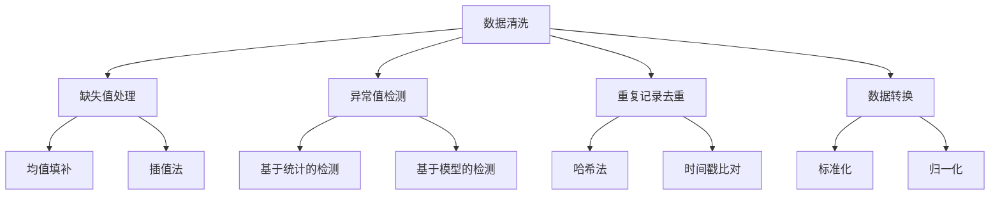
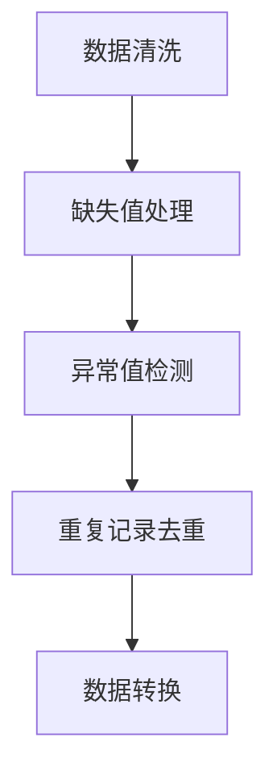
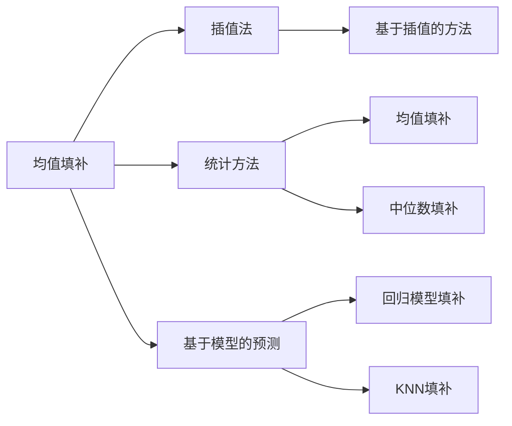
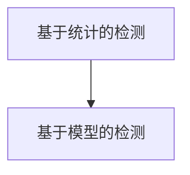

                 

# 智能数据清洗在大数据处理中的应用

> 关键词：大数据,数据清洗,机器学习,算法,深度学习

## 1. 背景介绍

### 1.1 问题由来
在当今数据驱动的时代，数据无处不在，但数据的质量直接影响到最终分析的准确性和可靠性。数据清洗是确保数据质量、提高数据分析效率的重要步骤。传统的数据清洗方法依赖人工操作，耗时费力，难以应对海量数据的大规模处理需求。随着人工智能和大数据技术的发展，智能数据清洗应运而生。它通过机器学习和深度学习算法，自动化的识别和修复数据中的错误，提高数据清洗的效率和准确性。

### 1.2 问题核心关键点
智能数据清洗的核心在于如何高效、准确地识别数据中的错误，并自动进行修复。常用的方法包括缺失值处理、重复记录去重、异常值检测和修正等。智能数据清洗的关键点包括：

- 自动化错误识别：利用机器学习算法，自动检测数据中的错误和异常。
- 高效修复策略：设计高效的修复方法，尽量保留原有数据的真实性和完整性。
- 数据一致性保障：确保清洗后的数据一致性和完整性，满足后续分析需求。

### 1.3 问题研究意义
智能数据清洗的自动化、高效性及准确性，使得数据处理效率大大提高。它不仅节省了大量的人力成本，还能在短时间内处理海量数据，提高数据分析的及时性和可靠性。此外，智能数据清洗还能够识别和修复数据中的潜在错误，提升数据质量，确保分析结果的准确性。这些优点使得智能数据清洗成为大数据处理中不可或缺的一环。

## 2. 核心概念与联系

### 2.1 核心概念概述

为更好地理解智能数据清洗的原理，本节将介绍几个密切相关的核心概念：

- **数据清洗(Data Cleaning)**：指通过算法和技术手段，去除数据中的错误、冗余和不一致，确保数据的质量和完整性。
- **缺失值处理(Missing Value Imputation)**：指在数据中存在缺失值时，通过算法预测并填充缺失值。
- **异常值检测(Outlier Detection)**：指识别数据中的极端值，可能由于错误、异常或噪声引起。
- **重复记录去重(Duplicate Record Removal)**：指识别并去除数据中的重复记录，确保数据的一致性。
- **数据转换(Data Transformation)**：指通过算法将数据转换为适合分析的格式，如归一化、标准化等。

这些核心概念之间的逻辑关系可以通过以下Mermaid流程图来展示：



这个流程图展示了大数据清洗中的主要任务及其之间的关系：

1. 数据清洗是整个流程的起点。
2. 缺失值处理、异常值检测和重复记录去重是数据清洗中的三大任务。
3. 数据转换是清洗后数据处理的必要步骤。
4. 具体的处理策略和方法，如均值填补、插值法、统计检测、模型检测等，则是具体的实施手段。

### 2.2 概念间的关系

这些核心概念之间存在着紧密的联系，形成了数据清洗的完整生态系统。下面我们通过几个Mermaid流程图来展示这些概念之间的关系。

#### 2.2.1 数据清洗的流程



这个流程图展示了大数据清洗的主要流程：先进行缺失值处理、异常值检测和重复记录去重，再进行数据转换。

#### 2.2.2 缺失值处理的方法



这个流程图展示了常见的缺失值处理方法，包括均值填补、插值法、统计方法和基于模型的预测。

#### 2.2.3 异常值检测的方法



这个流程图展示了异常值检测的两种主要方法，即基于统计的方法和基于模型的检测。

### 2.3 核心概念的整体架构

最后，我们用一个综合的流程图来展示这些核心概念在大数据清洗过程中的整体架构：

```mermaid
graph TB
    A[大数据] --> B[缺失值处理]
    B --> C[异常值检测]
    C --> D[重复记录去重]
    D --> E[数据转换]
    E --> F[缺失值处理]
    F --> G[异常值检测]
    G --> H[重复记录去重]
    H --> I[数据转换]
    I --> J[缺失值处理]
    J --> K[异常值检测]
    K --> L[重复记录去重]
    L --> M[数据转换]
    M --> N[缺失值处理]
    N --> O[异常值检测]
    O --> P[重复记录去重]
    P --> Q[数据转换]
    Q --> R[缺失值处理]
    R --> S[异常值检测]
    S --> T[重复记录去重]
    T --> U[数据转换]
    U --> V[缺失值处理]
    V --> W[异常值检测]
    W --> X[重复记录去重]
    X --> Y[数据转换]
    Y --> Z[缺失值处理]
    Z --> AA[异常值检测]
    AA --> AB[重复记录去重]
    AB --> AC[数据转换]
    AC --> AD[缺失值处理]
    AD --> AE[异常值检测]
    AE --> AF[重复记录去重]
    AF --> AG[数据转换]
    AG --> AH[缺失值处理]
    AH --> AI[异常值检测]
    AI --> AJ[重复记录去重]
    AJ --> AK[数据转换]
    AK --> AL[缺失值处理]
    AL --> AM[异常值检测]
    AM --> AN[重复记录去重]
    AN --> AO[数据转换]
    AO --> AP[缺失值处理]
    AP --> AQ[异常值检测]
    AQ --> AR[重复记录去重]
    AR --> AS[数据转换]
    AS --> AT[缺失值处理]
    AT --> AU[异常值检测]
    AU --> AV[重复记录去重]
    AV --> AW[数据转换]
    AW --> AX[缺失值处理]
    AX --> AY[异常值检测]
    AY --> AZ[重复记录去重]
    AZ --> BA[数据转换]
    BA --> BB[缺失值处理]
    BB --> BC[异常值检测]
    BC --> BD[重复记录去重]
    BD --> BE[数据转换]
    BE --> BF[缺失值处理]
    BF --> BG[异常值检测]
    BG --> BH[重复记录去重]
    BH --> BI[数据转换]
    BI --> BJ[缺失值处理]
    BJ --> BK[异常值检测]
    BK --> BL[重复记录去重]
    BL --> BM[数据转换]
    BM --> BN[缺失值处理]
    BN --> BO[异常值检测]
    BO --> BP[重复记录去重]
    BP --> BQ[数据转换]
    BQ --> BR[缺失值处理]
    BR --> BS[异常值检测]
    BS --> BT[重复记录去重]
    BT --> BU[数据转换]
    BU --> BV[缺失值处理]
    BV --> BW[异常值检测]
    BW --> BX[重复记录去重]
    BX --> BY[数据转换]
    BY --> BZ[缺失值处理]
    BZ --> CA[异常值检测]
    CA --> CB[重复记录去重]
    CB --> CC[数据转换]
    CC --> CD[缺失值处理]
    CD --> CE[异常值检测]
    CE --> CF[重复记录去重]
    CF --> CG[数据转换]
    CG --> CH[缺失值处理]
    CH --> CI[异常值检测]
    CI --> CJ[重复记录去重]
    CJ --> CK[数据转换]
    CK --> CL[缺失值处理]
    CL --> CM[异常值检测]
    CM --> CN[重复记录去重]
    CN --> CO[数据转换]
    CO --> CP[缺失值处理]
    CP --> CQ[异常值检测]
    CQ --> CR[重复记录去重]
    CR --> CS[数据转换]
    CS --> CT[缺失值处理]
    CT --> CU[异常值检测]
    CU --> CV[重复记录去重]
    CV --> CW[数据转换]
    CW --> CX[缺失值处理]
    CX --> CY[异常值检测]
    CY --> CZ[重复记录去重]
    CZ --> DA[数据转换]
    DA --> DB[缺失值处理]
    DB --> DC[异常值检测]
    DC --> DD[重复记录去重]
    DD --> DE[数据转换]
    DE --> DF[缺失值处理]
    DF --> DG[异常值检测]
    DG --> DH[重复记录去重]
    DH --> DI[数据转换]
    DI --> DJ[缺失值处理]
    DJ --> DK[异常值检测]
    DK --> DL[重复记录去重]
    DL --> DM[数据转换]
    DM --> DN[缺失值处理]
    DN --> DO[异常值检测]
    DO --> DP[重复记录去重]
    DP --> DQ[数据转换]
    DQ --> DR[缺失值处理]
    DR --> DS[异常值检测]
    DS --> DT[重复记录去重]
    DT --> DU[数据转换]
    DU --> DV[缺失值处理]
    DV --> DW[异常值检测]
    DW --> DX[重复记录去重]
    DX --> DY[数据转换]
    DY --> DZ[缺失值处理]
    DZ --> EA[异常值检测]
    EA --> EB[重复记录去重]
    EB --> EC[数据转换]
    EC --> ED[缺失值处理]
    ED --> EE[异常值检测]
    EE --> EF[重复记录去重]
    EF --> EG[数据转换]
    EG --> EH[缺失值处理]
    EH --> EI[异常值检测]
    EI --> EJ[重复记录去重]
    EJ --> EK[数据转换]
    EK --> EL[缺失值处理]
    EL --> EM[异常值检测]
    EM --> EN[重复记录去重]
    EN --> EO[数据转换]
    EO --> EP[缺失值处理]
    EP --> EQ[异常值检测]
    EQ --> ER[重复记录去重]
    ER --> ES[数据转换]
    ES --> ET[缺失值处理]
    ET --> EU[异常值检测]
    EU --> EV[重复记录去重]
    EV --> EW[数据转换]
    EW --> EX[缺失值处理]
    EX --> EY[异常值检测]
    EY --> EZ[重复记录去重]
    EZ --> FA[数据转换]
    FA --> FB[缺失值处理]
    FB --> FC[异常值检测]
    FC --> FD[重复记录去重]
    FD --> FE[数据转换]
    FE --> FF[缺失值处理]
    FF --> FG[异常值检测]
    FG --> FH[重复记录去重]
    FH --> FI[数据转换]
    FI --> FJ[缺失值处理]
    FJ --> FK[异常值检测]
    FK --> FL[重复记录去重]
    FL --> FM[数据转换]
    FM --> FN[缺失值处理]
    FN --> FO[异常值检测]
    FO --> FP[重复记录去重]
    FP --> FQ[数据转换]
    FQ --> FR[缺失值处理]
    FR --> FS[异常值检测]
    FS --> FT[重复记录去重]
    FT --> FU[数据转换]
    FU --> FV[缺失值处理]
    FV --> FW[异常值检测]
    FW --> FX[重复记录去重]
    FX --> FY[数据转换]
    FY --> FZ[缺失值处理]
    FZ --> GA[异常值检测]
    GA --> GB[重复记录去重]
    GB --> GC[数据转换]
    GC --> GD[缺失值处理]
    GD --> GE[异常值检测]
    GE --> GF[重复记录去重]
    GF --> GG[数据转换]
    GG --> GH[缺失值处理]
    GH --> GI[异常值检测]
    GI --> GJ[重复记录去重]
    GJ --> GK[数据转换]
    GK --> GL[缺失值处理]
    GL --> GM[异常值检测]
    GM --> GN[重复记录去重]
    GN --> GO[数据转换]
    GO --> GP[缺失值处理]
    GP --> GQ[异常值检测]
    GQ --> GR[重复记录去重]
    GR --> GS[数据转换]
    GS --> GT[缺失值处理]
    GT --> GU[异常值检测]
    GU -->GV[重复记录去重]
    GV --> GW[数据转换]
    GW --> GX[缺失值处理]
    GX --> GY[异常值检测]
    GY --> GZ[重复记录去重]
    GZ --> HA[数据转换]
    HA --> HB[缺失值处理]
    HB --> HC[异常值检测]
    HC --> HD[重复记录去重]
    HD --> HE[数据转换]
    HE --> HF[缺失值处理]
    HF --> HG[异常值检测]
    HG --> HH[重复记录去重]
    HH --> HI[数据转换]
    HI --> HJ[缺失值处理]
    HJ --> HK[异常值检测]
    HK --> HL[重复记录去重]
    HL --> HM[数据转换]
    HM --> HN[缺失值处理]
    HN --> HO[异常值检测]
    HO --> HP[重复记录去重]
    HP --> HQ[数据转换]
    HQ --> HR[缺失值处理]
    HR --> HS[异常值检测]
    HS --> HT[重复记录去重]
    HT --> HU[数据转换]
    HU --> HV[缺失值处理]
    HV --> HW[异常值检测]
    HW --> HX[重复记录去重]
    HX --> Hy[数据转换]
    Hy --> Hz[缺失值处理]
    Hz --> IA[异常值检测]
    IA --> IB[重复记录去重]
    IB --> IC[数据转换]
    IC --> ID[缺失值处理]
    ID --> IE[异常值检测]
    IE --> IF[重复记录去重]
    IF --> IG[数据转换]
    IG --> IH[缺失值处理]
    IH --> II[异常值检测]
    II --> IQ[重复记录去重]
    IQ --> IR[数据转换]
    IR --> IS[缺失值处理]
    IS --> IT[异常值检测]
    IT --> IU[重复记录去重]
    IU --> IV[数据转换]
    IV --> IW[缺失值处理]
    IW --> IX[异常值检测]
    IX --> IY[重复记录去重]
    IY --> IZ[数据转换]
    IZ --> JA[异常值检测]
    JA --> JB[重复记录去重]
    JB --> JC[数据转换]
    JC --> JD[缺失值处理]
    JD --> JE[异常值检测]
    JE --> JF[重复记录去重]
    JF --> JG[数据转换]
    JG --> JH[缺失值处理]
    JH --> JI[异常值检测]
    JI --> JJ[重复记录去重]
    JJ --> JK[数据转换]
    JK --> JL[缺失值处理]
    JL --> JM[异常值检测]
    JM --> JN[重复记录去重]
    JN --> JO[数据转换]
    JO --> JP[缺失值处理]
    JP --> JQ[异常值检测]
    JQ --> JR[重复记录去重]
    JR --> JS[数据转换]
    JS --> JT[缺失值处理]
    JT --> JU[异常值检测]
    JU --> JV[重复记录去重]
    JV --> JW[数据转换]
    JW --> JX[缺失值处理]
    JX --> JY[异常值检测]
    JY --> JZ[重复记录去重]
    JZ --> KA[数据转换]
    KA --> KB[缺失值处理]
    KB --> KC[异常值检测]
    KC --> KD[重复记录去重]
    KD --> KE[数据转换]
    KE --> KF[缺失值处理]
    KF --> KG[异常值检测]
    KG --> KH[重复记录去重]
    KH --> KI[数据转换]
    KI --> KJ[缺失值处理]
    KJ --> KK[异常值检测]
    KK --> KL[重复记录去重]
    KL --> KM[数据转换]
    KM --> KN[缺失值处理]
    KN --> KO[异常值检测]
    KO --> KP[重复记录去重]
    KP --> KQ[数据转换]
    KQ --> KR[缺失值处理]
    KR --> KS[异常值检测]
    KS --> KT[重复记录去重]
    KT --> KU[数据转换]
    KU --> KV[缺失值处理]
    KV --> KW[异常值检测]
    KW --> KX[重复记录去重]
    KX --> KY[数据转换]
    KY --> KZ[缺失值处理]
    KZ --> LA[异常值检测]
    LA --> LB[重复记录去重]
    LB --> LC[数据转换]
    LC --> LD[缺失值处理]
    LD --> LE[异常值检测]
    LE --> LF[重复记录去重]
    LF --> LG[数据转换]
    LG --> LH[缺失值处理]
    LH --> LI[异常值检测]
    LI --> LJ[重复记录去重]
    LJ --> LK[数据转换]
    LK --> LL[缺失值处理]
    LL --> LM[异常值检测]
    LM --> LN[重复记录去重]
    LN --> LO[数据转换]
    LO --> LP[缺失值处理]
    LP --> LQ[异常值检测]
    LQ --> LR[重复记录去重]
    LR --> LS[数据转换]
    LS --> LT[缺失值处理]
    LT --> LU[异常值检测]
    LU --> LV[重复记录去重]
    LV --> LW[数据转换]
    LW --> LX[缺失值处理]
    LX --> LY[异常值检测]
    LY --> LZ[重复记录去重]
    LZ --> MA[数据转换]
    MA --> MB[缺失值处理]
    MB --> MC[异常值检测]
    MC --> MD[重复记录去重]
    MD --> ME[数据转换]
    ME --> MF[缺失值处理]
    MF --> MG[异常值检测]
    MG --> MH[重复记录去重]
    MH --> MI[数据转换]
    MI --> MJ[缺失值处理]
    MJ --> MK[异常值检测]
    MK --> ML[重复记录去重]
    ML --> MM[数据转换]
    MM --> MN[缺失值处理]
    MN --> MO[异常值检测]
    MO --> MP[重复记录去重]
    MP --> MQ[数据转换]
    MQ --> MR[缺失值处理]
    MR --> MS[异常值检测]
    MS --> MT[重复记录去重]
    MT -->MU[数据转换]
    MU --> MV[缺失值处理]
    MV --> MW[异常值检测]
    MW --> MX[重复记录去重]
    MX --> MY[数据转换]
    MY --> MZ[缺失值处理]
    MZ --> NA[异常值检测]
    NA --> NB[重复记录去重]
    NB --> NC[数据转换]
    NC --> ND[缺失值处理]
    ND --> NE[异常值检测]
    NE --> NF[重复记录去重]
    NF --> NG[数据转换]
    NG --> NH[缺失值处理]
    NH --> NI[异常值检测]
    NI --> NJ[重复记录去重]
    NJ --> NK[数据转换]
    NK --> NL[缺失值处理]
    NL --> NM[异常值检测]
    NM --> NN[重复记录去重]
    NN --> NO[数据转换]
    NO --> NP[缺失值处理]
    NP --> NQ[异常值检测]
    NQ --> NR[重复记录去重]
    NR --> NS[数据转换]
    NS --> NT[缺失值处理]
    NT --> NU[异常值检测]
    NU --> NV[重复记录去重]
    NV --> NW[数据转换]
    NW --> NX[缺失值处理]
    NX --> NY[异常值检测]
    NY --> NZ[重复记录去重]
    NZ --> OA[数据转换]
    OA --> OB[缺失值处理]
    OB --> OC[异常值检测]
    OC --> OD[重复记录去重]
    OD --> OE[数据转换]
    OE --> OF[缺失值处理]
    OF --> OG[异常值检测]
    OG --> OH[重复记录去重]
    OH --> OI[数据转换]
    OI --> OJ[缺失值处理]
    OJ --> OK[异常值检测]
    OK --> OL[重复记录去重]
    OL --> OM[数据转换]
    OM --> ON[缺失值处理]
    ON --> OO[异常值检测]
    OO --> OP[重复记录去重]
    OP --> OQ[数据转换]
    OQ --> OR[缺失值处理]
    OR --> OS[异常值检测]
    OS --> OT[重复记录去重]
    OT --> OU[数据转换]
    OU -->OV[缺失值处理]
    OV -->OW[异常值检测]
    OW -->OX[重复记录去重]
    OX -->OY[数据转换]
    OY -->OZ[缺失值处理]
    OZ --> PA[异常值检测]
    PA --> PB[重复记录去重]
    PB --> PC[数据转换]
    PC --> PD[缺失值处理]
    PD --> PE[异常值检测]
    PE --> PF[重复记录去重]
    PF --> PG[数据转换]
    PG --> PH[缺失值处理]
    PH --> PI[异常值检测]
    PI --> PJ[重复记录去重]
    PJ --> PK[数据转换]
    PK --> PL[缺失值处理]
    PL --> PM[异常值检测]
    PM --> PN[重复记录去重]
    PN --> PO[数据转换]
    PO --> PP[缺失值处理]
    PP --> PQ[异常值检测]
    PQ --> PR[重复记录去重]
    PR --> PS[数据转换]
    PS --> PT[缺失值处理]
    PT --> PU[异常值检测]
    PU --> PV[重复记录去重]
    PV --> PW[数据转换]
    PW --> PX[缺失值处理]
    PX --> PY[异常值检测]
    PY --> PZ[重复记录去重]
    PZ --> QA[数据转换]
    QA --> QB[缺失值处理]
    QB --> QC[异常值检测]
    QC --> QD[重复记录去重]
    QD --> QE[数据转换]
    QE --> QF[缺失值处理]
    QF --> QG[异常值检测]
    QG --> QH[重复记录去重]
    QH --> QI[数据转换]
    QI --> QJ[缺失值处理]
    QJ --> QK[异常值检测]
    QK --> QL[重复记录去重]
    QL --> QM[数据转换]
    QM --> QN[缺失值处理]
    QN --> QO[异常值检测]
    QO --> QP[重复记录去重]
    QP --> QQ[数据转换]
    QQ --> QR[缺失值处理]
    QR --> QS[异常值检测]
    QS --> QT[重复记录去重]
    QT --> QU[数据转换]
    QU --> QV[缺失值处理]
    QV --> QW[异常值检测]
    QW --> QX[重复记录去重]
    QX --> QY[数据转换]
    QY --> QZ[缺失值处理]
    QZ --> RA[异常值检测]
    RA --> RB[重复记录去重]
    RB --> RC[数据转换]
    RC --> RD[缺失值处理]
    RD --> RE[异常值检测]
    RE --> RF[重复记录去重]
    RF --> RG[数据转换]
    RG --> RH[缺失值处理]
    RH --> RI[异常值检测]
    RI --> RJ[重复记录去重]
    RJ --> RK[数据转换]
    RK --> RL[缺失值处理]
    RL --> RM[异常值检测]
    RM --> RN[重复记录去重]
    RN --> RO[数据转换]
    RO --> RP[缺失值处理]
    RP --> RQ[异常值检测]
    RQ --> RR[重复记录去重]
    RR --> RS[数据转换]
    RS --> RT[缺失值处理]
    RT --> RU[异常值检测]
    RU --> RV[重复记录去重]
    RV --> RW[数据转换]
    RW --> RX[缺失值处理]
    RX --> RY[异常值检测]
    RY --> RZ[重复记录去重]
    RZ --> SA[数据转换]
    SA --> SB[缺失值处理]
    SB --> SC[异常值检测]
    SC --> SD[重复记录去重]
    SD --> SE[数据转换]
    SE --> SF[缺失值处理]
    SF --> SG[异常值检测]
    SG --> SH[重复记录去重]
    SH --> SI[数据转换]
    SI --> SJ[缺失值处理]
    SJ --> SK[异常值检测]
    SK --> SL[

