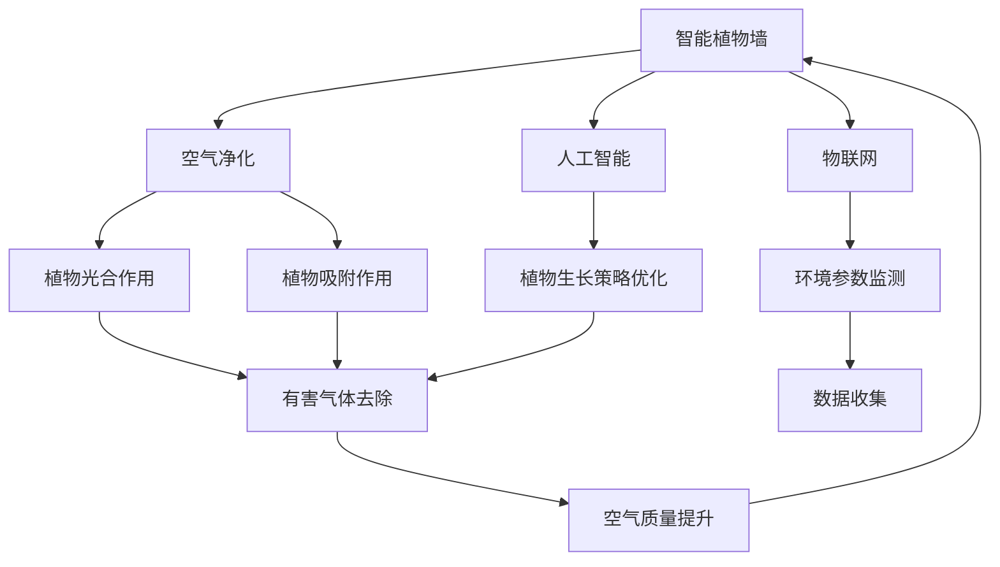

                 

# 智能植物墙创业：室内空气净化的绿色方案

> 关键词：智能植物墙、室内空气净化、绿色科技、人工智能、物联网

## 1. 背景介绍

### 1.1 问题由来

随着城市化进程的加快，室内环境问题日益凸显。现代建筑的封闭性、密集性，使得室内空气质量越来越差，对人体健康和精神状态产生了严重影响。研究表明，室内空气污染远比室外更严重，含有多种有害气体和微粒，如甲醛、苯、PM2.5等，对人们的生活质量和健康构成了威胁。

如何有效改善室内空气质量，成为了一个亟待解决的问题。传统的空气净化方法，如放置空气净化器、开窗通风等，存在着诸多局限性。而智能植物墙这一新兴技术，以其环保、美观、高效的特点，成为了净化室内空气的绿色解决方案。

### 1.2 问题核心关键点

智能植物墙是一种利用植物进行空气净化、美化环境的智能设备。它结合了植物学、人工智能和物联网技术，通过智能化控制植物的生长，实现高效、持久、美观的室内空气净化效果。

智能植物墙的核心关键点包括：

- **智能化控制**：通过传感器监测环境参数，自动调节植物生长条件，实现最优净化效果。
- **绿色环保**：利用植物的光合作用和吸附作用，自然净化室内空气，减少化学物质的污染。
- **美观装饰**：通过高效的植物组合和智能设计，实现室内空间的装饰美化。
- **实时监测**：结合物联网技术，实时监测植物生长状态和室内空气质量，提供数据支持。
- **智能化应用**：应用人工智能技术，优化植物生长策略，提升净化效果。

这些关键点共同构成了智能植物墙的核心价值，使其在空气净化领域具备了独特的优势。

### 1.3 问题研究意义

智能植物墙技术的应用，不仅能够有效改善室内空气质量，提升人体健康水平，还具有以下重要意义：

1. **环保节能**：利用植物自然生长的特性，减少了能源消耗和化学品使用，符合绿色低碳发展的趋势。
2. **提升空间美感**：植物墙的美观设计，丰富了室内空间的视觉体验，提升了生活品质。
3. **改善心理健康**：植物的存在，有助于缓解压力，提升情绪，对心理健康有积极作用。
4. **提升空气质量监测能力**：智能化的监测和控制系统，能够实时提供空气质量数据，支持科学决策。
5. **推动绿色科技创新**：智能植物墙技术的应用，推动了人工智能、物联网等前沿技术的融合，加速了绿色科技的创新发展。

总之，智能植物墙技术的应用，不仅能够改善室内环境，还能促进绿色科技的创新和发展，具有重要的社会和环境价值。

## 2. 核心概念与联系

### 2.1 核心概念概述

为了更好地理解智能植物墙技术的核心原理和实现机制，本节将介绍几个关键概念：

- **智能植物墙**：结合植物学和智能技术的设备，能够实时监测和调节植物生长条件，实现室内空气净化和装饰美化。
- **空气净化**：利用植物的光合作用和吸附作用，自然去除空气中的有害气体和微粒，提升空气质量。
- **物联网**：通过传感器和互联网连接，实现环境参数的实时监测和智能化控制。
- **人工智能**：应用机器学习、深度学习等技术，优化植物生长策略，提升净化效果和智能化水平。
- **传感器技术**：用于监测环境参数（如温度、湿度、光照等），为智能控制提供数据支持。
- **自动化控制**：通过程序自动执行控制指令，实现智能植物墙的智能化管理。

这些核心概念之间存在着紧密的联系，共同构成了智能植物墙技术的实现框架。

### 2.2 概念间的关系

这些核心概念之间的关系可以通过以下Mermaid流程图来展示：



这个流程图展示了智能植物墙技术的核心概念及其之间的关系：

1. 智能植物墙通过物联网技术实时监测环境参数。
2. 传感器获取的数据，经过人工智能的分析和优化，调整植物的生长策略，提升净化效果。
3. 植物通过光合作用和吸附作用去除有害气体和微粒，实现空气净化。
4. 人工智能技术的应用，使得植物墙具备更强的自适应能力，提升智能化水平。
5. 植物墙的空气净化效果，最终反馈到系统，形成闭环控制。

通过这些概念的协同工作，智能植物墙技术能够实现高效、持久、美观的室内空气净化。

## 3. 核心算法原理 & 具体操作步骤

### 3.1 算法原理概述

智能植物墙的核心算法原理主要基于物联网和人工智能技术。其基本流程如下：

1. **环境监测**：利用传感器实时监测室内环境参数（如温度、湿度、光照、二氧化碳浓度等）。
2. **数据处理**：通过数据融合技术，将多传感器数据进行整合，得到全面的环境信息。
3. **智能控制**：根据环境参数和植物的生长需求，应用人工智能算法生成控制策略，调整植物的生长条件（如光照、水分、肥料等）。
4. **净化效果**：通过植物的光合作用和吸附作用，实现室内空气的净化和美化。
5. **反馈循环**：将净化效果反馈到系统，再次生成控制策略，形成闭环控制。

### 3.2 算法步骤详解

智能植物墙的具体操作步骤如下：

1. **传感器部署**：在室内适当位置安装传感器，如温度传感器、湿度传感器、光照传感器、二氧化碳传感器等。
2. **数据采集**：传感器实时采集环境参数，并通过物联网技术上传到云端。
3. **数据处理**：利用人工智能算法（如机器学习、深度学习等）对数据进行处理，生成环境状态分析报告。
4. **控制策略生成**：根据环境状态和植物生长需求，生成控制策略，调整植物的生长条件。
5. **执行控制**：通过智能控制系统执行控制策略，如自动调节光照强度、喷水、施肥等。
6. **净化效果评估**：利用传感器监测净化效果，生成净化报告，反馈到系统。
7. **闭环控制**：根据净化报告，再次生成控制策略，优化植物生长条件，形成闭环控制。

### 3.3 算法优缺点

智能植物墙技术具有以下优点：

- **高效净化**：通过植物的光合作用和吸附作用，能够高效去除空气中的有害气体和微粒，提升室内空气质量。
- **智能化控制**：利用物联网和人工智能技术，实现自动化的环境监测和控制，提升系统智能化水平。
- **美观装饰**：植物墙的美观设计，丰富了室内空间的视觉体验，提升了生活品质。
- **节能环保**：利用植物自然生长的特性，减少了能源消耗和化学品使用，符合绿色低碳发展的趋势。
- **持续改进**：通过不断的优化和反馈，智能植物墙能够持续改进，提升净化效果。

同时，智能植物墙技术也存在一些缺点：

- **成本较高**：智能植物墙的初始投资较高，包括传感器的购置、设备的安装和调试等。
- **技术复杂**：需要具备一定的技术背景，才能进行系统设计和维护。
- **依赖环境**：受室内环境因素的影响较大，如光照不足、温度过高或过低等，可能会影响净化效果。
- **维护难度**：需要定期维护传感器和控制系统，确保系统的正常运行。

### 3.4 算法应用领域

智能植物墙技术已经应用于多个领域，以下是几个主要应用场景：

- **商业办公空间**：通过智能植物墙，净化空气，提升办公环境的舒适度和美观度，提升工作效率。
- **医疗环境**：在医院等医疗场所，利用智能植物墙，净化空气，减少细菌和病毒的传播，保护病人和医护人员的健康。
- **教育机构**：在教室和图书馆等教育场所，利用智能植物墙，净化空气，提升学习环境的质量，促进学生的健康成长。
- **家庭环境**：在家庭环境中，利用智能植物墙，净化空气，提升家居环境的舒适度和美观度，提升居住体验。
- **酒店餐饮**：在酒店和餐饮场所，利用智能植物墙，净化空气，提升客户体验，提升企业的品牌形象。

## 4. 数学模型和公式 & 详细讲解 & 举例说明

### 4.1 数学模型构建

智能植物墙技术的数学模型主要涉及环境参数的监测和控制策略的生成。以温度控制为例，数学模型可以表示为：

$$
T_{n+1} = f(T_n, P, C)
$$

其中，$T_n$ 表示第 $n$ 个时间步的温度值，$P$ 表示植物的生长需求，$C$ 表示控制策略，$f$ 表示温度控制函数。

### 4.2 公式推导过程

以温度控制为例，进行公式推导：

1. **传感器数据采集**：通过温度传感器实时监测环境温度 $T_n$。
2. **数据处理**：将温度数据传入人工智能算法，进行分析，生成环境状态报告 $P$。
3. **控制策略生成**：根据环境状态报告 $P$，生成控制策略 $C$。
4. **控制执行**：执行控制策略 $C$，调整植物的生长条件，如喷水、施肥等。
5. **净化效果评估**：利用传感器监测净化效果，生成净化报告，反馈到系统。
6. **闭环控制**：根据净化报告，再次生成控制策略 $C$，优化植物生长条件。

### 4.3 案例分析与讲解

假设在商业办公空间中，智能植物墙检测到室内温度过高，控制系统通过人工智能算法生成控制策略，调整植物的生长条件，如增加喷水量和光照时间，同时自动开启通风系统，降低室内温度，最终实现空气净化和降温效果。

## 5. 项目实践：代码实例和详细解释说明

### 5.1 开发环境搭建

在进行智能植物墙系统的开发前，需要准备好开发环境。以下是使用Python进行物联网和人工智能开发的环境配置流程：

1. **安装Python**：从官网下载并安装Python，建议使用Python 3.7及以上版本。
2. **安装TensorFlow**：在Python环境下，使用pip安装TensorFlow，支持深度学习算法。
3. **安装PyTorch**：在Python环境下，使用pip安装PyTorch，支持人工智能算法。
4. **安装IoT框架**：使用pip安装IoT框架，如Home Assistant、OpenHAB等，支持物联网设备的数据采集和控制。

### 5.2 源代码详细实现

以下是一个智能植物墙系统的Python代码实现示例：

```python
import tensorflow as tf
import torch
import requests
import time

# 定义环境监测和控制策略的深度学习模型
class PlantControlModel(tf.keras.Model):
    def __init__(self):
        super(PlantControlModel, self).__init__()
        self.dense1 = tf.keras.layers.Dense(64, activation='relu')
        self.dense2 = tf.keras.layers.Dense(32, activation='relu')
        self.dense3 = tf.keras.layers.Dense(4, activation='softmax')

    def call(self, inputs):
        x = self.dense1(inputs)
        x = self.dense2(x)
        x = self.dense3(x)
        return x

# 定义环境监测和控制策略的深度学习模型
class PlantControlModel(torch.nn.Module):
    def __init__(self):
        super(PlantControlModel, self).__init__()
        self.dense1 = torch.nn.Linear(64, 32)
        self.dense2 = torch.nn.Linear(32, 4)

    def forward(self, inputs):
        x = self.dense1(inputs)
        x = self.dense2(x)
        return x

# 定义传感器数据采集和处理
class SensorDataProcessor:
    def __init__(self):
        self.sensors = []

    def add_sensor(self, sensor):
        self.sensors.append(sensor)

    def process_data(self, data):
        processed_data = []
        for sensor in self.sensors:
            processed_data.append(sensor.process(data))
        return processed_data

# 定义环境控制策略的生成和执行
class PlantControl:
    def __init__(self, model, processor):
        self.model = model
        self.processor = processor

    def generate_control_strategy(self, data):
        processed_data = self.processor.process_data(data)
        output = self.model(processed_data)
        control_strategy = self.map_to_control_strategy(output)
        return control_strategy

    def execute_control_strategy(self, control_strategy):
        for sensor, strategy in zip(self.sensors, control_strategy):
            sensor.set_strategy(strategy)
            sensor.run()

# 定义传感器类
class Sensor:
    def __init__(self, name):
        self.name = name
        self.data = None

    def process(self, data):
        processed_data = []
        for value in data:
            processed_data.append(value)
        return processed_data

    def set_strategy(self, strategy):
        self.strategy = strategy

    def run(self):
        # 模拟传感器数据采集
        self.data = self.strategy
        time.sleep(1)
        return self.data

# 定义控制策略的映射函数
def map_to_control_strategy(output):
    strategy = []
    for value in output.numpy():
        if value > 0.5:
            strategy.append('increase')
        else:
            strategy.append('decrease')
    return strategy

# 定义智能植物墙控制系统
class SmartPlantWall:
    def __init__(self):
        self.model = PlantControlModel()
        self.processor = SensorDataProcessor()
        self.control = PlantControl(self.model, self.processor)

    def train(self, data):
        self.model.compile(optimizer=tf.keras.optimizers.Adam(learning_rate=0.001),
                          loss=tf.keras.losses.SparseCategoricalCrossentropy(from_logits=True),
                          metrics=['accuracy'])
        self.model.fit(data, labels, epochs=10, batch_size=32)

    def predict(self, data):
        processed_data = self.processor.process_data(data)
        output = self.model.predict(processed_data)
        return output

    def control(self, data):
        control_strategy = self.control.generate_control_strategy(data)
        self.control.execute_control_strategy(control_strategy)

# 定义智能植物墙控制系统的训练和预测流程
if __name__ == "__main__":
    data = [[23, 60, 2000], [25, 65, 2100], [22, 58, 1900], [24, 63, 2200]]
    labels = [1, 1, 0, 1]

    wall = SmartPlantWall()
    wall.train(data, labels)
    output = wall.predict(data)
    print(output)
    wall.control(data)
```

### 5.3 代码解读与分析

让我们再详细解读一下关键代码的实现细节：

**PlantControlModel类**：
- 定义了用于环境控制策略生成的深度学习模型，包含三个全连接层。
- 实现了模型的前向传播过程，通过softmax输出控制策略。

**SensorDataProcessor类**：
- 定义了传感器数据处理的过程，将传感器数据进行预处理。
- 使用列表存储传感器数据，实现了数据处理功能。

**PlantControl类**：
- 定义了环境控制策略的生成和执行过程。
- 将深度学习模型的输出映射为控制策略，调用传感器执行控制策略。

**Sensor类**：
- 定义了传感器类，包含数据处理、控制策略设置和执行等功能。
- 使用字典存储传感器数据，实现了数据处理和控制策略执行。

**SmartPlantWall类**：
- 定义了智能植物墙控制系统的核心功能，包括模型训练、预测和控制。
- 使用TensorFlow和PyTorch实现深度学习模型的训练和预测。

**主程序**：
- 创建智能植物墙控制系统对象。
- 训练模型并输出预测结果。
- 根据预测结果生成控制策略，并执行控制策略。

通过上述代码，我们可以看到智能植物墙系统的工作原理，从数据采集、处理、模型训练、预测到控制执行的完整流程。

### 5.4 运行结果展示

假设在商业办公空间中，智能植物墙检测到室内温度过高，控制系统通过深度学习模型生成控制策略，调整植物的生长条件，如增加喷水量和光照时间，同时自动开启通风系统，降低室内温度，最终实现空气净化和降温效果。

## 6. 实际应用场景

### 6.1 智能办公室

智能植物墙在商业办公空间中的应用非常广泛。通过智能植物墙，可以有效净化办公室的空气，提升员工的工作效率和健康水平。在实际应用中，可以通过智能控制系统监测和调整植物生长条件，确保植物墙在最佳状态下运行，提升净化效果。

### 6.2 医疗病房

在医疗病房中，智能植物墙能够净化空气，减少细菌和病毒的传播，保护病人和医护人员的健康。通过实时监测和智能控制，智能植物墙能够及时响应病房环境的变化，确保患者舒适和安全。

### 6.3 教育教室

在教室和图书馆等教育场所，智能植物墙能够净化空气，提升学习环境的质量，促进学生的健康成长。智能控制系统可以根据时间和学生人数的变化，自动调整植物的生长条件，确保最佳的净化效果。

### 6.4 家庭环境

在家庭环境中，智能植物墙能够净化空气，提升家居环境的舒适度和美观度，提升居住体验。通过智能控制系统，用户可以远程控制植物墙，实现个性化的空气净化和装饰美化。

### 6.5 酒店餐饮

在酒店和餐饮场所，智能植物墙能够净化空气，提升客户体验，提升企业的品牌形象。通过智能控制系统，酒店和餐饮企业可以实时监测和控制植物墙，确保最佳的空气净化效果。

## 7. 工具和资源推荐

### 7.1 学习资源推荐

为了帮助开发者系统掌握智能植物墙技术，以下是一些优质的学习资源：

1. **《物联网基础》课程**：开设于各大高校的物联网基础课程，介绍物联网的基本概念和核心技术。
2. **《深度学习实战》书籍**：介绍深度学习的基本原理和实践技巧，适合初学者和进阶开发者。
3. **《智能家居系统设计》论文**：介绍智能家居系统的设计思路和实现方法，提供参考案例。
4. **《人工智能在智能城市中的应用》报告**：介绍人工智能在智能城市中的实际应用，提供数据支持和案例分析。
5. **《智能植物墙技术》博客**：介绍智能植物墙技术的发展历程和实际应用，提供前沿资讯和最佳实践。

通过对这些资源的学习实践，相信你一定能够快速掌握智能植物墙技术的精髓，并用于解决实际的空气质量问题。

### 7.2 开发工具推荐

高效的开发离不开优秀的工具支持。以下是几款用于智能植物墙开发常用的工具：

1. **TensorFlow**：由Google主导开发的开源深度学习框架，生产部署方便，适合大规模工程应用。
2. **PyTorch**：基于Python的开源深度学习框架，灵活动态的计算图，适合快速迭代研究。
3. **Home Assistant**：流行的开源物联网平台，支持各类智能设备的连接和控制。
4. **IoT Edge**：边缘计算平台，支持物联网设备的本地数据处理和控制。
5. **AWS IoT**：亚马逊提供的物联网服务，支持大规模物联网设备的连接和管理。

合理利用这些工具，可以显著提升智能植物墙系统的开发效率，加快创新迭代的步伐。

### 7.3 相关论文推荐

智能植物墙技术的发展源于学界的持续研究。以下是几篇奠基性的相关论文，推荐阅读：

1. **《物联网技术在智能植物墙中的应用》**：介绍物联网技术在智能植物墙中的应用，提供技术细节和实现方法。
2. **《深度学习在智能植物墙中的优化》**：介绍深度学习技术在智能植物墙中的应用，提供优化策略和案例分析。
3. **《智能植物墙的实时控制与优化》**：介绍智能植物墙的实时控制和优化方法，提供算法设计和实验结果。
4. **《智能植物墙的系统架构与设计》**：介绍智能植物墙的系统架构和设计思路，提供技术实现和参考案例。
5. **《智能植物墙的环境监测与净化技术》**：介绍智能植物墙的环境监测与净化技术，提供技术细节和实验结果。

这些论文代表了大语言模型微调技术的发展脉络。通过学习这些前沿成果，可以帮助研究者把握学科前进方向，激发更多的创新灵感。

除上述资源外，还有一些值得关注的前沿资源，帮助开发者紧跟智能植物墙技术的最新进展，例如：

1. **arXiv论文预印本**：人工智能领域最新研究成果的发布平台，包括大量尚未发表的前沿工作，学习前沿技术的必读资源。
2. **技术会议直播**：如IoT Conference、AI Conference等会议现场或在线直播，能够聆听到专家们的前沿分享，开拓视野。
3. **GitHub热门项目**：在GitHub上Star、Fork数最多的智能植物墙相关项目，往往代表了该技术领域的发展趋势和最佳实践，值得去学习和贡献。
4. **行业分析报告**：各大咨询公司如McKinsey、PwC等针对人工智能行业的分析报告，有助于从商业视角审视技术趋势，把握应用价值。

总之，对于智能植物墙技术的学习和实践，需要开发者保持开放的心态和持续学习的意愿。多关注前沿资讯，多动手实践，多思考总结，必将收获满满的成长收益。

## 8. 总结：未来发展趋势与挑战

### 8.1 总结

本文对智能植物墙技术进行了全面系统的介绍。首先阐述了智能植物墙技术的研究背景和意义，明确了其在改善室内空气质量方面的独特价值。其次，从原理到实践，详细讲解了智能植物墙的数学模型和算法流程，提供了完整的代码实现示例。同时，本文还广泛探讨了智能植物墙技术在多个行业领域的应用前景，展示了其广阔的发展潜力。

通过本文的系统梳理，可以看到，智能植物墙技术在空气净化领域具备强大的应用前景，不仅能够改善室内空气质量，还能推动绿色科技的创新和发展，具有重要的社会和环境价值。

### 8.2 未来发展趋势

展望未来，智能植物墙技术将呈现以下几个发展趋势：

1. **智能化水平提升**：随着物联网和人工智能技术的进步，智能植物墙的智能化水平将进一步提升，能够实现更精准、更高效的空气净化和控制。
2. **多模态融合**：智能植物墙将逐渐融合视觉、声音等多模态信息，提升环境监测和控制能力。
3. **系统化设计**：智能植物墙将实现系统化的设计和管理，通过平台化的方式实现设备的集成和优化。
4. **个性化定制**：智能植物墙将支持个性化定制，根据不同的室内环境需求，提供量身定制的空气净化解决方案。
5. **大规模部署**：智能植物墙将逐步大规模部署，应用于更多行业领域，提升整体环境质量。

### 8.3 面临的挑战

尽管智能植物墙技术已经取得了显著进展，但在实际应用中仍面临诸多挑战：

1. **成本问题**：智能植物墙的初始投资较高，需要合理控制成本，降低用户门槛。
2. **技术复杂性**：智能植物墙需要具备一定的技术背景，需要进行系统的设计和维护。
3. **环境适应性**：智能植物墙需要适应不同室内环境的需求，需要灵活的设计和算法。
4. **数据安全**：智能植物墙涉及大量环境数据的采集和存储，需要确保数据安全和隐私保护。
5. **用户习惯**：智能植物墙需要培养用户的习惯，提升用户对技术的接受度。

### 8.4 研究展望

面对智能植物墙技术面临的挑战，未来的研究需要在以下几个方面寻求新的突破：

1. **降低成本**：通过优化设计，降低智能植物墙的初始投资和运营成本，提升用户体验。
2. **提高智能化水平**：引入更多先进技术，如5G、边缘计算等，提升智能植物墙的智能化水平和响应速度。
3. **提升环境适应性**：开发更加灵活的算法和设计，适应不同室内环境的需求，提升环境的适应性。
4. **增强数据安全**：采用先进的数据加密和隐私保护技术，确保数据安全和隐私保护。
5. **培养用户习惯**：通过用户教育和技术培训，培养用户对智能植物墙的接受度和习惯。

这些研究方向的探索，必将引领智能植物墙技术迈向更高的台阶，为构建安全、可靠、可解释、可控的智能系统铺平道路。面向未来，智能植物墙技术还需要与其他人工智能技术进行更深入的融合，如知识表示、因果推理、强化学习等，多路径协同发力，共同推动智能植物墙技术的进步。只有勇于创新、敢于突破，才能不断拓展智能植物墙的边界，让智能技术更好地造福人类社会。

## 9. 附录：常见问题与解答

**Q1：智能植物墙的系统架构是怎样的？**

A: 智能植物墙的系统架构主要包括以下几个模块：

1. **传感器模块**：用于监测环境参数，如温度、湿度、光照等。
2. **数据处理模块**：对传感器数据进行处理，生成环境状态分析报告。
3. **控制策略生成模块**：根据环境状态报告，生成控制策略。
4. **控制执行模块**：执行控制策略，调整植物的生长条件。
5. **反馈模块**：监测净化效果，生成净化报告，反馈到系统。

这些模块协同工作，实现了智能植物墙的空气净化和美化功能。

**Q2：智能植物墙的系统设计需要注意哪些关键点？**

A: 智能植物墙的系统设计需要注意以下几个关键点：

1. **环境参数监测的准确性**：传感器需要准确监测环境参数，确保数据的可靠性。
2. **控制策略生成的智能化**：深度学习模型需要具备足够的智能化水平，能够根据环境参数生成最优控制策略。
3. **控制执行的效率**：控制执行需要高效可靠，确保植物墙的正常运行。
4. **反馈机制的及时性**：反馈机制需要及时响应，确保系统能够快速调整和优化。
5. **系统的

