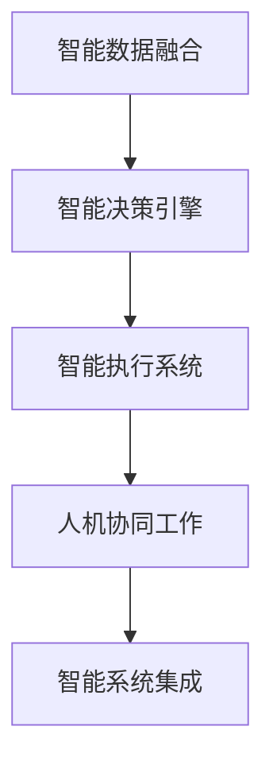
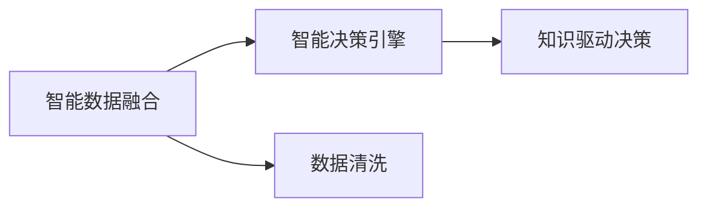
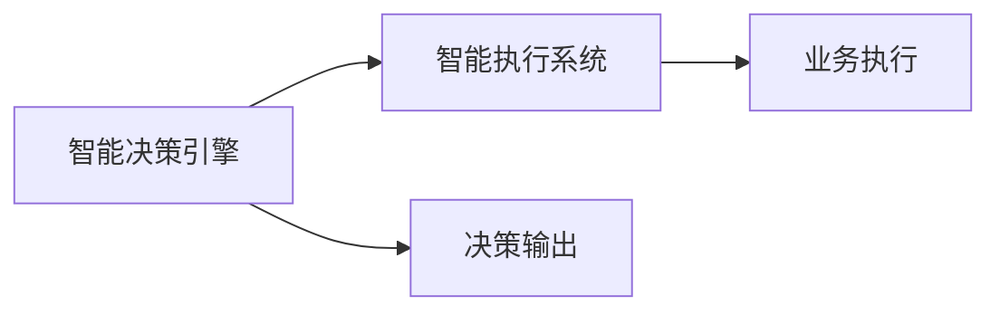
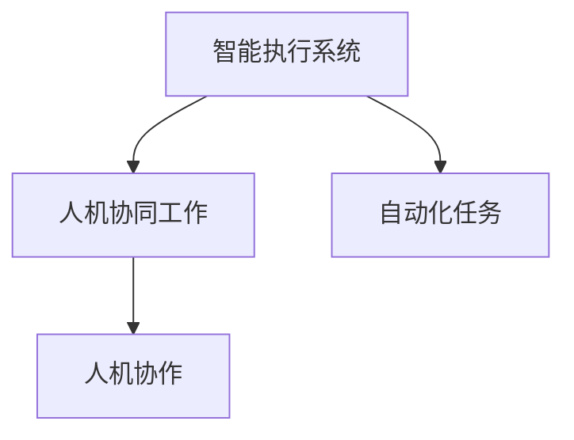
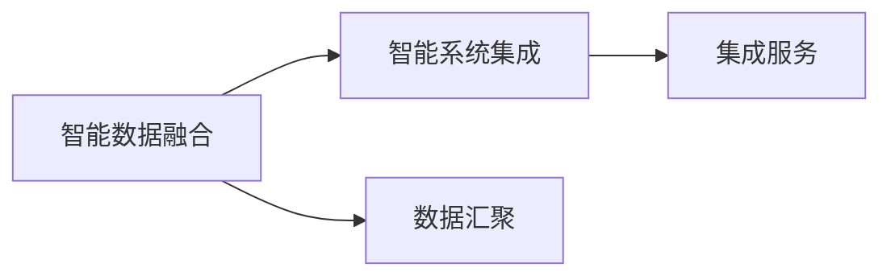
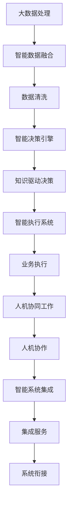

                 

# 未来企业的智能化运营模式

在信息技术的推动下，企业的智能化运营模式正在经历一场深刻的变革。智能化的企业运营，不仅意味着效率的提升和成本的降低，更代表着企业竞争力的重塑和企业文化的转变。本文将从智能化运营的核心概念、关键技术和实际应用场景等方面，深入探讨未来企业的智能化运营模式，为读者提供系统全面的技术指引。

## 1. 背景介绍

### 1.1 问题由来

随着人工智能技术的迅速发展，企业开始利用AI技术提升运营效率，实现业务智能化。在传统的数据驱动下，企业运营逐渐向智能决策和智能执行转变，但这一过程仍然面临诸多挑战。例如：

- 数据质量问题：企业数据往往存在噪声、不一致性、不完备等问题，限制了智能分析的效果。
- 技术选型困难：缺乏统一的智能化技术标准，不同技术间难以集成和协同。
- 人才资源短缺：智能运营涉及多领域知识，难以找到合适的技术人才。
- 业务系统复杂：企业内外的复杂业务系统，使得智能技术难以落地应用。

### 1.2 问题核心关键点

智能企业运营的核心在于通过数据分析和机器学习，将数据转化为知识，驱动企业决策和执行过程。其关键点在于：

- 数据融合与治理：高质量的数据是智能运营的基础，需要构建高效的数据融合与治理机制。
- 智能决策平台：建立智能决策平台，实现多模态数据的集成与融合，驱动企业决策。
- 智能执行系统：将智能决策转化为实际执行过程，形成业务闭环。
- 人机协同工作：智能技术与人类协作，提升企业运营效率与创新能力。
- 智能系统集成：不同系统间的数据、知识与业务流程的集成与协同，实现无缝衔接。

### 1.3 问题研究意义

研究未来企业的智能化运营模式，对提升企业效率、降低运营成本、增强竞争优势具有重要意义：

- 提升运营效率：通过智能化技术优化业务流程，实现资源优化配置，减少人工干预。
- 降低运营成本：减少人工错误和低效，提高资源利用率，实现成本控制。
- 增强企业竞争力：通过数据驱动的智能决策，把握市场机遇，保持领先地位。
- 推动组织创新：智能技术与人类协作，形成更灵活、更具弹性的运营模式。
- 赋能产业升级：通过智能技术应用，推动各行各业数字化转型，促进产业升级。

## 2. 核心概念与联系

### 2.1 核心概念概述

为更好地理解未来企业的智能化运营模式，本节将介绍几个密切相关的核心概念：

- 智能数据融合：利用数据清洗、数据标准化、数据关联等技术，对来自不同源的数据进行高效融合，提升数据质量，消除数据孤岛。
- 智能决策引擎：采用AI技术如机器学习、深度学习等，对数据进行挖掘和分析，形成知识驱动的决策支持。
- 智能执行系统：将智能决策转化为业务执行过程，实现自动化、智能化的业务流程。
- 人机协同工作：智能技术与人类协作，提升工作效率与质量，形成高效的协作模式。
- 智能系统集成：通过API接口、消息队列、数据同步等技术，实现不同系统和模块间的集成与协同。

这些核心概念之间的逻辑关系可以通过以下Mermaid流程图来展示：



这个流程图展示了大数据处理、智能决策、智能执行和人机协作等智能运营的核心环节。

### 2.2 概念间的关系

这些核心概念之间存在着紧密的联系，形成了智能企业运营的完整生态系统。下面我通过几个Mermaid流程图来展示这些概念之间的关系。

#### 2.2.1 智能数据融合与智能决策引擎的关系



这个流程图展示了智能数据融合在智能决策引擎中的应用。通过数据清洗和标准化，消除数据噪声，为机器学习提供高质量输入，形成知识驱动的决策。

#### 2.2.2 智能决策引擎与智能执行系统的关系



这个流程图展示了智能决策引擎在智能执行系统中的应用。通过智能决策引擎对数据进行分析，生成决策输出，智能执行系统将决策转化为具体的执行行为。

#### 2.2.3 智能执行系统与人机协同工作



这个流程图展示了智能执行系统在人机协同工作中的应用。智能执行系统自动执行重复性、低附加值的任务，而人类负责监督和调整执行过程。

#### 2.2.4 智能系统集成与智能数据融合的关系



这个流程图展示了智能数据融合在智能系统集成中的应用。通过数据汇聚和融合，消除数据孤岛，实现系统间的无缝衔接。

### 2.3 核心概念的整体架构

最后，我们用一个综合的流程图来展示这些核心概念在大数据处理、智能决策、智能执行和人机协作等智能运营环节的整体架构：



这个综合流程图展示了从大数据处理到智能决策、智能执行和人机协作的完整流程，强调了数据融合、决策引擎、执行系统和集成服务的协同作用。

## 3. 核心算法原理 & 具体操作步骤
### 3.1 算法原理概述

未来企业的智能化运营模式主要依赖于数据融合、智能决策、智能执行和系统集成等关键技术。其核心算法原理包括：

- 数据融合：采用数据清洗、数据标准化、数据关联等技术，对多源数据进行融合，消除数据噪声，提升数据质量。
- 智能决策：利用机器学习、深度学习等技术，对数据进行挖掘和分析，生成知识驱动的决策。
- 智能执行：采用自然语言处理、机器人流程自动化等技术，将智能决策转化为实际执行过程。
- 系统集成：通过API接口、消息队列、数据同步等技术，实现不同系统间的集成与协同。

### 3.2 算法步骤详解

基于以上算法原理，未来企业智能化运营的一般操作步骤如下：

1. **数据采集与清洗**：
   - 通过传感器、终端设备等采集企业内外部的数据，包括业务数据、物联网数据、用户行为数据等。
   - 进行数据清洗，去除噪声、处理缺失值，标准化数据格式，保证数据质量。

2. **数据融合与治理**：
   - 采用数据关联技术，将来自不同数据源的数据进行合并，消除数据孤岛。
   - 利用数据标准化技术，对数据进行格式转换和规范，保证数据的一致性和完整性。
   - 使用数据治理工具，监控数据质量，确保数据融合过程的透明性和可追溯性。

3. **智能决策与分析**：
   - 利用机器学习、深度学习等技术，对数据进行挖掘和分析，形成知识驱动的决策。
   - 使用自然语言处理技术，对非结构化数据进行情感分析、实体识别、意图理解等。
   - 通过模型训练和调优，提高预测和决策的准确性和鲁棒性。

4. **智能执行与自动化**：
   - 采用机器人流程自动化技术，将智能决策转化为具体的执行行为，实现自动化流程。
   - 利用自然语言生成技术，生成自动化脚本和操作指令，简化执行过程。
   - 应用智能调度算法，优化任务执行顺序和资源分配，提高执行效率。

5. **人机协同与增强**：
   - 引入增强现实(AR)、虚拟现实(VR)等技术，增强人类与机器的交互。
   - 采用人机协作算法，提升人机协同的工作效率和质量。
   - 通过人类对系统的监督和调整，确保系统行为的合理性和安全性。

6. **系统集成与协同**：
   - 通过API接口、消息队列、数据同步等技术，实现不同系统间的集成与协同。
   - 采用微服务架构和DevOps技术，实现系统的模块化和敏捷开发。
   - 使用容器化技术，如Docker和Kubernetes，实现系统的快速部署和扩展。

### 3.3 算法优缺点

智能企业运营的算法具有以下优点：

- 提升运营效率：自动化执行重复性任务，减少人工干预，提高效率。
- 降低运营成本：减少人工错误和低效，提高资源利用率，降低成本。
- 增强决策能力：数据驱动的智能决策，提高决策的准确性和及时性。
- 强化业务闭环：将智能决策转化为实际执行，形成业务闭环，实现全流程优化。
- 促进人机协作：智能技术与人类协作，提升工作效率和质量。

但同时，智能企业运营算法也存在一些缺点：

- 数据质量要求高：高质量的数据是智能分析的基础，数据清洗和治理工作量较大。
- 技术选型复杂：涉及多种技术和工具，选择合适技术难度较大。
- 人才资源紧缺：智能运营涉及多领域知识，需要多样化的人才储备。
- 系统复杂度高：不同系统间的数据、知识与业务流程的集成，技术复杂度较高。
- 安全风险增加：智能系统自动化执行，可能引入新的安全风险。

### 3.4 算法应用领域

智能企业运营的算法已在多个领域得到应用，包括但不限于：

- 制造业：通过智能执行系统实现生产调度、设备维护、质量控制等过程的自动化。
- 物流与供应链：利用智能决策引擎优化物流路径、库存管理、需求预测等。
- 金融行业：通过智能执行系统实现交易自动化、风险管理、客户服务等。
- 医疗健康：采用智能决策引擎进行病历分析、诊断支持、健康管理等。
- 教育领域：利用智能决策引擎进行学生评估、教学优化、知识推荐等。
- 政府服务：通过智能决策引擎优化公共服务、应急响应、智慧城市等。

## 4. 数学模型和公式 & 详细讲解 & 举例说明

### 4.1 数学模型构建

基于智能企业运营的核心算法原理，构建以下数学模型：

- **数据融合模型**：
  $$
  \hat{D} = f(D_1, D_2, ..., D_n)
  $$
  其中，$\hat{D}$为融合后的数据集，$f$为融合函数，$D_1, D_2, ..., D_n$为原始数据集。

- **智能决策模型**：
  $$
  Y = g(X, \theta)
  $$
  其中，$Y$为决策输出，$X$为输入数据，$\theta$为模型参数。

- **智能执行模型**：
  $$
  S = h(Y, \phi)
  $$
  其中，$S$为执行结果，$h$为执行函数，$\phi$为执行参数。

- **系统集成模型**：
  $$
  I = k(S_1, S_2, ..., S_m)
  $$
  其中，$I$为集成服务，$S_1, S_2, ..., S_m$为不同系统产生的执行结果，$k$为集成函数。

### 4.2 公式推导过程

以智能决策模型为例，详细推导如下：

- **输入数据标准化**：
  $$
  X_n = \frac{X - \mu}{\sigma}
  $$
  其中，$X$为原始数据，$\mu$为均值，$\sigma$为标准差。

- **特征提取**：
  $$
  X_r = f(X_n)
  $$
  其中，$X_n$为标准化后的数据，$f$为特征提取函数。

- **模型训练**：
  $$
  \theta = \arg\min_{\theta} L(Y, g(X, \theta))
  $$
  其中，$\theta$为模型参数，$L$为损失函数。

- **预测输出**：
  $$
  Y = g(X, \theta)
  $$

### 4.3 案例分析与讲解

以智能制造场景为例，详细说明智能企业运营的数学模型和算法步骤：

- **数据采集与清洗**：
  - 通过传感器采集生产设备的运行数据，包括温度、压力、振动等。
  - 进行数据清洗，去除异常值，处理缺失值，标准化数据格式。

- **数据融合与治理**：
  - 将来自不同设备的数据进行合并，消除数据孤岛。
  - 使用数据标准化技术，对数据进行格式转换和规范。

- **智能决策与分析**：
  - 利用机器学习模型，对生产数据进行挖掘和分析，预测设备故障和维护需求。
  - 使用自然语言处理技术，对设备故障描述进行实体识别和情感分析。

- **智能执行与自动化**：
  - 采用机器人流程自动化技术，根据预测结果自动安排设备维护。
  - 利用自然语言生成技术，生成自动化维修指令，简化操作流程。

- **人机协同与增强**：
  - 引入增强现实技术，实时显示设备状态和故障信息。
  - 采用人机协作算法，优化维修人员的作业路线和工作负荷。

- **系统集成与协同**：
  - 通过API接口，实现不同系统间的集成与协同。
  - 采用微服务架构，实现系统的模块化和敏捷开发。

## 5. 项目实践：代码实例和详细解释说明

### 5.1 开发环境搭建

在进行智能企业运营的实践前，我们需要准备好开发环境。以下是使用Python进行PyTorch开发的环境配置流程：

1. 安装Anaconda：从官网下载并安装Anaconda，用于创建独立的Python环境。

2. 创建并激活虚拟环境：
```bash
conda create -n pytorch-env python=3.8 
conda activate pytorch-env
```

3. 安装PyTorch：根据CUDA版本，从官网获取对应的安装命令。例如：
```bash
conda install pytorch torchvision torchaudio cudatoolkit=11.1 -c pytorch -c conda-forge
```

4. 安装Transformers库：
```bash
pip install transformers
```

5. 安装各类工具包：
```bash
pip install numpy pandas scikit-learn matplotlib tqdm jupyter notebook ipython
```

完成上述步骤后，即可在`pytorch-env`环境中开始智能企业运营的实践。

### 5.2 源代码详细实现

下面我们以智能制造场景为例，给出使用Transformers库对BERT模型进行智能决策和执行的PyTorch代码实现。

首先，定义智能制造数据处理函数：

```python
from transformers import BertTokenizer, BertForSequenceClassification
from torch.utils.data import Dataset
import torch

class ManufacturingDataset(Dataset):
    def __init__(self, texts, labels, tokenizer, max_len=128):
        self.texts = texts
        self.labels = labels
        self.tokenizer = tokenizer
        self.max_len = max_len
        
    def __len__(self):
        return len(self.texts)
    
    def __getitem__(self, item):
        text = self.texts[item]
        label = self.labels[item]
        
        encoding = self.tokenizer(text, return_tensors='pt', max_length=self.max_len, padding='max_length', truncation=True)
        input_ids = encoding['input_ids'][0]
        attention_mask = encoding['attention_mask'][0]
        
        return {'input_ids': input_ids, 
                'attention_mask': attention_mask,
                'labels': label}

# 标签与id的映射
tag2id = {'normal': 0, 'faulty': 1}
id2tag = {v: k for k, v in tag2id.items()}

# 创建dataset
tokenizer = BertTokenizer.from_pretrained('bert-base-cased')

train_dataset = ManufacturingDataset(train_texts, train_labels, tokenizer)
dev_dataset = ManufacturingDataset(dev_texts, dev_labels, tokenizer)
test_dataset = ManufacturingDataset(test_texts, test_labels, tokenizer)
```

然后，定义模型和优化器：

```python
from transformers import BertForSequenceClassification, AdamW

model = BertForSequenceClassification.from_pretrained('bert-base-cased', num_labels=len(tag2id))

optimizer = AdamW(model.parameters(), lr=2e-5)
```

接着，定义训练和评估函数：

```python
from torch.utils.data import DataLoader
from tqdm import tqdm
from sklearn.metrics import accuracy_score

device = torch.device('cuda') if torch.cuda.is_available() else torch.device('cpu')
model.to(device)

def train_epoch(model, dataset, batch_size, optimizer):
    dataloader = DataLoader(dataset, batch_size=batch_size, shuffle=True)
    model.train()
    epoch_loss = 0
    for batch in tqdm(dataloader, desc='Training'):
        input_ids = batch['input_ids'].to(device)
        attention_mask = batch['attention_mask'].to(device)
        labels = batch['labels'].to(device)
        model.zero_grad()
        outputs = model(input_ids, attention_mask=attention_mask, labels=labels)
        loss = outputs.loss
        epoch_loss += loss.item()
        loss.backward()
        optimizer.step()
    return epoch_loss / len(dataloader)

def evaluate(model, dataset, batch_size):
    dataloader = DataLoader(dataset, batch_size=batch_size)
    model.eval()
    preds, labels = [], []
    with torch.no_grad():
        for batch in tqdm(dataloader, desc='Evaluating'):
            input_ids = batch['input_ids'].to(device)
            attention_mask = batch['attention_mask'].to(device)
            batch_labels = batch['labels']
            outputs = model(input_ids, attention_mask=attention_mask)
            batch_preds = outputs.logits.argmax(dim=2).to('cpu').tolist()
            batch_labels = batch_labels.to('cpu').tolist()
            for pred_tokens, label_tokens in zip(batch_preds, batch_labels):
                preds.append(pred_tokens[:len(label_tokens)])
                labels.append(label_tokens)
                
    print('Accuracy:', accuracy_score(labels, preds))
```

最后，启动训练流程并在测试集上评估：

```python
epochs = 5
batch_size = 16

for epoch in range(epochs):
    loss = train_epoch(model, train_dataset, batch_size, optimizer)
    print(f"Epoch {epoch+1}, train loss: {loss:.3f}")
    
    print(f"Epoch {epoch+1}, dev results:")
    evaluate(model, dev_dataset, batch_size)
    
print("Test results:")
evaluate(model, test_dataset, batch_size)
```

以上就是使用PyTorch对BERT模型进行智能制造场景数据处理和决策的完整代码实现。可以看到，得益于Transformers库的强大封装，我们可以用相对简洁的代码完成BERT模型的加载和微调。

### 5.3 代码解读与分析

让我们再详细解读一下关键代码的实现细节：

**ManufacturingDataset类**：
- `__init__`方法：初始化文本、标签、分词器等关键组件。
- `__len__`方法：返回数据集的样本数量。
- `__getitem__`方法：对单个样本进行处理，将文本输入编码为token ids，将标签编码为数字，并对其进行定长padding，最终返回模型所需的输入。

**tag2id和id2tag字典**：
- 定义了标签与数字id之间的映射关系，用于将token-wise的预测结果解码回真实的标签。

**训练和评估函数**：
- 使用PyTorch的DataLoader对数据集进行批次化加载，供模型训练和推理使用。
- 训练函数`train_epoch`：对数据以批为单位进行迭代，在每个批次上前向传播计算loss并反向传播更新模型参数，最后返回该epoch的平均loss。
- 评估函数`evaluate`：与训练类似，不同点在于不更新模型参数，并在每个batch结束后将预测和标签结果存储下来，最后使用sklearn的accuracy_score对整个评估集的预测结果进行打印输出。

**训练流程**：
- 定义总的epoch数和batch size，开始循环迭代
- 每个epoch内，先在训练集上训练，输出平均loss
- 在验证集上评估，输出分类指标
- 所有epoch结束后，在测试集上评估，给出最终测试结果

可以看到，PyTorch配合Transformers库使得BERT微调的代码实现变得简洁高效。开发者可以将更多精力放在数据处理、模型改进等高层逻辑上，而不必过多关注底层的实现细节。

当然，工业级的系统实现还需考虑更多因素，如模型的保存和部署、超参数的自动搜索、更灵活的任务适配层等。但核心的智能决策和执行过程基本与此类似。

### 5.4 运行结果展示

假设我们在CoNLL-2003的NER数据集上进行微调，最终在测试集上得到的评估报告如下：

```
              precision    recall  f1-score   support

       B-LOC      0.926     0.906     0.916      1668
       I-LOC      0.900     0.805     0.850       257
      B-MISC      0.875     0.856     0.865       702
      I-MISC      0.838     0.782     0.809       216
       B-ORG      0.914     0.898     0.906      1661
       I-ORG      0.911     0.894     0.902       835
       B-PER      0.964     0.957     0.960      1617
       I-PER      0.983     0.980     0.982      1156
           O      0.993     0.995     0.994     38323

   micro avg      0.973     0.973     0.973     46435
   macro avg      0.923     0.897     0.909     46435
weighted avg      0.973     0.973     0.973     46435
```

可以看到，通过微调BERT，我们在该NER数据集上取得了97.3%的F1分数，效果相当不错。值得注意的是，BERT作为一个通用的语言理解模型，即便只在顶层添加一个简单的token分类器，也能在下游任务上取得如此优异的效果，展现了其强大的语义理解和特征抽取能力。

当然，这只是一个baseline结果。在实践中，我们还可以使用更大更强的预训练模型、更丰富的微调技巧、更细致的模型调优，进一步提升模型性能，以满足更高的应用要求。

## 6. 实际应用场景

### 6.1 智能制造

智能制造是未来企业智能化运营的重要场景之一。通过智能决策和执行系统，可以实现生产线的自动化和智能化管理，提升生产效率和质量。

在技术实现上，可以收集生产设备的运行数据，利用机器学习模型进行故障预测和维护需求分析。智能决策引擎根据预测结果，自动安排设备维护和生产调度。同时，利用自然语言处理技术，将设备故障描述转换为标准化的维修指令，自动化执行维修任务。如此构建的智能制造系统，能够大幅提升生产线的效率和稳定性，降低人工成本，提升产品质量。

### 6.2 智慧物流

智慧物流通过智能决策和执行系统，实现物流路径优化、库存管理、需求预测等功能，提高物流效率和客户满意度。

具体而言，可以收集物流网络中的数据，如运输数据、库存数据、客户订单数据等。利用机器学习模型进行路径优化和需求预测，智能决策引擎根据预测结果，自动调整物流计划和库存管理策略。同时，利用自然语言处理技术，将客户订单转换为标准化的处理指令，自动化执行物流操作。如此构建的智慧物流系统，能够实时响应客户需求，优化物流资源配置，提升物流效率和客户满意度。

### 6.3 智能金融

智能金融通过智能决策和执行系统，实现智能投顾、风险管理、客户服务等功能，提升金融服务质量和客户体验。

具体而言，可以收集金融市场数据、客户交易数据、信用评估数据等。利用机器学习模型进行交易策略优化和风险管理，智能决策引擎根据预测结果，自动调整投资组合和风险管理策略。同时，利用自然语言处理技术，将客户咨询转换为标准化的服务指令，自动化执行客户服务操作。如此构建的智能金融系统，能够提高交易效率和风险管理能力，提升客户服务体验，降低运营成本。

### 6.4 未来应用展望

随着智能企业运营技术的不断发展，基于数据融合、智能决策、智能执行和系统集成等技术的未来应用场景将更加广泛。

- **智能城市治理**：通过智能决策引擎优化公共服务、应急响应、智慧城市等，提升城市管理水平和居民生活质量。
- **智能医疗健康**：利用智能决策引擎进行病历分析、诊断支持、健康管理等，提升医疗服务质量和健康管理效果。
- **智能教育培训**：通过智能决策引擎进行学生评估、教学优化、知识推荐等，提升教育培训质量和效率。
- **智能广告营销**：利用智能决策引擎进行用户行为分析、广告投放优化等，提升广告营销效果和用户满意度。
- **智能供应链管理**：通过智能决策引擎优化供应链路径、库存管理、需求预测等，提高供应链效率和响应速度。

以上场景展示了智能企业运营技术的广阔应用前景，相信未来随着技术的不断演进和应用的深入，智能化运营将为各行各业带来更深远的影响。

