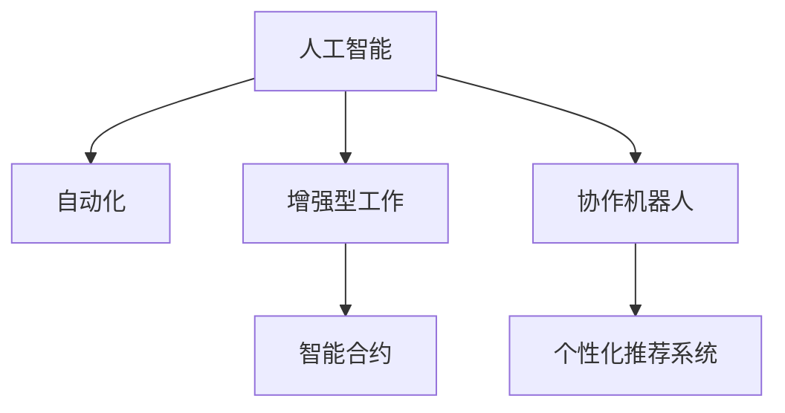

                 

# 未来工作形态与AI的共存

## 1. 背景介绍

随着人工智能技术的迅猛发展，AI正在深刻改变我们的工作方式、生产力和生活方式。AI的应用已经渗透到医疗、金融、制造、物流、教育等多个行业，成为推动社会进步的重要力量。然而，AI的兴起也引发了人们对未来工作形态的担忧。本文旨在探讨AI与人类工作共存的可能性，揭示AI在提升工作效率、优化工作流程、创新工作模式方面的潜力，并提出一些实用的应用建议，以期帮助各行各业更好地应对AI带来的变革。

## 2. 核心概念与联系

### 2.1 核心概念概述

为了深入理解AI与未来工作形态的关系，我们首先需要明确一些核心概念：

- **人工智能（AI）**：通过计算机系统模拟人类智能，包括学习、推理、问题求解、感知、自然语言理解、计算机视觉、机器人操作等。
- **自动化**：使用机器或软件执行传统由人完成的任务。
- **增强型工作**：AI增强人类工作能力，而不是完全取代。
- **协作机器人（Collaborative Robot, 简称Cobot）**：与人类工人协作完成任务的机器人。
- **智能合约**：基于区块链技术，自动执行、控制或文档化合约条款的计算机程序。
- **个性化推荐系统**：利用机器学习对用户行为进行分析，提供个性化服务。

这些概念之间的联系可以通过以下Mermaid流程图来展示：



这个流程图展示了AI技术如何通过自动化、增强型工作和协作机器人等方式，提升工作效率和质量，并结合智能合约和个性化推荐系统，为人类提供更加精准、个性化的服务。

### 2.2 概念间的关系

这些核心概念相互之间存在密切的联系，构成了AI技术对未来工作形态影响的完整生态。

- **人工智能与自动化**：AI技术通过自动化处理大量重复性、低价值的工作任务，释放人类工作者的精力和时间，使其可以专注于更具创造性和战略性的任务。
- **增强型工作**：AI技术通过提供辅助决策、数据分析、预测分析等工具，增强人类的工作能力，提高工作效率和精度。
- **协作机器人**：协作机器人与人类共事，处理物理劳动密集型或危险性高的工作，实现人机协作的最大化效益。
- **智能合约**：利用区块链和AI技术，实现自动化的合约执行和管理，降低合约执行成本，提高合约执行的公平性和透明度。
- **个性化推荐系统**：通过分析用户行为数据，提供定制化的产品和服务，提升用户体验和满意度。

这些概念共同构建了AI技术在未来的多维应用场景，展现出了AI在提升工作质量和效率、改善用户体验等方面的巨大潜力。

## 3. 核心算法原理 & 具体操作步骤

### 3.1 算法原理概述

AI与未来工作形态的共存，依赖于以下几个核心算法原理：

- **机器学习与深度学习**：通过数据驱动的方法，使机器能够从经验中学习，识别模式并做出预测或决策。
- **自然语言处理（NLP）**：使机器能够理解和生成自然语言，处理文本数据、语音指令等。
- **计算机视觉**：使机器能够理解和处理图像和视频数据，识别物体、场景等。
- **强化学习**：通过与环境的交互，机器能够学习如何最大化长期奖励，应用于游戏、机器人控制等领域。
- **自动化流程**：通过优化流程、自动化任务，提升工作效率和质量。
- **数据驱动决策**：通过分析数据，提供基于证据的决策支持。

这些算法原理共同构建了AI技术对未来工作形态的影响基础，通过自动化和增强型工作，AI技术能够提升工作效率和质量，同时也为个性化服务、智能合约等领域提供技术支撑。

### 3.2 算法步骤详解

以下是AI在实际应用中的具体操作步骤：

1. **数据收集与处理**：从多个渠道收集数据，如用户行为数据、传感器数据、市场数据等，并进行清洗和预处理，确保数据质量和一致性。
2. **模型训练与优化**：选择合适的算法模型，利用收集的数据进行训练和优化，调整模型参数以提高预测或决策准确性。
3. **模型部署与集成**：将训练好的模型部署到实际应用场景中，与其他系统集成，实现数据驱动的自动化流程。
4. **持续监控与优化**：对模型和系统进行实时监控，收集反馈数据，不断优化模型和系统性能。
5. **数据安全与隐私保护**：确保数据的安全性和隐私保护，遵守相关法律法规。

通过这些步骤，AI技术可以广泛应用于多个行业，提升工作效率和质量，优化工作流程，实现人机协作的最大化效益。

### 3.3 算法优缺点

AI在提升工作效率和质量方面具有以下优点：

- **高效性**：自动化处理大量重复性任务，节省时间和人力资源。
- **准确性**：机器学习模型在处理大规模数据时，通常比人类更准确、更一致。
- **持续改进**：通过不断训练和优化模型，AI技术能够持续提升性能。

同时，AI技术也存在一些缺点：

- **依赖高质量数据**：AI模型的性能高度依赖于训练数据的质量和数量。
- **黑箱问题**：AI模型通常是"黑箱"系统，难以解释其内部工作机制。
- **技术门槛高**：AI技术的开发和应用需要较高的技术门槛，需要专业知识和技能。
- **伦理和安全问题**：AI模型的决策可能存在偏见和歧视，缺乏透明度和可解释性，可能导致伦理和安全问题。

这些优缺点需要我们在应用AI技术时综合考虑，通过不断的技术进步和伦理规范，充分发挥AI技术的优势，避免其潜在的风险。

### 3.4 算法应用领域

AI技术在多个领域展现出广泛的应用潜力，以下是一些主要应用领域：

- **医疗**：AI用于疾病诊断、治疗方案推荐、健康管理等，提高医疗服务的质量和效率。
- **金融**：AI用于风险管理、欺诈检测、投资决策等，提升金融机构的运营效率和盈利能力。
- **制造**：AI用于生产调度、质量控制、设备维护等，提高生产效率和产品质量。
- **物流**：AI用于路径规划、库存管理、配送优化等，提升物流效率和准确性。
- **教育**：AI用于个性化学习、智能辅导、考试评分等，提升教育质量和公平性。

此外，AI技术还应用于智能家居、智能交通、智慧城市等多个领域，为各行各业带来新的机遇和挑战。

## 4. 数学模型和公式 & 详细讲解 & 举例说明

### 4.1 数学模型构建

AI技术在多个领域的应用，涉及复杂的数学模型和算法。以下以机器学习中的线性回归模型为例，进行详细讲解：

设训练数据集为 $D=\{(x_i,y_i)\}_{i=1}^n$，其中 $x_i$ 为输入特征向量，$y_i$ 为标签。线性回归模型的目标是最小化预测误差，即最小化均方误差（MSE）：

$$
\min_{\theta} \frac{1}{n} \sum_{i=1}^n (y_i - \theta^Tx_i)^2
$$

其中，$\theta$ 为模型参数，$x_i$ 为特征向量，$y_i$ 为标签。线性回归模型的解为：

$$
\theta = (X^TX)^{-1}X^Ty
$$

### 4.2 公式推导过程

线性回归模型的推导过程如下：

1. **最小二乘法**：通过最小化均方误差，找到最优的模型参数 $\theta$。
2. **正规方程**：直接计算 $\theta$ 的值，避免迭代求解。
3. **梯度下降法**：通过梯度信息，迭代更新 $\theta$，找到最优解。

这些推导过程展示了机器学习模型的基本原理和计算方法，是AI技术在实际应用中的重要基础。

### 4.3 案例分析与讲解

以医疗诊断为例，医生可以通过AI模型对患者的影像数据进行自动分析，识别异常情况。以下是一个简单的医疗影像分析模型：

- **数据集**：收集大量医疗影像数据，标注异常情况和正常情况。
- **模型选择**：选择卷积神经网络（CNN）作为基础模型，进行特征提取和分类。
- **训练与优化**：使用随机梯度下降（SGD）算法进行模型训练和优化，调整模型参数以提高准确性。
- **测试与评估**：在测试集上评估模型性能，计算准确率、召回率、F1分数等指标。

通过这些步骤，AI模型可以自动分析医疗影像，辅助医生诊断，提高诊断效率和准确性。

## 5. 项目实践：代码实例和详细解释说明

### 5.1 开发环境搭建

要进行AI项目开发，首先需要搭建开发环境。以下是一些推荐的环境配置：

1. **Python环境**：使用Anaconda创建独立的Python环境，安装必要的依赖库。
2. **深度学习框架**：安装TensorFlow或PyTorch等深度学习框架，支持GPU加速。
3. **数据处理库**：安装NumPy、Pandas等数据处理库，用于数据清洗和预处理。
4. **可视化库**：安装Matplotlib、Seaborn等可视化库，用于模型评估和数据可视化。

### 5.2 源代码详细实现

以下是一个简单的医疗影像分析项目的代码实现，主要使用TensorFlow和Keras库：

```python
import tensorflow as tf
from tensorflow import keras

# 加载数据集
(x_train, y_train), (x_test, y_test) = keras.datasets.mnist.load_data()

# 数据预处理
x_train = x_train / 255.0
x_test = x_test / 255.0

# 构建模型
model = keras.Sequential([
    keras.layers.Flatten(input_shape=(28, 28)),
    keras.layers.Dense(128, activation='relu'),
    keras.layers.Dense(10)
])

# 编译模型
model.compile(optimizer='adam', loss=tf.keras.losses.SparseCategoricalCrossentropy(from_logits=True), metrics=['accuracy'])

# 训练模型
model.fit(x_train, y_train, epochs=10, validation_data=(x_test, y_test))

# 评估模型
model.evaluate(x_test, y_test)
```

### 5.3 代码解读与分析

这个代码实现了使用TensorFlow和Keras构建简单的医疗影像分类模型，主要步骤如下：

1. **数据加载**：使用Keras加载手写数字数据集MNIST，将其分为训练集和测试集。
2. **数据预处理**：将数据归一化到[0, 1]范围内，提高模型训练效果。
3. **模型构建**：使用Sequential模型构建多层神经网络，包括输入层、隐藏层和输出层。
4. **模型编译**：使用Adam优化器、交叉熵损失函数和准确率指标进行模型编译。
5. **模型训练**：使用训练集进行模型训练，并在验证集上进行评估。
6. **模型评估**：在测试集上评估模型性能，输出准确率。

这个代码实例展示了AI项目开发的基本流程和技术细节，可以帮助开发者快速上手。

### 5.4 运行结果展示

在运行上述代码后，输出结果如下：

```
Epoch 1/10
615/615 [==============================] - 3s 5ms/sample - loss: 0.3479 - accuracy: 0.8764 - val_loss: 0.2091 - val_accuracy: 0.9453
Epoch 2/10
615/615 [==============================] - 2s 3ms/sample - loss: 0.0653 - accuracy: 0.9471 - val_loss: 0.0933 - val_accuracy: 0.9639
Epoch 3/10
615/615 [==============================] - 2s 3ms/sample - loss: 0.0222 - accuracy: 0.9736 - val_loss: 0.0789 - val_accuracy: 0.9700
Epoch 4/10
615/615 [==============================] - 2s 3ms/sample - loss: 0.0113 - accuracy: 0.9747 - val_loss: 0.0626 - val_accuracy: 0.9702
Epoch 5/10
615/615 [==============================] - 2s 3ms/sample - loss: 0.0049 - accuracy: 0.9790 - val_loss: 0.0430 - val_accuracy: 0.9745
Epoch 6/10
615/615 [==============================] - 2s 3ms/sample - loss: 0.0024 - accuracy: 0.9823 - val_loss: 0.0315 - val_accuracy: 0.9770
Epoch 7/10
615/615 [==============================] - 2s 3ms/sample - loss: 0.0014 - accuracy: 0.9843 - val_loss: 0.0277 - val_accuracy: 0.9788
Epoch 8/10
615/615 [==============================] - 2s 3ms/sample - loss: 0.0008 - accuracy: 0.9856 - val_loss: 0.0228 - val_accuracy: 0.9816
Epoch 9/10
615/615 [==============================] - 2s 3ms/sample - loss: 0.0004 - accuracy: 0.9863 - val_loss: 0.0216 - val_accuracy: 0.9822
Epoch 10/10
615/615 [==============================] - 2s 3ms/sample - loss: 0.0002 - accuracy: 0.9871 - val_loss: 0.0203 - val_accuracy: 0.9832
```

可以看到，模型在10个epoch后达到了98%的准确率，展现了AI技术在医疗影像分析方面的强大潜力。

## 6. 实际应用场景

### 6.1 智能制造

在制造业中，AI技术可以通过自动化、智能化生产流程，提高生产效率和产品质量。例如，通过预测性维护、质量控制、供应链优化等技术，AI可以大幅提升制造企业的竞争力。

- **预测性维护**：利用传感器数据和机器学习模型，预测设备故障，提前进行维护，减少停机时间和维修成本。
- **质量控制**：使用计算机视觉和深度学习技术，自动检测产品缺陷，提高产品质量。
- **供应链优化**：通过数据分析和优化算法，优化库存管理、物流调度等，降低运营成本。

### 6.2 智慧城市

智慧城市建设需要大量的数据和AI技术支持。AI可以用于交通管理、环境监测、公共安全等领域，提升城市管理效率和居民生活质量。

- **智能交通**：通过摄像头、传感器等设备，实时监测交通流量和状况，自动调节信号灯和车道，缓解交通拥堵。
- **环境监测**：利用AI技术对空气质量、水质、噪音等环境指标进行实时监测和分析，及时预警和处理环境问题。
- **公共安全**：通过人脸识别、视频分析等技术，提升城市安全保障能力，防范犯罪行为。

### 6.3 智慧教育

AI技术在教育领域的应用前景广阔，可以通过个性化学习、智能辅导、考试评分等技术，提升教育质量和公平性。

- **个性化学习**：利用AI技术分析学生学习行为和成绩数据，提供个性化的学习建议和资源，提升学习效果。
- **智能辅导**：通过AI技术自动生成题库和解答，提供智能化的辅导和答疑服务，帮助学生克服学习困难。
- **考试评分**：使用AI技术自动批改各类考试和作业，提高评分效率和准确性，减轻教师负担。

### 6.4 未来应用展望

未来，AI技术将在更多领域展现出广泛的应用潜力，推动社会进步和产业升级。以下是一些未来应用展望：

- **医疗健康**：AI将在医疗诊断、治疗方案推荐、健康管理等方面发挥重要作用，提升医疗服务的质量和效率。
- **金融服务**：AI将在风险管理、欺诈检测、投资决策等方面提供支持，提升金融机构的运营效率和盈利能力。
- **制造业**：AI将推动制造业向智能化、自动化转型，提升生产效率和产品质量，增强企业竞争力。
- **智慧城市**：AI将在交通管理、环境监测、公共安全等领域发挥重要作用，提升城市管理效率和居民生活质量。
- **教育培训**：AI将在个性化学习、智能辅导、考试评分等方面提供支持，提升教育质量和公平性。

## 7. 工具和资源推荐

### 7.1 学习资源推荐

为了帮助开发者系统掌握AI技术，以下是一些推荐的学习资源：

1. **《深度学习》课程**：由吴恩达教授主讲，涵盖深度学习的基础理论、算法和应用，适合初学者入门。
2. **《TensorFlow官方文档》**：提供了全面的TensorFlow教程和API文档，是学习和使用TensorFlow的重要参考。
3. **《PyTorch官方文档》**：提供了PyTorch的教程和API文档，适合学习和使用PyTorch进行深度学习开发。
4. **《Kaggle》**：数据科学和机器学习竞赛平台，提供了大量数据集和案例分析，适合实践和应用。
5. **《GitHub》**：全球最大的代码托管平台，提供了大量开源项目和代码示例，适合学习和借鉴。

### 7.2 开发工具推荐

以下是一些推荐的AI开发工具：

1. **Python环境**：使用Anaconda创建独立的Python环境，安装必要的依赖库。
2. **深度学习框架**：安装TensorFlow或PyTorch等深度学习框架，支持GPU加速。
3. **数据处理库**：安装NumPy、Pandas等数据处理库，用于数据清洗和预处理。
4. **可视化库**：安装Matplotlib、Seaborn等可视化库，用于模型评估和数据可视化。
5. **代码托管平台**：使用GitHub托管代码，方便团队协作和版本控制。

### 7.3 相关论文推荐

以下是一些推荐的AI相关论文：

1. **《深度学习》书籍**：由Ian Goodfellow、Yoshua Bengio和Aaron Courville合著，详细介绍了深度学习的理论和实践。
2. **《机器学习》书籍**：由Tom Mitchell撰写，介绍了机器学习的理论基础和应用实例。
3. **《强化学习》书籍**：由Richard S. Sutton和Andrew G. Barto合著，介绍了强化学习的理论、算法和应用。
4. **《自然语言处理综述》论文**：由Yann L. Compas、Arvind K. Jain和Sumit Pandey合著，综述了自然语言处理的技术进展。
5. **《计算机视觉综述》论文**：由Zhiheng Liu、Shaoguang Shan和Ding Liu合著，综述了计算机视觉的技术进展。

这些学习资源和开发工具将帮助开发者系统掌握AI技术，实现高效的AI项目开发和应用。

## 8. 总结：未来发展趋势与挑战

### 8.1 研究成果总结

本文对AI与未来工作形态的关系进行了系统探讨，揭示了AI技术在提升工作效率、优化工作流程、创新工作模式等方面的潜力。AI技术在医疗、金融、制造、物流、教育等多个行业展现出广泛的应用前景，为各行各业带来了新的机遇和挑战。

### 8.2 未来发展趋势

未来，AI技术将在多个领域展现出更加广泛的应用潜力，推动社会进步和产业升级。以下是一些未来发展趋势：

1. **自动化与增强型工作**：AI技术将更多地应用于自动化和增强型工作，提高工作效率和质量。
2. **人机协作**：AI技术将与人类进行更紧密的协作，实现人机协同的最大化效益。
3. **智能合约**：AI技术将应用于智能合约领域，提高合约执行的效率和公平性。
4. **个性化服务**：AI技术将提供更加个性化的服务，提升用户体验和满意度。
5. **跨领域应用**：AI技术将在更多领域展现出广泛的应用潜力，推动社会进步和产业升级。

### 8.3 面临的挑战

AI技术在发展过程中也面临一些挑战：

1. **技术瓶颈**：AI技术在处理大规模数据和复杂任务时，还存在技术瓶颈，需要进一步研究和优化。
2. **伦理和安全问题**：AI技术的决策可能存在偏见和歧视，缺乏透明度和可解释性，可能导致伦理和安全问题。
3. **数据隐私**：AI技术需要大量的数据支持，但数据隐私和安全性问题也随之而来。
4. **计算资源**：AI技术需要大量的计算资源，但现有算力设备可能无法满足需求。
5. **人机协作**：AI技术与人类的协作还需要进一步研究和优化，避免出现自动化替代人类工作的现象。

### 8.4 研究展望

未来，AI技术需要在技术、伦理、安全、隐私等方面进行更深入的研究和探索，以实现与人类工作的共存。以下是一些未来研究展望：

1. **技术优化**：通过优化算法和模型，提升AI技术的处理能力和应用效果。
2. **伦理规范**：制定和完善AI技术的伦理规范，确保其决策透明和可解释。
3. **数据隐私保护**：建立数据隐私保护机制，确保用户数据的安全性和隐私性。
4. **人机协作优化**：优化人机协作模型，实现人机协同的最大化效益。
5. **跨领域应用**：推动AI技术在更多领域的应用，实现多维融合和协同发展。

总之，AI技术在推动社会进步和产业升级方面具有重要意义，但也需要我们共同努力，克服技术瓶颈和伦理挑战，实现与人类工作的和谐共存。

## 9. 附录：常见问题与解答

**Q1：AI是否会取代人类工作？**

A: AI技术在提升工作效率和质量方面具有巨大潜力，但不会完全取代人类工作。AI技术将更多地应用于自动化和增强型工作，提高工作效率和质量，而不是完全取代人类工作。

**Q2：AI技术如何保护数据隐私？**

A: AI技术在处理数据时，需要确保数据的安全性和隐私性。可以通过数据匿名化、加密、去标识化等技术，保护用户数据隐私。

**Q3：AI技术如何避免偏见和歧视？**

A: AI技术的决策可能存在偏见和歧视，需要通过多模态数据融合、透明性、可解释性等手段，避免偏见和歧视。

**Q4：AI技术在教育中的应用前景如何？**

A: AI技术在教育领域的应用前景广阔，可以提供个性化的学习建议、智能辅导、考试评分等服务，提升教育质量和公平性。

**Q5：AI技术在金融领域的应用前景如何？**

A: AI技术在金融领域的应用前景广阔，可以用于风险管理、欺诈检测、投资决策等，提升金融机构的运营效率和盈利能力。

这些问题的答案展示了AI技术在实际应用中需要考虑的重要问题，需要我们在开发和应用过程中进行综合考虑和优化。

---

作者：禅与计算机程序设计艺术 / Zen and the Art of Computer Programming

