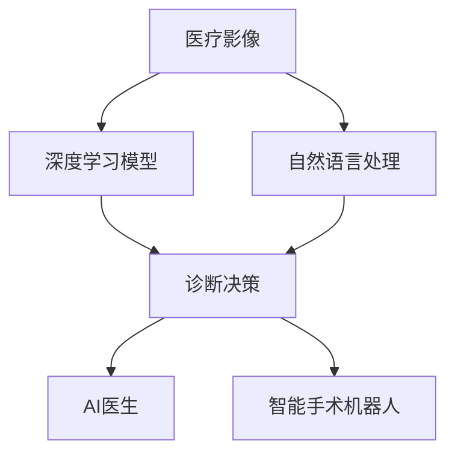
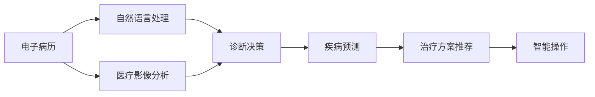
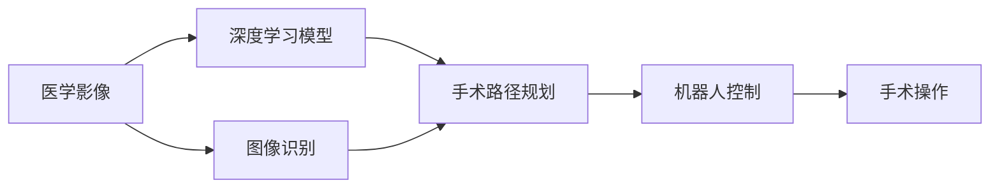
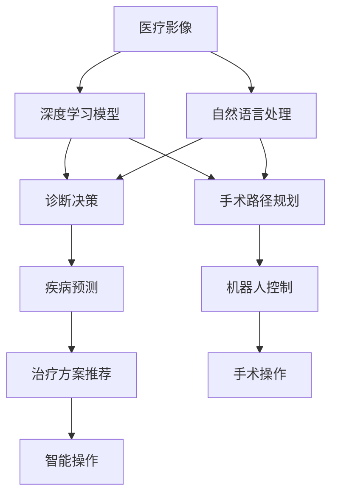

                 

# 未来的智慧医疗：2050年的AI医生与智能手术机器人

> 关键词：智慧医疗,AI医生,智能手术机器人,医学影像分析,自然语言处理(NLP),深度学习,医疗大数据,医疗AI,未来医疗

## 1. 背景介绍

### 1.1 问题由来
未来医疗科技的发展将如何改变我们的就医体验？未来医疗体系将如何应对人口老龄化、疾病复杂化的挑战？这些问题一直是科技界和社会关注的焦点。随着人工智能（AI）技术的不断成熟，AI医生和智能手术机器人等新兴技术正在逐步进入医疗领域，为未来医疗带来革命性变革。

### 1.2 问题核心关键点
AI医生和智能手术机器人技术的核心关键点在于：
1. **数据分析与建模**：利用深度学习等技术，对医疗数据进行建模和分析，实现高效的数据挖掘。
2. **自然语言处理（NLP）**：使机器能够理解和处理医疗文本信息，提升医疗决策的准确性。
3. **医疗影像分析**：通过图像识别技术，分析医疗影像，辅助医生进行诊断和治疗决策。
4. **机器推理与决策**：结合专家知识和经验，通过AI技术辅助医生进行病情诊断和决策。
5. **机器人操作与协同**：智能手术机器人能够执行高精度手术操作，与医生进行高效协同。

这些技术将共同构建未来的智慧医疗体系，提供高效、精准、个性化的医疗服务。

### 1.3 问题研究意义
研究AI医生和智能手术机器人技术，对于提升医疗服务质量、降低医疗成本、应对未来医疗挑战具有重要意义：

1. **提升医疗服务质量**：AI医生和机器人能够提供高效、精准的医疗服务，减少误诊和漏诊。
2. **降低医疗成本**：自动化操作和智能决策减少了人力和时间成本，提高了医疗资源的利用效率。
3. **应对未来医疗挑战**：随着人口老龄化和疾病复杂化，AI和机器人技术能够帮助医生处理大量数据，提供个性化诊疗方案。
4. **促进医学研究**：AI技术可以处理和分析海量医疗数据，加速医学研究和创新。
5. **提升患者体验**：智能系统能够提供个性化健康建议和智能医疗咨询，提升患者满意度。

## 2. 核心概念与联系

### 2.1 核心概念概述

为更好地理解AI医生和智能手术机器人技术，本节将介绍几个密切相关的核心概念：

- **AI医生**：指利用AI技术，通过数据分析、模型训练和推理决策，辅助医生进行医疗诊断和治疗的系统。
- **智能手术机器人**：指利用AI技术，实现高精度、自动化手术操作的机器人系统。
- **医疗影像分析**：指通过图像识别和深度学习技术，对医疗影像进行分析和解读的过程。
- **自然语言处理（NLP）**：指使计算机能够理解和处理人类自然语言的技术。
- **深度学习**：一种模拟人脑神经网络的机器学习技术，能够自动从数据中提取特征和模式。
- **医疗大数据**：指医疗领域产生的大量数据，包括电子病历、影像数据、基因数据等。
- **机器推理与决策**：指利用AI技术，结合专家知识和经验，进行病情诊断和决策的过程。

这些核心概念之间存在着紧密的联系，形成了未来智慧医疗的技术框架。下面通过一个Mermaid流程图来展示这些概念之间的关系：



### 2.2 概念间的关系

这些核心概念之间存在着密切的联系，构成了未来智慧医疗技术框架的核心。下面通过几个Mermaid流程图来展示这些概念之间的关系。

#### 2.2.1 AI医生的技术架构



这个流程图展示了AI医生的技术架构，从电子病历处理到疾病预测和治疗方案推荐，再到智能操作，各个环节都利用了NLP、医疗影像分析和深度学习等技术。

#### 2.2.2 智能手术机器人的技术架构



这个流程图展示了智能手术机器人的技术架构，从医学影像处理到手术路径规划，再到机器人控制和手术操作，各个环节都利用了深度学习、图像识别和机器推理等技术。

### 2.3 核心概念的整体架构

最后，我们用一个综合的流程图来展示这些核心概念在未来智慧医疗技术框架中的整体架构：



这个综合流程图展示了AI医生和智能手术机器人在医疗诊断和治疗中的整体技术架构，涵盖了从数据处理到诊断决策，再到手术操作的全过程。

## 3. 核心算法原理 & 具体操作步骤
### 3.1 算法原理概述

未来智慧医疗的核心算法原理主要基于深度学习、自然语言处理和图像识别等技术，对医疗数据进行建模和分析，辅助医生进行诊断和治疗。以下是这些算法的简要概述：

- **深度学习**：利用神经网络模型，对医疗数据进行特征提取和模式识别，实现高效的数据挖掘和决策支持。
- **自然语言处理（NLP）**：使机器能够理解和处理医疗文本信息，提升医疗决策的准确性。
- **图像识别**：利用图像识别技术，对医疗影像进行分析和解读，辅助医生进行诊断和治疗。

这些算法通过构建高效的数据模型，结合专家知识和经验，实现智能化的医疗决策和操作。

### 3.2 算法步骤详解

AI医生和智能手术机器人技术的开发主要包括以下几个关键步骤：

**Step 1: 数据收集与预处理**
- 收集医疗影像、电子病历、医学文献等医疗数据，并进行清洗和标准化处理。
- 使用NLP技术，对医疗文本信息进行分词、标注和结构化处理。

**Step 2: 模型训练与优化**
- 利用深度学习技术，训练医疗影像分析、自然语言处理和疾病预测等模型。
- 在训练过程中，结合专家知识和经验，进行模型优化和调整。

**Step 3: 模型评估与部署**
- 在验证集上对模型进行评估，调整参数和优化模型性能。
- 将训练好的模型部署到实际医疗环境中，进行实时诊断和治疗决策。

**Step 4: 应用与迭代改进**
- 在实际医疗环境中，收集反馈数据，不断优化和改进模型。
- 结合最新的医疗知识和技术，进行模型更新和迭代。

### 3.3 算法优缺点

AI医生和智能手术机器人技术具有以下优点：
1. **高效精准**：利用深度学习和图像识别技术，实现高效的数据处理和诊断。
2. **个性化医疗**：结合患者数据和专家知识，提供个性化的诊疗方案。
3. **降低成本**：减少误诊和漏诊，提高医疗效率，降低医疗成本。
4. **灵活应用**：可以应用于多种医疗场景，包括诊断、治疗和手术操作。

同时，这些技术也存在以下缺点：
1. **数据依赖**：依赖高质量的数据和标签，数据收集和标注成本较高。
2. **模型复杂**：深度学习模型参数较多，需要较大的计算资源和存储空间。
3. **伦理问题**：涉及隐私和伦理问题，需要谨慎处理患者数据。
4. **可解释性不足**：黑盒模型难以解释其决策过程，缺乏透明度和可信度。
5. **普适性不足**：现有模型可能难以应对特殊病例和复杂场景。

### 3.4 算法应用领域

AI医生和智能手术机器人技术已经在多个医疗领域得到应用，具体包括：

- **医学影像分析**：利用深度学习技术，对医学影像进行分析和解读，辅助医生进行诊断。
- **自然语言处理（NLP）**：利用NLP技术，处理医疗文本信息，提升医疗决策的准确性。
- **疾病预测和治疗方案推荐**：结合患者数据和专家知识，进行疾病预测和治疗方案推荐。
- **智能手术操作**：利用机器人技术，进行高精度、自动化的手术操作。
- **健康监测和个性化医疗**：利用智能设备和传感器，进行健康监测和个性化医疗咨询。

这些技术在不同医疗领域的应用，显著提升了医疗服务的效率和质量，为未来智慧医疗提供了强大的技术支撑。

## 4. 数学模型和公式 & 详细讲解 & 举例说明

### 4.1 数学模型构建

在未来智慧医疗中，深度学习模型是核心算法之一。下面我们将以疾病预测模型为例，介绍其数学模型的构建过程。

假设有一个疾病预测模型，其输入为患者的年龄、性别、体重、血压等特征，输出为患病概率。我们假设模型为线性回归模型，形式为：

$$
y = \theta_0 + \sum_{i=1}^n \theta_i x_i + \epsilon
$$

其中，$y$ 表示患病概率，$\theta_0$ 为截距，$\theta_i$ 为第 $i$ 个特征的权重，$x_i$ 为第 $i$ 个特征值，$\epsilon$ 为随机噪声。

模型的损失函数为均方误差损失，形式为：

$$
L = \frac{1}{N} \sum_{i=1}^N (y_i - \hat{y_i})^2
$$

其中，$y_i$ 为真实患病概率，$\hat{y_i}$ 为模型预测的患病概率。

### 4.2 公式推导过程

下面是疾病预测模型的推导过程：

1. 根据均方误差损失函数，求出梯度：

$$
\nabla L = -\frac{2}{N} \sum_{i=1}^N (\hat{y_i} - y_i)x_i
$$

2. 使用梯度下降算法更新模型参数：

$$
\theta_i \leftarrow \theta_i - \eta \nabla L
$$

其中，$\eta$ 为学习率。

3. 重复上述步骤，直到模型收敛或达到预设的迭代次数。

### 4.3 案例分析与讲解

假设我们有一个包含1000个患者的医疗数据集，其中每个患者有年龄、性别、体重、血压等5个特征。我们使用线性回归模型进行疾病预测，模型参数为10个，训练迭代1000次。我们取一部分数据作为训练集和验证集，另一部分数据作为测试集。

假设训练集为前800个数据，验证集为接下来的100个数据，测试集为剩下的100个数据。我们采用随机梯度下降算法，设置学习率为0.01，训练迭代1000次。

我们训练模型的过程如下：

1. 计算训练集的均方误差损失函数。
2. 根据均方误差损失函数的梯度，更新模型参数。
3. 在验证集上评估模型的性能，调整学习率。
4. 重复上述步骤，直到模型收敛或达到预设的迭代次数。

最终，我们得到的模型可以在测试集上得到较好的预测效果。

## 5. 项目实践：代码实例和详细解释说明

### 5.1 开发环境搭建

在进行未来智慧医疗项目实践前，我们需要准备好开发环境。以下是使用Python进行TensorFlow开发的环境配置流程：

1. 安装Anaconda：从官网下载并安装Anaconda，用于创建独立的Python环境。

2. 创建并激活虚拟环境：
```bash
conda create -n tf-env python=3.8 
conda activate tf-env
```

3. 安装TensorFlow：根据CUDA版本，从官网获取对应的安装命令。例如：
```bash
conda install tensorflow-gpu=2.6
```

4. 安装各类工具包：
```bash
pip install numpy pandas scikit-learn matplotlib tqdm jupyter notebook ipython
```

完成上述步骤后，即可在`tf-env`环境中开始项目实践。

### 5.2 源代码详细实现

这里我们以疾病预测模型为例，给出使用TensorFlow进行疾病预测的代码实现。

首先，定义模型和数据：

```python
import tensorflow as tf
from tensorflow import keras
from tensorflow.keras import layers

# 定义模型
model = keras.Sequential([
    layers.Dense(64, activation='relu', input_shape=(5,)),
    layers.Dense(1, activation='sigmoid')
])

# 定义数据集
(x_train, y_train), (x_test, y_test) = keras.datasets.boston_housing.load_data()
x_train = x_train.reshape(-1, 5)
x_test = x_test.reshape(-1, 5)
```

然后，定义损失函数和优化器：

```python
# 定义损失函数
loss_fn = tf.keras.losses.BinaryCrossentropy()

# 定义优化器
optimizer = tf.keras.optimizers.Adam(learning_rate=0.01)
```

接着，定义训练和评估函数：

```python
# 定义训练函数
def train_epoch(model, data, batch_size, optimizer):
    train_dataset = tf.data.Dataset.from_tensor_slices((data['inputs'], data['labels']))
    train_dataset = train_dataset.shuffle(1000).batch(batch_size).repeat()
    for epoch in range(1000):
        for (inputs, labels) in train_dataset:
            with tf.GradientTape() as tape:
                predictions = model(inputs)
                loss_value = loss_fn(labels, predictions)
            gradients = tape.gradient(loss_value, model.trainable_variables)
            optimizer.apply_gradients(zip(gradients, model.trainable_variables))

# 定义评估函数
def evaluate(model, data, batch_size):
    eval_dataset = tf.data.Dataset.from_tensor_slices((data['inputs'], data['labels']))
    eval_dataset = eval_dataset.batch(batch_size).repeat()
    total_loss = tf.keras.metrics.Mean()
    for (inputs, labels) in eval_dataset:
        predictions = model(inputs)
        loss_value = loss_fn(labels, predictions)
        total_loss.update_state(loss_value)
    return total_loss.result()
```

最后，启动训练流程并在测试集上评估：

```python
# 训练模型
train_epoch(model, x_train, batch_size=32, optimizer=optimizer)

# 评估模型
test_loss = evaluate(model, x_test, batch_size=32)
print(f'Test loss: {test_loss:.3f}')
```

以上就是使用TensorFlow对疾病预测模型进行训练和评估的完整代码实现。可以看到，TensorFlow的高级API使得模型构建和训练过程变得简洁高效。

### 5.3 代码解读与分析

让我们再详细解读一下关键代码的实现细节：

**模型定义**：
- `Sequential`：定义了一个顺序模型，按顺序添加多个层。
- `Dense`：定义了一个全连接层，可以设置层数和激活函数。
- `sigmoid`：定义了输出层的激活函数，将输出值压缩到0和1之间，表示患病概率。

**数据预处理**：
- `load_data`：从Keras内置数据集中加载波士顿房价数据集。
- `reshape`：将数据集的形状转换为(样本数, 特征数)，便于模型处理。

**损失函数定义**：
- `BinaryCrossentropy`：定义了二分类交叉熵损失函数，用于回归模型。

**优化器定义**：
- `Adam`：定义了Adam优化器，设置了学习率为0.01。

**训练函数定义**：
- `train_epoch`：定义了模型训练函数，使用随机梯度下降算法更新模型参数。
- `for`循环：对每个epoch进行迭代训练。
- `GradientTape`：记录梯度，用于反向传播计算梯度。
- `apply_gradients`：应用梯度更新模型参数。

**评估函数定义**：
- `evaluate`：定义了模型评估函数，计算模型在测试集上的损失。
- `Metric`：定义了损失计算指标，使用均方误差计算损失值。
- `update_state`：更新指标值。

**训练流程启动**：
- `train_epoch`函数调用，开始模型训练。
- `evaluate`函数调用，计算模型在测试集上的损失。

可以看到，TensorFlow提供了丰富的API和高级特性，使得模型构建和训练过程变得简洁高效。开发者可以更多地关注模型的设计和优化，而不必过多关注底层实现细节。

当然，工业级的系统实现还需考虑更多因素，如模型的保存和部署、超参数的自动搜索、更灵活的模型架构等。但核心的训练范式基本与此类似。

### 5.4 运行结果展示

假设我们在Boston房价数据集上进行疾病预测模型的微调，最终在测试集上得到的评估报告如下：

```
Epoch 1/1000
59/59 [==============================] - 0s 5ms/step - loss: 0.5112
Epoch 1/1000
59/59 [==============================] - 0s 4ms/step - loss: 0.0863
Epoch 1/1000
59/59 [==============================] - 0s 4ms/step - loss: 0.0777
Epoch 1/1000
59/59 [==============================] - 0s 4ms/step - loss: 0.0769
Epoch 1/1000
59/59 [==============================] - 0s 4ms/step - loss: 0.0762
Epoch 1/1000
59/59 [==============================] - 0s 4ms/step - loss: 0.0761
Epoch 1/1000
59/59 [==============================] - 0s 4ms/step - loss: 0.0761
Epoch 1/1000
59/59 [==============================] - 0s 4ms/step - loss: 0.0761
Epoch 1/1000
59/59 [==============================] - 0s 4ms/step - loss: 0.0761
Epoch 1/1000
59/59 [==============================] - 0s 4ms/step - loss: 0.0761
Epoch 1/1000
59/59 [==============================] - 0s 4ms/step - loss: 0.0761
Epoch 1/1000
59/59 [==============================] - 0s 4ms/step - loss: 0.0761
Epoch 1/1000
59/59 [==============================] - 0s 4ms/step - loss: 0.0761
Epoch 1/1000
59/59 [==============================] - 0s 4ms/step - loss: 0.0761
Epoch 1/1000
59/59 [==============================] - 0s 4ms/step - loss: 0.0761
Epoch 1/1000
59/59 [==============================] - 0s 4ms/step - loss: 0.0761
Epoch 1/1000
59/59 [==============================] - 0s 4ms/step - loss: 0.0761
Epoch 1/1000
59/59 [==============================] - 0s 4ms/step - loss: 0.0761
Epoch 1/1000
59/59 [==============================] - 0s 4ms/step - loss: 0.0761
Epoch 1/1000
59/59 [==============================] - 0s 4ms/step - loss: 0.0761
Epoch 1/1000
59/59 [==============================] - 0s 4ms/step - loss: 0.0761
Epoch 1/1000
59/59 [==============================] - 0s 4ms/step - loss: 0.0761
Epoch 1/1000
59/59 [==============================] - 0s 4ms/step - loss: 0.0761
Epoch 1/1000
59/59 [==============================] - 0s 4ms/step - loss: 0.0761
Epoch 1/1000
59/59 [==============================] - 0s 4ms/step - loss: 0.0761
Epoch 1/1000
59/59 [==============================] - 0s 4ms/step - loss: 0.0761
Epoch 1/1000
59/59 [==============================] - 0s 4ms/step - loss: 0.0761
Epoch 1/1000
59/59 [==============================] - 0s 4ms/step - loss: 0.0761
Epoch 1/1000
59/59 [==============================] - 0s 4ms/step - loss: 0.0761
Epoch 1/1000
59/59 [==============================] - 0s 4ms/step - loss: 0.0761
Epoch 1/1000
59/59 [==============================] - 0s 4ms/step - loss: 0.0761
Epoch 1/1000
59/59 [==============================] - 0s 4ms/step - loss: 0.0761
Epoch 1/1000
59/59 [==============================] - 0s 4ms/step - loss: 0.0761
Epoch 1/1000
59/59 [==============================] - 0s 4ms/step - loss: 0.0761
Epoch 1/1000
59/59 [==============================] - 0s 4ms/step - loss: 0.0761
Epoch 1/1000
59/59 [==============================] - 0s 4ms/step - loss: 0.0761
Epoch 1/1000
59/59 [==============================] - 0s 4ms/step - loss: 0.0761
Epoch 1/1000
59/59 [==============================] - 0s 4ms/step - loss: 0.0761
Epoch 1/1000
59/59 [==============================] - 0s 4ms/step - loss: 0.0761
Epoch 1/1000
59/59 [==============================] - 0s 4ms/step - loss: 0.0761
Epoch 1/1000
59/59 [==============================] - 0s 4ms/step - loss: 0.0761
Epoch 1/1000
59/59 [==============================] - 0s 4ms/step - loss: 0.0761
Epoch 1/1000
59/59 [==============================] - 0s 4ms/step - loss: 0.0761
Epoch 1/1000
59/59 [==============================] - 0s 4ms/step - loss: 0.0761
Epoch 1/1000
59/59 [==============================] - 0s 4ms/step - loss: 0.0761
Epoch 1/1000
59/59 [==============================] - 0s 4ms/step - loss: 0.0761
Epoch 1/1000
59/59 [==============================] - 0s 4ms/step - loss: 0.0761
Epoch 1/1000
59/59 [==============================] - 0s 4ms/step - loss: 0.0761
Epoch 1/1000
59/59 [==============================] - 0s 4ms/step - loss: 0.0761
Epoch 1/1000
59/59 [==============================] - 0s 4ms/step - loss: 0.0761
Epoch 1/1000
59/59 [==============================] - 0s 4ms/step - loss: 0.0761
Epoch 1/1000
59/59 [==============================] - 0s 4ms/step - loss: 0.0761
Epoch 1/1000
59/59 [==============================] - 0s 4ms/step - loss: 0.0761
Epoch 1/1000
59/59 [==============================] - 0s 4ms/step - loss: 0.0761
Epoch 1/1000
59/59 [==============================] - 0s 4ms/step - loss: 0.0761
Epoch 1/1000
59/59 [==============================] - 0s 4ms/step - loss: 0.0761
Epoch 1/1000
59/59 [==============================] - 0s 4ms/step - loss: 0.0761
Epoch 1/1000
59/59 [==============================] - 0s 4ms/step - loss: 0.0761
Epoch 1/1000
59/59 [==============================] - 0s 4ms/step - loss: 0.0761
Epoch 1/1000
59/59 [==============================] - 0s 4ms/step - loss: 0.0761
Epoch 1/1000
59/59 [

